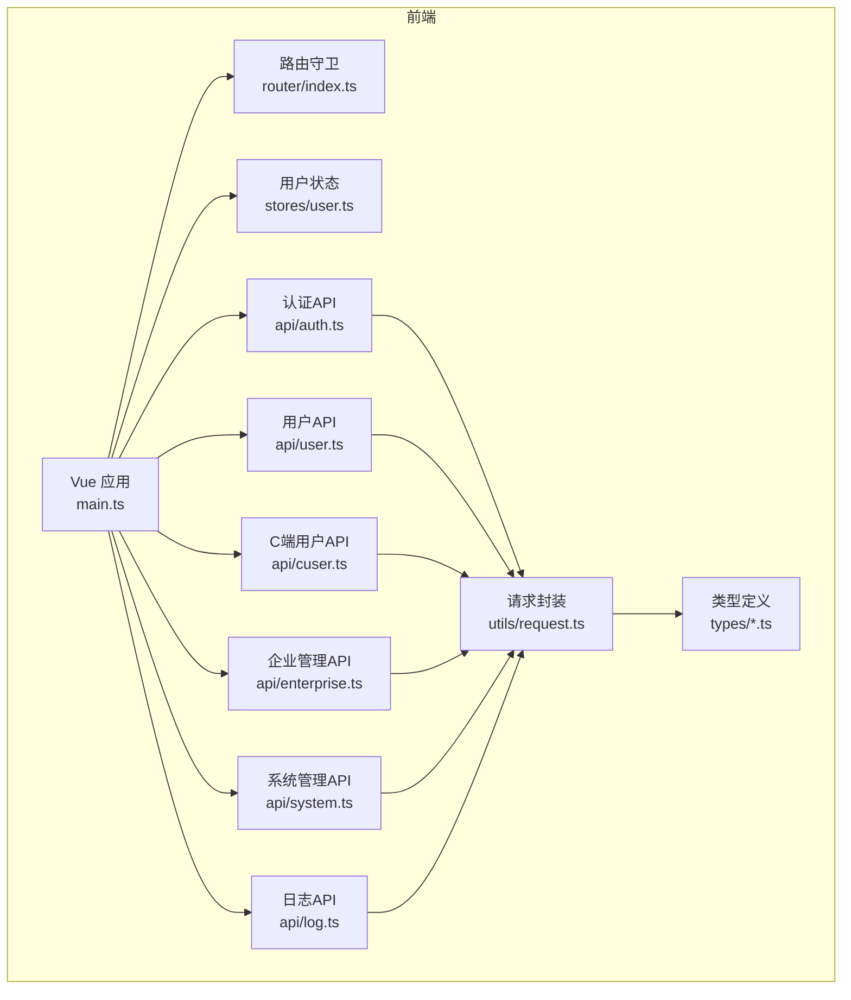
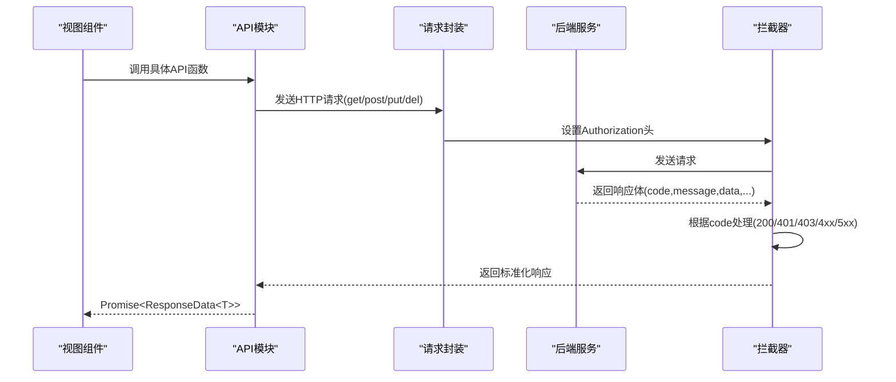
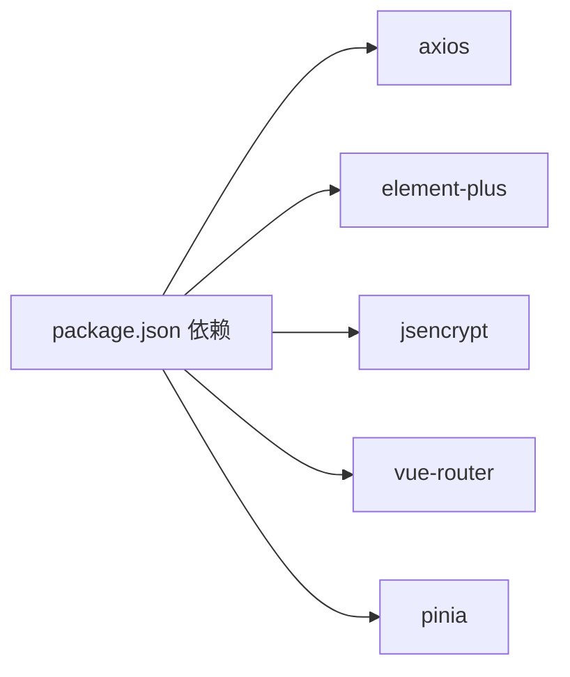
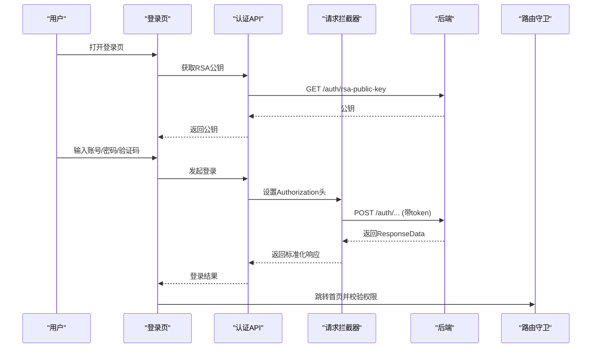

# API接口文档

<cite>
**本文档引用的文件**
- [src/api/index.ts](file://src/api/index.ts)
- [src/api/auth.ts](file://src/api/auth.ts)
- [src/api/user.ts](file://src/api/user.ts)
- [src/api/cuser.ts](file://src/api/cuser.ts)
- [src/api/enterprise.ts](file://src/api/enterprise.ts)
- [src/api/system.ts](file://src/api/system.ts)
- [src/api/log.ts](file://src/api/log.ts)
- [src/types/api.d.ts](file://src/types/api.d.ts)
- [src/types/index.ts](file://src/types/index.ts)
- [src/utils/request.ts](file://src/utils/request.ts)
- [src/router/index.ts](file://src/router/index.ts)
- [src/stores/user.ts](file://src/stores/user.ts)
- [src/views/login/index.vue](file://src/views/login/index.vue)
- [src/views/user/index.vue](file://src/views/user/index.vue)
- [package.json](file://package.json)
</cite>

## 目录
1. [简介](#简介)
2. [项目结构](#项目结构)
3. [核心组件](#核心组件)
4. [架构总览](#架构总览)
5. [详细组件分析](#详细组件分析)
6. [依赖分析](#依赖分析)
7. [性能考虑](#性能考虑)
8. [故障排除指南](#故障排除指南)
9. [结论](#结论)
10. [附录](#附录)

## 简介
本文件为 HC 管理系统的完整 API 接口文档，覆盖认证、用户管理、企业管理、系统管理与日志管理五大模块。文档基于前端代码实现梳理，明确各接口的 HTTP 方法、URL 模式、请求参数、响应格式、状态码与错误处理，并给出认证方式、权限要求与安全建议。

## 项目结构
前端采用 Vue 3 + TypeScript + Element Plus + Axios 构建，API 层通过统一请求封装进行调用，路由层控制鉴权与权限校验，Pinia Store 管理用户态与令牌。

**图表来源**
- [src/main.ts:1-27](file://src/main.ts#L1-L27)
- [src/router/index.ts:1-127](file://src/router/index.ts#L1-L127)
- [src/stores/user.ts:1-152](file://src/stores/user.ts#L1-L152)
- [src/api/auth.ts:1-69](file://src/api/auth.ts#L1-L69)
- [src/api/user.ts:1-59](file://src/api/user.ts#L1-L59)
- [src/api/cuser.ts:1-66](file://src/api/cuser.ts#L1-L66)
- [src/api/enterprise.ts:1-75](file://src/api/enterprise.ts#L1-L75)
- [src/api/system.ts:1-56](file://src/api/system.ts#L1-L56)
- [src/api/log.ts:1-16](file://src/api/log.ts#L1-L16)
- [src/utils/request.ts:1-148](file://src/utils/request.ts#L1-L148)
- [src/types/index.ts:1-188](file://src/types/index.ts#L1-L188)

**章节来源**
- [src/main.ts:1-27](file://src/main.ts#L1-L27)
- [src/router/index.ts:1-127](file://src/router/index.ts#L1-L127)
- [src/stores/user.ts:1-152](file://src/stores/user.ts#L1-L152)
- [src/utils/request.ts:1-148](file://src/utils/request.ts#L1-L148)

## 核心组件
- 请求封装与拦截器：统一设置 Authorization 头、处理 401/403/4xx/5xx 错误、刷新令牌队列与过期处理。
- 路由守卫：根据 requiresAuth 与 permissions 控制页面访问；结合本地存储的权限进行粗粒度校验。
- 用户状态管理：保存 token、用户信息、当前身份信息，支持登出清理与权限查询。

**章节来源**
- [src/utils/request.ts:1-148](file://src/utils/request.ts#L1-L148)
- [src/router/index.ts:82-124](file://src/router/index.ts#L82-L124)
- [src/stores/user.ts:1-152](file://src/stores/user.ts#L1-L152)

## 架构总览
前端通过 API 模块调用后端接口，统一经 Axios 实例发送请求，后端返回标准响应体，前端在拦截器中按 code 进行统一处理。

**图表来源**
- [src/api/auth.ts:22-68](file://src/api/auth.ts#L22-L68)
- [src/api/user.ts:10-58](file://src/api/user.ts#L10-L58)
- [src/utils/request.ts:37-101](file://src/utils/request.ts#L37-L101)

## 详细组件分析

### 认证相关接口
- 基础路径：/auth
- 认证方式：请求头携带 Bearer Token；登录成功后前端将 token 写入本地存储并在后续请求自动附加。
- 安全要点：登录接口支持 RSA 公钥获取与密码加密传输；401 统一触发登出与跳转登录页。

接口清单
- 获取RSA公钥
  - 方法：GET
  - URL：/auth/rsa-public-key
  - 请求参数：无
  - 响应：ResponseData<string>
  - 示例：见“请求示例/响应示例”
  - 错误：401 触发登出流程；4xx/5xx 显示通用错误消息

- C端密码登录
  - 方法：POST
  - URL：/auth/c/password-login
  - 请求体：CPasswordLoginRequest
  - 响应：ResponseData<LoginResponse>
  - 示例：见“请求示例/响应示例”

- C端验证码登录
  - 方法：POST
  - URL：/auth/c/code-login
  - 请求体：CCodeLoginRequest
  - 响应：ResponseData<LoginResponse>
  - 示例：见“请求示例/响应示例”

- B端密码登录
  - 方法：POST
  - URL：/auth/b/password-login
  - 请求体：BPasswordLoginRequest
  - 响应：ResponseData<LoginResponse>
  - 示例：见“请求示例/响应示例”

- B端验证码登录
  - 方法：POST
  - URL：/auth/b/code-login
  - 请求体：BCodeLoginRequest
  - 响应：ResponseData<LoginResponse>
  - 示例：见“请求示例/响应示例”

- 平台管理员登录
  - 方法：POST
  - URL：/auth/platform/login
  - 请求体：PlatformLoginRequest
  - 响应：ResponseData<LoginResponse>
  - 示例：见“请求示例/响应示例”

- 企业校验
  - 方法：POST
  - URL：/auth/b/check-enterprise
  - 请求体：CheckEnterpriseRequest
  - 响应：ResponseData<CheckEnterpriseResponse>
  - 示例：见“请求示例/响应示例”

- 发送验证码
  - 方法：POST
  - URL：/auth/code/send
  - 请求体：SendCodeRequest
  - 响应：ResponseData<string>
  - 示例：见“请求示例/响应示例”

- 切换身份列表
  - 方法：POST
  - URL：/auth/identity-list
  - 请求体：IdentityListRequest
  - 响应：ResponseData<LoginResponse>
  - 示例：见“请求示例/响应示例”

- 选择身份
  - 方法：POST
  - URL：/auth/identity-select
  - 请求体：SelectIdentityRequest
  - 响应：ResponseData<LoginResponse>
  - 示例：见“请求示例/响应示例”

- 登出
  - 方法：POST
  - URL：/auth/logout
  - 请求参数：无
  - 响应：ResponseData<null>
  - 示例：见“请求示例/响应示例”

- 当前用户信息
  - 方法：GET
  - URL：/auth/info
  - 请求参数：无
  - 响应：ResponseData<CurrentUserInfo>
  - 示例：见“请求示例/响应示例”

请求示例
- 获取RSA公钥
  - GET /auth/rsa-public-key
  - 响应示例
    - code: 200
    - data: "-----BEGIN PUBLIC KEY-----\nMIIBI...\n-----END PUBLIC KEY-----"

- C端密码登录
  - POST /auth/c/password-login
  - 请求体示例
    - account: "test@example.com"
    - password: "加密后的密码"
  - 响应示例
    - code: 200
    - data: LoginResponse（含 token、userType、身份信息等）

- 发送验证码
  - POST /auth/code/send
  - 请求体示例
    - target: "13800001111 或 test@example.com"
    - scene: "login"

常见使用场景
- 登录页：先获取RSA公钥，对密码加密后再发起登录；登录成功后保存 token 并跳转首页。
- 企业校验：在 B 端登录时输入企业编码，调用企业校验接口显示企业名称。
- 验证码登录：在登录页切换验证码模式，先发送验证码，再提交验证码完成登录。

**章节来源**
- [src/api/auth.ts:22-68](file://src/api/auth.ts#L22-L68)
- [src/types/api.d.ts:1-50](file://src/types/api.d.ts#L1-L50)
- [src/types/index.ts:18-64](file://src/types/index.ts#L18-L64)
- [src/views/login/index.vue:147-158](file://src/views/login/index.vue#L147-L158)

### 用户管理接口
- 基础路径：/user
- 权限要求：部分接口需具备 user:list 等权限（由路由元信息声明）

接口清单
- 查询用户列表
  - 方法：GET
  - URL：/user/list
  - 响应：ResponseData<UserResponse[]>

- 根据ID查询用户
  - 方法：GET
  - URL：/user/get/{id}
  - 响应：ResponseData<UserResponse>

- 分页查询用户
  - 方法：GET
  - URL：/user/page
  - 查询参数：pageNum, pageSize, username?, name?, phone?
  - 响应：ResponseData<PageResult<UserResponse>>

- 新增用户
  - 方法：POST
  - URL：/user/add
  - 请求体：UserRequest
  - 响应：ResponseData<UserResponse>

- 编辑用户
  - 方法：PUT
  - URL：/user/edit/{id}
  - 请求体：UserRequest
  - 响应：ResponseData<UserResponse>

- 删除用户
  - 方法：DELETE
  - URL：/user/delete/{id}
  - 响应：ResponseData<null>

- 分配角色
  - 方法：POST
  - URL：/user/assign-roles
  - 请求体：AssignRolesRequest
  - 响应：ResponseData<null>

- 导出用户（同步）
  - 方法：GET
  - URL：/user/export
  - 响应：ResponseData

- 导出用户（异步）
  - 方法：POST
  - URL：/user/export-async
  - 响应：ResponseData<string>（返回任务ID）

- 查询导出任务状态
  - 方法：GET
  - URL：/user/export-async/status/{taskId}
  - 响应：ResponseData<ExcelTaskStatus>

- 下载导出文件
  - 方法：GET
  - URL：/user/export-async/download/{taskId}
  - 响应：文件流

请求示例
- 分页查询用户
  - GET /user/page?pageNum=1&pageSize=10&username=&name=&phone=
  - 响应示例
    - code: 200
    - data: PageResult<UserResponse>

- 分配角色
  - POST /user/assign-roles
  - 请求体示例
    - userId: 1
    - roleIds: [1,2,3]

常见使用场景
- 用户列表页：分页查询用户，支持按用户名/姓名/手机号筛选；支持新增、编辑、删除与角色分配。
- 导出功能：支持同步导出与异步导出，异步导出通过任务ID轮询状态并下载文件。

**章节来源**
- [src/api/user.ts:10-58](file://src/api/user.ts#L10-L58)
- [src/types/api.d.ts:51-64](file://src/types/api.d.ts#L51-L64)
- [src/types/index.ts:66-75](file://src/types/index.ts#L66-L75)
- [src/views/user/index.vue:45-200](file://src/views/user/index.vue#L45-L200)

### 企业管理接口
- 基础路径：/enterprise
- 权限要求：需具备 enterprise:list 等权限

接口清单
- 根据ID查询企业
  - 方法：GET
  - URL：/enterprise/get/{id}
  - 响应：ResponseData<EnterpriseResponse>

- 新增企业
  - 方法：POST
  - URL：/enterprise/add
  - 请求体：EnterpriseCreateRequest
  - 响应：ResponseData<EnterpriseResponse>

- 编辑企业
  - 方法：PUT
  - URL：/enterprise/edit/{id}
  - 请求体：EnterpriseUpdateRequest
  - 响应：ResponseData<EnterpriseResponse>

- 更新企业安全设置
  - 方法：PUT
  - URL：/enterprise/security/{id}
  - 请求体：SecuritySettingRequest
  - 响应：ResponseData<null>

- 新增企业用户
  - 方法：POST
  - URL：/enterprise/user/add
  - 请求体：EnterpriseUserCreateRequest
  - 响应：ResponseData<EnterpriseUserResponse>

- 编辑企业用户
  - 方法：PUT
  - URL：/enterprise/user/edit/{id}
  - 请求体：EnterpriseUserCreateRequest
  - 响应：ResponseData<EnterpriseUserResponse>

- 删除企业用户
  - 方法：DELETE
  - URL：/enterprise/user/delete/{id}
  - 响应：ResponseData<null>

- 重置企业用户密码
  - 方法：PUT
  - URL：/enterprise/user/{id}/reset-password
  - 请求体：ResetEnterpriseUserPasswordRequest
  - 响应：ResponseData<null>

- 启用企业用户
  - 方法：POST
  - URL：/enterprise/user/{id}/activate
  - 响应：ResponseData<null>

- 更新企业用户状态
  - 方法：PUT
  - URL：/enterprise/user/{id}/status
  - 请求体：{ key: number }
  - 响应：ResponseData<null>

- 分页查询企业用户
  - 方法：GET
  - URL：/enterprise/user/page
  - 查询参数：pageNum, pageSize, enterpriseId?, username?, name?, status?
  - 响应：ResponseData<PageResult<EnterpriseUserResponse>>

- 强制修改密码
  - 方法：PUT
  - URL：/enterprise/user/force-change-password
  - 请求体：ResetEnterpriseUserPasswordRequest
  - 响应：ResponseData<null>

- 修改企业用户密码
  - 方法：PUT
  - URL：/enterprise/user/change-password
  - 请求体：ChangePasswordRequest
  - 响应：ResponseData<null>

请求示例
- 新增企业
  - POST /enterprise/add
  - 请求体示例
    - name: "示例企业"
    - contactPerson: "张三"
    - contactPhone: "13800001111"
    - contactEmail: "contact@example.com"
    - address: "北京市朝阳区..."
    - validDate: "2025-12-31"

- 分页查询企业用户
  - GET /enterprise/user/page?pageNum=1&pageSize=10&enterpriseId=1&username=&name=&status=
  - 响应示例
    - code: 200
    - data: PageResult<EnterpriseUserResponse>

常见使用场景
- 企业信息维护：支持新增/编辑企业基本信息与安全策略（IP 白名单、互斥登录、密码规则）。
- 企业用户管理：支持新增/编辑/删除企业用户，重置密码、启用、状态变更与分页查询。

**章节来源**
- [src/api/enterprise.ts:17-74](file://src/api/enterprise.ts#L17-L74)
- [src/types/api.d.ts:102-136](file://src/types/api.d.ts#L102-L136)
- [src/types/index.ts:90-116](file://src/types/index.ts#L90-L116)

### 系统管理接口
- 基础路径：/sys 与 /permission
- 权限要求：需具备 role:list、permission:list 等权限

接口清单
- 角色管理
  - 查询角色列表：GET /sys/role/list
  - 根据ID查询角色：GET /sys/role/get/{id}
  - 新增角色：POST /sys/role/add
  - 编辑角色：PUT /sys/role/edit/{id}
  - 删除角色：DELETE /sys/role/delete/{id}
  - 分配权限：POST /sys/role/assign-permissions

- 权限管理
  - 查询权限列表：GET /permission/list
  - 根据ID查询权限：GET /permission/get/{id}
  - 新增权限：POST /permission/add
  - 编辑权限：PUT /permission/edit/{id}
  - 删除权限：DELETE /permission/delete/{id}
  - 初始化权限缓存：POST /permission/init

请求示例
- 分配角色权限
  - POST /sys/role/assign-permissions
  - 请求体示例
    - roleId: 1
    - permissionIds: [1,2,3]

- 初始化权限缓存
  - POST /permission/init
  - 响应示例
    - code: 200
    - data: null

常见使用场景
- 角色与权限体系：通过角色集中管理权限集合，权限可按树形结构维护，支持初始化缓存提升性能。

**章节来源**
- [src/api/system.ts:9-55](file://src/api/system.ts#L9-L55)
- [src/types/api.d.ts:138-155](file://src/types/api.d.ts#L138-L155)
- [src/types/index.ts:118-136](file://src/types/index.ts#L118-L136)

### 日志接口
- 基础路径：/log
- 权限要求：需具备 log:list 等权限

接口清单
- 登录日志分页查询
  - 方法：GET
  - URL：/log/login/page
  - 查询参数：pageNum, pageSize, userType?, userId?
  - 响应：ResponseData<PageResult<LoginLogResponse>>

请求示例
- 登录日志分页
  - GET /log/login/page?pageNum=1&pageSize=20&userType=&userId=
  - 响应示例
    - code: 200
    - data: PageResult<LoginLogResponse>

常见使用场景
- 审计与追踪：通过分页查询登录日志，定位用户登录行为与异常。

**章节来源**
- [src/api/log.ts:8-15](file://src/api/log.ts#L8-L15)
- [src/types/index.ts:138-149](file://src/types/index.ts#L138-L149)

### C端用户接口（个人中心）
- 基础路径：/cuser
- 权限要求：需登录态

接口清单
- 注册C端用户
  - 方法：POST
  - URL：/cuser/register
  - 请求体：CUserRegisterRequest
  - 响应：ResponseData<CUserResponse>

- 重置C端用户密码
  - 方法：POST
  - URL：/cuser/reset-password
  - 请求体：ResetPasswordRequest
  - 响应：ResponseData<null>

- 获取C端用户资料
  - 方法：GET
  - URL：/cuser/profile
  - 响应：ResponseData<CUserResponse>

- 更新C端用户资料
  - 方法：PUT
  - URL：/cuser/profile
  - 请求体：UpdateProfileRequest
  - 响应：ResponseData<CUserResponse>

- 修改C端用户密码
  - 方法：PUT
  - URL：/cuser/password
  - 请求体：ChangePasswordRequest
  - 响应：ResponseData<null>

- 修改C端用户手机
  - 方法：PUT
  - URL：/cuser/phone
  - 请求体：ChangePhoneRequest
  - 响应：ResponseData<null>

- 修改C端用户邮箱
  - 方法：PUT
  - URL：/cuser/email
  - 请求体：ChangeEmailRequest
  - 响应：ResponseData<null>

- 查询第三方绑定
  - 方法：GET
  - URL：/cuser/third-party
  - 响应：ResponseData<CUserThirdPartyResponse[]>

- 解绑第三方账号
  - 方法：POST
  - URL：/cuser/third-party/unbind
  - 请求体：UnbindThirdPartyRequest
  - 响应：ResponseData<null>

- 查询登录记录
  - 方法：GET
  - URL：/cuser/login-records
  - 查询参数：pageNum, pageSize, userType?, userId?
  - 响应：ResponseData<PageResult<LoginLogResponse>>

- 全部设备退出
  - 方法：POST
  - URL：/cuser/logout-all
  - 响应：ResponseData<null>

- 设置默认身份
  - 方法：PUT
  - URL：/cuser/identity-default
  - 请求体：SetIdentityDefaultRequest
  - 响应：ResponseData<null>

请求示例
- 更新个人资料
  - PUT /cuser/profile
  - 请求体示例
    - nickname: "昵称"
    - avatar: "头像URL"
    - gender: 1
    - birthday: "1990-01-01"

- 修改密码
  - PUT /cuser/password
  - 请求体示例
    - oldPassword: "旧密码"
    - newPassword: "新密码"

常见使用场景
- 个人中心：支持资料修改、密码与手机/邮箱修改、第三方账号解绑、登录记录查询与全部设备退出。

**章节来源**
- [src/api/cuser.ts:14-65](file://src/api/cuser.ts#L14-L65)
- [src/types/api.d.ts:66-100](file://src/types/api.d.ts#L66-L100)
- [src/types/index.ts:77-88](file://src/types/index.ts#L77-L88)
- [src/types/index.ts:182-187](file://src/types/index.ts#L182-L187)

## 依赖分析
- Axios：统一请求客户端，支持超时、跨域与请求/响应拦截。
- Element Plus：UI 组件库，用于消息提示与弹窗交互。
- jsencrypt：RSA 加密库，用于登录密码加密。
- 路由与权限：通过路由元信息声明 requiresAuth 与 permissions，结合 Pinia store 的权限数组进行校验。

**图表来源**
- [package.json:13-22](file://package.json#L13-L22)

**章节来源**
- [package.json:13-22](file://package.json#L13-L22)

## 性能考虑
- 请求超时：默认 30 秒，避免长时间挂起。
- 令牌刷新：拦截器中存在刷新标记与等待队列逻辑，避免重复刷新。
- 分页查询：用户与企业用户均支持分页，建议合理设置 pageNum 与 pageSize。
- 导出异步：大体量数据导出采用异步任务，通过任务ID轮询状态，避免阻塞。

[本节为通用指导，不直接分析具体文件]

## 故障排除指南
- 401 未授权/登录过期
  - 行为：弹出确认框，清除本地 token 与用户信息，跳转登录页。
  - 触发：响应 code 为 401 或请求头 token 失效。
  - 处理：重新登录后重试。

- 403 禁止访问
  - 行为：提示“没有权限访问该资源”，阻止继续操作。
  - 触发：后端返回 403 或前端路由守卫判定无权限。
  - 处理：确认当前用户是否具备所需权限。

- 400 参数错误
  - 行为：提示“请求参数错误”。
  - 处理：检查请求体字段与类型。

- 404 资源不存在
  - 行为：提示“请求的资源不存在”。

- 500 服务器内部错误
  - 行为：提示“服务器内部错误”。

- 网络错误
  - 行为：提示“网络连接失败，请检查网络”或“请求配置错误”。

**章节来源**
- [src/utils/request.ts:50-101](file://src/utils/request.ts#L50-L101)
- [src/router/index.ts:82-124](file://src/router/index.ts#L82-L124)

## 结论
本接口文档基于前端实现梳理，覆盖认证、用户、企业、系统与日志五大模块。建议后端在响应中严格遵循统一的 ResponseData 结构，前端在拦截器中保持一致的错误处理策略，确保用户体验与安全性。

[本节为总结性内容，不直接分析具体文件]

## 附录

### 统一响应结构
- 成功：code=200，data 为业务数据
- 失败：code≠200，message 为错误描述
- 通用字段：code, message, data, timestamp, path

**章节来源**
- [src/types/index.ts:1-7](file://src/types/index.ts#L1-L7)

### 认证与权限流程

**图表来源**
- [src/views/login/index.vue:147-158](file://src/views/login/index.vue#L147-L158)
- [src/api/auth.ts:22-68](file://src/api/auth.ts#L22-L68)
- [src/utils/request.ts:37-101](file://src/utils/request.ts#L37-L101)
- [src/router/index.ts:82-124](file://src/router/index.ts#L82-L124)