# C端用户接口

<cite>
**本文档引用的文件**
- [cuser.ts](file://src/api/cuser.ts)
- [auth.ts](file://src/api/auth.ts)
- [index.ts](file://src/api/index.ts)
- [request.ts](file://src/utils/request.ts)
- [user.ts](file://src/stores/user.ts)
- [index.ts](file://src/router/index.ts)
- [api.d.ts](file://src/types/api.d.ts)
- [index.ts](file://src/types/index.ts)
- [profile/index.vue](file://src/views/profile/index.vue)
- [login/index.vue](file://src/views/login/index.vue)
- [默认模块.md](file://默认模块.md)
</cite>

## 目录
1. [简介](#简介)
2. [项目结构](#项目结构)
3. [核心组件](#核心组件)
4. [架构概览](#架构概览)
5. [详细组件分析](#详细组件分析)
6. [依赖关系分析](#依赖关系分析)
7. [性能考虑](#性能考虑)
8. [故障排除指南](#故障排除指南)
9. [结论](#结论)
10. [附录](#附录)

## 简介

本文件详细记录了HC管理系统中面向C端用户（个人用户）的专用接口。C端用户是指独立使用系统的个人用户，区别于B端企业用户和平台管理员用户。系统通过统一的身份认证机制，为不同类型的用户提供了相应的功能接口和服务。

C端用户接口涵盖了用户注册、个人信息管理、账户安全设置、第三方账号绑定、登录行为追踪等多个方面，形成了完整的个人用户服务体系。

## 项目结构

HC管理系统采用前后端分离架构，前端使用Vue 3 + TypeScript构建，后端提供RESTful API服务。C端用户接口主要分布在以下模块中：

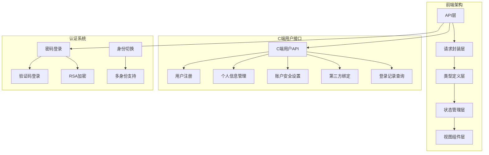

**图表来源**
- [cuser.ts:1-66](file://src/api/cuser.ts#L1-L66)
- [auth.ts:1-69](file://src/api/auth.ts#L1-L69)
- [request.ts:1-148](file://src/utils/request.ts#L1-L148)

**章节来源**
- [cuser.ts:1-66](file://src/api/cuser.ts#L1-L66)
- [auth.ts:1-69](file://src/api/auth.ts#L1-L69)
- [index.ts:1-7](file://src/api/index.ts#L1-L7)

## 核心组件

### C端用户API模块

C端用户API模块是整个C端用户体系的核心，提供了完整的用户生命周期管理能力。该模块通过统一的HTTP请求封装，实现了与后端服务的稳定通信。

### 请求拦截器

系统内置了完善的请求拦截器机制，负责处理认证令牌、错误处理、状态码转换等核心功能：

- **认证令牌注入**：自动在请求头中添加Authorization字段
- **错误状态处理**：统一处理401、403、404等HTTP状态码
- **响应数据标准化**：将后端返回的业务数据转换为统一格式

### 类型定义系统

系统采用TypeScript强类型设计，确保接口调用的安全性和可维护性：

- **响应数据结构**：统一的ResponseData<T>泛型结构
- **分页查询接口**：PageResult<T>标准分页数据结构
- **用户信息模型**：CUserInfo、BUserInfo等用户信息类型

**章节来源**
- [request.ts:37-101](file://src/utils/request.ts#L37-L101)
- [api.d.ts:1-156](file://src/types/api.d.ts#L1-L156)
- [index.ts:1-188](file://src/types/index.ts#L1-L188)

## 架构概览

系统采用分层架构设计，各层职责明确，耦合度低，便于维护和扩展：

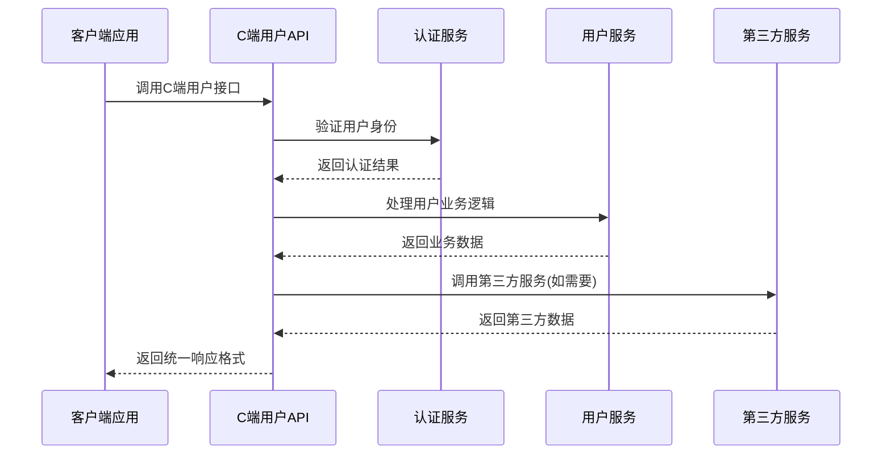

**图表来源**
- [cuser.ts:14-65](file://src/api/cuser.ts#L14-L65)
- [auth.ts:26-68](file://src/api/auth.ts#L26-L68)

### 数据流架构

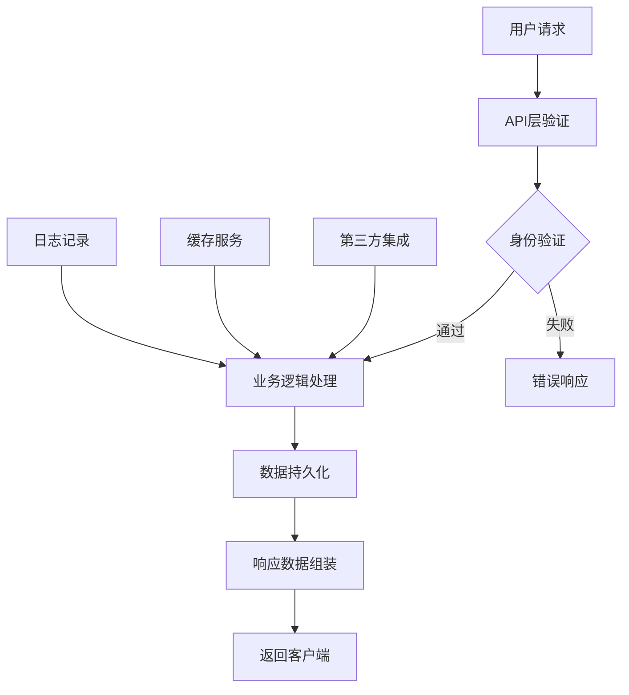

**图表来源**
- [user.ts:41-60](file://src/stores/user.ts#L41-L60)
- [request.ts:50-101](file://src/utils/request.ts#L50-L101)

## 详细组件分析

### 用户注册接口

用户注册是C端用户接入系统的第一步，系统提供了灵活的注册方式以满足不同用户需求。

#### 注册流程

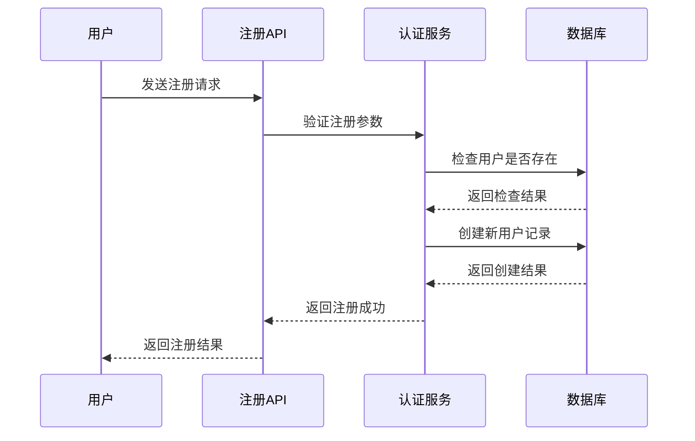

**图表来源**
- [cuser.ts:14-16](file://src/api/cuser.ts#L14-L16)
- [api.d.ts:66-71](file://src/types/api.d.ts#L66-L71)

#### 支持的注册方式

系统支持多种注册方式，包括传统密码注册和基于验证码的快速注册：

| 注册方式 | 适用场景 | 参数要求 | 安全特性 |
|---------|---------|----------|----------|
| 密码注册 | 新用户首次注册 | 手机号/邮箱/用户名 + 密码 | RSA加密传输 |
| 验证码注册 | 快速注册场景 | 手机号/邮箱 + 验证码 | 短信/邮件验证 |

**章节来源**
- [cuser.ts:14-20](file://src/api/cuser.ts#L14-L20)
- [auth.ts:58-60](file://src/api/auth.ts#L58-L60)

### 个人信息管理

个人信息管理是C端用户最常用的功能之一，涵盖了用户基本信息的查看、编辑和安全设置。

#### 个人信息数据模型

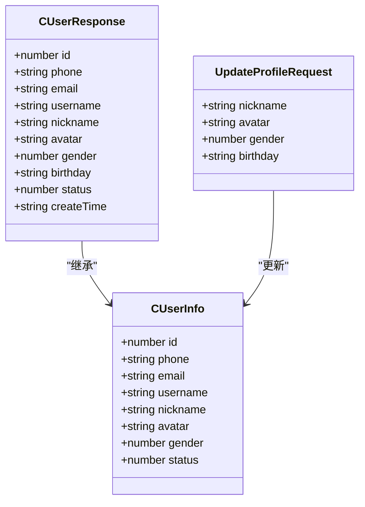

**图表来源**
- [index.ts:34-88](file://src/types/index.ts#L34-L88)
- [api.d.ts:78-83](file://src/types/api.d.ts#L78-L83)

#### 信息更新流程

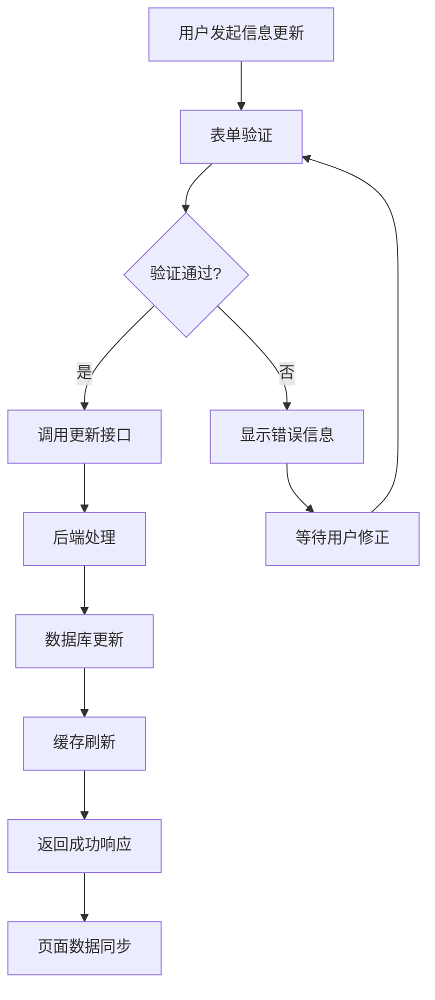

**图表来源**
- [cuser.ts:26-28](file://src/api/cuser.ts#L26-L28)
- [profile/index.vue:56-73](file://src/views/profile/index.vue#L56-L73)

**章节来源**
- [cuser.ts:22-28](file://src/api/cuser.ts#L22-L28)
- [profile/index.vue:36-73](file://src/views/profile/index.vue#L36-L73)

### 账户安全设置

账户安全是C端用户接口的重要组成部分，提供了密码修改、手机号更换、邮箱更新等功能。

#### 密码安全管理

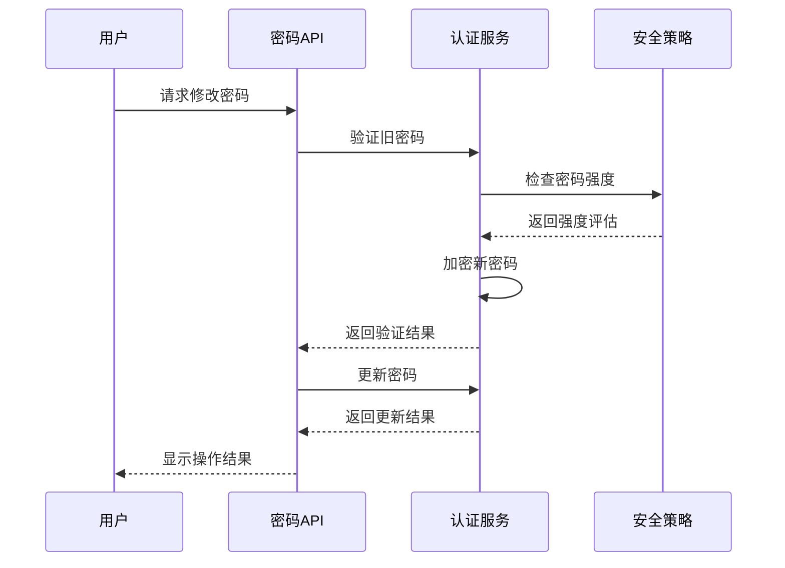

**图表来源**
- [cuser.ts:30-32](file://src/api/cuser.ts#L30-L32)
- [api.d.ts:85-88](file://src/types/api.d.ts#L85-L88)

#### 安全策略

系统实施了多层次的安全策略来保护用户账户安全：

- **密码强度验证**：确保新密码符合安全要求
- **旧密码校验**：防止未授权的密码修改
- **RSA加密传输**：保护密码在传输过程中的安全
- **操作日志记录**：记录重要的安全操作

**章节来源**
- [cuser.ts:30-40](file://src/api/cuser.ts#L30-L40)
- [login/index.vue:104-106](file://src/views/login/index.vue#L104-L106)

### 第三方账号绑定

第三方账号绑定功能允许用户将C端账户与微信、支付宝、QQ等第三方平台进行关联，提供更加便捷的登录体验。

#### 绑定流程

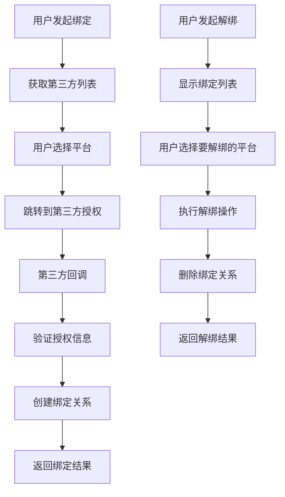

**图表来源**
- [cuser.ts:42-48](file://src/api/cuser.ts#L42-L48)
- [index.ts:182-187](file://src/types/index.ts#L182-L187)

#### 支持的第三方平台

系统目前支持以下第三方平台的绑定：

| 平台名称 | 平台标识 | 功能特性 |
|---------|---------|----------|
| 微信 | wechat | 一键登录、消息推送 |
| 支付宝 | alipay | 生活号登录、支付能力 |
| QQ | qq | 快捷登录、社交分享 |

**章节来源**
- [cuser.ts:42-48](file://src/api/cuser.ts#L42-L48)
- [index.ts:182-187](file://src/types/index.ts#L182-L187)

### 登录行为追踪

系统提供了完整的登录行为追踪功能，帮助用户了解自己的登录历史和设备使用情况。

#### 登录记录查询

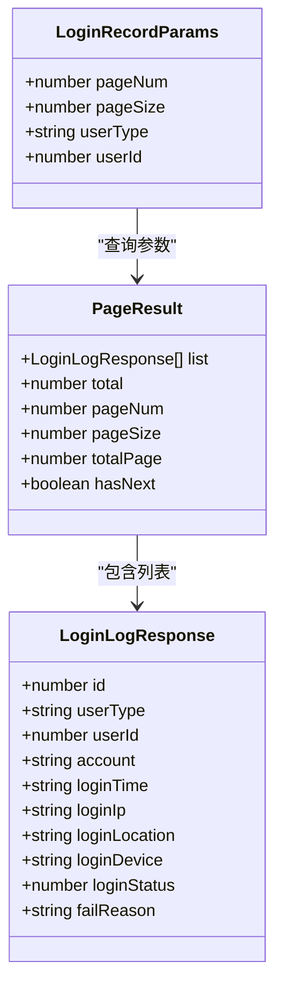

**图表来源**
- [index.ts:138-149](file://src/types/index.ts#L138-L149)
- [cuser.ts:50-57](file://src/api/cuser.ts#L50-L57)

#### 查询参数说明

| 参数名称 | 类型 | 是否必需 | 说明 |
|---------|------|----------|------|
| pageNum | number | 是 | 当前页码（从1开始） |
| pageSize | number | 是 | 每页条数 |
| userType | string | 否 | 用户类型：C/B/P |
| userId | number | 否 | 用户ID |

**章节来源**
- [cuser.ts:50-57](file://src/api/cuser.ts#L50-L57)
- [index.ts:138-149](file://src/types/index.ts#L138-L149)

### 设备管理

系统提供了设备管理功能，允许用户查看和管理当前登录的设备信息。

#### 设备管理功能

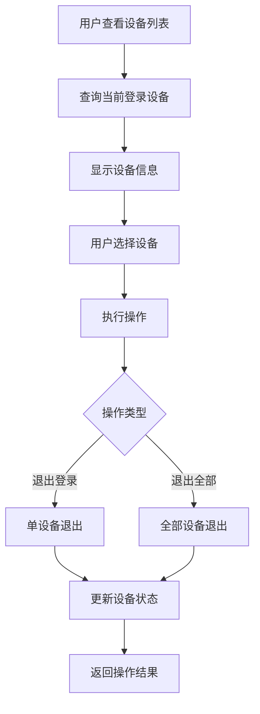

**图表来源**
- [cuser.ts:59-61](file://src/api/cuser.ts#L59-L61)

**章节来源**
- [cuser.ts:59-61](file://src/api/cuser.ts#L59-L61)

## 依赖关系分析

### 模块间依赖关系

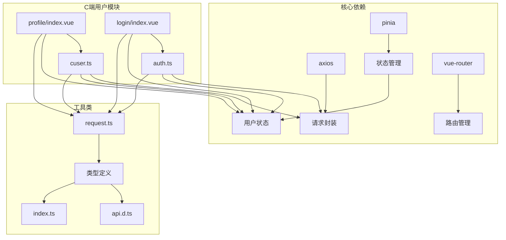

**图表来源**
- [package.json:13-23](file://package.json#L13-L23)
- [cuser.ts:1-12](file://src/api/cuser.ts#L1-L12)
- [auth.ts:1-8](file://src/api/auth.ts#L1-L8)

### 数据流向

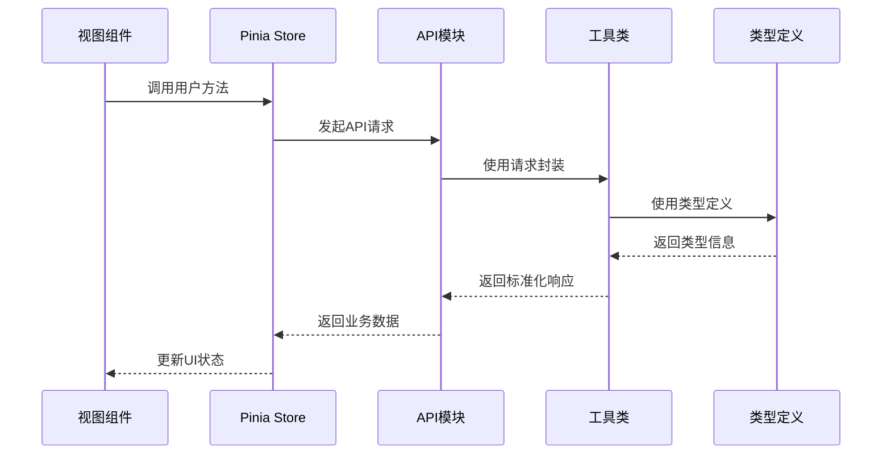

**图表来源**
- [user.ts:27-39](file://src/stores/user.ts#L27-L39)
- [request.ts:107-145](file://src/utils/request.ts#L107-L145)

**章节来源**
- [package.json:13-23](file://package.json#L13-L23)
- [user.ts:1-152](file://src/stores/user.ts#L1-152)

## 性能考虑

### 请求优化策略

系统在多个层面实施了性能优化措施：

- **请求缓存**：合理利用浏览器缓存减少重复请求
- **批量操作**：支持批量数据处理提高效率
- **分页查询**：大数据量场景下使用分页避免内存压力
- **错误重试**：网络异常时自动重试提升成功率

### 响应时间优化

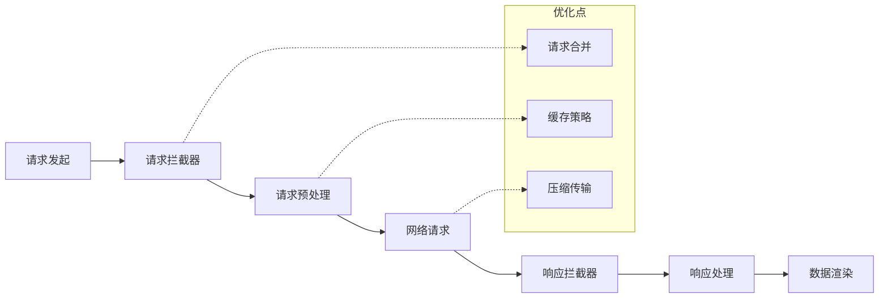

### 内存管理

系统采用了有效的内存管理策略：

- **组件卸载清理**：自动清理事件监听器和定时器
- **状态数据清理**：用户登出时清除相关状态数据
- **图片懒加载**：减少初始内存占用
- **虚拟滚动**：大数据列表使用虚拟滚动技术

## 故障排除指南

### 常见问题及解决方案

#### 登录相关问题

| 问题现象 | 可能原因 | 解决方案 |
|---------|---------|----------|
| 登录失败 | 密码错误或账户不存在 | 检查用户名和密码，确认账户状态 |
| 验证码无效 | 验证码过期或格式错误 | 重新获取验证码，检查输入格式 |
| 多设备冲突 | 同一账户在多设备登录 | 使用"退出所有设备"功能 |

#### 数据同步问题

| 问题现象 | 可能原因 | 解决方案 |
|---------|---------|----------|
| 个人信息不同步 | 缓存未更新 | 刷新页面或手动刷新用户信息 |
| 第三方绑定异常 | 授权状态异常 | 重新绑定或联系客服 |
| 登录记录缺失 | 查询条件错误 | 检查查询参数和时间范围 |

#### 网络连接问题

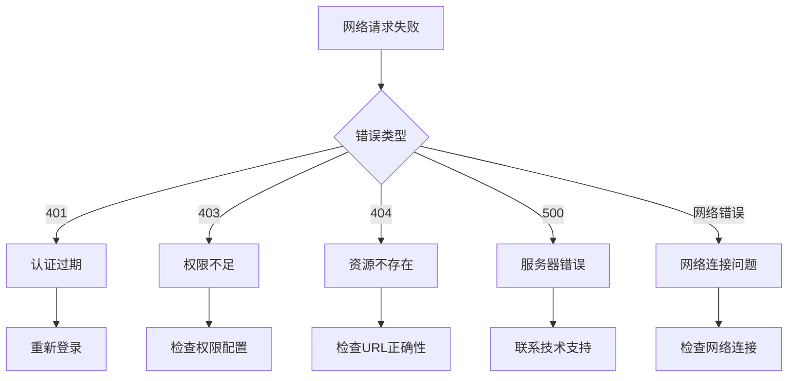

**图表来源**
- [request.ts:50-101](file://src/utils/request.ts#L50-L101)

**章节来源**
- [request.ts:20-35](file://src/utils/request.ts#L20-L35)
- [request.ts:72-101](file://src/utils/request.ts#L72-L101)

### 调试技巧

- **开发者工具**：使用浏览器开发者工具监控网络请求
- **日志输出**：在关键节点添加日志输出便于调试
- **断点调试**：在Vue组件中设置断点观察数据变化
- **状态检查**：定期检查Pinia状态管理器中的数据状态

## 结论

HC管理系统的C端用户接口设计充分体现了现代Web应用的最佳实践。通过清晰的模块划分、完善的类型系统、健壮的错误处理机制，为C端用户提供了稳定可靠的服务体验。

系统的主要优势包括：

1. **安全性**：多重安全防护机制，包括RSA加密、权限控制、操作审计等
2. **易用性**：简洁直观的用户界面，支持多种登录方式
3. **可扩展性**：模块化设计便于功能扩展和维护
4. **可靠性**：完善的错误处理和重试机制

未来可以在以下方面进一步优化：
- 增加更多的用户行为分析功能
- 优化移动端用户体验
- 扩展更多第三方平台支持
- 实现更智能的个性化推荐

## 附录

### 接口调用示例

#### 用户注册示例

```javascript
// 密码注册
const registerData = {
  phone: "13800000000",
  password: "your_password",
  username: "john_doe"
};

try {
  const response = await registerCUser(registerData);
  console.log("注册成功:", response.data);
} catch (error) {
  console.error("注册失败:", error.message);
}
```

#### 个人信息更新示例

```javascript
// 更新用户信息
const profileData = {
  nickname: "John Doe",
  gender: 1,
  birthday: "1990-01-01"
};

try {
  const response = await updateCUserProfile(profileData);
  console.log("更新成功");
  
  // 刷新用户信息
  await fetchCUserProfile();
} catch (error) {
  console.error("更新失败:", error.message);
}
```

#### 密码修改示例

```javascript
// 修改密码
const passwordData = {
  oldPassword: "old_password",
  newPassword: "new_password"
};

try {
  const response = await changeCUserPassword(passwordData);
  console.log("密码修改成功");
} catch (error) {
  console.error("密码修改失败:", error.message);
}
```

### 业务场景说明

#### 场景一：新用户注册流程

1. 用户访问注册页面
2. 输入手机号和密码
3. 系统验证手机号唯一性
4. 创建用户账户
5. 初始化用户信息
6. 返回注册成功

#### 场景二：用户信息管理

1. 用户进入个人中心
2. 系统加载用户信息
3. 用户编辑信息并提交
4. 系统验证数据有效性
5. 更新数据库中的用户信息
6. 刷新页面显示最新信息

#### 场景三：第三方账号绑定

1. 用户点击"绑定第三方"
2. 系统显示可用的第三方平台
3. 用户选择目标平台
4. 跳转到第三方授权页面
5. 授权完成后创建绑定关系
6. 返回绑定成功结果

### 数据隔离与权限控制

系统通过以下机制实现C端用户与其他用户类型的数据隔离：

- **用户类型标识**：通过userType字段区分用户类型
- **权限矩阵**：基于角色的权限控制系统
- **数据访问控制**：根据用户类型限制可访问的数据范围
- **操作审计**：记录所有敏感操作的日志

**章节来源**
- [user.ts:12-21](file://src/stores/user.ts#L12-L21)
- [index.ts:18-32](file://src/types/index.ts#L18-L32)