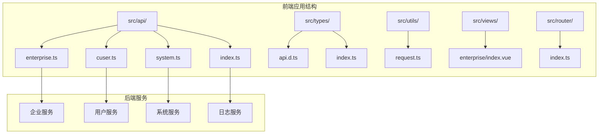
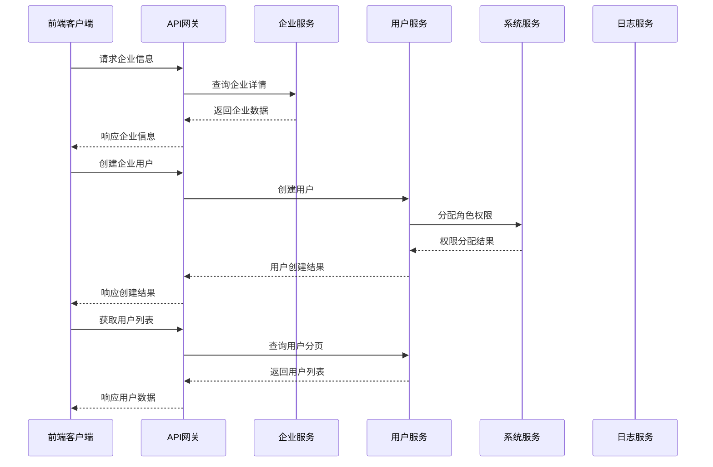
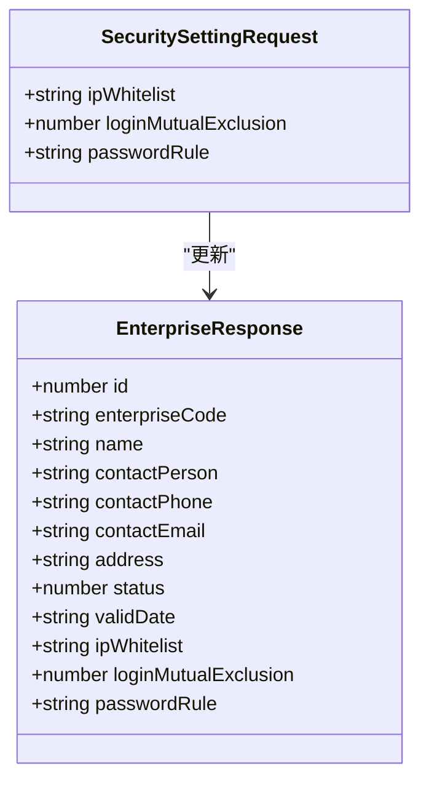
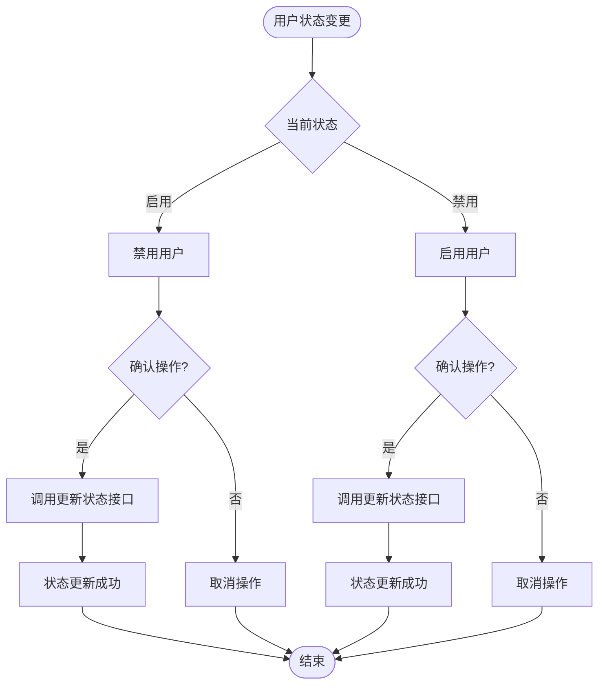
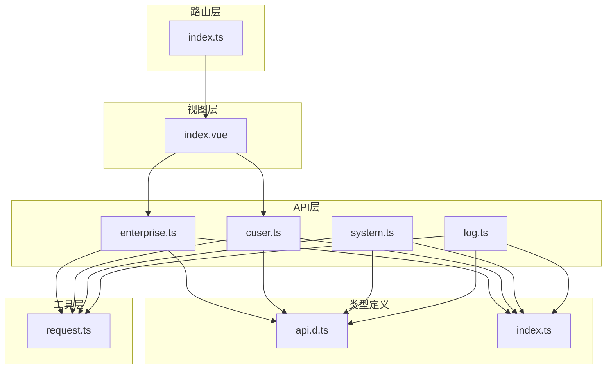
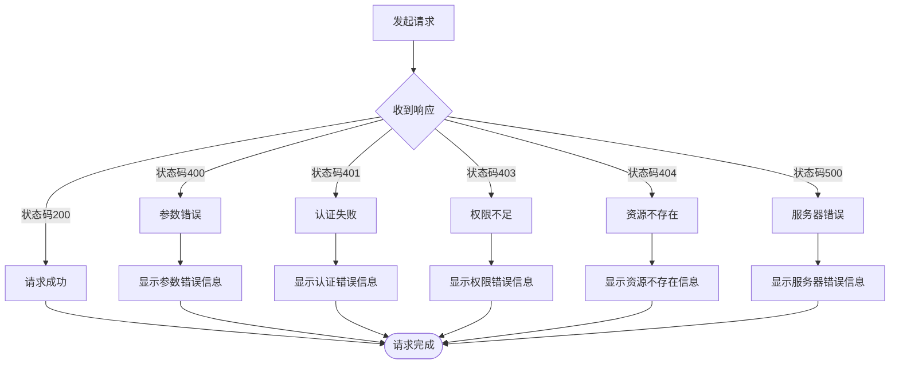

# 企业管理接口

<cite>
**本文档引用的文件**
- [enterprise.ts](file://src/api/enterprise.ts)
- [cuser.ts](file://src/api/cuser.ts)
- [system.ts](file://src/api/system.ts)
- [index.ts](file://src/api/index.ts)
- [api.d.ts](file://src/types/api.d.ts)
- [index.ts](file://src/types/index.ts)
- [request.ts](file://src/utils/request.ts)
- [index.vue](file://src/views/enterprise/index.vue)
- [index.ts](file://src/router/index.ts)
- [log.ts](file://src/api/log.ts)
</cite>

## 目录
1. [简介](#简介)
2. [项目结构](#项目结构)
3. [核心组件](#核心组件)
4. [架构概览](#架构概览)
5. [详细组件分析](#详细组件分析)
6. [依赖关系分析](#依赖关系分析)
7. [性能考虑](#性能考虑)
8. [故障排除指南](#故障排除指南)
9. [结论](#结论)

## 简介

本文件为企业管理系统的详细API文档，涵盖企业信息管理、企业用户管理、企业配置等相关接口。系统基于Vue 3 + TypeScript + Element Plus构建，采用前后端分离架构，通过Axios进行HTTP通信，实现了完整的企业信息管理功能。

系统主要功能包括：
- 企业基本信息的增删改查操作
- 企业资质验证和激活状态管理
- 企业用户关联和权限分配
- 企业数据的安全性要求和访问控制
- 企业信息变更的审核流程和日志记录

## 项目结构

项目采用模块化组织方式，主要分为以下几个核心模块：

**图表来源**
- [enterprise.ts:1-75](file://src/api/enterprise.ts#L1-L75)
- [cuser.ts:1-66](file://src/api/cuser.ts#L1-L66)
- [system.ts:1-56](file://src/api/system.ts#L1-L56)
- [index.ts:1-7](file://src/api/index.ts#L1-L7)

**章节来源**
- [enterprise.ts:1-75](file://src/api/enterprise.ts#L1-L75)
- [cuser.ts:1-66](file://src/api/cuser.ts#L1-L66)
- [system.ts:1-56](file://src/api/system.ts#L1-L56)
- [index.ts:1-7](file://src/api/index.ts#L1-L7)

## 核心组件

### API接口层

系统提供了完整的API接口封装，所有接口都通过统一的请求工具进行HTTP通信。

### 类型定义层

系统使用TypeScript定义了完整的数据模型，确保类型安全和开发体验。

### 视图层

企业页面作为主要的业务界面，集成了企业信息管理和用户管理功能。

**章节来源**
- [api.d.ts:1-156](file://src/types/api.d.ts#L1-L156)
- [index.ts:1-188](file://src/types/index.ts#L1-L188)
- [request.ts:1-148](file://src/utils/request.ts#L1-L148)

## 架构概览

系统采用前后端分离架构，前端通过RESTful API与后端交互：

**图表来源**
- [enterprise.ts:17-74](file://src/api/enterprise.ts#L17-L74)
- [cuser.ts:14-65](file://src/api/cuser.ts#L14-L65)
- [system.ts:9-55](file://src/api/system.ts#L9-L55)

## 详细组件分析

### 企业信息管理接口

#### 企业基本信息CRUD操作

系统提供了完整的企业信息管理接口：

| 接口名称 | HTTP方法 | 路径 | 功能描述 |
|---------|---------|------|----------|
| 获取企业详情 | GET | `/enterprise/get/{id}` | 根据ID获取企业详细信息 |
| 创建企业 | POST | `/enterprise/add` | 新建企业信息 |
| 更新企业 | PUT | `/enterprise/edit/{id}` | 更新企业信息 |
| 更新安全设置 | PUT | `/enterprise/security/{id}` | 更新企业安全配置 |

**章节来源**
- [enterprise.ts:17-31](file://src/api/enterprise.ts#L17-L31)

#### 企业安全配置管理

企业安全配置包括IP白名单、登录互斥、密码规则等设置：

**图表来源**
- [api.d.ts:119-123](file://src/types/api.d.ts#L119-L123)
- [index.ts:90-103](file://src/types/index.ts#L90-L103)

**章节来源**
- [api.d.ts:119-123](file://src/types/api.d.ts#L119-L123)
- [index.ts:90-103](file://src/types/index.ts#L90-L103)

### 企业用户管理接口

#### 用户管理CRUD操作

系统提供了完整的企业用户管理功能：

| 接口名称 | HTTP方法 | 路径 | 功能描述 |
|---------|---------|------|----------|
| 创建企业用户 | POST | `/enterprise/user/add` | 新建企业用户 |
| 编辑企业用户 | PUT | `/enterprise/user/edit/{id}` | 更新用户信息 |
| 删除企业用户 | DELETE | `/enterprise/user/delete/{id}` | 删除用户 |
| 获取用户分页 | GET | `/enterprise/user/page` | 分页查询用户列表 |

**章节来源**
- [enterprise.ts:33-43](file://src/api/enterprise.ts#L33-L43)

#### 用户状态管理

系统支持用户状态的动态管理：

**图表来源**
- [enterprise.ts:53-55](file://src/api/enterprise.ts#L53-L55)
- [index.vue:248-259](file://src/views/enterprise/index.vue#L248-L259)

**章节来源**
- [enterprise.ts:53-55](file://src/api/enterprise.ts#L53-L55)
- [index.vue:248-259](file://src/views/enterprise/index.vue#L248-L259)

#### 用户密码管理

系统提供多种密码管理功能：

| 接口名称 | HTTP方法 | 路径 | 功能描述 |
|---------|---------|------|----------|
| 重置用户密码 | PUT | `/enterprise/user/{id}/reset-password` | 重置指定用户密码 |
| 强制修改密码 | PUT | `/enterprise/user/force-change-password` | 强制用户修改密码 |
| 修改个人密码 | PUT | `/enterprise/user/change-password` | 修改当前用户密码 |

**章节来源**
- [enterprise.ts:45-74](file://src/api/enterprise.ts#L45-L74)

### 权限管理接口

#### 角色管理

系统提供完整的角色管理功能：

| 接口名称 | HTTP方法 | 路径 | 功能描述 |
|---------|---------|------|----------|
| 获取角色列表 | GET | `/sys/role/list` | 获取所有角色列表 |
| 获取角色详情 | GET | `/sys/role/get/{id}` | 获取指定角色详情 |
| 创建角色 | POST | `/sys/role/add` | 新建角色 |
| 更新角色 | PUT | `/sys/role/edit/{id}` | 更新角色信息 |
| 删除角色 | DELETE | `/sys/role/delete/{id}` | 删除角色 |
| 分配权限 | POST | `/sys/role/assign-permissions` | 为角色分配权限 |

**章节来源**
- [system.ts:9-31](file://src/api/system.ts#L9-L31)

#### 权限管理

系统提供细粒度的权限控制：

| 接口名称 | HTTP方法 | 路径 | 功能描述 |
|---------|---------|------|----------|
| 获取权限列表 | GET | `/permission/list` | 获取所有权限列表 |
| 获取权限详情 | GET | `/permission/get/{id}` | 获取指定权限详情 |
| 创建权限 | POST | `/permission/add` | 新建权限 |
| 更新权限 | PUT | `/permission/edit/{id}` | 更新权限信息 |
| 删除权限 | DELETE | `/permission/delete/{id}` | 删除权限 |
| 初始化权限缓存 | POST | `/permission/init` | 初始化权限缓存 |

**章节来源**
- [system.ts:33-55](file://src/api/system.ts#L33-L55)

### 日志管理接口

#### 登录日志查询

系统提供完整的登录日志管理功能：

| 接口名称 | HTTP方法 | 路径 | 功能描述 |
|---------|---------|------|----------|
| 获取登录日志分页 | GET | `/log/login/page` | 分页查询登录日志 |
| 获取用户登录记录 | GET | `/cuser/login-records` | 获取指定用户的登录记录 |

**章节来源**
- [log.ts:8-15](file://src/api/log.ts#L8-L15)
- [cuser.ts:50-57](file://src/api/cuser.ts#L50-L57)

## 依赖关系分析

系统采用模块化设计，各模块之间保持低耦合高内聚：

**图表来源**
- [index.ts:1-7](file://src/api/index.ts#L1-L7)
- [request.ts:1-148](file://src/utils/request.ts#L1-L148)

**章节来源**
- [index.ts:1-7](file://src/api/index.ts#L1-L7)
- [request.ts:1-148](file://src/utils/request.ts#L1-L148)

## 性能考虑

### 请求拦截器优化

系统通过Axios拦截器实现了统一的请求处理机制：

- **超时控制**：默认30秒超时时间，避免长时间阻塞
- **自动重试**：对于临时性错误提供重试机制
- **错误处理**：统一处理各种HTTP状态码和业务错误
- **Token管理**：自动添加认证头信息

### 数据缓存策略

- **分页缓存**：用户列表采用分页加载，减少一次性数据传输
- **表单缓存**：编辑表单支持本地缓存，提升用户体验
- **状态缓存**：用户状态变更采用乐观更新策略

## 故障排除指南

### 常见错误处理

系统实现了完善的错误处理机制：

**图表来源**
- [request.ts:50-101](file://src/utils/request.ts#L50-L101)

### 错误码说明

| 错误码 | 描述 | 处理建议 |
|--------|------|----------|
| 200 | 成功 | 正常处理响应数据 |
| 400 | 参数错误 | 检查请求参数格式和必填项 |
| 401 | 认证失败 | 重新登录获取新的Token |
| 403 | 权限不足 | 检查用户权限或联系管理员 |
| 404 | 资源不存在 | 检查URL路径是否正确 |
| 500 | 服务器错误 | 稍后重试或联系技术支持 |

**章节来源**
- [request.ts:50-101](file://src/utils/request.ts#L50-L101)

### 网络异常处理

系统针对不同类型的网络异常提供了相应的处理策略：

- **网络连接失败**：提示用户检查网络连接
- **请求超时**：提供重试机制和进度反馈
- **DNS解析失败**：引导用户检查域名解析
- **SSL证书错误**：提示用户检查证书有效性

## 结论

本企业管理接口文档详细介绍了系统的API设计和实现细节。系统采用了现代化的前端技术栈，通过模块化的架构设计实现了企业信息管理的完整功能。

### 主要特点

1. **完整的功能覆盖**：涵盖了企业信息管理、用户管理、权限管理、日志管理等核心功能
2. **类型安全保证**：使用TypeScript确保代码质量和开发体验
3. **统一的错误处理**：通过拦截器实现全局错误处理机制
4. **灵活的权限控制**：支持细粒度的角色和权限管理
5. **良好的扩展性**：模块化设计便于功能扩展和维护

### 最佳实践建议

1. **接口调用规范**：遵循RESTful设计原则，保持接口的一致性和可预测性
2. **错误处理策略**：在前端实现统一的错误处理逻辑，提供友好的用户反馈
3. **权限验证**：在关键操作前进行权限验证，确保系统安全性
4. **数据验证**：在提交表单前进行前端验证，减少无效请求
5. **日志记录**：对重要操作进行日志记录，便于审计和问题排查