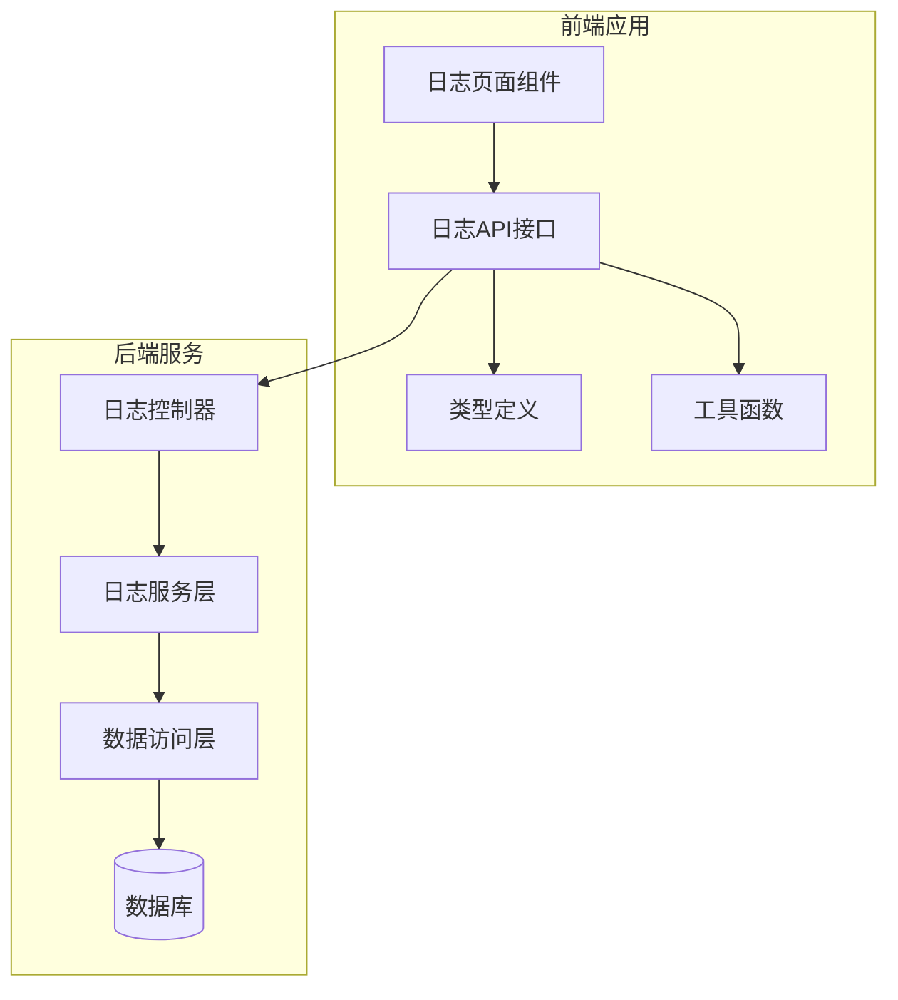
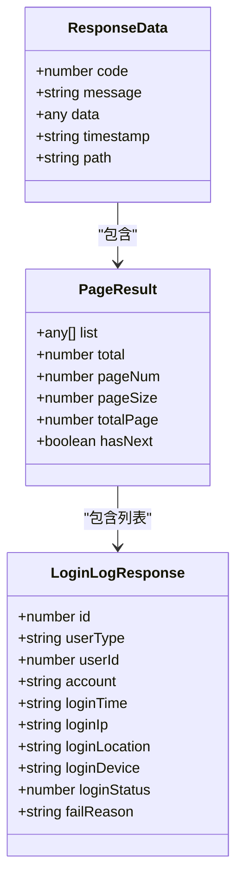
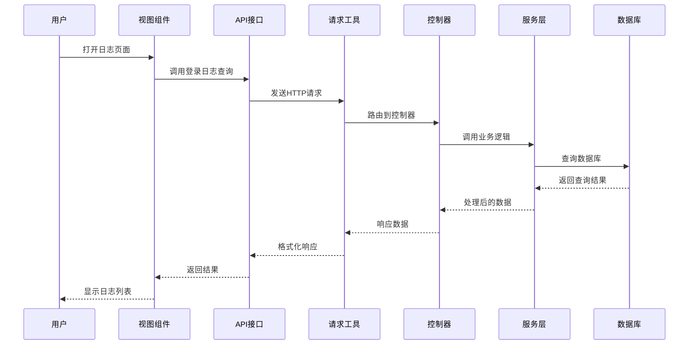
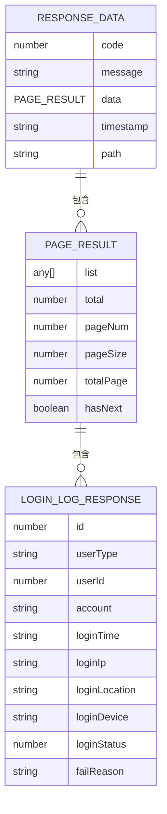
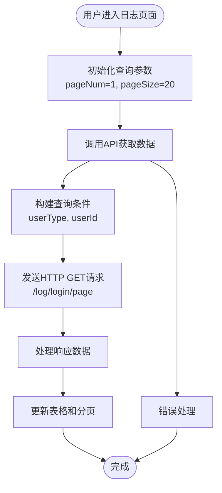
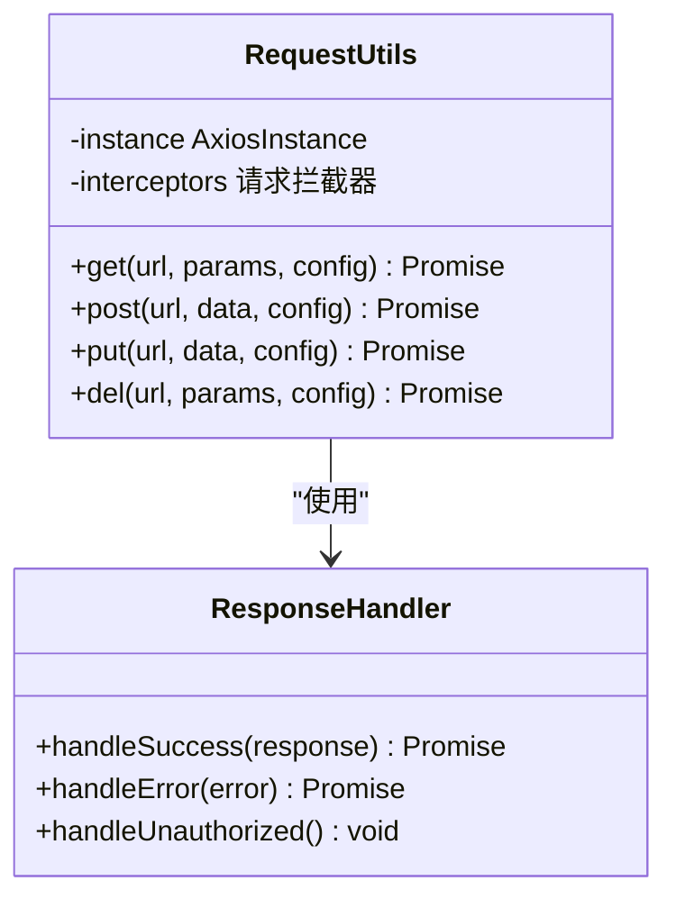
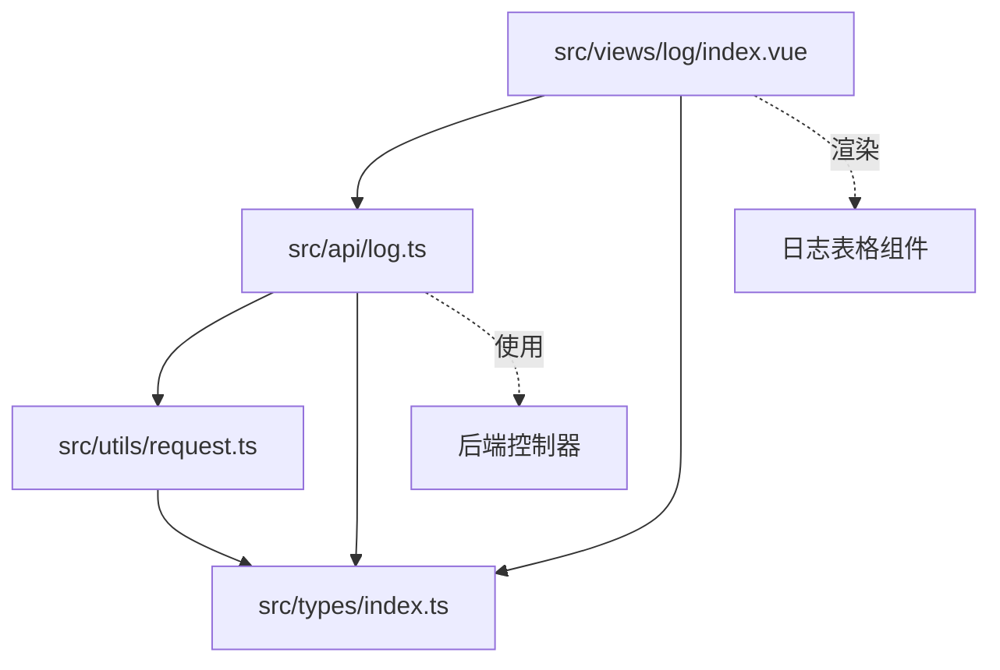
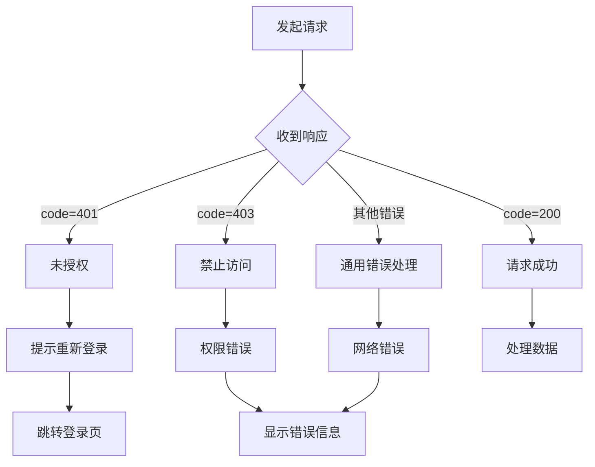

# 日志接口

<cite>
**本文档引用的文件**
- [src/api/log.ts](file://src/api/log.ts)
- [src/views/log/index.vue](file://src/views/log/index.vue)
- [src/types/index.ts](file://src/types/index.ts)
- [src/utils/request.ts](file://src/utils/request.ts)
- [默认模块.md](file://默认模块.md)
</cite>

## 目录
1. [简介](#简介)
2. [项目结构](#项目结构)
3. [核心组件](#核心组件)
4. [架构概览](#架构概览)
5. [详细组件分析](#详细组件分析)
6. [依赖关系分析](#依赖关系分析)
7. [性能考虑](#性能考虑)
8. [故障排除指南](#故障排除指南)
9. [结论](#结论)

## 简介

本文件为日志管理接口的完整API文档，涵盖操作日志、登录日志、异常日志等日志查询和管理接口。系统提供了基于Vue 3 + TypeScript的前端界面，通过HTTP API与后端服务进行交互，支持日志数据的查询、分页、筛选等功能。

## 项目结构

日志管理系统采用前后端分离架构，主要由以下组件构成：

**图表来源**
- [src/views/log/index.vue:1-128](file://src/views/log/index.vue#L1-L128)
- [src/api/log.ts:1-16](file://src/api/log.ts#L1-L16)
- [src/types/index.ts:138-149](file://src/types/index.ts#L138-L149)

**章节来源**
- [src/views/log/index.vue:1-128](file://src/views/log/index.vue#L1-L128)
- [src/api/log.ts:1-16](file://src/api/log.ts#L1-L16)
- [src/types/index.ts:138-149](file://src/types/index.ts#L138-L149)

## 核心组件

### 登录日志查询接口

系统当前实现了登录日志的分页查询功能，支持按用户类型和用户ID进行筛选。

**章节来源**
- [src/api/log.ts:8-15](file://src/api/log.ts#L8-L15)
- [src/views/log/index.vue:13-27](file://src/views/log/index.vue#L13-L27)

### 前端视图组件

日志页面组件提供了完整的用户界面，包括：
- 搜索表单（用户类型选择、用户ID输入）
- 数据表格展示
- 分页控件
- 状态标签显示

**章节来源**
- [src/views/log/index.vue:55-112](file://src/views/log/index.vue#L55-L112)

### 类型定义系统

系统使用TypeScript接口定义了统一的数据结构：

**图表来源**
- [src/types/index.ts:1-7](file://src/types/index.ts#L1-L7)
- [src/types/index.ts:9-16](file://src/types/index.ts#L9-L16)
- [src/types/index.ts:138-149](file://src/types/index.ts#L138-L149)

**章节来源**
- [src/types/index.ts:1-7](file://src/types/index.ts#L1-L7)
- [src/types/index.ts:9-16](file://src/types/index.ts#L9-L16)
- [src/types/index.ts:138-149](file://src/types/index.ts#L138-L149)

## 架构概览

系统采用标准的MVC架构模式，前端通过API接口与后端服务通信：

**图表来源**
- [src/views/log/index.vue:13-27](file://src/views/log/index.vue#L13-L27)
- [src/api/log.ts:8-15](file://src/api/log.ts#L8-L15)
- [src/utils/request.ts:111-118](file://src/utils/request.ts#L111-L118)

## 详细组件分析

### 登录日志查询API

#### 接口定义

系统提供了一个专门的登录日志分页查询接口：

| 参数名 | 位置 | 类型 | 必选 | 说明 |
|--------|------|------|------|------|
| pageNum | query | integer | 是 | 当前页码（从1开始） |
| pageSize | query | integer | 是 | 每页条数 |
| userType | query | string | 否 | 用户类型：C/B/P |
| userId | query | integer(int64) | 否 | 用户ID |

#### 响应数据结构

**图表来源**
- [src/types/index.ts:1-7](file://src/types/index.ts#L1-L7)
- [src/types/index.ts:9-16](file://src/types/index.ts#L9-L16)
- [src/types/index.ts:138-149](file://src/types/index.ts#L138-L149)

#### 前端实现流程

**图表来源**
- [src/views/log/index.vue:13-27](file://src/views/log/index.vue#L13-L27)
- [src/api/log.ts:8-15](file://src/api/log.ts#L8-L15)

**章节来源**
- [src/views/log/index.vue:13-27](file://src/views/log/index.vue#L13-L27)
- [src/api/log.ts:8-15](file://src/api/log.ts#L8-L15)
- [默认模块.md:2747-2794](file://默认模块.md#L2747-L2794)

### 前端组件实现

#### 组件状态管理

组件使用Vue 3的Composition API管理状态：

| 状态变量 | 类型 | 描述 | 默认值 |
|----------|------|------|--------|
| tableData | LoginLogResponse[] | 日志数据列表 | [] |
| total | number | 总记录数 | 0 |
| loading | boolean | 加载状态 | false |
| pageNum | number | 当前页码 | 1 |
| pageSize | number | 每页大小 | 20 |
| searchForm | object | 搜索表单数据 | { userType: '', userId: undefined } |

#### 用户界面功能

组件提供了完整的用户交互功能：

1. **搜索功能**：支持按用户类型和用户ID筛选
2. **分页功能**：支持自定义每页显示数量
3. **状态显示**：登录状态使用不同颜色标识
4. **数据展示**：完整的登录日志字段展示

**章节来源**
- [src/views/log/index.vue:1-52](file://src/views/log/index.vue#L1-L52)
- [src/views/log/index.vue:55-112](file://src/views/log/index.vue#L55-L112)

### 数据传输层

#### HTTP请求封装

系统使用Axios封装了统一的HTTP请求处理：

**图表来源**
- [src/utils/request.ts:1-148](file://src/utils/request.ts#L1-L148)

**章节来源**
- [src/utils/request.ts:1-148](file://src/utils/request.ts#L1-L148)

## 依赖关系分析

系统各组件之间的依赖关系如下：

**图表来源**
- [src/api/log.ts:1-6](file://src/api/log.ts#L1-L6)
- [src/views/log/index.vue:1-4](file://src/views/log/index.vue#L1-L4)
- [src/utils/request.ts:1-4](file://src/utils/request.ts#L1-L4)

**章节来源**
- [src/api/log.ts:1-6](file://src/api/log.ts#L1-L6)
- [src/views/log/index.vue:1-4](file://src/views/log/index.vue#L1-L4)
- [src/utils/request.ts:1-4](file://src/utils/request.ts#L1-L4)

## 性能考虑

### 查询优化建议

1. **索引优化**
   - 在 `userType` 和 `userId` 字段上建立复合索引
   - 在 `loginTime` 字段上建立索引以支持时间范围查询

2. **分页策略**
   - 使用 `LIMIT` 和 `OFFSET` 进行高效分页
   - 避免深度分页，建议限制最大页码

3. **缓存策略**
   - 对热门查询结果进行缓存
   - 实现LRU缓存机制

4. **查询优化**
   - 使用覆盖索引减少回表查询
   - 避免SELECT *，只查询必要字段

### 大数据量处理方案

1. **异步处理**
   - 对于大量数据导出，使用异步任务队列
   - 提供任务状态查询接口

2. **分批处理**
   - 实现分批读取和处理机制
   - 支持断点续传

3. **压缩存储**
   - 对历史数据进行压缩存储
   - 实现冷热数据分离

## 故障排除指南

### 常见问题及解决方案

#### 登录状态异常
- **症状**：频繁出现登录过期提示
- **原因**：Token过期或无效
- **解决**：重新登录获取新的Token

#### 数据加载失败
- **症状**：日志列表无法加载
- **原因**：网络连接或服务器异常
- **解决**：检查网络连接，重试请求

#### 权限不足
- **症状**：访问被拒绝
- **原因**：用户权限不足
- **解决**：联系管理员分配相应权限

### 错误处理机制

系统实现了完善的错误处理机制：

**图表来源**
- [src/utils/request.ts:50-101](file://src/utils/request.ts#L50-L101)

**章节来源**
- [src/utils/request.ts:50-101](file://src/utils/request.ts#L50-L101)

## 结论

日志管理系统提供了完整的登录日志查询功能，具有以下特点：

1. **简洁高效**：接口设计简单，响应速度快
2. **易于使用**：提供直观的用户界面和搜索功能
3. **类型安全**：使用TypeScript确保类型安全
4. **可扩展性**：模块化设计便于功能扩展

系统目前专注于登录日志查询，后续可以扩展支持操作日志、异常日志等其他类型的日志管理功能。建议在现有基础上增加日志导出、统计分析等高级功能，以满足更复杂的企业级需求。