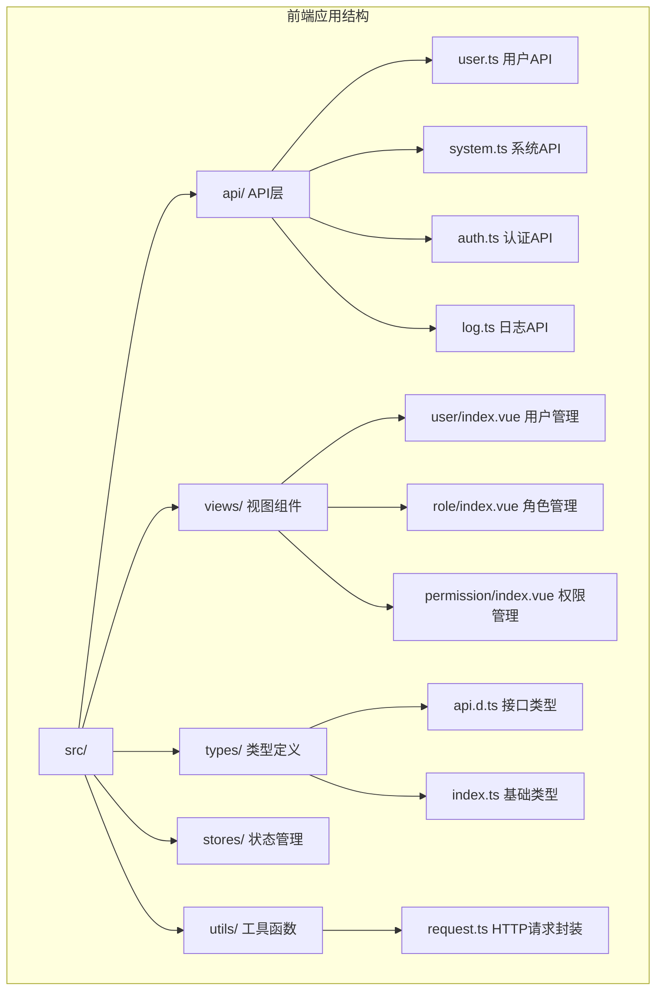
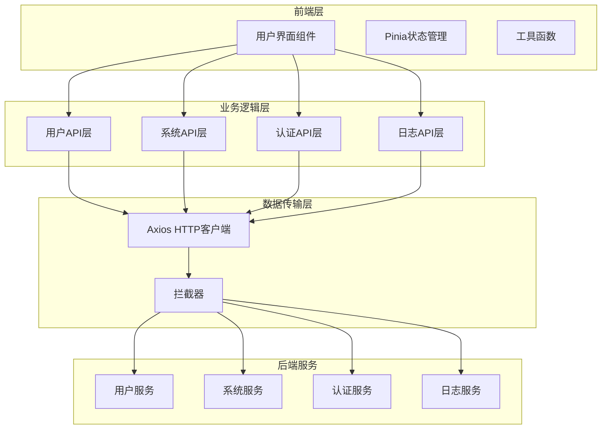
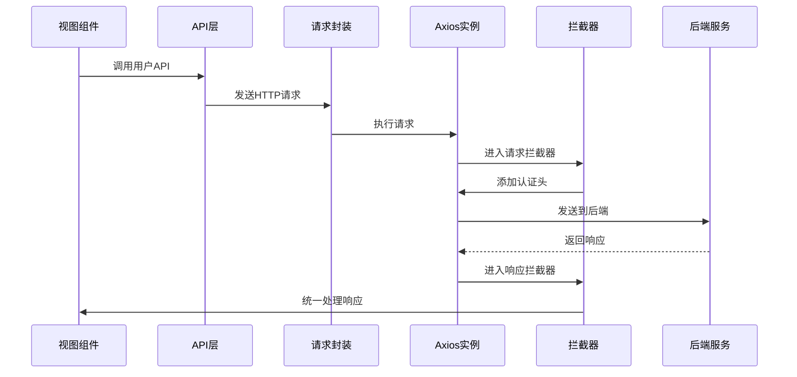
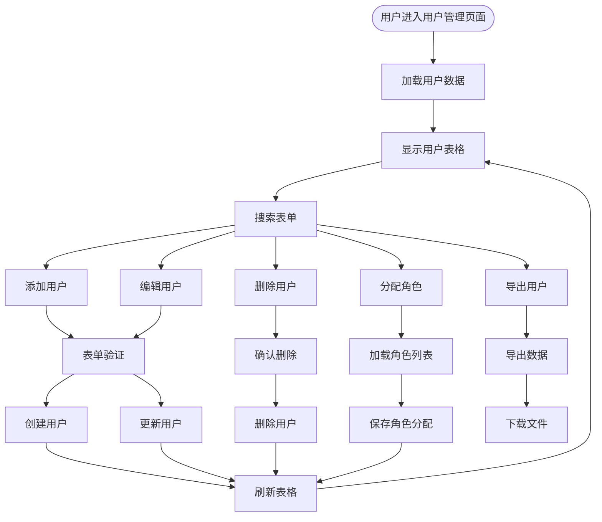
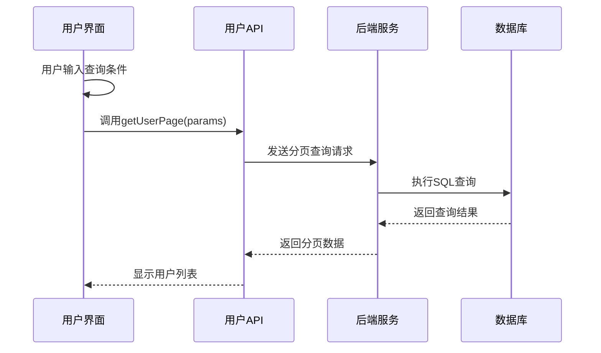
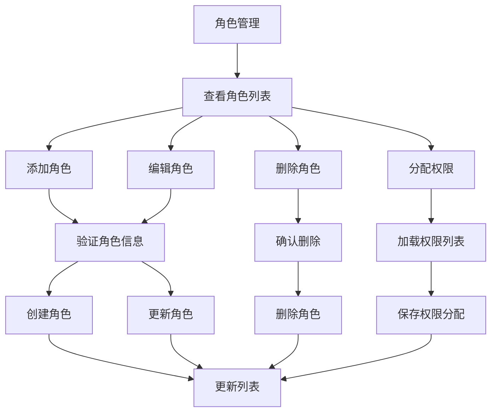
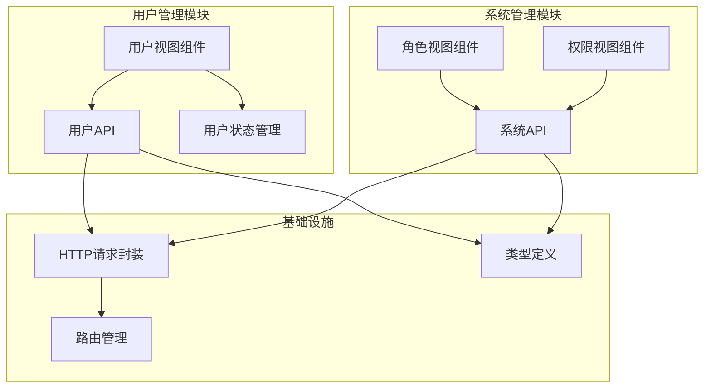
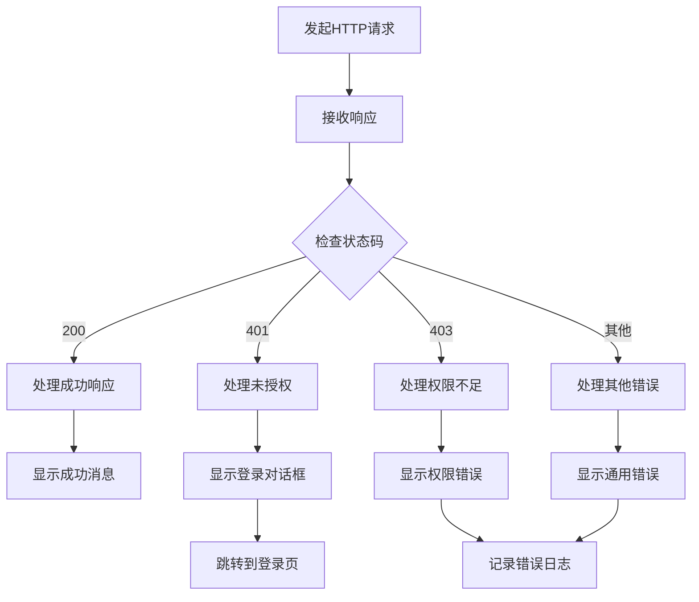

# 用户管理接口

<cite>
**本文档引用的文件**
- [src/api/user.ts](file://src/api/user.ts)
- [src/types/api.d.ts](file://src/types/api.d.ts)
- [src/types/index.ts](file://src/types/index.ts)
- [src/utils/request.ts](file://src/utils/request.ts)
- [src/views/user/index.vue](file://src/views/user/index.vue)
- [src/api/system.ts](file://src/api/system.ts)
- [src/views/role/index.vue](file://src/views/role/index.vue)
- [src/views/permission/index.vue](file://src/views/permission/index.vue)
- [src/api/log.ts](file://src/api/log.ts)
</cite>

## 目录
1. [简介](#简介)
2. [项目结构](#项目结构)
3. [核心组件](#核心组件)
4. [架构概览](#架构概览)
5. [详细组件分析](#详细组件分析)
6. [依赖关系分析](#依赖关系分析)
7. [性能考虑](#性能考虑)
8. [故障排除指南](#故障排除指南)
9. [结论](#结论)

## 简介

本项目是一个基于Vue 3 + TypeScript + Element Plus的用户管理系统前端应用。本文档详细记录了用户管理接口的完整API规范，包括用户查询、创建、编辑、删除等CRUD操作接口，用户信息的数据结构、字段定义和验证规则，以及用户状态管理和权限分配的相关接口说明。

系统采用前后端分离架构，前端通过Axios进行HTTP请求，统一处理响应格式和错误处理，支持用户分页查询、角色分配、权限管理等功能。

## 项目结构

项目采用典型的Vue 3单页应用结构，主要包含以下关键目录：

**图表来源**
- [src/api/user.ts:1-59](file://src/api/user.ts#L1-L59)
- [src/views/user/index.vue:1-361](file://src/views/user/index.vue#L1-L361)

**章节来源**
- [src/api/user.ts:1-59](file://src/api/user.ts#L1-L59)
- [src/types/api.d.ts:1-156](file://src/types/api.d.ts#L1-L156)
- [src/types/index.ts:1-188](file://src/types/index.ts#L1-L188)

## 核心组件

### 用户管理API接口

系统提供了完整的用户管理CRUD操作接口，所有接口都遵循统一的响应格式。

#### 基础响应结构

所有API响应都遵循以下统一格式：
- `code`: 状态码（200表示成功）
- `message`: 响应消息
- `data`: 实际数据内容
- `timestamp`: 请求时间戳
- `path`: 请求路径

#### 用户CRUD操作接口

| 接口名称 | 方法 | 路径 | 功能描述 |
|---------|------|------|----------|
| 获取用户列表 | GET | `/user/list` | 获取所有用户列表 |
| 获取用户详情 | GET | `/user/get/{id}` | 根据ID获取用户详情 |
| 用户分页查询 | GET | `/user/page` | 支持分页、筛选的用户查询 |
| 创建用户 | POST | `/user/add` | 创建新用户 |
| 编辑用户 | PUT | `/user/edit/{id}` | 更新用户信息 |
| 删除用户 | DELETE | `/user/delete/{id}` | 删除指定用户 |

#### 用户状态管理接口

| 接口名称 | 方法 | 路径 | 功能描述 |
|---------|------|------|----------|
| 角色分配 | POST | `/user/assign-roles` | 为用户分配角色 |
| 用户导出 | GET | `/user/export` | 导出用户数据（同步） |
| 异步导出 | POST | `/user/export-async` | 异步导出用户数据 |
| 导出状态查询 | GET | `/user/export-async/status/{taskId}` | 查询导出任务状态 |
| 下载导出文件 | GET | `/user/export-async/download/{taskId}` | 下载导出的文件 |

**章节来源**
- [src/api/user.ts:10-58](file://src/api/user.ts#L10-L58)
- [src/types/index.ts:1-188](file://src/types/index.ts#L1-L188)

### 数据模型定义

#### 用户基础信息模型

用户信息采用统一的数据结构，包含以下字段：

| 字段名 | 类型 | 必填 | 描述 | 示例值 |
|--------|------|------|------|--------|
| id | number | 否 | 用户唯一标识 | 123 |
| username | string | 否 | 用户名 | john_doe |
| name | string | 否 | 姓名 | 张三 |
| email | string | 否 | 邮箱地址 | zhangsan@example.com |
| phone | string | 否 | 手机号码 | 13800001111 |
| status | number | 否 | 用户状态（1启用，0禁用） | 1 |
| createTime | string | 否 | 创建时间 | 2023-12-01T10:30:00Z |
| updateTime | string | 否 | 更新时间 | 2023-12-01T10:30:00Z |

#### 用户请求模型

用户创建和更新时使用的请求模型：

| 字段名 | 类型 | 必填 | 描述 | 验证规则 |
|--------|------|------|------|----------|
| id | number | 否 | 用户ID | 仅在更新时需要 |
| username | string | 是 | 用户名 | 非空 |
| password | string | 是 | 密码 | 非空 |
| name | string | 是 | 姓名 | 非空 |
| email | string | 否 | 邮箱 | 有效邮箱格式 |
| phone | string | 否 | 手机号 | 11位手机号格式 |
| status | number | 否 | 状态 | 0或1 |

#### 分页结果模型

分页查询返回的标准结果格式：

| 字段名 | 类型 | 描述 |
|--------|------|------|
| list | T[] | 数据列表 |
| total | number | 总记录数 |
| pageNum | number | 当前页码 |
| pageSize | number | 每页大小 |
| totalPage | number | 总页数 |
| hasNext | boolean | 是否有下一页 |

**章节来源**
- [src/types/index.ts:66-75](file://src/types/index.ts#L66-L75)
- [src/types/api.d.ts:51-59](file://src/types/api.d.ts#L51-L59)
- [src/types/index.ts:9-16](file://src/types/index.ts#L9-L16)

## 架构概览

系统采用分层架构设计，各层职责清晰分离：

**图表来源**
- [src/api/user.ts:1-59](file://src/api/user.ts#L1-L59)
- [src/utils/request.ts:1-148](file://src/utils/request.ts#L1-L148)

### HTTP请求封装

系统使用Axios进行HTTP请求封装，提供了统一的请求方法和错误处理机制：

**图表来源**
- [src/utils/request.ts:37-101](file://src/utils/request.ts#L37-L101)

**章节来源**
- [src/utils/request.ts:1-148](file://src/utils/request.ts#L1-L148)

## 详细组件分析

### 用户管理界面组件

用户管理界面是系统的核心功能模块，提供了完整的用户CRUD操作和状态管理功能。

#### 界面功能特性

**图表来源**
- [src/views/user/index.vue:45-200](file://src/views/user/index.vue#L45-L200)

#### 表单验证规则

系统实现了严格的表单验证机制：

| 字段 | 验证规则 | 错误消息 |
|------|----------|----------|
| username | 必填，非空 | 请输入用户名 |
| name | 必填，非空 | 请输入姓名 |
| password | 必填，非空 | 请输入密码 |
| phone | 必须符合手机号格式 | 请输入正确的手机号 |
| email | 必须符合邮箱格式 | 请输入正确的邮箱 |

#### 分页查询实现

用户列表支持灵活的分页查询功能：

**图表来源**
- [src/views/user/index.vue:45-87](file://src/views/user/index.vue#L45-L87)
- [src/api/user.ts:18-26](file://src/api/user.ts#L18-L26)

**章节来源**
- [src/views/user/index.vue:1-361](file://src/views/user/index.vue#L1-L361)

### 角色管理功能

系统提供了完整的角色管理功能，支持角色的增删改查和权限分配。

#### 角色数据模型

| 字段名 | 类型 | 必填 | 描述 |
|--------|------|------|------|
| id | number | 否 | 角色唯一标识 |
| name | string | 是 | 角色名称 |
| code | string | 是 | 角色编码 |
| description | string | 否 | 角色描述 |
| createTime | string | 否 | 创建时间 |
| updateTime | string | 否 | 更新时间 |

#### 角色操作流程

**图表来源**
- [src/views/role/index.vue:29-111](file://src/views/role/index.vue#L29-L111)
- [src/api/system.ts:9-31](file://src/api/system.ts#L9-L31)

**章节来源**
- [src/views/role/index.vue:1-199](file://src/views/role/index.vue#L1-L199)
- [src/api/system.ts:1-56](file://src/api/system.ts#L1-L56)

### 权限管理功能

系统实现了细粒度的权限管理体系，支持菜单、按钮、接口三种类型的权限控制。

#### 权限数据模型

| 字段名 | 类型 | 必填 | 描述 |
|--------|------|------|------|
| id | number | 否 | 权限唯一标识 |
| name | string | 是 | 权限名称 |
| code | string | 是 | 权限编码 |
| type | string | 是 | 权限类型（MENU/BUTTON/API） |
| path | string | 否 | 路径或URL |
| parentId | number | 否 | 父级权限ID |
| createTime | string | 否 | 创建时间 |
| updateTime | string | 否 | 更新时间 |

#### 权限类型说明

| 类型 | 描述 | 示例 |
|------|------|------|
| MENU | 菜单权限 | 用户管理、系统设置 |
| BUTTON | 按钮权限 | 添加、编辑、删除 |
| API | 接口权限 | /api/user/add, /api/user/edit |

**章节来源**
- [src/views/permission/index.vue:1-193](file://src/views/permission/index.vue#L1-L193)
- [src/api/system.ts:41-55](file://src/api/system.ts#L41-L55)

### 日志记录和审计

系统提供了完善的日志记录功能，支持用户操作日志的查询和管理。

#### 登录日志模型

| 字段名 | 类型 | 描述 |
|--------|------|------|
| id | number | 日志ID |
| userType | string | 用户类型 |
| userId | number | 用户ID |
| account | string | 用户账号 |
| loginTime | string | 登录时间 |
| loginIp | string | 登录IP |
| loginLocation | string | 登录位置 |
| loginDevice | string | 登录设备 |
| loginStatus | number | 登录状态 |
| failReason | string | 失败原因 |

#### 日志查询接口

系统支持按用户类型和用户ID进行日志查询，便于审计追踪。

**章节来源**
- [src/api/log.ts:8-15](file://src/api/log.ts#L8-L15)
- [src/types/index.ts:138-149](file://src/types/index.ts#L138-L149)

## 依赖关系分析

系统采用模块化设计，各组件之间的依赖关系清晰明确：

**图表来源**
- [src/views/user/index.vue:1-10](file://src/views/user/index.vue#L1-L10)
- [src/api/user.ts:1-8](file://src/api/user.ts#L1-L8)

### 组件耦合度分析

系统设计遵循低耦合高内聚的原则：

- **用户界面与业务逻辑分离**：视图组件只负责展示，业务逻辑封装在API层
- **数据类型独立管理**：所有数据模型集中定义在types目录
- **HTTP请求统一处理**：通过request.ts统一处理所有HTTP请求
- **状态管理模块化**：使用Pinia进行状态管理，避免全局状态污染

**章节来源**
- [src/utils/request.ts:1-148](file://src/utils/request.ts#L1-L148)
- [src/types/api.d.ts:1-156](file://src/types/api.d.ts#L1-L156)

## 性能考虑

### 请求优化策略

1. **请求拦截器缓存**：统一处理认证令牌和错误响应
2. **分页查询优化**：支持大数据量场景下的分页加载
3. **表单验证优化**：前端实时验证减少无效请求
4. **状态缓存**：使用localStorage缓存用户信息

### 错误处理机制

系统实现了多层次的错误处理机制：

**图表来源**
- [src/utils/request.ts:50-101](file://src/utils/request.ts#L50-L101)

## 故障排除指南

### 常见问题及解决方案

#### 登录相关问题

| 问题现象 | 可能原因 | 解决方案 |
|----------|----------|----------|
| 登录后立即跳转到登录页 | Token过期 | 检查后端JWT配置，延长Token有效期 |
| 401错误频繁出现 | 网络不稳定 | 检查网络连接，增加重试机制 |
| 登录状态异常 | 浏览器缓存问题 | 清除浏览器缓存，重新登录 |

#### 数据查询问题

| 问题现象 | 可能原因 | 解决方案 |
|----------|----------|----------|
| 用户列表为空 | 查询条件过于严格 | 调整查询条件或重置搜索表单 |
| 分页数据不正确 | pageNum/pageSize参数错误 | 检查分页参数传递逻辑 |
| 导出功能失败 | 服务器资源不足 | 检查服务器磁盘空间和内存使用情况 |

#### 权限相关问题

| 问题现象 | 可能原因 | 解决方案 |
|----------|----------|----------|
| 无法访问某些功能 | 权限不足 | 检查用户角色和权限分配 |
| 角色分配失败 | 角色ID不存在 | 验证角色ID的有效性 |
| 权限缓存异常 | 缓存未更新 | 执行权限缓存初始化操作 |

**章节来源**
- [src/utils/request.ts:20-35](file://src/utils/request.ts#L20-L35)
- [src/views/user/index.vue:138-153](file://src/views/user/index.vue#L138-L153)

### 开发调试建议

1. **启用开发模式**：使用Vite的热重载功能提高开发效率
2. **使用浏览器开发者工具**：监控网络请求和JavaScript错误
3. **单元测试**：为关键业务逻辑编写单元测试
4. **日志记录**：在生产环境中启用详细的日志记录

## 结论

本用户管理接口文档全面覆盖了系统的用户管理功能，包括：

- **完整的CRUD操作**：支持用户的基本增删改查操作
- **灵活的查询功能**：支持分页、筛选、排序等多种查询方式
- **完善的状态管理**：支持用户状态的启用和禁用
- **细粒度的权限控制**：支持角色和权限的精细化管理
- **可靠的错误处理**：提供统一的错误处理和用户反馈机制

系统采用现代化的前端技术栈，具有良好的可维护性和扩展性。通过模块化的架构设计和统一的API规范，为后续的功能扩展和系统集成奠定了坚实的基础。

建议在实际部署中：
1. 配置适当的服务器资源和数据库连接池
2. 实施安全防护措施，防止常见的Web攻击
3. 建立完善的监控和日志系统
4. 定期备份用户数据和系统配置