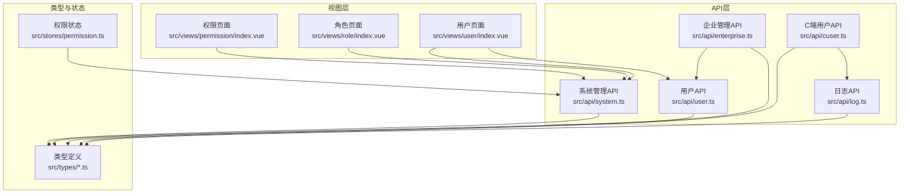
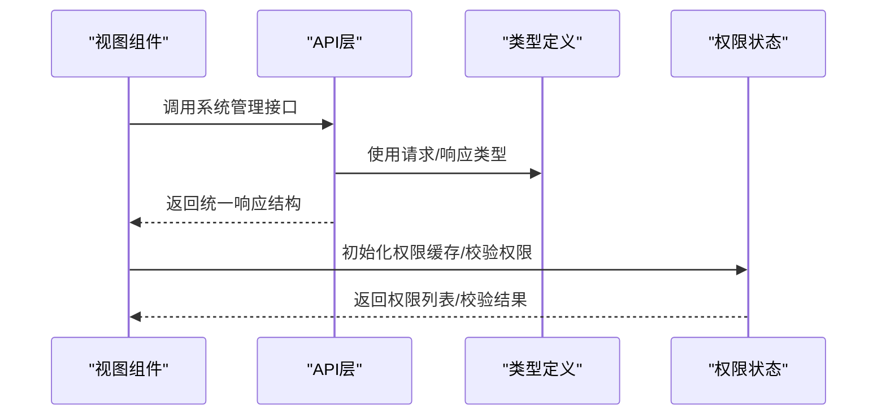
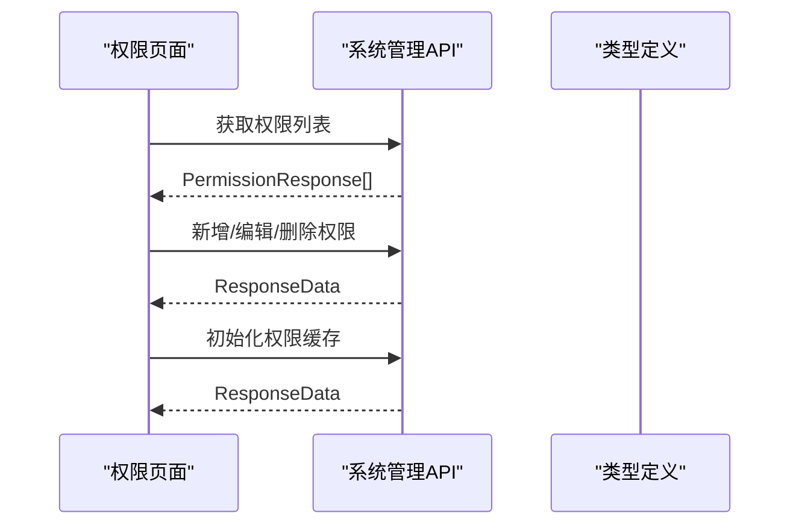
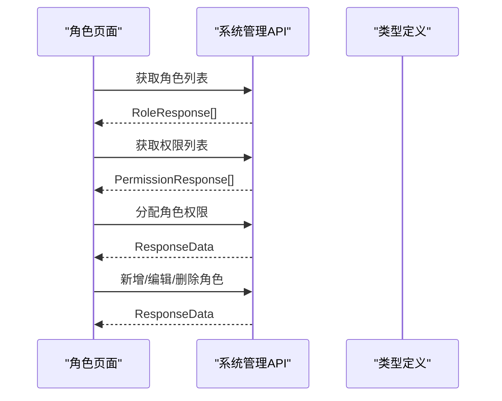
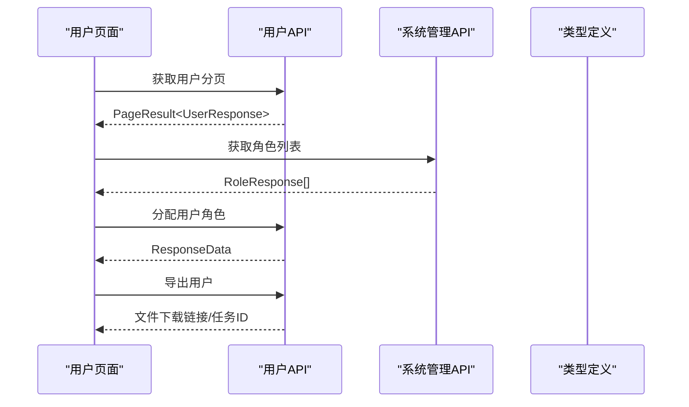
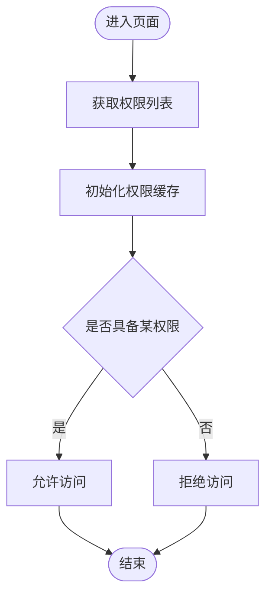
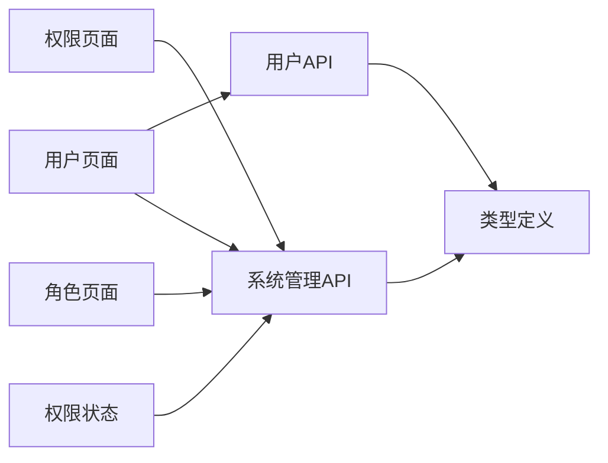

# 系统管理接口

<cite>
**本文档引用的文件**
- [src/api/system.ts](file://src/api/system.ts)
- [src/api/user.ts](file://src/api/user.ts)
- [src/api/enterprise.ts](file://src/api/enterprise.ts)
- [src/api/cuser.ts](file://src/api/cuser.ts)
- [src/api/log.ts](file://src/api/log.ts)
- [src/types/api.d.ts](file://src/types/api.d.ts)
- [src/types/index.ts](file://src/types/index.ts)
- [src/stores/permission.ts](file://src/stores/permission.ts)
- [src/views/permission/index.vue](file://src/views/permission/index.vue)
- [src/views/role/index.vue](file://src/views/role/index.vue)
- [src/views/user/index.vue](file://src/views/user/index.vue)
- [默认模块.md](file://默认模块.md)
</cite>

## 目录
1. [简介](#简介)
2. [项目结构](#项目结构)
3. [核心组件](#核心组件)
4. [架构总览](#架构总览)
5. [详细组件分析](#详细组件分析)
6. [依赖关系分析](#依赖关系分析)
7. [性能考虑](#性能考虑)
8. [故障排除指南](#故障排除指南)
9. [结论](#结论)
10. [附录](#附录)

## 简介
本文件面向系统管理员与前端开发者，提供系统管理相关接口的完整API文档。内容涵盖：
- 权限管理：权限树形结构的查询与管理，权限分配与角色权限绑定
- 角色管理：角色的增删改查与角色权限绑定
- 用户管理：用户分页查询、增删改、角色分配
- 企业与企业用户：企业信息维护、企业用户管理与安全设置
- 登录日志：登录行为分页查询
- 权限缓存：权限缓存初始化
- 安全与审计：接口调用示例、响应格式、安全与审计要求

## 项目结构
前端采用按功能域划分的模块化组织方式，系统管理相关能力由以下模块协同实现：
- API层：封装HTTP请求，统一暴露系统管理相关接口
- 类型定义：统一响应结构与请求/响应数据模型
- 视图层：权限、角色、用户等管理页面
- 状态管理：权限缓存与权限校验逻辑

**图表来源**
- [src/views/permission/index.vue:1-193](file://src/views/permission/index.vue#L1-L193)
- [src/views/role/index.vue:1-199](file://src/views/role/index.vue#L1-L199)
- [src/views/user/index.vue:1-361](file://src/views/user/index.vue#L1-L361)
- [src/api/system.ts:1-56](file://src/api/system.ts#L1-L56)
- [src/api/user.ts:1-59](file://src/api/user.ts#L1-L59)
- [src/api/enterprise.ts:1-75](file://src/api/enterprise.ts#L1-L75)
- [src/api/cuser.ts:1-66](file://src/api/cuser.ts#L1-L66)
- [src/api/log.ts:1-16](file://src/api/log.ts#L1-L16)
- [src/types/api.d.ts:1-156](file://src/types/api.d.ts#L1-L156)
- [src/types/index.ts:1-188](file://src/types/index.ts#L1-L188)
- [src/stores/permission.ts:1-56](file://src/stores/permission.ts#L1-L56)

**章节来源**
- [src/api/system.ts:1-56](file://src/api/system.ts#L1-L56)
- [src/api/user.ts:1-59](file://src/api/user.ts#L1-L59)
- [src/api/enterprise.ts:1-75](file://src/api/enterprise.ts#L1-L75)
- [src/api/cuser.ts:1-66](file://src/api/cuser.ts#L1-L66)
- [src/api/log.ts:1-16](file://src/api/log.ts#L1-L16)
- [src/types/api.d.ts:1-156](file://src/types/api.d.ts#L1-L156)
- [src/types/index.ts:1-188](file://src/types/index.ts#L1-L188)
- [src/stores/permission.ts:1-56](file://src/stores/permission.ts#L1-L56)
- [src/views/permission/index.vue:1-193](file://src/views/permission/index.vue#L1-L193)
- [src/views/role/index.vue:1-199](file://src/views/role/index.vue#L1-L199)
- [src/views/user/index.vue:1-361](file://src/views/user/index.vue#L1-L361)

## 核心组件
- 系统管理API（权限/角色）：提供权限与角色的增删改查、权限分配、权限缓存初始化
- 用户管理API：提供用户分页查询、增删改、角色分配与导出
- 企业管理API：提供企业信息维护、企业用户管理、安全设置更新
- C端用户API：提供注册、密码修改、第三方账号解绑、登录记录查询等
- 日志API：提供登录日志分页查询
- 类型定义：统一响应结构与请求/响应数据模型
- 权限状态：权限列表获取、权限缓存初始化、权限校验

**章节来源**
- [src/api/system.ts:9-55](file://src/api/system.ts#L9-L55)
- [src/api/user.ts:10-59](file://src/api/user.ts#L10-L59)
- [src/api/enterprise.ts:17-75](file://src/api/enterprise.ts#L17-L75)
- [src/api/cuser.ts:14-66](file://src/api/cuser.ts#L14-L66)
- [src/api/log.ts:8-16](file://src/api/log.ts#L8-L16)
- [src/types/index.ts:1-188](file://src/types/index.ts#L1-L188)
- [src/stores/permission.ts:7-55](file://src/stores/permission.ts#L7-L55)

## 架构总览
系统管理接口通过API层统一对外提供REST风格接口，前端视图组件通过调用API层完成业务操作；类型定义确保前后端数据契约一致；权限状态负责权限缓存与校验。

**图表来源**
- [src/views/permission/index.vue:1-193](file://src/views/permission/index.vue#L1-L193)
- [src/views/role/index.vue:1-199](file://src/views/role/index.vue#L1-L199)
- [src/views/user/index.vue:1-361](file://src/views/user/index.vue#L1-L361)
- [src/api/system.ts:1-56](file://src/api/system.ts#L1-L56)
- [src/types/index.ts:1-188](file://src/types/index.ts#L1-L188)
- [src/stores/permission.ts:1-56](file://src/stores/permission.ts#L1-L56)

## 详细组件分析

### 权限管理接口
- 接口概览
  - 获取权限列表：GET /permission/list
  - 获取权限详情：GET /permission/get/{id}
  - 新增权限：POST /permission/add
  - 编辑权限：PUT /permission/edit/{id}
  - 删除权限：DELETE /permission/delete/{id}
  - 初始化权限缓存：POST /permission/init

- 数据模型
  - 请求体：PermissionRequest
  - 响应体：PermissionResponse
  - 统一响应：ResponseData<T>

- 前端集成
  - 视图组件提供权限列表展示、新增/编辑弹窗、删除确认、缓存初始化入口
  - 权限状态负责权限列表获取与缓存初始化

**图表来源**
- [src/views/permission/index.vue:28-108](file://src/views/permission/index.vue#L28-L108)
- [src/api/system.ts:33-55](file://src/api/system.ts#L33-L55)
- [src/types/api.d.ts:144-150](file://src/types/api.d.ts#L144-L150)
- [src/types/index.ts:127-136](file://src/types/index.ts#L127-L136)

**章节来源**
- [src/api/system.ts:33-55](file://src/api/system.ts#L33-L55)
- [src/views/permission/index.vue:28-108](file://src/views/permission/index.vue#L28-L108)
- [src/types/api.d.ts:144-150](file://src/types/api.d.ts#L144-L150)
- [src/types/index.ts:127-136](file://src/types/index.ts#L127-L136)

### 角色管理接口
- 接口概览
  - 获取角色列表：GET /sys/role/list
  - 获取角色详情：GET /sys/role/get/{id}
  - 新增角色：POST /sys/role/add
  - 编辑角色：PUT /sys/role/edit/{id}
  - 删除角色：DELETE /sys/role/delete/{id}
  - 角色权限分配：POST /sys/role/assign-permissions

- 数据模型
  - 请求体：RoleRequest、AssignPermissionsRequest
  - 响应体：RoleResponse
  - 统一响应：ResponseData<T>

- 前端集成
  - 视图组件提供角色列表展示、新增/编辑弹窗、删除确认、分配权限弹窗
  - 分配权限时联动获取权限列表并提交分配请求

**图表来源**
- [src/views/role/index.vue:29-111](file://src/views/role/index.vue#L29-L111)
- [src/api/system.ts:9-31](file://src/api/system.ts#L9-L31)
- [src/types/api.d.ts:138-155](file://src/types/api.d.ts#L138-L155)
- [src/types/index.ts:118-125](file://src/types/index.ts#L118-L125)

**章节来源**
- [src/api/system.ts:9-31](file://src/api/system.ts#L9-L31)
- [src/views/role/index.vue:29-111](file://src/views/role/index.vue#L29-L111)
- [src/types/api.d.ts:138-155](file://src/types/api.d.ts#L138-L155)
- [src/types/index.ts:118-125](file://src/types/index.ts#L118-L125)

### 用户管理接口
- 接口概览
  - 获取用户分页列表：GET /user/page
  - 获取用户详情：GET /user/get/{id}
  - 新增用户：POST /user/add
  - 编辑用户：PUT /user/edit/{id}
  - 删除用户：DELETE /user/delete/{id}
  - 用户角色分配：POST /user/assign-roles
  - 导出用户：GET /user/export
  - 异步导出用户：POST /user/export-async
  - 查询导出任务状态：GET /user/export-async/status/{taskId}
  - 下载导出文件：GET /user/export-async/download/{taskId}

- 数据模型
  - 请求体：UserRequest、AssignRolesRequest
  - 响应体：UserResponse、PageResult、ExcelTaskStatus
  - 统一响应：ResponseData<T>

- 前端集成
  - 视图组件提供用户分页表格、搜索表单、新增/编辑弹窗、删除确认、分配角色弹窗、导出功能
  - 分配角色时联动获取角色列表并提交分配请求

**图表来源**
- [src/views/user/index.vue:45-200](file://src/views/user/index.vue#L45-L200)
- [src/api/user.ts:18-59](file://src/api/user.ts#L18-L59)
- [src/api/system.ts:9-11](file://src/api/system.ts#L9-L11)
- [src/types/index.ts:9-16](file://src/types/index.ts#L9-L16)

**章节来源**
- [src/api/user.ts:10-59](file://src/api/user.ts#L10-L59)
- [src/views/user/index.vue:45-200](file://src/views/user/index.vue#L45-L200)
- [src/types/index.ts:66-75](file://src/types/index.ts#L66-L75)

### 企业管理与企业用户接口
- 接口概览
  - 获取企业详情：GET /enterprise/get/{id}
  - 新增企业：POST /enterprise/add
  - 更新企业：PUT /enterprise/edit/{id}
  - 更新企业安全设置：PUT /enterprise/security/{id}
  - 新增企业用户：POST /enterprise/user/add
  - 编辑企业用户：PUT /enterprise/user/edit/{id}
  - 删除企业用户：DELETE /enterprise/user/delete/{id}
  - 重置企业用户密码：PUT /enterprise/user/{id}/reset-password
  - 激活企业用户：POST /enterprise/user/{id}/activate
  - 更新企业用户状态：PUT /enterprise/user/{id}/status
  - 企业用户分页列表：GET /enterprise/user/page
  - 强制修改密码：PUT /enterprise/user/force-change-password
  - 修改企业用户密码：PUT /enterprise/user/change-password

- 数据模型
  - 请求体：EnterpriseCreateRequest、EnterpriseUpdateRequest、SecuritySettingRequest、EnterpriseUserCreateRequest、ResetEnterpriseUserPasswordRequest、ChangePasswordRequest
  - 响应体：EnterpriseResponse、EnterpriseUserResponse、PageResult
  - 统一响应：ResponseData<T>

**章节来源**
- [src/api/enterprise.ts:17-75](file://src/api/enterprise.ts#L17-L75)
- [src/types/api.d.ts:102-136](file://src/types/api.d.ts#L102-L136)
- [src/types/index.ts:90-116](file://src/types/index.ts#L90-L116)

### C端用户接口
- 接口概览
  - 注册C端用户：POST /cuser/register
  - 重置C端用户密码：POST /cuser/reset-password
  - 获取C端用户资料：GET /cuser/profile
  - 更新C端用户资料：PUT /cuser/profile
  - 修改C端用户密码：PUT /cuser/password
  - 修改C端用户手机：PUT /cuser/phone
  - 修改C端用户邮箱：PUT /cuser/email
  - 获取C端用户第三方账号：GET /cuser/third-party
  - 解绑第三方账号：POST /cuser/third-party/unbind
  - 获取C端用户登录记录：GET /cuser/login-records
  - 全设备退出：POST /cuser/logout-all
  - 设置默认身份：PUT /cuser/identity-default

- 数据模型
  - 请求体：CUserRegisterRequest、ResetPasswordRequest、UpdateProfileRequest、ChangePasswordRequest、ChangePhoneRequest、ChangeEmailRequest、UnbindThirdPartyRequest、SetIdentityDefaultRequest
  - 响应体：CUserResponse、CUserThirdPartyResponse、LoginLogResponse、PageResult
  - 统一响应：ResponseData<T>

**章节来源**
- [src/api/cuser.ts:14-66](file://src/api/cuser.ts#L14-L66)
- [src/types/api.d.ts:66-100](file://src/types/api.d.ts#L66-L100)
- [src/types/index.ts:77-88](file://src/types/index.ts#L77-L88)

### 登录日志接口
- 接口概览
  - 登录日志分页查询：GET /log/login/page

- 数据模型
  - 响应体：LoginLogResponse、PageResult
  - 统一响应：ResponseData<T>

**章节来源**
- [src/api/log.ts:8-16](file://src/api/log.ts#L8-L16)
- [src/types/index.ts:138-149](file://src/types/index.ts#L138-L149)

### 权限缓存与校验
- 功能概述
  - 初始化权限缓存：POST /permission/init
  - 获取权限列表：GET /permission/list
  - 权限校验：基于权限编码判断

- 前端实现
  - 权限状态管理：fetchPermissions、initPermission、hasPermission、clearPermissions
  - 视图组件：提供“初始化缓存”按钮，调用初始化接口

**图表来源**
- [src/stores/permission.ts:12-34](file://src/stores/permission.ts#L12-L34)
- [src/views/permission/index.vue:40-47](file://src/views/permission/index.vue#L40-L47)

**章节来源**
- [src/stores/permission.ts:7-55](file://src/stores/permission.ts#L7-L55)
- [src/views/permission/index.vue:40-47](file://src/views/permission/index.vue#L40-L47)

## 依赖关系分析
- 模块耦合
  - 视图组件依赖API层与类型定义
  - API层依赖类型定义进行请求/响应约束
  - 权限状态依赖系统管理API进行权限数据获取与缓存初始化
- 外部依赖
  - Element Plus UI库用于表单、表格、对话框等组件
  - Pinia用于权限状态管理

**图表来源**
- [src/views/permission/index.vue:1-193](file://src/views/permission/index.vue#L1-L193)
- [src/views/role/index.vue:1-199](file://src/views/role/index.vue#L1-L199)
- [src/views/user/index.vue:1-361](file://src/views/user/index.vue#L1-L361)
- [src/api/system.ts:1-56](file://src/api/system.ts#L1-L56)
- [src/api/user.ts:1-59](file://src/api/user.ts#L1-L59)
- [src/types/index.ts:1-188](file://src/types/index.ts#L1-L188)
- [src/stores/permission.ts:1-56](file://src/stores/permission.ts#L1-L56)

**章节来源**
- [src/views/permission/index.vue:1-193](file://src/views/permission/index.vue#L1-L193)
- [src/views/role/index.vue:1-199](file://src/views/role/index.vue#L1-L199)
- [src/views/user/index.vue:1-361](file://src/views/user/index.vue#L1-L361)
- [src/api/system.ts:1-56](file://src/api/system.ts#L1-L56)
- [src/api/user.ts:1-59](file://src/api/user.ts#L1-L59)
- [src/types/index.ts:1-188](file://src/types/index.ts#L1-L188)
- [src/stores/permission.ts:1-56](file://src/stores/permission.ts#L1-L56)

## 性能考虑
- 列表分页：优先使用分页接口减少一次性传输数据量
- 权限缓存：通过初始化权限缓存降低重复请求成本
- 批量操作：在权限/角色分配场景中尽量合并请求，避免多次往返
- 前端缓存：在视图组件中对列表数据进行本地缓存，减少重复渲染

## 故障排除指南
- 权限列表获取失败
  - 检查网络连接与后端服务状态
  - 确认权限缓存是否已初始化
  - 查看浏览器控制台错误信息
- 权限分配失败
  - 确认角色ID与权限ID有效
  - 检查请求体字段是否符合AssignPermissionsRequest规范
- 用户导出异常
  - 检查异步导出任务状态接口返回的任务ID
  - 确认任务状态为成功后再下载文件

**章节来源**
- [src/stores/permission.ts:12-34](file://src/stores/permission.ts#L12-L34)
- [src/views/permission/index.vue:40-47](file://src/views/permission/index.vue#L40-L47)
- [src/api/user.ts:48-59](file://src/api/user.ts#L48-L59)

## 结论
本系统管理接口通过清晰的模块划分与统一的数据契约，实现了权限、角色、用户、企业与日志等核心管理能力。前端通过视图组件与状态管理配合API层，提供了良好的用户体验与可维护性。建议在生产环境中结合权限缓存与分页查询提升性能，并完善安全与审计策略。

## 附录

### 统一响应结构
所有接口均遵循统一响应结构，包含状态码、消息、数据、时间戳与请求路径等字段。

**章节来源**
- [src/types/index.ts:1-7](file://src/types/index.ts#L1-L7)

### 接口调用示例与响应格式
- 获取权限列表
  - 方法：GET
  - 路径：/permission/list
  - 请求参数：无
  - 响应：ResponseData<PermissionResponse[]>
- 初始化权限缓存
  - 方法：POST
  - 路径：/permission/init
  - 请求参数：无
  - 响应：ResponseData
- 获取角色列表
  - 方法：GET
  - 路径：/sys/role/list
  - 请求参数：无
  - 响应：ResponseData<RoleResponse[]>
- 角色权限分配
  - 方法：POST
  - 路径：/sys/role/assign-permissions
  - 请求体：AssignPermissionsRequest
  - 响应：ResponseData
- 获取用户分页列表
  - 方法：GET
  - 路径：/user/page
  - 请求参数：pageNum、pageSize、username、name、phone
  - 响应：ResponseData<PageResult<UserResponse>>
- 用户角色分配
  - 方法：POST
  - 路径：/user/assign-roles
  - 请求体：AssignRolesRequest
  - 响应：ResponseData
- 登录日志分页查询
  - 方法：GET
  - 路径：/log/login/page
  - 请求参数：pageNum、pageSize、userType、userId
  - 响应：ResponseData<PageResult<LoginLogResponse>>

**章节来源**
- [src/api/system.ts:33-55](file://src/api/system.ts#L33-L55)
- [src/api/system.ts:9-31](file://src/api/system.ts#L9-L31)
- [src/api/user.ts:18-42](file://src/api/user.ts#L18-L42)
- [src/api/log.ts:8-16](file://src/api/log.ts#L8-L16)
- [默认模块.md:1-200](file://默认模块.md#L1-L200)

### 安全性与审计要求
- 安全性
  - 登录接口支持RSA公钥获取与密码加密传输
  - 支持多身份切换与默认身份设置
  - 企业用户支持强制修改密码与全设备退出
- 审计
  - 提供登录日志分页查询，便于审计追踪
  - 统一响应结构包含请求路径与时间戳，便于定位问题

**章节来源**
- [src/api/auth.ts:22-68](file://src/api/auth.ts#L22-L68)
- [src/api/cuser.ts:50-66](file://src/api/cuser.ts#L50-L66)
- [src/api/log.ts:8-16](file://src/api/log.ts#L8-L16)
- [src/types/index.ts:1-7](file://src/types/index.ts#L1-L7)