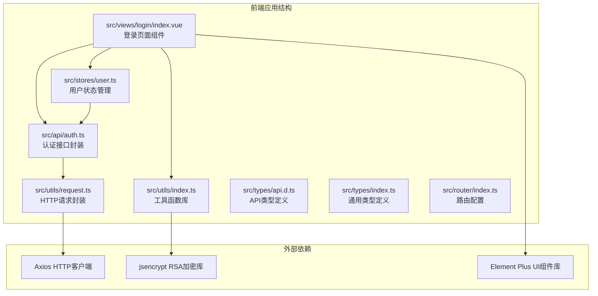
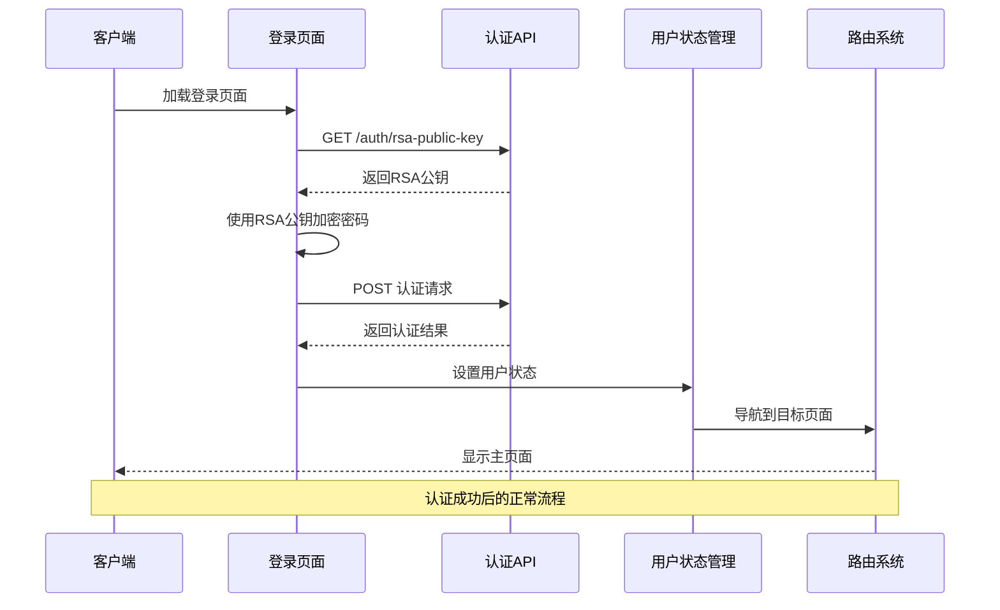
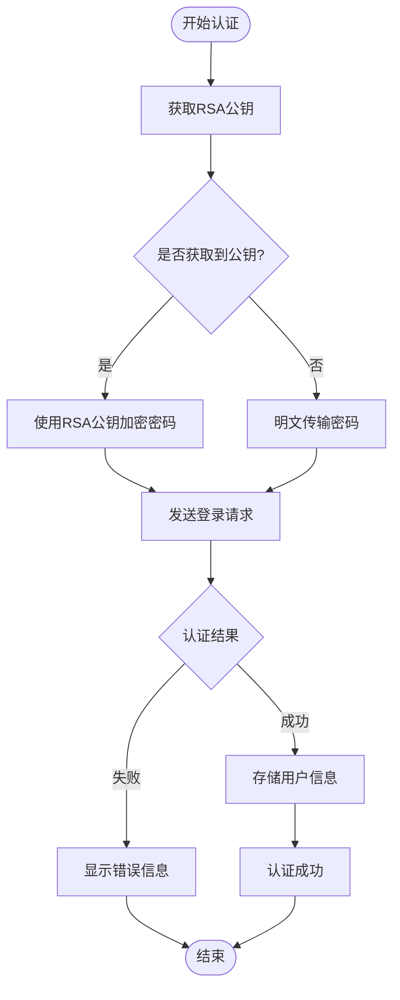
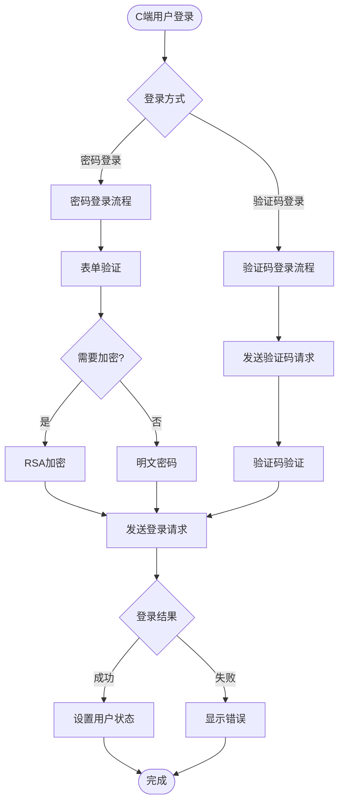
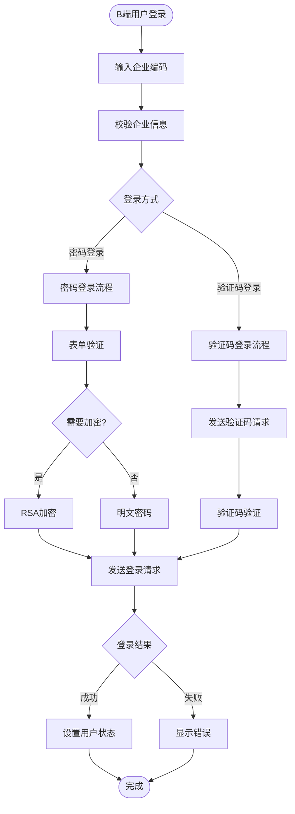
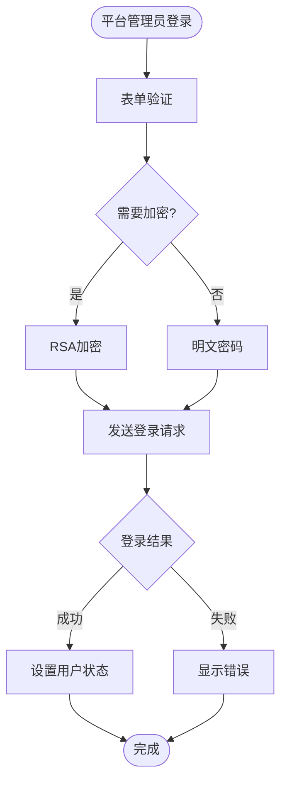
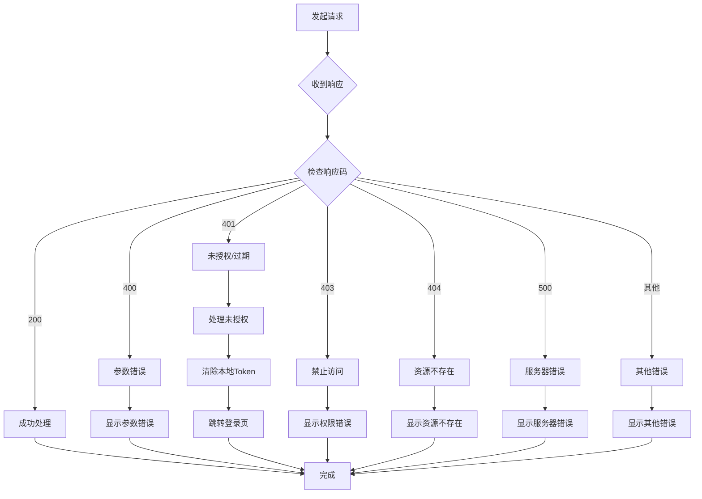
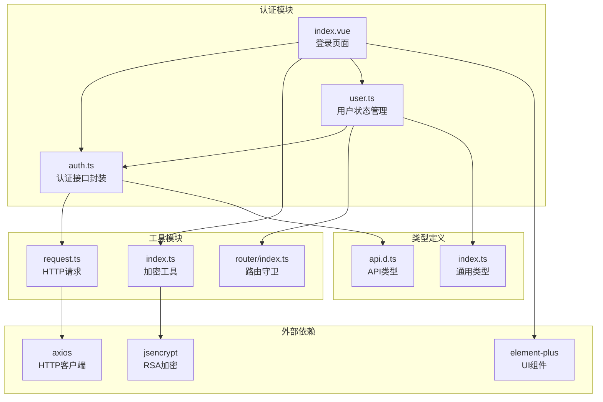

# 认证接口

<cite>
**本文档引用的文件**
- [auth.ts](file://src/api/auth.ts)
- [index.vue](file://src/views/login/index.vue)
- [user.ts](file://src/stores/user.ts)
- [request.ts](file://src/utils/request.ts)
- [api.d.ts](file://src/types/api.d.ts)
- [index.ts](file://src/types/index.ts)
- [index.ts](file://src/utils/index.ts)
- [index.ts](file://src/router/index.ts)
- [vite.config.ts](file://vite.config.ts)
</cite>

## 目录
1. [简介](#简介)
2. [项目结构](#项目结构)
3. [核心组件](#核心组件)
4. [架构概览](#架构概览)
5. [详细组件分析](#详细组件分析)
6. [依赖关系分析](#依赖关系分析)
7. [性能考虑](#性能考虑)
8. [故障排除指南](#故障排除指南)
9. [结论](#结论)

## 简介

本文件为HC管理系统认证接口的详细API文档，涵盖了用户登录、登出、RSA公钥获取等相关接口。文档详细说明了每个接口的HTTP方法、URL路径、请求参数格式、响应数据结构、状态码含义和错误处理机制。同时包含了多身份认证（C端用户、B端用户、平台管理员）的登录流程说明，提供了完整的请求示例和响应示例，并说明了RSA加密传输的使用方法。文档还涵盖了认证令牌的获取、刷新和失效处理机制。

## 项目结构

HC管理系统采用Vue 3 + TypeScript + Vite构建，认证相关的核心文件分布如下：



**图表来源**
- [auth.ts:1-69](file://src/api/auth.ts#L1-L69)
- [index.vue:1-323](file://src/views/login/index.vue#L1-L323)
- [user.ts:1-152](file://src/stores/user.ts#L1-L152)
- [request.ts:1-148](file://src/utils/request.ts#L1-L148)

**章节来源**
- [auth.ts:1-69](file://src/api/auth.ts#L1-L69)
- [index.vue:1-323](file://src/views/login/index.vue#L1-L323)
- [user.ts:1-152](file://src/stores/user.ts#L1-L152)
- [request.ts:1-148](file://src/utils/request.ts#L1-L148)

## 核心组件

### 认证接口封装层

认证接口通过统一的API封装层提供服务，所有认证相关请求都通过此层进行管理：

- **RSA公钥获取**：`/auth/rsa-public-key`
- **C端用户密码登录**：`/auth/c/password-login`
- **C端用户验证码登录**：`/auth/c/code-login`
- **B端用户密码登录**：`/auth/b/password-login`
- **B端用户验证码登录**：`/auth/b/code-login`
- **平台管理员登录**：`/auth/platform/login`
- **企业校验**：`/auth/b/check-enterprise`
- **身份列表获取**：`/auth/identity-list`
- **身份选择**：`/auth/identity-select`
- **验证码发送**：`/auth/code/send`
- **登出**：`/auth/logout`
- **当前用户信息**：`/auth/info`

**章节来源**
- [auth.ts:22-68](file://src/api/auth.ts#L22-L68)

### 用户状态管理

用户状态管理通过Pinia Store实现，负责：
- Token存储和验证
- 用户信息缓存
- 登录状态管理
- 权限检查

**章节来源**
- [user.ts:7-151](file://src/stores/user.ts#L7-L151)

### HTTP请求拦截器

全局HTTP请求拦截器提供：
- 自动添加Authorization头
- 统一错误处理
- Token过期自动跳转登录
- 响应数据标准化

**章节来源**
- [request.ts:37-101](file://src/utils/request.ts#L37-L101)

## 架构概览

系统采用前后端分离架构，认证流程通过以下组件协同完成：



**图表来源**
- [index.vue:147-158](file://src/views/login/index.vue#L147-L158)
- [auth.ts:22-68](file://src/api/auth.ts#L22-L68)
- [user.ts:27-39](file://src/stores/user.ts#L27-L39)

## 详细组件分析

### RSA加密传输机制

系统采用RSA公钥加密确保密码传输安全：



**图表来源**
- [index.vue:104-106](file://src/views/login/index.vue#L104-L106)
- [index.ts:3-7](file://src/utils/index.ts#L3-L7)

#### RSA加密实现细节

- **加密库**：使用jsencrypt库进行RSA加密
- **公钥获取**：每次登录前先获取服务器RSA公钥
- **加密时机**：仅在获取到公钥时才进行加密
- **降级处理**：公钥获取失败时回退到明文传输

**章节来源**
- [index.ts:1-8](file://src/utils/index.ts#L1-L8)
- [index.vue:147-158](file://src/views/login/index.vue#L147-L158)

### 多身份认证流程

系统支持三种身份类型的认证：

#### C端用户认证流程



**图表来源**
- [index.vue:98-145](file://src/views/login/index.vue#L98-L145)
- [auth.ts:26-32](file://src/api/auth.ts#L26-L32)

#### B端用户认证流程



**图表来源**
- [index.vue:63-73](file://src/views/login/index.vue#L63-L73)
- [index.vue:115-131](file://src/views/login/index.vue#L115-L131)

#### 平台管理员认证流程



**图表来源**
- [index.vue:129-131](file://src/views/login/index.vue#L129-L131)
- [auth.ts:46-48](file://src/api/auth.ts#L46-L48)

### 登录接口详细说明

#### 获取RSA公钥接口

**接口定义**
- 方法：GET
- 路径：`/auth/rsa-public-key`
- 请求参数：无
- 响应数据：字符串（RSA公钥）

**响应示例**
```json
{
  "code": 200,
  "message": "操作成功",
  "data": "-----BEGIN PUBLIC KEY-----\nMIIBIjANBgkqhkiG9w0BAQEFAAOCAQ8AMIIBCgKCAQEA...",
  "timestamp": "2024-01-01T00:00:00Z",
  "path": "/auth/rsa-public-key"
}
```

**章节来源**
- [auth.ts:22-24](file://src/api/auth.ts#L22-L24)
- [index.vue:147-158](file://src/views/login/index.vue#L147-L158)

#### C端用户密码登录

**接口定义**
- 方法：POST
- 路径：`/auth/c/password-login`
- 请求体参数：
  - `account` (string, 必填)：用户账号
  - `password` (string, 必填)：密码（可选RSA加密）

**请求示例**
```json
{
  "account": "c_user_001",
  "password": "encrypted_password"
}
```

**响应数据结构**
```typescript
interface LoginResponse {
  token: string;                    // 访问令牌
  tokenName: string;                // 令牌名称
  userType: string;                 // 用户类型 (C/B/P)
  needSelectIdentity: boolean;      // 是否需要选择身份
  phone: string;                    // 手机号
  enterpriseId: number;             // 企业ID
  enterpriseCode: string;           // 企业编码
  enterpriseName: string;           // 企业名称
  isFirstLogin: number;             // 是否首次登录
  cUserInfo: CUserInfo | null;      // C端用户信息
  bUserInfo: BUserInfo | null;      // B端用户信息
  identityList: IdentityItem[];     // 身份列表
  identityDefault: string;          // 默认身份
}
```

**章节来源**
- [auth.ts:26-28](file://src/api/auth.ts#L26-L28)
- [api.d.ts:1-4](file://src/types/api.d.ts#L1-L4)
- [index.ts:18-32](file://src/types/index.ts#L18-L32)

#### C端用户验证码登录

**接口定义**
- 方法：POST
- 路径：`/auth/c/code-login`
- 请求体参数：
  - `target` (string, 必填)：手机号或邮箱
  - `code` (string, 必填)：验证码

**请求示例**
```json
{
  "target": "13800001111",
  "code": "123456"
}
```

**章节来源**
- [auth.ts:30-32](file://src/api/auth.ts#L30-L32)
- [api.d.ts:6-9](file://src/types/api.d.ts#L6-L9)

#### B端用户密码登录

**接口定义**
- 方法：POST
- 路径：`/auth/b/password-login`
- 请求体参数：
  - `enterpriseCode` (string, 必填)：企业编码
  - `username` (string, 必填)：用户名
  - `password` (string, 必填)：密码（可选RSA加密）

**请求示例**
```json
{
  "enterpriseCode": "ENT001",
  "username": "b_user_001",
  "password": "encrypted_password"
}
```

**章节来源**
- [auth.ts:34-36](file://src/api/auth.ts#L34-L36)
- [api.d.ts:11-15](file://src/types/api.d.ts#L11-L15)

#### B端用户验证码登录

**接口定义**
- 方法：POST
- 路径：`/auth/b/code-login`
- 请求体参数：
  - `target` (string, 必填)：手机号或邮箱
  - `code` (string, 必填)：验证码
  - `enterpriseCode` (string, 可选)：企业编码

**请求示例**
```json
{
  "target": "13800001111",
  "code": "123456",
  "enterpriseCode": "ENT001"
}
```

**章节来源**
- [auth.ts:38-40](file://src/api/auth.ts#L38-L40)
- [api.d.ts:17-21](file://src/types/api.d.ts#L17-L21)

#### 平台管理员登录

**接口定义**
- 方法：POST
- 路径：`/auth/platform/login`
- 请求体参数：
  - `username` (string, 必填)：用户名
  - `password` (string, 必填)：密码（可选RSA加密）

**请求示例**
```json
{
  "username": "admin",
  "password": "encrypted_password"
}
```

**章节来源**
- [auth.ts:46-48](file://src/api/auth.ts#L46-L48)
- [api.d.ts:23-26](file://src/types/api.d.ts#L23-L26)

#### 企业校验

**接口定义**
- 方法：POST
- 路径：`/auth/b/check-enterprise`
- 请求体参数：
  - `enterpriseCode` (string, 必填)：企业编码

**请求示例**
```json
{
  "enterpriseCode": "ENT001"
}
```

**响应数据结构**
```typescript
interface CheckEnterpriseResponse {
  enterpriseId: number;     // 企业ID
  enterpriseCode: string;   // 企业编码
  enterpriseName: string;   // 企业名称
  status: number;           // 企业状态
}
```

**章节来源**
- [auth.ts:42-44](file://src/api/auth.ts#L42-L44)
- [api.d.ts:33-35](file://src/types/api.d.ts#L33-L35)
- [index.ts:175-180](file://src/types/index.ts#L175-L180)

#### 验证码发送

**接口定义**
- 方法：POST
- 路径：`/auth/code/send`
- 请求体参数：
  - `target` (string, 必填)：手机号或邮箱
  - `scene` (string, 必填)：场景 (login/register/reset)

**请求示例**
```json
{
  "target": "13800001111",
  "scene": "login"
}
```

**章节来源**
- [auth.ts:58-60](file://src/api/auth.ts#L58-L60)
- [api.d.ts:28-31](file://src/types/api.d.ts#L28-L31)

#### 登出

**接口定义**
- 方法：POST
- 路径：`/auth/logout`
- 请求参数：无

**章节来源**
- [auth.ts:62-64](file://src/api/auth.ts#L62-L64)
- [user.ts:62-71](file://src/stores/user.ts#L62-L71)

#### 当前用户信息

**接口定义**
- 方法：GET
- 路径：`/auth/info`
- 请求参数：无

**响应数据结构**
```typescript
interface CurrentUserInfo {
  userType: string;           // 用户类型
  enterpriseId: number;       // 企业ID
  roles: string[];            // 角色列表
  permissions: string[];      // 权限列表
  cUserInfo: CUserInfo | null; // C端用户信息
  bUserInfo: BUserInfo | null; // B端用户信息
}
```

**章节来源**
- [auth.ts:66-68](file://src/api/auth.ts#L66-L68)
- [index.ts:151-158](file://src/types/index.ts#L151-L158)

### 错误处理机制

系统采用统一的错误处理策略：



**图表来源**
- [request.ts:50-101](file://src/utils/request.ts#L50-L101)

**章节来源**
- [request.ts:20-35](file://src/utils/request.ts#L20-L35)
- [request.ts:58-66](file://src/utils/request.ts#L58-L66)

## 依赖关系分析

系统认证模块的依赖关系如下：



**图表来源**
- [auth.ts:1-20](file://src/api/auth.ts#L1-L20)
- [index.vue:1-13](file://src/views/login/index.vue#L1-L13)
- [user.ts:1-5](file://src/stores/user.ts#L1-L5)
- [request.ts:1-4](file://src/utils/request.ts#L1-L4)

**章节来源**
- [auth.ts:1-20](file://src/api/auth.ts#L1-L20)
- [index.vue:1-13](file://src/views/login/index.vue#L1-L13)
- [user.ts:1-5](file://src/stores/user.ts#L1-L5)

## 性能考虑

### 请求优化策略

1. **公钥缓存**：登录页面初始化时获取RSA公钥并缓存，避免重复请求
2. **并发控制**：使用`isRefreshing`标志防止重复的Token刷新请求
3. **超时设置**：HTTP请求超时时间为30秒，平衡响应速度和稳定性
4. **代理配置**：开发环境通过Vite代理转发到后端服务

### 存储优化

1. **本地存储**：Token和用户信息存储在localStorage中，支持页面刷新后保持登录状态
2. **状态同步**：用户状态与本地存储双向同步，确保数据一致性
3. **内存管理**：及时清理过期的用户信息和Token

## 故障排除指南

### 常见问题及解决方案

#### 1. RSA公钥获取失败

**症状**：登录页面无法获取RSA公钥，密码加密功能不可用

**可能原因**：
- 后端RSA服务不可用
- 网络连接异常
- CORS跨域配置问题

**解决步骤**：
1. 检查后端服务状态
2. 验证网络连接
3. 检查浏览器控制台错误信息
4. 确认CORS配置正确

#### 2. 登录失败

**症状**：输入正确的凭据但登录失败

**可能原因**：
- 凭据错误
- 账户被锁定
- 企业信息不匹配
- 验证码过期

**解决步骤**：
1. 重新输入凭据
2. 检查账户状态
3. 验证企业编码正确性
4. 重新获取验证码

#### 3. Token过期

**症状**：已登录状态下访问受保护资源时被重定向到登录页

**可能原因**：
- Token过期时间已到
- 服务器端Token失效
- 多设备登录冲突

**解决步骤**：
1. 系统自动检测并提示重新登录
2. 清除本地存储的Token
3. 重新登录获取新Token

#### 4. 路由守卫问题

**症状**：登录后无法访问受保护页面

**可能原因**：
- Token未正确存储
- 用户权限信息缺失
- 路由元信息配置错误

**解决步骤**：
1. 检查Token存储状态
2. 验证用户权限信息
3. 确认路由配置正确

**章节来源**
- [request.ts:20-35](file://src/utils/request.ts#L20-L35)
- [user.ts:62-80](file://src/stores/user.ts#L62-L80)
- [index.ts:82-124](file://src/router/index.ts#L82-L124)

## 结论

HC管理系统的认证接口设计遵循了现代Web应用的最佳实践，具有以下特点：

1. **安全性**：采用RSA公钥加密确保密码传输安全，支持多种身份认证模式
2. **用户体验**：提供密码和验证码两种登录方式，支持企业信息自动校验
3. **可靠性**：完善的错误处理机制和自动重定向功能
4. **可维护性**：清晰的代码结构和类型定义，便于后续扩展和维护

系统通过统一的认证接口封装、状态管理和路由守卫，为整个应用提供了稳定可靠的认证基础。建议在生产环境中进一步完善监控和日志记录，以便更好地追踪认证相关的问题。