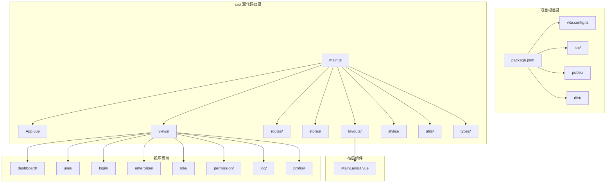
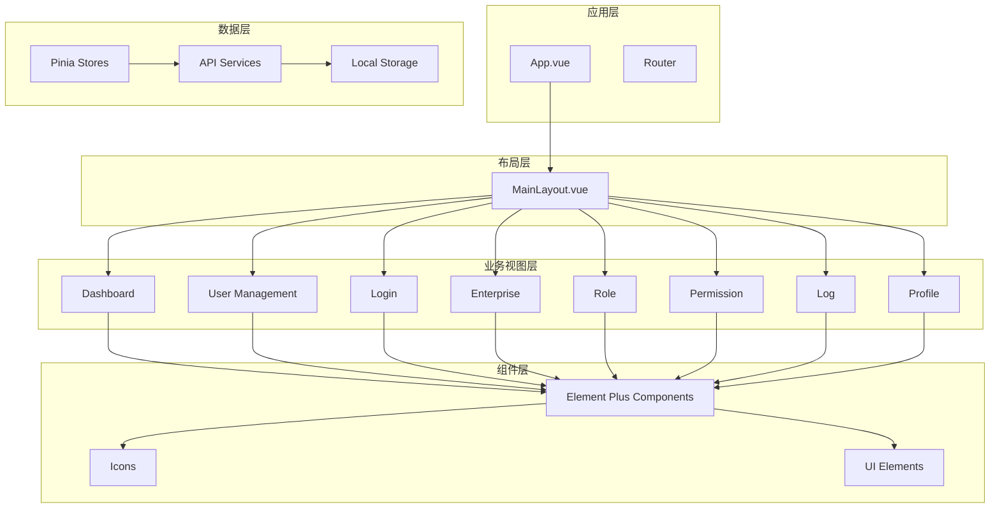
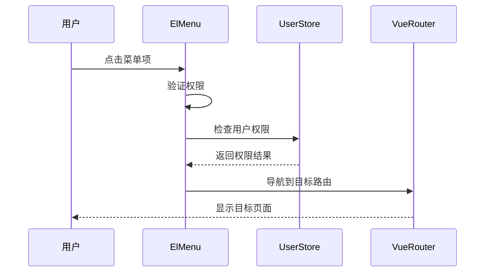
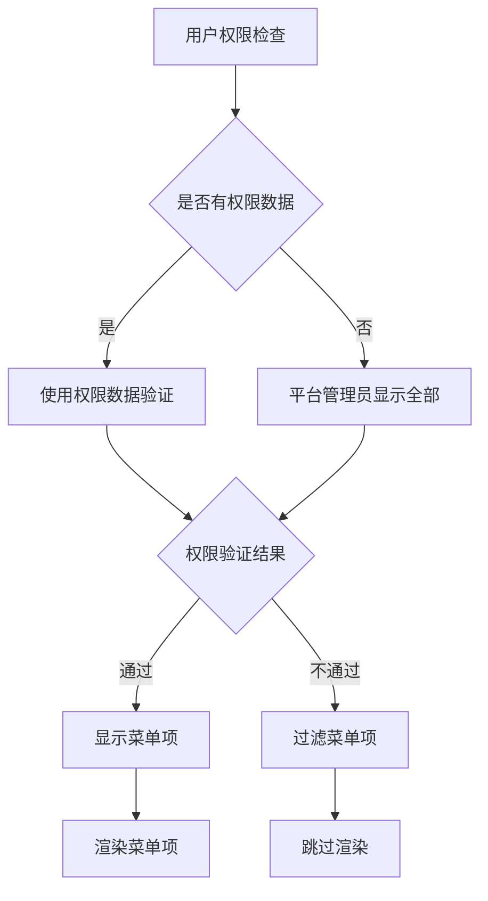
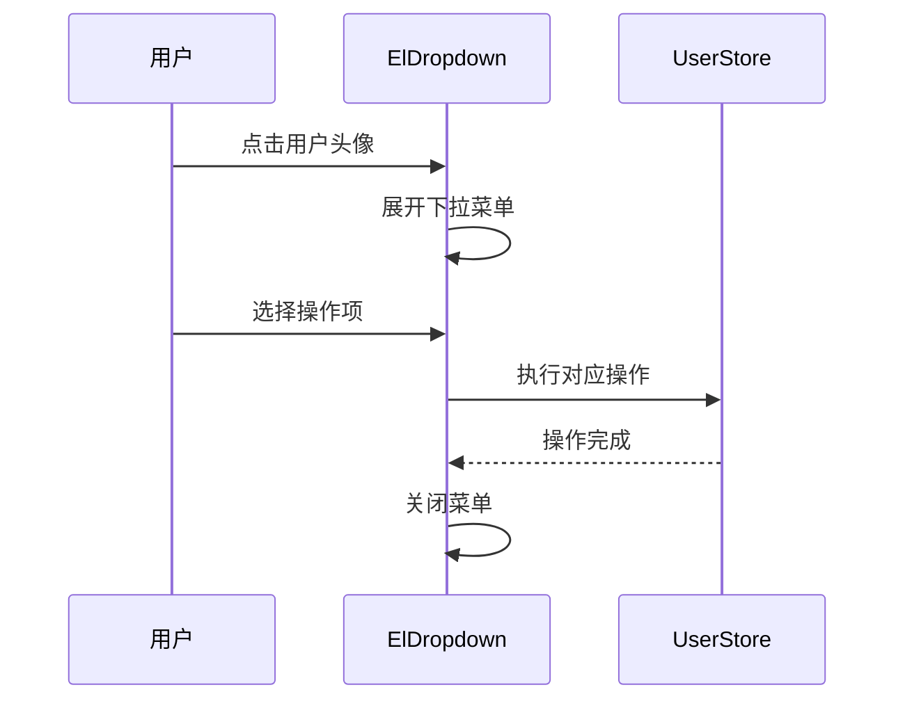
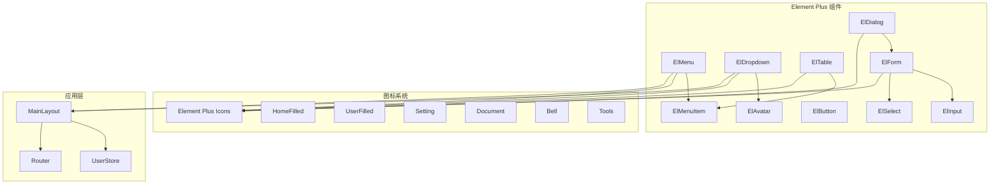
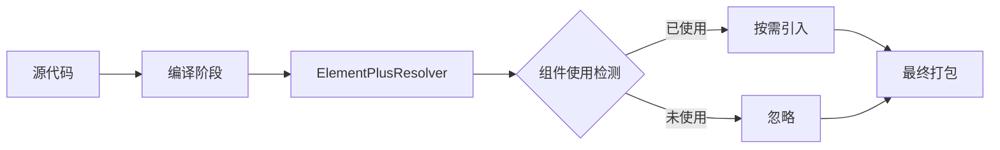

# Element Plus集成

<cite>
**本文档引用的文件**
- [package.json](file://package.json)
- [main.ts](file://src/main.ts)
- [vite.config.ts](file://vite.config.ts)
- [MainLayout.vue](file://src/layouts/MainLayout.vue)
- [App.vue](file://src/App.vue)
- [global.scss](file://src/styles/global.scss)
- [user.ts](file://src/stores/user.ts)
- [index.vue](file://src/views/dashboard/index.vue)
- [index.vue](file://src/views/user/index.vue)
- [index.vue](file://src/views/login/index.vue)
- [index.ts](file://src/router/index.ts)
- [index.ts](file://src/types/index.ts)
- [api.d.ts](file://src/types/api.d.ts)
</cite>

## 目录
1. [简介](#简介)
2. [项目结构](#项目结构)
3. [核心组件](#核心组件)
4. [架构概览](#架构概览)
5. [详细组件分析](#详细组件分析)
6. [依赖关系分析](#依赖关系分析)
7. [性能考虑](#性能考虑)
8. [故障排除指南](#故障排除指南)
9. [结论](#结论)

## 简介

本项目是一个基于Vue 3的企业级权限管理系统，集成了Element Plus组件库来构建现代化的用户界面。项目采用Vite作为构建工具，使用TypeScript进行开发，实现了完整的用户认证、权限管理和数据展示功能。

Element Plus在项目中的集成采用了现代化的按需引入策略，通过unplugin-auto-import和unplugin-vue-components插件实现自动导入和组件解析，大大提升了开发效率和应用性能。

## 项目结构

项目采用典型的Vue 3单页应用结构，主要目录组织如下：



**图表来源**
- [package.json:1-35](file://package.json#L1-L35)
- [main.ts:1-27](file://src/main.ts#L1-L27)

**章节来源**
- [package.json:1-35](file://package.json#L1-L35)
- [main.ts:1-27](file://src/main.ts#L1-L27)

## 核心组件

### Element Plus版本兼容性

项目当前使用的Element Plus版本为^2.9.7，与Vue 3.5.13完全兼容。版本选择遵循以下原则：

- **稳定性优先**：选择经过充分测试的稳定版本
- **功能完整性**：确保支持项目所需的所有组件特性
- **维护周期**：选择仍在积极维护的版本

### 安装配置流程

项目采用以下步骤完成Element Plus的安装和配置：

1. **依赖安装**
   ```bash
   npm install element-plus @element-plus/icons-vue
   ```

2. **全局样式引入**
   在main.ts中引入Element Plus的全局样式文件

3. **图标系统配置**
   通过@element-plus/icons-vue包提供丰富的图标资源

4. **按需引入配置**
   使用unplugin-auto-import和unplugin-vue-components插件实现智能导入

**章节来源**
- [package.json:13-22](file://package.json#L13-L22)
- [main.ts:3-5](file://src/main.ts#L3-L5)
- [vite.config.ts:11-22](file://vite.config.ts#L11-L22)

## 架构概览

项目采用分层架构设计，Element Plus组件在不同层次发挥重要作用：



**图表来源**
- [App.vue:1-10](file://src/App.vue#L1-L10)
- [MainLayout.vue:1-281](file://src/layouts/MainLayout.vue#L1-L281)
- [index.ts:12-75](file://src/router/index.ts#L12-L75)

## 详细组件分析

### ElMenu 导航菜单

ElMenu组件在项目中承担着主要的导航功能，实现了响应式侧边栏菜单系统。

#### 组件特性
- **响应式折叠**：支持菜单折叠和展开功能
- **动态权限控制**：根据用户权限动态显示菜单项
- **图标集成**：支持Element Plus内置图标
- **路由集成**：与Vue Router深度集成

#### 实现细节



**图表来源**
- [MainLayout.vue:45-64](file://src/layouts/MainLayout.vue#L45-L64)
- [MainLayout.vue:66-68](file://src/layouts/MainLayout.vue#L66-L68)

#### 关键配置
- `default-active`: 当前激活的菜单项
- `collapse`: 菜单折叠状态
- `router`: 启用路由模式
- `@select`: 菜单项选择事件

**章节来源**
- [MainLayout.vue:100-115](file://src/layouts/MainLayout.vue#L100-L115)
- [MainLayout.vue:45-64](file://src/layouts/MainLayout.vue#L45-L64)

### ElMenuItem 菜单项

ElMenuItem是ElMenu的核心子组件，负责具体菜单项的渲染和交互。

#### 动态菜单生成
组件支持动态生成菜单项，根据用户权限和业务需求灵活调整：



**图表来源**
- [MainLayout.vue:45-64](file://src/layouts/MainLayout.vue#L45-L64)

**章节来源**
- [MainLayout.vue:55-63](file://src/layouts/MainLayout.vue#L55-L63)

### ElDropdown 下拉菜单

ElDropdown组件用于用户信息下拉菜单，提供个人中心和退出登录功能。

#### 组件功能
- **用户信息展示**：显示用户头像和昵称
- **操作菜单**：提供个人中心和退出登录选项
- **图标集成**：使用Element Plus内置图标增强视觉效果

#### 事件处理流程



**图表来源**
- [MainLayout.vue:137-154](file://src/layouts/MainLayout.vue#L137-L154)
- [MainLayout.vue:74-80](file://src/layouts/MainLayout.vue#L74-L80)

**章节来源**
- [MainLayout.vue:137-154](file://src/layouts/MainLayout.vue#L137-L154)

### ElAvatar 头像组件

ElAvatar组件用于显示用户头像，支持本地图片和默认头像。

#### 头像管理策略
- **用户头像优先**：优先显示用户设置的头像
- **默认头像回退**：当用户未设置头像时显示默认图片
- **动态头像更新**：支持用户头像的实时更新

**章节来源**
- [MainLayout.vue:25-35](file://src/layouts/MainLayout.vue#L25-L35)

### ElTable 数据表格

ElTable组件在用户管理页面中用于展示用户列表数据。

#### 表格功能特性
- **分页支持**：集成ElPagination实现数据分页
- **排序功能**：支持列排序和自定义排序
- **筛选功能**：支持多条件筛选
- **操作列**：提供编辑、删除等操作按钮

#### 表格配置示例

**章节来源**
- [index.vue:231-262](file://src/views/user/index.vue#L231-L262)

### ElForm 表单组件

ElForm组件在登录页面和用户管理页面中广泛使用。

#### 表单验证机制
- **规则定义**：支持多种验证规则
- **实时验证**：输入时即时验证
- **错误提示**：友好的错误信息提示
- **图标集成**：使用prefix-icon增强用户体验

**章节来源**
- [index.vue:169-269](file://src/views/login/index.vue#L169-L269)

### ElDialog 对话框

ElDialog组件用于用户管理的增删改操作对话框。

#### 对话框功能
- **表单编辑**：支持用户信息的增删改
- **角色分配**：提供用户角色分配功能
- **确认对话框**：删除操作的安全确认
- **模态显示**：阻塞式对话框交互

**章节来源**
- [index.vue:277-324](file://src/views/user/index.vue#L277-L324)

## 依赖关系分析

### 组件依赖关系



**图表来源**
- [MainLayout.vue:4-16](file://src/layouts/MainLayout.vue#L4-L16)
- [index.vue:3-4](file://src/views/user/index.vue#L3-L4)
- [index.vue:4-5](file://src/views/login/index.vue#L4-L5)

### 插件依赖配置

项目使用多个Vite插件来优化Element Plus的使用体验：

| 插件名称 | 功能描述 | 配置要点 |
|---------|----------|----------|
| unplugin-auto-import | 自动导入Vue API和Element Plus组件 | ElementPlusResolver() |
| unplugin-vue-components | 组件自动注册 | ElementPlusResolver() |
| @vitejs/plugin-vue | Vue 3支持 | 基础构建支持 |

**章节来源**
- [vite.config.ts:11-22](file://vite.config.ts#L11-L22)

## 性能考虑

### 按需引入优化

项目采用按需引入策略，通过ElementPlusResolver()实现组件的懒加载：



**图表来源**
- [vite.config.ts:13](file://vite.config.ts#L13)
- [vite.config.ts:20](file://vite.config.ts#L20)

### 图标系统优化

项目使用统一的图标注册策略：

1. **批量注册**：通过循环遍历所有图标组件
2. **按需使用**：仅在需要时使用特定图标
3. **缓存机制**：避免重复注册相同图标

**章节来源**
- [main.ts:15-17](file://src/main.ts#L15-L17)

### 样式优化策略

项目采用CSS变量和SCSS预处理器优化样式管理：

- **CSS变量**：定义统一的颜色和尺寸变量
- **作用域样式**：使用scoped避免样式冲突
- **深度选择器**：合理使用::v-deep处理组件样式

**章节来源**
- [global.scss:1-31](file://src/styles/global.scss#L1-L31)
- [MainLayout.vue:205-224](file://src/layouts/MainLayout.vue#L205-L224)

## 故障排除指南

### 常见问题及解决方案

#### 1. 组件无法识别
**问题描述**：在模板中使用Element Plus组件时报错
**解决方案**：
- 确认ElementPlusResolver已正确配置
- 检查组件是否正确导入
- 验证Vite插件配置

#### 2. 图标不显示
**问题描述**：Element Plus图标在页面中不显示
**解决方案**：
- 确认图标组件已正确注册
- 检查图标名称大小写
- 验证图标导入路径

#### 3. 样式冲突
**问题描述**：Element Plus样式与其他样式冲突
**解决方案**：
- 使用scoped样式
- 避免全局样式的覆盖
- 合理使用深度选择器

#### 4. 性能问题
**问题描述**：应用启动缓慢或内存占用过高
**解决方案**：
- 确认按需引入配置正确
- 检查不必要的组件导入
- 优化图标使用策略

**章节来源**
- [vite.config.ts:11-22](file://vite.config.ts#L11-L22)
- [main.ts:15-17](file://src/main.ts#L15-L17)

## 结论

本项目成功集成了Element Plus组件库，实现了现代化的企业级管理界面。通过合理的配置策略和最佳实践，项目在保持良好用户体验的同时，也确保了代码的可维护性和性能表现。

### 主要成就

1. **完整的组件集成**：涵盖了导航、数据展示、表单、对话框等核心UI组件
2. **智能化配置**：通过Vite插件实现自动导入和组件解析
3. **权限驱动的UI**：实现了基于用户权限的动态菜单和功能控制
4. **图标系统优化**：提供了丰富的图标资源和统一的使用规范
5. **性能优化策略**：采用按需引入和懒加载技术提升应用性能

### 未来改进方向

1. **主题定制扩展**：进一步完善CSS变量体系
2. **国际化支持**：添加多语言支持功能
3. **无障碍访问**：提升应用的无障碍访问能力
4. **组件封装**：对常用组件进行二次封装以提高复用性

该项目为Element Plus在Vue 3项目中的集成提供了完整的参考实现，开发者可以基于此项目快速搭建类似的企业级管理应用。