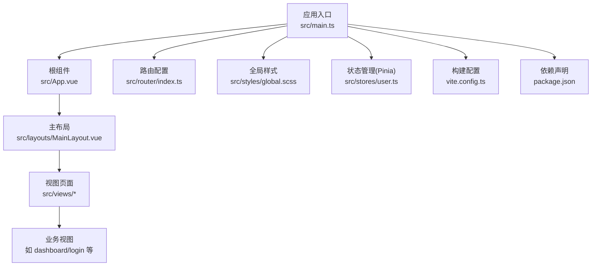
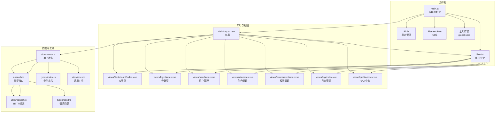
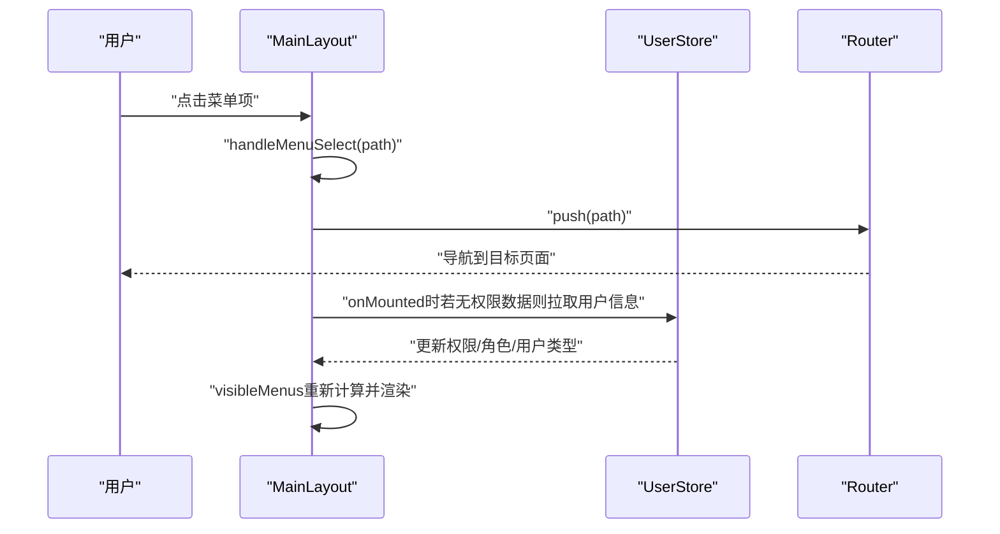
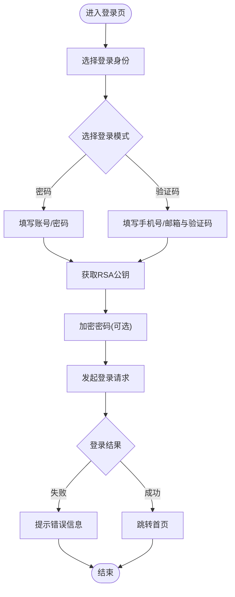
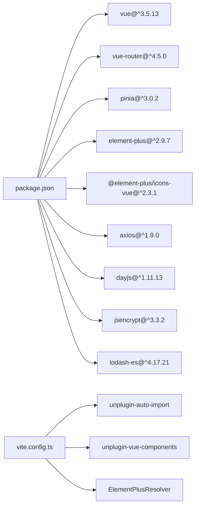

# UI组件系统

<cite>
**本文引用的文件**
- [src/main.ts](file://src/main.ts)
- [src/App.vue](file://src/App.vue)
- [src/layouts/MainLayout.vue](file://src/layouts/MainLayout.vue)
- [src/styles/global.scss](file://src/styles/global.scss)
- [package.json](file://package.json)
- [vite.config.ts](file://vite.config.ts)
- [src/router/index.ts](file://src/router/index.ts)
- [src/stores/user.ts](file://src/stores/user.ts)
- [src/views/dashboard/index.vue](file://src/views/dashboard/index.vue)
- [src/views/login/index.vue](file://src/views/login/index.vue)
- [src/types/index.ts](file://src/types/index.ts)
- [src/types/api.d.ts](file://src/types/api.d.ts)
- [src/api/auth.ts](file://src/api/auth.ts)
- [src/utils/index.ts](file://src/utils/index.ts)
- [src/utils/request.ts](file://src/utils/request.ts)
</cite>

## 目录
1. [简介](#简介)
2. [项目结构](#项目结构)
3. [核心组件](#核心组件)
4. [架构总览](#架构总览)
5. [详细组件分析](#详细组件分析)
6. [依赖分析](#依赖分析)
7. [性能考虑](#性能考虑)
8. [故障排查指南](#故障排查指南)
9. [结论](#结论)
10. [附录](#附录)

## 简介
本文件系统性梳理并文档化本项目的UI组件体系，重点覆盖以下方面：
- Element Plus 组件库的集成与配置方式
- 自定义组件开发规范与使用方法
- 主布局组件 MainLayout 的设计理念与实现细节（响应式侧边栏、动态菜单生成、权限控制的菜单显示）
- 全局样式组织与主题定制方案
- 组件使用示例、属性配置、事件处理与样式定制方法
- 响应式设计实现、动画效果与用户体验优化
- 组件复用策略与最佳实践

## 项目结构
项目采用基于功能域的目录组织方式，前端入口在 src 下，核心包括应用入口、路由、状态管理、布局、视图、样式与工具类等模块。

图表来源
- [src/main.ts:1-27](file://src/main.ts#L1-L27)
- [src/App.vue:1-10](file://src/App.vue#L1-L10)
- [src/router/index.ts:1-127](file://src/router/index.ts#L1-L127)
- [src/styles/global.scss:1-131](file://src/styles/global.scss#L1-L131)
- [src/stores/user.ts:1-152](file://src/stores/user.ts#L1-L152)
- [src/layouts/MainLayout.vue:1-281](file://src/layouts/MainLayout.vue#L1-L281)
- [vite.config.ts:1-46](file://vite.config.ts#L1-L46)
- [package.json:1-35](file://package.json#L1-L35)

章节来源
- [src/main.ts:1-27](file://src/main.ts#L1-L27)
- [src/App.vue:1-10](file://src/App.vue#L1-L10)
- [src/router/index.ts:1-127](file://src/router/index.ts#L1-L127)
- [src/styles/global.scss:1-131](file://src/styles/global.scss#L1-L131)
- [vite.config.ts:1-46](file://vite.config.ts#L1-L46)
- [package.json:1-35](file://package.json#L1-L35)

## 核心组件
- 应用入口与插件注册：在应用启动时完成 Pinia、路由、Element Plus 及图标全局注册，并引入全局样式与用户状态初始化。
- 主布局组件 MainLayout：提供侧边栏、头部导航、面包屑与内容区，支持折叠切换、动态菜单渲染与权限控制。
- 视图组件：以页面为单位组织，如仪表盘、登录、用户管理、角色管理、权限管理、日志管理、个人中心等。
- 全局样式：通过 CSS 变量统一管理颜色、字体、间距与圆角等基础样式，提供常用布局辅助类。
- 路由与权限：通过路由元信息声明标题、鉴权与所需权限；前置守卫结合用户权限进行访问控制。
- 状态管理：Pinia Store 管理用户令牌、用户信息、权限与角色，提供持久化与权限校验能力。
- 工具与请求封装：统一封装 Axios 请求拦截器、错误处理与通用工具函数（加密、防抖节流、格式化等）。

章节来源
- [src/main.ts:1-27](file://src/main.ts#L1-L27)
- [src/layouts/MainLayout.vue:1-281](file://src/layouts/MainLayout.vue#L1-L281)
- [src/views/dashboard/index.vue:1-160](file://src/views/dashboard/index.vue#L1-L160)
- [src/views/login/index.vue:1-323](file://src/views/login/index.vue#L1-L323)
- [src/styles/global.scss:1-131](file://src/styles/global.scss#L1-L131)
- [src/router/index.ts:1-127](file://src/router/index.ts#L1-L127)
- [src/stores/user.ts:1-152](file://src/stores/user.ts#L1-L152)
- [src/utils/request.ts:1-148](file://src/utils/request.ts#L1-L148)
- [src/utils/index.ts:1-85](file://src/utils/index.ts#L1-L85)

## 架构总览
下图展示从应用入口到各子系统的交互关系，以及 Element Plus 在其中的角色定位。

图表来源
- [src/main.ts:1-27](file://src/main.ts#L1-L27)
- [src/layouts/MainLayout.vue:1-281](file://src/layouts/MainLayout.vue#L1-L281)
- [src/router/index.ts:1-127](file://src/router/index.ts#L1-L127)
- [src/stores/user.ts:1-152](file://src/stores/user.ts#L1-L152)
- [src/api/auth.ts:1-69](file://src/api/auth.ts#L1-L69)
- [src/utils/request.ts:1-148](file://src/utils/request.ts#L1-L148)
- [src/types/index.ts:1-188](file://src/types/index.ts#L1-L188)
- [src/types/api.d.ts:1-156](file://src/types/api.d.ts#L1-L156)
- [src/utils/index.ts:1-85](file://src/utils/index.ts#L1-L85)

## 详细组件分析

### Element Plus 集成与配置
- 插件注册：在应用入口中安装 Element Plus，并将图标组件批量注册为全局组件，避免重复导入。
- 自动导入：通过 Vite 插件自动导入 Element Plus 组件与图标，减少样板代码。
- 样式引入：在入口处引入 Element Plus 的全局样式，确保组件样式一致。
- 按需解析：Vite 插件使用 ElementPlusResolver 实现按需解析，提升打包效率。

章节来源
- [src/main.ts:1-27](file://src/main.ts#L1-L27)
- [vite.config.ts:1-46](file://vite.config.ts#L1-L46)
- [package.json:1-35](file://package.json#L1-L35)

### 主布局组件 MainLayout 设计与实现
- 结构组成：侧边栏（Logo、菜单）、内容区（Header 头部、Main 内容）、面包屑导航与用户下拉菜单。
- 响应式侧边栏：通过折叠状态切换宽度与图标/文字显示逻辑，配合过渡动画。
- 动态菜单生成：根据用户类型与权限动态过滤可显示菜单项，支持图标组件动态渲染。
- 权限控制：优先使用用户权限列表进行显隐判断；若无权限数据则平台管理员默认可见，其他用户仅显示基础菜单。
- 用户信息展示：根据用户类型选择昵称/姓名与头像，支持个人中心跳转与退出登录。
- 菜单选中与路由联动：菜单选中与当前路由保持一致，点击菜单项触发路由跳转。

图表来源
- [src/layouts/MainLayout.vue:66-90](file://src/layouts/MainLayout.vue#L66-L90)
- [src/stores/user.ts:41-60](file://src/stores/user.ts#L41-L60)
- [src/router/index.ts:82-124](file://src/router/index.ts#L82-L124)

章节来源
- [src/layouts/MainLayout.vue:1-281](file://src/layouts/MainLayout.vue#L1-L281)
- [src/stores/user.ts:1-152](file://src/stores/user.ts#L1-L152)
- [src/router/index.ts:1-127](file://src/router/index.ts#L1-L127)

### 登录页组件 Login
- 多身份登录：支持 C 端、B 端与平台管理员三种登录类型，动态切换表单规则与字段。
- 多模式登录：密码登录与验证码登录两种模式，B 端支持企业信息校验。
- 安全增强：登录前获取 RSA 公钥并对密码进行加密传输。
- 表单验证：基于 Element Plus 表单组件与规则进行输入校验。
- 交互反馈：加载状态、倒计时、消息提示与路由跳转。

图表来源
- [src/views/login/index.vue:1-323](file://src/views/login/index.vue#L1-L323)
- [src/api/auth.ts:22-68](file://src/api/auth.ts#L22-L68)
- [src/utils/index.ts:3-7](file://src/utils/index.ts#L3-L7)

章节来源
- [src/views/login/index.vue:1-323](file://src/views/login/index.vue#L1-L323)
- [src/api/auth.ts:1-69](file://src/api/auth.ts#L1-L69)
- [src/utils/index.ts:1-85](file://src/utils/index.ts#L1-L85)

### 仪表盘组件 Dashboard
- 卡片与统计：使用卡片容器与统计组件展示关键指标，配合图标与颜色区分状态。
- 快捷操作：提供按钮集合用于快速跳转至管理页面。
- 系统信息：展示版本、环境与用户类型等信息。
- 响应式布局：使用栅格系统适配不同屏幕尺寸。

章节来源
- [src/views/dashboard/index.vue:1-160](file://src/views/dashboard/index.vue#L1-L160)

### 全局样式与主题定制
- CSS 变量：在根作用域定义主色、文本色、边框色、背景色、字号、间距与圆角等变量，便于统一主题风格。
- 基础排版：统一字体、字号、颜色与链接样式，消除浏览器差异。
- 页面容器与布局：提供页面容器、标题、表格操作区与 Flex 辅助类，提升页面一致性。
- 组件样式覆盖：通过深度选择器覆盖 Element Plus 组件样式，例如侧边栏菜单项的悬停与激活态。

章节来源
- [src/styles/global.scss:1-131](file://src/styles/global.scss#L1-L131)
- [src/layouts/MainLayout.vue:165-280](file://src/layouts/MainLayout.vue#L165-L280)

### 路由与权限控制
- 路由元信息：在路由中声明标题、是否需要鉴权与所需权限数组。
- 前置守卫：根据 Token 判断是否放行；对需要鉴权的路由进行权限校验；未登录重定向至登录页；已登录禁止重复进入登录页。
- 动态权限：在页面加载后若用户权限为空，则拉取用户信息并再次校验。

章节来源
- [src/router/index.ts:1-127](file://src/router/index.ts#L1-L127)
- [src/stores/user.ts:90-127](file://src/stores/user.ts#L90-L127)

### 状态管理与权限模型
- 用户状态：维护 Token、用户信息、登录响应、用户类型、角色与权限等。
- 权限校验：提供 hasPermission 与 hasRole 方法，供菜单与页面权限控制使用。
- 持久化：本地存储 Token 与用户信息，应用启动时从存储恢复状态。

章节来源
- [src/stores/user.ts:1-152](file://src/stores/user.ts#L1-L152)

### 请求封装与错误处理
- Axios 实例：统一基地址、超时、凭证与请求头。
- 请求拦截：自动注入 Authorization 头。
- 响应拦截：统一处理业务状态码、未授权、无权限、网络错误等场景，弹出消息提示并进行路由跳转。
- 工具函数：提供 get/post/put/del 封装与通用工具（加密、防抖节流、格式化、下载等）。

章节来源
- [src/utils/request.ts:1-148](file://src/utils/request.ts#L1-L148)
- [src/utils/index.ts:1-85](file://src/utils/index.ts#L1-L85)

## 依赖分析
- 运行时依赖：Vue 3、Vue Router、Pinia、Element Plus、图标库、Axios、日期时间库、加密库、工具库。
- 开发依赖：Vite、Vue 插件、自动导入与组件解析插件、Sass、TypeScript 类型检查工具。
- 构建配置：启用 Element Plus Resolver 实现按需加载与自动导入，设置路径别名与开发代理。

图表来源
- [package.json:1-35](file://package.json#L1-L35)
- [vite.config.ts:1-46](file://vite.config.ts#L1-L46)

章节来源
- [package.json:1-35](file://package.json#L1-L35)
- [vite.config.ts:1-46](file://vite.config.ts#L1-L46)

## 性能考虑
- 按需加载：通过 Element Plus Resolver 与自动导入插件减少打包体积。
- 组件懒加载：路由层面使用动态导入，降低首屏负载。
- 缓存与复用：用户信息与 Token 存储于本地，应用启动时快速恢复状态。
- 图标按需：仅在需要时引入图标组件，避免全局注册过多组件。
- 样式隔离：使用作用域样式与深度选择器，避免全局污染。

## 故障排查指南
- 登录失败或频繁提示“登录已过期”：检查请求拦截器中未授权处理逻辑与 Token 清理流程。
- 权限不足导致页面无法访问：确认路由元信息中的权限数组与用户权限列表是否匹配。
- 菜单不显示或显示异常：检查用户类型与权限判断逻辑，确认 hasPermission 返回值。
- 样式不生效：确认是否正确使用深度选择器覆盖 Element Plus 样式，以及全局样式加载顺序。

章节来源
- [src/utils/request.ts:20-35](file://src/utils/request.ts#L20-L35)
- [src/router/index.ts:96-115](file://src/router/index.ts#L96-L115)
- [src/layouts/MainLayout.vue:45-64](file://src/layouts/MainLayout.vue#L45-L64)

## 结论
本项目以 Element Plus 为核心 UI 基座，结合 Pinia、Vue Router 与 Vite 插件生态，实现了统一的主题风格、灵活的权限控制与良好的开发体验。主布局组件通过动态菜单与权限控制提升了系统的可维护性与安全性；全局样式与类型系统保证了跨页面的一致性与可扩展性。建议在后续迭代中持续优化组件抽象与复用策略，进一步完善国际化与无障碍支持。

## 附录
- 组件使用示例与最佳实践
  - 使用 Element Plus 组件时，优先通过自动导入与按需解析方式引入，避免手动 import 导致的包体膨胀。
  - 在布局组件中统一处理面包屑与用户信息展示，减少重复代码。
  - 对需要权限控制的菜单与页面，务必在路由元信息中声明 permissions，并在页面加载后进行二次校验。
  - 样式定制遵循“变量优先、局部作用域、深度选择器谨慎使用”的原则。
- 属性配置与事件处理
  - 菜单组件：通过 default-active、collapse、collapse-transition、router 等属性控制行为；通过 select 事件处理路由跳转。
  - 表单组件：通过 rules 与 ref 控制校验与重置；通过 loading 状态优化交互体验。
- 响应式设计与动画
  - 侧边栏折叠使用过渡动画，提升视觉连贯性；页面布局采用 Flex 与栅格系统，适配多终端。
- 复用策略
  - 将通用逻辑抽取为 Composable 或 Store 方法，如权限判断、用户信息获取等。
  - 抽象可复用的表单与对话框组件，统一错误提示与加载状态。