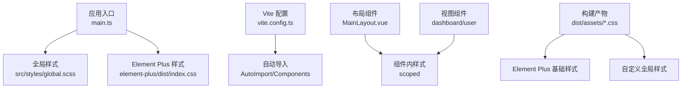
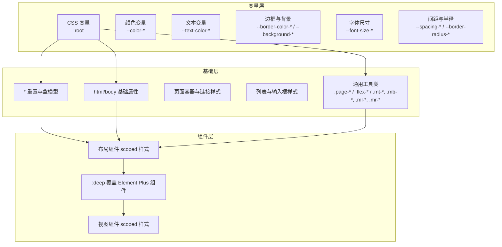
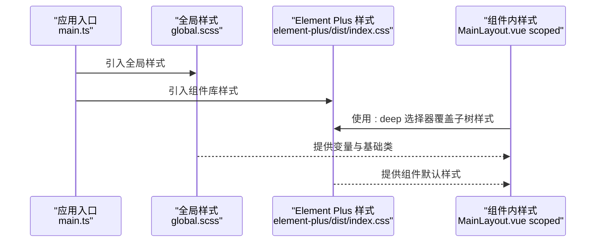
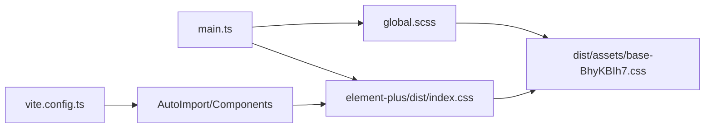

# 全局样式系统

<cite>
**本文引用的文件**
- [global.scss](file://src/styles/global.scss)
- [main.ts](file://src/main.ts)
- [vite.config.ts](file://vite.config.ts)
- [package.json](file://package.json)
- [base-BhyKBIh7.css](file://dist/assets/base-BhyKBIh7.css)
- [el-button-DITZ5HsB.css](file://dist/assets/el-button-DITZ5HsB.css)
- [MainLayout.vue](file://src/layouts/MainLayout.vue)
- [index.vue（仪表盘）](file://src/views/dashboard/index.vue)
- [index.vue（用户管理）](file://src/views/user/index.vue)
</cite>

## 目录
1. [引言](#引言)
2. [项目结构](#项目结构)
3. [核心组件](#核心组件)
4. [架构总览](#架构总览)
5. [详细组件分析](#详细组件分析)
6. [依赖分析](#依赖分析)
7. [性能考量](#性能考量)
8. [故障排查指南](#故障排查指南)
9. [结论](#结论)
10. [附录](#附录)

## 引言
本文件系统性梳理并文档化本项目的全局样式体系，重点围绕以下目标展开：  
- 解析 global.scss 的组织结构与命名规范  
- 说明 SCSS 变量系统（颜色、字体、间距等）的定义与作用域  
- 文档化全局样式对 Element Plus 组件的覆盖策略  
- 解释响应式断点与媒体查询的使用方式  
- 提供 CSS 类名命名约定、样式模块化与作用域隔离的最佳实践  
- 覆盖样式性能优化、浏览器兼容性与可维护性建议  
- 提供调试技巧与常见问题的解决方案  

## 项目结构
本项目采用“入口注入 + 组件内样式”的混合架构：  
- 在应用入口统一引入全局样式，确保全局变量与基础样式在所有页面生效  
- 使用 Vite 插件自动导入 Element Plus 组件，减少重复引入  
- 组件内部通过 scoped 样式实现作用域隔离，避免全局污染  
- 构建产物中包含 Element Plus 的 CSS 变量与组件样式，便于覆盖与定制

图表来源
- [main.ts:10](file://src/main.ts#L10)
- [vite.config.ts:9-23](file://vite.config.ts#L9-L23)
- [base-BhyKBIh7.css:1-2](file://dist/assets/base-BhyKBIh7.css#L1-L2)

章节来源
- [main.ts:10](file://src/main.ts#L10)
- [vite.config.ts:9-23](file://vite.config.ts#L9-L23)
- [package.json:13-22](file://package.json#L13-L22)

## 核心组件
- 全局样式入口：global.scss 定义 CSS 变量、基础排版与通用工具类  
- 应用入口注入：在 main.ts 中引入 global.scss，保证全局样式优先加载  
- Element Plus 样式：通过 element-plus/dist/index.css 引入组件库基础样式  
- Vite 插件：AutoImport 与 Components 自动解析 Element Plus 组件，提升开发效率  
- 组件内样式：各页面与布局组件使用 scoped 样式，配合 :deep 选择器进行深层覆盖

章节来源
- [global.scss:1-131](file://src/styles/global.scss#L1-L131)
- [main.ts:10](file://src/main.ts#L10)
- [vite.config.ts:9-23](file://vite.config.ts#L9-L23)

## 架构总览
全局样式系统由“变量层 → 基础层 → 组件层”三层构成：  
- 变量层：以 CSS 自定义属性形式集中定义颜色、字体、间距、圆角等  
- 基础层：重置默认样式、设置根元素与页面容器的基础属性  
- 组件层：通过 scoped 样式与 :deep 选择器覆盖 Element Plus 组件样式

图表来源
- [global.scss:1-131](file://src/styles/global.scss#L1-L131)
- [MainLayout.vue:165-280](file://src/layouts/MainLayout.vue#L165-L280)
- [index.vue（仪表盘）:110-159](file://src/views/dashboard/index.vue#L110-L159)
- [index.vue（用户管理）:328-359](file://src/views/user/index.vue#L328-L359)

## 详细组件分析

### global.scss 组织结构与命名规范
- 变量定义集中在 :root，采用语义化前缀（如 --color-*、--text-color-*、--font-size-*、--spacing-*、--border-radius-*），便于跨组件复用与主题切换  
- 基础样式覆盖：通配符重置与盒模型统一；html/body 设置字体族、字号与文本色；页面容器与标题、列表、输入框等基础元素的统一风格  
- 工具类命名：采用 BEM 风格或语义化前缀，如 .page-*、.flex-*、.mt-*/.mb-*/.ml-*/.mr-*，强调可读性与可组合性

章节来源
- [global.scss:1-31](file://src/styles/global.scss#L1-L31)
- [global.scss:33-67](file://src/styles/global.scss#L33-L67)
- [global.scss:69-131](file://src/styles/global.scss#L69-L131)

### SCSS 变量系统与作用域
- 变量类型与用途
  - 颜色变量：主色、成功、警告、危险、信息色及明暗梯度，用于按钮、标签、图标等组件态  
  - 文本变量：主文本、常规文本、次级文本、占位文本，用于正文、说明、禁用态等  
  - 边框与背景：基础边框、浅色边框、极浅背景、深色背景，用于卡片、分隔线、页面背景  
  - 字体尺寸：基础、小号、大号，用于正文、说明、标题等层级  
  - 间距与圆角：基础间距、小/大间距、基础圆角、小圆角，用于组件内外边距与过渡圆角  
- 作用域与继承：变量定义于 :root，可在全局通过 var() 访问；组件内可通过 CSS 自定义属性覆盖或在 Element Plus 样式中通过变量重写实现主题化

章节来源
- [global.scss:1-31](file://src/styles/global.scss#L1-L31)
- [base-BhyKBIh7.css:1-2](file://dist/assets/base-BhyKBIh7.css#L1-L2)

### 全局样式覆盖策略（Element Plus）
- 基础变量覆盖：构建产物中包含 Element Plus 的 CSS 变量（如 --el-color-primary、--el-font-size-base 等），可在全局通过 :root 或自定义变量进行统一替换  
- 深度选择器覆盖：在组件内使用 :deep 选择器对 Element Plus 子树样式进行精准覆盖，避免影响其他组件  
- 组件态定制：针对按钮、表单、表格等高频组件，通过变量与类名组合实现统一风格

图表来源
- [main.ts:5-10](file://src/main.ts#L5-L10)
- [MainLayout.vue:205-224](file://src/layouts/MainLayout.vue#L205-L224)
- [base-BhyKBIh7.css:1-2](file://dist/assets/base-BhyKBIh7.css#L1-L2)

章节来源
- [main.ts:5-10](file://src/main.ts#L5-L10)
- [MainLayout.vue:205-224](file://src/layouts/MainLayout.vue#L205-L224)
- [el-button-DITZ5HsB.css:1-2](file://dist/assets/el-button-DITZ5HsB.css#L1-L2)

### 响应式断点与媒体查询
- 当前代码未显式使用媒体查询；建议在 global.scss 中新增断点变量（如移动端、平板、桌面端），并在组件内按需使用  
- 断点建议：以 768px（平板竖屏）、1024px（桌面小屏）、1200px（桌面大屏）为基准，结合 Element Plus 组件的响应特性进行适配

章节来源
- [global.scss:1-131](file://src/styles/global.scss#L1-L131)

### CSS 类名命名约定、模块化与作用域隔离
- 命名约定
  - 页面级容器：.page-container、.page-header、.page-title  
  - 布局辅助：.flex、.flex-center、.flex-between  
  - 间距工具：.mt-10/.mt-20、.mb-10/.mb-20、.ml-10、.mr-10  
- 模块化与作用域
  - 组件内使用 scoped 样式，避免全局污染  
  - 对 Element Plus 子树使用 :deep 进行局部覆盖，保持组件边界清晰  
  - 通用工具类放置于全局样式，提高复用性与一致性

章节来源
- [global.scss:69-131](file://src/styles/global.scss#L69-L131)
- [MainLayout.vue:165-280](file://src/layouts/MainLayout.vue#L165-L280)
- [index.vue（仪表盘）:110-159](file://src/views/dashboard/index.vue#L110-L159)
- [index.vue（用户管理）:328-359](file://src/views/user/index.vue#L328-L359)

## 依赖分析
- 全局样式依赖关系
  - main.ts 引入 global.scss，确保全局变量与基础样式在应用启动时加载  
  - Element Plus 样式通过 element-plus/dist/index.css 注入，提供组件默认样式  
  - Vite 插件 AutoImport 与 Components 自动解析 Element Plus 组件，减少手动引入成本  
- 构建产物
  - dist/assets/base-BhyKBIh7.css 包含 Element Plus 的 CSS 变量与过渡动画  
  - dist/assets/el-button-DITZ5HsB.css 展示了按钮组件的变量化样式，便于理解覆盖方式

图表来源
- [main.ts:5-10](file://src/main.ts#L5-L10)
- [vite.config.ts:9-23](file://vite.config.ts#L9-L23)
- [base-BhyKBIh7.css:1-2](file://dist/assets/base-BhyKBIh7.css#L1-L2)

章节来源
- [main.ts:5-10](file://src/main.ts#L5-L10)
- [vite.config.ts:9-23](file://vite.config.ts#L9-L23)
- [package.json:13-22](file://package.json#L13-L22)

## 性能考量
- 样式体积控制
  - 合理拆分全局样式与组件内样式，避免重复定义相同规则  
  - 使用变量与工具类替代硬编码值，减少 CSS 体积  
- 加载顺序
  - 将全局样式置于组件样式之前，确保变量与基础样式优先生效  
- 构建优化
  - 关闭生产 sourcemap，避免额外体积与安全风险  
  - 控制 chunk 大小，避免单文件过大导致加载缓慢  

章节来源
- [vite.config.ts:40-44](file://vite.config.ts#L40-L44)

## 故障排查指南
- Element Plus 样式未生效
  - 确认 main.ts 中已引入 element-plus/dist/index.css 与 global.scss  
  - 检查组件内是否正确使用 :deep 选择器覆盖子树样式  
- 变量未被识别
  - 确保变量定义于 :root，组件内通过 var() 访问  
  - 检查构建产物中是否存在 Element Plus 的 CSS 变量，必要时在全局重新声明  
- 媒体查询不生效
  - 在 global.scss 中新增断点变量，并在组件内按需使用  
- 样式冲突
  - 使用 scoped 样式与 :deep 精准定位，避免全局污染  
  - 通过类名组合与语义化命名降低耦合度  

章节来源
- [main.ts:5-10](file://src/main.ts#L5-L10)
- [global.scss:1-131](file://src/styles/global.scss#L1-L131)
- [MainLayout.vue:205-224](file://src/layouts/MainLayout.vue#L205-L224)

## 结论
本项目的全局样式系统以 CSS 变量为核心，结合全局重置与通用工具类，形成统一的视觉与交互基线；通过 Vite 插件与 Element Plus 的深度集成，实现了高效的组件开发与一致的主题表现。建议后续补充响应式断点与更完善的覆盖策略，持续优化样式体积与加载性能，确保在多端场景下的稳定与可维护性。

## 附录
- 参考文件路径
  - [global.scss](file://src/styles/global.scss)
  - [main.ts](file://src/main.ts)
  - [vite.config.ts](file://vite.config.ts)
  - [package.json](file://package.json)
  - [base-BhyKBIh7.css](file://dist/assets/base-BhyKBIh7.css)
  - [el-button-DITZ5HsB.css](file://dist/assets/el-button-DITZ5HsB.css)
  - [MainLayout.vue](file://src/layouts/MainLayout.vue)
  - [index.vue（仪表盘）](file://src/views/dashboard/index.vue)
  - [index.vue（用户管理）](file://src/views/user/index.vue)