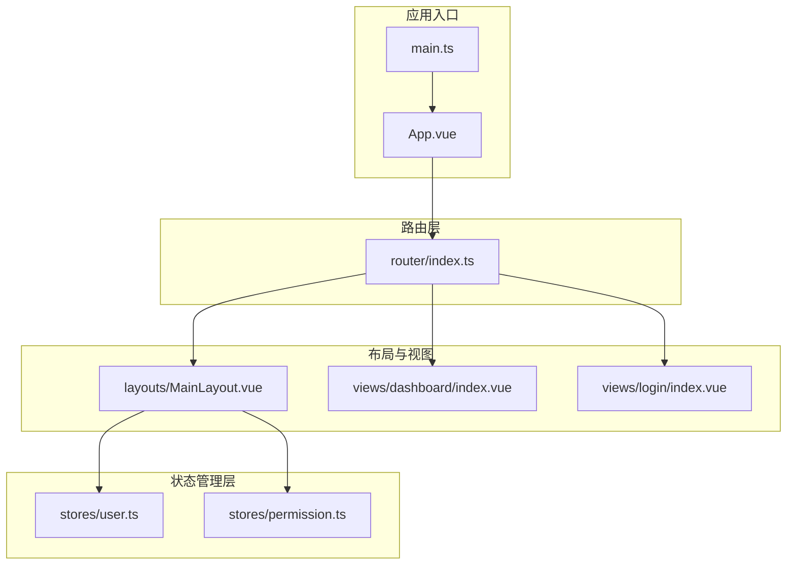
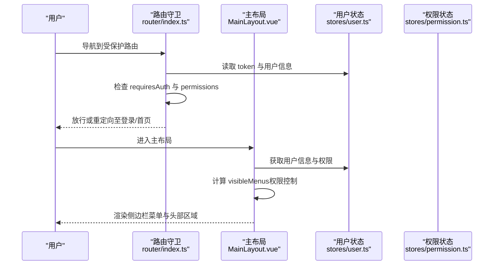
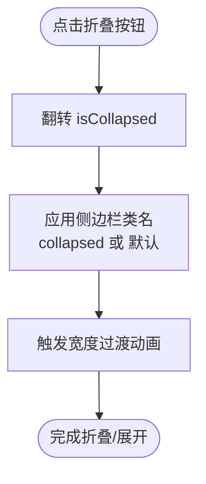
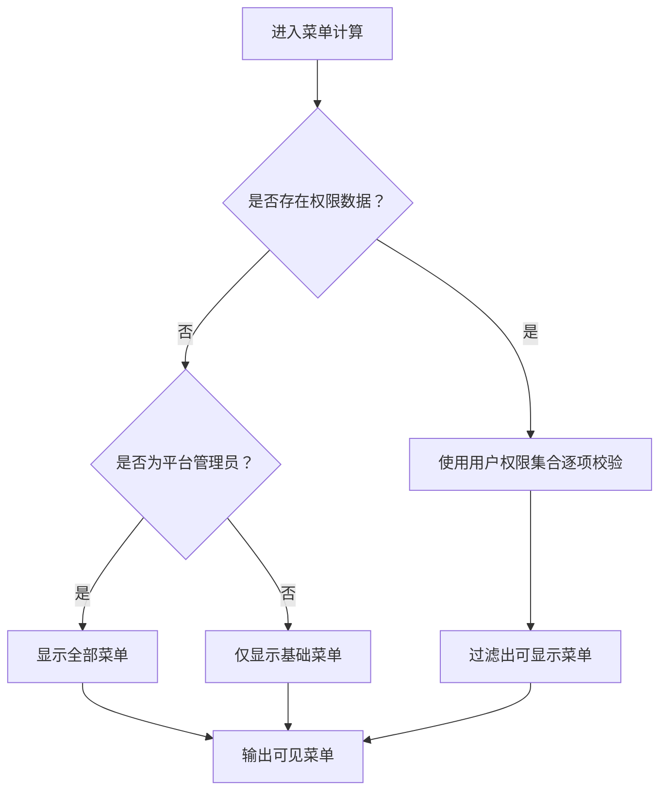
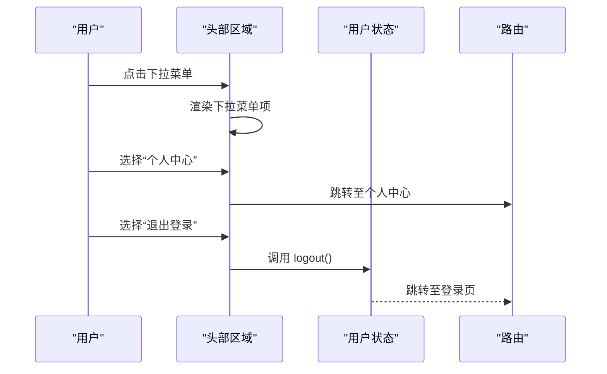
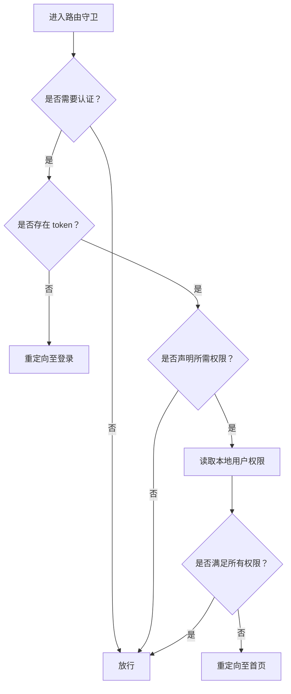
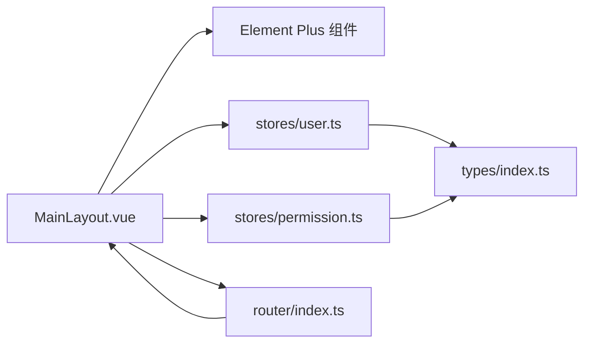

# 布局组件

<cite>
**本文引用的文件**
- [MainLayout.vue](file://src/layouts/MainLayout.vue)
- [user.ts](file://src/stores/user.ts)
- [permission.ts](file://src/stores/permission.ts)
- [index.ts](file://src/router/index.ts)
- [index.ts](file://src/types/index.ts)
- [main.ts](file://src/main.ts)
- [App.vue](file://src/App.vue)
- [dashboard/index.vue](file://src/views/dashboard/index.vue)
- [login/index.vue](file://src/views/login/index.vue)
</cite>

## 目录
1. [简介](#简介)
2. [项目结构](#项目结构)
3. [核心组件](#核心组件)
4. [架构总览](#架构总览)
5. [详细组件分析](#详细组件分析)
6. [依赖关系分析](#依赖关系分析)
7. [性能考虑](#性能考虑)
8. [故障排查指南](#故障排查指南)
9. [结论](#结论)
10. [附录](#附录)

## 简介
本文件面向“布局组件”的设计与实现，重点围绕 MainLayout 主布局组件进行系统性解析。内容涵盖：
- 响应式侧边栏的折叠/展开逻辑与宽度切换动画
- 动态菜单生成机制与权限控制的菜单显示逻辑
- 头部区域的面包屑导航、用户信息下拉菜单与身份标签
- 布局组件的使用方式、属性配置、事件处理与样式定制
- 响应式适配、组件间通信与状态管理最佳实践

## 项目结构
该工程采用基于功能域的组织方式，布局组件位于 src/layouts/MainLayout.vue，配合 Pinia 状态管理与 Vue Router 路由体系共同构成前端框架骨架。

图表来源
- [main.ts:1-27](file://src/main.ts#L1-L27)
- [App.vue:1-10](file://src/App.vue#L1-L10)
- [index.ts:1-127](file://src/router/index.ts#L1-L127)
- [MainLayout.vue:1-281](file://src/layouts/MainLayout.vue#L1-L281)
- [user.ts:1-152](file://src/stores/user.ts#L1-L152)
- [permission.ts:1-56](file://src/stores/permission.ts#L1-L56)
- [dashboard/index.vue:1-160](file://src/views/dashboard/index.vue#L1-L160)
- [login/index.vue:1-323](file://src/views/login/index.vue#L1-L323)

章节来源
- [main.ts:1-27](file://src/main.ts#L1-L27)
- [index.ts:1-127](file://src/router/index.ts#L1-L127)

## 核心组件
本节聚焦 MainLayout 主布局组件，从职责划分、数据流、交互流程与样式策略四个维度进行剖析。

- 职责边界
  - 统一承载侧边栏菜单、头部区域与主内容区
  - 维护侧边栏折叠状态与当前激活菜单
  - 基于用户身份与权限动态生成菜单
  - 提供头部区域的面包屑、身份标签与用户下拉菜单

- 数据与状态
  - 本地状态：isCollapsed（侧边栏折叠）、activeMenu（当前激活路径）
  - 计算属性：userName、userAvatar、userTypeLabel、visibleMenus
  - 依赖状态：useUserStore（用户信息、权限、登录态）

- 交互与事件
  - 菜单选择：handleMenuSelect
  - 折叠切换：toggleCollapse
  - 用户下拉命令：handleCommand（跳转个人中心、退出登录）

- 样式策略
  - 侧边栏默认宽度与折叠宽度切换，配合过渡动画
  - 头部阴影与用户信息悬停高亮
  - 主内容区滚动与背景色

章节来源
- [MainLayout.vue:1-281](file://src/layouts/MainLayout.vue#L1-L281)
- [user.ts:1-152](file://src/stores/user.ts#L1-L152)

## 架构总览
MainLayout 作为路由的根组件，通过路由元信息驱动面包屑标题与权限校验；通过 Pinia 管理用户与权限状态；通过 Element Plus 的菜单与下拉组件实现交互。

图表来源
- [index.ts:82-124](file://src/router/index.ts#L82-L124)
- [MainLayout.vue:45-64](file://src/layouts/MainLayout.vue#L45-L64)
- [user.ts:1-152](file://src/stores/user.ts#L1-L152)
- [permission.ts:1-56](file://src/stores/permission.ts#L1-L56)

## 详细组件分析

### 响应式侧边栏与折叠动画
- 折叠状态
  - 本地状态 isCollapsed 控制侧边栏是否折叠
  - 切换按钮绑定 toggleCollapse，点击后翻转 isCollapsed
- 宽度切换
  - 侧边栏容器类名根据 isCollapsed 动态切换 collapsed 类
  - SCSS 中定义了默认宽度与折叠宽度，并启用宽度过渡动画
- 菜单行为
  - Element Plus 菜单组件通过 collapse 属性与 collapse-transition 配置实现折叠动画
  - 菜单项图标通过动态组件渲染，标题来自菜单数组

图表来源
- [MainLayout.vue:70-72](file://src/layouts/MainLayout.vue#L70-L72)
- [MainLayout.vue:95-116](file://src/layouts/MainLayout.vue#L95-L116)
- [MainLayout.vue:165-225](file://src/layouts/MainLayout.vue#L165-L225)

章节来源
- [MainLayout.vue:70-72](file://src/layouts/MainLayout.vue#L70-L72)
- [MainLayout.vue:95-116](file://src/layouts/MainLayout.vue#L95-L116)
- [MainLayout.vue:165-225](file://src/layouts/MainLayout.vue#L165-L225)

### 动态菜单生成与权限控制
- 菜单数据源
  - visibleMenus 是一个计算属性，返回过滤后的菜单数组
  - 菜单项包含路径、标题、图标与条件显示标志
- 权限判定
  - 若存在权限数据，则使用用户权限集合进行精确匹配
  - 若不存在权限数据且为平台管理员，则显示全部菜单
  - 否则仅显示基础菜单（如首页、个人中心）
- 菜单渲染
  - 使用 v-for 遍历 visibleMenus，每个菜单项绑定索引为路径
  - Element Plus 菜单支持 router 模式，可直接通过索引触发路由跳转

图表来源
- [MainLayout.vue:45-64](file://src/layouts/MainLayout.vue#L45-L64)
- [user.ts:18-20](file://src/stores/user.ts#L18-L20)
- [index.ts:35-66](file://src/router/index.ts#L35-L66)

章节来源
- [MainLayout.vue:45-64](file://src/layouts/MainLayout.vue#L45-L64)
- [user.ts:18-20](file://src/stores/user.ts#L18-L20)
- [index.ts:35-66](file://src/router/index.ts#L35-L66)

### 头部区域实现
- 面包屑导航
  - 固定首页入口，若当前路由存在 meta.title 且非首页，则追加二级面包屑
- 身份标签
  - 根据用户类型 userType 显示对应标签文本
- 用户信息下拉菜单
  - 展示头像与用户名，支持“个人中心”与“退出登录”两个命令
  - 退出登录会调用用户状态的 logout 并跳转至登录页

图表来源
- [MainLayout.vue:127-154](file://src/layouts/MainLayout.vue#L127-L154)
- [MainLayout.vue:135-154](file://src/layouts/MainLayout.vue#L135-L154)
- [user.ts:62-71](file://src/stores/user.ts#L62-L71)

章节来源
- [MainLayout.vue:127-154](file://src/layouts/MainLayout.vue#L127-L154)
- [user.ts:62-71](file://src/stores/user.ts#L62-L71)

### 路由与权限联动
- 路由守卫
  - 在导航前检查 token 与 requiresAuth
  - 对需要权限的路由，读取本地存储中的用户权限，进行细粒度校验
  - 无权限时重定向至首页
- 路由元信息
  - routes 中为各子路由设置 meta.title、requiresAuth、permissions
  - 用于页面标题设置与权限控制

图表来源
- [index.ts:82-124](file://src/router/index.ts#L82-L124)
- [index.ts:12-75](file://src/router/index.ts#L12-L75)

章节来源
- [index.ts:82-124](file://src/router/index.ts#L82-L124)
- [index.ts:12-75](file://src/router/index.ts#L12-L75)

### 状态管理与类型定义
- 用户状态
  - 提供登录态、用户类型、C/B/平台用户信息、权限与角色集合
  - 提供 fetchUserInfo、logout、clearUser 等方法
- 权限状态
  - 提供权限列表、权限代码集合与 hasPermission 方法
  - 提供初始化权限缓存与清理权限的方法
- 类型定义
  - 定义 LoginResponse、CurrentUserInfo、PermissionResponse 等接口
  - 为路由 meta 扩展 permissions 字段

章节来源
- [user.ts:1-152](file://src/stores/user.ts#L1-L152)
- [permission.ts:1-56](file://src/stores/permission.ts#L1-L56)
- [index.ts:4-10](file://src/router/index.ts#L4-L10)
- [index.ts:18-136](file://src/types/index.ts#L18-L136)

## 依赖关系分析
- 组件依赖
  - MainLayout 依赖 Element Plus 组件库（菜单、下拉、头像、标签、面包屑等）
  - MainLayout 依赖 useUserStore 与 useRoute/useRouter
- 状态依赖
  - 用户状态与权限状态在 MainLayout 中被消费，用于菜单生成与头部展示
- 路由依赖
  - 路由守卫在导航前对权限进行二次校验，确保菜单与页面访问的一致性

图表来源
- [MainLayout.vue:1-281](file://src/layouts/MainLayout.vue#L1-L281)
- [user.ts:1-152](file://src/stores/user.ts#L1-L152)
- [permission.ts:1-56](file://src/stores/permission.ts#L1-L56)
- [index.ts:1-127](file://src/router/index.ts#L1-L127)
- [index.ts:1-188](file://src/types/index.ts#L1-L188)

章节来源
- [MainLayout.vue:1-281](file://src/layouts/MainLayout.vue#L1-L281)
- [user.ts:1-152](file://src/stores/user.ts#L1-L152)
- [permission.ts:1-56](file://src/stores/permission.ts#L1-L56)
- [index.ts:1-127](file://src/router/index.ts#L1-L127)

## 性能考虑
- 菜单计算与渲染
  - visibleMenus 为计算属性，避免重复计算；建议在用户信息变更时保持最小化更新
- 路由守卫
  - 权限校验优先读取本地存储，减少网络请求；当权限为空时放行，待页面加载后再由状态更新触发重新渲染
- 样式与动画
  - 侧边栏宽度切换使用 CSS 过渡，避免复杂 JS 动画带来的性能开销
- 资源加载
  - Element Plus 图标按需注册，减少初始包体

[本节为通用指导，无需特定文件来源]

## 故障排查指南
- 登录后无法看到完整菜单
  - 检查用户状态中 permissions 是否为空；若为空，确认是否已调用获取用户信息流程
  - 参考：[MainLayout.vue:82-90](file://src/layouts/MainLayout.vue#L82-L90)，[user.ts:41-60](file://src/stores/user.ts#L41-L60)
- 权限不足导致页面被重定向
  - 检查路由 meta.permissions 与本地用户权限集合是否一致
  - 参考：[index.ts:96-115](file://src/router/index.ts#L96-L115)
- 退出登录后未跳转
  - 检查用户状态 logout 流程与路由跳转逻辑
  - 参考：[user.ts:62-71](file://src/stores/user.ts#L62-L71)
- 头像或用户名显示异常
  - 检查用户信息字段映射与回退逻辑
  - 参考：[MainLayout.vue:27-35](file://src/layouts/MainLayout.vue#L27-L35)，[user.ts:17-19](file://src/stores/user.ts#L17-L19)

章节来源
- [MainLayout.vue:82-90](file://src/layouts/MainLayout.vue#L82-L90)
- [user.ts:41-60](file://src/stores/user.ts#L41-L60)
- [index.ts:96-115](file://src/router/index.ts#L96-L115)
- [user.ts:62-71](file://src/stores/user.ts#L62-L71)
- [MainLayout.vue:27-35](file://src/layouts/MainLayout.vue#L27-L35)
- [user.ts:17-19](file://src/stores/user.ts#L17-L19)

## 结论
MainLayout 以清晰的职责划分与简洁的状态管理实现了统一的布局体验。通过路由守卫与用户/权限状态的协同，既保证了菜单的动态生成与权限控制，又提供了良好的用户体验。建议在实际项目中：
- 将菜单配置抽象为可配置文件，便于维护
- 在权限为空时采用懒加载策略，优化首屏性能
- 对头部区域的下拉菜单进行可扩展设计，支持更多操作项

[本节为总结性内容，无需特定文件来源]

## 附录

### 使用方法与配置
- 基本使用
  - 在路由中将 MainLayout 作为根组件，子路由为业务页面
  - 参考：[index.ts:20-68](file://src/router/index.ts#L20-L68)
- 属性与事件
  - 侧边栏折叠：通过 isCollapsed 控制；折叠按钮事件 toggleCollapse
  - 菜单选择：handleMenuSelect 触发路由跳转
  - 用户下拉：handleCommand 处理“个人中心/退出登录”
  - 参考：[MainLayout.vue:22-23](file://src/layouts/MainLayout.vue#L22-L23)，[MainLayout.vue:66-80](file://src/layouts/MainLayout.vue#L66-L80)
- 样式定制
  - 通过 SCSS 变量覆盖侧边栏宽度、颜色与过渡时间
  - 参考：[MainLayout.vue:165-225](file://src/layouts/MainLayout.vue#L165-L225)

章节来源
- [index.ts:20-68](file://src/router/index.ts#L20-L68)
- [MainLayout.vue:22-23](file://src/layouts/MainLayout.vue#L22-L23)
- [MainLayout.vue:66-80](file://src/layouts/MainLayout.vue#L66-L80)
- [MainLayout.vue:165-225](file://src/layouts/MainLayout.vue#L165-L225)