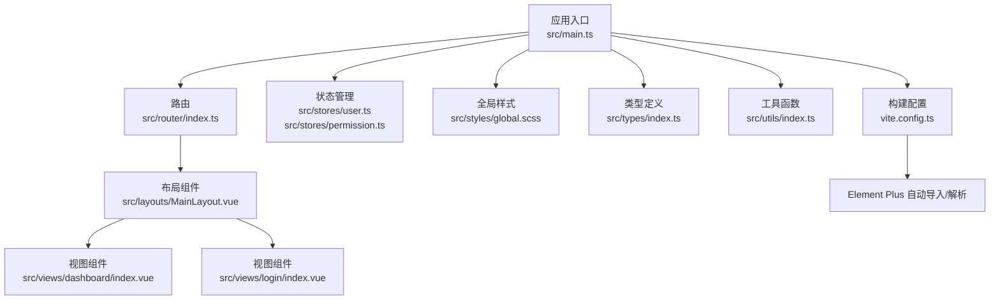
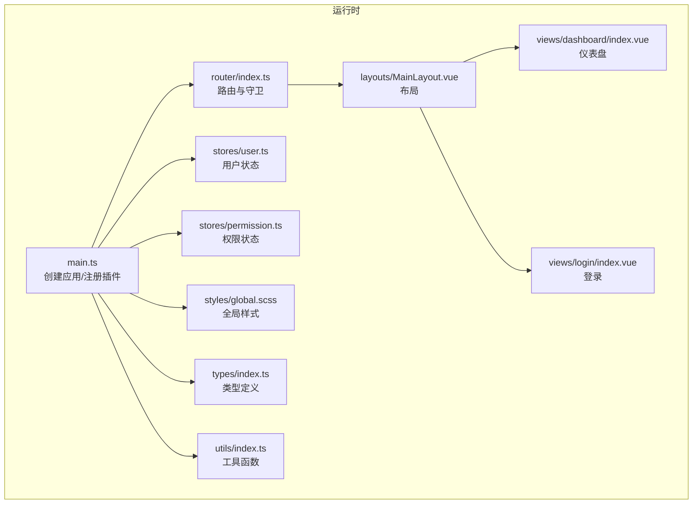
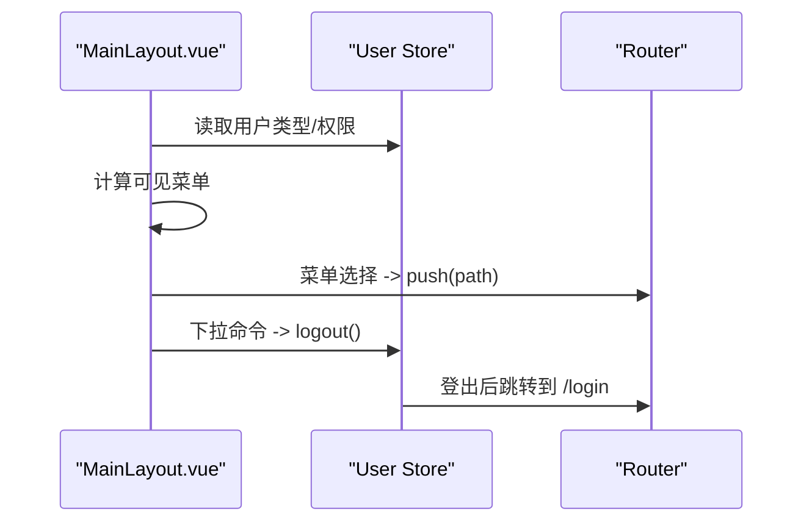
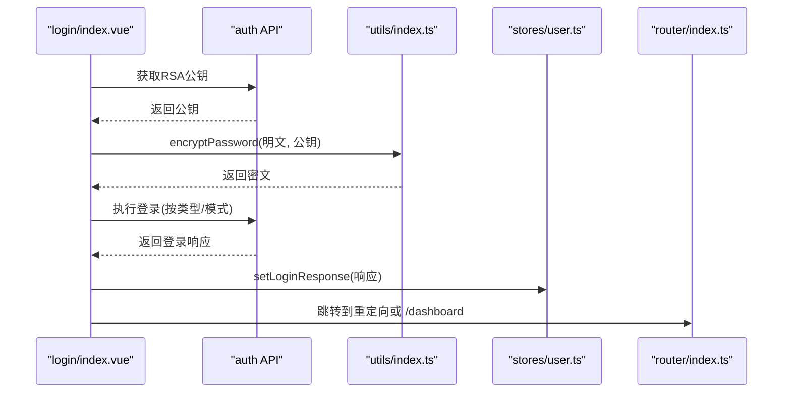
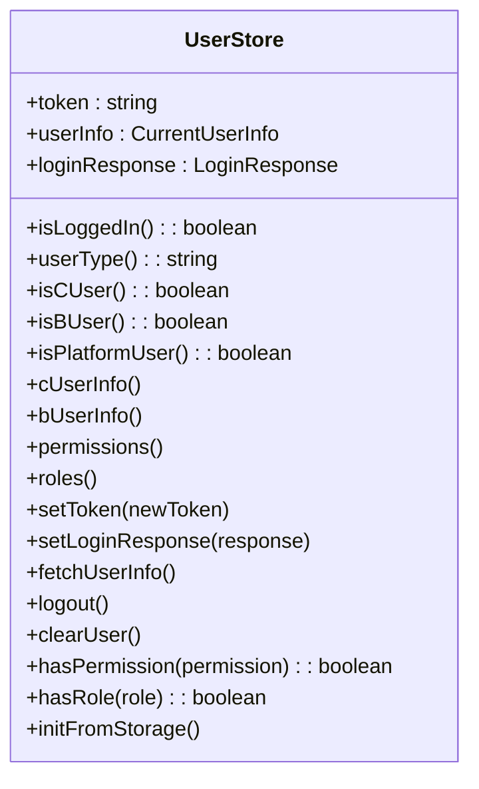
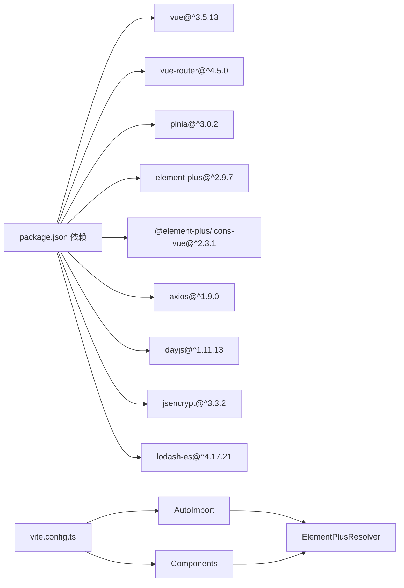

# 组件开发规范

<cite>
**本文引用的文件**
- [package.json](file://package.json)
- [vite.config.ts](file://vite.config.ts)
- [tsconfig.json](file://tsconfig.json)
- [src/main.ts](file://src/main.ts)
- [src/App.vue](file://src/App.vue)
- [src/router/index.ts](file://src/router/index.ts)
- [src/stores/index.ts](file://src/stores/index.ts)
- [src/stores/user.ts](file://src/stores/user.ts)
- [src/stores/permission.ts](file://src/stores/permission.ts)
- [src/utils/index.ts](file://src/utils/index.ts)
- [src/types/index.ts](file://src/types/index.ts)
- [src/styles/global.scss](file://src/styles/global.scss)
- [src/layouts/MainLayout.vue](file://src/layouts/MainLayout.vue)
- [src/views/dashboard/index.vue](file://src/views/dashboard/index.vue)
- [src/views/login/index.vue](file://src/views/login/index.vue)
</cite>

## 目录
1. [简介](#简介)
2. [项目结构](#项目结构)
3. [核心组件](#核心组件)
4. [架构总览](#架构总览)
5. [详细组件分析](#详细组件分析)
6. [依赖分析](#依赖分析)
7. [性能考虑](#性能考虑)
8. [故障排查指南](#故障排查指南)
9. [结论](#结论)
10. [附录](#附录)

## 简介
本规范面向在 Vue 3 + TypeScript + Element Plus 技术栈中进行组件开发的团队与个人，目标是建立统一的组件开发流程、文件组织结构、命名规范、导出方式、类型定义与 Props 设计、事件定义、生命周期与状态管理、数据流设计、复用策略与组合模式、高阶组件使用、测试策略、文档编写与版本管理规范，并说明与 Element Plus 的集成与样式定制方法，最后提供常见问题与解决方案。

## 项目结构
项目采用基于功能域的目录组织方式，结合 Vue 单文件组件（SFC）与 TypeScript 类型系统，配合 Pinia 状态管理与 Element Plus UI 库，形成清晰的分层与职责边界：
- 根配置与构建：Vite 配置启用自动导入与组件解析，Element Plus 自动按需引入。
- 应用入口：创建应用实例、挂载路由与状态管理、全局注册 Element Plus 图标与主题样式。
- 路由与权限：集中声明路由元信息（标题、鉴权、权限），前置守卫统一处理登录态与权限校验。
- 状态管理：Pinia Store 按业务域拆分，提供用户、权限等状态与方法。
- 工具函数：通用工具（加密、防抖节流、格式化、下载等）。
- 类型定义：统一的响应体与业务实体类型，便于组件与 API 层协作。
- 视图与布局：以页面为单位组织视图组件，布局组件负责导航与头部区域。
- 样式：全局 SCSS 变量与通用类名，支持 Element Plus 样式覆盖。

图表来源
- [src/main.ts:1-27](file://src/main.ts#L1-L27)
- [src/router/index.ts:1-127](file://src/router/index.ts#L1-L127)
- [src/stores/user.ts:1-152](file://src/stores/user.ts#L1-L152)
- [src/stores/permission.ts:1-56](file://src/stores/permission.ts#L1-L56)
- [src/styles/global.scss:1-131](file://src/styles/global.scss#L1-L131)
- [src/layouts/MainLayout.vue:1-281](file://src/layouts/MainLayout.vue#L1-L281)
- [src/views/dashboard/index.vue:1-160](file://src/views/dashboard/index.vue#L1-L160)
- [src/views/login/index.vue:1-323](file://src/views/login/index.vue#L1-L323)
- [src/types/index.ts:1-188](file://src/types/index.ts#L1-L188)
- [src/utils/index.ts:1-85](file://src/utils/index.ts#L1-L85)
- [vite.config.ts:1-46](file://vite.config.ts#L1-L46)

章节来源
- [package.json:1-35](file://package.json#L1-L35)
- [vite.config.ts:1-46](file://vite.config.ts#L1-L46)
- [tsconfig.json:1-28](file://tsconfig.json#L1-L28)
- [src/main.ts:1-27](file://src/main.ts#L1-L27)
- [src/App.vue:1-10](file://src/App.vue#L1-L10)

## 核心组件
- 布局组件：MainLayout 提供侧边栏菜单、面包屑、头部下拉等，基于 Element Plus 组件组合，通过计算属性动态控制菜单可见性与用户信息展示。
- 视图组件：Dashboard 与 Login 分别演示统计卡片、图标、表单与登录流程，体现组件内生命周期钩子、状态与事件处理。
- 状态管理：User Store 与 Permission Store 提供用户态、权限集合与持久化能力，支持登录响应、用户信息获取与权限校验。
- 工具函数：密码加密、URL 参数解析、日期格式化、防抖节流、文件下载、扩展名提取、手机号与邮箱校验等。
- 类型定义：统一的响应体、分页结果、用户信息、企业用户、角色、权限、日志、Excel 导入导出任务状态等类型，确保组件与 API 的契约一致。

章节来源
- [src/layouts/MainLayout.vue:1-281](file://src/layouts/MainLayout.vue#L1-L281)
- [src/views/dashboard/index.vue:1-160](file://src/views/dashboard/index.vue#L1-L160)
- [src/views/login/index.vue:1-323](file://src/views/login/index.vue#L1-L323)
- [src/stores/user.ts:1-152](file://src/stores/user.ts#L1-L152)
- [src/stores/permission.ts:1-56](file://src/stores/permission.ts#L1-L56)
- [src/utils/index.ts:1-85](file://src/utils/index.ts#L1-L85)
- [src/types/index.ts:1-188](file://src/types/index.ts#L1-L188)

## 架构总览
组件开发遵循“视图组件 + 布局组件 + 状态管理 + 工具函数 + 类型定义”的分层架构，Element Plus 作为 UI 基础库，通过 Vite 插件实现自动导入与按需解析，减少手动引入成本。

图表来源
- [src/main.ts:1-27](file://src/main.ts#L1-L27)
- [src/router/index.ts:1-127](file://src/router/index.ts#L1-L127)
- [src/stores/user.ts:1-152](file://src/stores/user.ts#L1-L152)
- [src/stores/permission.ts:1-56](file://src/stores/permission.ts#L1-L56)
- [src/layouts/MainLayout.vue:1-281](file://src/layouts/MainLayout.vue#L1-L281)
- [src/views/dashboard/index.vue:1-160](file://src/views/dashboard/index.vue#L1-L160)
- [src/views/login/index.vue:1-323](file://src/views/login/index.vue#L1-L323)
- [src/styles/global.scss:1-131](file://src/styles/global.scss#L1-L131)
- [src/types/index.ts:1-188](file://src/types/index.ts#L1-L188)
- [src/utils/index.ts:1-85](file://src/utils/index.ts#L1-L85)

## 详细组件分析

### 布局组件 MainLayout 分析
- 功能职责：侧边菜单、折叠切换、面包屑、用户头像与下拉菜单、动态菜单渲染与权限控制。
- 生命周期：在挂载阶段根据登录态与权限数据决定是否拉取用户信息。
- 状态管理：依赖用户 Store 计算用户类型、权限集合与头像昵称；通过下拉命令跳转或退出登录。
- 数据流：路由路径变化驱动激活菜单项；菜单选择触发路由跳转；用户信息变更影响菜单可见性。
- 样式定制：通过深度选择器覆盖 Element Plus 菜单样式，实现深色主题与过渡动画。

图表来源
- [src/layouts/MainLayout.vue:1-281](file://src/layouts/MainLayout.vue#L1-L281)
- [src/stores/user.ts:1-152](file://src/stores/user.ts#L1-L152)
- [src/router/index.ts:1-127](file://src/router/index.ts#L1-L127)

章节来源
- [src/layouts/MainLayout.vue:1-281](file://src/layouts/MainLayout.vue#L1-L281)

### 登录视图组件 Login 分析
- 表单与规则：基于 Element Plus 表单组件，按登录类型与模式动态切换校验规则与字段。
- 加密与验证码：支持 RSA 公钥获取与密码加密；验证码发送倒计时与场景切换。
- 登录流程：根据用户类型与登录模式调用不同 API；成功后写入 Token 与用户信息，跳转至重定向地址。
- 错误处理：捕获异常并记录日志，保证 UI 不阻塞。

图表来源
- [src/views/login/index.vue:1-323](file://src/views/login/index.vue#L1-L323)
- [src/utils/index.ts:1-85](file://src/utils/index.ts#L1-L85)
- [src/stores/user.ts:1-152](file://src/stores/user.ts#L1-L152)
- [src/router/index.ts:1-127](file://src/router/index.ts#L1-L127)

章节来源
- [src/views/login/index.vue:1-323](file://src/views/login/index.vue#L1-L323)

### 仪表盘视图组件 Dashboard 分析
- 统计卡片：使用 Element Plus 卡片与统计组件展示关键指标，图标与颜色按业务语义配置。
- 快捷操作与系统信息：卡片内按钮与信息展示，体现组件内状态与环境变量使用。
- 生命周期：在挂载阶段根据当前小时数设置问候语，增强用户体验。

章节来源
- [src/views/dashboard/index.vue:1-160](file://src/views/dashboard/index.vue#L1-L160)

### 用户状态管理 Store 分析
- 状态模型：Token、登录响应、用户信息（含 C/B 平台用户）、权限与角色集合。
- 方法族：设置 Token、设置登录响应、拉取用户信息、登出清理、权限/角色校验、从本地存储初始化。
- 计算属性：用户类型判定、是否登录、头像与昵称派生。

图表来源
- [src/stores/user.ts:1-152](file://src/stores/user.ts#L1-L152)

章节来源
- [src/stores/user.ts:1-152](file://src/stores/user.ts#L1-L152)

### 权限状态管理 Store 分析
- 状态模型：权限列表、权限编码集合、是否已加载。
- 方法族：拉取权限列表、初始化权限缓存、权限校验、清空权限。
- 与路由联动：可结合路由元信息中的权限数组进行访问控制。

章节来源
- [src/stores/permission.ts:1-56](file://src/stores/permission.ts#L1-L56)

### 类型定义与 Props 设计
- 统一响应体：包含 code、message、data、timestamp、path。
- 分页结果：list、total、pageNum、pageSize、totalPage、hasNext。
- 用户与企业用户：字段覆盖 C/B 用户与平台用户差异。
- 权限与日志：权限树形结构、登录日志等。
- 建议：组件 Props 使用严格类型，事件回调参数明确，避免 any；对可选字段使用可选链与默认值。

章节来源
- [src/types/index.ts:1-188](file://src/types/index.ts#L1-L188)

### 事件定义与生命周期管理
- 事件：组件对外暴露的事件应通过 emits 明确声明，回调参数类型与返回值约定清晰。
- 生命周期：在 onMounted/onUnmounted 中进行副作用管理；在布局组件中根据登录态与权限数据决定是否发起请求。
- 异步流程：使用 try/catch 包裹异步调用，finally 中清理 loading 状态，避免 UI 冻结。

章节来源
- [src/layouts/MainLayout.vue:82-90](file://src/layouts/MainLayout.vue#L82-L90)
- [src/views/login/index.vue:98-145](file://src/views/login/index.vue#L98-L145)

### 数据流设计
- 单向数据流：父组件通过 Props 向子组件传递数据，子组件通过事件向上反馈变更。
- 状态集中：用户与权限状态集中在 Pinia Store，组件通过计算属性与方法访问。
- 路由联动：路由元信息承载权限与标题，前置守卫统一拦截与放行。

章节来源
- [src/router/index.ts:82-124](file://src/router/index.ts#L82-L124)
- [src/stores/user.ts:1-152](file://src/stores/user.ts#L1-L152)
- [src/stores/permission.ts:1-56](file://src/stores/permission.ts#L1-L56)

### 复用策略、组合模式与高阶组件
- 组合式函数：将可复用逻辑封装为 Composables（如加密、格式化、防抖节流），在多个组件中共享。
- 组合模式：布局组件与视图组件解耦，视图组件仅关注自身业务，布局组件负责导航与上下文。
- 高阶组件：在当前项目中未直接使用 HOC，但可通过组合式函数与插槽实现类似能力。

章节来源
- [src/utils/index.ts:1-85](file://src/utils/index.ts#L1-L85)
- [src/layouts/MainLayout.vue:1-281](file://src/layouts/MainLayout.vue#L1-L281)

### 测试策略
- 单元测试：针对组合式函数（加密、格式化、防抖节流）编写单元测试，验证输入输出。
- 组件测试：使用测试工具对视图组件进行快照与交互测试，覆盖登录流程与错误分支。
- 状态测试：对 Store 的方法（登录响应设置、权限校验、登出）进行行为测试。
- 文档与示例：为常用组件提供 Storybook 或示例页面，便于回归与演示。

[本节为通用指导，不直接分析具体文件]

### 文档编写与版本管理
- 文档：组件 README 包含用途、Props、Events、Slots、Methods、使用示例与注意事项。
- 版本管理：遵循语义化版本，变更日志记录 Breaking Changes、特性与修复。
- 提交规范：使用约定式提交，便于自动生成变更日志。

[本节为通用指导，不直接分析具体文件]

### 与 Element Plus 的集成与样式定制
- 自动导入：通过 Vite 插件自动导入 Element Plus 组件与图标，减少手动引入。
- 按需解析：Element Plus Resolver 实现组件与样式的按需加载。
- 样式覆盖：通过全局 SCSS 变量与深度选择器覆盖 Element Plus 组件样式，保持主题一致性。

章节来源
- [vite.config.ts:1-46](file://vite.config.ts#L1-L46)
- [src/main.ts:1-27](file://src/main.ts#L1-L27)
- [src/styles/global.scss:1-131](file://src/styles/global.scss#L1-L131)

## 依赖分析
- 运行时依赖：Vue 3、Vue Router、Pinia、Element Plus、图标库、Axios、Day.js、JSEncrypt、Lodash ES。
- 开发依赖：Vite、TypeScript、Vue TS、自动导入与组件解析插件、Sass、类型声明。
- 构建配置：开启代理、端口与预览，输出目录与 Source Map 控制，路径别名配置。

图表来源
- [package.json:13-33](file://package.json#L13-L33)
- [vite.config.ts:1-46](file://vite.config.ts#L1-L46)

章节来源
- [package.json:1-35](file://package.json#L1-L35)
- [vite.config.ts:1-46](file://vite.config.ts#L1-L46)

## 性能考虑
- 懒加载：路由组件使用动态导入，减少首屏体积。
- 按需加载：Element Plus 通过自动导入与解析按需引入，避免全量引入。
- 防抖节流：对高频事件（搜索、滚动）使用防抖/节流，降低渲染压力。
- 缓存策略：用户信息与 Token 存储于本地，应用初始化时恢复状态，减少重复请求。
- 样式优化：全局样式变量统一管理，避免重复定义与冲突。

章节来源
- [src/router/index.ts:14-74](file://src/router/index.ts#L14-L74)
- [src/utils/index.ts:37-62](file://src/utils/index.ts#L37-L62)
- [src/stores/user.ts:90-127](file://src/stores/user.ts#L90-L127)
- [vite.config.ts:11-22](file://vite.config.ts#L11-L22)

## 故障排查指南
- 登录失败：检查公钥获取是否成功、加密流程是否正确、后端返回的登录响应结构是否符合预期。
- 权限不足：确认路由元信息中的权限数组与用户权限集合匹配，必要时刷新权限缓存。
- 样式不生效：检查深度选择器使用是否正确、SCSS 变量是否覆盖、Element Plus 主题是否正确引入。
- 构建报错：核对 TypeScript 配置、路径别名、插件版本与 Node 版本兼容性。

章节来源
- [src/views/login/index.vue:147-158](file://src/views/login/index.vue#L147-L158)
- [src/router/index.ts:96-115](file://src/router/index.ts#L96-L115)
- [src/styles/global.scss:165-280](file://src/styles/global.scss#L165-L280)
- [vite.config.ts:1-46](file://vite.config.ts#L1-L46)

## 结论
本规范总结了在 Vue 3 + TypeScript + Element Plus 项目中的组件开发最佳实践，涵盖从文件组织、类型设计、状态管理到样式定制与性能优化的全流程。建议在实际开发中严格遵循命名与导出规范，使用组合式函数提升复用性，通过 Pinia 统一状态管理，借助 Element Plus 的自动导入机制降低维护成本，并持续完善测试与文档体系。

## 附录
- 文件组织建议：按功能域划分目录，组件以 .vue 结尾，类型定义与工具函数独立文件，避免过度耦合。
- 命名规范：组件文件名采用帕斯卡命名，导出名称与文件名一致；事件与方法使用动词短语，Props 使用名词短语。
- 导出方式：优先使用命名导出，避免默认导出导致 Tree-shaking 失效；对大型组件库可提供 barrel 文件统一导出。
- 版本与发布：使用语义化版本，变更日志记录关键改动；CI 中包含类型检查与 ESLint 校验。

[本节为通用指导，不直接分析具体文件]