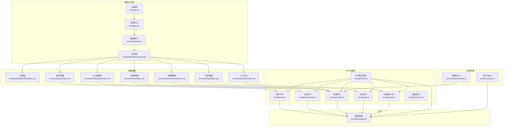
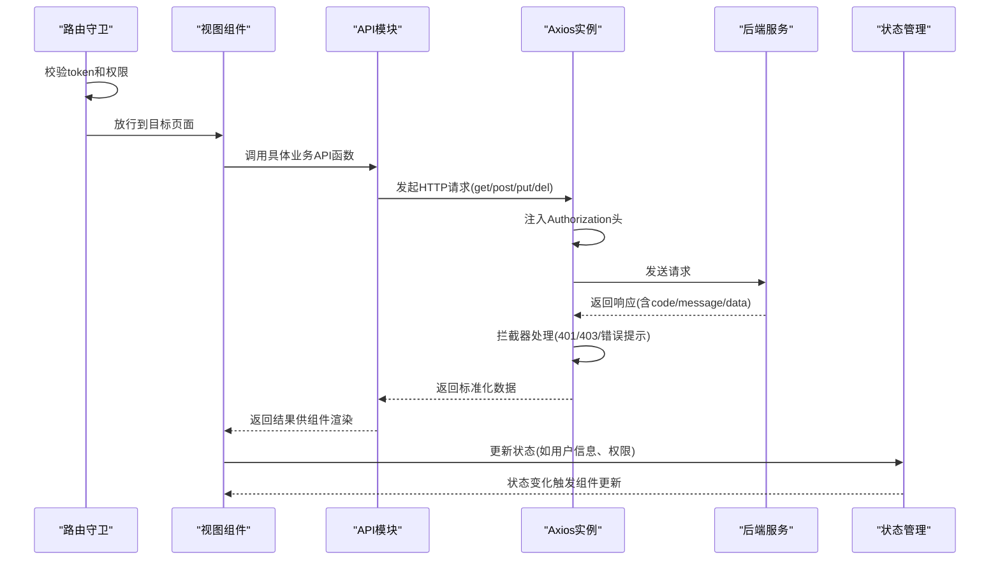
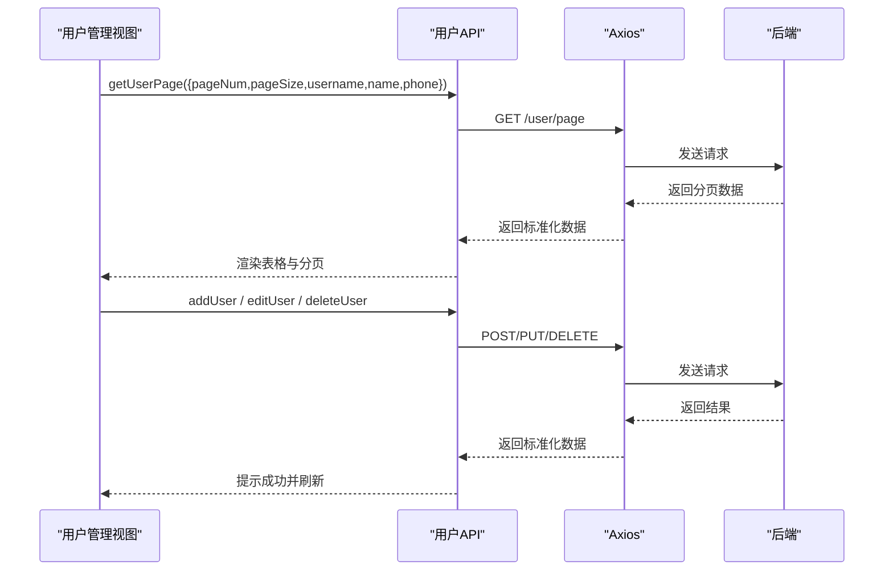
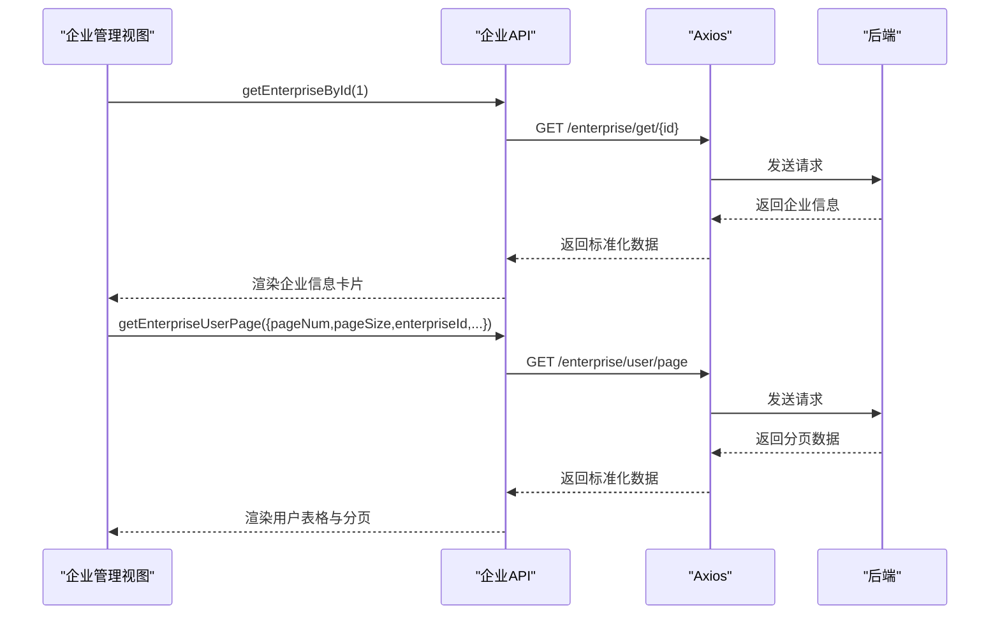
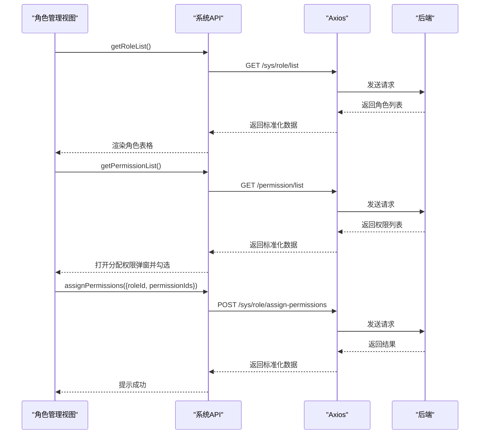
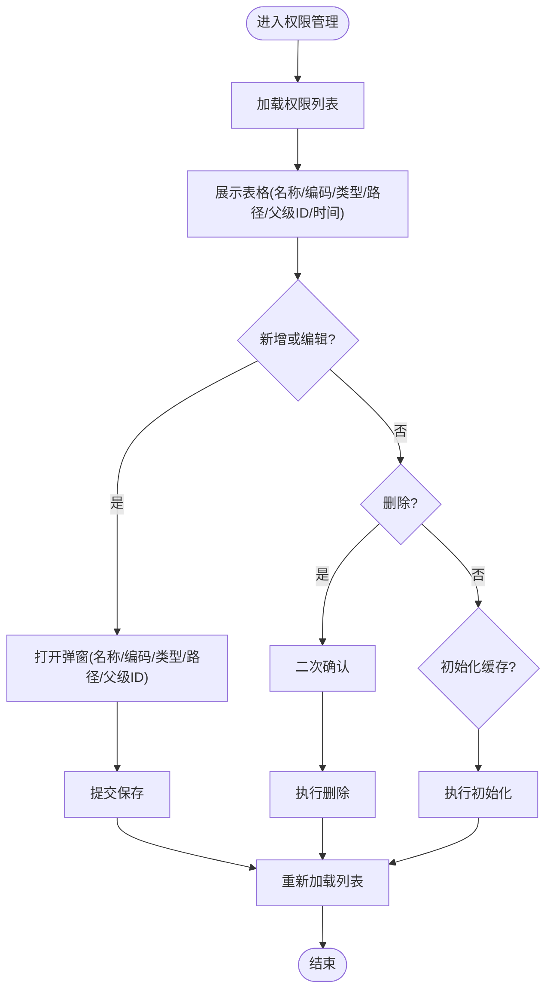
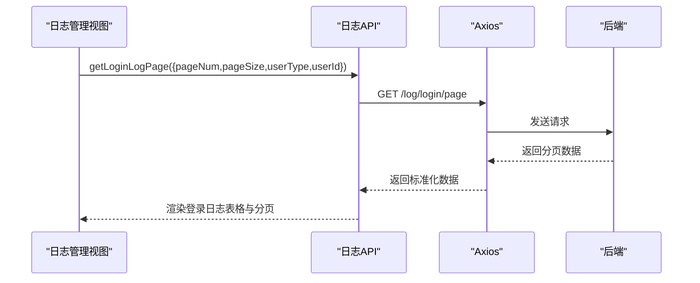
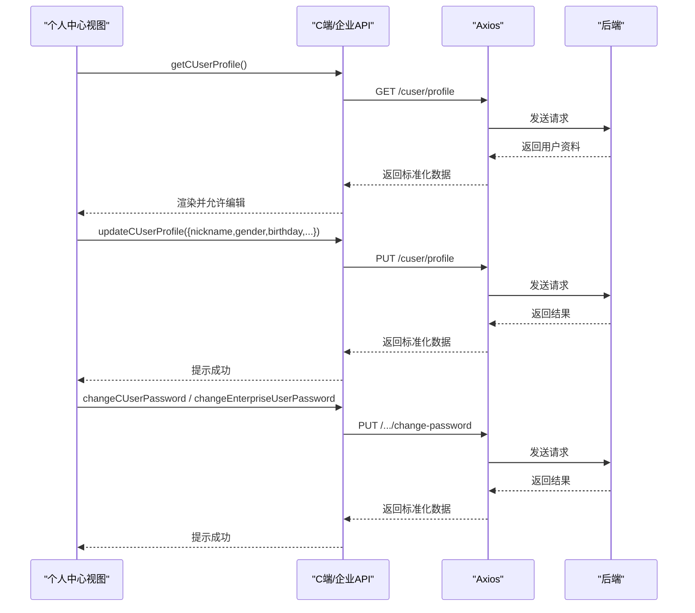
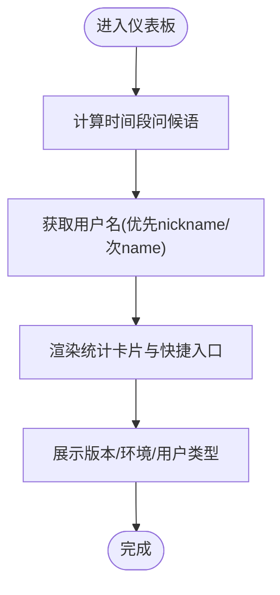
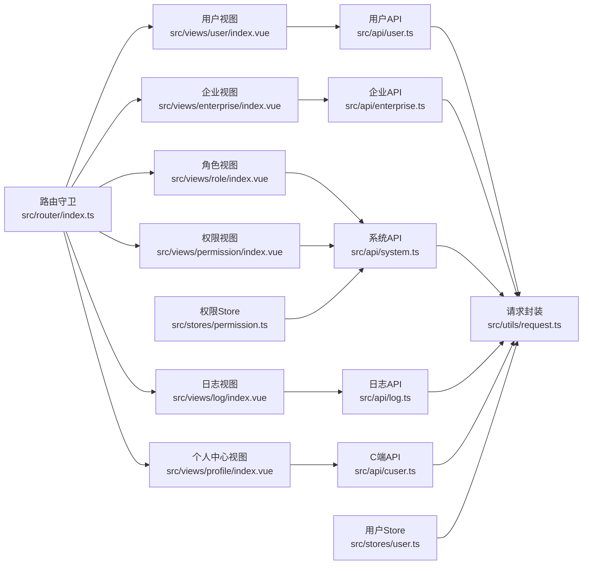

# 业务功能模块

<cite>
**本文引用的文件**
- [src/router/index.ts](file://src/router/index.ts)
- [src/api/index.ts](file://src/api/index.ts)
- [src/api/user.ts](file://src/api/user.ts)
- [src/api/enterprise.ts](file://src/api/enterprise.ts)
- [src/api/system.ts](file://src/api/system.ts)
- [src/api/log.ts](file://src/api/log.ts)
- [src/api/cuser.ts](file://src/api/cuser.ts)
- [src/utils/request.ts](file://src/utils/request.ts)
- [src/views/user/index.vue](file://src/views/user/index.vue)
- [src/views/enterprise/index.vue](file://src/views/enterprise/index.vue)
- [src/views/role/index.vue](file://src/views/role/index.vue)
- [src/views/permission/index.vue](file://src/views/permission/index.vue)
- [src/views/log/index.vue](file://src/views/log/index.vue)
- [src/views/dashboard/index.vue](file://src/views/dashboard/index.vue)
- [src/views/profile/index.vue](file://src/views/profile/index.vue)
- [src/types/api.d.ts](file://src/types/api.d.ts)
- [src/stores/user.ts](file://src/stores/user.ts)
- [src/stores/permission.ts](file://src/stores/permission.ts)
- [src/App.vue](file://src/App.vue)
- [src/main.ts](file://src/main.ts)
</cite>

## 更新摘要
**所做更改**
- 新增路由系统详细说明，包括路由配置、元信息定义和全局前置守卫
- 完善API调用机制说明，涵盖请求封装、拦截器处理和错误管理
- 详细描述视图组件的实现方式，包括数据绑定、事件处理和用户交互
- 新增状态管理store的集成说明
- 更新架构图表以反映完整的路由-视图-API-状态管理链路

## 目录
1. [简介](#简介)
2. [项目结构](#项目结构)
3. [核心组件](#核心组件)
4. [架构总览](#架构总览)
5. [详细组件分析](#详细组件分析)
6. [依赖关系分析](#依赖关系分析)
7. [性能与可用性建议](#性能与可用性建议)
8. [故障排查指南](#故障排查指南)
9. [结论](#结论)
10. [附录](#附录)

## 简介
本文件面向HC管理系统的业务功能模块，系统包含用户管理、企业管理、角色管理、权限管理、日志管理、个人中心等模块。本文从架构、数据流、界面交互、API调用方式、权限控制等方面进行深入解析，并提供可视化图表帮助理解。

**更新** 新增路由系统、API调用机制和视图组件的详细说明，涵盖应用的功能能力和用户交互方式。

## 项目结构
前端采用Vue 3 + TypeScript + Element Plus，路由基于vue-router按需加载页面；API通过统一的请求封装层进行HTTP调用；各业务模块以独立视图组件呈现，配合API模块完成数据交互。系统还集成了Pinia状态管理和全局路由守卫。

**图表来源**
- [src/router/index.ts:12-75](file://src/router/index.ts#L12-L75)
- [src/main.ts:1-28](file://src/main.ts#L1-L28)
- [src/stores/user.ts:1-152](file://src/stores/user.ts#L1-L152)
- [src/stores/permission.ts:1-56](file://src/stores/permission.ts#L1-L56)
- [src/api/index.ts:1-7](file://src/api/index.ts#L1-L7)
- [src/utils/request.ts:1-148](file://src/utils/request.ts#L1-L148)

**章节来源**
- [src/router/index.ts:12-75](file://src/router/index.ts#L12-L75)
- [src/main.ts:1-28](file://src/main.ts#L1-L28)
- [src/api/index.ts:1-7](file://src/api/index.ts#L1-L7)

## 核心组件
- **路由系统**：全局前置守卫校验token与页面所需权限，动态设置标题，未登录跳转登录页，无权限跳转首页。路由元信息包含title、requiresAuth和permissions字段。
- **请求封装**：统一设置Authorization头、拦截401自动登出、统一错误提示与状态码处理，支持并发请求队列管理。
- **状态管理**：Pinia Store管理用户认证状态、权限信息和企业用户信息，支持持久化存储和实时状态更新。
- **视图组件**：每个业务模块以独立页面组件实现，包含表格、分页、表单、弹窗等交互元素，使用Composition API和TypeScript类型安全。

**更新** 新增状态管理store的集成说明，完善路由守卫的权限校验逻辑。

**章节来源**
- [src/router/index.ts:82-124](file://src/router/index.ts#L82-L124)
- [src/utils/request.ts:37-101](file://src/utils/request.ts#L37-L101)
- [src/stores/user.ts:1-152](file://src/stores/user.ts#L1-L152)
- [src/stores/permission.ts:1-56](file://src/stores/permission.ts#L1-L56)

## 架构总览
系统采用"路由驱动视图 + 统一API调用 + 状态管理"的前后端分离架构。路由守卫负责权限验证，视图组件通过API模块发起请求，请求经统一拦截器处理，返回数据在组件内渲染为表格、表单、分页等UI，同时更新Pinia状态管理。

**图表来源**
- [src/router/index.ts:82-124](file://src/router/index.ts#L82-L124)
- [src/utils/request.ts:37-101](file://src/utils/request.ts#L37-L101)
- [src/stores/user.ts:41-60](file://src/stores/user.ts#L41-L60)

**更新** 新增状态管理在数据流转中的作用，完善整体架构流程。

## 详细组件分析

### 用户管理模块
- **功能范围**
  - 列表分页查询：支持按用户名、姓名、手机号筛选。
  - 新增/编辑：表单校验、提交、消息提示。
  - 删除：二次确认，删除成功刷新列表。
  - 状态管理：启用/禁用切换。
  - 角色分配：弹窗勾选角色并提交。
  - 导出：支持同步/异步导出，任务状态轮询与下载链接。
- **数据处理**
  - 使用分页参数pageNum/pageSize与可选过滤条件username/name/phone。
  - 表单字段映射UserRequest，状态字段status取值1/0。
- **API调用**
  - 获取列表：getUserPage
  - 新增/编辑：addUser / editUser
  - 删除：deleteUser
  - 角色分配：assignRoles
  - 导出：exportUsers / exportUsersAsync / getExportStatus / downloadExportFile
- **权限控制**
  - 路由meta.permissions包含"user:list"，进入前校验当前用户权限集合是否包含该权限。

**图表来源**
- [src/views/user/index.vue:45-87](file://src/views/user/index.vue#L45-L87)
- [src/views/user/index.vue:116-136](file://src/views/user/index.vue#L116-L136)
- [src/views/user/index.vue:138-153](file://src/views/user/index.vue#L138-L153)
- [src/views/user/index.vue:171-196](file://src/views/user/index.vue#L171-L196)
- [src/api/user.ts:18-59](file://src/api/user.ts#L18-L59)

**章节来源**
- [src/views/user/index.vue:17-200](file://src/views/user/index.vue#L17-L200)
- [src/api/user.ts:10-59](file://src/api/user.ts#L10-L59)
- [src/router/index.ts:32-36](file://src/router/index.ts#L32-L36)

### 企业管理模块
- **功能范围**
  - 企业信息维护：新建/编辑企业基础信息，安全设置（IP白名单、互斥登录、密码规则）。
  - 企业用户管理：分页查询、新增/编辑、删除、重置密码、首次登录激活、启用/禁用。
- **数据处理**
  - 企业信息表单字段映射EnterpriseCreateRequest/EnterpriseUpdateRequest。
  - 用户分页参数包含enterpriseId、username、name、status。
- **API调用**
  - 企业：getEnterpriseById / createEnterprise / updateEnterprise / updateSecuritySetting
  - 用户：createEnterpriseUser / editEnterpriseUser / deleteEnterpriseUser / resetEnterpriseUserPassword / activateEnterpriseUser / updateEnterpriseUserStatus / getEnterpriseUserPage
  - 强制改密/改密：forceChangePassword / changeEnterpriseUserPassword
- **权限控制**
  - 路由meta.permissions包含"enterprise:list"。

**图表来源**
- [src/views/enterprise/index.vue:47-57](file://src/views/enterprise/index.vue#L47-L57)
- [src/views/enterprise/index.vue:158-177](file://src/views/enterprise/index.vue#L158-L177)
- [src/api/enterprise.ts:17-31](file://src/api/enterprise.ts#L17-L31)
- [src/api/enterprise.ts:57-66](file://src/api/enterprise.ts#L57-L66)

**章节来源**
- [src/views/enterprise/index.vue:20-283](file://src/views/enterprise/index.vue#L20-L283)
- [src/api/enterprise.ts:17-75](file://src/api/enterprise.ts#L17-L75)
- [src/router/index.ts:38-42](file://src/router/index.ts#L38-L42)

### 角色管理模块
- **功能范围**
  - 角色列表：名称、编码、描述、创建时间。
  - 新增/编辑/删除角色。
  - 分配权限：弹窗勾选权限并提交。
- **数据处理**
  - 表单字段映射RoleRequest，权限列表来自getPermissionList。
- **API调用**
  - 角色：getRoleList / addRole / editRole / deleteRole
  - 分配权限：assignPermissions
- **权限控制**
  - 路由meta.permissions包含"role:list"。

**图表来源**
- [src/views/role/index.vue:29-39](file://src/views/role/index.vue#L29-L39)
- [src/views/role/index.vue:83-98](file://src/views/role/index.vue#L83-L98)
- [src/views/role/index.vue:100-109](file://src/views/role/index.vue#L100-L109)
- [src/api/system.ts:9-31](file://src/api/system.ts#L9-L31)
- [src/api/system.ts:33-55](file://src/api/system.ts#L33-L55)

**章节来源**
- [src/views/role/index.vue:1-199](file://src/views/role/index.vue#L1-L199)
- [src/api/system.ts:9-55](file://src/api/system.ts#L9-L55)
- [src/router/index.ts:44-48](file://src/router/index.ts#L44-L48)

### 权限管理模块
- **功能范围**
  - 权限树形展示：名称、编码、类型(MENU/BUTTON/API)、路径、父级ID、创建时间。
  - 新增/编辑/删除权限。
  - 初始化权限缓存。
- **数据处理**
  - 类型映射：MENU/按钮、BUTTON/接口、API。
- **API调用**
  - 权限：getPermissionList / addPermission / editPermission / deletePermission / initPermissionCache
- **权限控制**
  - 路由meta.permissions包含"permission:list"。

**图表来源**
- [src/views/permission/index.vue:28-108](file://src/views/permission/index.vue#L28-L108)
- [src/api/system.ts:33-55](file://src/api/system.ts#L33-L55)

**章节来源**
- [src/views/permission/index.vue:1-193](file://src/views/permission/index.vue#L1-L193)
- [src/api/system.ts:33-55](file://src/api/system.ts#L33-L55)
- [src/router/index.ts:50-54](file://src/router/index.ts#L50-L54)

### 日志管理模块
- **功能范围**
  - 登录日志分页查询：按用户类型(C/B/P)、用户ID筛选。
  - 展示账号、用户类型、登录状态、IP、地点、设备、失败原因、时间。
- **数据处理**
  - 用户类型映射：C/B/P。
  - 状态映射：1/0 -> 成功/失败。
- **API调用**
  - getLoginLogPage(params)
- **权限控制**
  - 路由meta.permissions包含"log:list"。

**图表来源**
- [src/views/log/index.vue:13-52](file://src/views/log/index.vue#L13-L52)
- [src/api/log.ts](file://src/api/log.ts)

**章节来源**
- [src/views/log/index.vue:1-128](file://src/views/log/index.vue#L1-L128)
- [src/router/index.ts:56-60](file://src/router/index.ts#L56-L60)

### 个人中心模块
- **功能范围**
  - C端用户：基本信息编辑（昵称、性别、生日）、修改密码。
  - B端用户：只读展示基本信息与企业信息、修改密码。
  - 平台管理员：提示无法在此修改。
- **数据处理**
  - C端资料：getCUserProfile / updateCUserProfile。
  - 密码修改：C端changeCUserPassword / B端changeEnterpriseUserPassword。
- **API调用**
  - 个人信息：getCUserProfile / updateCUserProfile
  - 密码：changeCUserPassword / changeEnterpriseUserPassword
- **权限控制**
  - 需登录态，无特定权限点。

**图表来源**
- [src/views/profile/index.vue:36-100](file://src/views/profile/index.vue#L36-L100)
- [src/views/profile/index.vue:175-191](file://src/views/profile/index.vue#L175-L191)
- [src/api/cuser.ts](file://src/api/cuser.ts)
- [src/api/enterprise.ts:72-74](file://src/api/enterprise.ts#L72-L74)

**章节来源**
- [src/views/profile/index.vue:1-245](file://src/views/profile/index.vue#L1-L245)
- [src/api/cuser.ts](file://src/api/cuser.ts)
- [src/api/enterprise.ts:72-74](file://src/api/enterprise.ts#L72-L74)

### 系统监控模块（仪表板）
- **功能范围**
  - 欢迎语：根据时间段显示问候语。
  - 快捷入口：直达用户管理、企业管理、角色管理、权限管理、日志查看。
  - 系统信息：版本、环境、用户类型。
  - 统计卡片：用户总数、订单总量、商品数量、月增长率。
- **数据处理**
  - 用户名优先取nickname，否则取name，否则默认"用户"。
  - 环境变量MODE用于显示环境。
- **权限控制**
  - 需登录态。

**图表来源**
- [src/views/dashboard/index.vue:13-28](file://src/views/dashboard/index.vue#L13-L28)
- [src/views/dashboard/index.vue:31-108](file://src/views/dashboard/index.vue#L31-L108)

**章节来源**
- [src/views/dashboard/index.vue:1-160](file://src/views/dashboard/index.vue#L1-L160)

## 依赖关系分析
- **路由到视图**：路由children定义了各模块页面与权限点，进入前守卫根据token与permissions决定放行或跳转。
- **视图到API**：各视图组件通过对应API模块发起请求，API模块统一使用request封装的HTTP方法。
- **API到请求**：request.ts统一注入Authorization头、处理401/403/错误提示、统一返回格式。
- **状态管理**：Pinia Store管理用户认证状态、权限信息，与路由守卫协同工作。
- **类型定义**：types/api.d.ts集中声明请求/响应参数类型，确保前后端契约一致。

**图表来源**
- [src/router/index.ts:82-124](file://src/router/index.ts#L82-L124)
- [src/stores/user.ts:1-152](file://src/stores/user.ts#L1-L152)
- [src/stores/permission.ts:1-56](file://src/stores/permission.ts#L1-L56)
- [src/api/user.ts:1-59](file://src/api/user.ts#L1-L59)
- [src/api/enterprise.ts:1-75](file://src/api/enterprise.ts#L1-L75)
- [src/api/system.ts:1-56](file://src/api/system.ts#L1-L56)
- [src/api/log.ts](file://src/api/log.ts)
- [src/api/cuser.ts](file://src/api/cuser.ts)
- [src/utils/request.ts:1-148](file://src/utils/request.ts#L1-L148)

**章节来源**
- [src/router/index.ts:82-124](file://src/router/index.ts#L82-L124)
- [src/stores/user.ts:1-152](file://src/stores/user.ts#L1-L152)
- [src/stores/permission.ts:1-56](file://src/stores/permission.ts#L1-L56)
- [src/api/index.ts:1-7](file://src/api/index.ts#L1-L7)

## 性能与可用性建议
- **列表分页**：合理设置pageSize，避免一次性加载过多数据；对高频查询增加防抖。
- **表单校验**：在提交前进行本地校验，减少无效请求。
- **错误处理**：统一拦截器已处理常见错误，建议在组件中补充业务错误提示与重试机制。
- **缓存策略**：权限列表与角色列表可做轻量缓存，减少重复请求。
- **导出功能**：异步导出结合轮询与下载链接，避免长时间阻塞UI。
- **状态管理**：合理使用Pinia Store，避免过度订阅导致的性能问题。
- **路由守卫**：权限校验逻辑已优化，建议在store中缓存权限信息以提高校验效率。

**更新** 新增状态管理和路由守卫的性能优化建议。

## 故障排查指南
- **登录过期/未登录**
  - 现象：出现"重新登录"提示并清空本地存储。
  - 排查：确认localStorage中的token是否存在；检查后端签发的token是否正确。
- **无权限访问**
  - 现象：出现"没有权限访问该资源"提示。
  - 排查：确认当前用户权限集合是否包含页面所需权限；检查路由meta.permissions配置。
- **请求失败**
  - 现象：根据状态码显示不同错误提示。
  - 排查：检查请求URL、参数、Authorization头；查看后端日志定位问题。
- **导出异常**
  - 现象：异步导出任务状态查询失败或下载链接无效。
  - 排查：确认任务ID有效、任务状态非失败、下载链接可访问。
- **路由跳转异常**
  - 现象：路由守卫无法正确判断权限或无限重定向。
  - 排查：检查localStorage中的currentUserInfo格式；确认权限数组存在且格式正确。
- **状态管理问题**
  - 现象：用户信息不更新或权限状态异常。
  - 排查：检查store的initFromStorage方法；确认localStorage中的数据格式。

**更新** 新增路由守卫和状态管理相关的故障排查指导。

**章节来源**
- [src/utils/request.ts:20-35](file://src/utils/request.ts#L20-L35)
- [src/utils/request.ts:50-101](file://src/utils/request.ts#L50-L101)
- [src/router/index.ts:96-115](file://src/router/index.ts#L96-L115)
- [src/stores/user.ts:90-127](file://src/stores/user.ts#L90-L127)

## 结论
HC管理系统通过清晰的路由与权限控制、统一的请求封装与API模块化设计、以及完善的Pinia状态管理，实现了用户管理、企业管理、角色权限、日志与个人中心等核心业务模块。系统采用Vue 3 + TypeScript + Element Plus技术栈，路由守卫确保安全性，状态管理提供实时性，视图组件围绕Element Plus构建，具备良好的交互体验与扩展性。

**更新** 新增状态管理和路由系统的完整集成说明，系统架构更加完善。

建议在后续迭代中完善缓存策略、优化导出流程与错误恢复能力，持续提升用户体验与系统稳定性。

## 附录
- **常用API一览（按模块）**
  - 用户管理：getUserPage、addUser、editUser、deleteUser、assignRoles、exportUsers、exportUsersAsync、getExportStatus、downloadExportFile
  - 企业管理：getEnterpriseById、createEnterprise、updateEnterprise、updateSecuritySetting、createEnterpriseUser、editEnterpriseUser、deleteEnterpriseUser、resetEnterpriseUserPassword、activateEnterpriseUser、updateEnterpriseUserStatus、getEnterpriseUserPage、forceChangePassword、changeEnterpriseUserPassword
  - 角色/权限：getRoleList、addRole、editRole、deleteRole、assignPermissions、getPermissionList、addPermission、editPermission、deletePermission、initPermissionCache
  - 日志：getLoginLogPage
  - 个人中心：getCUserProfile、updateCUserProfile、changeCUserPassword、changeEnterpriseUserPassword
- **路由配置一览**
  - 登录页：/login，无需认证
  - 仪表板：/，需要认证
  - 用户管理：/user，需要认证和权限"user:list"
  - 企业管理：/enterprise，需要认证和权限"enterprise:list"
  - 角色管理：/role，需要认证和权限"role:list"
  - 权限管理：/permission，需要认证和权限"permission:list"
  - 日志管理：/log，需要认证和权限"log:list"
  - 个人中心：/profile，需要认证
- **状态管理Store**
  - 用户Store：管理token、用户信息、权限、角色等认证相关状态
  - 权限Store：管理权限列表、权限代码、缓存状态等权限相关状态

**更新** 新增路由配置和状态管理Store的详细说明。

**章节来源**
- [src/api/user.ts:10-59](file://src/api/user.ts#L10-L59)
- [src/api/enterprise.ts:17-75](file://src/api/enterprise.ts#L17-L75)
- [src/api/system.ts:9-55](file://src/api/system.ts#L9-L55)
- [src/api/log.ts](file://src/api/log.ts)
- [src/api/cuser.ts](file://src/api/cuser.ts)
- [src/router/index.ts:12-75](file://src/router/index.ts#L12-L75)
- [src/stores/user.ts:1-152](file://src/stores/user.ts#L1-L152)
- [src/stores/permission.ts:1-56](file://src/stores/permission.ts#L1-L56)