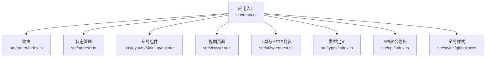
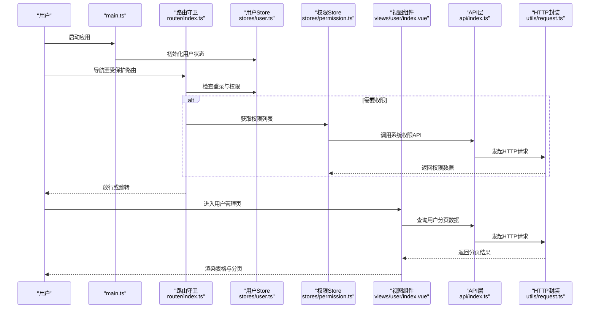
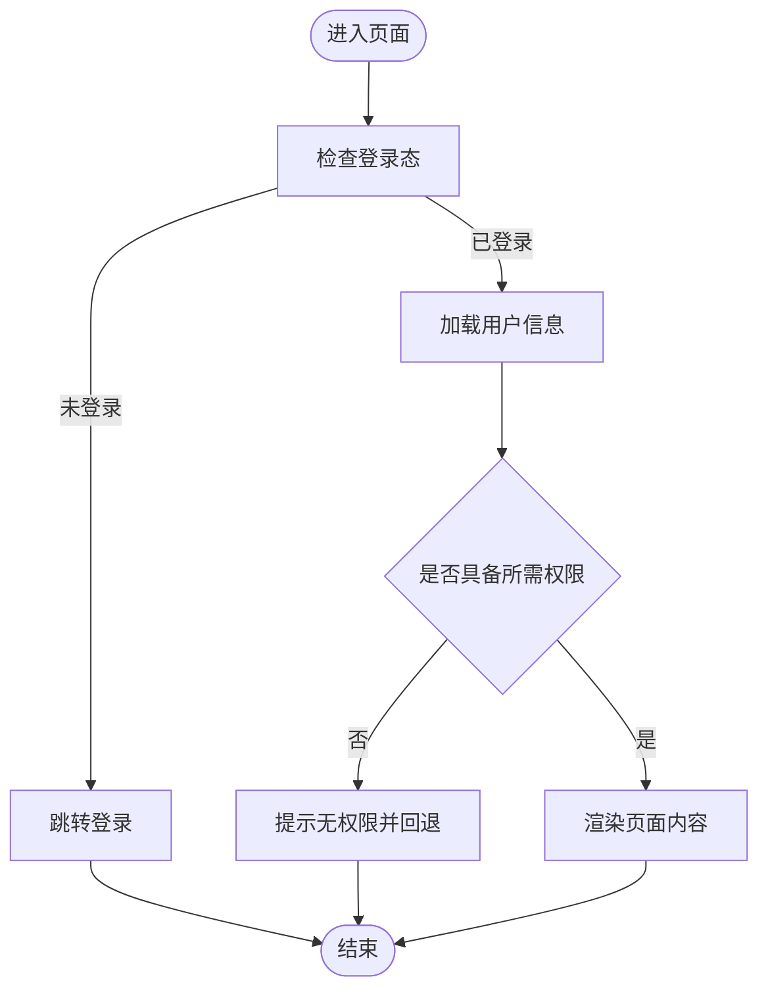
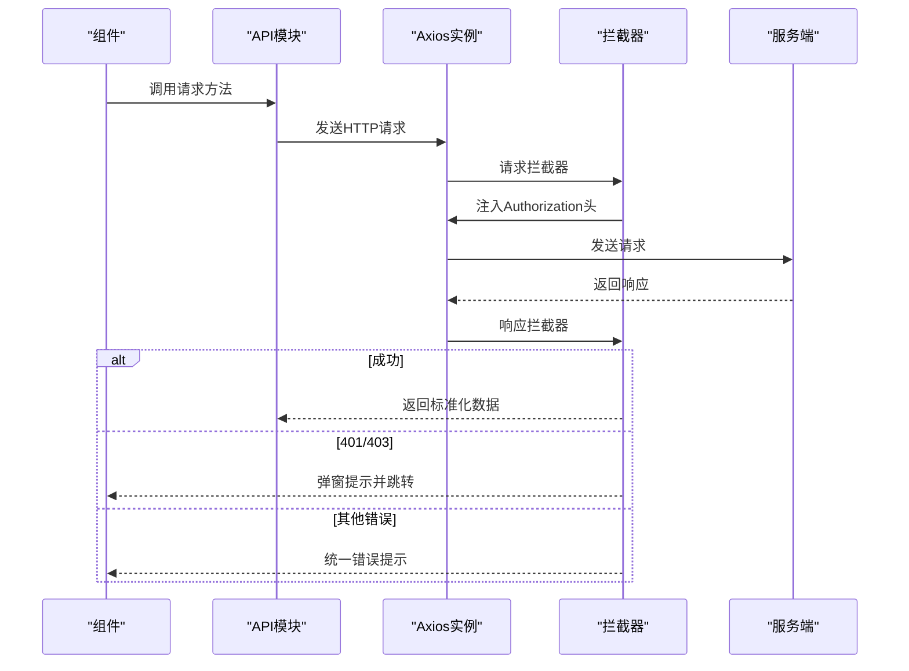
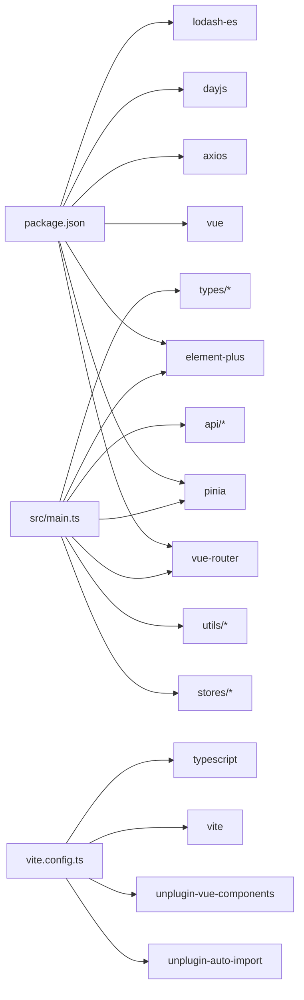

# 代码规范与最佳实践

<cite>
**本文引用的文件**
- [package.json](file://package.json)
- [tsconfig.json](file://tsconfig.json)
- [vite.config.ts](file://vite.config.ts)
- [src/main.ts](file://src/main.ts)
- [.eslintrc-auto-import.json](file://.eslintrc-auto-import.json)
- [src/App.vue](file://src/App.vue)
- [src/router/index.ts](file://src/router/index.ts)
- [src/stores/index.ts](file://src/stores/index.ts)
- [src/types/index.ts](file://src/types/index.ts)
- [src/utils/request.ts](file://src/utils/request.ts)
- [src/api/index.ts](file://src/api/index.ts)
- [src/stores/user.ts](file://src/stores/user.ts)
- [src/stores/permission.ts](file://src/stores/permission.ts)
- [src/views/user/index.vue](file://src/views/user/index.vue)
- [src/layouts/MainLayout.vue](file://src/layouts/MainLayout.vue)
</cite>

## 目录
1. [引言](#引言)
2. [项目结构](#项目结构)
3. [核心组件](#核心组件)
4. [架构总览](#架构总览)
5. [详细组件分析](#详细组件分析)
6. [依赖分析](#依赖分析)
7. [性能考虑](#性能考虑)
8. [故障排查指南](#故障排查指南)
9. [结论](#结论)
10. [附录](#附录)

## 引言
本文件面向HC管理系统前端工程，系统性梳理TypeScript编码规范、Vue 3组件开发规范、文件命名与目录结构、注释标准、ESLint与代码质量检查机制，并结合现有代码库给出可落地的最佳实践与审查清单，帮助团队统一风格、提升可维护性与协作效率。

## 项目结构
项目采用基于功能域的目录组织方式，核心模块包括：
- 应用入口与全局配置：main.ts、App.vue、router、stores、types、utils、api、layouts、views
- 构建与脚手架：vite.config.ts、tsconfig.json、package.json
- 质量保障：ESLint自动导入配置

图表来源
- [src/main.ts:1-27](file://src/main.ts#L1-L27)
- [src/router/index.ts:1-127](file://src/router/index.ts#L1-L127)
- [src/stores/user.ts:1-152](file://src/stores/user.ts#L1-L152)
- [src/stores/permission.ts:1-56](file://src/stores/permission.ts#L1-L56)
- [src/layouts/MainLayout.vue:1-281](file://src/layouts/MainLayout.vue#L1-L281)
- [src/views/user/index.vue:1-361](file://src/views/user/index.vue#L1-L361)
- [src/utils/request.ts:1-148](file://src/utils/request.ts#L1-L148)
- [src/types/index.ts:1-188](file://src/types/index.ts#L1-L188)
- [src/api/index.ts:1-7](file://src/api/index.ts#L1-L7)

章节来源
- [src/main.ts:1-27](file://src/main.ts#L1-L27)
- [vite.config.ts:1-46](file://vite.config.ts#L1-L46)
- [tsconfig.json:1-28](file://tsconfig.json#L1-L28)

## 核心组件
- 应用启动与插件注册：在入口中集中注册Pinia、Router、Element Plus，并完成用户状态初始化。
- 路由与鉴权：通过beforeEach守卫实现登录态与权限校验，动态设置页面标题。
- 状态管理：Pinia组合式Store，用户态与权限态分离，支持持久化与便捷查询。
- 请求封装：Axios实例化与拦截器，统一封装HTTP方法，处理通用错误与过期逻辑。
- 类型体系：统一的ResponseData与业务实体接口，便于API契约约束与IDE智能提示。
- 视图组件：以Composition API为主，结合Element Plus组件实现表单、表格、分页与对话框。

章节来源
- [src/main.ts:1-27](file://src/main.ts#L1-L27)
- [src/router/index.ts:82-124](file://src/router/index.ts#L82-L124)
- [src/stores/user.ts:7-151](file://src/stores/user.ts#L7-L151)
- [src/stores/permission.ts:7-55](file://src/stores/permission.ts#L7-L55)
- [src/utils/request.ts:1-148](file://src/utils/request.ts#L1-L148)
- [src/types/index.ts:1-188](file://src/types/index.ts#L1-L188)
- [src/views/user/index.vue:1-361](file://src/views/user/index.vue#L1-L361)

## 架构总览
下图展示从入口到页面的数据流与交互关系，体现“入口注册—路由守卫—状态管理—API调用—UI渲染”的闭环。

图表来源
- [src/main.ts:23-24](file://src/main.ts#L23-L24)
- [src/router/index.ts:82-124](file://src/router/index.ts#L82-L124)
- [src/stores/user.ts:41-60](file://src/stores/user.ts#L41-L60)
- [src/stores/permission.ts:12-24](file://src/stores/permission.ts#L12-L24)
- [src/views/user/index.vue:45-64](file://src/views/user/index.vue#L45-L64)
- [src/api/index.ts:1-7](file://src/api/index.ts#L1-L7)
- [src/utils/request.ts:107-145](file://src/utils/request.ts#L107-L145)

## 详细组件分析

### TypeScript编码规范
- 接口定义
  - 统一响应体：使用泛型接口包裹服务端返回，确保字段一致性与可扩展性。
  - 业务实体：为各模块定义清晰的DTO接口，避免any泛滥。
- 类型注解
  - 明确变量与函数参数/返回值类型，减少隐式推断带来的歧义。
- 泛型使用
  - 在HTTP请求封装中对泛型进行约束，保证调用方拿到强类型数据。
- 模块组织
  - types目录集中存放全局类型；api目录按领域聚合导出；utils集中复用逻辑。

章节来源
- [src/types/index.ts:1-188](file://src/types/index.ts#L1-L188)
- [src/utils/request.ts:103-109](file://src/utils/request.ts#L103-L109)
- [src/api/index.ts:1-7](file://src/api/index.ts#L1-L7)

### Vue 3组件开发规范
- Composition API
  - 使用<script setup>与组合式API，保持逻辑内聚与可测试性。
  - 响应式数据集中声明，计算属性用于派生状态。
- 生命周期钩子
  - onMounted中触发首屏数据拉取，避免在模板中做副作用。
- 组件通信
  - 页面内通过本地状态与事件传递；跨页面通过路由与状态管理。
- 表单与校验
  - 使用Element Plus表单组件与规则对象，异步校验后提交。

章节来源
- [src/views/user/index.vue:1-361](file://src/views/user/index.vue#L1-L361)
- [src/layouts/MainLayout.vue:1-281](file://src/layouts/MainLayout.vue#L1-L281)

### 状态管理模式
- 用户态
  - 登录态、用户信息、身份类型、权限与角色集合均通过计算属性派生，便于在模板中直接消费。
  - 支持从本地存储恢复状态，避免刷新丢失。
- 权限态
  - 权限列表与权限码集合分离，提供hasPermission快速判定。
  - 提供初始化缓存能力，优化首次进入页面的体验。

图表来源
- [src/router/index.ts:82-124](file://src/router/index.ts#L82-L124)
- [src/stores/user.ts:41-60](file://src/stores/user.ts#L41-L60)
- [src/stores/permission.ts:12-24](file://src/stores/permission.ts#L12-L24)

章节来源
- [src/stores/user.ts:7-151](file://src/stores/user.ts#L7-L151)
- [src/stores/permission.ts:7-55](file://src/stores/permission.ts#L7-L55)

### API调用规范
- 统一入口
  - 所有API通过src/api/index.ts聚合导出，便于集中管理和替换。
- HTTP封装
  - Axios实例化与拦截器：统一注入Authorization头、处理401/403等状态码、统一错误提示。
  - 封装get/post/put/del方法，统一返回ResponseData<T>，简化调用方逻辑。
- 错误处理
  - 对不同HTTP状态码进行分类处理，必要时弹窗提示并中断流程。
  - 对401场景提供统一的“登录过期”处理与路由跳转。

图表来源
- [src/api/index.ts:1-7](file://src/api/index.ts#L1-L7)
- [src/utils/request.ts:37-101](file://src/utils/request.ts#L37-L101)

章节来源
- [src/utils/request.ts:1-148](file://src/utils/request.ts#L1-L148)

### 文件命名约定与目录结构规范
- 目录结构
  - views按功能域划分，如user、enterprise、role、log等。
  - stores按领域拆分，避免单点膨胀。
  - types集中存放全局类型，api按领域聚合。
- 命名约定
  - 组件文件使用帕斯卡命名，如MainLayout.vue。
  - 视图文件统一使用index.vue作为入口。
  - Store使用useXxxStore命名，如useUserStore。
  - 类型接口以大写字母开头，如UserResponse。
- 注释标准
  - 复杂逻辑处补充简要注释，说明“为什么”而非“做了什么”。

章节来源
- [src/views/user/index.vue:1-361](file://src/views/user/index.vue#L1-L361)
- [src/stores/user.ts:1-152](file://src/stores/user.ts#L1-L152)
- [src/types/index.ts:1-188](file://src/types/index.ts#L1-L188)

### ESLint配置与代码质量检查机制
- 自动导入与ESLint集成
  - unplugin-auto-import生成的.d.ts与.eslintrc-auto-import.json，使ESLint识别Vue/Router/Pinia等全局符号，避免未定义报错。
- 脚本命令
  - lint：执行ESLint检查。
  - type-check：类型检查。
- 严格编译选项
  - tsconfig启用严格模式、禁止未使用参数/局部变量等，降低潜在问题。

章节来源
- [vite.config.ts:11-18](file://vite.config.ts#L11-L18)
- [.eslintrc-auto-import.json:1-94](file://.eslintrc-auto-import.json#L1-L94)
- [package.json:6-11](file://package.json#L6-L11)
- [tsconfig.json:12-16](file://tsconfig.json#L12-L16)

## 依赖分析
- 外部依赖
  - Vue 3、Vue Router、Pinia、Element Plus、Axios、Day.js、Lodash-es等。
- 构建与工具
  - Vite、TypeScript、unplugin-auto-import、unplugin-vue-components、Sass。
- 内部耦合
  - main.ts集中注册插件并初始化用户态；路由守卫依赖用户与权限Store；视图组件依赖API层与类型定义。

图表来源
- [package.json:13-33](file://package.json#L13-L33)
- [vite.config.ts:1-46](file://vite.config.ts#L1-L46)
- [src/main.ts:1-27](file://src/main.ts#L1-L27)

章节来源
- [package.json:1-35](file://package.json#L1-L35)
- [vite.config.ts:1-46](file://vite.config.ts#L1-L46)

## 性能考虑
- 资源体积
  - 构建输出开启chunkSizeWarningLimit，避免过大模块导致警告。
- 网络请求
  - 统一超时与凭证策略，避免长连接占用；对401统一处理，减少无效重试。
- 渲染优化
  - 列表分页与懒加载结合，避免一次性渲染大量数据。
  - 计算属性缓存派生状态，减少重复计算。

章节来源
- [vite.config.ts:40-44](file://vite.config.ts#L40-L44)
- [src/utils/request.ts:8-15](file://src/utils/request.ts#L8-L15)
- [src/views/user/index.vue:45-64](file://src/views/user/index.vue#L45-L64)

## 故障排查指南
- 登录过期
  - 现象：出现“登录已过期”提示并跳转登录。
  - 处理：确认本地token是否存在；检查拦截器401分支逻辑。
- 权限不足
  - 现象：被重定向至首页或提示无权限。
  - 处理：核对路由meta.permissions与当前用户权限集合；确认权限缓存初始化是否成功。
- 请求失败
  - 现象：弹窗提示具体错误信息。
  - 处理：查看拦截器对不同状态码的处理分支；检查服务端返回code/message。

章节来源
- [src/utils/request.ts:20-35](file://src/utils/request.ts#L20-L35)
- [src/router/index.ts:96-115](file://src/router/index.ts#L96-L115)
- [src/stores/permission.ts:26-34](file://src/stores/permission.ts#L26-L34)

## 结论
本规范以现有代码库为基础，总结了TypeScript与Vue 3的最佳实践路径：统一类型契约、集中API封装、清晰的状态管理、严格的路由守卫与权限控制、完善的ESLint与构建配置。建议在后续迭代中持续遵循本文规范，逐步完善单元测试与端到端测试，进一步提升系统的稳定性与可维护性。

## 附录

### 代码审查清单
- TypeScript
  - 是否使用明确类型注解与泛型约束？
  - 是否存在any或unknown滥用？
  - 类型定义是否集中且语义清晰？
- Vue 3
  - 是否使用<script setup>与组合式API？
  - 生命周期钩子是否仅做必要副作用？
  - 表单校验是否完整且提示友好？
- 状态管理
  - 用户态与权限态是否分离？
  - 是否存在不必要的全局状态污染？
  - 是否利用计算属性派生状态？
- API与HTTP
  - 是否统一通过api/index.ts导出？
  - 是否在拦截器中处理401/403等异常？
  - 是否对敏感字段进行脱敏或隐藏？
- 路由与鉴权
  - 路由meta是否包含title/permissions等必要字段？
  - 守卫逻辑是否覆盖登录态与权限双重校验？
- 工程化
  - 是否通过lint与type-check？
  - 是否遵循文件命名与目录结构约定？

### 常见反模式与规避
- 反模式：在模板中直接发起HTTP请求
  - 规避：将副作用集中在onMounted或显式事件回调中，通过API层统一管理。
- 反模式：在组件内硬编码权限判断
  - 规避：将权限判断抽象为Store方法，组件仅负责展示与交互。
- 反模式：忽略错误处理
  - 规避：在拦截器与调用点分别处理错误，确保用户可见提示与日志记录。
- 反模式：类型缺失或滥用any
  - 规避：为每个接口定义明确的DTO，使用Partial/Record等工具类型表达可选字段。