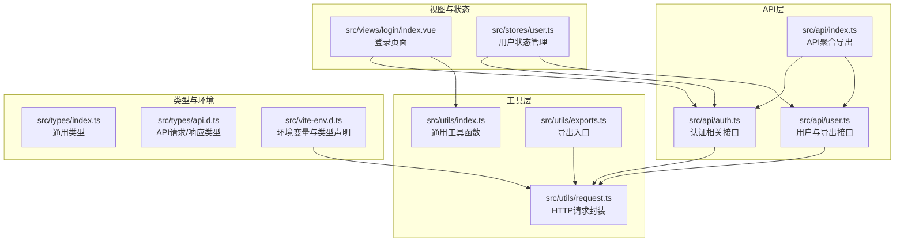
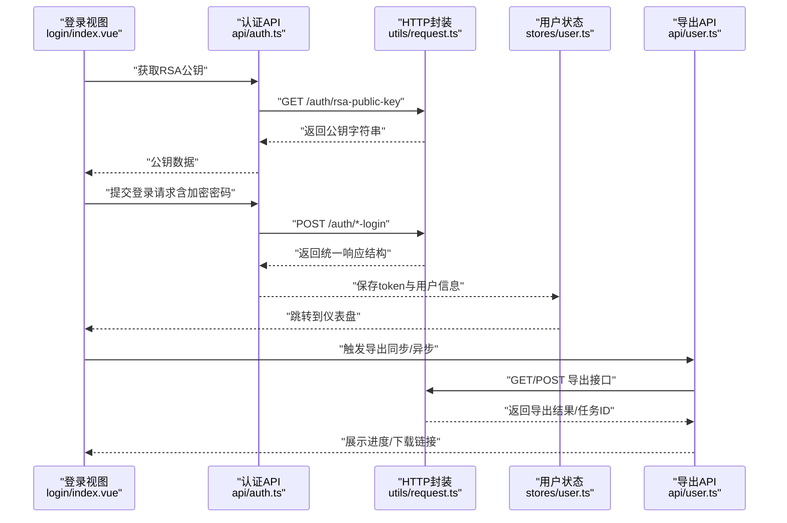
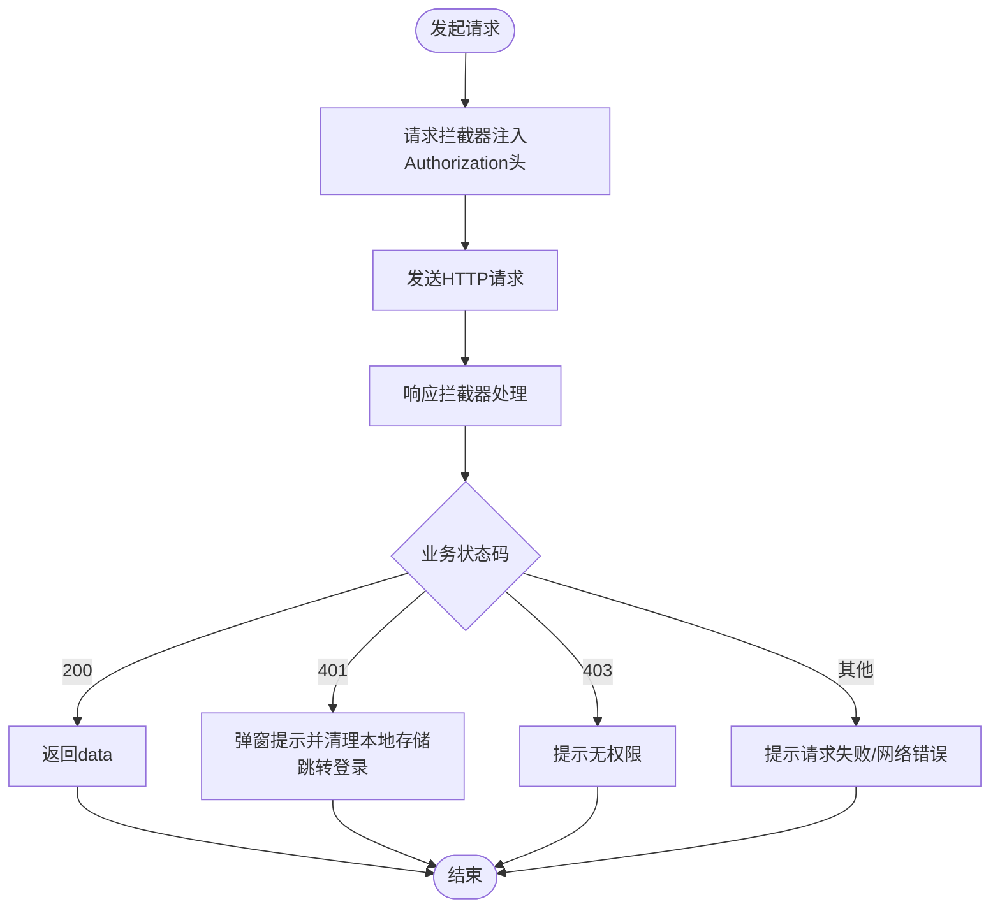
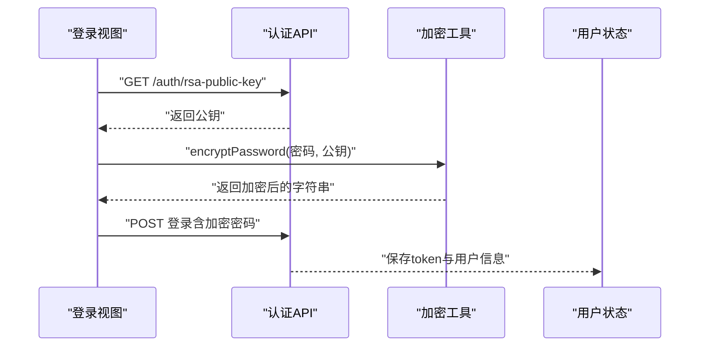
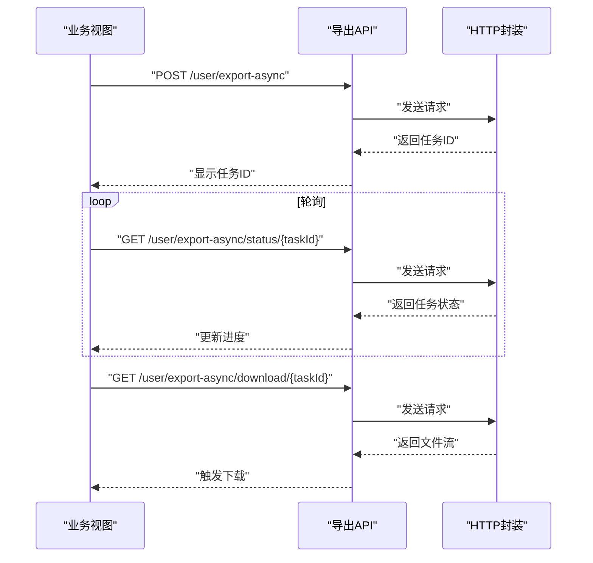
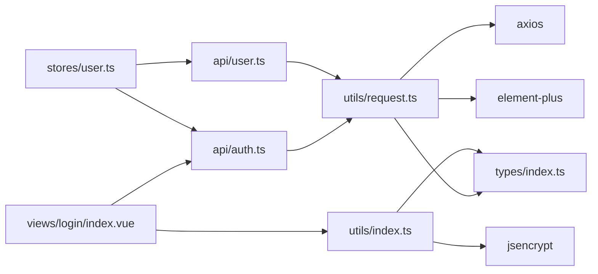

# 工具函数库使用

<cite>
**本文引用的文件**
- [src/utils/index.ts](file://src/utils/index.ts)
- [src/utils/request.ts](file://src/utils/request.ts)
- [src/utils/exports.ts](file://src/utils/exports.ts)
- [src/api/index.ts](file://src/api/index.ts)
- [src/api/auth.ts](file://src/api/auth.ts)
- [src/api/user.ts](file://src/api/user.ts)
- [src/views/login/index.vue](file://src/views/login/index.vue)
- [src/stores/user.ts](file://src/stores/user.ts)
- [src/types/index.ts](file://src/types/index.ts)
- [src/types/api.d.ts](file://src/types/api.d.ts)
- [src/main.ts](file://src/main.ts)
- [src/vite-env.d.ts](file://src/vite-env.d.ts)
- [默认模块.md](file://默认模块.md)
</cite>

## 目录
1. [简介](#简介)
2. [项目结构](#项目结构)
3. [核心组件](#核心组件)
4. [架构总览](#架构总览)
5. [详细组件分析](#详细组件分析)
6. [依赖关系分析](#依赖关系分析)
7. [性能考虑](#性能考虑)
8. [故障排查指南](#故障排查指南)
9. [结论](#结论)
10. [附录](#附录)

## 简介
本文件面向HC管理系统前端工具函数库，系统性介绍以下能力：
- HTTP请求封装：请求拦截器、响应处理、错误统一处理、Token自动刷新机制
- 加密解密工具：RSA加密、数据签名验证、安全传输
- 数据格式化函数：日期时间处理、数字格式化、字符串处理
- 导出功能实现：Excel导出、PDF生成、文件下载
- 使用示例、参数说明、返回值类型与错误处理
- 自定义工具函数的开发指南与扩展方法

## 项目结构
工具函数库主要位于 src/utils 目录，配合 API 层 src/api 与类型定义 src/types 实现统一的数据交互与格式化处理；登录流程在 src/views/login/index.vue 中演示了RSA公钥获取与密码加密流程，并通过 Pinia Store 管理用户态。

图表来源
- [src/utils/index.ts:1-85](file://src/utils/index.ts#L1-L85)
- [src/utils/request.ts:1-148](file://src/utils/request.ts#L1-L148)
- [src/utils/exports.ts:1-3](file://src/utils/exports.ts#L1-L3)
- [src/api/index.ts:1-7](file://src/api/index.ts#L1-L7)
- [src/api/auth.ts:1-69](file://src/api/auth.ts#L1-L69)
- [src/api/user.ts:1-58](file://src/api/user.ts#L1-L58)
- [src/views/login/index.vue:98-158](file://src/views/login/index.vue#L98-L158)
- [src/stores/user.ts:1-152](file://src/stores/user.ts#L1-L152)
- [src/types/index.ts:1-188](file://src/types/index.ts#L1-L188)
- [src/types/api.d.ts:1-156](file://src/types/api.d.ts#L1-L156)
- [src/vite-env.d.ts:1-26](file://src/vite-env.d.ts#L1-L26)

章节来源
- [src/utils/index.ts:1-85](file://src/utils/index.ts#L1-L85)
- [src/utils/request.ts:1-148](file://src/utils/request.ts#L1-L148)
- [src/utils/exports.ts:1-3](file://src/utils/exports.ts#L1-L3)
- [src/api/index.ts:1-7](file://src/api/index.ts#L1-L7)
- [src/api/auth.ts:1-69](file://src/api/auth.ts#L1-L69)
- [src/api/user.ts:1-58](file://src/api/user.ts#L1-L58)
- [src/views/login/index.vue:98-158](file://src/views/login/index.vue#L98-L158)
- [src/stores/user.ts:1-152](file://src/stores/user.ts#L1-L152)
- [src/types/index.ts:1-188](file://src/types/index.ts#L1-L188)
- [src/types/api.d.ts:1-156](file://src/types/api.d.ts#L1-L156)
- [src/vite-env.d.ts:1-26](file://src/vite-env.d.ts#L1-L26)

## 核心组件
- HTTP请求封装与拦截器：基于 axios 的实例化封装，内置请求头注入、统一响应处理、错误分类提示与Token过期处理
- 加密工具：基于 jsencrypt 的RSA公钥加密，用于登录密码等敏感字段的安全传输
- 数据格式化：日期格式化、URL参数解析、防抖节流、文件下载、校验工具等
- 导出功能：同步导出与异步导出（带进度），支持下载任务状态轮询与文件下载

章节来源
- [src/utils/request.ts:1-148](file://src/utils/request.ts#L1-L148)
- [src/utils/index.ts:1-85](file://src/utils/index.ts#L1-L85)
- [src/api/user.ts:1-58](file://src/api/user.ts#L1-L58)

## 架构总览
下图展示了登录与导出的关键调用链路，体现工具函数在系统中的作用边界与协作方式。

图表来源
- [src/views/login/index.vue:98-158](file://src/views/login/index.vue#L98-L158)
- [src/api/auth.ts:1-69](file://src/api/auth.ts#L1-L69)
- [src/utils/request.ts:1-148](file://src/utils/request.ts#L1-L148)
- [src/stores/user.ts:1-152](file://src/stores/user.ts#L1-L152)
- [src/api/user.ts:1-58](file://src/api/user.ts#L1-L58)

## 详细组件分析

### HTTP请求封装与拦截器
- 基础配置
  - 基础URL来自环境变量，超时时间、凭证携带、Content-Type统一设置
- 请求拦截器
  - 自动从本地存储读取token并注入到请求头
- 响应拦截器
  - 统一处理业务状态码：成功、未授权、无权限、其他错误
  - 对未授权场景弹窗提示并清理本地存储，引导跳转登录
  - 对网络异常与配置错误进行分类提示
- 方法封装
  - 提供 get/post/put/del 及通用 request 封装，统一返回 ResponseData 泛型结构
- Token自动刷新机制
  - 当前实现为“未授权时弹窗并强制登录”，未实现后端Token刷新与队列等待策略
  - 若需实现刷新队列，可参考“并发请求等待刷新完成”的模式进行扩展

图表来源
- [src/utils/request.ts:37-101](file://src/utils/request.ts#L37-L101)

章节来源
- [src/utils/request.ts:1-148](file://src/utils/request.ts#L1-L148)
- [src/types/index.ts:1-7](file://src/types/index.ts#L1-L7)

### 加密解密工具（RSA）
- RSA公钥获取
  - 认证API提供获取RSA公钥接口，前端调用后缓存于内存
- 密码加密
  - 使用 jsencrypt 对密码进行RSA加密，避免明文传输
- 类型与环境声明
  - 在环境声明中对 jsencrypt 进行类型补充，确保编译期安全

图表来源
- [src/views/login/index.vue:98-158](file://src/views/login/index.vue#L98-L158)
- [src/api/auth.ts:22-24](file://src/api/auth.ts#L22-L24)
- [src/utils/index.ts:3-7](file://src/utils/index.ts#L3-L7)
- [src/vite-env.d.ts:9-16](file://src/vite-env.d.ts#L9-L16)

章节来源
- [src/utils/index.ts:1-8](file://src/utils/index.ts#L1-L8)
- [src/views/login/index.vue:98-158](file://src/views/login/index.vue#L98-L158)
- [src/api/auth.ts:1-69](file://src/api/auth.ts#L1-L69)
- [src/vite-env.d.ts:9-16](file://src/vite-env.d.ts#L9-L16)

### 数据格式化函数
- URL参数解析：将URL中的查询参数解析为键值对象
- 日期格式化：支持YYYY、MM、DD、HH、mm、ss占位符的日期格式化
- 防抖与节流：通用高阶函数，适用于搜索、滚动等高频事件
- 文件下载：创建临时a标签触发浏览器下载
- 文件扩展名提取：从文件名中提取扩展名
- 手机号与邮箱校验：基础正则校验

章节来源
- [src/utils/index.ts:9-85](file://src/utils/index.ts#L9-L85)

### 导出功能实现
- 同步导出
  - GET /user/export：直接返回导出数据
- 异步导出
  - POST /user/export-async：创建导出任务，返回任务ID
  - GET /user/export-async/status/{taskId}：轮询任务状态
  - GET /user/export-async/download/{taskId}：下载导出文件
- 类型支撑
  - ExcelTaskStatus 定义任务状态、进度、文件路径等字段

图表来源
- [src/api/user.ts:44-58](file://src/api/user.ts#L44-L58)
- [src/types/index.ts:160-173](file://src/types/index.ts#L160-L173)
- [默认模块.md:1334-1446](file://默认模块.md#L1334-L1446)

章节来源
- [src/api/user.ts:1-58](file://src/api/user.ts#L1-L58)
- [src/types/index.ts:160-173](file://src/types/index.ts#L160-L173)
- [默认模块.md:1334-1446](file://默认模块.md#L1334-L1446)

## 依赖关系分析
- 工具函数依赖
  - request.ts 依赖 axios、Element Plus 消息与确认框、路由与类型
  - index.ts 依赖 jsencrypt 进行RSA加密
- 视图与状态依赖
  - login/index.vue 依赖认证API与加密工具
  - user.ts Store 依赖认证与用户相关API
- 类型依赖
  - 所有API返回统一遵循 ResponseData<T> 结构
  - 导出任务状态由 ExcelTaskStatus 描述

图表来源
- [src/utils/request.ts:1-148](file://src/utils/request.ts#L1-L148)
- [src/utils/index.ts:1-8](file://src/utils/index.ts#L1-L8)
- [src/api/auth.ts:1-69](file://src/api/auth.ts#L1-L69)
- [src/api/user.ts:1-58](file://src/api/user.ts#L1-L58)
- [src/views/login/index.vue:98-158](file://src/views/login/index.vue#L98-L158)
- [src/stores/user.ts:1-152](file://src/stores/user.ts#L1-L152)
- [src/types/index.ts:1-188](file://src/types/index.ts#L1-L188)

章节来源
- [src/utils/request.ts:1-148](file://src/utils/request.ts#L1-L148)
- [src/utils/index.ts:1-8](file://src/utils/index.ts#L1-L8)
- [src/api/auth.ts:1-69](file://src/api/auth.ts#L1-L69)
- [src/api/user.ts:1-58](file://src/api/user.ts#L1-L58)
- [src/views/login/index.vue:98-158](file://src/views/login/index.vue#L98-L158)
- [src/stores/user.ts:1-152](file://src/stores/user.ts#L1-L152)
- [src/types/index.ts:1-188](file://src/types/index.ts#L1-L188)

## 性能考虑
- 防抖与节流
  - 在高频输入或滚动场景中使用防抖/节流，减少请求频率
- 请求超时与重试
  - 当前未实现自动重试，可在业务层按需引入指数退避策略
- 并发控制
  - 对于大量导出任务，建议限制并发数量并采用队列管理
- 前端缓存
  - 对于不频繁变化的静态数据（如公钥）可做短期缓存，避免重复请求

## 故障排查指南
- 未授权/登录过期
  - 现象：弹窗提示并跳转登录
  - 处理：检查本地token是否被清理、后端会话是否失效
- 网络错误
  - 现象：提示网络连接失败或请求配置错误
  - 处理：检查网络连通性、代理配置、CORS设置
- 参数错误
  - 现象：提示请求参数错误
  - 处理：核对请求体与查询参数，确保符合API定义
- 导出任务失败
  - 现象：任务状态为FAIL或进度停滞
  - 处理：轮询任务状态，查看错误信息，必要时重新触发导出

章节来源
- [src/utils/request.ts:70-101](file://src/utils/request.ts#L70-L101)
- [src/stores/user.ts:62-80](file://src/stores/user.ts#L62-L80)

## 结论
本工具函数库以统一的HTTP封装为基础，结合RSA加密、数据格式化与导出能力，构建了安全、一致且易扩展的前端工具体系。建议在后续迭代中完善Token刷新队列、自动重试与导出并发控制等能力，进一步提升用户体验与系统稳定性。

## 附录

### 使用示例与参数说明

- RSA加密与登录
  - 获取公钥：调用认证API的公钥接口，缓存公钥
  - 加密密码：使用加密工具对密码进行RSA加密
  - 登录请求：携带加密后的密码与账户信息
  - 成功后：Store保存token与用户信息，跳转首页

- 导出功能
  - 同步导出：直接调用导出接口，接收文件流
  - 异步导出：创建任务 -> 轮询任务状态 -> 下载文件

章节来源
- [src/views/login/index.vue:98-158](file://src/views/login/index.vue#L98-L158)
- [src/api/user.ts:44-58](file://src/api/user.ts#L44-L58)
- [src/stores/user.ts:27-39](file://src/stores/user.ts#L27-L39)

### 返回值类型与错误处理
- 统一响应结构
  - code：业务状态码
  - message：提示信息
  - data：实际数据
  - timestamp/path：附加信息
- 错误处理
  - 未授权：清理本地存储并跳转登录
  - 无权限：提示无权限
  - 其他错误：根据状态码提示相应错误

章节来源
- [src/types/index.ts:1-7](file://src/types/index.ts#L1-L7)
- [src/utils/request.ts:50-101](file://src/utils/request.ts#L50-L101)

### 自定义工具函数开发指南
- 新增工具函数
  - 在 src/utils/index.ts 中新增纯函数，保持无副作用
  - 如涉及第三方库，先在类型声明中补充类型定义
- 扩展HTTP封装
  - 在 utils/request.ts 中扩展拦截器或新增方法
  - 注意统一错误处理与返回类型
- 导出与聚合
  - 在 utils/exports.ts 中导出新工具，便于按需导入
  - 在 api/index.ts 中聚合新增API模块

章节来源
- [src/utils/index.ts:1-85](file://src/utils/index.ts#L1-L85)
- [src/utils/request.ts:103-148](file://src/utils/request.ts#L103-L148)
- [src/utils/exports.ts:1-3](file://src/utils/exports.ts#L1-L3)
- [src/api/index.ts:1-7](file://src/api/index.ts#L1-L7)