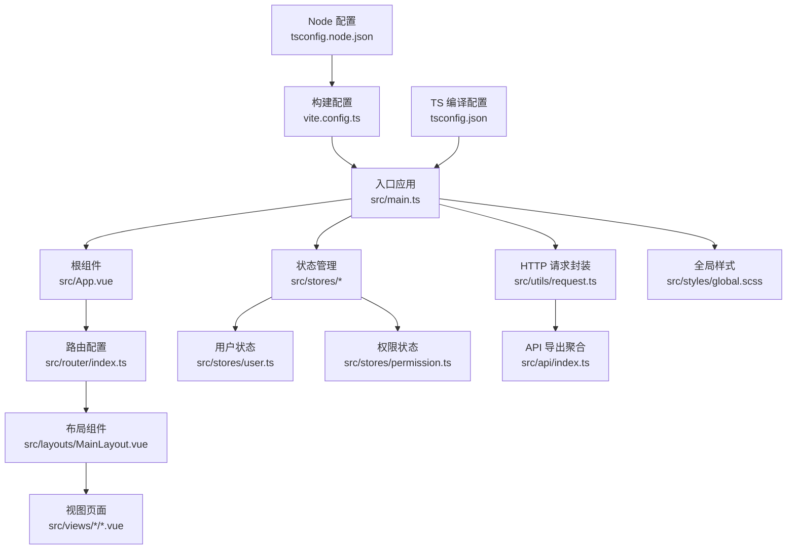
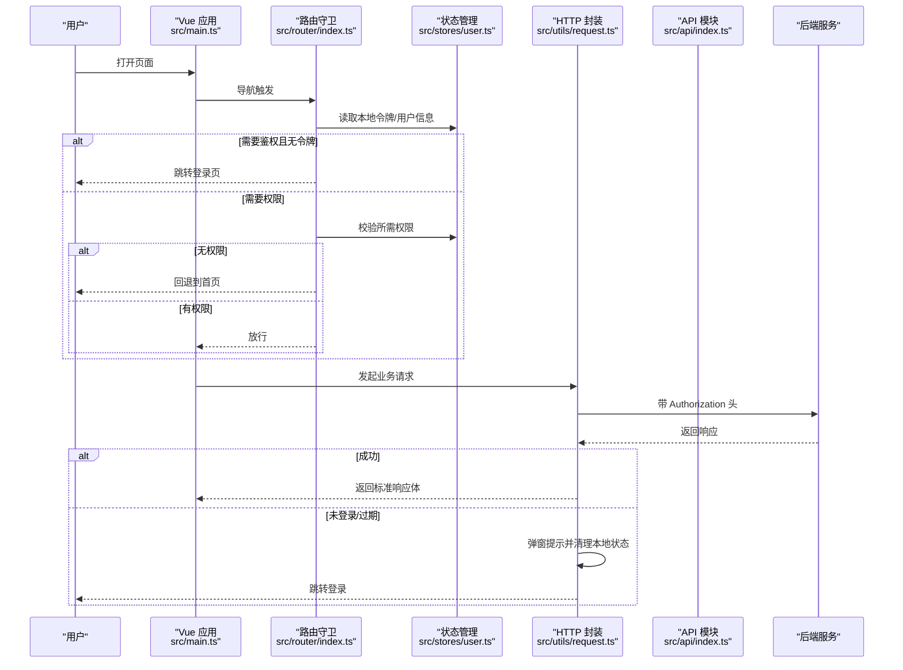
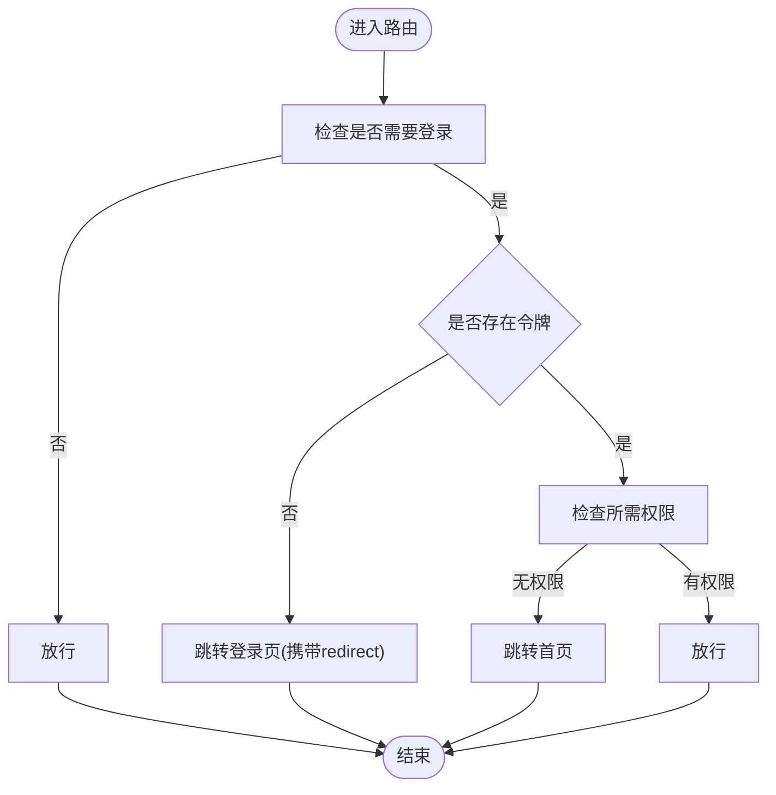
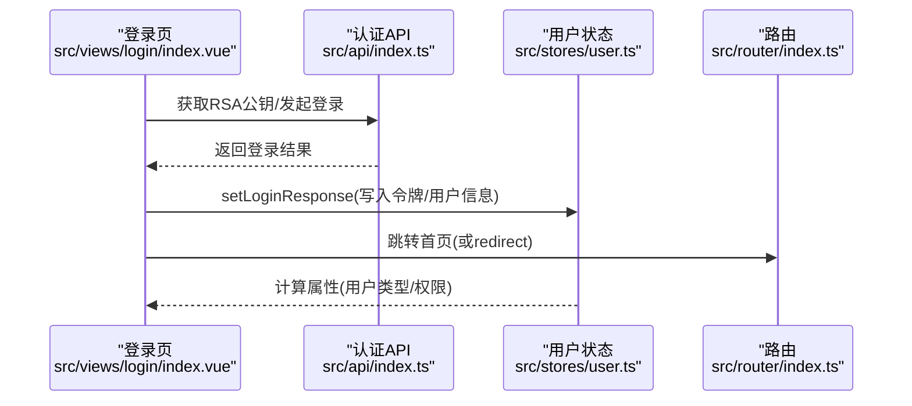
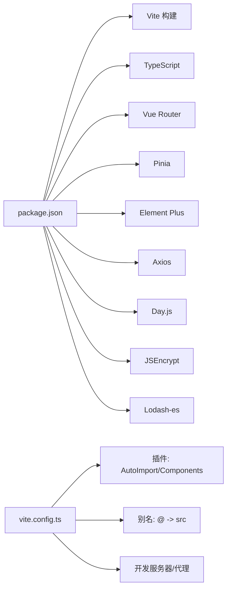

# 开发指南

<cite>
**本文引用的文件**
- [package.json](file://package.json)
- [vite.config.ts](file://vite.config.ts)
- [tsconfig.json](file://tsconfig.json)
- [tsconfig.node.json](file://tsconfig.node.json)
- [src/main.ts](file://src/main.ts)
- [src/App.vue](file://src/App.vue)
- [src/types/index.ts](file://src/types/index.ts)
- [src/utils/index.ts](file://src/utils/index.ts)
- [src/utils/request.ts](file://src/utils/request.ts)
- [src/api/index.ts](file://src/api/index.ts)
- [src/router/index.ts](file://src/router/index.ts)
- [src/stores/index.ts](file://src/stores/index.ts)
- [src/stores/user.ts](file://src/stores/user.ts)
- [src/stores/permission.ts](file://src/stores/permission.ts)
- [src/layouts/MainLayout.vue](file://src/layouts/MainLayout.vue)
- [src/views/login/index.vue](file://src/views/login/index.vue)
</cite>

## 目录
1. [简介](#简介)
2. [项目结构](#项目结构)
3. [核心组件](#核心组件)
4. [架构总览](#架构总览)
5. [组件与功能详解](#组件与功能详解)
6. [依赖关系分析](#依赖关系分析)
7. [性能与优化](#性能与优化)
8. [调试与排错指南](#调试与排错指南)
9. [结论](#结论)
10. [附录](#附录)

## 简介
本开发指南面向参与 HC 管理系统前端开发的工程师，目标是帮助团队统一开发规范、提升类型安全与可维护性，并提供从环境搭建到组件开发、测试与质量保障的完整流程说明。内容覆盖：
- 开发环境与工具链配置
- TypeScript 类型定义最佳实践与类型安全
- 工具函数库的使用与扩展
- 代码规范与最佳实践（命名、文件组织、注释）
- 组件开发规范（设计原则、props、事件、生命周期）
- 调试技巧、性能优化与常见问题解决
- 测试策略与质量保障

## 项目结构
项目采用 Vue 3 + TypeScript + Vite 的现代前端工程化方案，结合 Pinia 状态管理、Element Plus UI 组件库与路由守卫实现权限控制。

图表来源
- [src/main.ts:1-27](file://src/main.ts#L1-L27)
- [src/App.vue:1-10](file://src/App.vue#L1-L10)
- [src/router/index.ts:1-127](file://src/router/index.ts#L1-L127)
- [src/layouts/MainLayout.vue:1-281](file://src/layouts/MainLayout.vue#L1-L281)
- [src/stores/user.ts:1-152](file://src/stores/user.ts#L1-L152)
- [src/stores/permission.ts:1-56](file://src/stores/permission.ts#L1-L56)
- [src/utils/request.ts:1-148](file://src/utils/request.ts#L1-L148)
- [src/api/index.ts:1-7](file://src/api/index.ts#L1-L7)
- [vite.config.ts:1-46](file://vite.config.ts#L1-L46)
- [tsconfig.json:1-28](file://tsconfig.json#L1-L28)
- [tsconfig.node.json:1-19](file://tsconfig.node.json#L1-L19)

章节来源
- [package.json:1-35](file://package.json#L1-L35)
- [vite.config.ts:1-46](file://vite.config.ts#L1-L46)
- [tsconfig.json:1-28](file://tsconfig.json#L1-L28)
- [tsconfig.node.json:1-19](file://tsconfig.node.json#L1-L19)

## 核心组件
- 应用入口与插件注册：在入口中完成 Pinia、Router、Element Plus 注册，并挂载应用。
- 路由与权限：通过路由元信息声明标题、鉴权与权限；前置守卫进行令牌与权限校验。
- 状态管理：用户态与权限态分离，支持持久化与动态权限拉取。
- HTTP 封装：统一封装请求拦截、响应拦截、错误处理与重定向逻辑。
- 工具函数库：密码加密、URL 参数解析、日期格式化、防抖节流、文件下载与校验等。
- 类型系统：统一响应体、分页、用户与权限相关接口类型，确保前后端契约一致。

章节来源
- [src/main.ts:1-27](file://src/main.ts#L1-L27)
- [src/router/index.ts:1-127](file://src/router/index.ts#L1-L127)
- [src/stores/user.ts:1-152](file://src/stores/user.ts#L1-L152)
- [src/stores/permission.ts:1-56](file://src/stores/permission.ts#L1-L56)
- [src/utils/request.ts:1-148](file://src/utils/request.ts#L1-L148)
- [src/utils/index.ts:1-85](file://src/utils/index.ts#L1-L85)
- [src/types/index.ts:1-188](file://src/types/index.ts#L1-L188)

## 架构总览
下图展示从浏览器到后端服务的典型交互路径，包括鉴权、权限与错误处理。

图表来源
- [src/main.ts:1-27](file://src/main.ts#L1-L27)
- [src/router/index.ts:82-124](file://src/router/index.ts#L82-L124)
- [src/stores/user.ts:62-80](file://src/stores/user.ts#L62-L80)
- [src/utils/request.ts:37-101](file://src/utils/request.ts#L37-L101)

## 组件与功能详解

### 路由与权限控制
- 路由元信息用于声明标题、是否需要登录与所需权限。
- 前置守卫根据令牌与权限决定跳转或放行；支持登录页与已登录用户的互斥。
- 权限不足时回退首页，避免白屏。

图表来源
- [src/router/index.ts:82-124](file://src/router/index.ts#L82-L124)

章节来源
- [src/router/index.ts:1-127](file://src/router/index.ts#L1-L127)

### 用户状态与登录流程
- 用户状态包含令牌、当前用户信息、登录响应以及派生计算属性（如用户类型、角色、权限）。
- 登录成功后写入本地存储并跳转；登出时调用后端接口并清理本地状态。
- 首次进入应用会尝试从本地恢复状态。

图表来源
- [src/views/login/index.vue:98-145](file://src/views/login/index.vue#L98-L145)
- [src/stores/user.ts:22-40](file://src/stores/user.ts#L22-L40)
- [src/router/index.ts:137-139](file://src/router/index.ts#L137-L139)

章节来源
- [src/stores/user.ts:1-152](file://src/stores/user.ts#L1-L152)
- [src/views/login/index.vue:1-323](file://src/views/login/index.vue#L1-L323)

### 权限状态与缓存初始化
- 权限列表拉取后转换为代码集合，便于快速判断。
- 提供权限缓存初始化能力，成功后提示消息。

章节来源
- [src/stores/permission.ts:1-56](file://src/stores/permission.ts#L1-L56)

### HTTP 请求封装与错误处理
- 统一设置基础路径、超时、凭证与 Content-Type。
- 请求头自动注入 Bearer 令牌；响应拦截器根据 code 与状态码进行提示与异常分支。
- 未登录场景弹窗并清理本地状态，引导重新登录。

章节来源
- [src/utils/request.ts:1-148](file://src/utils/request.ts#L1-L148)

### 工具函数库
- 加密：基于 RSA 公钥对密码进行加密。
- URL 参数：解析查询字符串为键值对象。
- 日期格式化：支持自定义模板替换。
- 并发控制：防抖与节流。
- 文件操作：下载与扩展名提取。
- 校验：手机号与邮箱正则。

章节来源
- [src/utils/index.ts:1-85](file://src/utils/index.ts#L1-L85)

### 类型系统与最佳实践
- 统一响应体 ResponseData 与分页 PageResult，确保接口契约稳定。
- 用户、企业、角色、权限、日志等实体类型集中定义，避免重复与歧义。
- 在 API 层与 Store 中显式标注泛型与联合类型，增强编译期约束。

章节来源
- [src/types/index.ts:1-188](file://src/types/index.ts#L1-L188)

### 布局与导航
- 主布局根据用户类型与权限动态渲染菜单项。
- 顶部面包屑与用户下拉菜单联动，支持个人中心与退出登录。

章节来源
- [src/layouts/MainLayout.vue:1-281](file://src/layouts/MainLayout.vue#L1-L281)

## 依赖关系分析
- 构建与脚本：Vite 提供开发服务器与打包；TypeScript 与 vue-tsc 进行类型检查与编译。
- 插件生态：AutoImport 与 Components 自动导入 Vue 组件与 API；ElementPlusResolver 减少手动引入。
- 依赖版本：Vue 3、Vue Router、Pinia、Element Plus、Axios、Day.js、JSEncrypt、Lodash-es。

图表来源
- [package.json:13-33](file://package.json#L13-L33)
- [vite.config.ts:1-46](file://vite.config.ts#L1-L46)

章节来源
- [package.json:1-35](file://package.json#L1-L35)
- [vite.config.ts:1-46](file://vite.config.ts#L1-L46)

## 性能与优化
- 构建产物：开启分包警告阈值，避免单文件过大；生产环境关闭 SourceMap。
- 代理与跨域：开发阶段通过代理转发 /api 到后端服务，减少 CORS 配置复杂度。
- 组件懒加载：路由组件使用动态导入，降低首屏体积。
- 状态持久化：用户令牌与用户信息本地持久化，减少重复登录成本。
- 请求拦截：统一注入 Authorization，避免重复设置；错误快速反馈，减少无效重试。

章节来源
- [vite.config.ts:30-44](file://vite.config.ts#L30-L44)
- [src/router/index.ts:14-74](file://src/router/index.ts#L14-L74)
- [src/stores/user.ts:90-127](file://src/stores/user.ts#L90-L127)
- [src/utils/request.ts:37-101](file://src/utils/request.ts#L37-L101)

## 调试与排错指南
- 启动与预览
  - 使用开发脚本启动本地服务，确认端口与代理配置。
  - 生产构建前执行类型检查与 lint，确保无类型错误。
- 常见问题
  - 登录后仍被重定向至登录页：检查路由守卫中的令牌与权限判断逻辑。
  - 接口报 401：确认请求拦截器是否正确注入 Authorization；查看弹窗提示与本地状态清理。
  - 权限按钮不显示：确认权限缓存是否初始化成功，以及用户权限集合是否正确写入。
- 调试建议
  - 在路由守卫与请求拦截器中打印关键变量（令牌、路由元信息、响应 code）。
  - 使用浏览器开发者工具 Network 面板观察请求头与响应体。
  - 在 Store 中断点验证状态更新与持久化时机。

章节来源
- [package.json:6-11](file://package.json#L6-L11)
- [src/router/index.ts:82-124](file://src/router/index.ts#L82-L124)
- [src/utils/request.ts:20-35](file://src/utils/request.ts#L20-L35)
- [src/stores/permission.ts:26-34](file://src/stores/permission.ts#L26-L34)

## 结论
本指南提供了 HC 管理系统前端的开发范式与工程化实践，涵盖环境配置、类型安全、工具库使用、组件开发规范、调试与性能优化、测试与质量保障等方面。建议团队在日常迭代中遵循本文档的约定，持续完善类型契约与组件抽象，以获得更高的可维护性与开发效率。

## 附录

### 开发环境与工具链
- 安装依赖：使用包管理器安装项目依赖。
- 启动开发：运行开发脚本，打开浏览器访问本地地址。
- 构建与预览：执行构建脚本生成 dist；使用预览脚本本地查看产物。
- 类型检查：在提交前执行类型检查，确保无类型错误。
- 代码规范：执行 ESLint 检查，保持风格一致。

章节来源
- [package.json:6-11](file://package.json#L6-L11)

### TypeScript 类型定义最佳实践
- 统一响应体与分页模型，避免重复定义。
- 使用联合类型表达枚举值，如任务状态、身份类型。
- 在 API 与 Store 中明确泛型参数，确保返回值类型安全。
- 对可选字段使用可选链与空值合并，避免运行时错误。

章节来源
- [src/types/index.ts:1-188](file://src/types/index.ts#L1-L188)

### 工具函数库使用与扩展
- 密码加密：先获取 RSA 公钥，再对明文密码进行加密。
- URL 参数解析：传入带查询串的 URL，返回参数对象。
- 日期格式化：支持自定义模板，满足不同展示需求。
- 并发控制：在高频事件（如搜索、滚动）中使用防抖/节流。
- 文件下载：传入文件 URL 与文件名，触发浏览器下载。
- 校验：对手机号与邮箱进行基础正则校验。

章节来源
- [src/utils/index.ts:1-85](file://src/utils/index.ts#L1-L85)

### 代码规范与最佳实践
- 命名约定
  - 变量与函数使用驼峰命名；常量使用大写下划线；类与接口首字母大写。
  - 文件名与目录名采用小写短横线或 PascalCase，视用途而定。
- 文件组织
  - 按功能模块划分目录（views、stores、utils、api），避免交叉耦合。
  - 统一导出入口文件，便于集中管理。
- 注释规范
  - 对公共 API、复杂逻辑与边界条件添加注释，说明输入输出与异常处理。
- 组件开发规范
  - 设计原则：单一职责、可复用、可测试。
  - Props 定义：使用类型声明与默认值；对必填字段进行校验。
  - 事件处理：明确事件语义与回调签名；避免在事件中做过多业务逻辑。
  - 生命周期：在 onMounted 中进行副作用初始化，在 onUnmounted 中清理定时器与订阅。

章节来源
- [src/router/index.ts:4-10](file://src/router/index.ts#L4-L10)
- [src/stores/user.ts:1-152](file://src/stores/user.ts#L1-L152)
- [src/stores/permission.ts:1-56](file://src/stores/permission.ts#L1-L56)

### 测试策略与质量保证
- 单元测试：针对工具函数与纯函数编写测试用例，覆盖正常与异常分支。
- 集成测试：模拟路由守卫与状态变更，验证鉴权与权限流程。
- 端到端测试：使用自动化测试框架覆盖关键用户路径（登录、菜单导航、权限控制）。
- 质量门禁：在 CI 中集成类型检查、ESLint 与单元测试，确保主干分支质量。

章节来源
- [package.json:6-11](file://package.json#L6-L11)