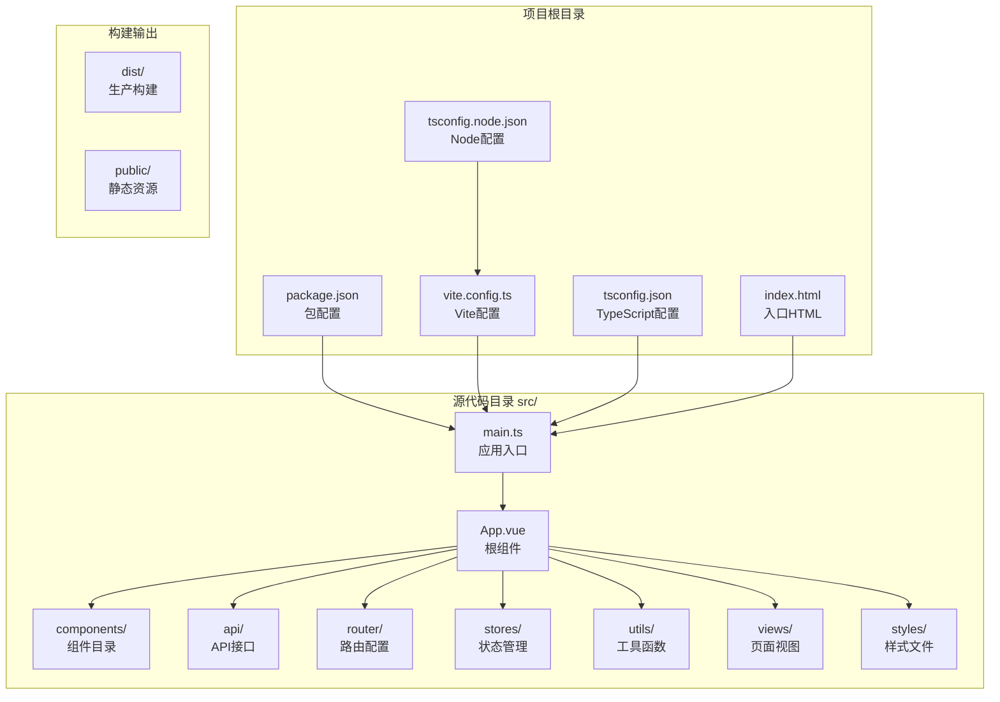
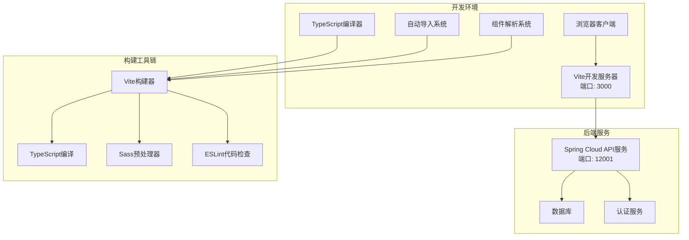
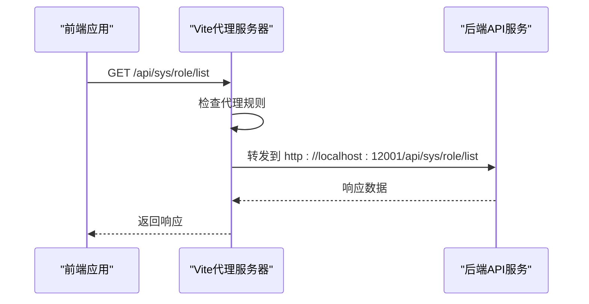
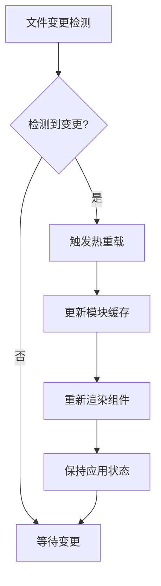

# 开发环境配置

<cite>
**本文档引用的文件**
- [package.json](file://package.json)
- [vite.config.ts](file://vite.config.ts)
- [tsconfig.json](file://tsconfig.json)
- [tsconfig.node.json](file://tsconfig.node.json)
- [src/main.ts](file://src/main.ts)
- [src/utils/request.ts](file://src/utils/request.ts)
- [src/api/system.ts](file://src/api/system.ts)
- [src/router/index.ts](file://src/router/index.ts)
- [index.html](file://index.html)
- [.eslintrc-auto-import.json](file://.eslintrc-auto-import.json)
</cite>

## 目录
1. [简介](#简介)
2. [项目结构](#项目结构)
3. [核心组件](#核心组件)
4. [架构概览](#架构概览)
5. [详细组件分析](#详细组件分析)
6. [依赖分析](#依赖分析)
7. [性能考虑](#性能考虑)
8. [故障排除指南](#故障排除指南)
9. [结论](#结论)

## 简介

HC管理系统是一个基于Vue 3的前端项目，采用现代化的开发工具链构建。本项目使用Vite作为构建工具，TypeScript进行类型安全编程，并集成了Element Plus UI组件库。项目配置了完整的开发环境，包括自动导入、组件解析、路径别名、开发服务器代理等功能。

## 项目结构

该项目采用标准的Vue 3项目结构，主要目录组织如下：



**图表来源**
- [package.json:1-35](file://package.json#L1-L35)
- [vite.config.ts:1-46](file://vite.config.ts#L1-L46)
- [tsconfig.json:1-28](file://tsconfig.json#L1-L28)

**章节来源**
- [package.json:1-35](file://package.json#L1-L35)
- [vite.config.ts:1-46](file://vite.config.ts#L1-L46)
- [tsconfig.json:1-28](file://tsconfig.json#L1-L28)

## 核心组件

### Node.js版本要求

项目对Node.js版本有明确要求：
- **最低版本**: Node.js 16.x或更高版本
- **推荐版本**: Node.js 18.x或更新版本

这些要求确保与现代JavaScript特性和包管理器兼容性。

### 包管理器选择

项目支持多种包管理器：
- **npm** (默认推荐)
- **yarn**
- **pnpm**

所有包管理器在本项目中都能正常工作，但建议使用npm以获得最佳兼容性。

### 依赖安装过程

依赖安装遵循以下步骤：

1. **基础依赖安装**
   ```bash
   npm install
   ```

2. **开发依赖安装**
   - Vue 3.5.13
   - Vite 6.3.5
   - TypeScript 5.8.3
   - Element Plus 2.9.7

3. **开发工具安装**
   - unplugin-auto-import 19.1.1
   - unplugin-vue-components 28.5.0
   - vue-tsc 2.2.10

**章节来源**
- [package.json:13-33](file://package.json#L13-L33)

## 架构概览

系统采用前后端分离架构，前端通过Vite提供开发服务器，后端通过Spring Cloud提供RESTful API服务。



**图表来源**
- [vite.config.ts:29-39](file://vite.config.ts#L29-L39)
- [src/utils/request.ts:6](file://src/utils/request.ts#L6)

## 详细组件分析

### Vite构建工具配置

#### 插件配置

**AutoImport插件配置**
- 自动导入Vue 3 Composition API
- 自动导入Vue Router和Pinia
- 集成Element Plus自动导入
- 生成类型声明文件

**Components插件配置**
- 自动注册Element Plus组件
- 生成组件类型声明
- 支持按需导入优化

#### 路径别名设置

项目使用`@`作为源代码根目录的别名：
```typescript
alias: {
  '@': resolve(__dirname, 'src')
}
```

这使得代码中的导入更加简洁和可维护。

#### 开发服务器配置

开发服务器配置详情：
- **端口**: 3000
- **主机**: 允许外部访问
- **自动打开**: 启用浏览器自动打开
- **代理配置**: `/api` -> `http://localhost:12001`

**章节来源**
- [vite.config.ts:8-45](file://vite.config.ts#L8-L45)

### TypeScript编译配置

#### 编译选项

**主配置 (tsconfig.json)**
- 目标: ES2022
- 模块: ESNext
- 模块解析: bundler
- 严格模式: 启用
- JSX处理: preserve
- 类型检查: 启用

**Node配置 (tsconfig.node.json)**
- 专门用于Vite配置文件的TypeScript检查
- 目标: ES2022
- 模块: ESNext

#### 路径映射

TypeScript路径映射配置：
```json
"baseUrl": ".",
"paths": {
  "@/*": ["src/*"]
}
```

#### 类型检查设置

- 启用严格类型检查
- 禁用未使用变量警告
- 支持Vue单文件组件类型检查

**章节来源**
- [tsconfig.json:2-27](file://tsconfig.json#L2-L27)
- [tsconfig.node.json:2-18](file://tsconfig.node.json#L2-L18)

### 开发服务器代理配置

代理配置实现前后端分离开发：



**图表来源**
- [vite.config.ts:33-38](file://vite.config.ts#L33-L38)
- [src/utils/request.ts:6](file://src/utils/request.ts#L6)

代理配置特点：
- **前缀匹配**: 所有以`/api`开头的请求
- **目标地址**: `http://localhost:12001`
- **跨域处理**: `changeOrigin: true`
- **本地存储**: 支持同源策略

### 环境变量配置

项目使用Vite的环境变量系统：

#### 环境变量定义

```typescript
const BASE_URL = import.meta.env.VITE_API_BASE_URL || '/api'
```

可用的环境变量：
- `VITE_API_BASE_URL`: API基础URL
- 默认值: `/api`

#### 环境变量文件

虽然项目中未包含`.env`文件，但支持以下格式：
- `.env.development`
- `.env.production`
- `.env.test`

**章节来源**
- [src/utils/request.ts:6](file://src/utils/request.ts#L6)

### 热重载机制

项目配置了完整的热重载功能：

#### Vite热重载配置



**图表来源**
- [vite.config.ts:11-18](file://vite.config.ts#L11-L18)

#### 自动导入热重载

- ESLint配置自动更新
- 类型声明文件自动重新生成
- 组件注册信息实时更新

### 开发工具链使用

#### 代码质量工具

**ESLint配置**
- 自动导入全局变量
- Vue 3最佳实践
- TypeScript集成

**自动导入配置**
- Vue Composition API
- Vue Router
- Pinia Store
- Element Plus组件

#### 构建脚本

```json
{
  "scripts": {
    "dev": "vite",
    "build": "vue-tsc -b && vite build",
    "preview": "vite preview",
    "lint": "eslint .",
    "type-check": "vue-tsc --noEmit"
  }
}
```

**章节来源**
- [package.json:6-12](file://package.json#L6-L12)
- [.eslintrc-auto-import.json:1-94](file://.eslintrc-auto-import.json#L1-L94)

## 依赖分析

项目依赖关系图展示了核心依赖及其相互关系：

```mermaid
graph TB
subgraph "运行时依赖"
A[Vue 3.5.13]
B[Vue Router 4.5.0]
C[Pinia 3.0.2]
D[Element Plus 2.9.7]
E[Axios 1.9.0]
F[Day.js 1.11.13]
G[Lodash-es 4.17.21]
end
subgraph "开发依赖"
H[@vitejs/plugin-vue 5.2.3]
I[Vite 6.3.5]
J[TypeScript 5.8.3]
K[unplugin-auto-import 19.1.1]
L[unplugin-vue-components 28.5.0]
M[Vue-TSC 2.2.10]
N[Sass 1.86.3]
end
A --> B
A --> C
A --> D
D --> E
A --> E
H --> I
K --> A
L --> A
M --> J
```

**图表来源**
- [package.json:13-33](file://package.json#L13-L33)

**章节来源**
- [package.json:13-33](file://package.json#L13-L33)

## 性能考虑

### 构建优化

- **Tree Shaking**: 通过ES模块系统启用
- **代码分割**: 自动按需加载路由组件
- **Source Map**: 生产环境禁用以减少体积
- **Chunk大小限制**: 2MB警告阈值

### 运行时优化

- **组件懒加载**: 路由级别的异步组件
- **图标组件**: 动态注册Element Plus图标
- **状态持久化**: 用户信息本地存储

## 故障排除指南

### 常见问题及解决方案

#### 代理配置问题

**问题**: 请求被拒绝或返回404
**解决方案**:
1. 确认后端服务正在运行
2. 检查代理目标地址是否正确
3. 验证CORS设置

#### 类型检查错误

**问题**: TypeScript编译失败
**解决方案**:
1. 运行类型检查: `npm run type-check`
2. 检查类型定义文件
3. 验证导入路径

#### 热重载失效

**问题**: 文件修改后不刷新
**解决方案**:
1. 检查Vite配置
2. 清除浏览器缓存
3. 重启开发服务器

**章节来源**
- [src/utils/request.ts:50-101](file://src/utils/request.ts#L50-L101)

## 结论

HC管理系统提供了完整的现代化前端开发环境配置。项目采用的最佳实践包括：

1. **现代化工具链**: Vite + TypeScript + Vue 3
2. **开发体验优化**: 自动导入、组件解析、热重载
3. **类型安全**: 完整的TypeScript配置
4. **开发效率**: 代理配置、路径别名、ESLint集成

这套配置为开发者提供了高效、可靠的开发环境，支持快速迭代和高质量代码输出。建议在团队协作中保持配置的一致性，并根据项目需求进行适当的扩展和定制。