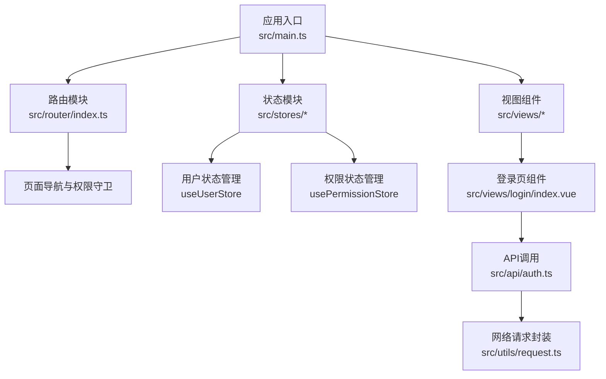
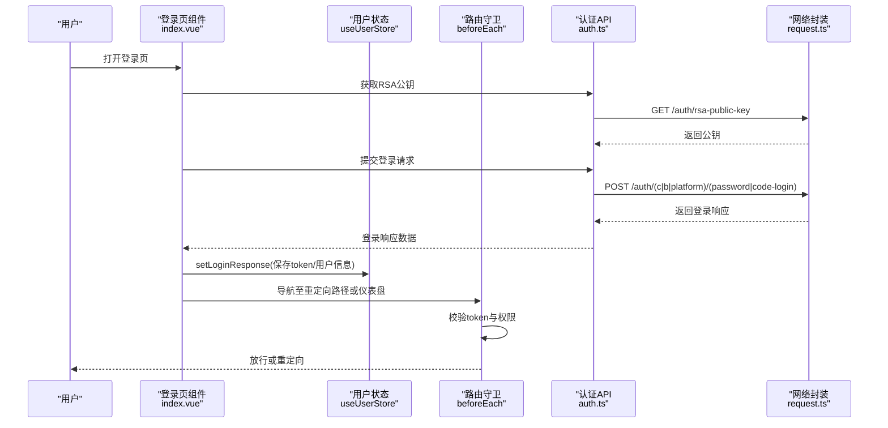
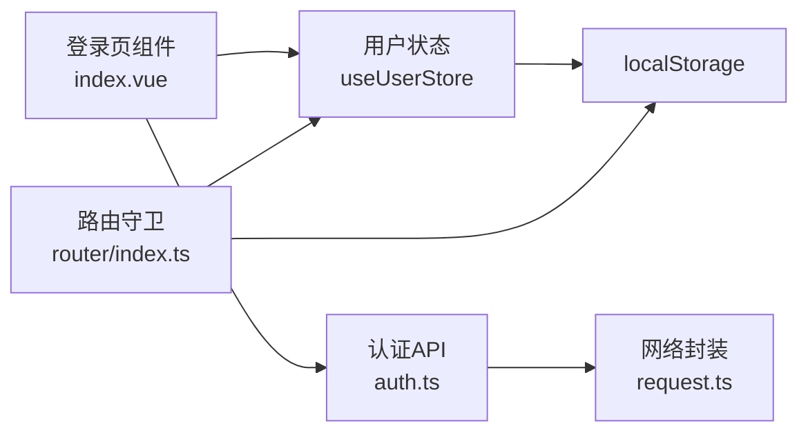

# 测试策略与质量保证

<cite>
**本文引用的文件**
- [package.json](file://package.json)
- [vite.config.ts](file://vite.config.ts)
- [src/main.ts](file://src/main.ts)
- [src/router/index.ts](file://src/router/index.ts)
- [src/stores/index.ts](file://src/stores/index.ts)
- [src/stores/user.ts](file://src/stores/user.ts)
- [src/stores/permission.ts](file://src/stores/permission.ts)
- [src/utils/request.ts](file://src/utils/request.ts)
- [src/api/auth.ts](file://src/api/auth.ts)
- [src/api/index.ts](file://src/api/index.ts)
- [src/types/index.ts](file://src/types/index.ts)
- [src/views/login/index.vue](file://src/views/login/index.vue)
</cite>

## 目录
1. [引言](#引言)
2. [项目结构](#项目结构)
3. [核心组件](#核心组件)
4. [架构总览](#架构总览)
5. [详细组件分析](#详细组件分析)
6. [依赖分析](#依赖分析)
7. [性能考虑](#性能考虑)
8. [故障排查指南](#故障排查指南)
9. [结论](#结论)
10. [附录](#附录)

## 引言
本文件面向HC管理系统前端，制定系统化的测试策略与质量保证方案，覆盖单元测试、集成测试与端到端测试三大层面，并配套测试工具配置、覆盖率要求、持续集成与自动化流程建议，以及测试用例编写指南与常见场景实现方法。目标是确保登录流程、权限校验、用户状态管理与页面导航在不同环境下的稳定性与一致性。

## 项目结构
本项目采用Vite + Vue 3 + TypeScript + Pinia + Vue Router的现代前端技术栈，核心模块包括：
- 应用入口与全局依赖注入
- 路由与权限守卫
- 状态管理（用户态与权限态）
- 网络层封装与API模块
- 视图组件（以登录页为代表）

图表来源
- [src/main.ts:1-27](file://src/main.ts#L1-L27)
- [src/router/index.ts:1-127](file://src/router/index.ts#L1-L127)
- [src/stores/user.ts:1-152](file://src/stores/user.ts#L1-L152)
- [src/stores/permission.ts:1-56](file://src/stores/permission.ts#L1-L56)
- [src/views/login/index.vue:1-323](file://src/views/login/index.vue#L1-L323)
- [src/api/auth.ts:1-69](file://src/api/auth.ts#L1-L69)
- [src/utils/request.ts:1-148](file://src/utils/request.ts#L1-L148)

章节来源
- [src/main.ts:1-27](file://src/main.ts#L1-L27)
- [vite.config.ts:1-46](file://vite.config.ts#L1-L46)

## 核心组件
- 应用入口与依赖注入：创建应用实例、注册Pinia与Router、挂载Element Plus图标组件、初始化用户状态。
- 路由与权限守卫：基于meta字段控制是否需要认证与具体权限；根据localStorage中的token与用户权限决定放行或重定向。
- 用户状态管理：维护token、用户类型、角色与权限集合，支持从本地存储恢复、拉取当前用户信息、登出清理。
- 权限状态管理：拉取权限列表、初始化权限缓存、提供权限查询能力。
- 网络层封装：统一拦截器处理鉴权、权限、错误提示与重定向；提供便捷的HTTP方法封装。
- 登录页组件：多用户类型与登录模式切换、RSA公钥获取与密码加密、验证码发送与倒计时、登录表单校验与跳转。

章节来源
- [src/main.ts:1-27](file://src/main.ts#L1-L27)
- [src/router/index.ts:82-124](file://src/router/index.ts#L82-L124)
- [src/stores/user.ts:7-151](file://src/stores/user.ts#L7-L151)
- [src/stores/permission.ts:7-55](file://src/stores/permission.ts#L7-L55)
- [src/utils/request.ts:37-101](file://src/utils/request.ts#L37-L101)
- [src/views/login/index.vue:1-323](file://src/views/login/index.vue#L1-L323)

## 架构总览
下图展示登录流程与权限校验在系统中的交互关系，便于设计测试场景与断言点。

图表来源
- [src/views/login/index.vue:147-158](file://src/views/login/index.vue#L147-L158)
- [src/api/auth.ts:22-68](file://src/api/auth.ts#L22-L68)
- [src/stores/user.ts:27-39](file://src/stores/user.ts#L27-L39)
- [src/router/index.ts:82-124](file://src/router/index.ts#L82-L124)
- [src/utils/request.ts:107-147](file://src/utils/request.ts#L107-L147)

## 详细组件分析

### 单元测试策略
- Vue组件测试
  - 目标：登录页组件的表单校验、登录类型切换、验证码发送与倒计时、登录提交逻辑。
  - 方法：使用Vue Test Utils挂载组件，模拟用户输入与点击事件，断言DOM更新、消息提示与路由跳转；对异步API调用进行mock，避免真实网络请求。
  - 关键断言点：表单规则触发、RSA公钥获取成功、登录成功后的状态写入与路由跳转。
  - 参考文件：[src/views/login/index.vue:1-323](file://src/views/login/index.vue#L1-L323)

- Pinia Store测试
  - 目标：useUserStore与usePermissionStore的状态变更、计算属性、API调用副作用。
  - 方法：直接调用store函数创建实例，通过mock API返回值验证状态同步与本地存储写入；断言hasPermission/hasRole行为与clear方法。
  - 关键断言点：setLoginResponse写入token与userInfo、fetchUserInfo解析兼容字段、logout清理与路由跳转、权限列表拉取与缓存初始化。
  - 参考文件：[src/stores/user.ts:7-151](file://src/stores/user.ts#L7-L151), [src/stores/permission.ts:7-55](file://src/stores/permission.ts#L7-L55)

- API接口测试
  - 目标：认证相关接口的请求构造、响应格式与错误分支。
  - 方法：对auth.ts导出的方法进行独立测试，结合utils/request.ts的拦截器行为，断言HTTP方法、URL、参数与错误提示。
  - 关键断言点：GET/POST路径正确性、401/403错误处理、消息提示与重定向。
  - 参考文件：[src/api/auth.ts:1-69](file://src/api/auth.ts#L1-L69), [src/utils/request.ts:107-147](file://src/utils/request.ts#L107-L147)

章节来源
- [src/views/login/index.vue:1-323](file://src/views/login/index.vue#L1-L323)
- [src/stores/user.ts:7-151](file://src/stores/user.ts#L7-L151)
- [src/stores/permission.ts:7-55](file://src/stores/permission.ts#L7-L55)
- [src/api/auth.ts:1-69](file://src/api/auth.ts#L1-L69)
- [src/utils/request.ts:107-147](file://src/utils/request.ts#L107-L147)

### 集成测试方法
- 路由守卫测试
  - 目标：验证未登录访问受保护路由、权限不足时的重定向行为、登录页已登录时的自动跳转。
  - 方法：在测试中设置/清除localStorage中的token与用户信息，触发导航，断言next回调与最终路由名。
  - 关键断言点：to.meta.requiresAuth与meta.permissions生效、解析用户权限数组、重定向路径携带。
  - 参考文件：[src/router/index.ts:82-124](file://src/router/index.ts#L82-L124)

- 权限验证测试
  - 目标：验证hasPermission/hasRole在不同用户类型与权限集合下的行为。
  - 方法：构造不同userInfo（含不同permissions/roles），断言store的权限判定结果。
  - 参考文件：[src/stores/user.ts:82-88](file://src/stores/user.ts#L82-L88), [src/stores/permission.ts:36-38](file://src/stores/permission.ts#L36-L38)

- 用户状态管理测试
  - 目标：验证initFromStorage从localStorage恢复状态、fetchUserInfo兼容字段解析、logout清理流程。
  - 方法：在测试前写入localStorage，触发initFromStorage；调用fetchUserInfo断言合并与存储；调用logout断言清理与跳转。
  - 参考文件：[src/stores/user.ts:90-127](file://src/stores/user.ts#L90-L127), [src/stores/user.ts:41-60](file://src/stores/user.ts#L41-L60), [src/stores/user.ts:62-80](file://src/stores/user.ts#L62-L80)

章节来源
- [src/router/index.ts:82-124](file://src/router/index.ts#L82-L124)
- [src/stores/user.ts:82-88](file://src/stores/user.ts#L82-L88)
- [src/stores/permission.ts:36-38](file://src/stores/permission.ts#L36-L38)
- [src/stores/user.ts:90-127](file://src/stores/user.ts#L90-L127)
- [src/stores/user.ts:41-60](file://src/stores/user.ts#L41-L60)
- [src/stores/user.ts:62-80](file://src/stores/user.ts#L62-L80)

### 端到端测试场景
- 用户登录流程
  - 步骤：打开登录页 → 切换登录类型/模式 → 输入账户/密码/验证码 → 点击登录 → 成功后写入状态并跳转。
  - 断言：消息提示、路由跳转、localStorage写入、store状态更新。
  - 参考文件：[src/views/login/index.vue:98-145](file://src/views/login/index.vue#L98-L145), [src/stores/user.ts:27-39](file://src/stores/user.ts#L27-L39)

- 权限访问测试
  - 场景：访问带权限要求的路由（如用户管理），在无权限或权限不足时重定向至仪表盘。
  - 断言：next回调行为、最终路由名与原因。
  - 参考文件：[src/router/index.ts:96-115](file://src/router/index.ts#L96-L115)

- 页面导航测试
  - 场景：已登录状态下访问/login自动跳转仪表盘；未登录访问受保护路由跳转登录并携带redirect。
  - 断言：路由守卫next参数与最终路由。
  - 参考文件：[src/router/index.ts:118-123](file://src/router/index.ts#L118-L123)

章节来源
- [src/views/login/index.vue:98-145](file://src/views/login/index.vue#L98-L145)
- [src/stores/user.ts:27-39](file://src/stores/user.ts#L27-L39)
- [src/router/index.ts:96-115](file://src/router/index.ts#L96-L115)
- [src/router/index.ts:118-123](file://src/router/index.ts#L118-L123)

### 测试工具配置
- Jest与Vue Test Utils
  - 建议：在现有Vite工程基础上引入@vitejs/plugin-vue与unplugin-auto-import，配合Jest运行TS/JS与Vue SFC。
  - 配置要点：模块别名映射（@）、自动导入（vue/pinia/vue-router）、Element Plus解析器、ESLint集成。
  - 参考文件：[vite.config.ts:1-46](file://vite.config.ts#L1-L46), [package.json:6-11](file://package.json#L6-L11)

- Mock数据准备
  - 建议：为API层提供统一的mock工厂，按用户类型与权限场景生成典型响应；对utils/request.ts的拦截器行为进行隔离测试。
  - 参考文件：[src/api/auth.ts:1-69](file://src/api/auth.ts#L1-L69), [src/utils/request.ts:107-147](file://src/utils/request.ts#L107-L147)

- 测试覆盖率要求
  - 建议：语句覆盖率≥80%，分支覆盖率≥70%，函数与行覆盖率≥80%；对关键业务（登录、权限校验、状态管理）达到更高阈值。
  - 工具：Jest内置覆盖率报告，结合CI中的覆盖率上传与阈值校验。

- 持续集成与自动化
  - 建议：在CI中执行lint、type-check、单元测试与覆盖率检查；构建产物预览与端到端测试（可选）。
  - 参考文件：[package.json:6-11](file://package.json#L6-L11)

章节来源
- [vite.config.ts:1-46](file://vite.config.ts#L1-L46)
- [package.json:6-11](file://package.json#L6-L11)
- [src/api/auth.ts:1-69](file://src/api/auth.ts#L1-L69)
- [src/utils/request.ts:107-147](file://src/utils/request.ts#L107-L147)

### 测试用例编写指南
- 组件层
  - 使用Vue Test Utils的mount/shallowMount，模拟props与事件；对异步操作使用flushPromises或jest.runAllTimers。
  - 对Element Plus组件使用其官方测试建议，避免直接依赖DOM细节，优先断言行为与状态。
- Store层
  - 通过直接调用store函数创建实例，避免真实依赖；对API调用进行jest.mock，断言状态与副作用。
- API层
  - 分离请求构造与响应处理，对utils/request.ts的拦截器行为进行独立测试，确保错误码与消息一致。
- 路由层
  - 在beforeEach外部设置/清除localStorage，断言next回调参数与最终路由；对异常场景（解析失败）进行边界测试。

## 依赖分析
- 组件耦合与内聚
  - 登录页高度依赖useUserStore与auth API；路由守卫依赖localStorage与用户权限；网络层被API与路由共同依赖。
- 外部依赖与集成点
  - Element Plus用于UI与消息提示；axios用于HTTP请求；localStorage用于持久化状态。
- 接口契约
  - API返回统一的ResponseData结构；utils/request.ts对响应进行标准化处理与错误提示。

图表来源
- [src/views/login/index.vue:1-323](file://src/views/login/index.vue#L1-L323)
- [src/stores/user.ts:1-152](file://src/stores/user.ts#L1-L152)
- [src/api/auth.ts:1-69](file://src/api/auth.ts#L1-L69)
- [src/utils/request.ts:1-148](file://src/utils/request.ts#L1-L148)
- [src/router/index.ts:1-127](file://src/router/index.ts#L1-L127)

章节来源
- [src/views/login/index.vue:1-323](file://src/views/login/index.vue#L1-L323)
- [src/stores/user.ts:1-152](file://src/stores/user.ts#L1-L152)
- [src/api/auth.ts:1-69](file://src/api/auth.ts#L1-L69)
- [src/utils/request.ts:1-148](file://src/utils/request.ts#L1-L148)
- [src/router/index.ts:1-127](file://src/router/index.ts#L1-L127)

## 性能考虑
- 测试执行速度
  - 使用Jest的并行与缓存机制；对大型组件测试拆分为更小的子任务；避免不必要的DOM渲染。
- 覆盖率与回归
  - 将覆盖率阈值纳入CI，防止回归；对热点路径（登录、权限校验）增加测试密度。
- 网络层优化
  - 在测试中统一mock网络请求，减少真实I/O；对拦截器行为进行单元测试，避免端到端成本过高。

## 故障排查指南
- 登录失败或提示“登录已过期”
  - 检查utils/request.ts的401处理逻辑与路由跳转；确认localStorage中的token与userInfo是否正确写入。
  - 参考文件：[src/utils/request.ts:20-35](file://src/utils/request.ts#L20-L35), [src/stores/user.ts:22-39](file://src/stores/user.ts#L22-L39)

- 权限不足导致重定向
  - 检查路由守卫中权限解析与meta.permissions匹配逻辑；确认localStorage中的currentUserInfo格式。
  - 参考文件：[src/router/index.ts:96-115](file://src/router/index.ts#L96-L115)

- 登出后状态未清理
  - 检查useUserStore.clearUser与logout流程；确认localStorage移除与路由跳转。
  - 参考文件：[src/stores/user.ts:73-80](file://src/stores/user.ts#L73-L80), [src/stores/user.ts:62-71](file://src/stores/user.ts#L62-L71)

章节来源
- [src/utils/request.ts:20-35](file://src/utils/request.ts#L20-L35)
- [src/stores/user.ts:22-39](file://src/stores/user.ts#L22-L39)
- [src/router/index.ts:96-115](file://src/router/index.ts#L96-L115)
- [src/stores/user.ts:73-80](file://src/stores/user.ts#L73-L80)
- [src/stores/user.ts:62-71](file://src/stores/user.ts#L62-L71)

## 结论
通过分层测试策略（单元、集成、端到端）与完善的工具配置，HC管理系统可在开发早期发现并修复问题，提升交付质量与稳定性。建议在CI中强制覆盖率阈值，并将关键业务场景纳入自动化回归。

## 附录
- 测试用例清单（示例）
  - 登录页：表单校验、RSA公钥获取、验证码发送、多用户类型登录、登录成功跳转。
  - 用户状态：initFromStorage恢复、fetchUserInfo兼容字段、logout清理、hasPermission/hasRole。
  - 权限状态：fetchPermissions列表拉取、initPermission缓存初始化、hasPermission。
  - 路由守卫：未登录访问受保护路由、权限不足重定向、已登录访问/login自动跳转。
  - 网络层：拦截器统一错误处理、401/403/404/500分支、消息提示与重定向。