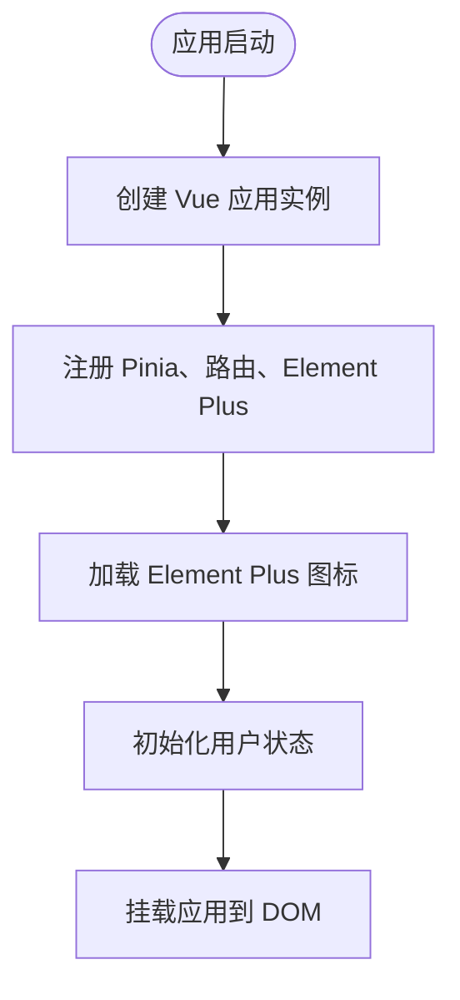
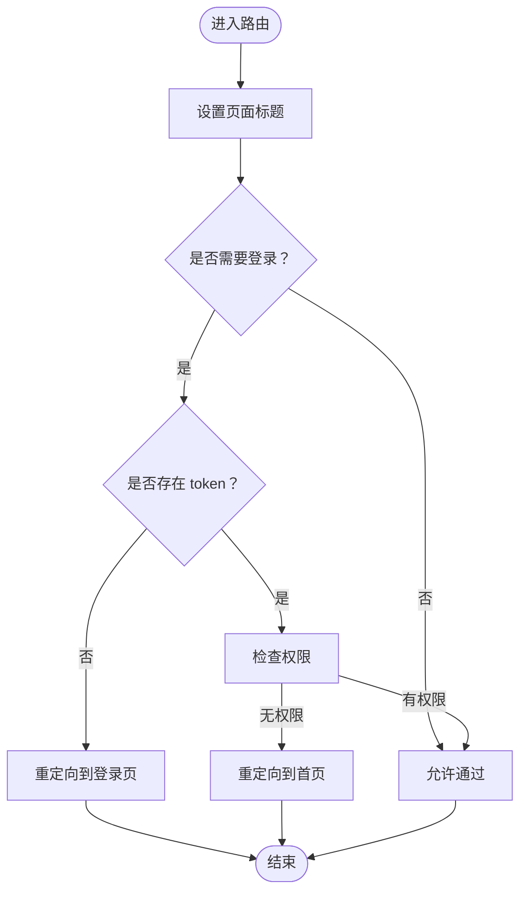
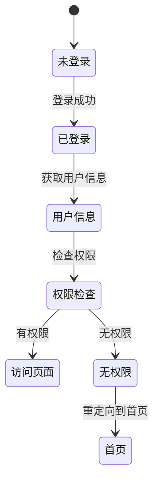
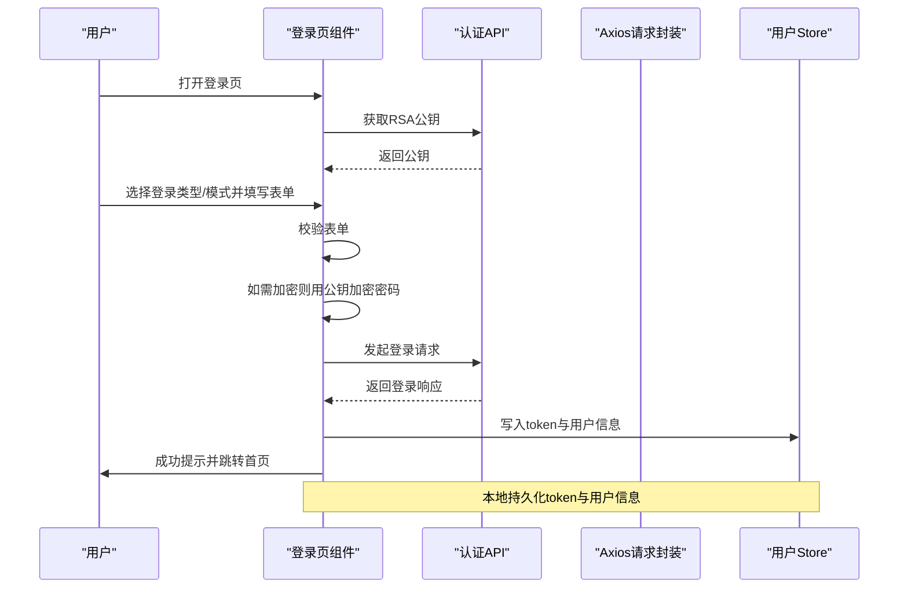
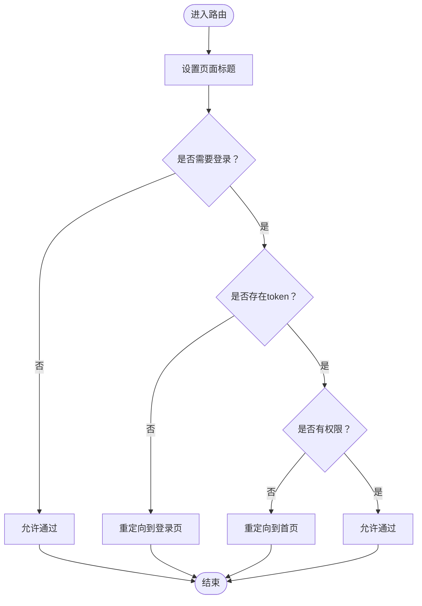
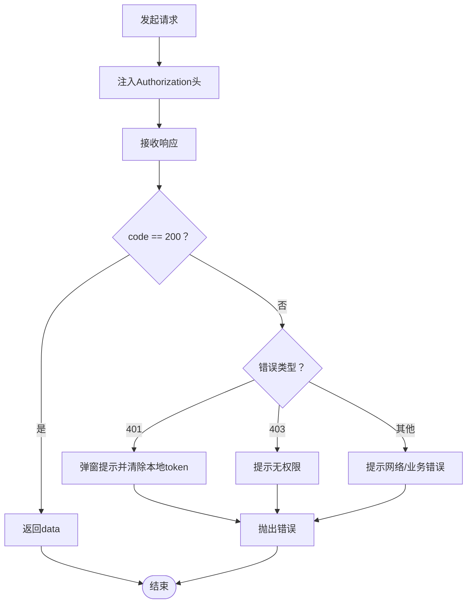

# 快速开始

<cite>
**本文引用的文件**
- [package.json](file://package.json)
- [vite.config.ts](file://vite.config.ts)
- [tsconfig.json](file://tsconfig.json)
- [index.html](file://index.html)
- [src/main.ts](file://src/main.ts)
- [src/router/index.ts](file://src/router/index.ts)
- [src/stores/user.ts](file://src/stores/user.ts)
- [src/utils/request.ts](file://src/utils/request.ts)
- [src/views/login/index.vue](file://src/views/login/index.vue)
- [src/types/index.ts](file://src/types/index.ts)
- [.eslintrc-auto-import.json](file://.eslintrc-auto-import.json)
- [默认模块.md](file://默认模块.md)
</cite>

## 更新摘要
**所做更改**
- 新增环境准备章节，详细说明 Node.js 和包管理器要求
- 完善安装步骤，包含环境检测和依赖安装流程
- 增强核心组件设置说明，涵盖路由守卫和权限控制
- 扩展故障排除程序，提供更全面的问题诊断和解决方案
- 补充开发工具推荐和 IDE 配置建议

## 目录
1. [简介](#简介)
2. [环境准备](#环境准备)
3. [安装步骤](#安装步骤)
4. [核心组件设置](#核心组件设置)
5. [架构总览](#架构总览)
6. [详细组件分析](#详细组件分析)
7. [依赖分析](#依赖分析)
8. [性能考虑](#性能考虑)
9. [故障排除指南](#故障排除指南)
10. [开发工具与 IDE 配置](#开发工具与-ide-配置)
11. [结论](#结论)
12. [附录](#附录)

## 简介
本指南面向新加入的前端开发者，帮助你在最短时间内完成 HC 管理系统前端项目的本地环境准备、安装与启动，并掌握基本使用方法与常见问题处理。项目基于 Vue 3 + TypeScript + Vite 构建，采用 Pinia 进行状态管理，Element Plus 提供 UI 组件，Axios 封装统一请求层。

## 环境准备

### Node.js 版本要求
- **推荐版本**：LTS 版本（如 18.x 或 20.x）
- **最低要求**：Node.js 16+
- **版本检测**：在终端执行 `node --version` 验证版本
- **包管理器**：npm 9+ 或 pnpm 8+

### TypeScript 支持
- 项目内置 TypeScript 配置
- 建议在编辑器中启用 TS 支持
- 使用 `type-check` 脚本进行类型检查

### 开发工具要求
- **推荐编辑器**：VS Code
- **必需插件**：Vue Language Features (Volar)、ESLint
- **可选插件**：Prettier、Sass/SCSS IntelliSense

**章节来源**
- [package.json:6-12](file://package.json#L6-L12)
- [tsconfig.json:1-28](file://tsconfig.json#L1-L28)

## 安装步骤

### 克隆项目
```bash
# 使用 Git 克隆仓库
git clone <repository-url>
cd hc-vue-demo
```

### 环境检测
```bash
# 检查 Node.js 版本
node --version

# 检查包管理器
npm --version
# 或
pnpm --version
```

### 安装依赖
```bash
# 使用 npm 安装
npm install

# 使用 pnpm 安装
pnpm install

# 使用 yarn 安装
yarn install
```

### 启动开发服务器
```bash
# 启动开发服务器
npm run dev

# 启动演示环境
npm run dev:demo
```

### 生成生产构建
```bash
# 类型检查 + 生产构建
npm run build

# 预览生产构建
npm run preview
```

### 代码质量检查
```bash
# ESLint 代码检查
npm run lint

# 类型检查
npm run type-check
```

**章节来源**
- [package.json:6-12](file://package.json#L6-L12)
- [package.json:13-33](file://package.json#L13-L33)

## 核心组件设置

### 应用入口初始化
应用入口负责注册核心插件和初始化用户状态：



**图表来源**
- [src/main.ts:13-27](file://src/main.ts#L13-L27)

### 路由守卫与权限控制
路由守卫负责页面访问控制：



**图表来源**
- [src/router/index.ts:82-124](file://src/router/index.ts#L82-L124)

### 状态管理配置
使用 Pinia 管理用户状态和权限：



**图表来源**
- [src/stores/user.ts:90-127](file://src/stores/user.ts#L90-L127)

**章节来源**
- [src/main.ts:1-28](file://src/main.ts#L1-L28)
- [src/router/index.ts:1-127](file://src/router/index.ts#L1-L127)
- [src/stores/user.ts:1-152](file://src/stores/user.ts#L1-L152)

## 架构总览
下图展示了从浏览器到后端 API 的典型交互路径，以及本地开发代理配置。


**图表来源**
- [vite.config.ts:29-39](file://vite.config.ts#L29-L39)

**章节来源**
- [vite.config.ts:1-46](file://vite.config.ts#L1-L46)

## 详细组件分析

### 组件一：登录流程（用户态建立）
该流程涵盖 RSA 公钥获取、登录方式切换、表单校验、加密密码与登录请求，最终持久化用户信息并跳转。



**图表来源**
- [src/views/login/index.vue:147-158](file://src/views/login/index.vue#L147-L158)
- [src/views/login/index.vue:98-145](file://src/views/login/index.vue#L98-L145)
- [src/stores/user.ts:22-39](file://src/stores/user.ts#L22-L39)

**章节来源**
- [src/views/login/index.vue:1-405](file://src/views/login/index.vue#L1-L405)
- [src/stores/user.ts:1-152](file://src/stores/user.ts#L1-L152)

### 组件二：路由守卫与权限控制
路由守卫负责：
- 设置页面标题
- 校验登录态（token）
- 校验所需权限（基于 meta.permissions 与用户权限集合）



**图表来源**
- [src/router/index.ts:82-124](file://src/router/index.ts#L82-L124)

**章节来源**
- [src/router/index.ts:1-127](file://src/router/index.ts#L1-L127)

### 组件三：请求拦截与错误处理
请求封装统一处理：
- 自动注入 Authorization 头
- 统一响应状态码处理与消息提示
- 未登录/无权限等场景的引导处理



**图表来源**
- [src/utils/request.ts:37-101](file://src/utils/request.ts#L37-L101)

**章节来源**
- [src/utils/request.ts:1-148](file://src/utils/request.ts#L1-L148)

## 依赖分析
- **运行时依赖**
  - Vue 3、Vue Router、Pinia、Element Plus、Axios、Day.js、JSEncrypt、Lodash-es
- **开发依赖**
  - Vite、TypeScript、vue-tsc、@vitejs/plugin-vue、unplugin-auto-import、unplugin-vue-components、sass、@types/lodash-es
- **脚本命令**
  - dev：启动开发服务器
  - build：类型检查 + 生产构建
  - preview：预览生产构建
  - lint：代码风格检查
  - type-check：仅类型检查

**章节来源**
- [package.json:13-33](file://package.json#L13-L33)

## 性能考虑
- **构建输出**
  - 输出目录为 dist，关闭 Source Map，提升构建速度与产物体积可控性
  - 调整 chunkSizeWarningLimit 以避免大包告警
- **开发体验**
  - Vite 提供快速冷启动与热更新
  - Element Plus 按需自动导入，减少打包体积
- **建议**
  - 合理拆分路由级组件，利用动态导入
  - 对第三方库按需引入，避免全量引入

**章节来源**
- [vite.config.ts:40-44](file://vite.config.ts#L40-L44)
- [package.json:24-33](file://package.json#L24-L33)

## 故障排除指南

### 启动失败问题
- **端口占用**
  - 修改 vite.config.ts 中 server.port 或停止占用进程
  - 使用 `lsof -i :3000` 查看占用进程
- **依赖安装失败**
  - 清理缓存：`npm cache clean --force`
  - 删除 node_modules 和 package-lock.json 重新安装
- **TypeScript 类型错误**
  - 使用 `npm run type-check` 命令定位类型问题
  - 检查 tsconfig.json 配置是否正确

### 跨域问题
- **代理配置**
  - 确认代理配置指向正确的后端地址
  - 检查后端服务是否已启动
- **CORS 配置**
  - 确认后端已正确配置跨域头
  - 检查请求头是否包含必要的认证信息

### 登录与权限问题
- **登录后无法访问受保护页面**
  - 检查本地是否保存了有效 token
  - 确认后端返回的用户权限是否包含页面所需权限
- **请求报错"登录已过期"**
  - 前端会弹窗并清空本地 token，重新登录即可
- **权限不足**
  - 检查用户角色和权限分配
  - 确认路由元信息中的权限配置

### 编辑器问题
- **未识别的全局变量**
  - 参考 .eslintrc-auto-import.json 中的全局声明修正
  - 确保 ESLint 插件正确配置
- **TypeScript 语法错误**
  - 检查 tsconfig.json 中的路径映射配置
  - 确认类型定义文件存在且正确

**章节来源**
- [vite.config.ts:29-39](file://vite.config.ts#L29-L39)
- [src/utils/request.ts:20-35](file://src/utils/request.ts#L20-L35)
- [src/router/index.ts:82-124](file://src/router/index.ts#L82-L124)
- [.eslintrc-auto-import.json:1-94](file://.eslintrc-auto-import.json#L1-L94)

## 开发工具与 IDE 配置

### 推荐编辑器
- **VS Code**：功能完整，插件生态丰富
- **WebStorm**：专业前端开发环境
- **Sublime Text**：轻量级编辑器

### 必需插件
- **Vue Language Features (Volar)**：提供 Vue 3 语法高亮与类型支持
- **ESLint**：统一代码风格，结合 lint 脚本使用
- **Prettier**：格式化代码
- **Sass/SCSS IntelliSense**：增强 SCSS 编写体验

### TypeScript 支持
- 确保编辑器启用 TS 语言服务
- 使用 `npm run type-check` 命令辅助定位类型问题
- 配置 tsconfig.json 中的路径映射

### Vite 配置
- 可根据团队规范调整别名、插件与代理规则
- 确保开发服务器端口不被占用
- 配置环境变量文件（.env）

### 代码规范
- 使用 ESLint 进行代码质量检查
- 遵循项目约定的命名规范
- 定期运行 `npm run lint` 检查代码风格

**章节来源**
- [tsconfig.json:18-21](file://tsconfig.json#L18-L21)
- [package.json:24-33](file://package.json#L24-L33)
- [vite.config.ts:8-23](file://vite.config.ts#L8-L23)

## 结论
通过本指南，你可以在本地快速搭建并运行 HC 管理系统前端项目。建议先完成环境准备与依赖安装，再启动开发服务器进行功能验证。后续可结合默认模块文档对接后端接口，完善登录与权限体系。

## 附录

### 环境变量配置
- **基础路径**：通过 `import.meta.env.VITE_API_BASE_URL` 控制
- **默认值**：`/api`
- **开发环境**：`http://localhost:12001`
- **生产环境**：根据实际部署环境配置

### 项目结构说明
- **src/**：源代码目录
  - **api/**：接口模块聚合与导出
  - **layouts/**：布局组件
  - **router/**：路由定义与鉴权守卫
  - **stores/**：状态管理（Pinia）
  - **styles/**：全局样式
  - **types/**：TypeScript 类型定义
  - **utils/**：工具函数与请求封装
  - **views/**：页面视图
- **public/**：静态资源
- **配置文件**：package.json、vite.config.ts、tsconfig.json、index.html 等

### 常用命令参考
- **开发**：`npm run dev`
- **构建**：`npm run build`
- **预览**：`npm run preview`
- **检查**：`npm run lint`
- **类型检查**：`npm run type-check`

### 技术栈概览
- **前端框架**：Vue 3（Composition API）
- **状态管理**：Pinia
- **路由**：Vue Router
- **UI 组件库**：Element Plus
- **HTTP 客户端**：Axios
- **构建工具**：Vite
- **类型检查**：TypeScript

**章节来源**
- [package.json:1-36](file://package.json#L1-L36)
- [vite.config.ts:1-46](file://vite.config.ts#L1-L46)
- [tsconfig.json:1-28](file://tsconfig.json#L1-L28)
- [index.html:1-14](file://index.html#L1-L14)