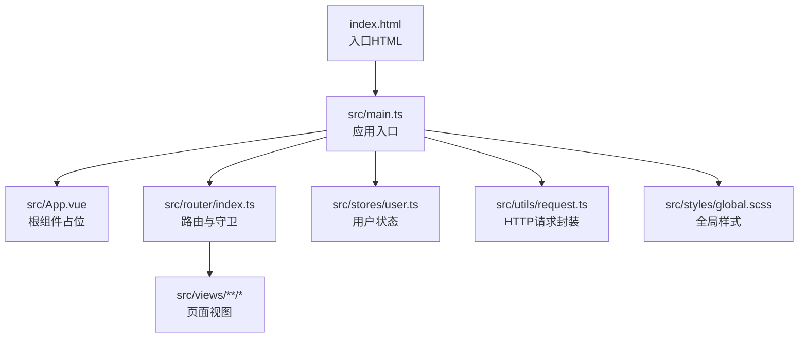
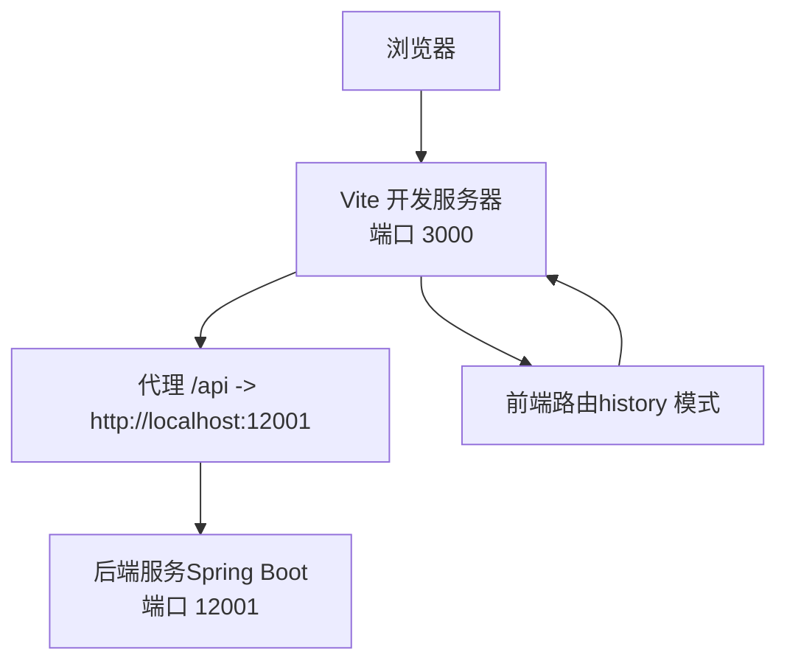
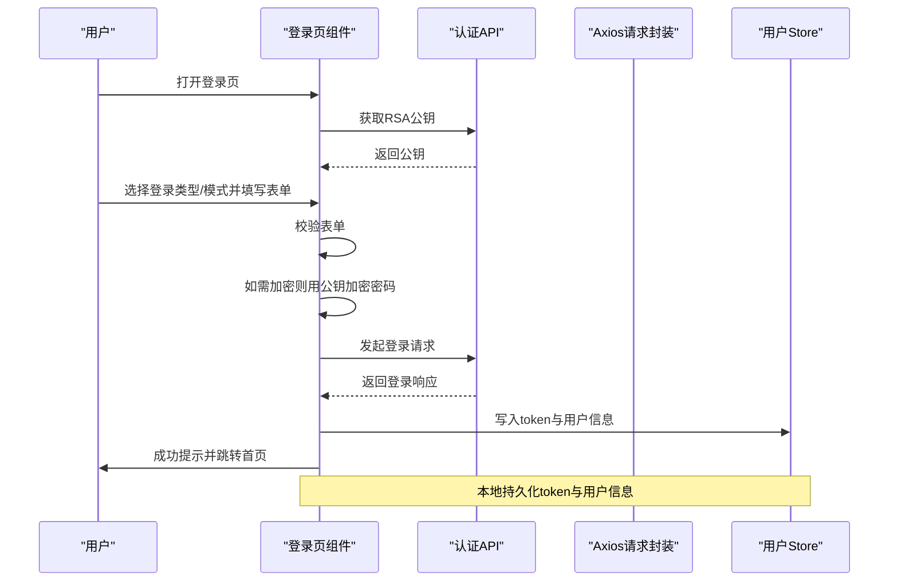

# 快速开始

<cite>
**本文引用的文件**
- [package.json](file://package.json)
- [vite.config.ts](file://vite.config.ts)
- [tsconfig.json](file://tsconfig.json)
- [index.html](file://index.html)
- [src/main.ts](file://src/main.ts)
- [src/router/index.ts](file://src/router/index.ts)
- [src/stores/user.ts](file://src/stores/user.ts)
- [src/utils/request.ts](file://src/utils/request.ts)
- [src/views/login/index.vue](file://src/views/login/index.vue)
- [src/types/index.ts](file://src/types/index.ts)
- [.eslintrc-auto-import.json](file://.eslintrc-auto-import.json)
- [默认模块.md](file://默认模块.md)
</cite>

## 目录
1. [简介](#简介)
2. [项目结构](#项目结构)
3. [核心组件](#核心组件)
4. [架构总览](#架构总览)
5. [详细组件分析](#详细组件分析)
6. [依赖分析](#依赖分析)
7. [性能考虑](#性能考虑)
8. [故障排查指南](#故障排查指南)
9. [结论](#结论)
10. [附录](#附录)

## 简介
本指南面向新加入的前端开发者，帮助你在最短时间内完成 HC 管理系统前端项目的本地环境准备、安装与启动，并掌握基本使用方法与常见问题处理。项目基于 Vue 3 + TypeScript + Vite 构建，采用 Pinia 进行状态管理，Element Plus 提供 UI 组件，Axios 封装统一请求层。

## 项目结构
项目采用典型的 Vue 3 单页应用结构，核心目录与职责如下：
- src：源代码目录
  - api：接口模块聚合与导出
  - layouts：布局组件
  - router：路由定义与鉴权守卫
  - stores：状态管理（Pinia）
  - styles：全局样式
  - types：TypeScript 类型定义
  - utils：工具函数与请求封装
  - views：页面视图
  - main.ts：应用入口
- public：静态资源
- 配置文件：package.json、vite.config.ts、tsconfig.json、index.html 等

图表来源
- [index.html:1-14](file://index.html#L1-L14)
- [src/main.ts:1-27](file://src/main.ts#L1-L27)
- [src/router/index.ts:1-127](file://src/router/index.ts#L1-L127)
- [src/stores/user.ts:1-152](file://src/stores/user.ts#L1-L152)
- [src/utils/request.ts:1-148](file://src/utils/request.ts#L1-L148)

章节来源
- [package.json:1-35](file://package.json#L1-L35)
- [vite.config.ts:1-46](file://vite.config.ts#L1-L46)
- [tsconfig.json:1-28](file://tsconfig.json#L1-L28)
- [index.html:1-14](file://index.html#L1-L14)

## 核心组件
- 应用入口与初始化
  - 在入口中注册 Pinia、路由、Element Plus，并从本地存储恢复用户状态。
- 路由与鉴权
  - 基于 meta 字段控制页面是否需要登录与权限；在进入受保护路由前校验 token 与用户权限。
- 状态管理
  - 使用 Pinia Store 管理 token、用户信息、权限与角色等；支持从 localStorage 初始化。
- 请求封装
  - 基于 Axios 创建实例，自动注入 Authorization 头；统一封装响应拦截与错误提示；支持刷新 token 的排队机制。
- 登录页
  - 支持 C/B/平台三类用户登录，密码/验证码两种模式；登录成功后持久化 token 与用户信息并跳转。

章节来源
- [src/main.ts:1-27](file://src/main.ts#L1-L27)
- [src/router/index.ts:82-124](file://src/router/index.ts#L82-L124)
- [src/stores/user.ts:7-151](file://src/stores/user.ts#L7-L151)
- [src/utils/request.ts:6-101](file://src/utils/request.ts#L6-L101)
- [src/views/login/index.vue:1-323](file://src/views/login/index.vue#L1-L323)

## 架构总览
下图展示了从浏览器到后端 API 的典型交互路径，以及本地开发代理配置。

图表来源
- [vite.config.ts:29-39](file://vite.config.ts#L29-L39)

章节来源
- [vite.config.ts:1-46](file://vite.config.ts#L1-L46)

## 详细组件分析

### 组件一：登录流程（用户态建立）
该流程涵盖 RSA 公钥获取、登录方式切换、表单校验、加密密码与登录请求，最终持久化用户信息并跳转。

图表来源
- [src/views/login/index.vue:147-158](file://src/views/login/index.vue#L147-L158)
- [src/views/login/index.vue:98-145](file://src/views/login/index.vue#L98-L145)
- [src/stores/user.ts:22-39](file://src/stores/user.ts#L22-L39)

章节来源
- [src/views/login/index.vue:1-323](file://src/views/login/index.vue#L1-L323)
- [src/stores/user.ts:1-152](file://src/stores/user.ts#L1-L152)

### 组件二：路由守卫与权限控制
路由守卫负责：
- 设置页面标题
- 校验登录态（token）
- 校验所需权限（基于 meta.permissions 与用户权限集合）

图表来源
- [src/router/index.ts:82-124](file://src/router/index.ts#L82-L124)

章节来源
- [src/router/index.ts:1-127](file://src/router/index.ts#L1-L127)

### 组件三：请求拦截与错误处理
请求封装统一处理：
- 自动注入 Authorization 头
- 统一响应状态码处理与消息提示
- 未登录/无权限等场景的引导处理

图表来源
- [src/utils/request.ts:37-101](file://src/utils/request.ts#L37-L101)

章节来源
- [src/utils/request.ts:1-148](file://src/utils/request.ts#L1-L148)

## 依赖分析
- 运行时依赖
  - Vue 3、Vue Router、Pinia、Element Plus、Axios、Day.js、JSEncrypt、Lodash-es
- 开发依赖
  - Vite、TypeScript、vue-tsc、@vitejs/plugin-vue、unplugin-auto-import、unplugin-vue-components、sass、@types/lodash-es
- 脚本命令
  - dev：启动开发服务器
  - build：类型检查 + 生产构建
  - preview：预览生产构建
  - lint：代码风格检查
  - type-check：仅类型检查

章节来源
- [package.json:13-33](file://package.json#L13-L33)

## 性能考虑
- 构建输出
  - 输出目录为 dist，关闭 Source Map，提升构建速度与产物体积可控性
  - 调整 chunkSizeWarningLimit 以避免大包告警
- 开发体验
  - Vite 提供快速冷启动与热更新
  - Element Plus 按需自动导入，减少打包体积
- 建议
  - 合理拆分路由级组件，利用动态导入
  - 对第三方库按需引入，避免全量引入

章节来源
- [vite.config.ts:40-44](file://vite.config.ts#L40-L44)
- [package.json:24-33](file://package.json#L24-L33)

## 故障排查指南
- 启动失败（端口占用）
  - 修改 vite.config.ts 中 server.port 或停止占用进程
- 跨域问题
  - 确认代理配置指向正确的后端地址；确保后端已启动
- 登录后无法访问受保护页面
  - 检查本地是否保存了有效 token；确认后端返回的用户权限是否包含页面所需权限
- 请求报错“登录已过期”
  - 前端会弹窗并清空本地 token，重新登录即可
- TypeScript 类型错误
  - 使用 type-check 命令定位类型问题；必要时补充类型定义
- ESLint/Auto Import 提示
  - 可根据 .eslintrc-auto-import.json 中的全局声明修正未识别的全局变量

章节来源
- [vite.config.ts:29-39](file://vite.config.ts#L29-L39)
- [src/utils/request.ts:20-35](file://src/utils/request.ts#L20-L35)
- [src/router/index.ts:82-124](file://src/router/index.ts#L82-L124)
- [.eslintrc-auto-import.json:1-94](file://.eslintrc-auto-import.json#L1-L94)

## 结论
通过本指南，你可以在本地快速搭建并运行 HC 管理系统前端项目。建议先完成环境准备与依赖安装，再启动开发服务器进行功能验证。后续可结合默认模块文档对接后端接口，完善登录与权限体系。

## 附录

### 环境要求
- Node.js 版本：建议使用 LTS 版本（如 18.x 或 20.x），以获得最佳兼容性与性能
- 包管理器：推荐使用 npm 9+ 或 pnpm 8+，确保与项目脚本兼容
- TypeScript：项目内置类型检查脚本，建议在编辑器中启用 TS 支持

章节来源
- [package.json:6-12](file://package.json#L6-L12)
- [tsconfig.json:1-28](file://tsconfig.json#L1-L28)

### 安装步骤
- 克隆项目
  - 使用 Git 将仓库克隆至本地
- 安装依赖
  - 在项目根目录执行依赖安装命令
- 启动开发服务器
  - 执行开发命令，浏览器自动打开
- 生成生产构建
  - 执行构建命令，产物位于 dist 目录
- 预览生产构建
  - 执行预览命令，可在本地查看生产效果

章节来源
- [package.json:6-12](file://package.json#L6-L12)
- [vite.config.ts:8-10](file://vite.config.ts#L8-L10)

### 环境变量与代理
- 环境变量
  - 前端通过 import.meta.env.VITE_API_BASE_URL 控制基础路径，默认使用 /api
- 代理配置
  - 本地开发时，/api 前缀请求会被代理到后端服务地址

章节来源
- [src/utils/request.ts:6](file://src/utils/request.ts#L6)
- [vite.config.ts:33-37](file://vite.config.ts#L33-L37)

### 基本使用示例
- 登录
  - 在登录页选择用户类型与登录方式，填写表单并提交
  - 登录成功后，token 与用户信息会持久化到本地存储
- 访问受保护页面
  - 若未登录，将被重定向到登录页；若无权限，将被重定向到首页
- 切换身份
  - 参考默认模块文档中的身份相关接口，按需扩展登录后的身份选择逻辑

章节来源
- [src/views/login/index.vue:98-145](file://src/views/login/index.vue#L98-L145)
- [src/router/index.ts:82-124](file://src/router/index.ts#L82-L124)
- [默认模块.md:1-800](file://默认模块.md#L1-L800)

### 常见问题与解决方案
- 无法访问受保护页面
  - 检查本地 token 是否存在；确认后端返回的用户权限集合是否包含页面所需权限
- 请求频繁失败
  - 检查代理配置与后端服务状态；关注网络错误提示
- 编辑器提示未识别的全局变量
  - 参考 .eslintrc-auto-import.json 中的全局声明修正

章节来源
- [src/router/index.ts:82-124](file://src/router/index.ts#L82-L124)
- [src/utils/request.ts:70-101](file://src/utils/request.ts#L70-L101)
- [.eslintrc-auto-import.json:1-94](file://.eslintrc-auto-import.json#L1-L94)

### 开发工具与 IDE 配置建议
- 推荐编辑器：VS Code
- 插件建议：
  - Vue Language Features (Volar)：提供 Vue 3 语法高亮与类型支持
  - ESLint：统一代码风格，结合 lint 脚本使用
  - Prettier：格式化代码
  - Sass/SCSS IntelliSense：增强 SCSS 编写体验
- TypeScript 支持
  - 确保编辑器启用 TS 语言服务；使用 type-check 命令辅助定位类型问题
- Vite 配置
  - 可根据团队规范调整别名、插件与代理规则

章节来源
- [tsconfig.json:18-21](file://tsconfig.json#L18-L21)
- [package.json:24-33](file://package.json#L24-L33)
- [vite.config.ts:8-23](file://vite.config.ts#L8-L23)