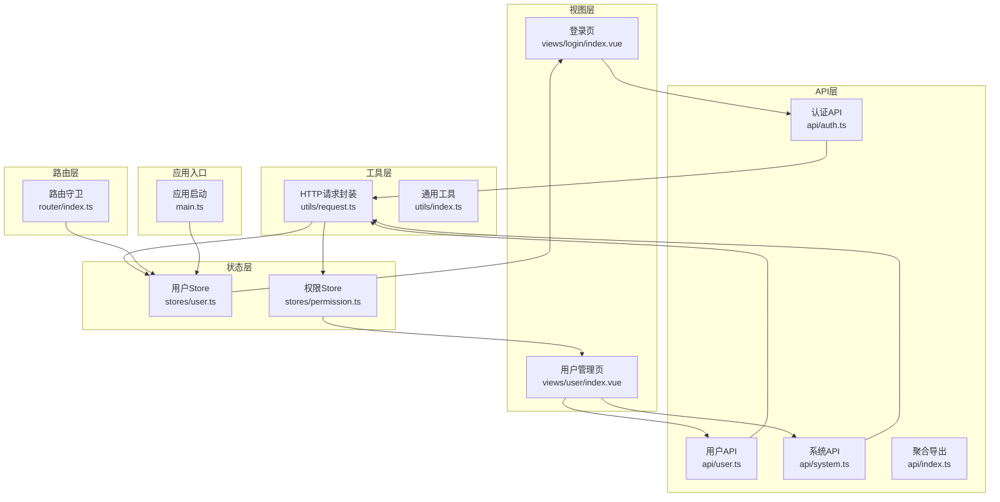
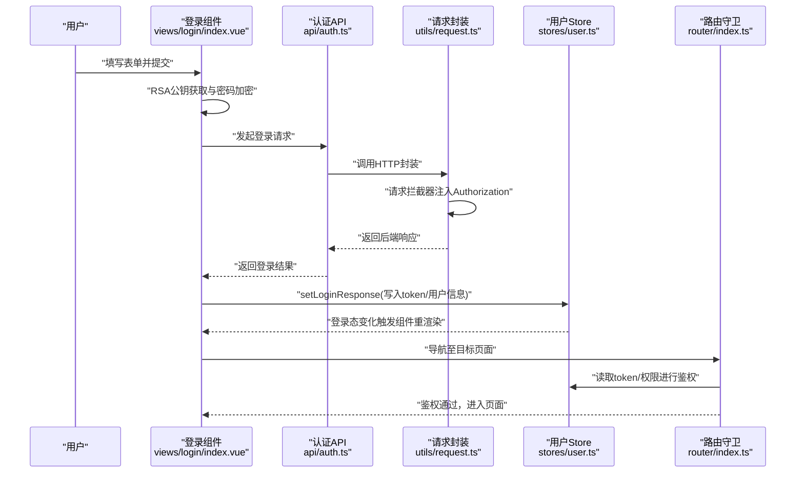
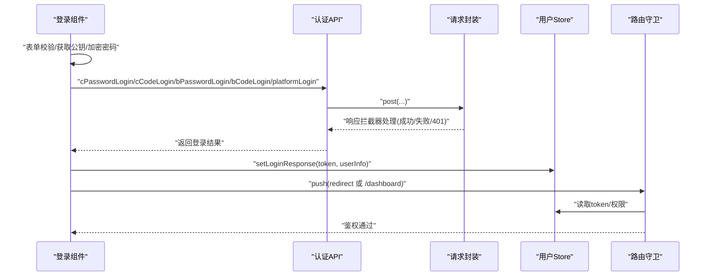
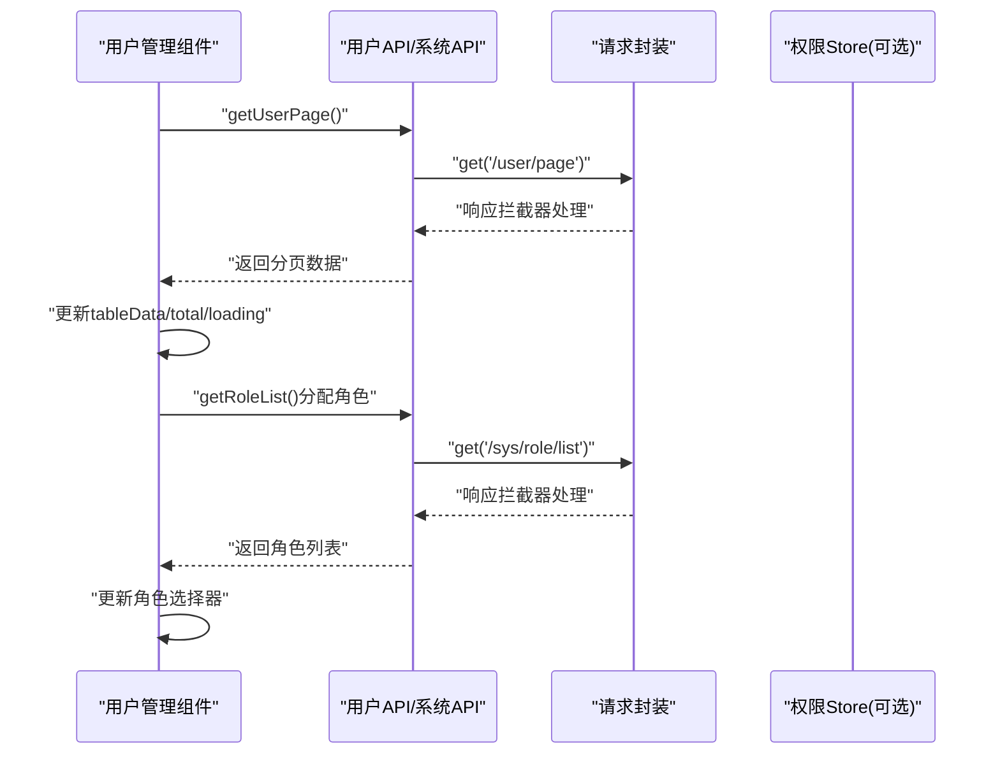
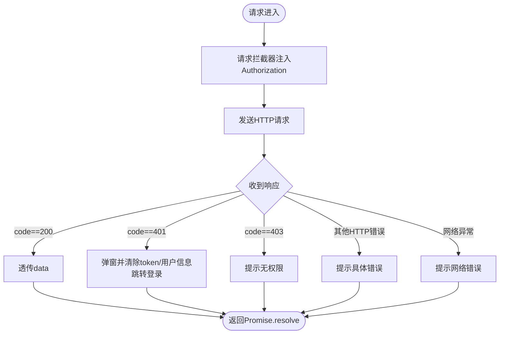
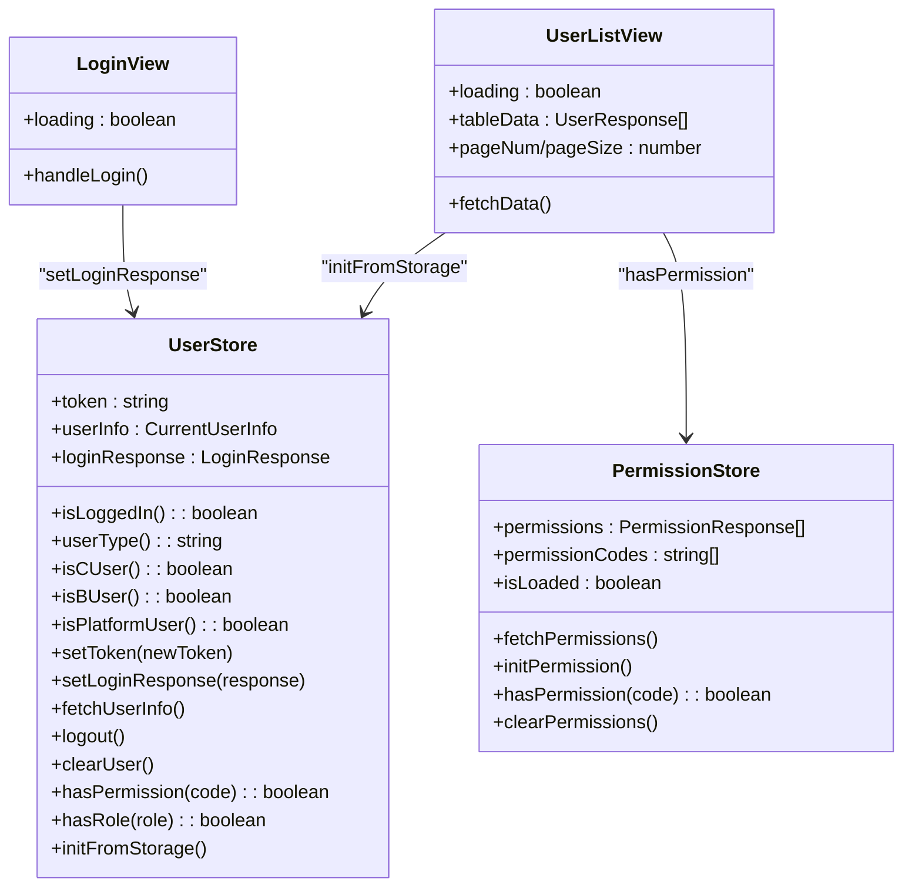
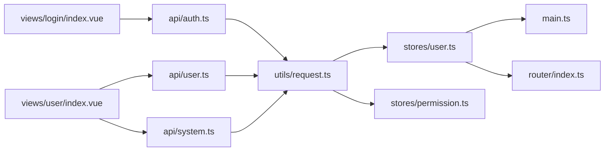

# 数据流设计

<cite>
**本文引用的文件**
- [src/main.ts](file://src/main.ts)
- [src/utils/request.ts](file://src/utils/request.ts)
- [src/api/index.ts](file://src/api/index.ts)
- [src/api/auth.ts](file://src/api/auth.ts)
- [src/api/user.ts](file://src/api/user.ts)
- [src/api/system.ts](file://src/api/system.ts)
- [src/stores/index.ts](file://src/stores/index.ts)
- [src/stores/user.ts](file://src/stores/user.ts)
- [src/stores/permission.ts](file://src/stores/permission.ts)
- [src/router/index.ts](file://src/router/index.ts)
- [src/views/login/index.vue](file://src/views/login/index.vue)
- [src/views/user/index.vue](file://src/views/user/index.vue)
- [src/types/index.ts](file://src/types/index.ts)
- [src/types/api.d.ts](file://src/types/api.d.ts)
- [src/utils/index.ts](file://src/utils/index.ts)
</cite>

## 目录
1. [引言](#引言)
2. [项目结构](#项目结构)
3. [核心组件](#核心组件)
4. [架构总览](#架构总览)
5. [详细组件分析](#详细组件分析)
6. [依赖关系分析](#依赖关系分析)
7. [性能考量](#性能考量)
8. [故障排查指南](#故障排查指南)
9. [结论](#结论)
10. [附录](#附录)

## 引言
本文件面向HC管理系统，系统性梳理从前端组件到后端服务的完整数据流设计，覆盖以下要点：
- 用户操作触发组件事件，组件调用API层，API层经HTTP请求与后端交互，后端响应返回API层，API层更新Pinia Store，Store驱动组件重新渲染。
- 关键节点：请求拦截器、响应拦截器、状态更新机制。
- 异步处理：Promise链式调用、错误处理策略、Loading状态管理。
- 数据缓存策略与性能优化建议。

## 项目结构
前端采用Vite + Vue 3 + TypeScript + Pinia + Element Plus 架构，按功能域组织：
- 视图层：views 下按业务模块划分页面组件。
- 路由层：router 管理页面路由与鉴权守卫。
- API层：api 目录封装各业务模块接口方法。
- 工具层：utils 提供请求封装、加密、格式化等工具。
- 状态层：stores 使用 Pinia 定义用户态与权限态。
- 类型定义：types 统一后端返回结构与请求载荷类型。

图表来源
- [src/views/login/index.vue:1-323](file://src/views/login/index.vue#L1-L323)
- [src/views/user/index.vue:1-361](file://src/views/user/index.vue#L1-L361)
- [src/router/index.ts:1-127](file://src/router/index.ts#L1-L127)
- [src/api/auth.ts:1-69](file://src/api/auth.ts#L1-L69)
- [src/api/user.ts:1-59](file://src/api/user.ts#L1-L59)
- [src/api/system.ts:1-56](file://src/api/system.ts#L1-L56)
- [src/api/index.ts:1-7](file://src/api/index.ts#L1-L7)
- [src/utils/request.ts:1-148](file://src/utils/request.ts#L1-L148)
- [src/stores/user.ts:1-152](file://src/stores/user.ts#L1-L152)
- [src/stores/permission.ts:1-56](file://src/stores/permission.ts#L1-L56)
- [src/main.ts:1-27](file://src/main.ts#L1-L27)

章节来源
- [src/main.ts:1-27](file://src/main.ts#L1-L27)
- [src/router/index.ts:1-127](file://src/router/index.ts#L1-L127)
- [src/api/index.ts:1-7](file://src/api/index.ts#L1-L7)

## 核心组件
- 应用入口与全局初始化
  - 创建应用实例、注册插件、挂载Pinia与路由；启动时从本地存储恢复用户状态。
- 请求封装与拦截器
  - 基于Axios封装实例，统一设置基础URL、超时、凭证与请求头；实现请求/响应拦截器，集中处理鉴权、权限、错误提示与登录过期处理。
- API模块
  - 按业务拆分：认证、用户、系统、日志、企业、通用等；每个模块导出函数，内部复用请求封装。
- 状态管理
  - 用户Store：维护token、登录响应、当前用户信息、登录态计算属性、权限/角色查询、本地持久化与清理。
  - 权限Store：维护权限列表、权限码集合、加载状态、初始化缓存能力。
- 路由守卫
  - 标题动态设置、登录态校验、权限校验（基于本地存储的用户权限），未登录跳转登录页，有权限才放行。
- 视图组件
  - 登录页：表单校验、RSA公钥获取与密码加密、多种登录方式、Loading状态管理。
  - 用户管理页：分页查询、新增/编辑/删除、角色分配、Loading与消息提示。

章节来源
- [src/main.ts:1-27](file://src/main.ts#L1-L27)
- [src/utils/request.ts:1-148](file://src/utils/request.ts#L1-L148)
- [src/api/auth.ts:1-69](file://src/api/auth.ts#L1-L69)
- [src/api/user.ts:1-59](file://src/api/user.ts#L1-L59)
- [src/api/system.ts:1-56](file://src/api/system.ts#L1-L56)
- [src/stores/user.ts:1-152](file://src/stores/user.ts#L1-L152)
- [src/stores/permission.ts:1-56](file://src/stores/permission.ts#L1-L56)
- [src/router/index.ts:1-127](file://src/router/index.ts#L1-L127)
- [src/views/login/index.vue:1-323](file://src/views/login/index.vue#L1-L323)
- [src/views/user/index.vue:1-361](file://src/views/user/index.vue#L1-L361)

## 架构总览
下图展示一次典型“登录”到“用户列表”的端到端数据流，涵盖组件事件、API层、HTTP请求、后端响应、状态更新与UI渲染。

图表来源
- [src/views/login/index.vue:98-145](file://src/views/login/index.vue#L98-L145)
- [src/api/auth.ts:26-68](file://src/api/auth.ts#L26-L68)
- [src/utils/request.ts:37-101](file://src/utils/request.ts#L37-L101)
- [src/stores/user.ts:22-40](file://src/stores/user.ts#L22-L40)
- [src/router/index.ts:82-124](file://src/router/index.ts#L82-L124)

## 详细组件分析

### 组件到API的数据流（登录）
- 事件触发：登录页组件监听表单提交，执行表单校验、获取RSA公钥、加密密码。
- API调用：根据登录类型与模式选择对应登录接口，调用认证API。
- 状态更新：登录成功后调用用户Store的setLoginResponse，写入token与用户信息，并持久化到本地存储。
- 页面跳转：根据redirect参数或默认路径跳转，路由守卫根据token与权限决定是否放行。

图表来源
- [src/views/login/index.vue:98-145](file://src/views/login/index.vue#L98-L145)
- [src/api/auth.ts:26-68](file://src/api/auth.ts#L26-L68)
- [src/utils/request.ts:50-101](file://src/utils/request.ts#L50-L101)
- [src/stores/user.ts:22-40](file://src/stores/user.ts#L22-L40)
- [src/router/index.ts:82-124](file://src/router/index.ts#L82-L124)

章节来源
- [src/views/login/index.vue:98-145](file://src/views/login/index.vue#L98-L145)
- [src/api/auth.ts:26-68](file://src/api/auth.ts#L26-L68)
- [src/stores/user.ts:22-40](file://src/stores/user.ts#L22-L40)
- [src/router/index.ts:82-124](file://src/router/index.ts#L82-L124)

### 组件到API的数据流（用户列表）
- 事件触发：用户管理页mounted后自动拉取数据；分页变更、搜索重置、新增/编辑/删除均触发重新拉取。
- API调用：调用用户API的分页查询接口，同时在“分配角色”场景调用系统API的角色列表接口。
- 状态更新：API返回后，组件内局部状态更新（表格数据、总数、Loading），同时可结合Store进行跨页面共享。
- UI渲染：Element Plus的表格与分页组件绑定响应式数据，自动刷新显示。

图表来源
- [src/views/user/index.vue:45-200](file://src/views/user/index.vue#L45-L200)
- [src/api/user.ts:18-26](file://src/api/user.ts#L18-L26)
- [src/api/system.ts:9-11](file://src/api/system.ts#L9-L11)
- [src/utils/request.ts:50-101](file://src/utils/request.ts#L50-L101)

章节来源
- [src/views/user/index.vue:45-200](file://src/views/user/index.vue#L45-L200)
- [src/api/user.ts:18-26](file://src/api/user.ts#L18-L26)
- [src/api/system.ts:9-11](file://src/api/system.ts#L9-L11)

### 请求拦截器与响应拦截器
- 请求拦截器
  - 自动从本地存储读取token并注入到Authorization头。
  - 可扩展：统一注入traceId、版本号、语言等。
- 响应拦截器
  - 成功：当code为200时透传data；否则统一错误提示并reject。
  - 401：弹出确认框，清除本地token与用户信息，跳转登录页。
  - 403：提示无权限。
  - 其他HTTP错误：根据状态码提示网络/服务器/参数错误。
  - 网络异常：提示网络连接失败。

图表来源
- [src/utils/request.ts:37-101](file://src/utils/request.ts#L37-L101)

章节来源
- [src/utils/request.ts:37-101](file://src/utils/request.ts#L37-L101)

### 状态更新机制与组件渲染
- 用户Store
  - 写入：setLoginResponse写入token与用户信息，并持久化到localStorage。
  - 读取：initFromStorage从localStorage恢复token与用户信息；isLoggedIn、userType、isCUser/isBUser/isPlatformUser等计算属性驱动UI。
  - 清理：logout调用后端登出接口并清空本地存储与Store。
- 权限Store
  - 写入：fetchPermissions从后端拉取权限列表并转换为权限码数组；initPermission调用后端初始化缓存接口。
  - 读取：hasPermission用于组件权限控制；isLoaded用于控制是否已加载。
- 组件渲染
  - 登录页：loading与按钮状态绑定，成功后导航。
  - 用户管理页：v-loading绑定组件内部loading，表格数据与分页参数双向绑定。

图表来源
- [src/stores/user.ts:7-151](file://src/stores/user.ts#L7-L151)
- [src/stores/permission.ts:7-55](file://src/stores/permission.ts#L7-L55)
- [src/views/login/index.vue:98-145](file://src/views/login/index.vue#L98-L145)
- [src/views/user/index.vue:45-200](file://src/views/user/index.vue#L45-L200)

章节来源
- [src/stores/user.ts:7-151](file://src/stores/user.ts#L7-L151)
- [src/stores/permission.ts:7-55](file://src/stores/permission.ts#L7-L55)
- [src/views/login/index.vue:98-145](file://src/views/login/index.vue#L98-L145)
- [src/views/user/index.vue:45-200](file://src/views/user/index.vue#L45-L200)

### 异步数据处理与Loading管理
- Promise链式调用
  - 所有API方法返回Promise，组件中通过await顺序等待结果，错误通过catch捕获。
- 错误处理策略
  - 组件内：try/catch包裹API调用，finally中关闭loading或隐藏弹窗。
  - 请求层：响应拦截器统一处理401/403/网络异常，避免分散处理。
- Loading状态管理
  - 登录页：登录按钮loading与发送验证码倒计时。
  - 用户管理页：表格v-loading、分配角色弹窗loading、表单提交loading。
  - 建议：在请求封装中支持可选loading开关，组件仅负责UI状态，减少重复逻辑。

章节来源
- [src/views/login/index.vue:75-96](file://src/views/login/index.vue#L75-L96)
- [src/views/login/index.vue:98-145](file://src/views/login/index.vue#L98-L145)
- [src/views/user/index.vue:45-136](file://src/views/user/index.vue#L45-L136)
- [src/utils/request.ts:103-148](file://src/utils/request.ts#L103-L148)

### 数据缓存策略
- 本地存储
  - 用户Store在setLoginResponse与fetchUserInfo后，将token与用户信息写入localStorage，应用启动时initFromStorage恢复。
  - 路由守卫在鉴权时读取localStorage中的用户权限，实现轻量缓存。
- 后端缓存
  - 权限Store提供initPermission接口，调用后端初始化权限缓存，提升后续权限校验效率。
- 建议
  - 对高频读取且不频繁变化的数据（如权限列表）可在Store层增加内存缓存与失效策略。
  - 对分页数据可按查询条件+页码做简单LRU缓存，减少重复请求。

章节来源
- [src/stores/user.ts:90-127](file://src/stores/user.ts#L90-L127)
- [src/router/index.ts:96-115](file://src/router/index.ts#L96-L115)
- [src/stores/permission.ts:26-34](file://src/stores/permission.ts#L26-L34)

## 依赖关系分析
- 组件依赖API层，API层依赖请求封装，请求封装依赖Axios与拦截器。
- Store在应用启动时从localStorage恢复状态，组件渲染依赖Store状态。
- 路由守卫依赖Store提供的登录态与权限信息，实现全局鉴权。
- 类型定义贯穿API、Store、组件，保证前后端契约一致。

图表来源
- [src/views/login/index.vue:1-323](file://src/views/login/index.vue#L1-L323)
- [src/views/user/index.vue:1-361](file://src/views/user/index.vue#L1-L361)
- [src/api/auth.ts:1-69](file://src/api/auth.ts#L1-L69)
- [src/api/user.ts:1-59](file://src/api/user.ts#L1-L59)
- [src/api/system.ts:1-56](file://src/api/system.ts#L1-L56)
- [src/utils/request.ts:1-148](file://src/utils/request.ts#L1-L148)
- [src/stores/user.ts:1-152](file://src/stores/user.ts#L1-L152)
- [src/stores/permission.ts:1-56](file://src/stores/permission.ts#L1-L56)
- [src/main.ts:1-27](file://src/main.ts#L1-L27)
- [src/router/index.ts:1-127](file://src/router/index.ts#L1-L127)

章节来源
- [src/api/index.ts:1-7](file://src/api/index.ts#L1-L7)
- [src/types/index.ts:1-188](file://src/types/index.ts#L1-L188)
- [src/types/api.d.ts:1-156](file://src/types/api.d.ts#L1-L156)

## 性能考量
- 网络层
  - 统一超时与凭证配置，避免重复握手；在请求封装中支持loading开关，减少组件重复逻辑。
- 计算层
  - Store中使用computed派生登录态与身份类型，避免重复计算。
- UI层
  - 表格与分页组件使用v-loading与受控参数，避免不必要的重排。
- 缓存层
  - 本地存储与后端缓存结合；对权限列表与角色列表增加内存缓存与失效策略。
- 工具层
  - 提供防抖与节流工具，适用于高频输入或滚动场景（非本项目主流程，但可复用）。

## 故障排查指南
- 登录后仍被重定向到登录页
  - 检查路由守卫是否正确读取localStorage中的token与用户信息。
  - 确认用户Store是否成功setLoginResponse并持久化。
- 401未授权
  - 响应拦截器会弹窗并清除token与用户信息；检查后端是否正确颁发token，以及请求头Authorization是否注入。
- 403无权限
  - 检查当前用户权限列表与所需权限是否匹配；必要时调用权限初始化接口。
- 网络错误
  - 检查基础URL、代理配置与跨域设置；确认浏览器网络面板无CORS/证书问题。
- 加载状态异常
  - 确保组件在finally中关闭loading；避免多处并发请求导致状态错乱。

章节来源
- [src/router/index.ts:82-124](file://src/router/index.ts#L82-L124)
- [src/utils/request.ts:50-101](file://src/utils/request.ts#L50-L101)
- [src/stores/user.ts:62-80](file://src/stores/user.ts#L62-L80)
- [src/stores/permission.ts:26-34](file://src/stores/permission.ts#L26-L34)

## 结论
本系统以“组件-API-请求封装-Store-路由守卫”为主线构建了清晰的数据流：组件通过API层发起异步请求，请求封装统一处理鉴权与错误，Store负责状态持久化与派生计算，路由守卫保障访问安全。通过本地存储与后端缓存相结合，既保证用户体验又降低后端压力。建议在请求封装中进一步标准化loading与错误处理，增强可维护性与一致性。

## 附录
- 类型定义概览
  - 响应体：统一包含code、message、data、timestamp、path。
  - 分页结果：包含list、total、pageNum、pageSize、totalPage、hasNext。
  - 登录响应：包含token、userType、cUserInfo/bUserInfo、identityList等。
  - 当前用户信息：包含userType、roles、permissions及两类用户信息。
  - 角色/权限/企业/用户等业务实体类型。

章节来源
- [src/types/index.ts:1-188](file://src/types/index.ts#L1-L188)
- [src/types/api.d.ts:1-156](file://src/types/api.d.ts#L1-L156)