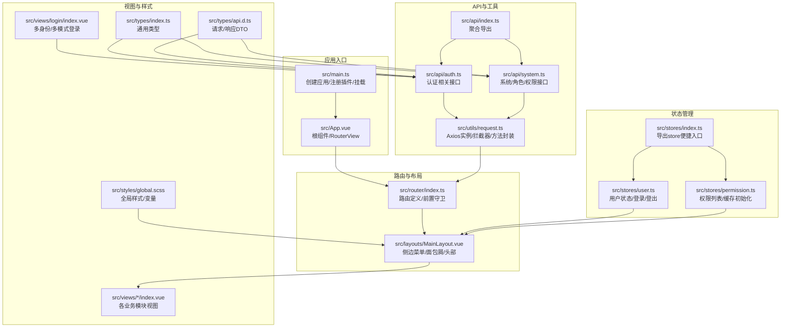
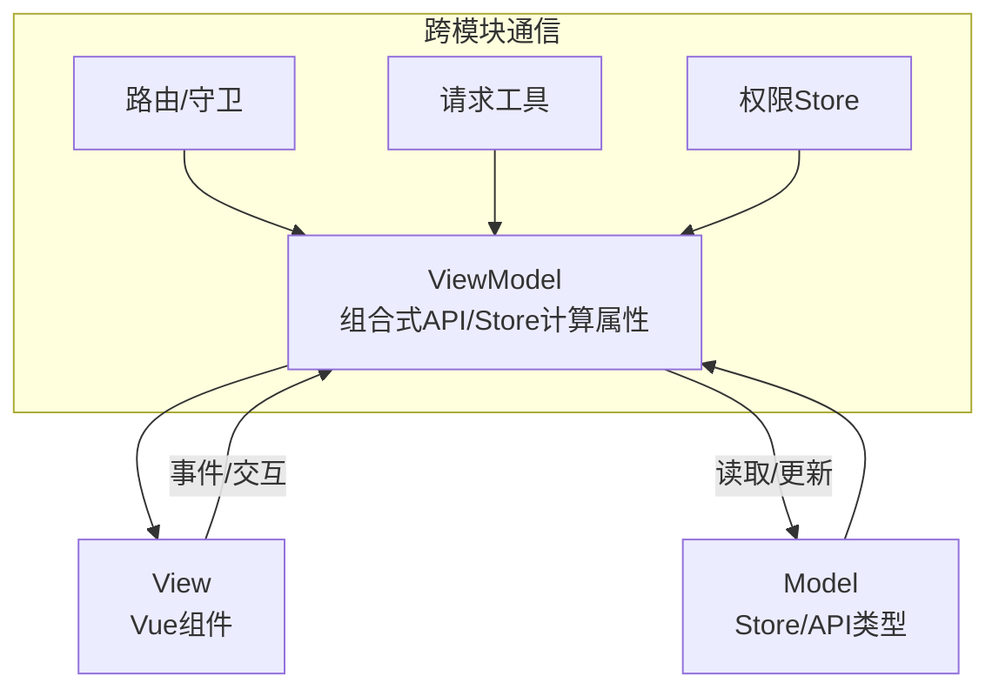
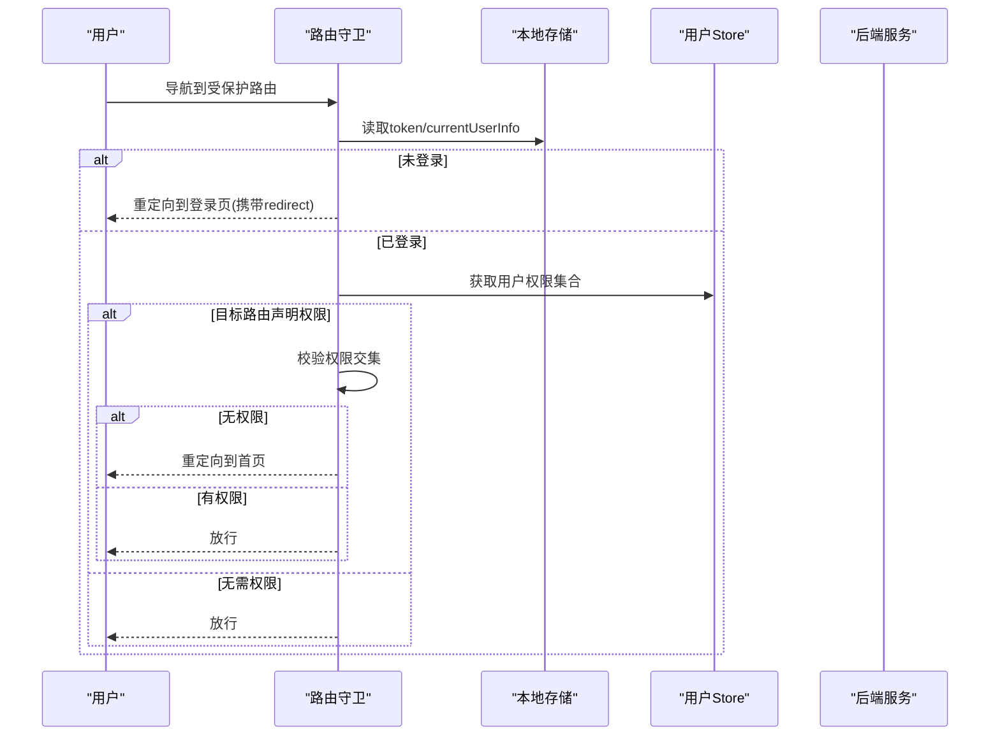
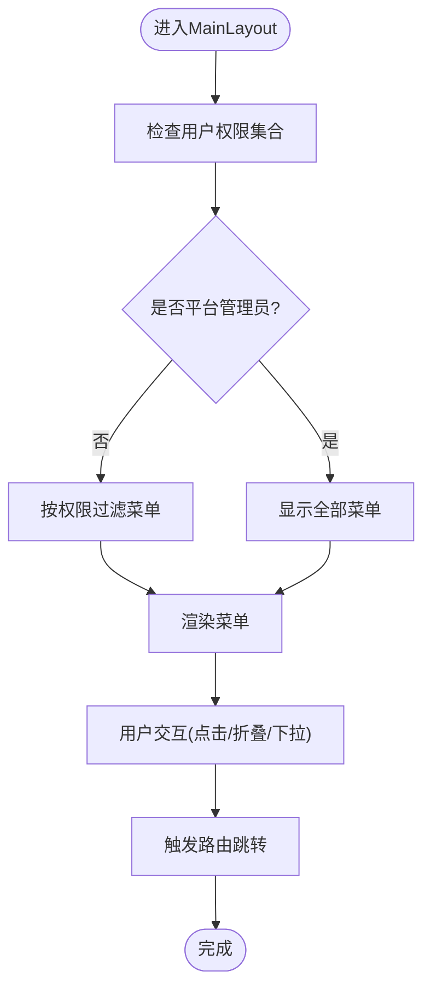
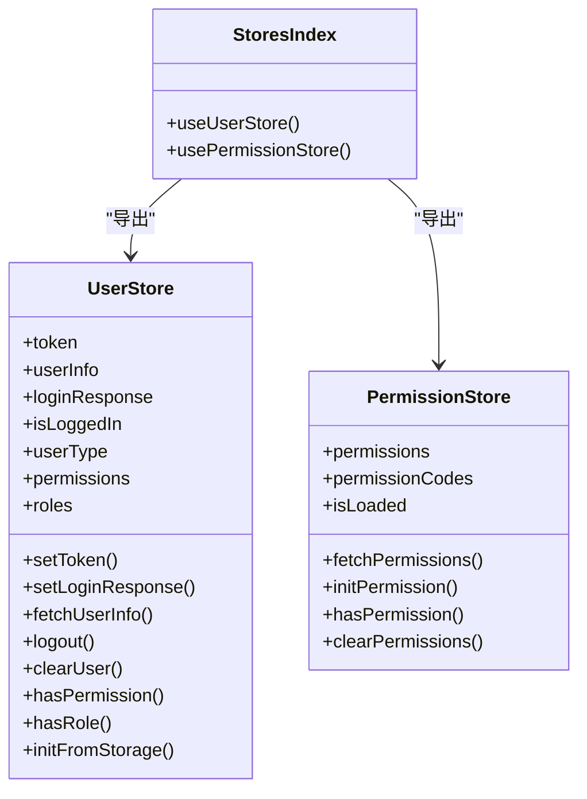
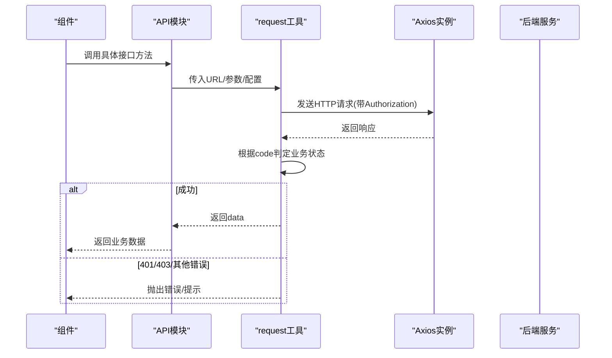
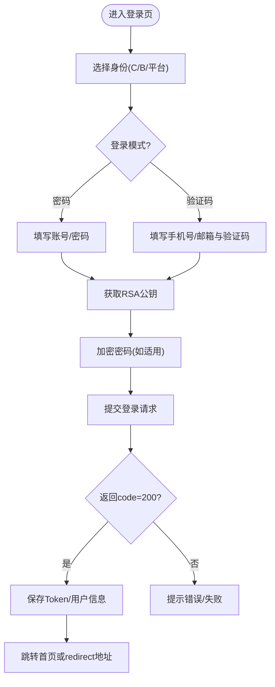
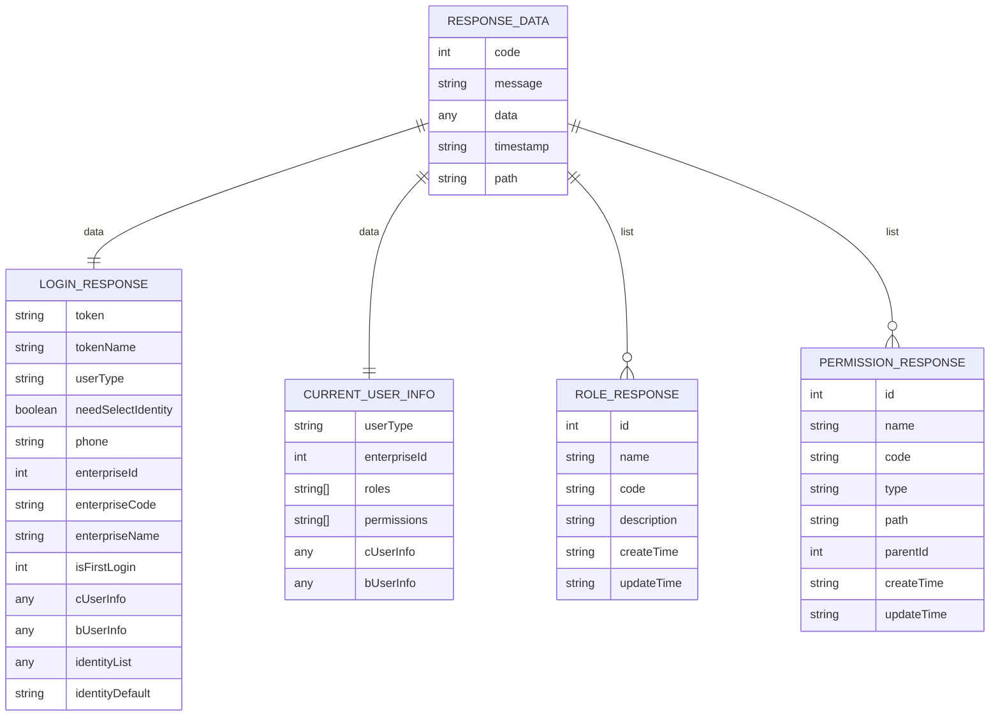
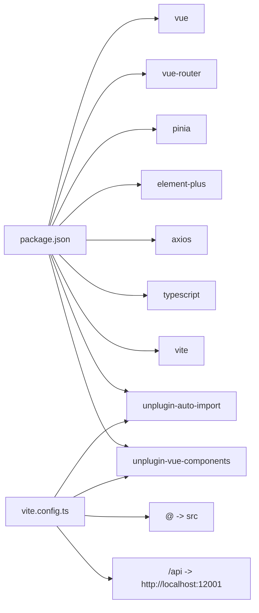

# 架构设计

<cite>
**本文引用的文件**   
- [src/main.ts](file://src/main.ts)
- [src/App.vue](file://src/App.vue)
- [src/router/index.ts](file://src/router/index.ts)
- [src/layouts/MainLayout.vue](file://src/layouts/MainLayout.vue)
- [src/stores/index.ts](file://src/stores/index.ts)
- [src/stores/user.ts](file://src/stores/user.ts)
- [src/stores/permission.ts](file://src/stores/permission.ts)
- [src/utils/request.ts](file://src/utils/request.ts)
- [src/api/index.ts](file://src/api/index.ts)
- [src/api/auth.ts](file://src/api/auth.ts)
- [src/api/system.ts](file://src/api/system.ts)
- [src/views/login/index.vue](file://src/views/login/index.vue)
- [src/types/index.ts](file://src/types/index.ts)
- [src/types/api.d.ts](file://src/types/api.d.ts)
- [src/styles/global.scss](file://src/styles/global.scss)
- [vite.config.ts](file://vite.config.ts)
- [package.json](file://package.json)
</cite>

## 目录
1. [引言](#引言)
2. [项目结构](#项目结构)
3. [核心组件](#核心组件)
4. [架构总览](#架构总览)
5. [详细组件分析](#详细组件分析)
6. [依赖分析](#依赖分析)
7. [性能考量](#性能考量)
8. [故障排查指南](#故障排查指南)
9. [结论](#结论)
10. [附录](#附录)

## 引言
本架构设计文档面向“HC管理系统”前端工程，目标是系统化阐述整体架构模式（MVVM、组件化、模块化）、目录结构设计原则与职责划分、核心设计理念（响应式布局、权限控制、状态管理、API 通信）、系统边界与组件交互关系、数据流向、技术选型与架构权衡、跨模块通信机制、状态管理模式与路由设计策略，并给出架构演进路线与扩展性建议。文档以仓库现有实现为依据，结合源码路径进行说明，帮助开发者快速理解与迭代系统。

## 项目结构
系统采用基于 Vue 3 的单页应用（SPA）架构，遵循“视图层（Views）+ 布局层（Layouts）+ 路由（Router）+ 状态（Stores）+ API 封装（API Utils）+ 类型定义（Types）+ 样式（Styles）+ 构建配置（Vite）”的分层组织方式。模块化与组件化体现在：
- 视图与功能模块分离：views 下按业务域划分（如 user、enterprise、role、permission、log、dashboard、profile、login）
- 布局与导航：MainLayout 提供统一侧边栏、面包屑与头部用户信息
- 状态管理：Pinia Store 按领域拆分（用户、权限）
- API 与工具：API 层封装接口，request 工具统一封装 HTTP 请求与拦截器
- 类型体系：统一的 ResponseData 与业务实体类型定义
- 构建与自动导入：Vite 配置 + 自动导入与组件解析，提升开发效率

图表来源
- [src/main.ts:1-27](file://src/main.ts#L1-L27)
- [src/App.vue:1-10](file://src/App.vue#L1-L10)
- [src/router/index.ts:1-127](file://src/router/index.ts#L1-L127)
- [src/layouts/MainLayout.vue:1-281](file://src/layouts/MainLayout.vue#L1-L281)
- [src/stores/user.ts:1-152](file://src/stores/user.ts#L1-L152)
- [src/stores/permission.ts:1-56](file://src/stores/permission.ts#L1-L56)
- [src/stores/index.ts:1-3](file://src/stores/index.ts#L1-L3)
- [src/utils/request.ts:1-148](file://src/utils/request.ts#L1-L148)
- [src/api/index.ts:1-7](file://src/api/index.ts#L1-L7)
- [src/api/auth.ts:1-69](file://src/api/auth.ts#L1-L69)
- [src/api/system.ts:1-56](file://src/api/system.ts#L1-L56)
- [src/views/login/index.vue:1-323](file://src/views/login/index.vue#L1-L323)
- [src/types/index.ts:1-188](file://src/types/index.ts#L1-L188)
- [src/types/api.d.ts:1-156](file://src/types/api.d.ts#L1-L156)
- [src/styles/global.scss:1-131](file://src/styles/global.scss#L1-L131)

章节来源
- [src/main.ts:1-27](file://src/main.ts#L1-L27)
- [src/router/index.ts:1-127](file://src/router/index.ts#L1-L127)
- [vite.config.ts:1-46](file://vite.config.ts#L1-L46)

## 核心组件
- 应用入口与插件注册：创建 Vue 应用、安装 Pinia、路由、Element Plus；注册图标组件；从本地存储恢复用户状态并挂载。
- 路由与权限守卫：定义路由表与元信息（标题、是否需要认证、所需权限），在前置守卫中校验 Token、权限与登录态，动态设置页面标题。
- 布局与导航：MainLayout 统一侧边菜单、面包屑、头部用户信息；根据用户类型与权限动态渲染菜单项；支持折叠与切换。
- 状态管理：用户 Store 管理 Token、用户信息、登录响应、权限与角色；权限 Store 管理权限列表、权限码集合与缓存初始化；提供工具函数判断权限与角色。
- API 与请求封装：request 工具封装 Axios 实例，统一处理请求头（携带 Authorization）、响应体（业务 code 判定）、错误提示与登录过期处理；提供 get/post/put/del 等便捷方法。
- 类型体系：统一的 ResponseData 与业务实体类型，以及 API 请求/响应 DTO，确保前后端契约清晰。
- 视图层：login 页面支持多身份（C/B/平台）与多登录模式（密码/验证码），调用认证 API 并更新用户状态；其他模块视图按需引入 Store 与 API。

章节来源
- [src/main.ts:1-27](file://src/main.ts#L1-L27)
- [src/router/index.ts:1-127](file://src/router/index.ts#L1-L127)
- [src/layouts/MainLayout.vue:1-281](file://src/layouts/MainLayout.vue#L1-L281)
- [src/stores/user.ts:1-152](file://src/stores/user.ts#L1-L152)
- [src/stores/permission.ts:1-56](file://src/stores/permission.ts#L1-L56)
- [src/utils/request.ts:1-148](file://src/utils/request.ts#L1-L148)
- [src/api/auth.ts:1-69](file://src/api/auth.ts#L1-L69)
- [src/api/system.ts:1-56](file://src/api/system.ts#L1-L56)
- [src/views/login/index.vue:1-323](file://src/views/login/index.vue#L1-L323)
- [src/types/index.ts:1-188](file://src/types/index.ts#L1-L188)
- [src/types/api.d.ts:1-156](file://src/types/api.d.ts#L1-L156)

## 架构总览
系统采用 MVVM 架构风格：
- Model：Pinia Store（用户、权限）与 API 接口模型（类型定义）
- View：Vue 单文件组件（views、layouts）
- ViewModel：组合式 API 与 Store 计算属性/方法，驱动视图渲染与交互

模块化与组件化体现在：
- 功能模块：views 下按业务域划分，每个模块独立维护其视图与逻辑
- 布局模块：MainLayout 提供统一布局与导航
- 状态模块：stores 下按领域拆分，职责单一
- 工具模块：utils 下封装 HTTP 请求与通用工具
- 类型模块：types 下集中定义类型契约

图表来源
- [src/stores/user.ts:1-152](file://src/stores/user.ts#L1-L152)
- [src/stores/permission.ts:1-56](file://src/stores/permission.ts#L1-L56)
- [src/utils/request.ts:1-148](file://src/utils/request.ts#L1-L148)
- [src/router/index.ts:1-127](file://src/router/index.ts#L1-L127)

## 详细组件分析

### 路由与权限控制
- 路由定义：使用 vue-router 定义嵌套路由，根路径指向 MainLayout，子路由覆盖 dashboard、user、enterprise、role、permission、log、profile 等；未匹配路径跳转到 404。
- 权限守卫：前置守卫中读取 localStorage 中的 token 与当前用户信息；若需要认证且无 token，重定向至登录页并携带 redirect 参数；若目标路由声明了所需权限，则从用户信息中提取权限集合进行校验；登录页已登录则重定向至首页。
- 页面标题：根据路由元信息动态设置 document.title。

图表来源
- [src/router/index.ts:82-124](file://src/router/index.ts#L82-L124)
- [src/stores/user.ts:41-60](file://src/stores/user.ts#L41-L60)

章节来源
- [src/router/index.ts:1-127](file://src/router/index.ts#L1-L127)
- [src/stores/user.ts:1-152](file://src/stores/user.ts#L1-L152)

### 布局与导航
- 侧边菜单：根据用户类型与权限动态过滤可展示菜单；支持折叠/展开；点击菜单项触发路由跳转。
- 头部区域：展示用户类型标签、用户头像与下拉菜单（个人中心、退出登录）。
- 面包屑：基于当前路由元信息生成。

图表来源
- [src/layouts/MainLayout.vue:45-90](file://src/layouts/MainLayout.vue#L45-L90)

章节来源
- [src/layouts/MainLayout.vue:1-281](file://src/layouts/MainLayout.vue#L1-L281)

### 状态管理（Pinia）
- 用户 Store：管理 token、登录响应、当前用户信息（含 C/B 用户信息与用户类型）、权限与角色；提供登录响应写入、用户信息拉取、登出清理、权限/角色判断、从本地存储初始化等能力。
- 权限 Store：管理权限列表与权限码集合，提供拉取权限列表、初始化权限缓存、清空权限、权限判断等能力。
- 导出入口：通过 stores/index.ts 统一导出，便于在组件中直接使用。

图表来源
- [src/stores/user.ts:7-151](file://src/stores/user.ts#L7-L151)
- [src/stores/permission.ts:7-55](file://src/stores/permission.ts#L7-L55)
- [src/stores/index.ts:1-3](file://src/stores/index.ts#L1-L3)

章节来源
- [src/stores/user.ts:1-152](file://src/stores/user.ts#L1-L152)
- [src/stores/permission.ts:1-56](file://src/stores/permission.ts#L1-L56)
- [src/stores/index.ts:1-3](file://src/stores/index.ts#L1-L3)

### API 通信与请求封装
- Axios 实例：统一 base URL、超时、凭证、默认 Content-Type；请求头自动附加 Authorization（Bearer token）；响应体根据 code 判定业务结果，统一错误提示与登录过期处理。
- 方法封装：提供 request、get、post、put、del 等方法，简化调用。
- API 聚合：api/index.ts 聚合导出各模块接口，便于按需引入。

图表来源
- [src/utils/request.ts:37-101](file://src/utils/request.ts#L37-L101)
- [src/api/auth.ts:22-68](file://src/api/auth.ts#L22-L68)
- [src/api/system.ts:9-55](file://src/api/system.ts#L9-L55)

章节来源
- [src/utils/request.ts:1-148](file://src/utils/request.ts#L1-L148)
- [src/api/index.ts:1-7](file://src/api/index.ts#L1-L7)
- [src/api/auth.ts:1-69](file://src/api/auth.ts#L1-L69)
- [src/api/system.ts:1-56](file://src/api/system.ts#L1-L56)

### 登录流程与多身份支持
- 支持身份：C 端用户、B 端用户、平台管理员；支持登录模式：密码登录、验证码登录。
- RSA 加密：登录前获取公钥并对密码进行加密传输。
- 企业校验：B 端登录时输入企业编码可联动查询企业名称。
- 登录成功：写入登录响应与 Token，持久化用户信息，跳转至首页或 redirect 地址。

图表来源
- [src/views/login/index.vue:98-158](file://src/views/login/index.vue#L98-L158)
- [src/api/auth.ts:22-68](file://src/api/auth.ts#L22-L68)
- [src/stores/user.ts:27-39](file://src/stores/user.ts#L27-L39)

章节来源
- [src/views/login/index.vue:1-323](file://src/views/login/index.vue#L1-L323)
- [src/api/auth.ts:1-69](file://src/api/auth.ts#L1-L69)
- [src/stores/user.ts:1-152](file://src/stores/user.ts#L1-L152)

### 类型体系与数据模型
- 统一响应：ResponseData 包含 code、message、data、timestamp、path。
- 分页模型：PageResult。
- 登录与用户信息：LoginResponse、CurrentUserInfo、CUserInfo、BUserInfo、IdentityItem。
- 系统实体：RoleResponse、PermissionResponse。
- API DTO：C/B/平台登录、验证码、企业校验、身份选择、角色/权限 CRUD 等请求/响应 DTO。

图表来源
- [src/types/index.ts:1-188](file://src/types/index.ts#L1-L188)

章节来源
- [src/types/index.ts:1-188](file://src/types/index.ts#L1-L188)
- [src/types/api.d.ts:1-156](file://src/types/api.d.ts#L1-L156)

## 依赖分析
- 运行时依赖：vue、vue-router、pinia、element-plus、axios、dayjs、jsencrypt、lodash-es
- 开发依赖：@vitejs/plugin-vue、vite、typescript、sass、unplugin-auto-import、unplugin-vue-components 等
- 构建配置：Vite 插件自动导入与组件解析，路径别名 @ 指向 src；开发服务器代理 /api 到后端服务；构建输出 dist

图表来源
- [package.json:13-33](file://package.json#L13-L33)
- [vite.config.ts:8-45](file://vite.config.ts#L8-L45)

章节来源
- [package.json:1-35](file://package.json#L1-L35)
- [vite.config.ts:1-46](file://vite.config.ts#L1-L46)

## 性能考量
- 路由懒加载：路由组件通过动态导入实现按需加载，减少首屏体积。
- 请求拦截与并发：请求拦截器统一注入 Authorization；响应拦截器按 code 统一处理错误与提示；可结合业务场景引入请求去重与并发控制。
- 样式与主题：全局样式集中管理，Element Plus 主题变量可统一调整，避免重复样式导致的体积膨胀。
- 构建优化：Vite 默认开启代码分割与 Tree-shaking；生产环境关闭 sourcemap；合理设置 chunkSizeWarningLimit。
- 缓存策略：用户信息与权限信息持久化于 localStorage，减少重复请求；权限缓存初始化接口可用于预热权限数据。

## 故障排查指南
- 登录过期：响应拦截器检测 401 时弹窗提示并清除本地 Token 与用户信息，跳转登录页；可在路由守卫中补充重试逻辑。
- 权限不足：响应拦截器检测 403 时提示“没有权限访问该资源”，路由守卫中也做了权限校验，确保无权限时回退首页。
- 网络异常：请求拦截器对不同状态码给出相应提示，如 400、404、500 等；网络断开时提示“网络连接失败”。
- 菜单不显示：检查用户类型与权限集合；若权限为空，平台管理员可见全部菜单，其他用户仅基础菜单；确认用户信息拉取成功。

章节来源
- [src/utils/request.ts:20-101](file://src/utils/request.ts#L20-L101)
- [src/router/index.ts:90-124](file://src/router/index.ts#L90-L124)
- [src/stores/user.ts:41-60](file://src/stores/user.ts#L41-L60)

## 结论
本系统以 Vue 3 + Pinia + Element Plus 为基础，采用 MVVM、组件化与模块化架构，围绕“路由守卫 + 状态管理 + API 封装 + 类型体系”形成清晰的职责边界与数据流。权限控制贯穿路由与视图层，登录流程支持多身份与多模式，具备良好的扩展性与可维护性。后续可在权限缓存预热、请求去重、国际化、主题切换等方面进一步增强。

## 附录
- 架构演进路线图（建议）
  - 短期：完善权限缓存初始化与预热、增加请求去重与重试、接入国际化与主题切换
  - 中期：拆分微前端模块、引入测试框架、完善埋点与监控
  - 长期：沉淀组件库、抽象通用业务模块、支持多租户与多语言
- 扩展性考虑
  - 路由：支持动态路由与菜单同步
  - 状态：按领域进一步拆分 Store，引入持久化策略
  - API：统一错误码与提示策略，支持批量请求与并发控制
  - 样式：CSS Modules 或设计系统，提升一致性与可维护性