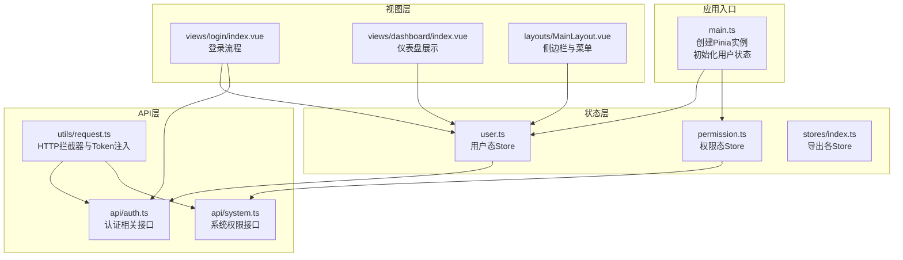
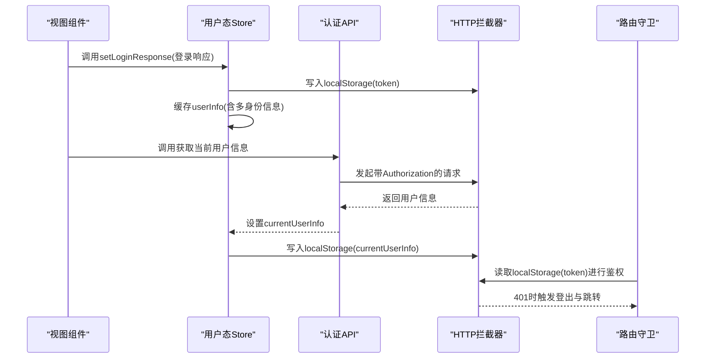
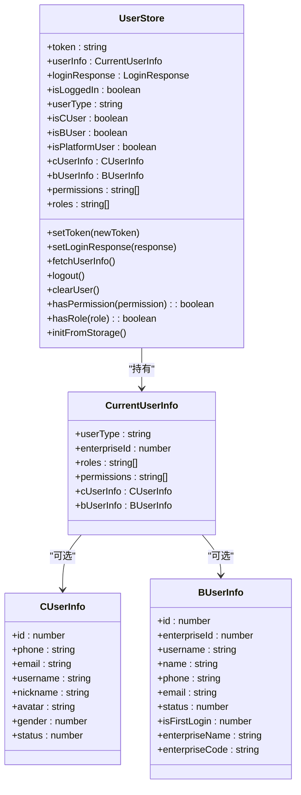
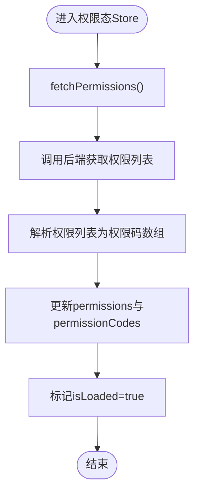
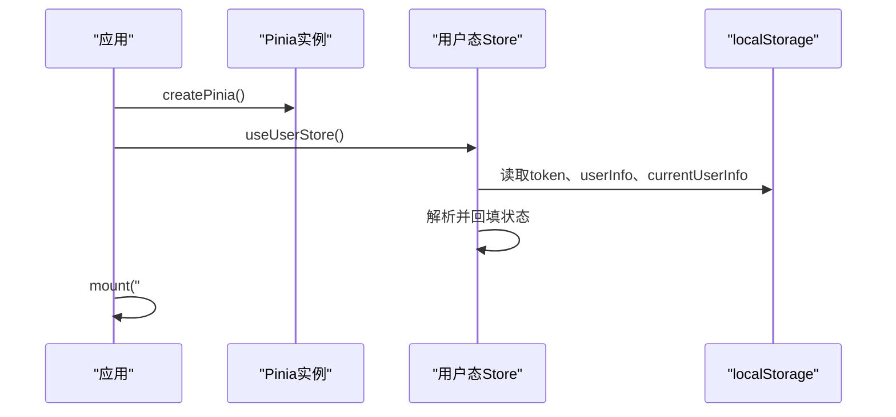
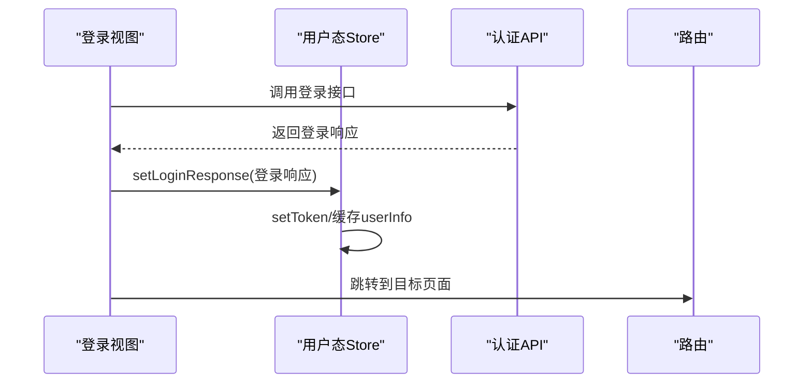
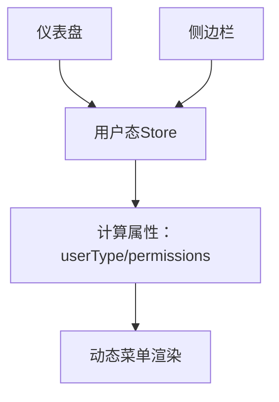
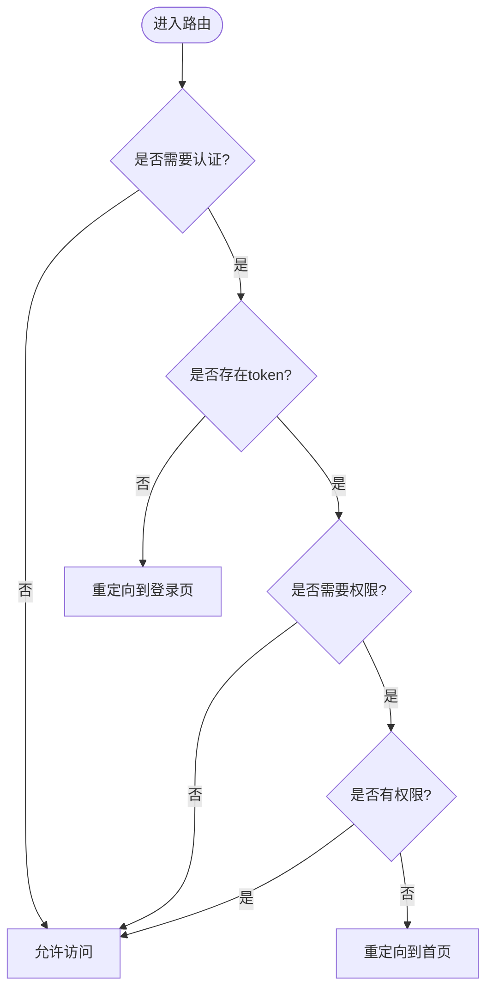
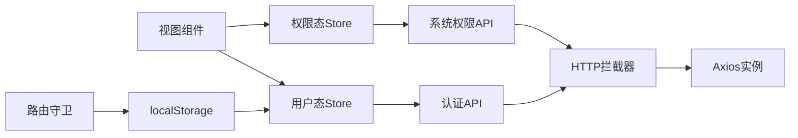

# 状态管理设计

<cite>
**本文引用的文件**
- [src/stores/index.ts](file://src/stores/index.ts)
- [src/stores/user.ts](file://src/stores/user.ts)
- [src/stores/permission.ts](file://src/stores/permission.ts)
- [src/main.ts](file://src/main.ts)
- [src/types/index.ts](file://src/types/index.ts)
- [src/api/auth.ts](file://src/api/auth.ts)
- [src/api/system.ts](file://src/api/system.ts)
- [src/utils/request.ts](file://src/utils/request.ts)
- [src/views/login/index.vue](file://src/views/login/index.vue)
- [src/views/dashboard/index.vue](file://src/views/dashboard/index.vue)
- [src/layouts/MainLayout.vue](file://src/layouts/MainLayout.vue)
- [src/router/index.ts](file://src/router/index.ts)
</cite>

## 目录
1. [引言](#引言)
2. [项目结构](#项目结构)
3. [核心组件](#核心组件)
4. [架构总览](#架构总览)
5. [详细组件分析](#详细组件分析)
6. [依赖关系分析](#依赖关系分析)
7. [性能考虑](#性能考虑)
8. [故障排查指南](#故障排查指南)
9. [结论](#结论)
10. [附录](#附录)

## 引言
本设计文档围绕HC管理系统中的Pinia状态管理进行深入剖析，重点涵盖以下方面：
- Store模块划分与职责边界
- 状态结构设计与数据流
- Action方法组织与调用链
- 多身份用户状态管理（用户信息缓存、权限状态同步、Token自动刷新机制）
- 状态持久化策略（localStorage/sessionStorage使用、状态恢复机制）
- 状态共享与组件间通信（store订阅、响应式更新、状态监听）
- 最佳实践与性能优化建议

## 项目结构
系统采用基于功能域的模块化组织方式，状态管理位于src/stores目录，主要包含用户态与权限态两个核心Store，并通过全局入口在应用启动时完成初始化与状态恢复。

图表来源
- [src/main.ts:1-27](file://src/main.ts#L1-L27)
- [src/stores/user.ts:1-152](file://src/stores/user.ts#L1-L152)
- [src/stores/permission.ts:1-56](file://src/stores/permission.ts#L1-L56)
- [src/stores/index.ts:1-3](file://src/stores/index.ts#L1-L3)
- [src/views/login/index.vue:1-323](file://src/views/login/index.vue#L1-L323)
- [src/views/dashboard/index.vue:1-160](file://src/views/dashboard/index.vue#L1-L160)
- [src/layouts/MainLayout.vue:1-281](file://src/layouts/MainLayout.vue#L1-L281)
- [src/api/auth.ts:1-69](file://src/api/auth.ts#L1-L69)
- [src/api/system.ts:1-56](file://src/api/system.ts#L1-L56)
- [src/utils/request.ts:1-148](file://src/utils/request.ts#L1-L148)

章节来源
- [src/main.ts:1-27](file://src/main.ts#L1-L27)
- [src/stores/index.ts:1-3](file://src/stores/index.ts#L1-L3)

## 核心组件
本系统采用组合式API风格的Pinia Store，将状态、计算属性与Action统一在一个函数式Store中，便于维护与测试。核心组件包括：
- 用户态Store：负责Token管理、用户信息缓存、多身份识别、权限与角色查询、登出清理等
- 权限态Store：负责权限列表拉取、权限码缓存、权限校验、缓存初始化等
- 应用入口：创建Pinia实例并在启动时从localStorage恢复用户状态

章节来源
- [src/stores/user.ts:1-152](file://src/stores/user.ts#L1-L152)
- [src/stores/permission.ts:1-56](file://src/stores/permission.ts#L1-L56)
- [src/main.ts:1-27](file://src/main.ts#L1-L27)

## 架构总览
系统状态管理遵循“单向数据流”原则：组件通过Store暴露的Action触发状态变更；Store内部通过API层与后端交互；HTTP层统一注入Token并处理未授权场景；路由层根据Token与权限决定页面访问。

图表来源
- [src/views/login/index.vue:98-145](file://src/views/login/index.vue#L98-L145)
- [src/stores/user.ts:27-60](file://src/stores/user.ts#L27-L60)
- [src/api/auth.ts:62-68](file://src/api/auth.ts#L62-L68)
- [src/utils/request.ts:37-101](file://src/utils/request.ts#L37-L101)
- [src/router/index.ts:82-124](file://src/router/index.ts#L82-L124)

## 详细组件分析

### 用户态Store（user.ts）
用户态Store是系统状态管理的核心，负责多身份用户的状态管理与持久化。其关键特性如下：
- 状态结构
  - token：用于HTTP请求头注入
  - userInfo：当前登录用户的完整信息（含多身份字段）
  - loginResponse：登录响应（用于初次缓存）
  - 计算属性：isLoggedIn、userType、isCUser、isBUser、isPlatformUser、cUserInfo、bUserInfo、permissions、roles
- Action方法
  - setToken/newToken：设置并持久化Token
  - setLoginResponse：设置登录响应并缓存用户信息
  - fetchUserInfo：拉取当前用户信息并持久化
  - logout：调用后端登出并清理本地状态
  - clearUser：彻底清除用户相关缓存
  - hasPermission/hasRole：快速权限/角色校验
  - initFromStorage：从localStorage恢复状态
- 持久化策略
  - 使用localStorage存储token、loginResponse、currentUserInfo
  - 在initFromStorage中进行兼容性解析与回填
- 多身份支持
  - 通过userType区分C/B/平台用户
  - 通过cUserInfo/bUserInfo提供对应身份的详细信息
  - 通过permissions/roles提供权限与角色集合

图表来源
- [src/stores/user.ts:1-152](file://src/stores/user.ts#L1-L152)
- [src/types/index.ts:151-158](file://src/types/index.ts#L151-L158)
- [src/types/index.ts:34-43](file://src/types/index.ts#L34-L43)
- [src/types/index.ts:45-56](file://src/types/index.ts#L45-L56)

章节来源
- [src/stores/user.ts:1-152](file://src/stores/user.ts#L1-L152)
- [src/types/index.ts:151-158](file://src/types/index.ts#L151-L158)
- [src/types/index.ts:34-43](file://src/types/index.ts#L34-L43)
- [src/types/index.ts:45-56](file://src/types/index.ts#L45-L56)

### 权限态Store（permission.ts）
权限态Store负责权限列表的拉取、缓存与校验，支撑前端菜单与按钮级别的权限控制：
- 状态结构
  - permissions：权限对象数组
  - permissionCodes：权限码字符串数组
  - isLoaded：权限是否已加载
- Action方法
  - fetchPermissions：拉取权限列表并转换为权限码数组
  - initPermission：调用后端初始化权限缓存
  - hasPermission：快速权限码校验
  - clearPermissions：清空权限缓存
- 与用户态的协作
  - 用户态Store在获取currentUserInfo后会填充permissions，权限态Store主要用于系统级权限管理与缓存初始化

图表来源
- [src/stores/permission.ts:12-24](file://src/stores/permission.ts#L12-L24)

章节来源
- [src/stores/permission.ts:1-56](file://src/stores/permission.ts#L1-L56)

### 应用入口与状态恢复（main.ts）
应用入口负责创建Pinia实例并将用户态Store初始化，确保页面刷新后能从localStorage恢复用户状态：
- 创建Pinia实例并挂载到应用
- 获取用户态Store并调用initFromStorage进行状态恢复
- 注册ElementPlus图标组件与全局样式

图表来源
- [src/main.ts:13-24](file://src/main.ts#L13-L24)
- [src/stores/user.ts:90-127](file://src/stores/user.ts#L90-L127)

章节来源
- [src/main.ts:1-27](file://src/main.ts#L1-L27)
- [src/stores/user.ts:90-127](file://src/stores/user.ts#L90-L127)

### 登录流程与状态联动（views/login/index.vue）
登录流程展示了用户态Store与认证API的协同工作：
- 组件根据登录类型与模式选择不同的登录接口
- 登录成功后调用用户态Store的setLoginResponse，写入token与用户信息
- 路由跳转至仪表盘

图表来源
- [src/views/login/index.vue:98-145](file://src/views/login/index.vue#L98-L145)
- [src/stores/user.ts:27-39](file://src/stores/user.ts#L27-L39)

章节来源
- [src/views/login/index.vue:1-323](file://src/views/login/index.vue#L1-L323)
- [src/stores/user.ts:27-39](file://src/stores/user.ts#L27-L39)

### 仪表盘与侧边栏（views/dashboard/index.vue, layouts/MainLayout.vue）
- 仪表盘：展示用户昵称、欢迎语与系统信息，依赖用户态Store的计算属性
- 侧边栏：根据用户类型与权限动态生成菜单项，支持平台管理员与普通用户的差异化展示

图表来源
- [src/views/dashboard/index.vue:1-160](file://src/views/dashboard/index.vue#L1-L160)
- [src/layouts/MainLayout.vue:45-64](file://src/layouts/MainLayout.vue#L45-L64)
- [src/stores/user.ts:12-21](file://src/stores/user.ts#L12-L21)

章节来源
- [src/views/dashboard/index.vue:1-160](file://src/views/dashboard/index.vue#L1-L160)
- [src/layouts/MainLayout.vue:1-281](file://src/layouts/MainLayout.vue#L1-L281)
- [src/stores/user.ts:12-21](file://src/stores/user.ts#L12-L21)

### 路由守卫与权限控制（router/index.ts）
路由守卫负责基于Token与权限的访问控制：
- 未登录用户跳转至登录页
- 登录用户若缺少所需权限则跳转至首页
- 平台管理员不受权限限制

图表来源
- [src/router/index.ts:82-124](file://src/router/index.ts#L82-L124)

章节来源
- [src/router/index.ts:1-127](file://src/router/index.ts#L1-L127)

## 依赖关系分析
- 组件与Store
  - 视图组件通过useUserStore/usePermissionStore直接调用Store的Action与读取计算属性
- Store与API
  - 用户态Store依赖认证API（登录、登出、获取当前用户信息）
  - 权限态Store依赖系统权限API（获取权限列表、初始化权限缓存）
- API与HTTP
  - 所有API通过utils/request.ts封装的Axios实例发起请求
  - HTTP拦截器统一注入Authorization头并处理401未授权
- 路由与状态
  - 路由守卫读取localStorage中的token进行鉴权
  - 路由元信息中声明requiresAuth与permissions

图表来源
- [src/views/login/index.vue:6-7](file://src/views/login/index.vue#L6-L7)
- [src/stores/user.ts:3-4](file://src/stores/user.ts#L3-L4)
- [src/stores/permission.ts:3-4](file://src/stores/permission.ts#L3-L4)
- [src/api/auth.ts:1-8](file://src/api/auth.ts#L1-L8)
- [src/api/system.ts:1-7](file://src/api/system.ts#L1-L7)
- [src/utils/request.ts:1-15](file://src/utils/request.ts#L1-L15)
- [src/router/index.ts:82-83](file://src/router/index.ts#L82-L83)

章节来源
- [src/views/login/index.vue:1-323](file://src/views/login/index.vue#L1-L323)
- [src/stores/user.ts:1-152](file://src/stores/user.ts#L1-L152)
- [src/stores/permission.ts:1-56](file://src/stores/permission.ts#L1-L56)
- [src/api/auth.ts:1-69](file://src/api/auth.ts#L1-L69)
- [src/api/system.ts:1-56](file://src/api/system.ts#L1-L56)
- [src/utils/request.ts:1-148](file://src/utils/request.ts#L1-L148)
- [src/router/index.ts:1-127](file://src/router/index.ts#L1-L127)

## 性能考虑
- 响应式粒度
  - 将用户信息拆分为多个计算属性（如userType、permissions、roles），避免不必要的组件重渲染
- 缓存策略
  - 利用localStorage减少重复登录与权限拉取开销
  - 在路由守卫中对权限缺失场景进行短路处理，避免等待异步数据
- 请求拦截
  - HTTP拦截器统一注入Token，减少重复代码与错误
  - 对401场景进行统一处理，避免分散逻辑
- 组件懒加载
  - 路由采用动态导入，降低首屏体积
- 优化建议
  - 在用户态Store中增加权限缓存失效策略（如TTL）
  - 对频繁访问的权限码建立索引结构，提升hasPermission性能
  - 在路由守卫中引入轻量级权限预检，减少页面加载后的二次判断

## 故障排查指南
- 登录后无法进入受保护页面
  - 检查localStorage中token是否存在
  - 确认路由守卫逻辑是否正确读取token
- 权限不足导致页面跳转
  - 检查currentUserInfo中permissions是否为空
  - 确认路由元信息中的permissions配置
- Token过期导致频繁弹窗
  - 检查HTTP拦截器的401处理逻辑
  - 确认是否正确清理localStorage并跳转登录页
- 用户信息未更新
  - 确认是否调用了fetchUserInfo并成功写入localStorage
  - 检查initFromStorage的解析逻辑

章节来源
- [src/router/index.ts:82-124](file://src/router/index.ts#L82-L124)
- [src/utils/request.ts:20-35](file://src/utils/request.ts#L20-L35)
- [src/stores/user.ts:41-60](file://src/stores/user.ts#L41-L60)
- [src/stores/user.ts:90-127](file://src/stores/user.ts#L90-L127)

## 结论
本系统通过清晰的Store模块划分与完善的持久化策略，实现了多身份用户状态管理与权限控制。配合HTTP拦截器与路由守卫，形成了从登录到页面访问的完整状态流转闭环。建议在后续迭代中引入权限缓存失效与性能优化策略，进一步提升用户体验与系统稳定性。

## 附录
- 类型定义参考
  - 登录响应、当前用户信息、C/B用户信息、权限响应等类型定义见类型文件
- API接口参考
  - 认证相关接口与系统权限接口定义见API文件

章节来源
- [src/types/index.ts:18-188](file://src/types/index.ts#L18-L188)
- [src/api/auth.ts:1-69](file://src/api/auth.ts#L1-L69)
- [src/api/system.ts:1-56](file://src/api/system.ts#L1-L56)