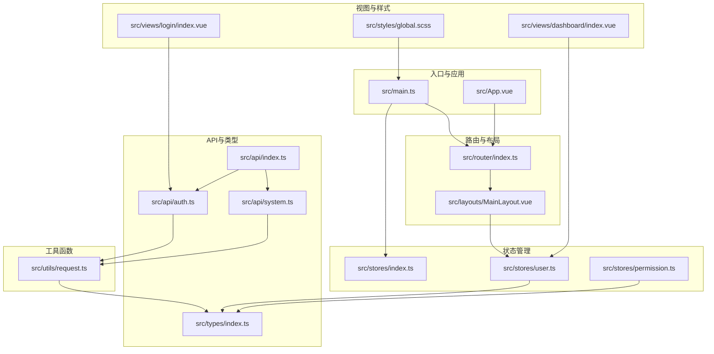
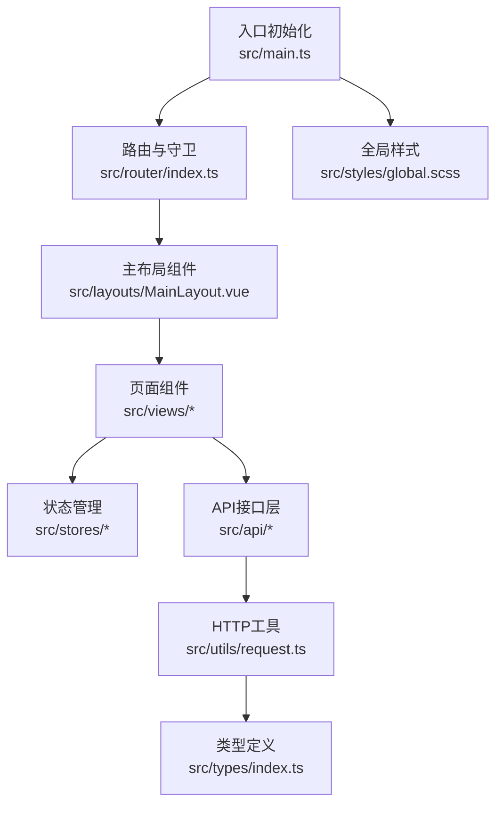
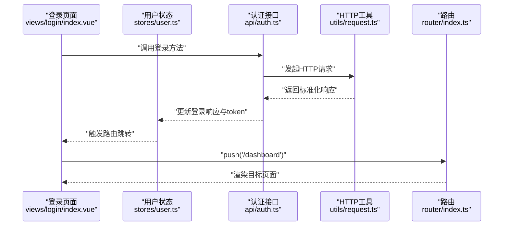
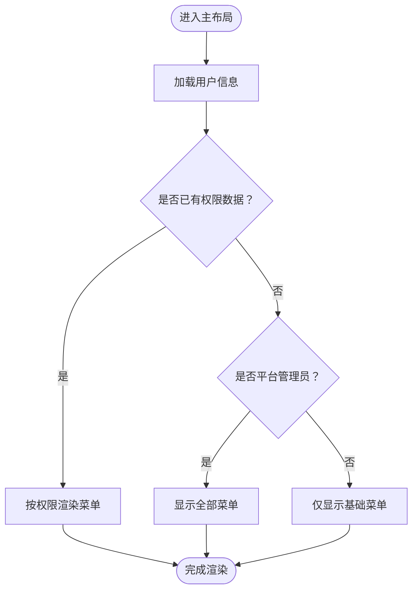
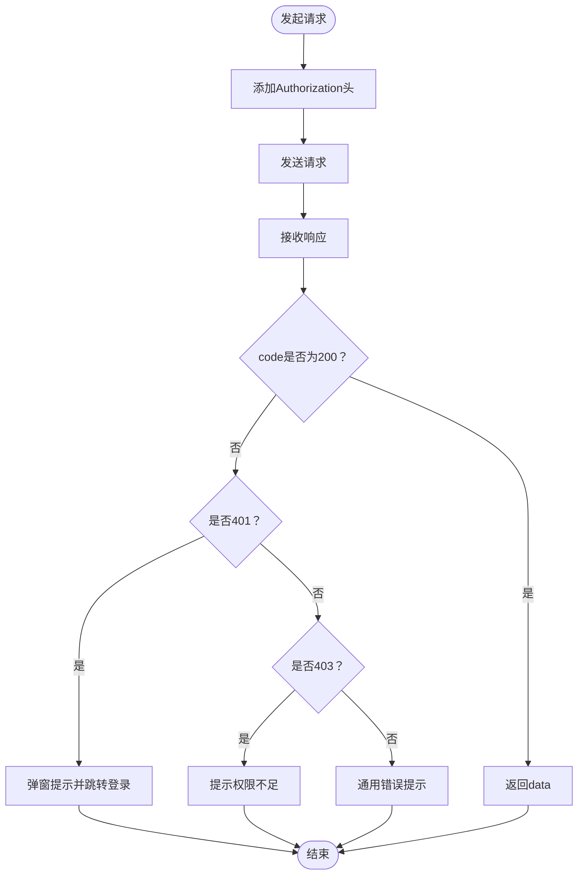
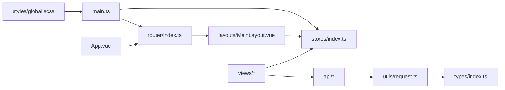
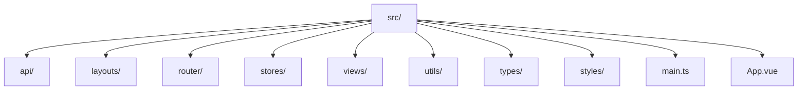

# 目录结构设计

<cite>
**本文档引用的文件**
- [main.ts](file://src/main.ts)
- [App.vue](file://src/App.vue)
- [router/index.ts](file://src/router/index.ts)
- [layouts/MainLayout.vue](file://src/layouts/MainLayout.vue)
- [stores/index.ts](file://src/stores/index.ts)
- [stores/user.ts](file://src/stores/user.ts)
- [stores/permission.ts](file://src/stores/permission.ts)
- [utils/request.ts](file://src/utils/request.ts)
- [types/index.ts](file://src/types/index.ts)
- [api/index.ts](file://src/api/index.ts)
- [api/auth.ts](file://src/api/auth.ts)
- [api/system.ts](file://src/api/system.ts)
- [views/login/index.vue](file://src/views/login/index.vue)
- [views/dashboard/index.vue](file://src/views/dashboard/index.vue)
- [styles/global.scss](file://src/styles/global.scss)
</cite>

## 目录

1. [引言](#引言)
2. [项目结构](#项目结构)
3. [核心组件](#核心组件)
4. [架构总览](#架构总览)
5. [详细组件分析](#详细组件分析)
6. [依赖分析](#依赖分析)
7. [性能考虑](#性能考虑)
8. [故障排除指南](#故障排除指南)
9. [结论](#结论)
10. [附录](#附录)

## 引言

本文件面向HC管理系统前端工程，系统性阐述src目录下的目录结构设计与职责划分，重点覆盖以下子目录：
- api：API接口层
- layouts：布局组件
- router：路由配置
- stores：状态管理
- views：页面组件
- utils：工具函数
- types：类型定义

文档将解释每个目录的设计原则、命名规范、文件组织方式如何支持模块化开发与代码复用，并提供目录结构图与各层之间的依赖关系图，最后总结采用该结构的原因及其带来的好处。

## 项目结构

HC管理系统采用基于功能域的分层组织方式，结合Vue生态的标准实践，形成清晰的职责边界与可维护的模块化结构。整体目录结构如下：

图表来源
- [main.ts:1-27](file://src/main.ts#L1-L27)
- [App.vue:1-10](file://src/App.vue#L1-L10)
- [router/index.ts:1-127](file://src/router/index.ts#L1-L127)
- [layouts/MainLayout.vue:1-281](file://src/layouts/MainLayout.vue#L1-L281)
- [stores/index.ts:1-3](file://src/stores/index.ts#L1-L3)
- [stores/user.ts:1-152](file://src/stores/user.ts#L1-L152)
- [stores/permission.ts:1-56](file://src/stores/permission.ts#L1-L56)
- [api/index.ts:1-7](file://src/api/index.ts#L1-L7)
- [api/auth.ts:1-69](file://src/api/auth.ts#L1-L69)
- [api/system.ts:1-56](file://src/api/system.ts#L1-L56)
- [utils/request.ts:1-148](file://src/utils/request.ts#L1-L148)
- [types/index.ts:1-188](file://src/types/index.ts#L1-L188)
- [views/login/index.vue:1-323](file://src/views/login/index.vue#L1-L323)
- [views/dashboard/index.vue:1-160](file://src/views/dashboard/index.vue#L1-L160)
- [styles/global.scss:1-131](file://src/styles/global.scss#L1-L131)

章节来源
- [main.ts:1-27](file://src/main.ts#L1-L27)
- [router/index.ts:1-127](file://src/router/index.ts#L1-L127)

## 核心组件

- 应用入口与初始化
  - 在应用入口中完成插件注册（Element Plus、Pinia、路由）、全局样式引入、用户状态初始化等，确保应用启动时具备完整的运行环境。
  - 参考路径：[main.ts:1-27](file://src/main.ts#L1-L27)

- 路由与导航守卫
  - 定义路由表并实现全局前置守卫，处理标题设置、登录态校验、权限校验与重定向逻辑，保证页面访问的安全性与一致性。
  - 参考路径：[router/index.ts:1-127](file://src/router/index.ts#L1-L127)

- 布局组件
  - 主布局组件负责侧边菜单生成、面包屑展示、用户信息展示与下拉操作、菜单折叠切换等，通过状态管理读取用户权限动态渲染菜单项。
  - 参考路径：[layouts/MainLayout.vue:1-281](file://src/layouts/MainLayout.vue#L1-L281)

- 状态管理
  - 用户状态：封装登录响应、用户信息、权限与角色、登录/登出、本地持久化与初始化逻辑。
  - 权限状态：封装权限列表、权限码集合、权限缓存初始化与权限判断。
  - 参考路径：
    - [stores/user.ts:1-152](file://src/stores/user.ts#L1-L152)
    - [stores/permission.ts:1-56](file://src/stores/permission.ts#L1-L56)

- API接口层
  - 按业务模块拆分接口方法，统一通过HTTP工具发起请求，返回标准化响应模型，便于在视图层直接调用。
  - 参考路径：
    - [api/auth.ts:1-69](file://src/api/auth.ts#L1-L69)
    - [api/system.ts:1-56](file://src/api/system.ts#L1-L56)
    - [api/index.ts:1-7](file://src/api/index.ts#L1-L7)

- 工具函数
  - HTTP客户端封装，统一处理请求头、鉴权、响应拦截、错误提示与登录过期处理，提供便捷的请求方法。
  - 参考路径：[utils/request.ts:1-148](file://src/utils/request.ts#L1-L148)

- 类型定义
  - 统一声明后端响应结构、分页结果、用户信息、角色权限、Excel任务状态等类型，保障前后端契约一致与开发体验。
  - 参考路径：[types/index.ts:1-188](file://src/types/index.ts#L1-L188)

章节来源
- [main.ts:1-27](file://src/main.ts#L1-L27)
- [router/index.ts:1-127](file://src/router/index.ts#L1-L127)
- [layouts/MainLayout.vue:1-281](file://src/layouts/MainLayout.vue#L1-L281)
- [stores/user.ts:1-152](file://src/stores/user.ts#L1-L152)
- [stores/permission.ts:1-56](file://src/stores/permission.ts#L1-L56)
- [api/index.ts:1-7](file://src/api/index.ts#L1-L7)
- [api/auth.ts:1-69](file://src/api/auth.ts#L1-L69)
- [api/system.ts:1-56](file://src/api/system.ts#L1-L56)
- [utils/request.ts:1-148](file://src/utils/request.ts#L1-L148)
- [types/index.ts:1-188](file://src/types/index.ts#L1-L188)

## 架构总览

HC管理系统采用“入口初始化 → 路由与守卫 → 布局与页面 → 状态管理 → API与工具”的分层架构，各层职责清晰、耦合度低、可扩展性强。

图表来源
- [main.ts:1-27](file://src/main.ts#L1-L27)
- [router/index.ts:1-127](file://src/router/index.ts#L1-L127)
- [layouts/MainLayout.vue:1-281](file://src/layouts/MainLayout.vue#L1-L281)
- [stores/index.ts:1-3](file://src/stores/index.ts#L1-L3)
- [stores/user.ts:1-152](file://src/stores/user.ts#L1-L152)
- [stores/permission.ts:1-56](file://src/stores/permission.ts#L1-L56)
- [api/index.ts:1-7](file://src/api/index.ts#L1-L7)
- [api/auth.ts:1-69](file://src/api/auth.ts#L1-L69)
- [api/system.ts:1-56](file://src/api/system.ts#L1-L56)
- [utils/request.ts:1-148](file://src/utils/request.ts#L1-L148)
- [types/index.ts:1-188](file://src/types/index.ts#L1-L188)
- [styles/global.scss:1-131](file://src/styles/global.scss#L1-L131)

## 详细组件分析

### 目录职责与设计原则

- api（API接口层）
  - 设计原则：按业务域拆分模块，统一导出；每个模块仅暴露业务方法，隐藏HTTP细节。
  - 命名规范：以领域命名（如auth、system），方法语义化（如getUserList、addRole）。
  - 复用性：通过统一的HTTP工具进行请求与响应处理，避免重复逻辑；类型定义贯穿始终，提升契约一致性。
  - 参考路径：
    - [api/index.ts:1-7](file://src/api/index.ts#L1-L7)
    - [api/auth.ts:1-69](file://src/api/auth.ts#L1-L69)
    - [api/system.ts:1-56](file://src/api/system.ts#L1-L56)

- layouts（布局组件）
  - 设计原则：单一职责，专注UI与交互；通过状态管理读取用户信息与权限，动态渲染菜单。
  - 命名规范：MainLayout作为默认布局，子组件按功能命名。
  - 复用性：菜单、面包屑、用户下拉等通用UI在布局内集中实现，页面组件只需关注业务内容。
  - 参考路径：[layouts/MainLayout.vue:1-281](file://src/layouts/MainLayout.vue#L1-L281)

- router（路由配置）
  - 设计原则：集中式路由表，统一守卫；通过meta字段承载标题、权限与认证需求。
  - 命名规范：路由名称与路径语义化，嵌套路由以children组织。
  - 复用性：守卫逻辑统一处理登录态与权限校验，减少页面重复逻辑。
  - 参考路径：[router/index.ts:1-127](file://src/router/index.ts#L1-L127)

- stores（状态管理）
  - 设计原则：按领域拆分store，每个store聚焦单一职责；提供初始化、持久化与查询方法。
  - 命名规范：useXxxStore命名，导出在index.ts中统一聚合。
  - 复用性：store在多处组件共享，避免重复请求与状态不一致。
  - 参考路径：
    - [stores/index.ts:1-3](file://src/stores/index.ts#L1-L3)
    - [stores/user.ts:1-152](file://src/stores/user.ts#L1-L152)
    - [stores/permission.ts:1-56](file://src/stores/permission.ts#L1-L56)

- views（页面组件）
  - 设计原则：页面级组件，组合布局与业务逻辑；尽量薄化逻辑，将复杂逻辑下沉到store或api。
  - 命名规范：views下按功能域组织，index.vue作为页面入口。
  - 复用性：页面组件通过store与api解耦，便于测试与替换。
  - 参考路径：
    - [views/login/index.vue:1-323](file://src/views/login/index.vue#L1-L323)
    - [views/dashboard/index.vue:1-160](file://src/views/dashboard/index.vue#L1-L160)

- utils（工具函数）
  - 设计原则：纯函数与可复用逻辑，避免副作用；集中处理HTTP、加密、格式化等。
  - 命名规范：语义化函数名，如encryptPassword、request等。
  - 复用性：被api与视图组件广泛使用，降低重复代码。
  - 参考路径：[utils/request.ts:1-148](file://src/utils/request.ts#L1-L148)

- types（类型定义）
  - 设计原则：集中管理契约类型，前后端一致；提供分页、用户、权限、Excel任务等常用类型。
  - 命名规范：接口名大写开头，枚举值明确。
  - 复用性：被api、store、utils与视图组件广泛引用，提升开发效率与稳定性。
  - 参考路径：[types/index.ts:1-188](file://src/types/index.ts#L1-L188)

### 关键流程示例：登录流程

图表来源
- [views/login/index.vue:1-323](file://src/views/login/index.vue#L1-L323)
- [stores/user.ts:1-152](file://src/stores/user.ts#L1-L152)
- [api/auth.ts:1-69](file://src/api/auth.ts#L1-L69)
- [utils/request.ts:1-148](file://src/utils/request.ts#L1-L148)
- [router/index.ts:1-127](file://src/router/index.ts#L1-L127)

### 关键流程示例：菜单渲染与权限控制

图表来源
- [layouts/MainLayout.vue:45-64](file://src/layouts/MainLayout.vue#L45-L64)
- [stores/user.ts:18-20](file://src/stores/user.ts#L18-L20)

### 关键流程示例：HTTP请求拦截与错误处理

图表来源
- [utils/request.ts:37-101](file://src/utils/request.ts#L37-L101)

## 依赖分析

- 层间依赖关系
  - 入口层依赖路由、状态管理与全局样式。
  - 路由层依赖守卫与布局组件，布局组件依赖状态管理与路由。
  - 视图层依赖状态管理与API层，API层依赖HTTP工具与类型定义。
  - 工具层依赖HTTP库与UI库，类型定义被多层引用。

- 内聚与耦合
  - 各层内聚高，跨层依赖通过明确的接口（store方法、API方法、路由守卫）传递，降低耦合。
  - API与工具层对上层透明，便于替换与扩展。

图表来源
- [main.ts:1-27](file://src/main.ts#L1-L27)
- [router/index.ts:1-127](file://src/router/index.ts#L1-L127)
- [layouts/MainLayout.vue:1-281](file://src/layouts/MainLayout.vue#L1-L281)
- [stores/index.ts:1-3](file://src/stores/index.ts#L1-L3)
- [api/index.ts:1-7](file://src/api/index.ts#L1-L7)
- [utils/request.ts:1-148](file://src/utils/request.ts#L1-L148)
- [types/index.ts:1-188](file://src/types/index.ts#L1-L188)
- [styles/global.scss:1-131](file://src/styles/global.scss#L1-L131)

章节来源
- [main.ts:1-27](file://src/main.ts#L1-L27)
- [router/index.ts:1-127](file://src/router/index.ts#L1-L127)
- [layouts/MainLayout.vue:1-281](file://src/layouts/MainLayout.vue#L1-L281)
- [stores/index.ts:1-3](file://src/stores/index.ts#L1-L3)
- [api/index.ts:1-7](file://src/api/index.ts#L1-L7)
- [utils/request.ts:1-148](file://src/utils/request.ts#L1-L148)
- [types/index.ts:1-188](file://src/types/index.ts#L1-L188)
- [styles/global.scss:1-131](file://src/styles/global.scss#L1-L131)

## 性能考虑

- 路由懒加载
  - 通过动态导入实现页面级懒加载，减少首屏体积与加载时间。
  - 参考路径：[router/index.ts:16, 28, 34, 40, 46, 52, 58, 64](file://src/router/index.ts#L16,L28,L34,L40,L46,L52,L58,L64)

- 状态持久化
  - 用户token与用户信息持久化至本地存储，应用重启后可快速恢复登录态。
  - 参考路径：[stores/user.ts:90-127](file://src/stores/user.ts#L90-L127)

- 请求拦截与并发控制
  - 统一注入Authorization头，避免重复代码；通过拦截器集中处理错误与提示，减少页面重复逻辑。
  - 参考路径：[utils/request.ts:37-101](file://src/utils/request.ts#L37-L101)

- 样式与主题变量
  - 使用CSS变量统一管理颜色与间距，便于主题切换与样式维护。
  - 参考路径：[styles/global.scss:1-31](file://src/styles/global.scss#L1-L31)

## 故障排除指南

- 登录过期
  - 现象：请求返回401。
  - 处理：拦截器弹窗提示并清空本地token与用户信息，跳转登录页。
  - 参考路径：[utils/request.ts:20-35](file://src/utils/request.ts#L20-L35)

- 权限不足
  - 现象：请求返回403。
  - 处理：提示“没有权限访问该资源”，建议检查用户权限或联系管理员。
  - 参考路径：[utils/request.ts:63-66](file://src/utils/request.ts#L63-L66)

- 菜单权限异常
  - 现象：菜单项未按预期显示。
  - 排查：确认用户权限是否已加载，平台管理员与普通用户的菜单差异逻辑。
  - 参考路径：
    - [layouts/MainLayout.vue:45-64](file://src/layouts/MainLayout.vue#L45-L64)
    - [stores/user.ts:18-20](file://src/stores/user.ts#L18-L20)

- 页面标题未更新
  - 现象：浏览器标题未随路由变化。
  - 排查：检查路由meta.title是否设置，守卫中是否正确设置document.title。
  - 参考路径：[router/index.ts:82-88](file://src/router/index.ts#L82-L88)

章节来源
- [utils/request.ts:20-35](file://src/utils/request.ts#L20-L35)
- [utils/request.ts:63-66](file://src/utils/request.ts#L63-L66)
- [layouts/MainLayout.vue:45-64](file://src/layouts/MainLayout.vue#L45-L64)
- [stores/user.ts:18-20](file://src/stores/user.ts#L18-L20)
- [router/index.ts:82-88](file://src/router/index.ts#L82-L88)

## 结论

HC管理系统的目录结构遵循“分层清晰、职责单一、依赖可控”的设计原则，通过API、布局、路由、状态管理、视图、工具与类型七个维度的协同，实现了模块化开发与代码复用的最大化。该结构带来的主要好处包括：
- 易于维护：每层职责明确，修改影响面可控。
- 可扩展：新增页面、接口或状态模块无需改动其他层。
- 可测试：store与API解耦，便于单元测试与集成测试。
- 可复用：HTTP工具、类型定义与布局组件在多处共享，减少重复代码。

## 附录

- 目录结构图（概念示意）

