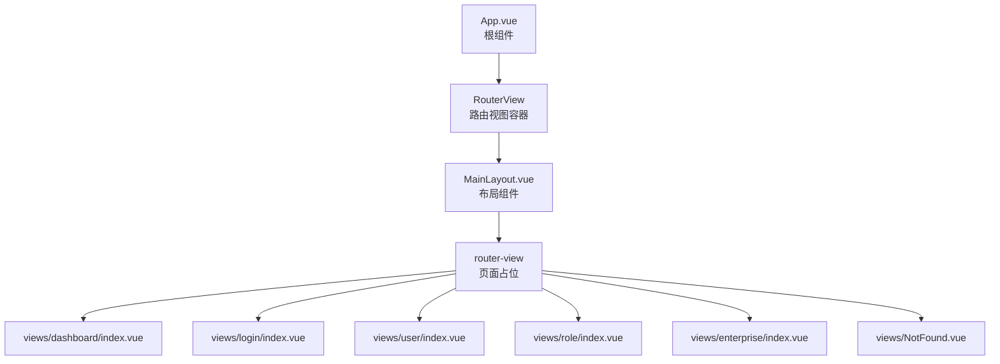
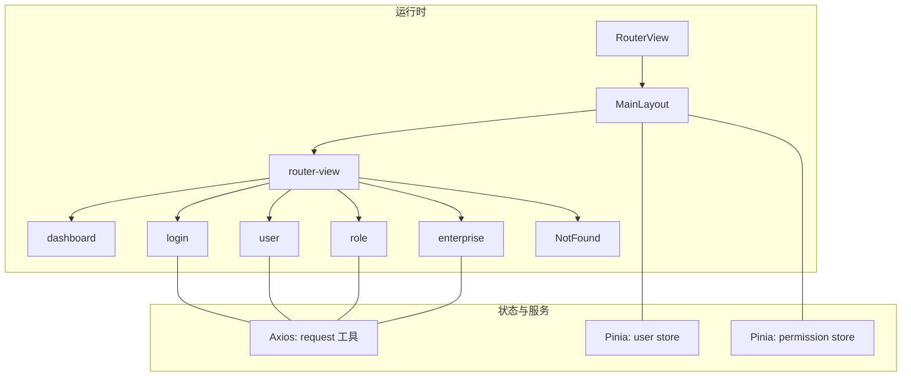
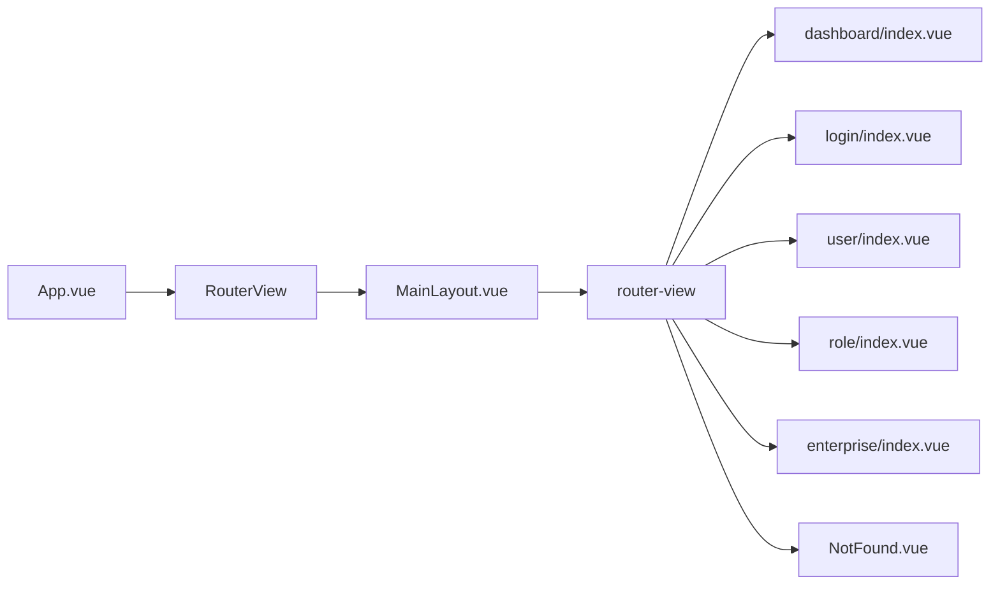
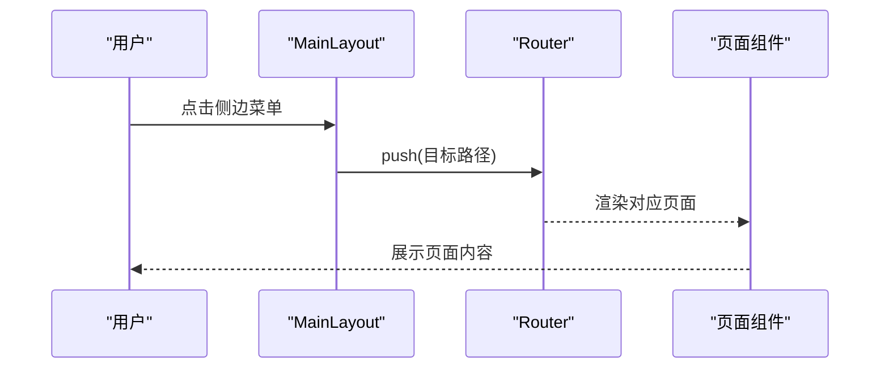
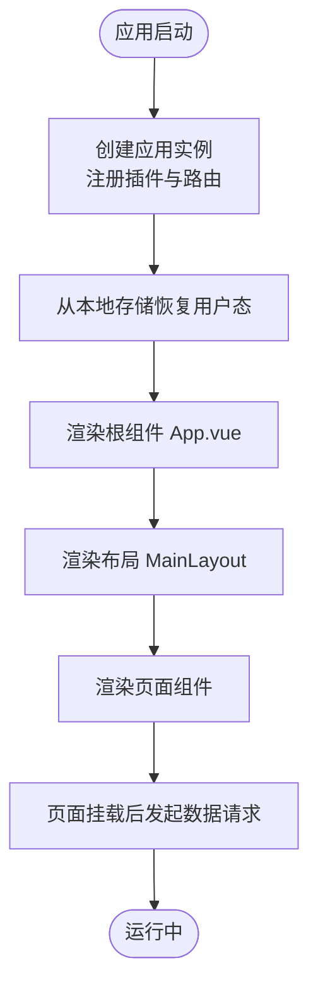
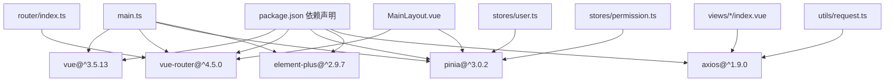

# 组件架构设计

<cite>
**本文引用的文件**
- [App.vue](file://src/App.vue)
- [MainLayout.vue](file://src/layouts/MainLayout.vue)
- [index.ts](file://src/router/index.ts)
- [main.ts](file://src/main.ts)
- [user.ts](file://src/stores/user.ts)
- [permission.ts](file://src/stores/permission.ts)
- [index.ts](file://src/stores/index.ts)
- [index.vue](file://src/views/dashboard/index.vue)
- [index.vue](file://src/views/login/index.vue)
- [index.vue](file://src/views/user/index.vue)
- [index.vue](file://src/views/role/index.vue)
- [index.vue](file://src/views/enterprise/index.vue)
- [NotFound.vue](file://src/views/NotFound.vue)
- [index.ts](file://src/types/index.ts)
- [request.ts](file://src/utils/request.ts)
- [package.json](file://package.json)
</cite>

## 目录
1. [引言](#引言)
2. [项目结构](#项目结构)
3. [核心组件](#核心组件)
4. [架构总览](#架构总览)
5. [组件详细分析](#组件详细分析)
6. [依赖关系分析](#依赖关系分析)
7. [性能考量](#性能考量)
8. [故障排查指南](#故障排查指南)
9. [结论](#结论)
10. [附录](#附录)

## 引言
本设计文档面向HC管理系统前端，聚焦组件架构与交互模式，围绕根组件App.vue、布局组件MainLayout.vue以及各功能页面组件展开，系统性阐述组件层次结构、父子与兄弟关系、组件通信机制（props、事件、依赖注入）、组件复用策略与组件库设计原则、生命周期管理与性能优化建议，并给出开发规范与最佳实践。

## 项目结构
系统采用基于路由的页面组织方式，根组件负责渲染路由视图；布局组件承载全局导航、侧边菜单与主内容区；页面组件按功能域划分在views目录下，每个页面自包含其业务逻辑与UI交互。

图表来源
- [App.vue:5-7](file://src/App.vue#L5-L7)
- [index.ts:20-68](file://src/router/index.ts#L20-L68)
- [MainLayout.vue:158-161](file://src/layouts/MainLayout.vue#L158-L161)

章节来源
- [App.vue:1-10](file://src/App.vue#L1-L10)
- [index.ts:12-75](file://src/router/index.ts#L12-L75)

## 核心组件
- 根组件 App.vue：仅包含一个RouterView，作为整个应用的渲染入口。
- 布局组件 MainLayout.vue：提供全局侧边菜单、面包屑、头部用户信息与下拉菜单、主内容区域，内部通过路由守卫与Pinia Store实现权限控制与用户态管理。
- 页面组件：views目录下各功能页，如仪表盘、登录、用户管理、角色管理、企业管理、404等，均以独立组件形式存在，通过API层与工具层完成数据获取与交互。

章节来源
- [App.vue:1-10](file://src/App.vue#L1-L10)
- [MainLayout.vue:1-281](file://src/layouts/MainLayout.vue#L1-L281)
- [index.vue:1-160](file://src/views/dashboard/index.vue#L1-L160)
- [index.vue:1-323](file://src/views/login/index.vue#L1-L323)
- [index.vue:1-361](file://src/views/user/index.vue#L1-L361)
- [index.vue:1-199](file://src/views/role/index.vue#L1-L199)
- [index.vue:1-502](file://src/views/enterprise/index.vue#L1-L502)
- [NotFound.vue:1-53](file://src/views/NotFound.vue#L1-L53)

## 架构总览
系统采用“根组件 + 布局组件 + 页面组件”的三层结构，配合Vue Router进行页面级路由切换，Pinia进行跨组件状态共享，Element Plus提供UI能力，Axios封装HTTP请求与拦截器。

图表来源
- [App.vue:5-7](file://src/App.vue#L5-L7)
- [index.ts:20-68](file://src/router/index.ts#L20-L68)
- [MainLayout.vue:18-20](file://src/layouts/MainLayout.vue#L18-L20)
- [user.ts:7-151](file://src/stores/user.ts#L7-L151)
- [permission.ts:7-55](file://src/stores/permission.ts#L7-L55)
- [request.ts:107-148](file://src/utils/request.ts#L107-L148)

## 组件详细分析

### 组件层次与关系
- 层次关系
  - 根组件 App.vue
  - 布局组件 MainLayout.vue（作为路由容器的子组件）
  - 页面组件（dashboard、login、user、role、enterprise、NotFound）
- 父子关系
  - App.vue -> RouterView -> MainLayout.vue -> 页面组件
- 兄弟关系
  - 同级页面组件之间无直接依赖，通过路由切换实现隔离

图表来源
- [App.vue:5-7](file://src/App.vue#L5-L7)
- [index.ts:20-68](file://src/router/index.ts#L20-L68)
- [MainLayout.vue:158-161](file://src/layouts/MainLayout.vue#L158-L161)

章节来源
- [index.ts:12-75](file://src/router/index.ts#L12-L75)
- [MainLayout.vue:100-115](file://src/layouts/MainLayout.vue#L100-L115)

### 组件通信机制
- Props传递
  - 路由元信息通过RouteMeta传入，用于标题与鉴权控制。
  - Element Plus组件通过属性传递数据与行为（如表格列、分页参数等）。
- 事件触发
  - 侧边菜单选择、面包屑点击、按钮点击等通过事件回调驱动页面跳转或弹窗控制。
  - 表格分页、尺寸变化、表单提交等通过事件驱动数据刷新。
- 依赖注入与全局服务
  - 使用Pinia Store在多处共享用户态与权限态，避免跨层级Props传递。
  - 使用Element Plus全局注册图标组件，减少重复导入。
  - 使用Axios实例与拦截器统一处理鉴权头、错误提示与登录过期流程。

图表来源
- [MainLayout.vue:66-68](file://src/layouts/MainLayout.vue#L66-L68)
- [index.ts:82-124](file://src/router/index.ts#L82-L124)

章节来源
- [MainLayout.vue:137-154](file://src/layouts/MainLayout.vue#L137-L154)
- [index.ts:4-10](file://src/router/index.ts#L4-L10)

### 组件复用策略与组件库设计原则
- 复用策略
  - 将通用UI模式抽象为可复用的卡片、表格、分页、对话框等结构，页面组件内组合使用。
  - 表单校验规则与格式化函数集中于页面内或工具层，便于复用。
- 设计原则
  - 单一职责：页面组件专注业务编排，不混杂通用UI细节。
  - 可测试性：通过Store与API层解耦，便于单元测试。
  - 可维护性：路由元信息与权限控制集中在路由层，避免分散逻辑。

章节来源
- [index.vue:37-43](file://src/views/user/index.vue#L37-L43)
- [index.vue:16-19](file://src/views/role/index.vue#L16-L19)
- [index.vue:144-148](file://src/views/enterprise/index.vue#L144-L148)

### 生命周期管理
- 应用启动
  - main.ts中创建应用实例，注册Element Plus与路由，初始化Pinia，从本地存储恢复用户态。
- 页面挂载
  - 页面组件在onMounted中发起数据请求，保证DOM就绪后再进行异步加载。
- 布局初始化
  - MainLayout在onMounted中检测用户信息是否完整，必要时拉取当前用户详情。

图表来源
- [main.ts:12-26](file://src/main.ts#L12-L26)
- [user.ts:90-127](file://src/stores/user.ts#L90-L127)
- [index.vue:198-200](file://src/views/user/index.vue#L198-L200)

章节来源
- [main.ts:1-27](file://src/main.ts#L1-L27)
- [user.ts:1-152](file://src/stores/user.ts#L1-L152)

## 依赖关系分析
- 运行时依赖
  - Vue 3、Vue Router、Pinia、Element Plus、Axios等。
- 内部依赖
  - App.vue依赖RouterView；MainLayout依赖路由与Pinia；页面组件依赖API与工具层；路由依赖类型定义与权限控制。

图表来源
- [package.json:13-23](file://package.json#L13-L23)
- [main.ts:1-27](file://src/main.ts#L1-L27)
- [index.ts:1-127](file://src/router/index.ts#L1-L127)
- [user.ts:1-152](file://src/stores/user.ts#L1-L152)
- [permission.ts:1-56](file://src/stores/permission.ts#L1-L56)
- [request.ts:1-148](file://src/utils/request.ts#L1-L148)

章节来源
- [package.json:1-35](file://package.json#L1-L35)

## 性能考量
- 路由懒加载
  - 所有页面组件均采用动态导入，减少首屏体积。
- 状态持久化
  - 用户态与登录态通过本地存储持久化，避免重复登录与重复拉取用户信息。
- 请求拦截与并发控制
  - Axios统一设置Authorization头，处理401自动跳转登录，避免重复请求与死循环。
- UI渲染优化
  - 表格与分页结合，按需加载；对话框按需打开，减少不必要的DOM开销。

章节来源
- [index.ts:14-16](file://src/router/index.ts#L14-L16)
- [user.ts:22-39](file://src/stores/user.ts#L22-L39)
- [request.ts:37-101](file://src/utils/request.ts#L37-L101)

## 故障排查指南
- 登录态异常
  - 检查本地存储token是否存在；确认路由守卫是否正确拦截未登录访问。
- 权限不足
  - 检查路由meta中的permissions字段与用户权限集合；确认页面加载后store是否更新。
- 接口错误
  - 查看Axios拦截器对401/403/5xx的处理与消息提示；确认后端返回结构与响应码。
- 页面空白或组件不显示
  - 检查路由配置与组件导出；确认MainLayout的router-view是否正确渲染。

章节来源
- [index.ts:82-124](file://src/router/index.ts#L82-L124)
- [request.ts:50-101](file://src/utils/request.ts#L50-L101)
- [NotFound.vue:8-10](file://src/views/NotFound.vue#L8-L10)

## 结论
本系统通过清晰的组件分层与路由组织，结合Pinia状态管理与Axios请求封装，实现了高内聚、低耦合的前端架构。页面组件专注于业务逻辑，布局组件承担全局导航与权限控制，具备良好的可扩展性与可维护性。建议后续持续完善通用组件库、统一错误处理与埋点上报，进一步提升开发效率与用户体验。

## 附录
- 开发规范与最佳实践
  - 组件命名：采用语义化命名，页面组件以功能域命名，避免缩写。
  - 状态管理：优先使用Pinia，避免跨层级Props与事件风暴。
  - 路由与权限：在路由meta中明确requiresAuth与permissions，集中处理鉴权。
  - API调用：统一通过utils/request封装，保持一致的错误处理与加载状态。
  - UI组件：优先使用Element Plus，遵循其设计规范与主题变量。
  - 类型安全：充分利用src/types中的接口定义，确保API契约一致性。