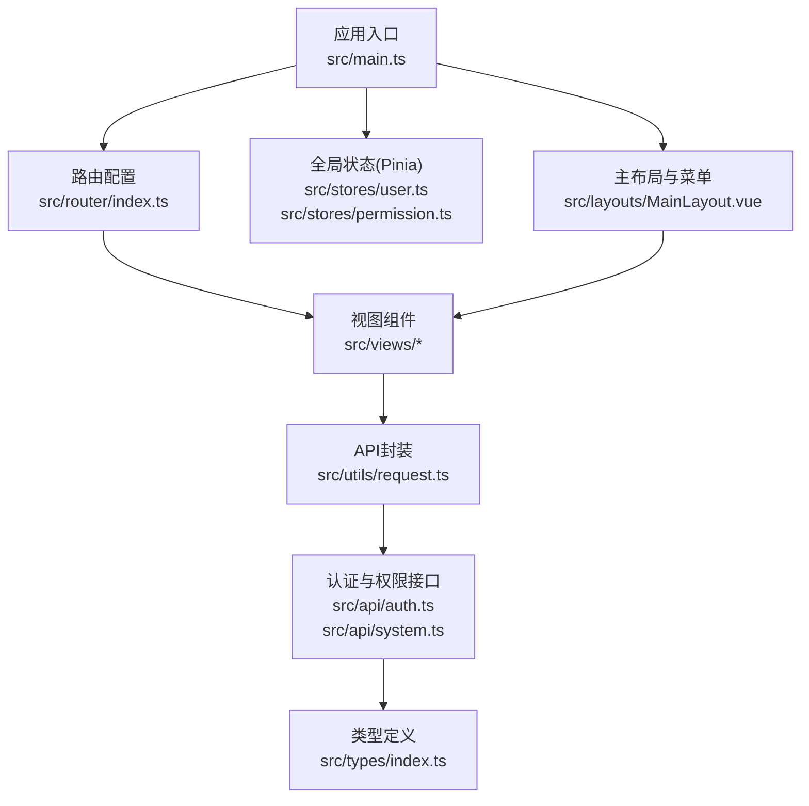
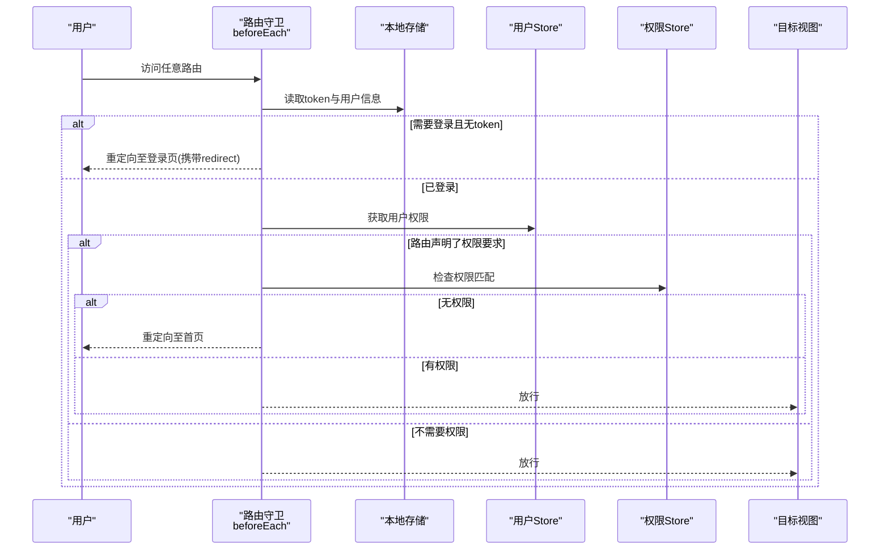

# 路由系统设计

<cite>
**本文引用的文件**
- [src/router/index.ts](file://src/router/index.ts)
- [src/stores/user.ts](file://src/stores/user.ts)
- [src/stores/permission.ts](file://src/stores/permission.ts)
- [src/layouts/MainLayout.vue](file://src/layouts/MainLayout.vue)
- [src/views/login/index.vue](file://src/views/login/index.vue)
- [src/views/dashboard/index.vue](file://src/views/dashboard/index.vue)
- [src/views/user/index.vue](file://src/views/user/index.vue)
- [src/utils/request.ts](file://src/utils/request.ts)
- [src/api/auth.ts](file://src/api/auth.ts)
- [src/api/system.ts](file://src/api/system.ts)
- [src/types/index.ts](file://src/types/index.ts)
- [src/main.ts](file://src/main.ts)
- [src/App.vue](file://src/App.vue)
- [package.json](file://package.json)
</cite>

## 目录
1. [简介](#简介)
2. [项目结构](#项目结构)
3. [核心组件](#核心组件)
4. [架构总览](#架构总览)
5. [详细组件分析](#详细组件分析)
6. [依赖分析](#依赖分析)
7. [性能考虑](#性能考虑)
8. [故障排查指南](#故障排查指南)
9. [结论](#结论)
10. [附录](#附录)

## 简介
本设计文档围绕HC管理系统的Vue Router路由系统展开，重点阐述以下方面：
- 嵌套路由设计与布局容器
- 动态路由生成与懒加载策略
- 路由守卫的实现机制（权限验证、登录状态检查、路由拦截）
- 导航菜单与路由的映射关系
- 路由参数传递与查询字符串处理
- 路由状态管理与历史记录控制
- 路由扩展与自定义路由组件的开发指南

## 项目结构
系统采用基于功能模块的组织方式，路由集中在router目录，权限与用户状态通过Pinia Store管理，主布局与导航菜单在layouts与views中实现，API层封装在api目录，类型定义在types目录。

图表来源
- [src/main.ts:1-27](file://src/main.ts#L1-L27)
- [src/router/index.ts:1-127](file://src/router/index.ts#L1-L127)
- [src/stores/user.ts:1-152](file://src/stores/user.ts#L1-L152)
- [src/stores/permission.ts:1-56](file://src/stores/permission.ts#L1-L56)
- [src/layouts/MainLayout.vue:1-281](file://src/layouts/MainLayout.vue#L1-L281)
- [src/utils/request.ts:1-148](file://src/utils/request.ts#L1-L148)
- [src/api/auth.ts:1-69](file://src/api/auth.ts#L1-L69)
- [src/api/system.ts:1-56](file://src/api/system.ts#L1-L56)
- [src/types/index.ts:1-188](file://src/types/index.ts#L1-L188)

章节来源
- [src/main.ts:1-27](file://src/main.ts#L1-L27)
- [src/router/index.ts:12-75](file://src/router/index.ts#L12-L75)

## 核心组件
- 路由配置与守卫：集中于路由配置文件，定义嵌套路由、懒加载组件以及全局前置守卫。
- 用户状态与权限：通过用户Store与权限Store管理登录状态、用户信息、权限集合与角色。
- 主布局与菜单：MainLayout负责侧边栏菜单渲染、面包屑、用户下拉菜单与权限控制。
- 视图组件：各业务模块视图，如登录、仪表盘、用户管理等。
- 请求封装与拦截器：统一处理鉴权头、未授权与权限不足等响应逻辑。

章节来源
- [src/router/index.ts:82-124](file://src/router/index.ts#L82-L124)
- [src/stores/user.ts:7-151](file://src/stores/user.ts#L7-L151)
- [src/stores/permission.ts:7-55](file://src/stores/permission.ts#L7-L55)
- [src/layouts/MainLayout.vue:45-90](file://src/layouts/MainLayout.vue#L45-L90)
- [src/utils/request.ts:37-101](file://src/utils/request.ts#L37-L101)

## 架构总览
路由系统以“布局容器 + 子路由”的嵌套结构组织，根路径指向主布局，子路由作为内容区域；全局前置守卫负责登录态与权限校验，并根据需要重定向到登录页或首页。

图表来源
- [src/router/index.ts:82-124](file://src/router/index.ts#L82-L124)
- [src/stores/user.ts:41-60](file://src/stores/user.ts#L41-L60)
- [src/stores/permission.ts:12-24](file://src/stores/permission.ts#L12-L24)

## 详细组件分析

### 路由配置与嵌套路由设计
- 根路径“/”指向主布局组件，内部包含多个子路由，形成嵌套路由结构。
- 子路由均采用懒加载导入，提升首屏性能。
- 通过meta字段声明标题、是否需要登录、所需权限等元信息。
- 404兜底路由使用通配符路径，确保未知路径安全跳转。

章节来源
- [src/router/index.ts:12-75](file://src/router/index.ts#L12-L75)

### 动态路由生成与权限控制
- 菜单项与路由权限通过用户Store中的权限数组进行动态控制。
- 当用户尚未加载权限时，平台管理员默认显示全部菜单，其他用户仅显示基础菜单；加载完成后按实际权限过滤。
- 权限Store提供hasPermission方法，用于快速判断当前用户是否具备某权限码。

章节来源
- [src/layouts/MainLayout.vue:45-64](file://src/layouts/MainLayout.vue#L45-L64)
- [src/stores/user.ts:82-88](file://src/stores/user.ts#L82-L88)
- [src/stores/permission.ts:36-38](file://src/stores/permission.ts#L36-L38)

### 路由懒加载实现
- 所有视图组件通过函数式懒加载导入，结合打包工具按需加载，减少初始包体积。
- 懒加载与嵌套路由配合，使布局与子视图按需加载，优化用户体验。

章节来源
- [src/router/index.ts:16,28,34,39,46,52,58,64:16-66](file://src/router/index.ts#L16-L66)

### 路由守卫实现机制
- 登录状态检查：若目标路由requiresAuth为true且本地无token，则重定向至登录页，并携带redirect参数。
- 权限验证：若路由声明了permissions，从用户Store中读取权限集合，进行权限匹配；若无权限则重定向至首页。
- 登录页保护：若用户已登录访问登录页，则直接重定向至首页。
- 文档标题更新：根据路由meta.title动态设置浏览器标题。

章节来源
- [src/router/index.ts:82-124](file://src/router/index.ts#L82-L124)

### 导航菜单与路由映射关系
- 菜单项与路由路径一一对应，支持折叠与展开。
- 菜单项的显示与否由权限决定，平台管理员可显示全部菜单。
- 面包屑根据当前路由meta.title动态展示。

章节来源
- [src/layouts/MainLayout.vue:55-64](file://src/layouts/MainLayout.vue#L55-L64)
- [src/layouts/MainLayout.vue:100-115](file://src/layouts/MainLayout.vue#L100-L115)
- [src/layouts/MainLayout.vue:127-132](file://src/layouts/MainLayout.vue#L127-L132)

### 路由参数传递与查询字符串处理
- 登录成功后，根据登录页查询参数redirect进行跳转，实现登录后的精准回跳。
- 登录页支持多种登录方式与模式切换，表单提交后根据结果决定跳转路径。

章节来源
- [src/views/login/index.vue:137-138](file://src/views/login/index.vue#L137-L138)
- [src/views/login/index.vue:58-61](file://src/views/login/index.vue#L58-L61)

### 路由状态管理与历史记录控制
- 路由状态由Vue Router维护，用户Store负责持久化token与用户信息，保障刷新后仍能保持登录态。
- 登出流程调用后端登出接口，清理本地存储并强制跳转至登录页。
- 请求拦截器在401时统一处理，弹窗提示并引导重新登录，避免无效的历史记录。

章节来源
- [src/stores/user.ts:62-71](file://src/stores/user.ts#L62-L71)
- [src/utils/request.ts:20-35](file://src/utils/request.ts#L20-L35)

### 路由扩展与自定义路由组件开发指南
- 新增路由：在路由配置中添加新的RouteRecordRaw条目，设置path、name、component（建议使用懒加载）、meta（title、requiresAuth、permissions）。
- 嵌套路由：在父级路由children中添加子路由，确保父级component为布局容器。
- 权限控制：在meta.permissions中声明所需权限码，守卫会自动校验；若权限来自后端，可在进入页面后再更新用户Store的权限集合并重新评估。
- 自定义组件：遵循现有命名规范与目录结构，复用Element Plus组件与样式体系，保证一致的交互体验。

章节来源
- [src/router/index.ts:12-75](file://src/router/index.ts#L12-L75)
- [src/layouts/MainLayout.vue:100-115](file://src/layouts/MainLayout.vue#L100-L115)

## 依赖分析
- 运行时依赖：Vue 3、Vue Router 4、Pinia、Element Plus及其图标库、Axios、Day.js、JSEncrypt、Lodash-es。
- 构建与开发依赖：Vite、TypeScript、Vue语言服务、自动导入与组件注册插件、Sass等。

章节来源
- [package.json:13-33](file://package.json#L13-L33)

## 性能考虑
- 懒加载：所有视图组件均采用动态导入，减少首屏加载体积。
- 嵌套路由：布局与内容分离，按需渲染，降低不必要的组件开销。
- 请求拦截：统一处理401与403，避免重复的错误处理逻辑，减少分支判断成本。
- 菜单权限：在前端根据权限过滤菜单，避免渲染无用DOM节点。

## 故障排查指南
- 登录后无法跳转：检查登录页是否正确读取并传递redirect参数，确认路由守卫逻辑与登录成功回调一致。
- 权限不足被重定向：确认用户Store中权限集合是否正确加载，meta.permissions声明是否与后端一致。
- 401未登录：检查请求拦截器是否正确移除本地token并跳转登录页。
- 菜单不显示：确认用户类型与权限集合，平台管理员默认显示全部菜单，其他用户按权限过滤。

章节来源
- [src/views/login/index.vue:137-138](file://src/views/login/index.vue#L137-L138)
- [src/router/index.ts:96-116](file://src/router/index.ts#L96-L116)
- [src/utils/request.ts:58-66](file://src/utils/request.ts#L58-L66)
- [src/layouts/MainLayout.vue:45-64](file://src/layouts/MainLayout.vue#L45-L64)

## 结论
本路由系统通过清晰的嵌套路由结构、完善的权限与登录守卫、动态菜单映射与懒加载策略，实现了高可用、可扩展的企业级权限管理界面。配合Pinia状态管理与Axios拦截器，整体具备良好的可维护性与用户体验。

## 附录
- 类型定义：包含登录响应、用户信息、角色与权限等接口，支撑路由守卫与菜单渲染的数据需求。
- API封装：统一的请求与响应处理，便于在路由守卫与页面逻辑中复用。

章节来源
- [src/types/index.ts:18-158](file://src/types/index.ts#L18-L158)
- [src/api/auth.ts:22-68](file://src/api/auth.ts#L22-L68)
- [src/api/system.ts:33-55](file://src/api/system.ts#L33-L55)