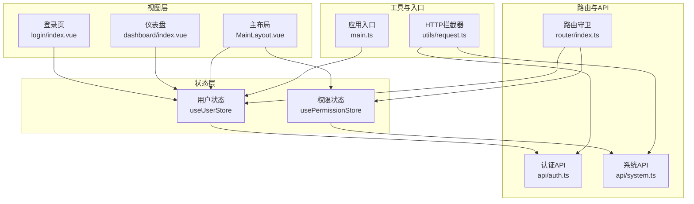
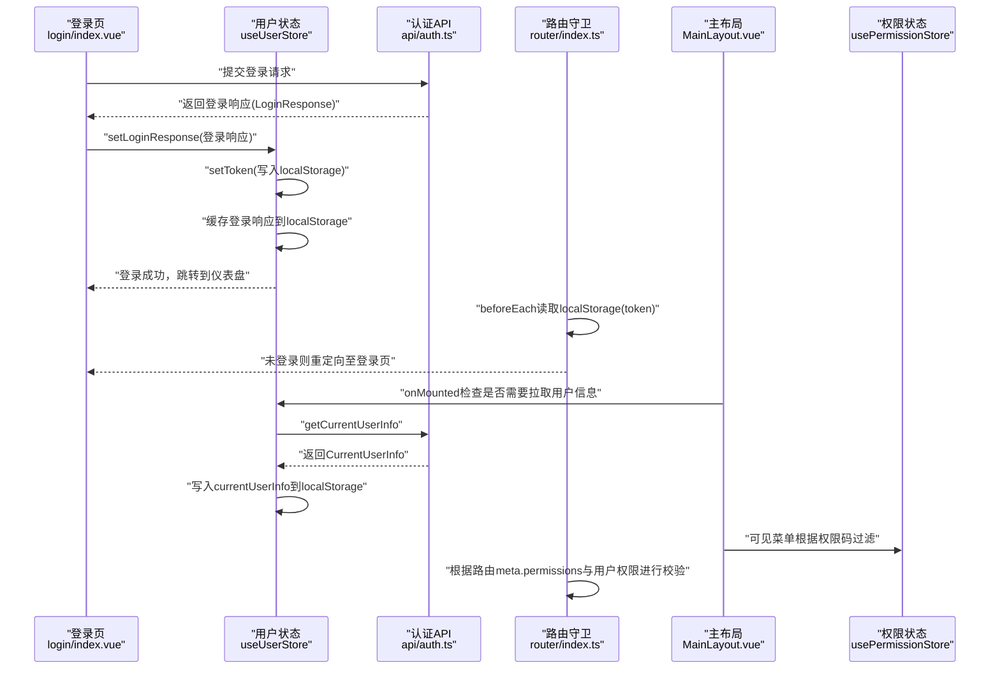
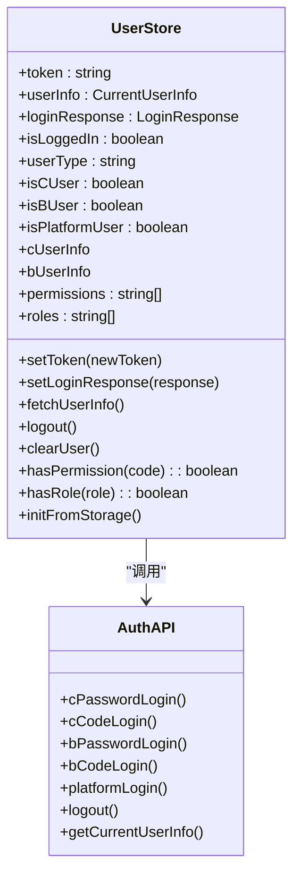
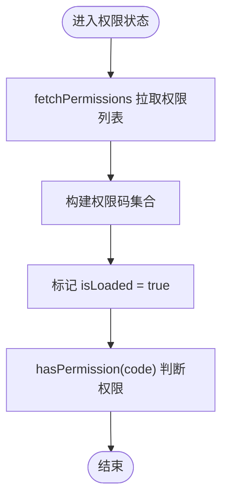
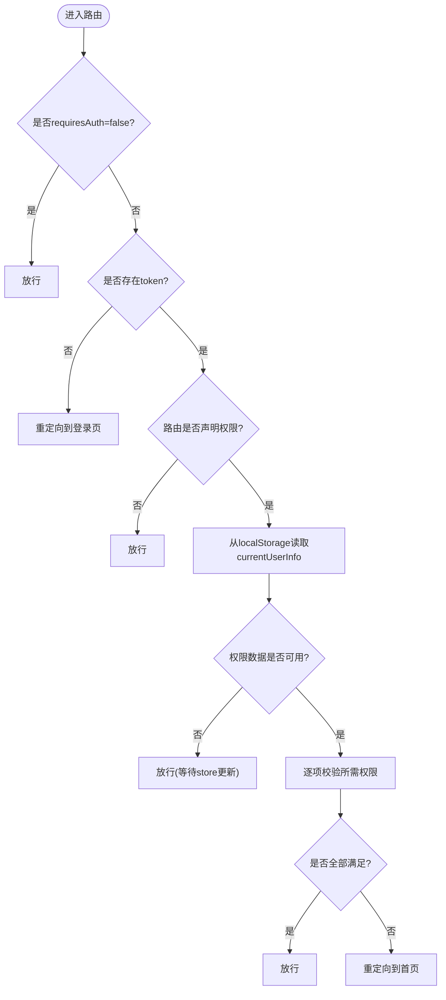
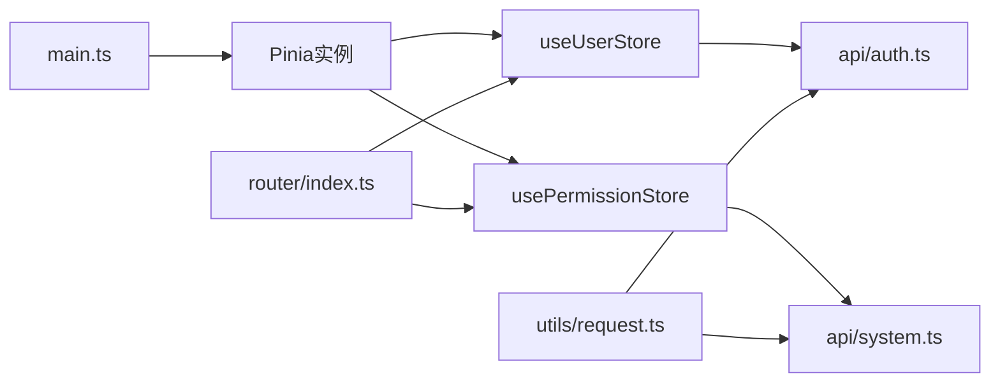

# 状态管理

<cite>
**本文引用的文件**
- [src/stores/index.ts](file://src/stores/index.ts)
- [src/stores/user.ts](file://src/stores/user.ts)
- [src/stores/permission.ts](file://src/stores/permission.ts)
- [src/main.ts](file://src/main.ts)
- [src/types/index.ts](file://src/types/index.ts)
- [src/api/auth.ts](file://src/api/auth.ts)
- [src/api/system.ts](file://src/api/system.ts)
- [src/router/index.ts](file://src/router/index.ts)
- [src/views/login/index.vue](file://src/views/login/index.vue)
- [src/views/dashboard/index.vue](file://src/views/dashboard/index.vue)
- [src/layouts/MainLayout.vue](file://src/layouts/MainLayout.vue)
- [src/utils/request.ts](file://src/utils/request.ts)
</cite>

## 目录
1. [简介](#简介)
2. [项目结构](#项目结构)
3. [核心组件](#核心组件)
4. [架构总览](#架构总览)
5. [详细组件分析](#详细组件分析)
6. [依赖关系分析](#依赖关系分析)
7. [性能考量](#性能考量)
8. [故障排查指南](#故障排查指南)
9. [结论](#结论)
10. [附录](#附录)

## 简介
本文件面向HC管理系统中的Pinia状态管理实现，系统性阐述状态管理在该系统中的作用与重要性，并围绕以下主题展开：
- 用户状态管理：多身份用户信息存储、权限缓存、Token管理
- 权限状态管理：权限数据结构、权限验证逻辑、动态权限更新
- 状态持久化策略与本地存储机制
- 状态管理最佳实践：状态设计原则、异步状态处理、状态调试方法
- 状态管理与组件通信的关系、性能优化考虑与常见问题解决方案

## 项目结构
本项目采用基于功能域的组织方式，状态管理位于src/stores目录，包含用户状态与权限状态两个核心store；路由与API层分别位于src/router与src/api目录；组件层位于src/views与src/layouts中；全局配置与工具位于src/main.ts与src/utils/request.ts。

图表来源
- [src/stores/user.ts:1-152](file://src/stores/user.ts#L1-L152)
- [src/stores/permission.ts:1-56](file://src/stores/permission.ts#L1-L56)
- [src/views/login/index.vue:1-323](file://src/views/login/index.vue#L1-L323)
- [src/views/dashboard/index.vue:1-160](file://src/views/dashboard/index.vue#L1-L160)
- [src/layouts/MainLayout.vue:1-281](file://src/layouts/MainLayout.vue#L1-L281)
- [src/router/index.ts:1-127](file://src/router/index.ts#L1-L127)
- [src/api/auth.ts:1-69](file://src/api/auth.ts#L1-L69)
- [src/api/system.ts:1-56](file://src/api/system.ts#L1-L56)
- [src/utils/request.ts:1-148](file://src/utils/request.ts#L1-L148)
- [src/main.ts:1-27](file://src/main.ts#L1-L27)

章节来源
- [src/stores/index.ts:1-3](file://src/stores/index.ts#L1-L3)
- [src/main.ts:1-27](file://src/main.ts#L1-L27)

## 核心组件
- 用户状态管理（useUserStore）
  - 负责Token管理、登录响应缓存、当前用户信息、用户类型判定、角色与权限集合、登录态检测、登出流程、从本地存储恢复状态、权限校验等。
- 权限状态管理（usePermissionStore）
  - 负责权限列表拉取、权限码集合构建、权限缓存初始化、权限存在性校验、权限状态清理等。
- 类型与数据结构
  - 定义了登录响应、当前用户信息、C/B端用户信息、权限响应、身份项等类型，支撑状态数据结构与API交互契约。

章节来源
- [src/stores/user.ts:7-151](file://src/stores/user.ts#L7-L151)
- [src/stores/permission.ts:7-55](file://src/stores/permission.ts#L7-L55)
- [src/types/index.ts:18-158](file://src/types/index.ts#L18-L158)

## 架构总览
下图展示从登录到路由守卫、再到主布局菜单渲染的完整状态流转路径，体现Pinia状态如何驱动UI与路由行为。

图表来源
- [src/views/login/index.vue:98-145](file://src/views/login/index.vue#L98-L145)
- [src/stores/user.ts:22-80](file://src/stores/user.ts#L22-L80)
- [src/api/auth.ts:62-68](file://src/api/auth.ts#L62-L68)
- [src/router/index.ts:82-124](file://src/router/index.ts#L82-L124)
- [src/layouts/MainLayout.vue:82-90](file://src/layouts/MainLayout.vue#L82-L90)
- [src/stores/permission.ts:36-38](file://src/stores/permission.ts#L36-L38)

## 详细组件分析

### 用户状态管理（useUserStore）
- 数据结构与职责
  - Token与登录响应：用于鉴权与用户身份识别，同时写入localStorage实现跨会话持久化。
  - 当前用户信息：包含用户类型、企业ID、角色与权限数组、C/B端用户信息等。
  - 计算属性：用户类型判定、是否为C/B/平台用户、角色与权限集合等。
- 关键方法
  - setToken：设置并持久化Token。
  - setLoginResponse：写入登录响应、设置Token、初始化用户信息骨架。
  - fetchUserInfo：拉取当前用户信息，兼容后端字段大小写差异，写入currentUserInfo并持久化。
  - logout：调用登出API，清理状态与localStorage，跳转登录。
  - clearUser：彻底清理用户相关状态与本地存储。
  - hasPermission/hasRole：快速权限/角色校验。
  - initFromStorage：启动时从localStorage恢复状态，优先currentUserInfo，其次loginResponse。
- 与组件通信
  - 登录页通过setLoginResponse写入状态并触发路由跳转。
  - 主布局在挂载时若缺少权限数据则主动拉取用户信息。
  - 仪表盘与主布局均通过计算属性读取用户信息与类型。
- 与API交互
  - 依赖认证API：登录、登出、获取当前用户信息。
  - 通过HTTP拦截器自动注入Authorization头，确保后续请求携带Token。

图表来源
- [src/stores/user.ts:7-151](file://src/stores/user.ts#L7-L151)
- [src/api/auth.ts:26-68](file://src/api/auth.ts#L26-L68)

章节来源
- [src/stores/user.ts:7-151](file://src/stores/user.ts#L7-L151)
- [src/views/login/index.vue:98-145](file://src/views/login/index.vue#L98-L145)
- [src/layouts/MainLayout.vue:82-90](file://src/layouts/MainLayout.vue#L82-L90)
- [src/utils/request.ts:37-101](file://src/utils/request.ts#L37-L101)

### 权限状态管理（usePermissionStore）
- 数据结构与职责
  - 权限列表与权限码集合：用于快速判断权限存在性。
  - isLoaded：标记权限是否已加载，便于组件在加载完成后再进行渲染或校验。
- 关键方法
  - fetchPermissions：拉取权限列表，构建权限码集合，标记已加载。
  - initPermission：调用后端接口初始化权限缓存，成功后提示消息。
  - hasPermission：基于权限码集合进行存在性判断。
  - clearPermissions：清空权限状态，重置加载标志。
- 与组件通信
  - 主布局根据权限码集合动态过滤可显示菜单项。
  - 路由守卫结合用户权限与路由meta.permissions进行二次校验。

图表来源
- [src/stores/permission.ts:12-38](file://src/stores/permission.ts#L12-L38)

章节来源
- [src/stores/permission.ts:7-55](file://src/stores/permission.ts#L7-L55)
- [src/layouts/MainLayout.vue:45-64](file://src/layouts/MainLayout.vue#L45-L64)
- [src/router/index.ts:96-115](file://src/router/index.ts#L96-L115)

### 路由守卫与权限校验
- 登录态校验：未登录时重定向至登录页。
- 权限校验：当路由meta.permissions存在时，读取localStorage中的currentUserInfo，若存在权限数据则逐项校验，否则放行（等待页面加载后store更新再判断）。
- 登录页保护：已登录用户直接重定向至仪表盘。

图表来源
- [src/router/index.ts:82-124](file://src/router/index.ts#L82-L124)

章节来源
- [src/router/index.ts:82-124](file://src/router/index.ts#L82-L124)

### 组件通信与状态使用
- 登录页：接收表单输入，调用认证API，写入用户状态，随后跳转。
- 主布局：根据用户类型与权限码集合动态生成菜单；在挂载时若缺少权限数据则主动拉取用户信息。
- 仪表盘：读取用户类型与用户信息，展示欢迎语与系统信息。

章节来源
- [src/views/login/index.vue:98-145](file://src/views/login/index.vue#L98-L145)
- [src/layouts/MainLayout.vue:45-90](file://src/layouts/MainLayout.vue#L45-L90)
- [src/views/dashboard/index.vue:13-28](file://src/views/dashboard/index.vue#L13-L28)

## 依赖关系分析
- 应用入口与状态注册
  - 在main.ts中创建Pinia实例并挂载，随后调用useUserStore并执行initFromStorage，确保启动即恢复用户状态。
- 状态与API
  - 用户状态依赖认证API进行登录、登出、获取当前用户信息。
  - 权限状态依赖系统API进行权限列表与缓存初始化。
- 状态与路由
  - 路由守卫读取localStorage中的token与currentUserInfo，结合store中的权限进行二次校验。
- 状态与HTTP拦截器
  - 请求拦截器自动注入Authorization头，响应拦截器统一处理401等异常，保障状态与网络层的一致性。

图表来源
- [src/main.ts:19-26](file://src/main.ts#L19-L26)
- [src/stores/user.ts:1-6](file://src/stores/user.ts#L1-L6)
- [src/stores/permission.ts:1-5](file://src/stores/permission.ts#L1-L5)
- [src/router/index.ts:1-10](file://src/router/index.ts#L1-L10)
- [src/utils/request.ts:1-15](file://src/utils/request.ts#L1-L15)

章节来源
- [src/main.ts:19-26](file://src/main.ts#L19-L26)
- [src/utils/request.ts:37-101](file://src/utils/request.ts#L37-L101)

## 性能考量
- 状态粒度与计算属性
  - 使用computed派生用户类型、角色与权限集合，避免重复计算与冗余数据。
- 异步加载与懒加载
  - 用户信息仅在必要时拉取，避免不必要的网络请求。
- 本地存储与启动恢复
  - 启动时从localStorage恢复状态，减少首次加载的等待时间。
- 菜单渲染优化
  - 主布局根据权限码集合过滤菜单项，避免渲染无权限路由。
- HTTP拦截器
  - 统一处理401等异常，避免组件内重复处理，提升一致性与可维护性。

## 故障排查指南
- 登录后仍被重定向到登录页
  - 检查localStorage中token是否存在；确认setToken与setLoginResponse是否正确执行。
  - 参考：[src/stores/user.ts:22-40](file://src/stores/user.ts#L22-L40)，[src/router/index.ts:90-94](file://src/router/index.ts#L90-L94)
- 无法进入受权限保护的页面
  - 检查路由meta.permissions与用户权限集合；确认fetchUserInfo是否成功拉取权限数据。
  - 参考：[src/router/index.ts:96-115](file://src/router/index.ts#L96-L115)，[src/stores/user.ts:41-60](file://src/stores/user.ts#L41-L60)
- 登录成功但菜单不显示
  - 检查usePermissionStore的isLoaded与权限码集合；确认initPermission与fetchPermissions是否执行。
  - 参考：[src/stores/permission.ts:12-38](file://src/stores/permission.ts#L12-L38)，[src/layouts/MainLayout.vue:45-64](file://src/layouts/MainLayout.vue#L45-L64)
- Token过期导致请求失败
  - 检查HTTP拦截器对401的处理逻辑，确认是否正确清除localStorage并跳转登录。
  - 参考：[src/utils/request.ts:20-35](file://src/utils/request.ts#L20-L35)，[src/utils/request.ts:50-101](file://src/utils/request.ts#L50-L101)

章节来源
- [src/stores/user.ts:22-80](file://src/stores/user.ts#L22-L80)
- [src/router/index.ts:90-115](file://src/router/index.ts#L90-L115)
- [src/stores/permission.ts:12-38](file://src/stores/permission.ts#L12-L38)
- [src/layouts/MainLayout.vue:45-64](file://src/layouts/MainLayout.vue#L45-L64)
- [src/utils/request.ts:20-35](file://src/utils/request.ts#L20-L35)

## 结论
本系统通过Pinia实现了清晰的用户与权限状态管理，配合路由守卫与HTTP拦截器，形成了“登录态—用户信息—权限—菜单/路由”的闭环。状态持久化与启动恢复提升了用户体验，而计算属性与懒加载策略有效降低了性能开销。建议在后续迭代中进一步完善权限动态更新与状态调试工具，以增强系统的可观测性与可维护性。

## 附录
- 状态设计原则
  - 单一职责：用户状态与权限状态分离，职责边界清晰。
  - 不可变性：通过ref与computed管理状态，避免直接修改引用。
  - 可恢复性：所有关键状态均持久化到localStorage，启动时恢复。
- 异步状态处理
  - 使用async/await处理登录与信息拉取，捕获错误并反馈。
  - 路由守卫与组件内均进行权限校验，保证一致性。
- 状态调试方法
  - 在开发环境下打印localStorage中的关键键值（token、userInfo、currentUserInfo）。
  - 使用浏览器开发者工具观察Pinia状态变化与组件渲染时机。
- 最佳实践
  - 将权限校验前置到路由守卫，组件内仅做UI渲染。
  - 对于敏感操作，先检查权限再发起请求。
  - 统一处理401等异常，避免状态与UI不同步。