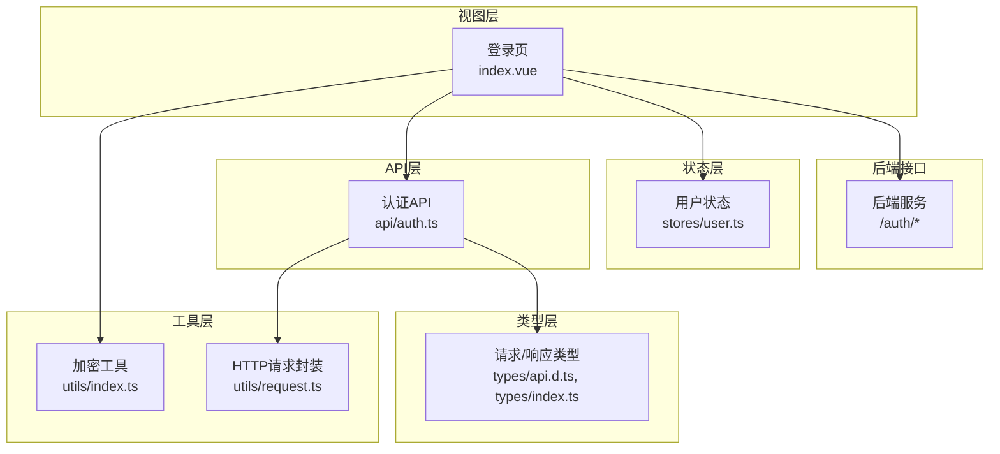
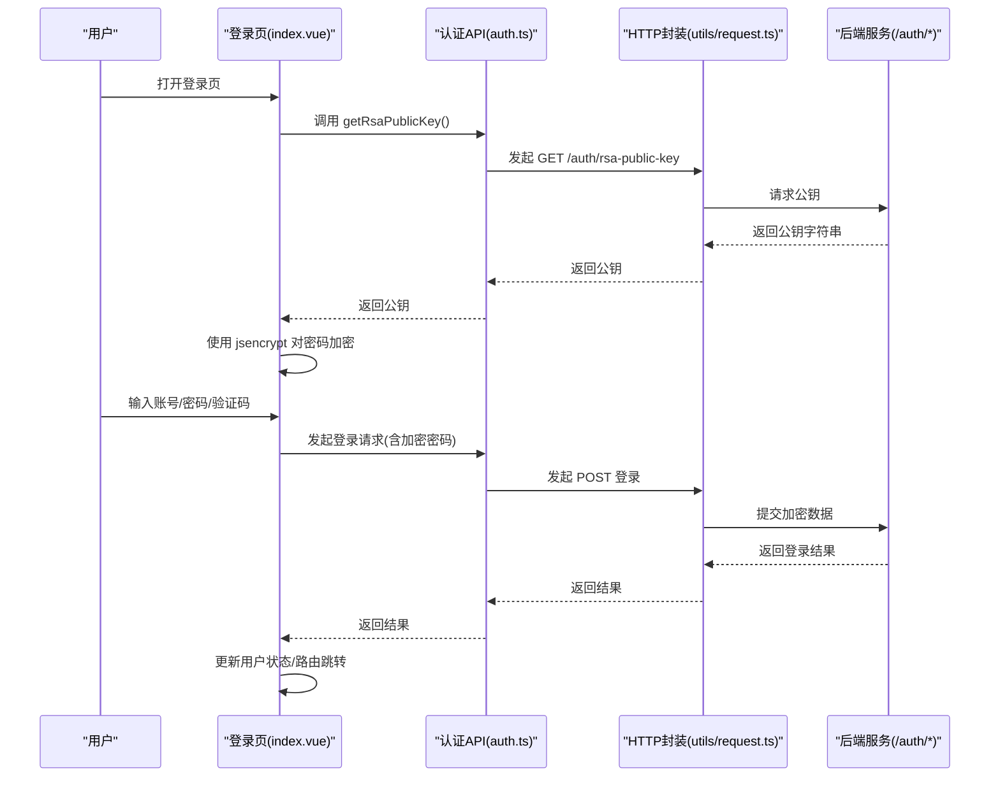
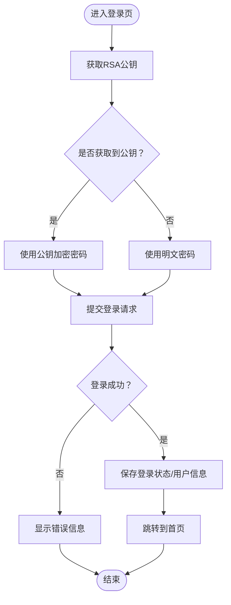
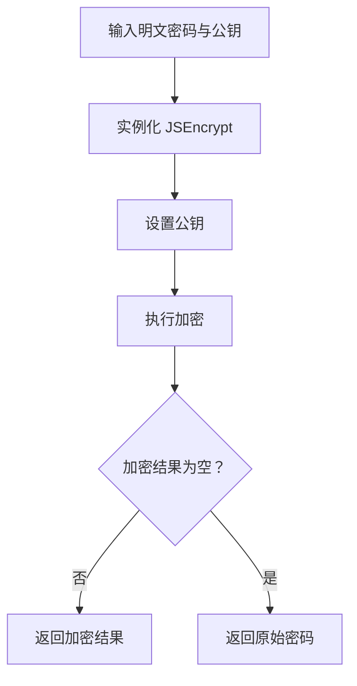
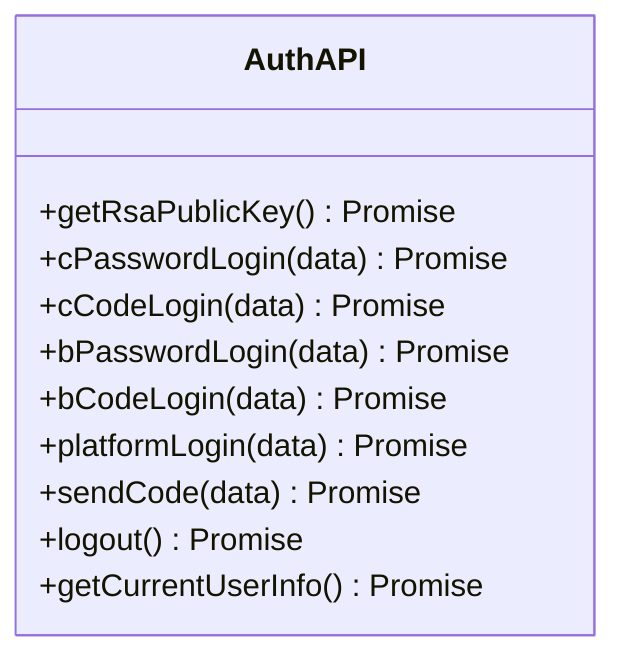
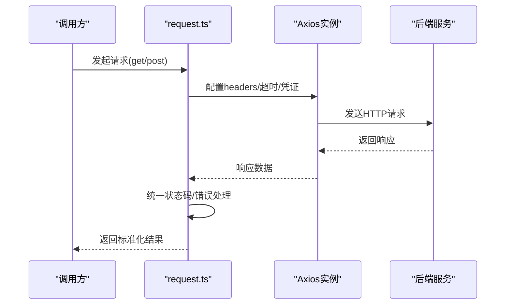
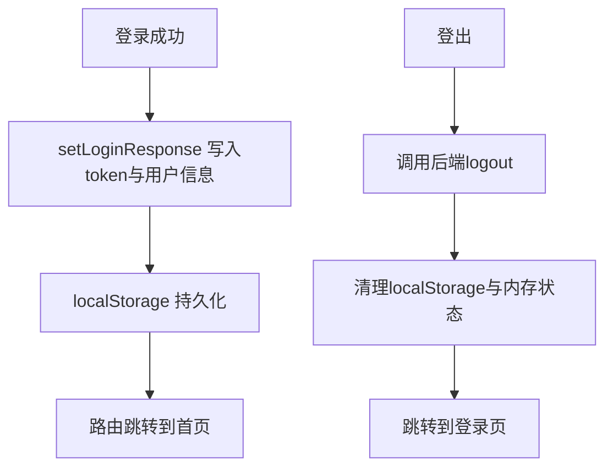
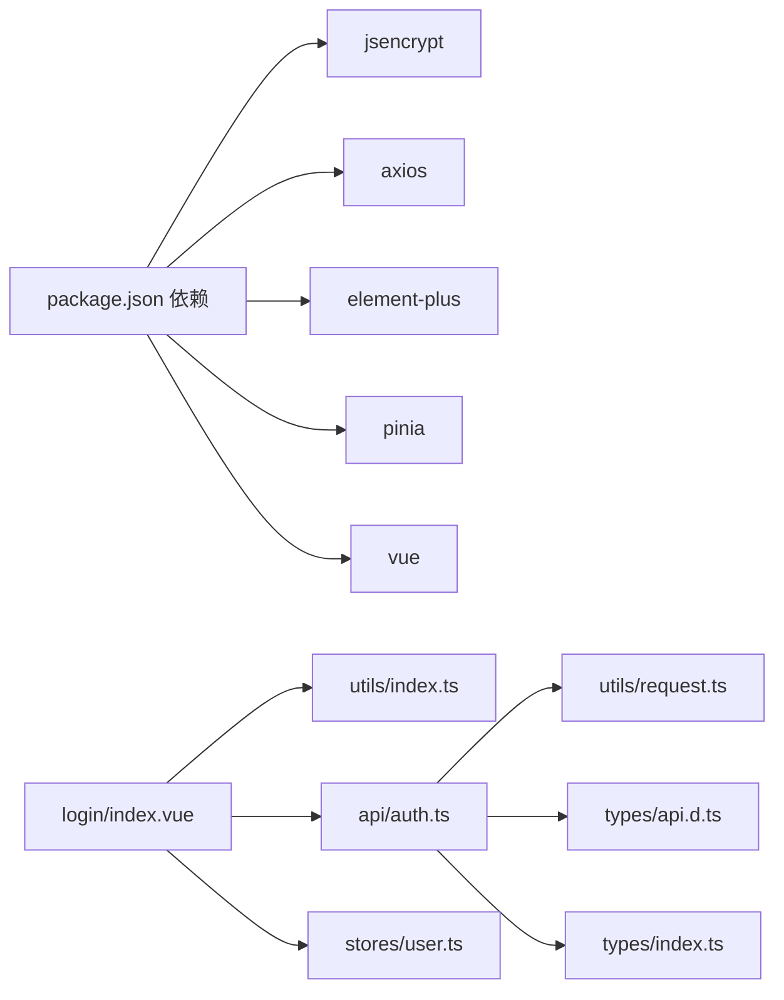

# RSA加密传输

<cite>
**本文引用的文件列表**
- [src/api/auth.ts](file://src/api/auth.ts)
- [src/utils/request.ts](file://src/utils/request.ts)
- [src/views/login/index.vue](file://src/views/login/index.vue)
- [src/utils/index.ts](file://src/utils/index.ts)
- [src/stores/user.ts](file://src/stores/user.ts)
- [src/types/api.d.ts](file://src/types/api.d.ts)
- [src/types/index.ts](file://src/types/index.ts)
- [package.json](file://package.json)
- [vite.config.ts](file://vite.config.ts)
- [默认模块.md](file://默认模块.md)
</cite>

## 目录
1. [简介](#简介)
2. [项目结构](#项目结构)
3. [核心组件](#核心组件)
4. [架构总览](#架构总览)
5. [详细组件分析](#详细组件分析)
6. [依赖关系分析](#依赖关系分析)
7. [性能考量](#性能考量)
8. [故障排查指南](#故障排查指南)
9. [结论](#结论)
10. [附录](#附录)

## 简介
本文件面向“RSA加密传输系统”的前端实现，聚焦于认证流程中RSA公钥获取、前端使用公钥对密码进行加密、后端使用私钥解密的完整链路。文档将从系统架构、组件职责、数据流与处理逻辑、错误处理与安全最佳实践等维度进行深入说明，并提供可视化图示与排障建议，帮助开发者快速理解与维护该功能。

## 项目结构
该项目采用典型的Vue 3 + Vite + Pinia + Element Plus 前端架构，认证相关的RSA加密流程主要分布在以下模块：
- 视图层：登录页负责触发公钥获取与密码加密，并提交登录请求
- 工具层：封装RSA加密工具函数
- API层：封装HTTP请求与认证相关接口
- 存储层：Pinia状态管理，持久化用户会话信息
- 类型层：统一的响应与请求体类型定义

图表来源
- [src/views/login/index.vue:1-159](file://src/views/login/index.vue#L1-L159)
- [src/utils/index.ts:1-8](file://src/utils/index.ts#L1-L8)
- [src/utils/request.ts:1-148](file://src/utils/request.ts#L1-L148)
- [src/api/auth.ts:1-69](file://src/api/auth.ts#L1-L69)
- [src/stores/user.ts:1-152](file://src/stores/user.ts#L1-L152)
- [src/types/api.d.ts:1-156](file://src/types/api.d.ts#L1-L156)
- [src/types/index.ts:1-188](file://src/types/index.ts#L1-L188)

章节来源
- [src/views/login/index.vue:1-159](file://src/views/login/index.vue#L1-L159)
- [src/utils/index.ts:1-8](file://src/utils/index.ts#L1-L8)
- [src/utils/request.ts:1-148](file://src/utils/request.ts#L1-L148)
- [src/api/auth.ts:1-69](file://src/api/auth.ts#L1-L69)
- [src/stores/user.ts:1-152](file://src/stores/user.ts#L1-L152)
- [src/types/api.d.ts:1-156](file://src/types/api.d.ts#L1-L156)
- [src/types/index.ts:1-188](file://src/types/index.ts#L1-L188)

## 核心组件
- 登录页（index.vue）：负责初始化公钥、收集表单数据、调用加密工具、发起登录请求、处理登录成功后的状态更新与路由跳转
- 加密工具（utils/index.ts）：基于 jsencrypt 库，提供RSA公钥加密能力
- 认证API（api/auth.ts）：封装与后端交互的认证接口，包括获取RSA公钥、各类登录方式等
- HTTP请求封装（utils/request.ts）：统一拦截器、错误处理、超时与凭证设置
- 用户状态（stores/user.ts）：登录态持久化、用户信息拉取与清理
- 类型定义（types/api.d.ts, types/index.ts）：统一的请求/响应结构，便于前后端契约一致

章节来源
- [src/views/login/index.vue:1-159](file://src/views/login/index.vue#L1-L159)
- [src/utils/index.ts:1-8](file://src/utils/index.ts#L1-L8)
- [src/api/auth.ts:1-69](file://src/api/auth.ts#L1-L69)
- [src/utils/request.ts:1-148](file://src/utils/request.ts#L1-L148)
- [src/stores/user.ts:1-152](file://src/stores/user.ts#L1-L152)
- [src/types/api.d.ts:1-156](file://src/types/api.d.ts#L1-L156)
- [src/types/index.ts:1-188](file://src/types/index.ts#L1-L188)

## 架构总览
下图展示了RSA加密在认证流程中的端到端交互：前端先获取公钥，再用公钥加密敏感字段（如密码），最后将加密后的数据提交给后端；后端使用私钥解密并完成认证。

图表来源
- [src/views/login/index.vue:147-158](file://src/views/login/index.vue#L147-L158)
- [src/api/auth.ts:22-24](file://src/api/auth.ts#L22-L24)
- [src/utils/request.ts:111-127](file://src/utils/request.ts#L111-L127)
- [默认模块.md:30-46](file://默认模块.md#L30-L46)

## 详细组件分析

### 组件A：登录页（index.vue）
- 职责
  - 初始化加载：页面挂载时自动获取一次RSA公钥，缓存至本地状态
  - 表单校验与交互：根据登录类型与模式切换显示不同字段
  - 密码加密：若已获取公钥，则对明文密码进行RSA加密后再提交
  - 登录提交：按不同登录类型与模式调用对应API
  - 成功处理：保存登录响应、更新用户状态、跳转首页
- 关键流程
  - 获取公钥：调用 getRsaPublicKey() 并将返回的公钥字符串保存
  - 加密密码：调用 encryptPassword(password, publicKey)
  - 登录请求：根据 loginType 与 loginMode 分支调用 c/b/platform 的密码/验证码登录
  - 错误处理：捕获异常并打印日志，避免阻断UI
- 安全注意
  - 仅在存在公钥时才加密密码，否则回退为明文（兼容性与降级）
  - 登录成功后通过 Pinia 与本地存储持久化令牌与用户信息

图表来源
- [src/views/login/index.vue:98-145](file://src/views/login/index.vue#L98-L145)
- [src/views/login/index.vue:147-158](file://src/views/login/index.vue#L147-L158)

章节来源
- [src/views/login/index.vue:1-159](file://src/views/login/index.vue#L1-L159)

### 组件B：加密工具（utils/index.ts）
- 职责
  - 封装RSA加密：基于 jsencrypt 库，设置公钥并执行加密
  - 失败回退：若加密失败则回退为原始密码，保证兼容性
- 实现要点
  - 使用 JSEncrypt 实例化并设置公钥
  - 调用 encrypt 方法对明文密码进行加密
  - 若加密结果为空则返回原密码，避免空值导致请求失败

图表来源
- [src/utils/index.ts:3-7](file://src/utils/index.ts#L3-L7)

章节来源
- [src/utils/index.ts:1-8](file://src/utils/index.ts#L1-L8)

### 组件C：认证API（api/auth.ts）
- 职责
  - 暴露认证相关接口：获取RSA公钥、C/B/平台用户登录、验证码发送、退出登录、获取当前用户信息等
  - 与HTTP封装协作：通过 get/post 统一发起请求
- 关键接口
  - getRsaPublicKey：获取RSA公钥
  - cPasswordLogin/bPasswordLogin/platformLogin：密码登录
  - cCodeLogin/bCodeLogin：验证码登录
  - sendCode/logout/getCurrentUserInfo：辅助功能

图表来源
- [src/api/auth.ts:1-69](file://src/api/auth.ts#L1-L69)

章节来源
- [src/api/auth.ts:1-69](file://src/api/auth.ts#L1-L69)

### 组件D：HTTP请求封装（utils/request.ts）
- 职责
  - 统一Axios实例：基础URL、超时、凭证、请求头
  - 请求拦截：自动注入Authorization头
  - 响应拦截：统一状态码处理、错误提示、未授权处理
  - 便捷方法：get/post/put/del
- 安全与健壮性
  - withCredentials: true 支持跨域携带Cookie
  - 401统一弹窗引导重新登录
  - 详细的错误分类提示

图表来源
- [src/utils/request.ts:1-148](file://src/utils/request.ts#L1-L148)

章节来源
- [src/utils/request.ts:1-148](file://src/utils/request.ts#L1-L148)

### 组件E：用户状态（stores/user.ts）
- 职责
  - 管理登录态：token、用户信息、登录响应
  - 持久化：localStorage存储与恢复
  - 权限与角色：计算属性派生用户类型、角色、权限
  - 登出：调用后端登出接口并清理本地状态
- 与登录页协作
  - 登录成功后调用 setLoginResponse，写入token与用户信息
  - 登出时清理本地存储并跳转登录页

图表来源
- [src/stores/user.ts:22-80](file://src/stores/user.ts#L22-L80)

章节来源
- [src/stores/user.ts:1-152](file://src/stores/user.ts#L1-L152)

### 组件F：类型定义（types/api.d.ts, types/index.ts）
- 职责
  - 统一响应结构 ResponseData
  - 登录请求体与返回体类型定义
  - 用户信息与身份信息类型
- 作用
  - 保证前后端契约一致，减少联调成本
  - 在登录页与API层中被复用

章节来源
- [src/types/api.d.ts:1-156](file://src/types/api.d.ts#L1-L156)
- [src/types/index.ts:1-188](file://src/types/index.ts#L1-L188)

## 依赖关系分析
- 外部依赖
  - jsencrypt：RSA加密库
  - axios：HTTP客户端
  - element-plus：UI组件库
  - pinia/vue-router：状态与路由
- 内部依赖
  - 登录页依赖加密工具与认证API
  - 认证API依赖HTTP封装
  - 用户状态依赖认证API与路由
  - 类型定义被API与视图共同引用

图表来源
- [package.json:13-22](file://package.json#L13-L22)
- [src/views/login/index.vue:1-10](file://src/views/login/index.vue#L1-L10)
- [src/utils/index.ts](file://src/utils/index.ts#L1)
- [src/api/auth.ts:1-20](file://src/api/auth.ts#L1-L20)
- [src/utils/request.ts:1-10](file://src/utils/request.ts#L1-L10)
- [src/stores/user.ts:1-5](file://src/stores/user.ts#L1-L5)
- [src/types/api.d.ts:1-20](file://src/types/api.d.ts#L1-L20)
- [src/types/index.ts:1-7](file://src/types/index.ts#L1-L7)

章节来源
- [package.json:1-35](file://package.json#L1-L35)
- [vite.config.ts:1-46](file://vite.config.ts#L1-L46)

## 性能考量
- 加密开销
  - RSA加密属于非对称加密，计算开销高于对称加密，但仅在登录阶段使用，对整体性能影响有限
  - 建议：公钥获取与缓存策略可减少重复请求
- 网络与超时
  - HTTP封装设置了30秒超时，确保长时间无响应时及时反馈
  - 建议：在弱网环境下适当调整超时时间
- UI渲染
  - 登录页在提交时设置loading，避免重复提交
  - 建议：对频繁操作（如验证码倒计时）使用节流/防抖

[本节为通用性能讨论，不直接分析具体文件]

## 故障排查指南
- 公钥获取失败
  - 现象：登录页无法获取公钥，密码加密不可用
  - 排查：确认后端 /auth/rsa-public-key 接口可用；检查代理配置与跨域设置
  - 参考：接口文档与前端调用路径
- 密码加密失败
  - 现象：加密返回空或报错
  - 排查：确认公钥格式正确；检查 jsencrypt 版本；观察加密工具回退逻辑
- 登录请求失败
  - 现象：400/401/403等错误
  - 排查：查看HTTP封装的错误拦截与消息提示；确认后端接口签名与参数
- 登录成功但无状态
  - 现象：页面无token或用户信息
  - 排查：确认登录响应结构；检查用户状态写入与localStorage持久化

章节来源
- [src/views/login/index.vue:147-158](file://src/views/login/index.vue#L147-L158)
- [src/utils/index.ts:3-7](file://src/utils/index.ts#L3-L7)
- [src/utils/request.ts:50-101](file://src/utils/request.ts#L50-L101)
- [src/stores/user.ts:22-80](file://src/stores/user.ts#L22-L80)
- [默认模块.md:30-46](file://默认模块.md#L30-L46)

## 结论
本项目通过“前端获取公钥 + 前端RSA加密 + 后端私钥解密”的方式，在登录阶段实现了对敏感信息的安全传输。登录页负责初始化与交互，加密工具提供RSA加密能力，API层与HTTP封装保障请求一致性与错误处理，状态层负责登录态与用户信息的持久化。整体架构清晰、职责明确，具备良好的扩展性与可维护性。

[本节为总结性内容，不直接分析具体文件]

## 附录

### RSA加密选择与安全考量
- 选择原因
  - 非对称加密适合在客户端进行敏感数据加密，避免明文在网络上传输
  - 与后端配合，仅在登录阶段使用，降低整体复杂度
- 安全性
  - 公钥可公开，私钥必须严格保密
  - 建议：定期轮换密钥对；限制公钥有效期；在HTTPS环境下传输
- 性能影响
  - 单次登录阶段的加密开销可接受；建议优化为一次性获取并缓存公钥

[本节为概念性说明，不直接分析具体文件]

### 接口与实现要点
- 公钥获取接口
  - 路径：/auth/rsa-public-key
  - 返回：包含公钥字符串的响应对象
  - 前端调用：getRsaPublicKey()
- 加密工具函数
  - 函数：encryptPassword(password, publicKey)
  - 行为：设置公钥并加密，失败回退为原始密码
- 登录流程
  - 获取公钥 -> 加密密码 -> 提交登录 -> 成功后持久化状态

章节来源
- [默认模块.md:30-46](file://默认模块.md#L30-L46)
- [src/api/auth.ts:22-24](file://src/api/auth.ts#L22-L24)
- [src/utils/index.ts:3-7](file://src/utils/index.ts#L3-L7)
- [src/views/login/index.vue:98-145](file://src/views/login/index.vue#L98-L145)