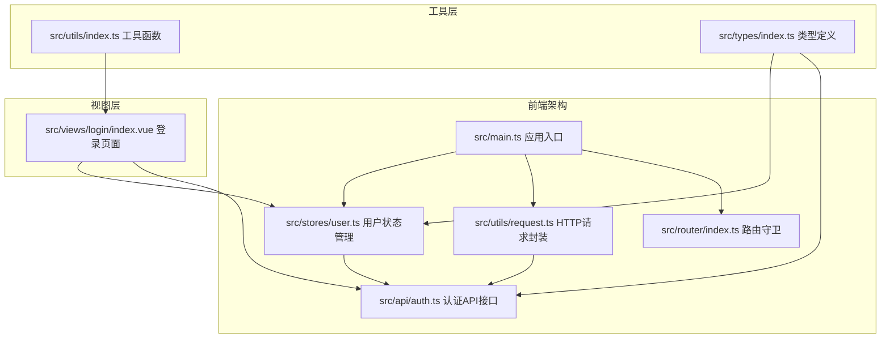
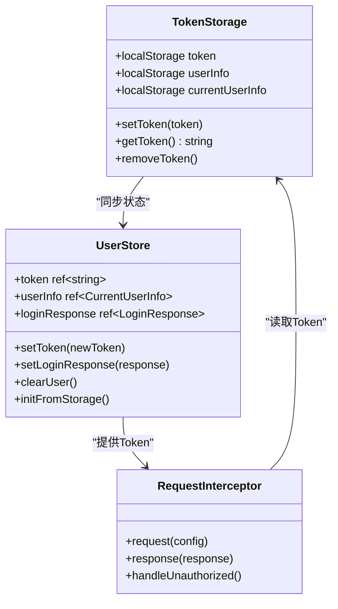
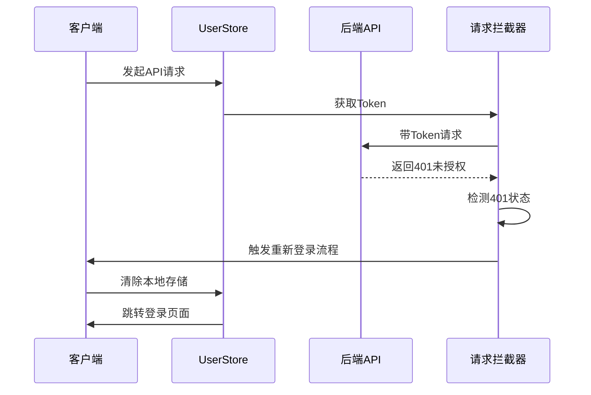
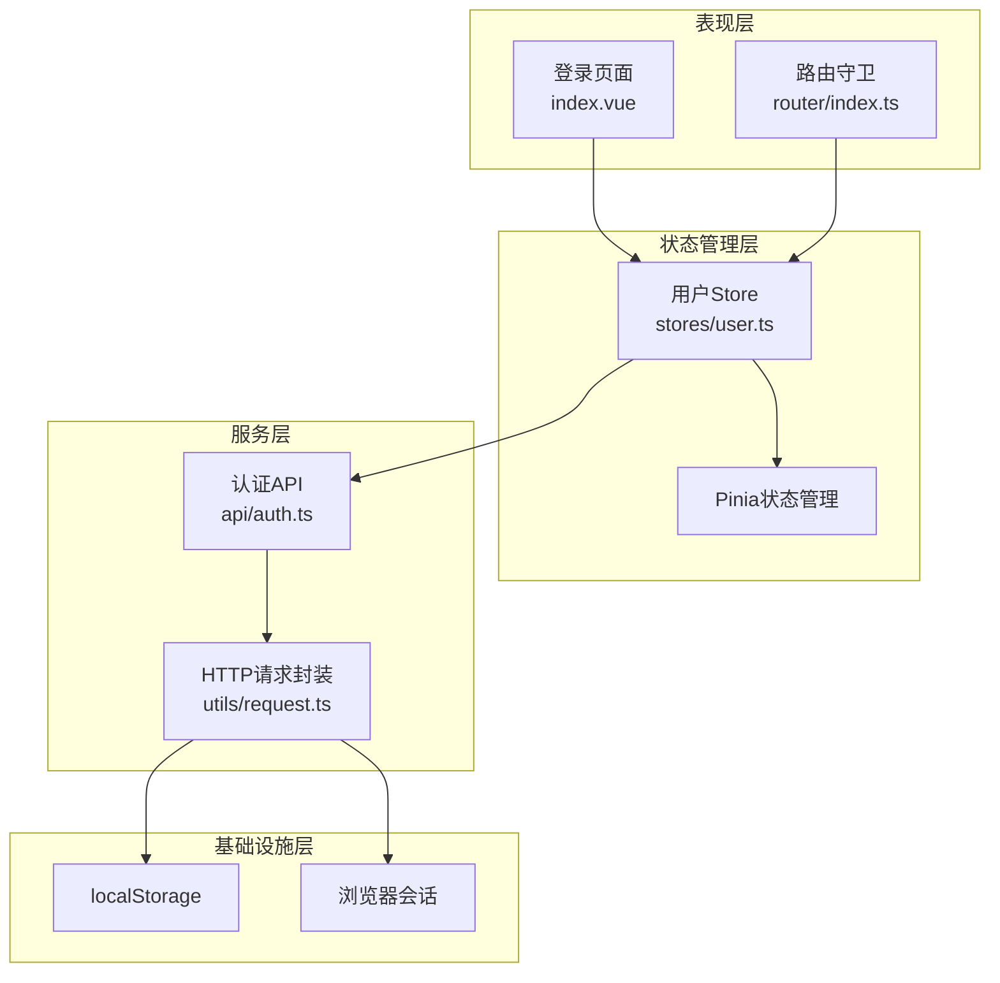
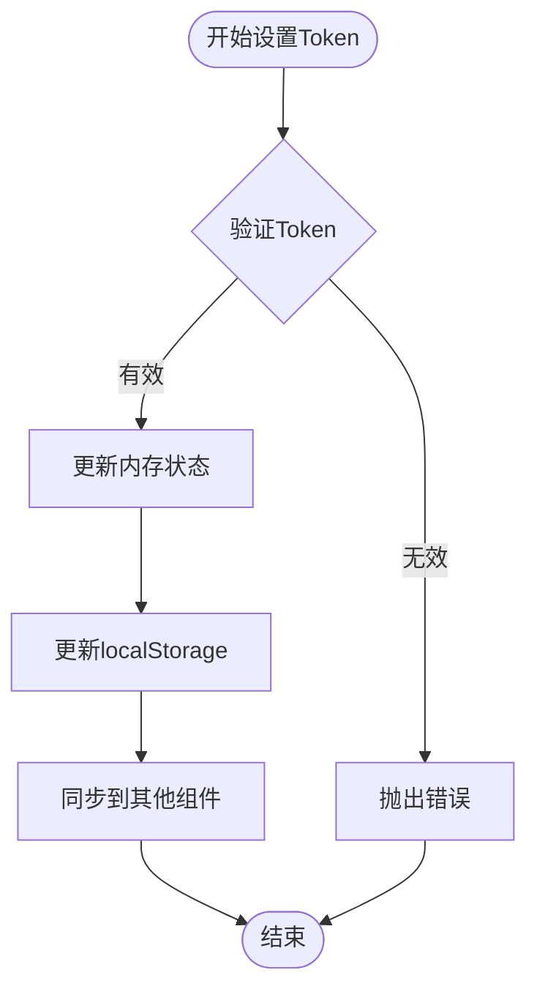
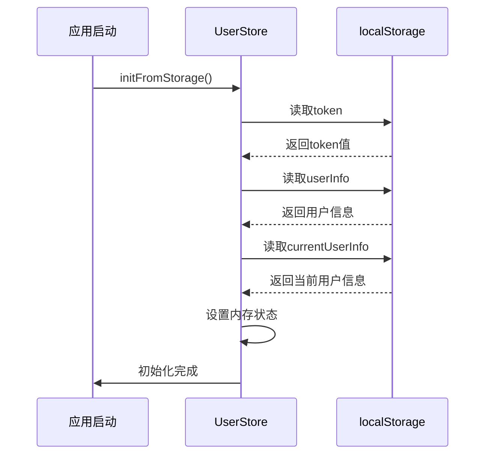
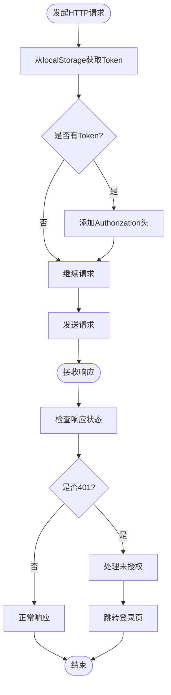
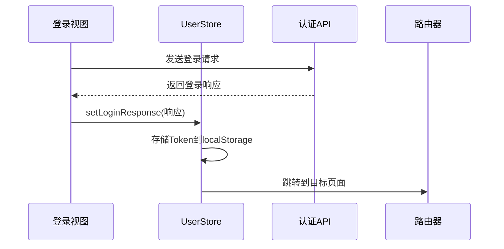
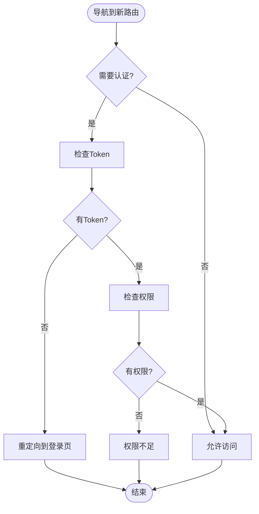
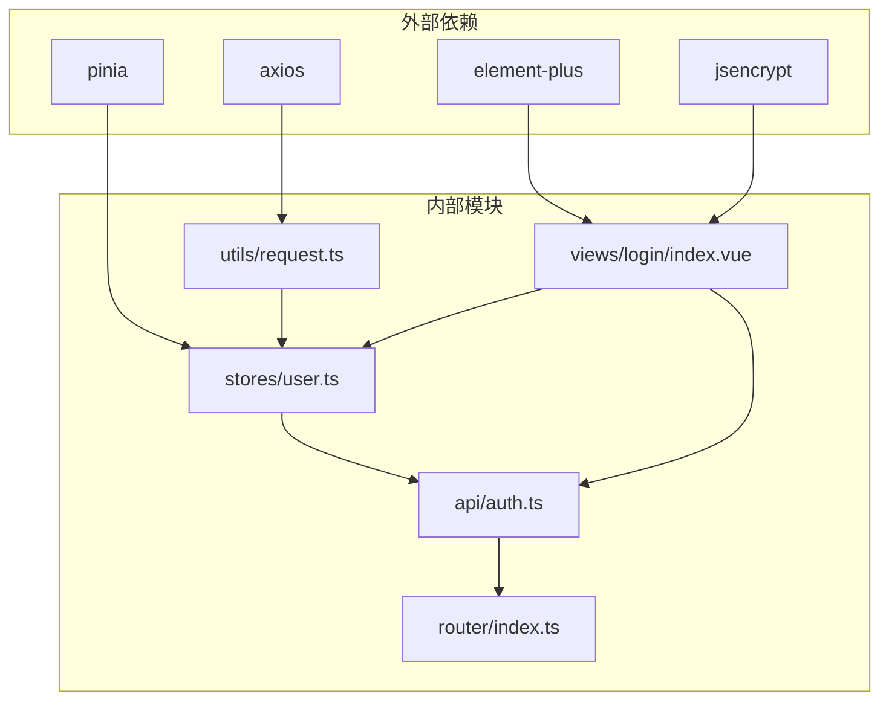

# Token管理机制

<cite>
**本文档引用的文件**
- [src/utils/request.ts](file://src/utils/request.ts)
- [src/stores/user.ts](file://src/stores/user.ts)
- [src/api/auth.ts](file://src/api/auth.ts)
- [src/router/index.ts](file://src/router/index.ts)
- [src/main.ts](file://src/main.ts)
- [src/views/login/index.vue](file://src/views/login/index.vue)
- [src/utils/index.ts](file://src/utils/index.ts)
- [src/types/index.ts](file://src/types/index.ts)
- [package.json](file://package.json)
</cite>

## 目录
1. [简介](#简介)
2. [项目结构](#项目结构)
3. [核心组件](#核心组件)
4. [架构概览](#架构概览)
5. [详细组件分析](#详细组件分析)
6. [依赖关系分析](#依赖关系分析)
7. [性能考虑](#性能考虑)
8. [故障排除指南](#故障排除指南)
9. [结论](#结论)

## 简介

本项目实现了完整的Token管理机制，包括Token的获取、存储、刷新、失效处理的完整生命周期。系统采用localStorage作为主要存储介质，通过Axios拦截器自动处理请求头中的Token传递，并提供了完善的错误处理和异常恢复机制。

## 项目结构

项目采用典型的Vue 3 + TypeScript + Pinia架构，Token管理相关的文件分布如下：

**图表来源**
- [src/main.ts:1-27](file://src/main.ts#L1-L27)
- [src/stores/user.ts:1-152](file://src/stores/user.ts#L1-L152)
- [src/utils/request.ts:1-148](file://src/utils/request.ts#L1-L148)

**章节来源**
- [src/main.ts:1-27](file://src/main.ts#L1-L27)
- [package.json:1-35](file://package.json#L1-L35)

## 核心组件

### Token存储策略

系统采用localStorage作为主要的Token存储介质，同时在内存中使用Pinia进行状态管理：

**图表来源**
- [src/stores/user.ts:22-25](file://src/stores/user.ts#L22-L25)
- [src/stores/user.ts:90-127](file://src/stores/user.ts#L90-L127)
- [src/utils/request.ts:37-48](file://src/utils/request.ts#L37-L48)

### 过期检测机制

系统通过HTTP响应码和Axios拦截器实现Token过期检测：

**图表来源**
- [src/utils/request.ts:50-70](file://src/utils/request.ts#L50-L70)
- [src/stores/user.ts:73-80](file://src/stores/user.ts#L73-L80)

**章节来源**
- [src/stores/user.ts:1-152](file://src/stores/user.ts#L1-L152)
- [src/utils/request.ts:1-148](file://src/utils/request.ts#L1-L148)

## 架构概览

系统采用分层架构设计，Token管理贯穿所有层次：

**图表来源**
- [src/views/login/index.vue:1-323](file://src/views/login/index.vue#L1-L323)
- [src/router/index.ts:82-124](file://src/router/index.ts#L82-L124)
- [src/stores/user.ts:1-152](file://src/stores/user.ts#L1-L152)
- [src/api/auth.ts:1-69](file://src/api/auth.ts#L1-L69)
- [src/utils/request.ts:1-148](file://src/utils/request.ts#L1-L148)

## 详细组件分析

### 用户状态管理（UserStore）

UserStore是Token管理的核心组件，负责Token的存储、更新和状态同步：

#### Token设置与更新流程

**图表来源**
- [src/stores/user.ts:22-25](file://src/stores/user.ts#L22-L25)
- [src/stores/user.ts:27-39](file://src/stores/user.ts#L27-L39)

#### 初始化流程

系统在应用启动时自动从localStorage恢复用户状态：

**图表来源**
- [src/stores/user.ts:90-127](file://src/stores/user.ts#L90-L127)
- [src/main.ts:23-24](file://src/main.ts#L23-L24)

**章节来源**
- [src/stores/user.ts:1-152](file://src/stores/user.ts#L1-L152)

### HTTP请求拦截器

请求拦截器负责自动添加Token到请求头，并处理认证相关的错误：

#### 请求拦截流程

**图表来源**
- [src/utils/request.ts:37-48](file://src/utils/request.ts#L37-L48)
- [src/utils/request.ts:50-70](file://src/utils/request.ts#L50-L70)

#### 未授权处理机制

当检测到401状态时，系统会弹出确认对话框并清除所有用户相关数据：

**章节来源**
- [src/utils/request.ts:1-148](file://src/utils/request.ts#L1-L148)

### 认证API接口

认证相关的API接口提供了完整的登录、登出和用户信息获取功能：

#### 登录流程

**图表来源**
- [src/views/login/index.vue:98-145](file://src/views/login/index.vue#L98-L145)
- [src/stores/user.ts:27-39](file://src/stores/user.ts#L27-L39)

**章节来源**
- [src/api/auth.ts:1-69](file://src/api/auth.ts#L1-L69)
- [src/views/login/index.vue:1-323](file://src/views/login/index.vue#L1-L323)

### 路由守卫

路由守卫确保只有认证用户才能访问受保护的页面：

#### 路由守卫逻辑

**图表来源**
- [src/router/index.ts:82-124](file://src/router/index.ts#L82-L124)

**章节来源**
- [src/router/index.ts:1-127](file://src/router/index.ts#L1-L127)

## 依赖关系分析

系统各组件之间的依赖关系如下：

**图表来源**
- [package.json:13-22](file://package.json#L13-L22)
- [src/utils/request.ts:1](file://src/utils/request.ts#L1)
- [src/stores/user.ts:1](file://src/stores/user.ts#L1)

**章节来源**
- [package.json:1-35](file://package.json#L1-L35)

## 性能考虑

### Token存储优化

系统采用localStorage进行Token持久化，具有以下优势：
- **快速访问**：localStorage读写速度较快
- **持久存储**：浏览器关闭后数据仍然存在
- **简单实现**：无需复杂的加密处理

### 内存状态同步

使用Pinia进行内存状态管理，确保：
- **响应式更新**：UI组件能够实时响应Token变化
- **状态一致性**：避免localStorage和内存状态不一致的问题
- **类型安全**：TypeScript提供编译时类型检查

## 故障排除指南

### 常见问题及解决方案

#### Token丢失问题

**症状**：用户登录后立即被重定向到登录页
**原因**：localStorage被意外清理或浏览器隐私模式
**解决方案**：
1. 检查浏览器localStorage是否可用
2. 验证应用是否正确初始化用户状态
3. 确认没有其他脚本清理localStorage

#### 401错误频繁出现

**症状**：用户频繁收到登录过期提示
**原因**：Token过期或服务器时间不同步
**解决方案**：
1. 检查服务器时间设置
2. 验证Token的有效期配置
3. 实现Token自动刷新机制

#### 跨标签页同步问题

**症状**：在一个标签页登录，在另一个标签页显示未登录
**原因**：localStorage在不同标签页间同步问题
**解决方案**：
1. 使用storage事件监听localStorage变化
2. 实现跨标签页通信机制
3. 在应用启动时重新初始化状态

**章节来源**
- [src/utils/request.ts:20-35](file://src/utils/request.ts#L20-L35)
- [src/stores/user.ts:90-127](file://src/stores/user.ts#L90-L127)

## 结论

本项目实现了完整的Token管理机制，具有以下特点：

### 优势
- **简洁性**：采用localStorage简化了Token存储
- **可靠性**：通过Axios拦截器统一处理认证逻辑
- **可维护性**：清晰的分层架构便于维护和扩展
- **安全性**：支持RSA加密传输敏感信息

### 改进建议
- **Token刷新**：实现Token自动刷新机制
- **跨标签页同步**：添加storage事件监听
- **安全增强**：考虑使用HttpOnly Cookie
- **监控机制**：添加Token使用情况监控

该Token管理机制为后续的功能扩展奠定了良好的基础，可以根据实际需求进一步完善和优化。