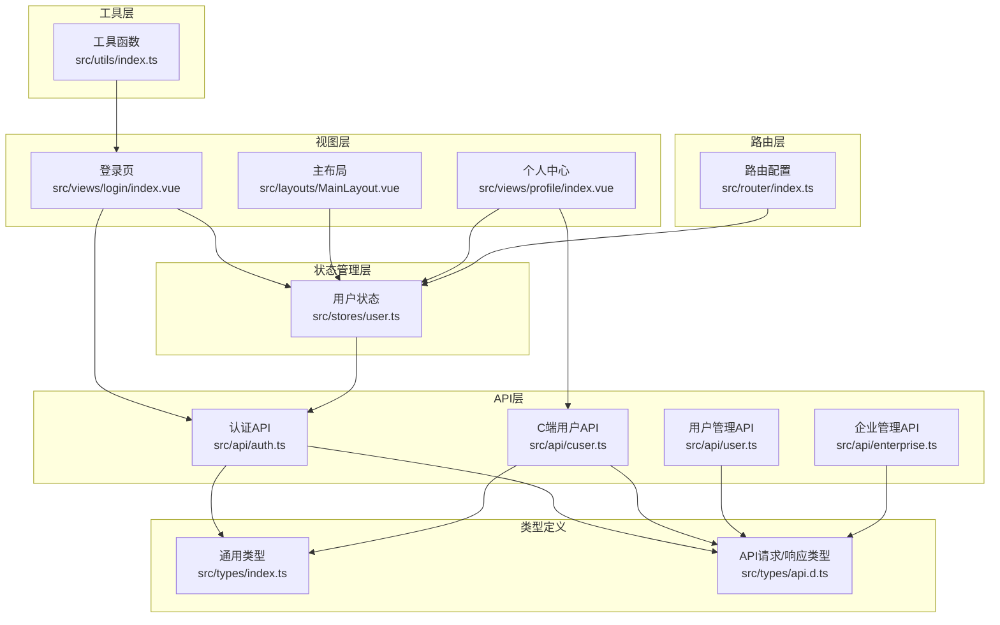
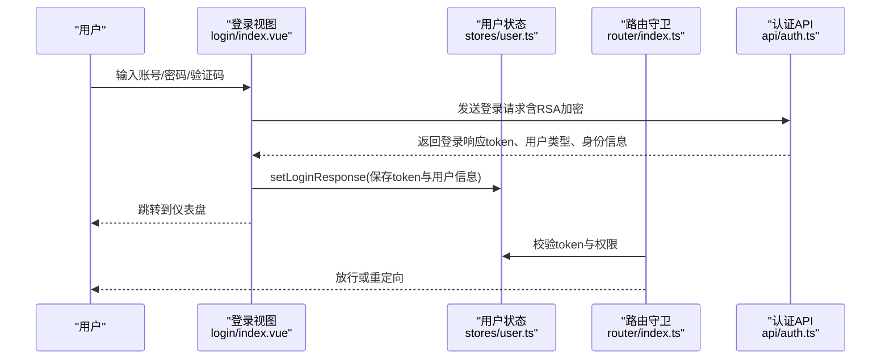
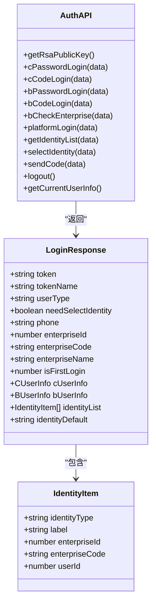
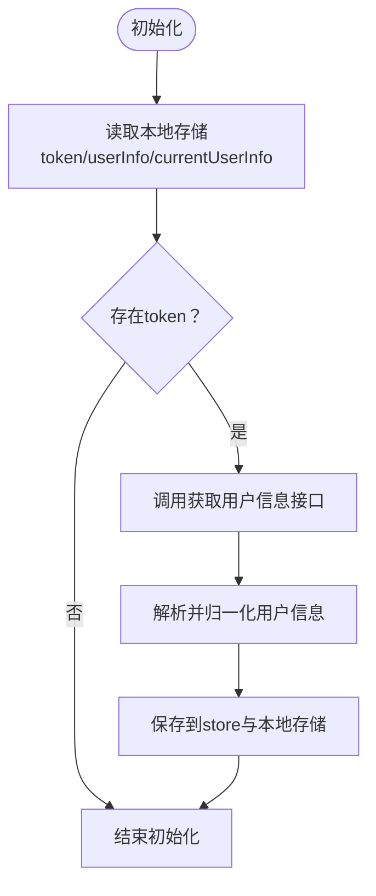
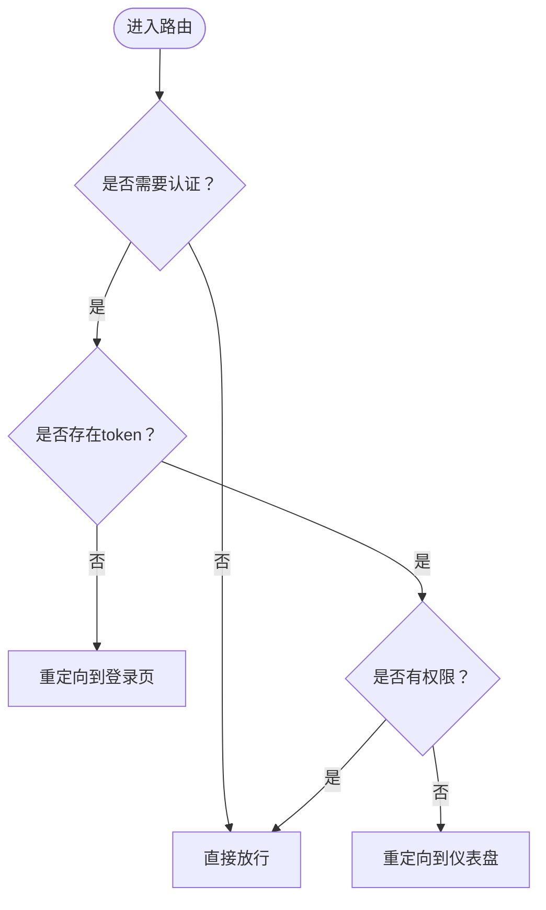
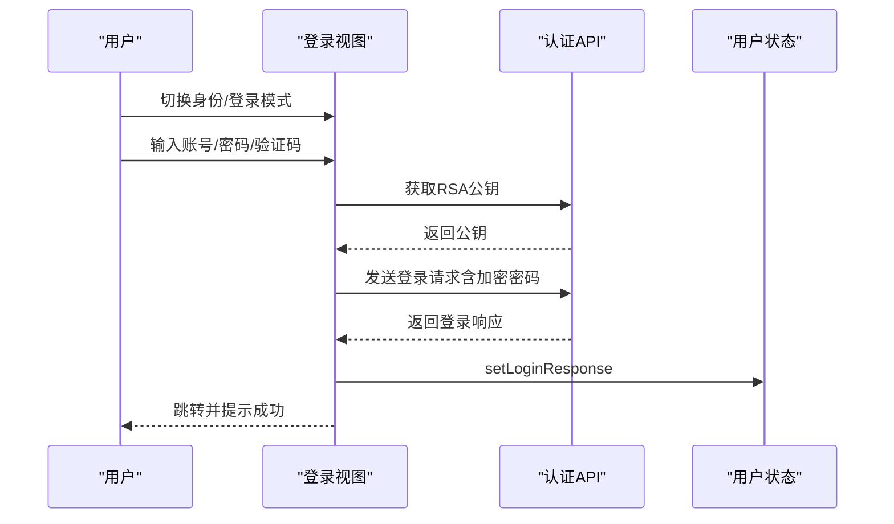
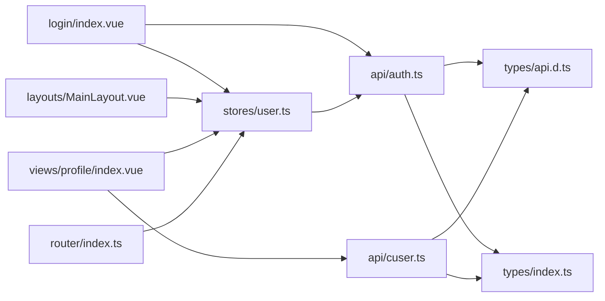
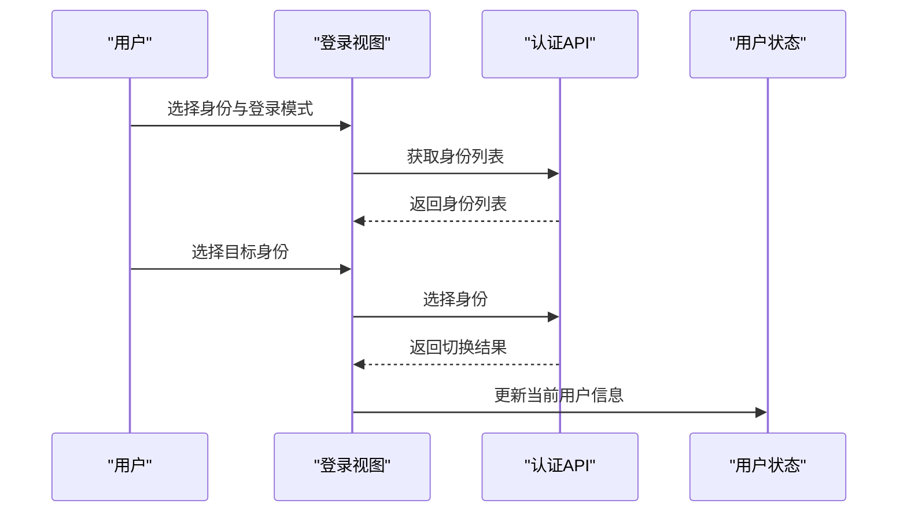

# 多身份认证系统

<cite>
**本文档引用的文件**
- [src/api/auth.ts](file://src/api/auth.ts)
- [src/stores/user.ts](file://src/stores/user.ts)
- [src/router/index.ts](file://src/router/index.ts)
- [src/views/login/index.vue](file://src/views/login/index.vue)
- [src/types/api.d.ts](file://src/types/api.d.ts)
- [src/types/index.ts](file://src/types/index.ts)
- [src/utils/index.ts](file://src/utils/index.ts)
- [src/api/cuser.ts](file://src/api/cuser.ts)
- [src/api/user.ts](file://src/api/user.ts)
- [src/api/enterprise.ts](file://src/api/enterprise.ts)
- [src/main.ts](file://src/main.ts)
- [src/layouts/MainLayout.vue](file://src/layouts/MainLayout.vue)
- [src/views/profile/index.vue](file://src/views/profile/index.vue)
</cite>

## 目录
1. [简介](#简介)
2. [项目结构](#项目结构)
3. [核心组件](#核心组件)
4. [架构总览](#架构总览)
5. [详细组件分析](#详细组件分析)
6. [依赖关系分析](#依赖关系分析)
7. [性能考虑](#性能考虑)
8. [故障排除指南](#故障排除指南)
9. [结论](#结论)
10. [附录](#附录)

## 简介
本系统为一个支持多身份认证的企业级权限管理平台，涵盖以下三种身份：
- C端用户：个人用户，支持密码登录与验证码登录
- B端用户：企业用户，支持密码登录与验证码登录，并可绑定企业信息
- 平台管理员：系统级管理员，支持密码登录

系统提供完整的身份识别、身份列表获取、身份选择逻辑以及安全的登录与登出流程。本文档将从架构设计、组件关系、数据流、处理逻辑、集成点、错误处理与性能特性等方面进行深入分析，并提供可视化图表与最佳实践建议。

## 项目结构
前端采用 Vue 3 + TypeScript + Pinia + Element Plus 技术栈，路由基于 vue-router，状态管理基于 Pinia，API 层通过封装的请求工具与后端交互。

**图表来源**
- [src/views/login/index.vue:1-323](file://src/views/login/index.vue#L1-L323)
- [src/stores/user.ts:1-152](file://src/stores/user.ts#L1-L152)
- [src/router/index.ts:1-127](file://src/router/index.ts#L1-L127)
- [src/api/auth.ts:1-69](file://src/api/auth.ts#L1-L69)
- [src/api/cuser.ts:1-66](file://src/api/cuser.ts#L1-L66)
- [src/api/user.ts:1-59](file://src/api/user.ts#L1-L59)
- [src/api/enterprise.ts:1-75](file://src/api/enterprise.ts#L1-L75)
- [src/types/index.ts:1-188](file://src/types/index.ts#L1-L188)
- [src/types/api.d.ts:1-156](file://src/types/api.d.ts#L1-L156)
- [src/utils/index.ts:1-85](file://src/utils/index.ts#L1-L85)

**章节来源**
- [src/main.ts:1-27](file://src/main.ts#L1-L27)
- [src/router/index.ts:1-127](file://src/router/index.ts#L1-L127)

## 核心组件
- 认证API模块：封装所有认证相关的网络请求，包括密码登录、验证码登录、企业校验、身份列表、身份选择、登出、获取当前用户信息等。
- 用户状态模块：集中管理 token、用户信息、登录态、权限与角色等，负责初始化、持久化与清理。
- 路由守卫：统一鉴权与权限控制，支持未登录跳转、权限不足重定向等。
- 登录视图：支持三种身份切换、两种登录模式（密码/验证码）、RSA 密码加密、验证码倒计时等功能。
- 工具模块：提供 RSA 加密、URL 参数解析、日期格式化、防抖节流、文件下载等通用能力。

**章节来源**
- [src/api/auth.ts:1-69](file://src/api/auth.ts#L1-L69)
- [src/stores/user.ts:1-152](file://src/stores/user.ts#L1-L152)
- [src/router/index.ts:82-124](file://src/router/index.ts#L82-L124)
- [src/views/login/index.vue:1-323](file://src/views/login/index.vue#L1-L323)
- [src/utils/index.ts:1-85](file://src/utils/index.ts#L1-L85)

## 架构总览
系统采用前后端分离架构，前端通过 API 模块与后端交互，状态通过 Pinia 管理，路由守卫保障访问安全。

**图表来源**
- [src/views/login/index.vue:98-145](file://src/views/login/index.vue#L98-L145)
- [src/stores/user.ts:22-39](file://src/stores/user.ts#L22-L39)
- [src/router/index.ts:82-124](file://src/router/index.ts#L82-L124)
- [src/api/auth.ts:26-68](file://src/api/auth.ts#L26-L68)

## 详细组件分析

### 认证API模块（src/api/auth.ts）
- 功能职责
  - 提供 RSA 公钥获取接口，用于密码加密传输
  - 支持 C/B/平台三类登录：密码登录与验证码登录
  - 支持企业校验、身份列表查询、身份选择、验证码发送、登出、获取当前用户信息
- 关键接口
  - 获取RSA公钥：用于客户端加密密码
  - C端密码/验证码登录
  - B端密码/验证码登录（需企业编码）
  - 企业校验
  - 平台管理员登录
  - 身份列表与选择
  - 验证码发送
  - 登出与获取当前用户信息
- 数据模型
  - 登录响应包含 token、用户类型、是否需要选择身份、手机号、企业信息、身份列表、默认身份等
  - 当前用户信息包含用户类型、企业ID、角色与权限、C/B用户信息

**图表来源**
- [src/api/auth.ts:1-69](file://src/api/auth.ts#L1-L69)
- [src/types/index.ts:18-64](file://src/types/index.ts#L18-L64)

**章节来源**
- [src/api/auth.ts:1-69](file://src/api/auth.ts#L1-L69)
- [src/types/index.ts:18-64](file://src/types/index.ts#L18-L64)

### 用户状态模块（src/stores/user.ts）
- 功能职责
  - 维护 token、登录响应、当前用户信息
  - 提供登录态计算属性与身份判定（C/B/平台）
  - 初始化本地存储、获取当前用户信息、登出清理
  - 权限与角色查询辅助方法
- 关键逻辑
  - setLoginResponse：保存 token 与用户信息到内存与本地存储
  - fetchUserInfo：拉取当前用户信息，兼容后端字段大小写差异
  - logout：调用登出API并清理本地存储与路由跳转
  - initFromStorage：从本地存储恢复登录状态

**图表来源**
- [src/stores/user.ts:90-127](file://src/stores/user.ts#L90-L127)
- [src/api/auth.ts:66-68](file://src/api/auth.ts#L66-L68)

**章节来源**
- [src/stores/user.ts:1-152](file://src/stores/user.ts#L1-L152)

### 路由守卫（src/router/index.ts）
- 功能职责
  - 未登录用户重定向至登录页
  - 基于权限数组的细粒度权限控制
  - 登录页已登录用户重定向至仪表盘
- 关键逻辑
  - beforeEach 中检查 token 与所需权限
  - 无权限数据时对平台管理员放行，其他用户仅放行基础菜单
  - 登录页与仪表盘的特殊处理

**图表来源**
- [src/router/index.ts:82-124](file://src/router/index.ts#L82-L124)

**章节来源**
- [src/router/index.ts:1-127](file://src/router/index.ts#L1-L127)

### 登录视图（src/views/login/index.vue）
- 功能职责
  - 支持三种身份切换：C端、B端、平台管理员
  - 支持两种登录模式：密码登录、验证码登录
  - RSA 公钥获取与密码加密
  - 企业编码校验与企业名称展示
  - 验证码发送与倒计时
  - 登录成功后的跳转与消息提示
- 关键逻辑
  - loginType 控制身份类型，loginMode 控制登录模式
  - handleSendCode 实现验证码发送与倒计时
  - handleLogin 根据身份与模式调用对应登录API
  - fetchPublicKey 在组件挂载时获取RSA公钥

**图表来源**
- [src/views/login/index.vue:98-145](file://src/views/login/index.vue#L98-L145)
- [src/api/auth.ts:22-68](file://src/api/auth.ts#L22-L68)
- [src/stores/user.ts:22-39](file://src/stores/user.ts#L22-L39)

**章节来源**
- [src/views/login/index.vue:1-323](file://src/views/login/index.vue#L1-L323)

### 主布局与权限菜单（src/layouts/MainLayout.vue）
- 功能职责
  - 根据用户身份与权限动态渲染菜单
  - 展示用户头像、昵称与身份标签
  - 提供个人中心与退出登录入口
- 关键逻辑
  - visibleMenus 基于权限数组与平台管理员身份决定菜单可见性
  - handleCommand 处理下拉菜单命令（个人中心/退出登录）

**章节来源**
- [src/layouts/MainLayout.vue:1-281](file://src/layouts/MainLayout.vue#L1-L281)

### 个人中心（src/views/profile/index.vue）
- 功能职责
  - C端用户：展示与编辑基本信息、修改密码
  - B端用户：展示只读企业相关信息
  - 平台管理员：提示联系超级管理员修改信息
- 关键逻辑
  - 根据身份类型渲染不同表单与展示内容
  - 调用相应API完成资料更新与密码修改

**章节来源**
- [src/views/profile/index.vue:1-245](file://src/views/profile/index.vue#L1-L245)

### 工具模块（src/utils/index.ts）
- 功能职责
  - RSA 密码加密
  - URL 参数解析、日期格式化
  - 防抖与节流
  - 文件下载与扩展名提取
  - 手机号与邮箱格式验证

**章节来源**
- [src/utils/index.ts:1-85](file://src/utils/index.ts#L1-L85)

## 依赖关系分析
- 组件耦合
  - 登录视图依赖认证API与用户状态模块
  - 主布局依赖用户状态模块以进行菜单与权限控制
  - 路由守卫依赖用户状态模块进行鉴权
  - 个人中心依赖用户状态与C端用户API
- 外部依赖
  - Element Plus UI 组件库
  - jsencrypt RSA 加密库
  - vue-router 路由
  - pinia 状态管理

**图表来源**
- [src/views/login/index.vue:1-323](file://src/views/login/index.vue#L1-L323)
- [src/stores/user.ts:1-152](file://src/stores/user.ts#L1-L152)
- [src/router/index.ts:1-127](file://src/router/index.ts#L1-L127)
- [src/api/auth.ts:1-69](file://src/api/auth.ts#L1-L69)
- [src/api/cuser.ts:1-66](file://src/api/cuser.ts#L1-L66)
- [src/types/api.d.ts:1-156](file://src/types/api.d.ts#L1-L156)
- [src/types/index.ts:1-188](file://src/types/index.ts#L1-L188)

**章节来源**
- [src/main.ts:1-27](file://src/main.ts#L1-L27)

## 性能考虑
- 登录流程优化
  - 使用 RSA 加密避免明文密码在网络传输中暴露
  - 验证码发送采用倒计时减少重复请求
- 状态管理优化
  - 本地存储持久化 token 与用户信息，应用启动时快速恢复登录态
  - 路由守卫中对权限缺失场景进行短路处理，避免不必要的API调用
- UI交互优化
  - 表单校验与按钮加载状态提升用户体验
  - 下拉菜单与面包屑导航增强可发现性

[本节为通用指导，无需具体文件分析]

## 故障排除指南
- 登录失败
  - 检查 RSA 公钥获取是否成功
  - 确认密码是否正确加密
  - 查看网络请求返回的错误信息
- 无法访问受保护页面
  - 确认 token 是否存在且未过期
  - 检查当前用户权限是否满足页面要求
- 退出登录后仍可访问
  - 确认 logout 是否正确清理本地存储并跳转登录页
  - 检查路由守卫逻辑

**章节来源**
- [src/stores/user.ts:62-80](file://src/stores/user.ts#L62-L80)
- [src/router/index.ts:82-124](file://src/router/index.ts#L82-L124)

## 结论
该多身份认证系统通过清晰的模块划分与完善的API封装，实现了C端用户、B端用户与平台管理员的身份识别、登录与权限控制。配合Pinia状态管理与路由守卫，确保了良好的用户体验与安全性。后续可在身份切换流程、默认身份设置、权限缓存策略等方面进一步优化。

[本节为总结性内容，无需具体文件分析]

## 附录

### 身份识别与切换流程
- 身份识别原理
  - 通过登录响应中的 userType 字段区分身份
  - 用户信息对象包含 cUserInfo 或 bUserInfo，用于区分C/B端用户
- 身份列表获取与选择
  - 通过身份列表接口获取可用身份集合
  - 通过身份选择接口切换当前会话身份
- 登录方式
  - 密码登录：适用于C/B/平台三类身份
  - 验证码登录：适用于C/B两类身份（平台管理员不支持验证码登录）

**图表来源**
- [src/api/auth.ts:50-56](file://src/api/auth.ts#L50-L56)
- [src/stores/user.ts:41-60](file://src/stores/user.ts#L41-L60)

### 用户体验优化建议
- 在登录页增加“记住我”选项，延长token有效期
- 在身份切换时提供预览与确认步骤
- 对高频操作（如验证码发送）增加防刷机制
- 完善错误提示与国际化支持

[本节为通用指导，无需具体文件分析]