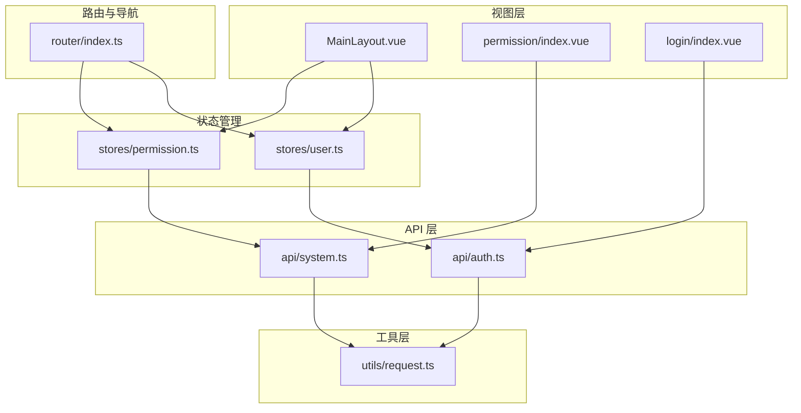
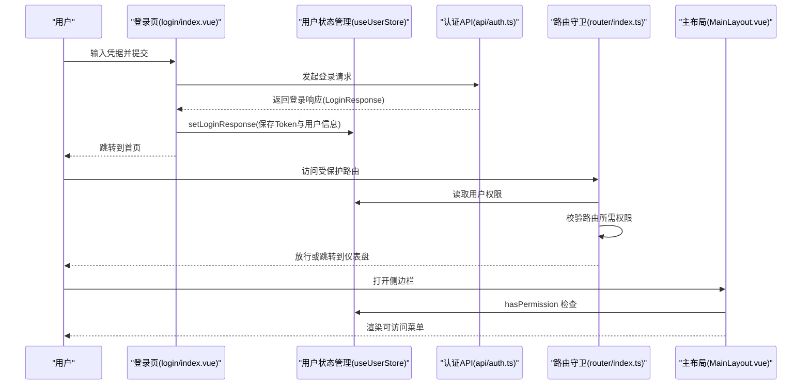
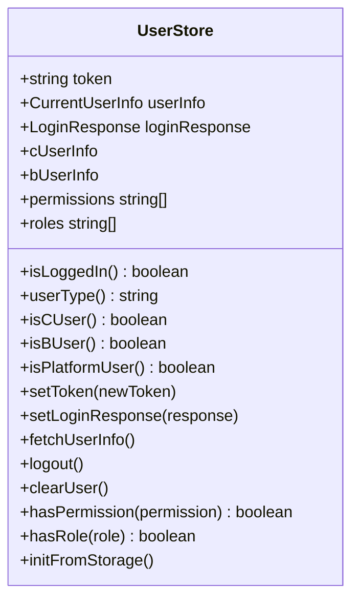
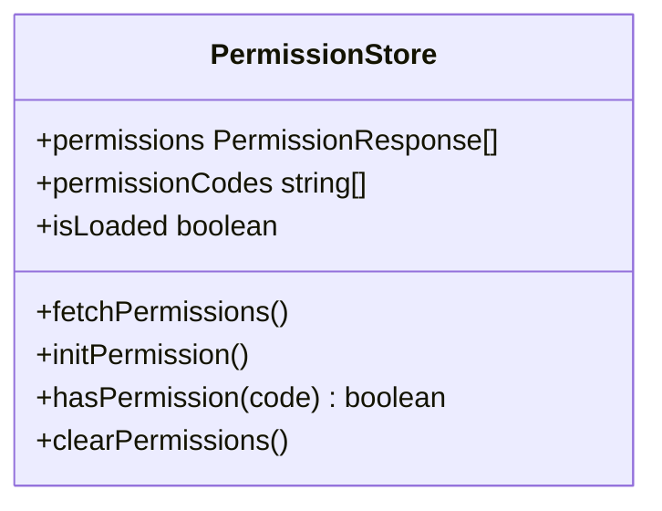
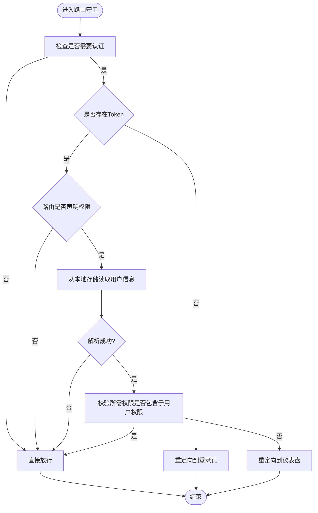
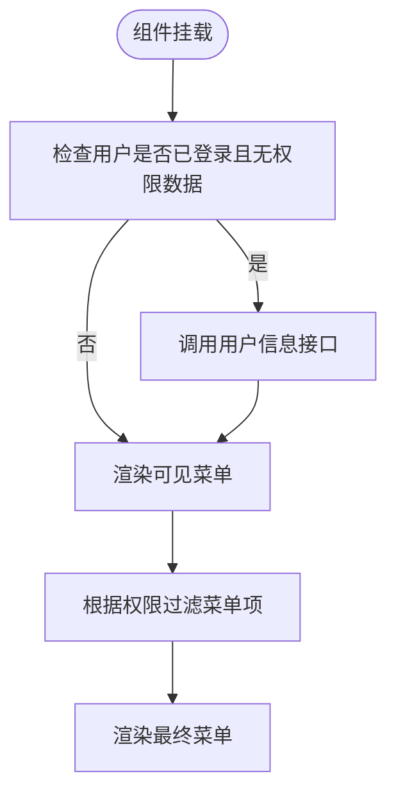
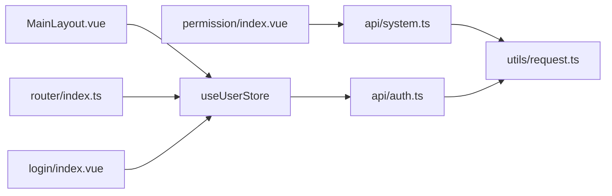

# 权限控制系统

<cite>
**本文档引用的文件**
- [src/stores/permission.ts](file://src/stores/permission.ts)
- [src/stores/user.ts](file://src/stores/user.ts)
- [src/router/index.ts](file://src/router/index.ts)
- [src/api/auth.ts](file://src/api/auth.ts)
- [src/api/system.ts](file://src/api/system.ts)
- [src/utils/request.ts](file://src/utils/request.ts)
- [src/views/permission/index.vue](file://src/views/permission/index.vue)
- [src/layouts/MainLayout.vue](file://src/layouts/MainLayout.vue)
- [src/views/login/index.vue](file://src/views/login/index.vue)
- [src/main.ts](file://src/main.ts)
- [src/types/index.ts](file://src/types/index.ts)
- [package.json](file://package.json)
</cite>

## 目录
1. [简介](#简介)
2. [项目结构](#项目结构)
3. [核心组件](#核心组件)
4. [架构总览](#架构总览)
5. [详细组件分析](#详细组件分析)
6. [依赖关系分析](#依赖关系分析)
7. [性能考虑](#性能考虑)
8. [故障排查指南](#故障排查指南)
9. [结论](#结论)
10. [附录](#附录)

## 简介
本项目实现了基于角色的权限管理（RBAC）前端控制体系，涵盖权限数据获取、缓存与更新、菜单权限控制、按钮权限控制、路由权限控制、权限验证中间件以及动态菜单生成。系统通过 Pinia Store 管理用户与权限状态，结合 Vue Router 的导航守卫实现路由级权限校验，并在布局层根据用户权限动态渲染菜单项。

## 项目结构
权限控制相关的代码主要分布在以下模块：
- 状态管理：用户状态与权限状态（stores）
- 路由与导航守卫：路由定义与权限校验（router）
- API 层：认证、用户信息、系统权限与角色接口（api）
- 视图层：权限管理页面、主布局与登录页（views）
- 工具层：HTTP 请求封装与拦截器（utils）

**图表来源**
- [src/layouts/MainLayout.vue:1-281](file://src/layouts/MainLayout.vue#L1-L281)
- [src/views/permission/index.vue:1-193](file://src/views/permission/index.vue#L1-L193)
- [src/views/login/index.vue:1-323](file://src/views/login/index.vue#L1-L323)
- [src/stores/user.ts:1-152](file://src/stores/user.ts#L1-L152)
- [src/stores/permission.ts:1-56](file://src/stores/permission.ts#L1-L56)
- [src/router/index.ts:1-127](file://src/router/index.ts#L1-L127)
- [src/api/auth.ts:1-69](file://src/api/auth.ts#L1-L69)
- [src/api/system.ts:1-56](file://src/api/system.ts#L1-L56)
- [src/utils/request.ts:1-148](file://src/utils/request.ts#L1-L148)

**章节来源**
- [src/main.ts:1-27](file://src/main.ts#L1-L27)
- [package.json:1-35](file://package.json#L1-L35)

## 核心组件
- 用户状态管理（useUserStore）
  - 负责 Token 管理、用户信息持久化、登录响应处理、角色与权限读取、登出流程。
  - 提供 hasPermission 与 hasRole 辅助方法。
- 权限状态管理（usePermissionStore）
  - 负责权限列表拉取、权限码集合构建、权限缓存初始化、权限状态清理。
  - 提供 hasPermission 检查方法。
- 路由权限控制（router.beforeEach）
  - 基于路由元信息中的权限数组进行校验，支持未加载权限时的宽容策略。
- 动态菜单生成（MainLayout）
  - 根据用户类型与权限动态过滤可展示菜单项，支持平台管理员全量展示。
- 权限数据模型（types）
  - 定义权限、角色、用户信息等接口，支撑前后端数据契约。

**章节来源**
- [src/stores/user.ts:1-152](file://src/stores/user.ts#L1-L152)
- [src/stores/permission.ts:1-56](file://src/stores/permission.ts#L1-L56)
- [src/router/index.ts:1-127](file://src/router/index.ts#L1-L127)
- [src/layouts/MainLayout.vue:1-281](file://src/layouts/MainLayout.vue#L1-L281)
- [src/types/index.ts:1-188](file://src/types/index.ts#L1-L188)

## 架构总览
系统采用“状态驱动 + 导航守卫”的权限控制架构：
- 登录成功后，使用用户状态管理保存 Token 与登录响应。
- 应用启动时从本地存储恢复用户状态。
- 进入路由前，导航守卫读取当前路由所需权限并与用户权限比对。
- 主布局根据用户权限动态渲染菜单项。
- 权限管理页面提供权限的增删改与缓存初始化功能。

**图表来源**
- [src/views/login/index.vue:98-145](file://src/views/login/index.vue#L98-L145)
- [src/stores/user.ts:27-39](file://src/stores/user.ts#L27-L39)
- [src/api/auth.ts:26-68](file://src/api/auth.ts#L26-L68)
- [src/router/index.ts:82-124](file://src/router/index.ts#L82-L124)
- [src/layouts/MainLayout.vue:45-64](file://src/layouts/MainLayout.vue#L45-L64)

## 详细组件分析

### 用户状态管理（useUserStore）
- 关键职责
  - Token 管理与持久化
  - 登录响应处理与用户信息归一化
  - 用户类型判定（C/B/平台）
  - 角色与权限读取
  - 登出与本地存储清理
  - hasPermission / hasRole 辅助方法
- 数据结构
  - token: 字符串
  - userInfo: 当前用户信息（含角色与权限数组）
  - loginResponse: 登录响应（含 Token 与用户类型）
  - 计算属性：isLoggedIn、userType、isCUser、isBUser、isPlatformUser、cUserInfo、bUserInfo、permissions、roles
- 复杂度
  - hasPermission / hasRole 为 O(n)（n 为权限数组长度），可通过构建权限集合优化至 O(1)。

**图表来源**
- [src/stores/user.ts:7-151](file://src/stores/user.ts#L7-L151)

**章节来源**
- [src/stores/user.ts:1-152](file://src/stores/user.ts#L1-L152)

### 权限状态管理（usePermissionStore）
- 关键职责
  - 拉取权限列表并构建权限码集合
  - 初始化权限缓存
  - hasPermission 快速检查
  - 清理权限状态
- 数据结构
  - permissions: 权限对象数组
  - permissionCodes: 权限码字符串数组
  - isLoaded: 是否已加载权限
- 复杂度
  - hasPermission 为 O(n)（n 为权限码数组长度），可通过 Set 优化至 O(1)。

**图表来源**
- [src/stores/permission.ts:7-55](file://src/stores/permission.ts#L7-L55)

**章节来源**
- [src/stores/permission.ts:1-56](file://src/stores/permission.ts#L1-L56)

### 路由权限控制（router.beforeEach）
- 控制点
  - 未登录访问受保护路由时重定向至登录页
  - 校验路由元信息中的 permissions 数组
  - 用户权限缺失时跳转到仪表盘
  - 已登录访问登录页时重定向至仪表盘
- 逻辑要点
  - 从本地存储读取用户权限
  - 若无权限数据则宽容放行（等待页面加载后 store 更新再判断）
  - 支持多权限同时校验（every）

**图表来源**
- [src/router/index.ts:82-124](file://src/router/index.ts#L82-L124)

**章节来源**
- [src/router/index.ts:1-127](file://src/router/index.ts#L1-L127)

### 动态菜单生成（MainLayout）
- 控制点
  - 根据用户类型与权限动态过滤菜单项
  - 平台管理员在无权限数据时默认展示全部菜单
  - 其他用户仅展示基础菜单
- 实现方式
  - 使用计算属性 visibleMenus，结合 hasPermission 判断每个菜单项的显示与否
  - 通过 v-for 渲染 el-menu-item

**图表来源**
- [src/layouts/MainLayout.vue:82-90](file://src/layouts/MainLayout.vue#L82-L90)
- [src/layouts/MainLayout.vue:45-64](file://src/layouts/MainLayout.vue#L45-L64)

**章节来源**
- [src/layouts/MainLayout.vue:1-281](file://src/layouts/MainLayout.vue#L1-L281)

### 权限数据模型（types）
- 关键接口
  - PermissionResponse：权限对象（id、name、code、type、path、parentId 等）
  - CurrentUserInfo：当前用户信息（roles、permissions 等）
  - LoginResponse：登录响应（token、userType 等）
- 作用
  - 统一前后端数据契约，支撑权限列表、用户信息与登录响应的数据结构。

**章节来源**
- [src/types/index.ts:118-158](file://src/types/index.ts#L118-L158)

### 权限管理页面（permission/index.vue）
- 功能
  - 列表展示权限（名称、编码、类型、路径、父级 ID、创建时间）
  - 新增/编辑/删除权限
  - 初始化权限缓存
- 交互
  - 使用 ElMessageBox 确认删除
  - 表单校验与提交
  - 成功后刷新列表

**章节来源**
- [src/views/permission/index.vue:1-193](file://src/views/permission/index.vue#L1-L193)

### 登录流程与 Token 管理
- 流程
  - 用户输入凭据，根据登录类型选择对应 API
  - 登录成功后保存 Token 与用户信息到本地存储
  - 跳转到首页或重定向地址
- Token 管理
  - 请求拦截器自动附加 Authorization 头
  - 响应拦截器处理 401/403 等错误场景

**章节来源**
- [src/views/login/index.vue:98-145](file://src/views/login/index.vue#L98-L145)
- [src/api/auth.ts:26-68](file://src/api/auth.ts#L26-L68)
- [src/utils/request.ts:37-101](file://src/utils/request.ts#L37-L101)

## 依赖关系分析
- 组件耦合
  - MainLayout 依赖 useUserStore 的 hasPermission 与 userType
  - router.beforeEach 依赖 useUserStore 的权限数据与本地存储
  - permission 页面依赖 system API 与 usePermissionStore
  - 登录页依赖 useUserStore 与 auth API
- 外部依赖
  - axios 用于 HTTP 请求
  - Element Plus 用于 UI 与消息提示
  - jsencrypt 用于密码加密

**图表来源**
- [src/layouts/MainLayout.vue:5-20](file://src/layouts/MainLayout.vue#L5-L20)
- [src/router/index.ts:1-10](file://src/router/index.ts#L1-L10)
- [src/views/permission/index.vue:5](file://src/views/permission/index.vue#L5)
- [src/views/login/index.vue:6](file://src/views/login/index.vue#L6)
- [src/stores/user.ts:4](file://src/stores/user.ts#L4)
- [src/api/system.ts:1](file://src/api/system.ts#L1)
- [src/api/auth.ts:1](file://src/api/auth.ts#L1)
- [src/utils/request.ts:1](file://src/utils/request.ts#L1)

**章节来源**
- [package.json:13-22](file://package.json#L13-L22)

## 性能考虑
- 权限检查优化
  - 将权限数组转换为 Set 或 Map，将 hasPermission 时间复杂度从 O(n) 降至 O(1)
- 缓存策略
  - 在用户登录后优先使用本地存储恢复状态，减少重复请求
  - 提供权限缓存初始化接口，避免频繁拉取完整权限列表
- 路由守卫
  - 对无权限数据时采取宽容放行策略，待页面加载后再精确校验，提升用户体验
- 请求拦截器
  - 统一注入 Authorization 头，避免重复设置
  - 错误统一处理，减少业务层重复逻辑

## 故障排查指南
- 登录后仍被重定向到登录页
  - 检查 Token 是否正确保存到本地存储
  - 确认请求拦截器是否正确附加 Authorization 头
- 路由权限校验失败
  - 检查路由元信息中 permissions 配置是否正确
  - 确认用户权限数据是否已加载
- 菜单不显示
  - 检查用户类型与权限数据
  - 确认 hasPermission 返回值
- 权限缓存初始化失败
  - 检查后端接口 /permission/init 是否可用
  - 查看控制台错误信息与网络请求状态

**章节来源**
- [src/router/index.ts:82-124](file://src/router/index.ts#L82-L124)
- [src/utils/request.ts:37-101](file://src/utils/request.ts#L37-L101)
- [src/stores/user.ts:90-127](file://src/stores/user.ts#L90-L127)

## 结论
本权限控制系统以 Pinia 状态管理为核心，结合 Vue Router 导航守卫与布局层动态渲染，实现了菜单、按钮与路由的多维权限控制。通过本地存储与缓存初始化，兼顾了易用性与性能。建议进一步引入权限集合优化与更细粒度的权限继承策略，以满足复杂 RBAC 场景。

## 附录
- 最佳实践
  - 权限编码命名规范：模块:动作（如 user:list、user:add）
  - 路由元信息 permissions 必须与后端一致
  - 登录成功后立即初始化用户信息与权限缓存
  - 对敏感操作增加二次确认与权限二次校验
- 冲突处理
  - 平台管理员拥有最高权限，但需谨慎开放
  - 路由与菜单权限不一致时以路由为准
  - 无权限数据时采用宽容策略，待数据就绪后精确控制
- 性能优化
  - 将权限数组转换为 Set/Map
  - 合理使用本地存储与缓存接口
  - 减少不必要的权限拉取与重复渲染