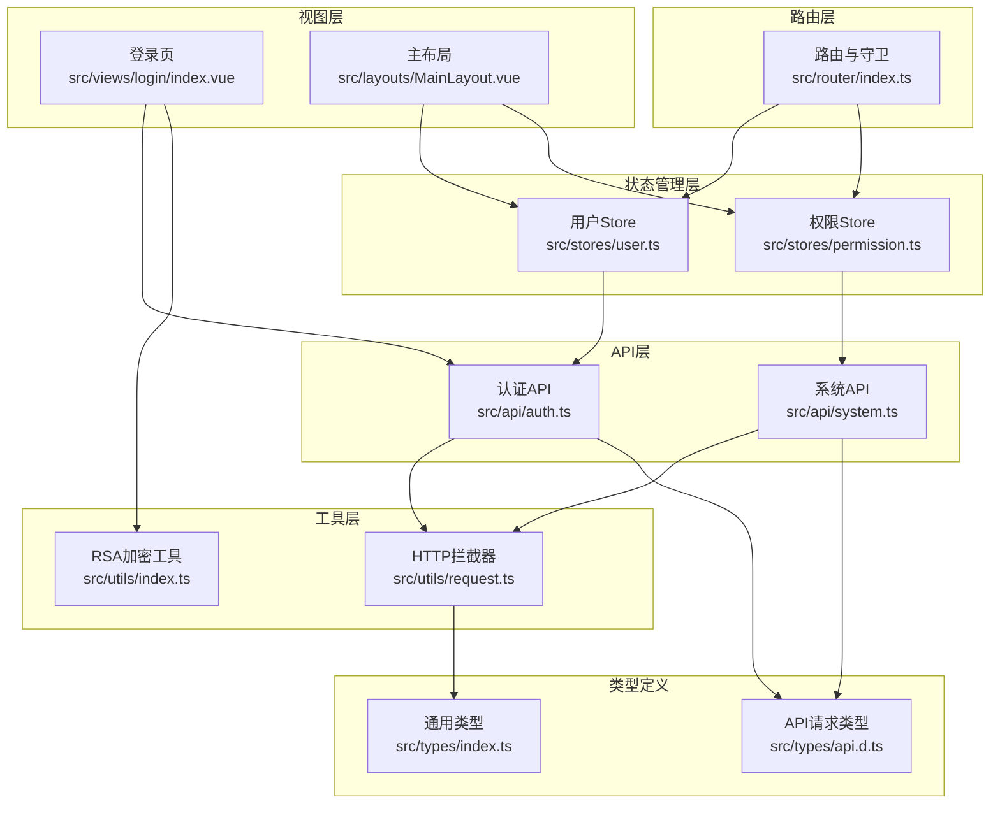
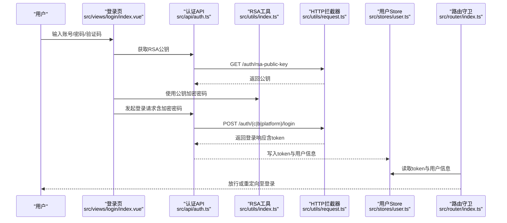
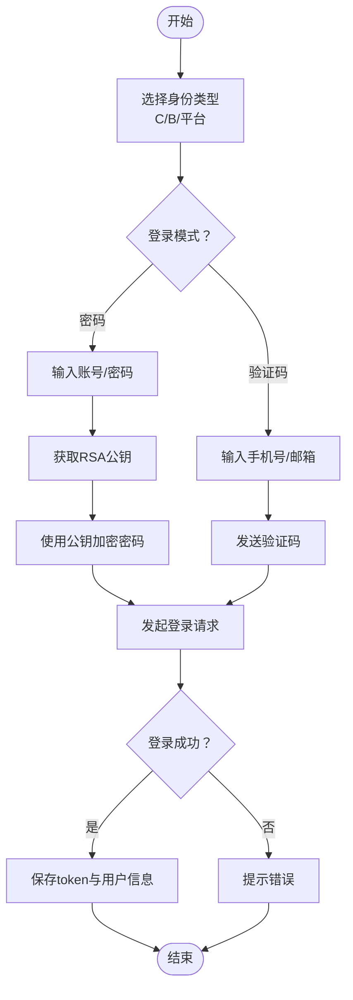
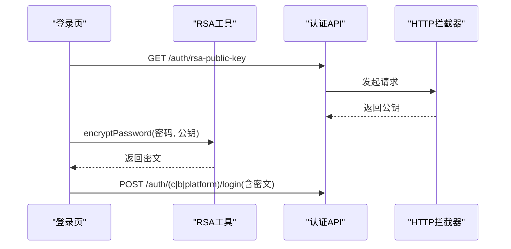
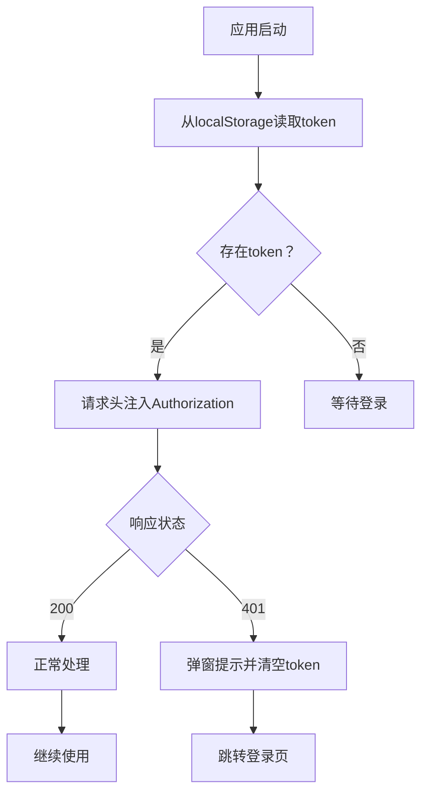
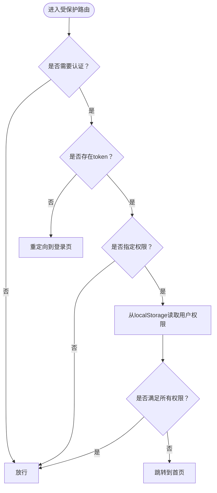
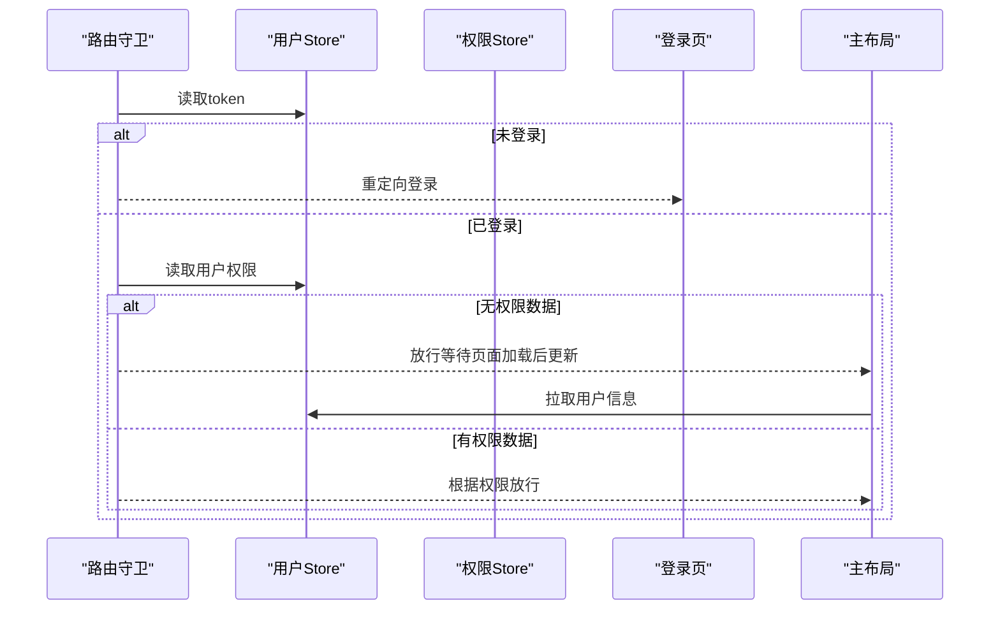
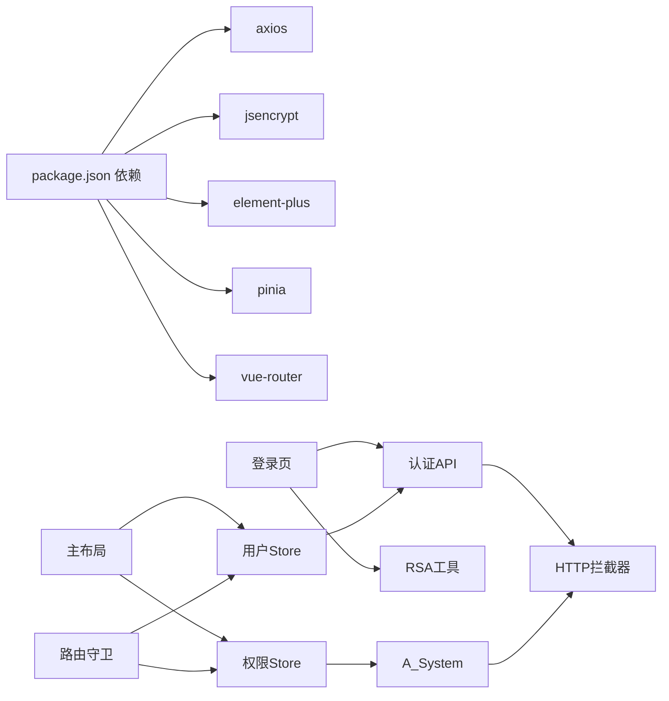

# 认证与授权系统

<cite>
**本文引用的文件**
- [src/api/auth.ts](file://src/api/auth.ts)
- [src/api/system.ts](file://src/api/system.ts)
- [src/stores/user.ts](file://src/stores/user.ts)
- [src/stores/permission.ts](file://src/stores/permission.ts)
- [src/utils/request.ts](file://src/utils/request.ts)
- [src/utils/index.ts](file://src/utils/index.ts)
- [src/router/index.ts](file://src/router/index.ts)
- [src/views/login/index.vue](file://src/views/login/index.vue)
- [src/layouts/MainLayout.vue](file://src/layouts/MainLayout.vue)
- [src/types/index.ts](file://src/types/index.ts)
- [src/types/api.d.ts](file://src/types/api.d.ts)
- [src/main.ts](file://src/main.ts)
- [package.json](file://package.json)
</cite>

## 目录
1. [简介](#简介)
2. [项目结构](#项目结构)
3. [核心组件](#核心组件)
4. [架构总览](#架构总览)
5. [详细组件分析](#详细组件分析)
6. [依赖关系分析](#依赖关系分析)
7. [性能考虑](#性能考虑)
8. [故障排查指南](#故障排查指南)
9. [结论](#结论)
10. [附录](#附录)

## 简介
本文件为前端认证与授权系统的综合文档，覆盖以下主题：
- 多身份认证机制：C端用户、B端用户、平台管理员的身份识别与切换
- RSA加密传输的安全实现：公钥获取、前端加密、后端解密流程
- Token管理机制：获取、存储、刷新、失效处理
- 权限控制系统：基于角色的权限管理、菜单权限控制、按钮权限控制
- 登录流程、权限验证、会话管理的具体实现
- 安全最佳实践与常见安全问题的解决方案

## 项目结构
本项目采用前后端分离的前端单页应用架构，使用 Vue 3 + TypeScript + Pinia + Element Plus + Axios 构建。认证与授权相关的核心文件分布如下：
- API 层：封装认证与系统相关接口
- Store 层：集中管理用户状态、权限状态
- 路由层：定义路由元信息与全局前置守卫
- 视图层：登录页、主布局与各业务页面
- 工具层：HTTP 请求拦截器、RSA 加密工具
- 类型定义：统一响应体、请求体、用户与权限模型

**图表来源**
- [src/views/login/index.vue:1-323](file://src/views/login/index.vue#L1-L323)
- [src/layouts/MainLayout.vue:1-281](file://src/layouts/MainLayout.vue#L1-L281)
- [src/stores/user.ts:1-152](file://src/stores/user.ts#L1-L152)
- [src/stores/permission.ts:1-56](file://src/stores/permission.ts#L1-L56)
- [src/api/auth.ts:1-69](file://src/api/auth.ts#L1-L69)
- [src/api/system.ts:1-56](file://src/api/system.ts#L1-L56)
- [src/utils/request.ts:1-148](file://src/utils/request.ts#L1-L148)
- [src/utils/index.ts:1-85](file://src/utils/index.ts#L1-L85)
- [src/router/index.ts:1-127](file://src/router/index.ts#L1-L127)
- [src/types/index.ts:1-188](file://src/types/index.ts#L1-L188)
- [src/types/api.d.ts:1-156](file://src/types/api.d.ts#L1-L156)

**章节来源**
- [src/main.ts:1-27](file://src/main.ts#L1-L27)
- [src/router/index.ts:1-127](file://src/router/index.ts#L1-L127)
- [src/utils/request.ts:1-148](file://src/utils/request.ts#L1-L148)

## 核心组件
- 用户状态管理（Pinia Store）
  - 维护 token、用户信息、登录响应、身份类型、角色与权限集合
  - 提供登录成功后的持久化、登出清理、权限校验方法
- 权限状态管理（Pinia Store）
  - 拉取权限列表、构建权限码集合、初始化权限缓存
- HTTP 请求拦截器（Axios）
  - 自动注入 Authorization 头、统一处理 401/403 等错误、统一消息提示
- 登录视图（Vue 组件）
  - 支持 C/B/平台三类身份登录、密码/验证码两种模式、RSA 密码加密
- 主布局（Vue 组件）
  - 基于用户类型与权限动态渲染菜单、展示用户信息、触发登出
- 路由守卫（Vue Router）
  - 控制未登录访问、权限不足跳转、标题设置与重定向

**章节来源**
- [src/stores/user.ts:1-152](file://src/stores/user.ts#L1-L152)
- [src/stores/permission.ts:1-56](file://src/stores/permission.ts#L1-L56)
- [src/utils/request.ts:1-148](file://src/utils/request.ts#L1-L148)
- [src/views/login/index.vue:1-323](file://src/views/login/index.vue#L1-L323)
- [src/layouts/MainLayout.vue:1-281](file://src/layouts/MainLayout.vue#L1-L281)
- [src/router/index.ts:1-127](file://src/router/index.ts#L1-L127)

## 架构总览
下图展示了认证与授权在前端的整体交互流程：从登录页发起认证请求，通过 API 层调用后端接口，使用 RSA 公钥加密密码；登录成功后写入 token 并拉取用户信息；后续所有请求自动携带 token；路由守卫与菜单渲染依据用户类型与权限进行控制。

**图表来源**
- [src/views/login/index.vue:147-158](file://src/views/login/index.vue#L147-L158)
- [src/api/auth.ts:22-68](file://src/api/auth.ts#L22-L68)
- [src/utils/index.ts:3-7](file://src/utils/index.ts#L3-L7)
- [src/utils/request.ts:37-101](file://src/utils/request.ts#L37-L101)
- [src/stores/user.ts:22-80](file://src/stores/user.ts#L22-L80)
- [src/router/index.ts:82-124](file://src/router/index.ts#L82-L124)

## 详细组件分析

### 多身份认证机制
- 身份类型
  - C端用户：普通个人用户
  - B端用户：企业组织下的员工用户
  - 平台管理员：平台级管理员
- 登录方式
  - 密码登录：支持三类身份的密码登录
  - 验证码登录：支持三类身份的短信/邮箱验证码登录
- 企业校验
  - B端登录前可输入企业编码，调用企业校验接口获取企业名称
- 身份切换
  - 当登录响应包含需要选择身份或默认身份字段时，前端可调用身份列表与选择接口完成身份切换（接口已定义）

**图表来源**
- [src/views/login/index.vue:98-158](file://src/views/login/index.vue#L98-L158)
- [src/api/auth.ts:26-68](file://src/api/auth.ts#L26-L68)
- [src/utils/index.ts:3-7](file://src/utils/index.ts#L3-L7)

**章节来源**
- [src/views/login/index.vue:1-323](file://src/views/login/index.vue#L1-L323)
- [src/api/auth.ts:1-69](file://src/api/auth.ts#L1-L69)
- [src/types/api.d.ts:1-156](file://src/types/api.d.ts#L1-L156)

### RSA加密传输安全实现
- 公钥获取
  - 登录页在组件挂载时异步获取后端RSA公钥
- 前端加密
  - 使用 jsencrypt 对密码进行RSA加密
- 后端解密
  - 后端接收加密后的密码，使用对应私钥解密后进行认证

**图表来源**
- [src/views/login/index.vue:147-158](file://src/views/login/index.vue#L147-L158)
- [src/utils/index.ts:3-7](file://src/utils/index.ts#L3-L7)
- [src/api/auth.ts:22-68](file://src/api/auth.ts#L22-L68)
- [src/utils/request.ts:37-48](file://src/utils/request.ts#L37-L48)

**章节来源**
- [src/utils/index.ts:1-85](file://src/utils/index.ts#L1-L85)
- [src/views/login/index.vue:104-131](file://src/views/login/index.vue#L104-L131)

### Token管理机制
- 获取与存储
  - 登录成功后，将 token 写入内存与 localStorage
  - 应用启动时从 localStorage 初始化用户状态
- 刷新与失效
  - 请求拦截器统一处理 401 未授权：弹窗提示并清空本地 token，跳转登录页
- 登出
  - 调用登出接口，无论成功与否均清理本地状态并跳转登录页

**图表来源**
- [src/stores/user.ts:90-127](file://src/stores/user.ts#L90-L127)
- [src/utils/request.ts:17-35](file://src/utils/request.ts#L17-L35)
- [src/utils/request.ts:50-101](file://src/utils/request.ts#L50-L101)

**章节来源**
- [src/stores/user.ts:22-80](file://src/stores/user.ts#L22-L80)
- [src/utils/request.ts:17-35](file://src/utils/request.ts#L17-L35)
- [src/utils/request.ts:50-101](file://src/utils/request.ts#L50-L101)

### 权限控制系统
- 基于角色的权限管理
  - 用户信息中包含角色数组，Store 提供 hasRole 方法
- 菜单权限控制
  - 主布局根据用户类型与权限动态过滤菜单项
  - 平台管理员在无权限数据时默认显示全部菜单
- 按钮权限控制
  - 路由元信息中定义所需权限码，前置守卫校验当前用户权限集合

**图表来源**
- [src/router/index.ts:82-124](file://src/router/index.ts#L82-L124)
- [src/layouts/MainLayout.vue:45-64](file://src/layouts/MainLayout.vue#L45-L64)
- [src/stores/user.ts:82-88](file://src/stores/user.ts#L82-L88)

**章节来源**
- [src/stores/user.ts:82-88](file://src/stores/user.ts#L82-L88)
- [src/stores/permission.ts:36-38](file://src/stores/permission.ts#L36-L38)
- [src/router/index.ts:35-54](file://src/router/index.ts#L35-L54)
- [src/layouts/MainLayout.vue:45-64](file://src/layouts/MainLayout.vue#L45-L64)

### 登录流程、权限验证与会话管理
- 登录流程
  - 选择身份与登录模式 → 校验表单 → 获取公钥 → 加密密码 → 发起登录 → 成功后写入状态并跳转
- 权限验证
  - 路由守卫在进入前检查 token 与权限；主布局在挂载时若缺少权限则主动拉取用户信息
- 会话管理
  - 通过 localStorage 持久化 token 与用户信息；401 统一处理并清空本地状态

**图表来源**
- [src/router/index.ts:82-124](file://src/router/index.ts#L82-L124)
- [src/stores/user.ts:41-60](file://src/stores/user.ts#L41-L60)
- [src/layouts/MainLayout.vue:82-90](file://src/layouts/MainLayout.vue#L82-L90)

**章节来源**
- [src/views/login/index.vue:98-145](file://src/views/login/index.vue#L98-L145)
- [src/stores/user.ts:41-60](file://src/stores/user.ts#L41-L60)
- [src/router/index.ts:82-124](file://src/router/index.ts#L82-L124)
- [src/layouts/MainLayout.vue:82-90](file://src/layouts/MainLayout.vue#L82-L90)

## 依赖关系分析
- 外部依赖
  - axios：HTTP 请求与拦截器
  - jsencrypt：RSA 加密
  - element-plus：UI 组件库
  - pinia：状态管理
  - vue-router：路由与守卫
- 内部依赖
  - 登录页依赖认证 API 与 RSA 工具
  - 用户/权限 Store 依赖 API 层
  - 路由守卫依赖用户/权限 Store
  - 主布局依赖用户 Store 与权限 Store

**图表来源**
- [package.json:13-33](file://package.json#L13-L33)
- [src/views/login/index.vue:1-323](file://src/views/login/index.vue#L1-L323)
- [src/layouts/MainLayout.vue:1-281](file://src/layouts/MainLayout.vue#L1-L281)
- [src/stores/user.ts:1-152](file://src/stores/user.ts#L1-L152)
- [src/stores/permission.ts:1-56](file://src/stores/permission.ts#L1-L56)
- [src/api/auth.ts:1-69](file://src/api/auth.ts#L1-L69)
- [src/api/system.ts:1-56](file://src/api/system.ts#L1-L56)
- [src/utils/request.ts:1-148](file://src/utils/request.ts#L1-L148)
- [src/router/index.ts:1-127](file://src/router/index.ts#L1-L127)

**章节来源**
- [package.json:13-33](file://package.json#L13-L33)

## 性能考虑
- 请求并发与节流
  - 可在验证码发送处增加节流/防抖，避免频繁请求
- 缓存策略
  - 将用户信息与权限列表在内存中缓存，减少重复请求
- 菜单渲染优化
  - 动态菜单仅在权限数据到达后渲染，避免闪烁
- 加密开销
  - RSA 加密仅用于密码字段，避免对大文本进行加密

## 故障排查指南
- 登录后无法进入受保护页面
  - 检查 localStorage 中 token 是否存在
  - 确认路由守卫逻辑与用户权限是否正确
- 401 未授权频繁弹窗
  - 检查拦截器是否正确处理 401，确认 token 是否被意外清除
- 菜单不显示或权限异常
  - 确认用户信息中 permissions 是否为空，必要时手动拉取用户信息
- RSA 加密失败
  - 检查公钥获取是否成功，确认加密函数调用链路

**章节来源**
- [src/utils/request.ts:20-35](file://src/utils/request.ts#L20-L35)
- [src/router/index.ts:96-115](file://src/router/index.ts#L96-L115)
- [src/stores/user.ts:41-60](file://src/stores/user.ts#L41-L60)
- [src/utils/index.ts:3-7](file://src/utils/index.ts#L3-L7)

## 结论
本系统通过清晰的分层设计实现了多身份认证、RSA 加密传输、Token 管理与权限控制。登录流程简洁直观，路由守卫与菜单渲染确保了权限约束的有效执行。建议在生产环境中进一步完善权限缓存、错误重试与更细粒度的权限控制策略。

## 附录
- 关键接口一览
  - 获取RSA公钥：GET /auth/rsa-public-key
  - C端密码登录：POST /auth/c/password-login
  - C端验证码登录：POST /auth/c/code-login
  - B端密码登录：POST /auth/b/password-login
  - B端验证码登录：POST /auth/b/code-login
  - 企业校验：POST /auth/b/check-enterprise
  - 平台管理员登录：POST /auth/platform/login
  - 发送验证码：POST /auth/code/send
  - 登出：POST /auth/logout
  - 获取当前用户信息：GET /auth/info
  - 获取权限列表：GET /permission/list
  - 初始化权限缓存：POST /permission/init

**章节来源**
- [src/api/auth.ts:22-68](file://src/api/auth.ts#L22-L68)
- [src/api/system.ts:33-55](file://src/api/system.ts#L33-L55)