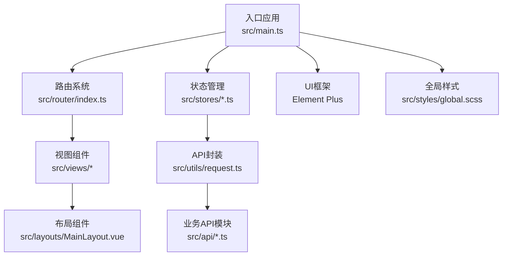
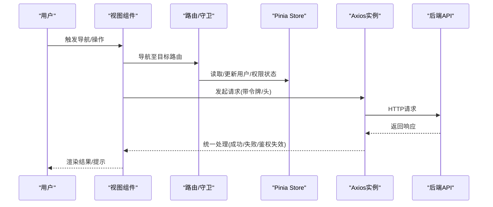
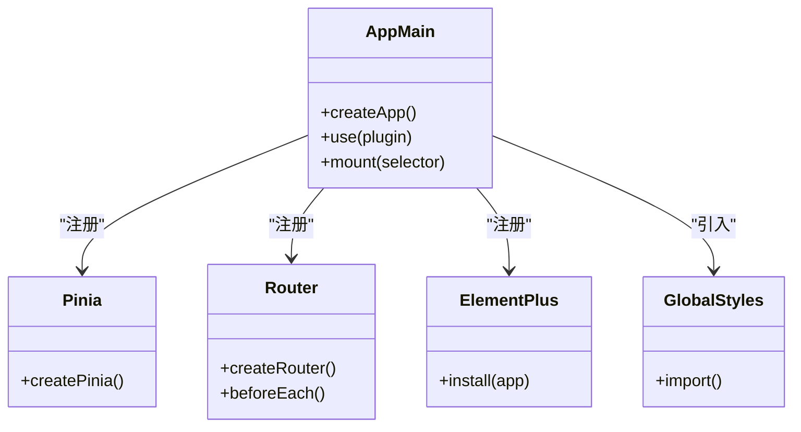
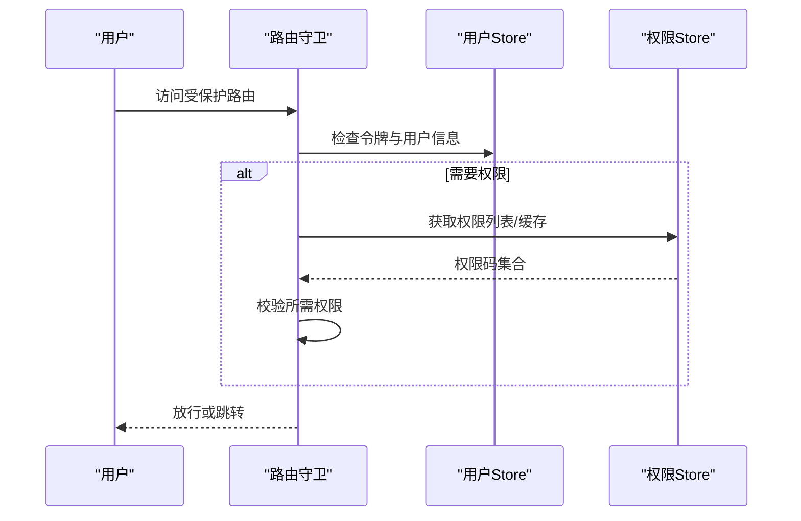
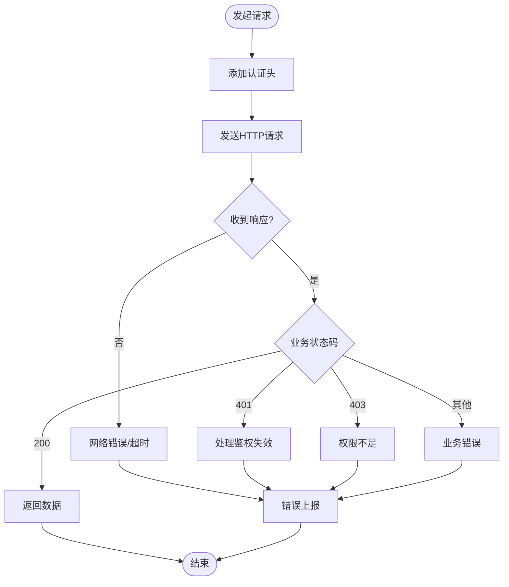

# 性能监控配置

<cite>
**本文引用的文件**
- [package.json](file://package.json)
- [vite.config.ts](file://vite.config.ts)
- [src/main.ts](file://src/main.ts)
- [src/utils/request.ts](file://src/utils/request.ts)
- [src/router/index.ts](file://src/router/index.ts)
- [src/stores/user.ts](file://src/stores/user.ts)
- [src/stores/permission.ts](file://src/stores/permission.ts)
- [src/App.vue](file://src/App.vue)
- [src/layouts/MainLayout.vue](file://src/layouts/MainLayout.vue)
- [src/types/index.ts](file://src/types/index.ts)
- [src/api/auth.ts](file://src/api/auth.ts)
- [src/api/system.ts](file://src/api/system.ts)
</cite>

## 目录
1. [简介](#简介)
2. [项目结构](#项目结构)
3. [核心组件](#核心组件)
4. [架构总览](#架构总览)
5. [详细组件分析](#详细组件分析)
6. [依赖分析](#依赖分析)
7. [性能考虑](#性能考虑)
8. [故障排查指南](#故障排查指南)
9. [结论](#结论)
10. [附录](#附录)

## 简介
本文件面向HC管理系统的生产环境，系统性地给出性能监控与优化配置方案，覆盖以下方面：
- 生产环境性能监控方案：资源加载监控、页面性能指标收集、用户体验监控
- 构建产物性能分析：bundle大小分析、依赖关系分析、代码分割效果评估
- 运行时性能监控：内存使用情况、网络请求监控、错误追踪配置
- 性能优化建议与监控指标设置方法

## 项目结构
本项目采用Vite + Vue 3 + TypeScript技术栈，前端应用通过路由懒加载实现按需加载，状态管理使用Pinia，HTTP请求封装基于Axios并统一拦截处理。

图表来源
- [src/main.ts:1-27](file://src/main.ts#L1-L27)
- [src/router/index.ts:1-127](file://src/router/index.ts#L1-L127)
- [src/stores/user.ts:1-152](file://src/stores/user.ts#L1-L152)
- [src/stores/permission.ts:1-56](file://src/stores/permission.ts#L1-L56)
- [src/utils/request.ts:1-148](file://src/utils/request.ts#L1-L148)
- [src/api/auth.ts:1-69](file://src/api/auth.ts#L1-L69)
- [src/api/system.ts:1-56](file://src/api/system.ts#L1-L56)
- [src/layouts/MainLayout.vue:1-281](file://src/layouts/MainLayout.vue#L1-L281)

章节来源
- [src/main.ts:1-27](file://src/main.ts#L1-L27)
- [vite.config.ts:1-46](file://vite.config.ts#L1-L46)

## 核心组件
- 应用入口与插件注册：在入口中完成应用实例创建、插件安装、全局样式引入与挂载，确保运行时性能基线稳定。
- 路由与导航：采用history模式与路由懒加载，结合鉴权守卫，减少首屏非必要资源加载。
- 状态管理：Pinia Store负责用户态、权限态与业务数据的集中管理，避免重复请求与跨组件重复计算。
- 请求层：Axios实例统一配置超时、凭证、头部与拦截器，集中处理鉴权失效、权限不足与网络异常等场景。
- 布局与菜单：侧边栏菜单根据用户权限动态渲染，减少无效DOM节点数量。

章节来源
- [src/main.ts:1-27](file://src/main.ts#L1-L27)
- [src/router/index.ts:1-127](file://src/router/index.ts#L1-L127)
- [src/stores/user.ts:1-152](file://src/stores/user.ts#L1-L152)
- [src/stores/permission.ts:1-56](file://src/stores/permission.ts#L1-L56)
- [src/utils/request.ts:1-148](file://src/utils/request.ts#L1-L148)
- [src/layouts/MainLayout.vue:1-281](file://src/layouts/MainLayout.vue#L1-L281)

## 架构总览
下图展示从用户交互到后端接口的典型调用链路，以及与性能监控相关的观测点。

图表来源
- [src/router/index.ts:82-124](file://src/router/index.ts#L82-L124)
- [src/stores/user.ts:41-60](file://src/stores/user.ts#L41-L60)
- [src/utils/request.ts:37-101](file://src/utils/request.ts#L37-L101)
- [src/api/auth.ts:1-69](file://src/api/auth.ts#L1-L69)
- [src/api/system.ts:1-56](file://src/api/system.ts#L1-L56)

## 详细组件分析

### 资源加载监控与页面性能指标收集
- 资源加载监控
  - 利用浏览器Performance API与Navigation Timing API采集关键指标：首屏时间(FMP/FCP)、最大内容绘制(MCLS/LCP)、首次输入延迟(FID)、累积布局偏移(CLS)等。
  - 在路由切换时记录页面可见性变化与资源加载耗时，结合服务端日志进行聚合分析。
- 页面性能指标收集
  - 首屏白屏时间：从导航开始到首屏内容绘制完成的时间。
  - 路由切换时间：从路由变更到视图渲染完成的时间。
  - 资源体积与请求数：统计静态资源体积、请求数与缓存命中率。
- 用户体验监控
  - 以用户为中心的指标：如可操作时间、交互可用性、滚动流畅度等。
  - 异常上报：对未捕获异常、网络错误、资源加载失败进行采样上报。

### 构建产物性能分析
- bundle大小分析
  - 使用Vite内置的构建报告或第三方可视化工具（如Bundle Analyzer）查看各chunk体积占比，识别大依赖与重复依赖。
- 依赖关系分析
  - 分析第三方库的依赖树，定位冗余或重复打包的模块，优先选择Tree-shaking友好的包。
- 代码分割效果评估
  - 通过路由懒加载与动态导入，验证页面级chunk是否按需加载；观察首屏chunk体积与加载时间。
- 关键配置参考
  - 构建输出目录、Source Map开关、chunkSizeWarningLimit阈值等已在配置中体现，建议在生产构建中开启Source Map以便问题回溯但不暴露源码。

章节来源
- [vite.config.ts:40-44](file://vite.config.ts#L40-L44)

### 运行时性能监控
- 内存使用情况
  - 使用Performance Memory API定期采样heapUsedForJS、jsHeapSizeLimit等指标，结合页面生命周期事件进行趋势分析。
- 网络请求监控
  - 在请求拦截器中埋点记录请求URL、方法、入参摘要、响应时间、状态码与错误信息；对慢请求与失败请求进行采样上报。
- 错误追踪配置
  - 对未捕获异常、Promise Rejection、网络错误与资源加载失败进行统一捕获与上报；结合用户会话信息与路由路径进行关联分析。

章节来源
- [src/utils/request.ts:37-101](file://src/utils/request.ts#L37-L101)

### 代码分割与路由懒加载
- 路由懒加载
  - 路由组件采用动态导入，实现按需加载，降低首屏资源压力。
- 组件级分割
  - 大型组件拆分与按需加载，避免单文件过大导致的编译与传输成本上升。
- 第三方库优化
  - 将不常用的第三方库独立chunk，结合CDN与缓存策略提升复用率。

章节来源
- [src/router/index.ts:12-75](file://src/router/index.ts#L12-L75)

### 状态管理与缓存策略
- 用户态与权限态
  - 用户信息与权限列表在Store中集中管理，避免重复请求；在路由守卫中按需拉取，减少不必要的网络开销。
- 缓存初始化
  - 提供权限缓存初始化接口，降低后续请求的等待时间。

章节来源
- [src/stores/user.ts:90-127](file://src/stores/user.ts#L90-L127)
- [src/stores/permission.ts:26-34](file://src/stores/permission.ts#L26-L34)

### API封装与错误处理
- 统一拦截器
  - 请求拦截器注入认证令牌；响应拦截器统一处理业务错误码、鉴权失效与网络异常，并向用户反馈。
- 请求方法封装
  - 提供get/post/put/del等便捷方法，保证调用一致性与可观测性。

章节来源
- [src/utils/request.ts:6-148](file://src/utils/request.ts#L6-L148)

### 类图：应用启动与插件注册

图表来源
- [src/main.ts:12-26](file://src/main.ts#L12-L26)

### 时序图：路由守卫与权限校验

图表来源
- [src/router/index.ts:82-124](file://src/router/index.ts#L82-L124)
- [src/stores/user.ts:41-60](file://src/stores/user.ts#L41-L60)
- [src/stores/permission.ts:12-24](file://src/stores/permission.ts#L12-L24)

### 流程图：请求拦截与错误处理

图表来源
- [src/utils/request.ts:37-101](file://src/utils/request.ts#L37-L101)

## 依赖分析
- 构建与开发工具
  - Vite作为构建工具，提供快速冷启与热更新；Vue插件与自动导入组件/方法提升开发效率。
- 运行时依赖
  - Vue 3、Vue Router、Pinia、Element Plus、Axios、Day.js、Lodash-es等，构成应用的核心能力。
- 关键配置
  - Vite配置中包含代理、别名、服务端口与构建参数，建议在生产环境调整chunkSizeWarningLimit与Source Map策略。

章节来源
- [package.json:13-33](file://package.json#L13-L33)
- [vite.config.ts:8-44](file://vite.config.ts#L8-L44)

## 性能考虑
- 构建阶段
  - 启用Tree-shaking与按需导入，减少无用代码；合理设置chunkSizeWarningLimit，避免过大chunk影响加载。
  - 对第三方库进行分包与CDN加速，提升缓存命中率。
- 运行阶段
  - 使用路由懒加载与组件级分割，降低首屏资源体积。
  - 在请求拦截器中加入超时与重试策略，提升弱网环境下的稳定性。
  - 对长列表与复杂渲染进行虚拟滚动与节流/防抖优化。
- 监控与告警
  - 建立关键指标阈值与告警机制，对异常波动进行及时干预。
  - 结合用户行为与设备信息进行分桶分析，定位性能瓶颈。

## 故障排查指南
- 登录过期与权限问题
  - 当响应状态码为401时，弹窗引导重新登录并清理本地存储；确认鉴权流程与路由守卫逻辑正确。
- 网络异常
  - 对无响应、超时与未知错误进行分类提示与上报，便于定位服务端问题。
- 首屏缓慢
  - 检查路由懒加载是否生效、第三方库是否过度打包、是否存在阻塞渲染的脚本。

章节来源
- [src/utils/request.ts:20-35](file://src/utils/request.ts#L20-L35)
- [src/utils/request.ts:70-101](file://src/utils/request.ts#L70-L101)
- [src/router/index.ts:82-124](file://src/router/index.ts#L82-L124)

## 结论
通过在构建与运行时双维度建立完善的性能监控体系，结合路由懒加载、状态管理与统一请求封装，HC管理系统可在生产环境中实现更优的加载速度、更稳定的用户体验与更高的可维护性。建议持续关注关键指标趋势，迭代优化代码分割与依赖策略，并完善错误追踪与告警机制。

## 附录
- 监控指标建议
  - 首屏时间、路由切换时间、资源体积、请求数、缓存命中率、慢请求比例、错误率、内存使用峰值
- 配置要点
  - 构建：outDir、sourcemap、chunkSizeWarningLimit
  - 开发：代理、host、port、open
  - 插件：自动导入、组件解析、Element Plus解析器

章节来源
- [vite.config.ts:29-44](file://vite.config.ts#L29-L44)