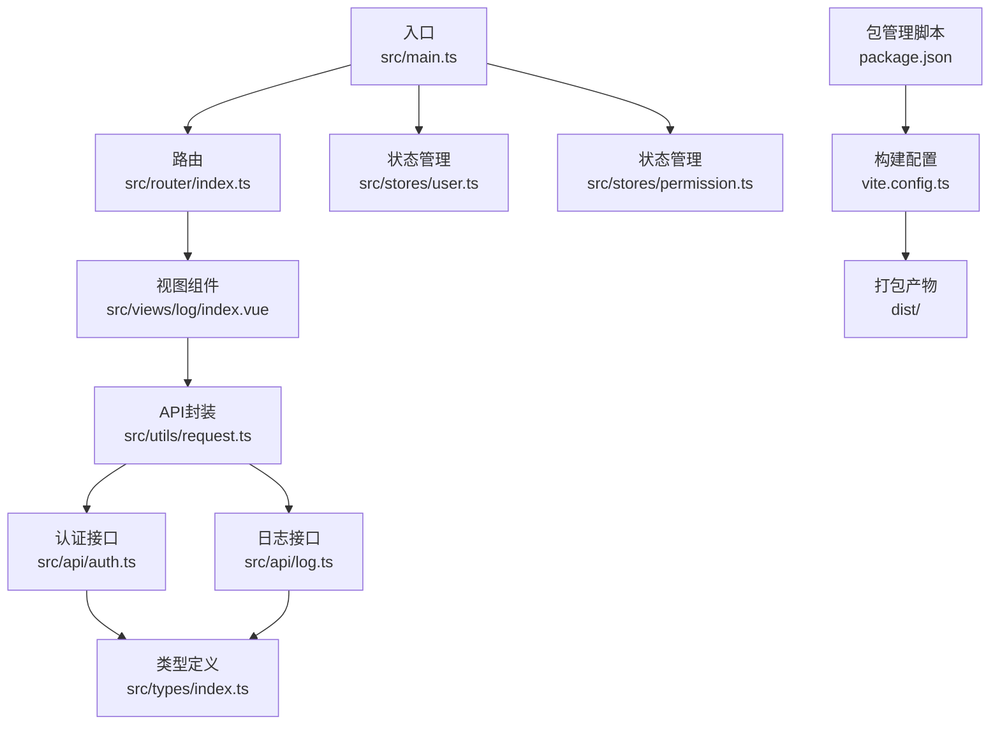
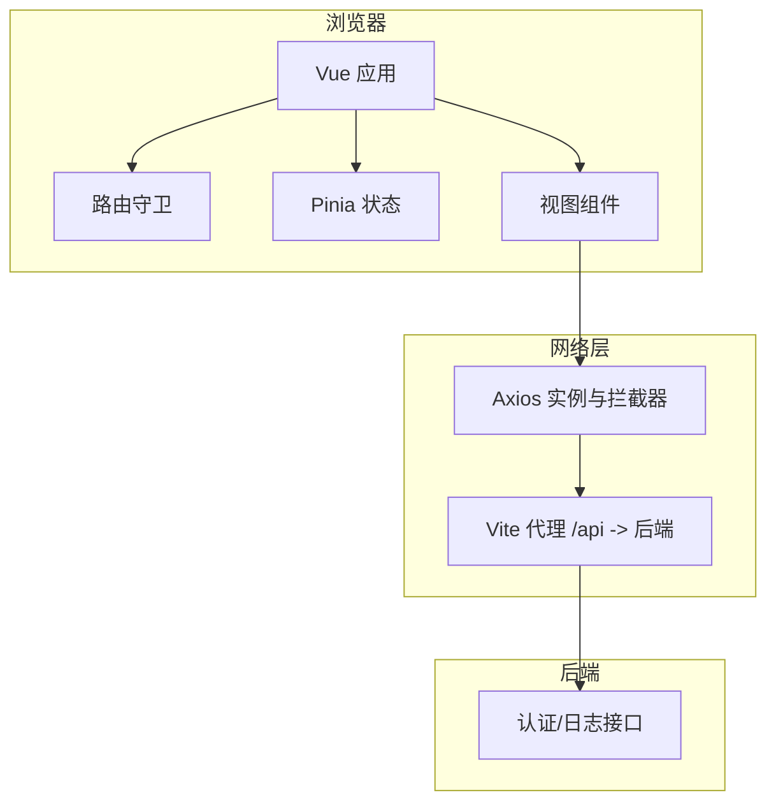
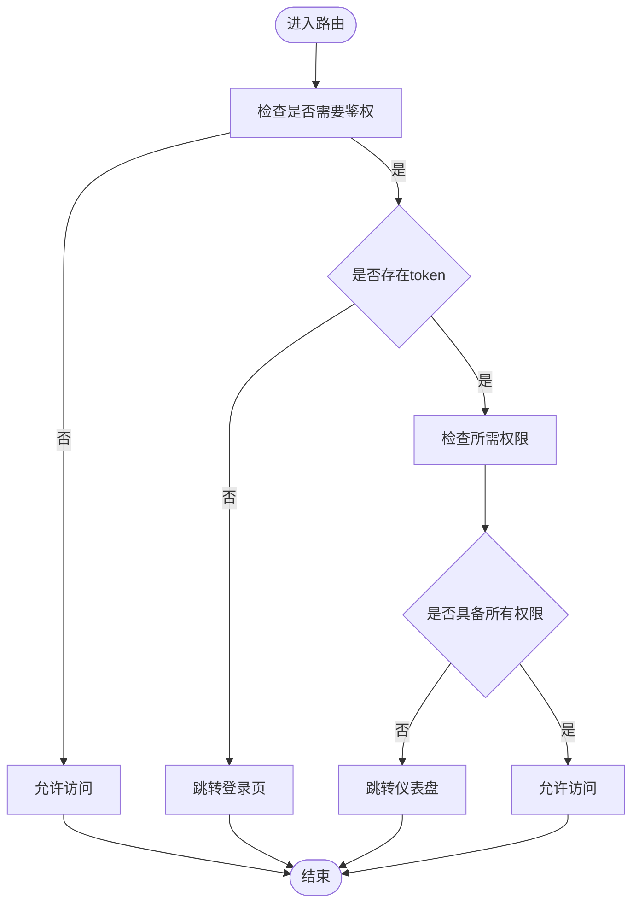
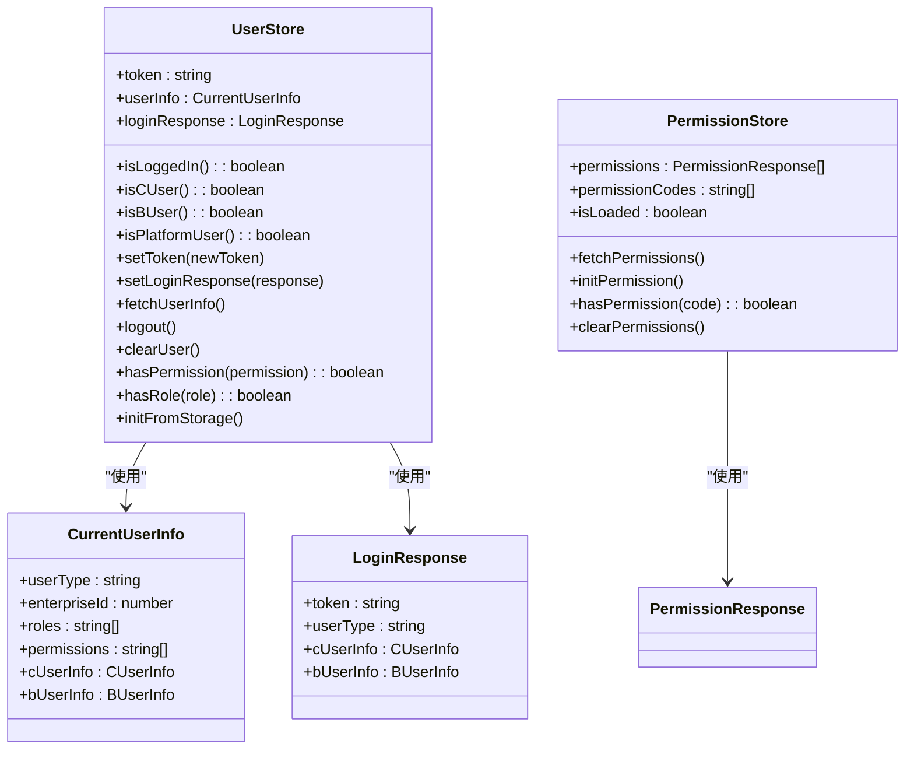
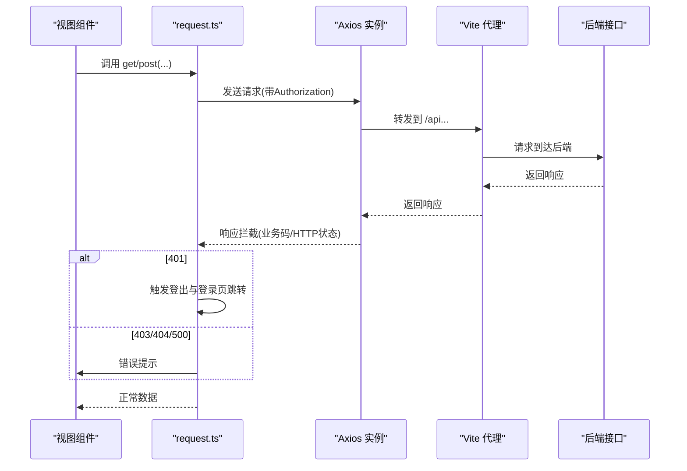
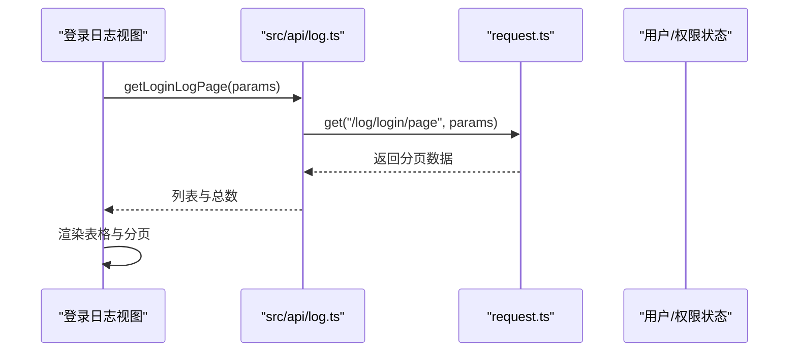
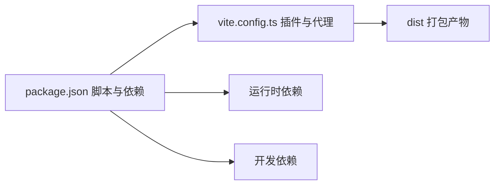

# 故障排查与回滚

<cite>
**本文引用的文件**
- [package.json](file://package.json)
- [vite.config.ts](file://vite.config.ts)
- [src/main.ts](file://src/main.ts)
- [src/router/index.ts](file://src/router/index.ts)
- [src/stores/user.ts](file://src/stores/user.ts)
- [src/stores/permission.ts](file://src/stores/permission.ts)
- [src/utils/request.ts](file://src/utils/request.ts)
- [src/api/auth.ts](file://src/api/auth.ts)
- [src/api/log.ts](file://src/api/log.ts)
- [src/views/log/index.vue](file://src/views/log/index.vue)
- [src/types/index.ts](file://src/types/index.ts)
- [src/types/api.d.ts](file://src/types/api.d.ts)
</cite>

## 目录
1. [简介](#简介)
2. [项目结构](#项目结构)
3. [核心组件](#核心组件)
4. [架构总览](#架构总览)
5. [详细组件分析](#详细组件分析)
6. [依赖分析](#依赖分析)
7. [性能考虑](#性能考虑)
8. [故障排查指南](#故障排查指南)
9. [回滚策略与版本管理](#回滚策略与版本管理)
10. [日志收集与分析](#日志收集与分析)
11. [应急处理预案与故障恢复流程](#应急处理预案与故障恢复流程)
12. [结论](#结论)

## 简介
本文件面向HC管理系统的运维与开发团队，提供从构建到运行、从故障定位到回滚恢复的完整实践指南。内容覆盖：
- 构建失败排查与修复路径
- 运行时错误定位与处理
- 性能问题识别与优化建议
- 回滚策略与版本管理（蓝绿部署、滚动更新、快速回滚）
- 日志收集与分析（构建日志、运行日志、错误日志）
- 应急预案与故障恢复流程，确保系统稳定可靠

## 项目结构
前端采用Vite + Vue 3 + TypeScript + Pinia + Element Plus技术栈，路由基于history模式，通过代理将/api前缀转发至后端服务。应用通过Axios封装统一请求与拦截器，使用Pinia进行状态管理，权限与用户信息持久化在本地存储中。

**图表来源**
- [src/main.ts:1-27](file://src/main.ts#L1-L27)
- [src/router/index.ts:1-127](file://src/router/index.ts#L1-L127)
- [src/stores/user.ts:1-152](file://src/stores/user.ts#L1-L152)
- [src/stores/permission.ts:1-56](file://src/stores/permission.ts#L1-L56)
- [src/views/log/index.vue:1-128](file://src/views/log/index.vue#L1-L128)
- [src/utils/request.ts:1-148](file://src/utils/request.ts#L1-L148)
- [src/api/auth.ts:1-69](file://src/api/auth.ts#L1-L69)
- [src/api/log.ts:1-16](file://src/api/log.ts#L1-L16)
- [src/types/index.ts:1-188](file://src/types/index.ts#L1-L188)
- [vite.config.ts:1-46](file://vite.config.ts#L1-L46)
- [package.json:1-35](file://package.json#L1-L35)

**章节来源**
- [package.json:1-35](file://package.json#L1-L35)
- [vite.config.ts:1-46](file://vite.config.ts#L1-L46)
- [src/main.ts:1-27](file://src/main.ts#L1-L27)
- [src/router/index.ts:1-127](file://src/router/index.ts#L1-L127)

## 核心组件
- 应用入口与插件注册：创建Vue实例、挂载Pinia与路由、引入Element Plus图标与全局样式，启动时从本地存储初始化用户状态。
- 路由守卫：基于meta字段控制鉴权与权限校验；支持登录页与仪表盘的跳转逻辑；动态设置页面标题。
- 状态管理：
  - 用户状态：维护token、用户信息、登录响应、权限与角色计算属性；提供登录、登出、清理、权限判断与本地存储初始化能力。
  - 权限状态：拉取权限列表、初始化权限缓存、提供权限判断与清空能力。
- 请求封装：统一基地址、超时、凭证携带；请求头注入Authorization；响应拦截处理业务码与HTTP状态码；统一错误提示与路由跳转。
- 视图与API：
  - 登录日志视图：分页查询登录日志，支持按用户类型与用户ID筛选。
  - 认证与日志API：封装登录、登出、当前用户信息、登录日志分页等接口。

**章节来源**
- [src/main.ts:1-27](file://src/main.ts#L1-L27)
- [src/router/index.ts:82-124](file://src/router/index.ts#L82-L124)
- [src/stores/user.ts:1-152](file://src/stores/user.ts#L1-L152)
- [src/stores/permission.ts:1-56](file://src/stores/permission.ts#L1-L56)
- [src/utils/request.ts:1-148](file://src/utils/request.ts#L1-L148)
- [src/views/log/index.vue:1-128](file://src/views/log/index.vue#L1-L128)
- [src/api/auth.ts:1-69](file://src/api/auth.ts#L1-L69)
- [src/api/log.ts:1-16](file://src/api/log.ts#L1-L16)

## 架构总览
前端通过Vite构建，开发服务器启用代理将/api转发至后端；运行时通过Axios拦截器统一处理鉴权、权限与错误；路由守卫保障页面访问安全；状态管理负责用户态与权限态的持久化与计算。

**图表来源**
- [vite.config.ts:29-39](file://vite.config.ts#L29-L39)
- [src/utils/request.ts:37-101](file://src/utils/request.ts#L37-L101)
- [src/router/index.ts:82-124](file://src/router/index.ts#L82-L124)

## 详细组件分析

### 组件A：路由与鉴权
- 鉴权逻辑：未登录访问需登录页；登录页存在token则跳转仪表盘；对需要权限的路由读取本地存储中的权限集合，进行多权限校验。
- 页面标题：根据meta.title动态设置document.title。
- 异常分支：解析用户信息失败时放行，避免阻塞后续store更新。

**图表来源**
- [src/router/index.ts:82-124](file://src/router/index.ts#L82-L124)

**章节来源**
- [src/router/index.ts:82-124](file://src/router/index.ts#L82-L124)

### 组件B：状态管理（用户与权限）
- 用户状态：
  - 初始化：从localStorage恢复token与用户信息，兼容后端字段大小写差异。
  - 登录：保存token与用户信息，持久化到localStorage。
  - 登出：调用后端登出接口，清理本地状态并跳转登录页。
  - 权限与角色：基于userInfo计算，提供hasPermission/hasRole。
- 权限状态：
  - 拉取权限列表并生成权限码数组，标记加载完成。
  - 初始化权限缓存并反馈消息。
  - 提供hasPermission/clearPermissions。

**图表来源**
- [src/stores/user.ts:1-152](file://src/stores/user.ts#L1-L152)
- [src/stores/permission.ts:1-56](file://src/stores/permission.ts#L1-L56)
- [src/types/index.ts:151-158](file://src/types/index.ts#L151-L158)
- [src/types/index.ts:18-32](file://src/types/index.ts#L18-L32)

**章节来源**
- [src/stores/user.ts:1-152](file://src/stores/user.ts#L1-L152)
- [src/stores/permission.ts:1-56](file://src/stores/permission.ts#L1-L56)
- [src/types/index.ts:1-188](file://src/types/index.ts#L1-L188)

### 组件C：请求封装与错误处理
- 基础配置：baseURL来自环境变量或默认值，超时30秒，withCredentials开启。
- 请求拦截：自动注入Authorization头。
- 响应拦截：
  - 业务码200放行；非200统一错误提示并拒绝。
  - 401触发登出流程与登录页跳转；403提示权限不足；404/500等分别提示对应错误；网络异常给出明确提示。
- 方法封装：request/get/post/put/del统一封装。

**图表来源**
- [src/utils/request.ts:37-101](file://src/utils/request.ts#L37-L101)
- [vite.config.ts:33-37](file://vite.config.ts#L33-L37)

**章节来源**
- [src/utils/request.ts:1-148](file://src/utils/request.ts#L1-L148)
- [vite.config.ts:29-39](file://vite.config.ts#L29-L39)

### 组件D：登录日志视图与API
- 登录日志视图：支持用户类型与用户ID筛选，分页加载，展示登录状态、IP、地点、设备、失败原因与时间。
- 登录日志API：分页查询登录日志，支持用户类型与用户ID过滤。

**图表来源**
- [src/views/log/index.vue:13-27](file://src/views/log/index.vue#L13-L27)
- [src/api/log.ts:8-15](file://src/api/log.ts#L8-L15)
- [src/utils/request.ts:107-145](file://src/utils/request.ts#L107-L145)

**章节来源**
- [src/views/log/index.vue:1-128](file://src/views/log/index.vue#L1-L128)
- [src/api/log.ts:1-16](file://src/api/log.ts#L1-L16)

## 依赖分析
- 构建与开发：Vite作为构建工具，插件包括Vue、AutoImport、Components与Element Plus解析器；开发服务器代理/api到后端；生产构建输出dist目录。
- 运行时依赖：Vue 3、Vue Router、Pinia、Element Plus、axios、dayjs、jsencrypt、lodash-es。
- 开发依赖：@vitejs/plugin-vue、vite、typescript、vue-tsc、sass、unplugin-auto-import、unplugin-vue-components等。

**图表来源**
- [package.json:6-11](file://package.json#L6-L11)
- [package.json:13-33](file://package.json#L13-L33)
- [vite.config.ts:8-23](file://vite.config.ts#L8-L23)
- [vite.config.ts:40-44](file://vite.config.ts#L40-L44)

**章节来源**
- [package.json:1-35](file://package.json#L1-L35)
- [vite.config.ts:1-46](file://vite.config.ts#L1-L46)

## 性能考虑
- 构建体积：生产构建关闭source map，chunkSizeWarningLimit提升至2MB，有助于早期发现大体积模块。
- 网络请求：统一超时30秒，避免长时间阻塞；启用withCredentials以支持跨域会话。
- 路由懒加载：路由组件采用动态导入，减少首屏加载压力。
- 本地存储：用户与权限信息持久化，避免重复拉取；注意localStorage容量与序列化开销。

**章节来源**
- [vite.config.ts:40-44](file://vite.config.ts#L40-L44)
- [src/utils/request.ts:8-15](file://src/utils/request.ts#L8-L15)
- [src/router/index.ts:12-75](file://src/router/index.ts#L12-L75)
- [src/stores/user.ts:90-127](file://src/stores/user.ts#L90-L127)

## 故障排查指南

### 构建失败排查
- 常见症状
  - 编译错误：TypeScript类型检查失败或语法错误。
  - 插件冲突：AutoImport/Components解析器与Element Plus不匹配。
  - 端口占用：开发服务器端口被占用。
- 排查步骤
  - 类型检查：执行类型检查脚本，定位类型错误。
  - 插件验证：确认Element Plus解析器与组件自动注册插件版本兼容。
  - 端口变更：修改vite.config.ts中的server.port或释放占用端口。
  - 依赖安装：确保node_modules完整且版本一致。

**章节来源**
- [package.json:10-11](file://package.json#L10-L11)
- [vite.config.ts:8-23](file://vite.config.ts#L8-L23)
- [vite.config.ts:29-33](file://vite.config.ts#L29-L33)

### 运行时错误定位
- 登录与权限
  - 现象：401频繁弹窗、页面无法跳转、权限按钮不可见。
  - 定位：检查localStorage中的token与currentUserInfo；查看路由守卫与权限store状态；确认后端接口返回的业务码与HTTP状态。
- 网络错误
  - 现象：请求失败、网络连接失败、超时。
  - 定位：确认Vite代理配置是否正确；检查后端接口可用性；查看响应拦截器的错误提示分支。

**章节来源**
- [src/router/index.ts:82-124](file://src/router/index.ts#L82-L124)
- [src/stores/user.ts:62-80](file://src/stores/user.ts#L62-L80)
- [src/utils/request.ts:50-101](file://src/utils/request.ts#L50-L101)
- [vite.config.ts:33-37](file://vite.config.ts#L33-L37)

### 性能问题分析
- 首屏加载慢
  - 检查路由懒加载是否生效；分析chunkSize警告；优化第三方库按需引入。
- 请求耗时长
  - 关注后端接口性能；确认代理链路无额外延迟；减少不必要的请求合并。
- 内存与渲染
  - 分页组件与表格数据量较大时，关注虚拟滚动与分页策略；避免重复渲染。

**章节来源**
- [src/router/index.ts:12-75](file://src/router/index.ts#L12-L75)
- [vite.config.ts:40-44](file://vite.config.ts#L40-L44)
- [src/views/log/index.vue:101-109](file://src/views/log/index.vue#L101-L109)

## 回滚策略与版本管理

### 蓝绿部署
- 流程
  - 准备两套环境（蓝/绿），初始状态下仅蓝环境对外提供服务。
  - 新版本发布到绿环境，完成健康检查与冒烟测试。
  - 切换流量至绿环境，若出现异常立即切回蓝环境。
- 适用场景：需要零停机与快速切换的生产环境。

### 滚动更新
- 流程
  - 将实例分批重启，每次只替换一部分实例，持续监控健康指标。
  - 若某批次出现异常，回滚该批次实例，其余保持运行。
- 适用场景：实例数量较多、可接受短暂停机窗口的场景。

### 快速回滚流程
- 前置条件
  - 版本发布前保留上一稳定版本的构建产物与配置。
  - 配置灰度与回滚开关，便于快速切换。
- 执行步骤
  - 确认异常版本影响范围与严重程度。
  - 回滚到上一个稳定版本的构建产物。
  - 验证核心功能与关键接口，逐步放开流量。
  - 记录回滚原因、影响范围与恢复时间。

### 版本管理建议
- 语义化版本：主版本号.次版本号.修订号，遵循变更影响范围。
- 构建产物命名：包含版本号与时间戳，便于溯源与回滚。
- 配置与依赖锁定：固定关键依赖版本，避免“依赖地狱”。

[本节为通用策略说明，无需特定文件引用]

## 日志收集与分析

### 构建日志
- 收集点
  - npm/yarn/pnpm执行日志；Vite构建过程日志；TypeScript编译日志。
- 分析要点
  - 查找编译错误与类型检查失败位置；关注插件报错与依赖解析失败。
  - 对比不同环境（开发/预发/生产）的构建差异。

**章节来源**
- [package.json:6-11](file://package.json#L6-L11)
- [vite.config.ts:40-44](file://vite.config.ts#L40-L44)

### 运行日志
- 前端日志
  - 控制台错误与警告；路由守卫与状态变更日志；请求拦截器的错误提示。
- 后端日志
  - 认证与权限接口的访问日志；登录日志分页查询的日志；错误堆栈与请求追踪ID。

**章节来源**
- [src/utils/request.ts:50-101](file://src/utils/request.ts#L50-L101)
- [src/router/index.ts:82-124](file://src/router/index.ts#L82-L124)
- [src/views/log/index.vue:13-27](file://src/views/log/index.vue#L13-L27)

### 错误日志
- 401/403/404/500分类处理：结合业务码与HTTP状态，定位具体问题来源。
- 登录日志分析：统计失败原因、登录IP与设备分布，识别异常登录行为。

**章节来源**
- [src/utils/request.ts:58-98](file://src/utils/request.ts#L58-L98)
- [src/views/log/index.vue:39-50](file://src/views/log/index.vue#L39-L50)

## 应急处理预案与故障恢复流程

### 应急预案
- 登录失效
  - 现象：频繁弹出重新登录提示。
  - 处理：清除localStorage中的token与用户信息，强制跳转登录页；检查后端会话有效期与网关配置。
- 权限不足
  - 现象：按钮不可见或访问被拒。
  - 处理：刷新权限缓存；核对用户角色与权限映射；检查后端权限接口。
- 网络异常
  - 现象：请求超时或网络连接失败。
  - 处理：检查代理配置与后端可达性；确认防火墙与CDN状态。

**章节来源**
- [src/utils/request.ts:20-35](file://src/utils/request.ts#L20-L35)
- [src/stores/permission.ts:26-34](file://src/stores/permission.ts#L26-L34)
- [vite.config.ts:33-37](file://vite.config.ts#L33-L37)

### 故障恢复流程
- 快速隔离：通过灰度开关或反向代理临时屏蔽异常版本。
- 降级策略：优先保证核心功能可用，非关键接口降级或缓存。
- 回滚执行：按照版本管理策略回滚到稳定版本，验证核心指标。
- 复盘总结：记录故障根因、处置过程与改进措施，完善预案。

[本节为通用流程说明，无需特定文件引用]

## 结论
通过规范的构建流程、完善的路由与状态管理、统一的请求拦截与错误处理，以及清晰的回滚与应急预案，HC管理系统能够在复杂环境中保持高可用与可维护性。建议在生产环境中配套完善的监控与日志体系，持续优化构建与运行性能，确保系统稳定可靠。