# 构建优化配置

<cite>
**本文档引用的文件**
- [vite.config.ts](file://vite.config.ts)
- [package.json](file://package.json)
- [tsconfig.json](file://tsconfig.json)
- [tsconfig.node.json](file://tsconfig.node.json)
- [src/main.ts](file://src/main.ts)
- [index.html](file://index.html)
- [src/router/index.ts](file://src/router/index.ts)
- [src/stores/index.ts](file://src/stores/index.ts)
- [src/auto-imports.d.ts](file://src/auto-imports.d.ts)
- [src/components.d.ts](file://src/components.d.ts)
- [src/vite-env.d.ts](file://src/vite-env.d.ts)
</cite>

## 目录
1. [简介](#简介)
2. [项目结构](#项目结构)
3. [核心组件](#核心组件)
4. [架构概览](#架构概览)
5. [详细组件分析](#详细组件分析)
6. [依赖分析](#依赖分析)
7. [性能考虑](#性能考虑)
8. [故障排除指南](#故障排除指南)
9. [结论](#结论)

## 简介
本文件专注于HC管理系统的Vite构建优化配置，系统性阐述代码分割策略、资源打包优化、SourceMap设置与Chunk大小限制等关键参数，并深入解析插件配置（AutoImport自动导入、Components组件自动注册、ElementPlus解析器）的作用机制与配置要点。同时涵盖路径别名配置、开发服务器设置以及生产环境构建参数调优的最佳实践，帮助团队在保证开发体验的同时实现高效的构建流程。

## 项目结构
HC管理系统采用Vite作为构建工具，结合Vue 3生态与ElementPlus组件库，通过TypeScript进行类型约束。项目结构清晰，遵循前端工程化标准：源码位于src目录，公共静态资源位于public目录，构建产物输出至dist目录。开发服务器默认监听3000端口并通过代理访问后端服务。

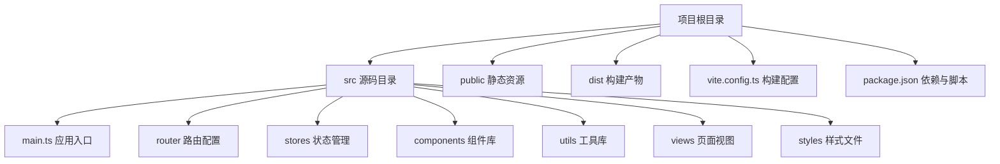

**图表来源**
- [vite.config.ts:1-46](file://vite.config.ts#L1-L46)
- [package.json:1-35](file://package.json#L1-L35)

**章节来源**
- [vite.config.ts:1-46](file://vite.config.ts#L1-L46)
- [package.json:1-35](file://package.json#L1-L35)

## 核心组件
本节聚焦Vite构建配置中的关键参数与优化策略，包括：

- 代码分割配置：通过路由级懒加载与动态导入实现按需加载，减少首屏体积。
- 资源打包优化：利用Vite内置压缩与Tree Shaking能力，结合ElementPlus按需引入降低冗余。
- SourceMap设置：生产环境关闭SourceMap以提升安全性与构建速度。
- Chunk大小限制：调整警告阈值，避免过大的Chunk影响加载性能。

此外，插件体系通过AutoImport与Components实现零样板代码的开发体验，ElementPlus解析器确保组件与指令的自动解析与类型声明生成。

**章节来源**
- [vite.config.ts:40-44](file://vite.config.ts#L40-L44)
- [src/router/index.ts:12-75](file://src/router/index.ts#L12-L75)
- [src/main.ts:1-27](file://src/main.ts#L1-L27)

## 架构概览
下图展示了从开发到生产的整体构建流程，包括插件注入、路径别名解析、开发服务器代理、构建产物输出等环节。

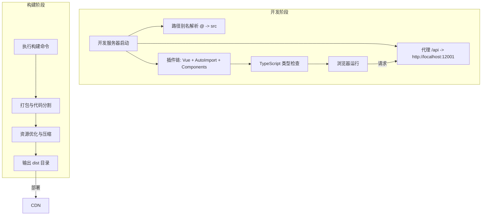

**图表来源**
- [vite.config.ts:24-44](file://vite.config.ts#L24-L44)
- [src/main.ts:1-27](file://src/main.ts#L1-L27)

## 详细组件分析

### Vite构建配置详解
- 插件配置
  - Vue插件：启用单文件组件编译与热更新。
  - AutoImport插件：自动导入Vue、Vue Router、Pinia API，生成类型声明文件，集成ESLint规则。
  - Components插件：自动注册ElementPlus组件与指令，生成类型声明文件。
- 路径别名配置：将@映射到src目录，简化导入路径。
- 开发服务器设置：端口3000、host开启、自动打开浏览器、/api前缀代理至后端服务。
- 构建参数：输出目录dist、关闭SourceMap、增大Chunk警告阈值以适应大体量项目。

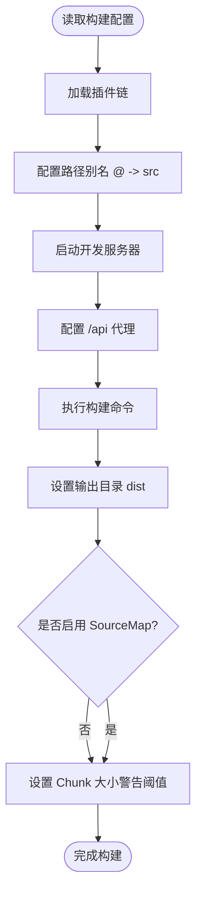

**图表来源**
- [vite.config.ts:8-44](file://vite.config.ts#L8-L44)

**章节来源**
- [vite.config.ts:8-44](file://vite.config.ts#L8-L44)

### AutoImport自动导入机制
AutoImport通过解析模板与脚本，自动注入常用API（如ref、computed、defineStore等），并生成类型声明文件以支持IDE智能提示。其解析器包含ElementPlusResolver，可自动解析图标与组件使用场景，减少手动导入工作量。

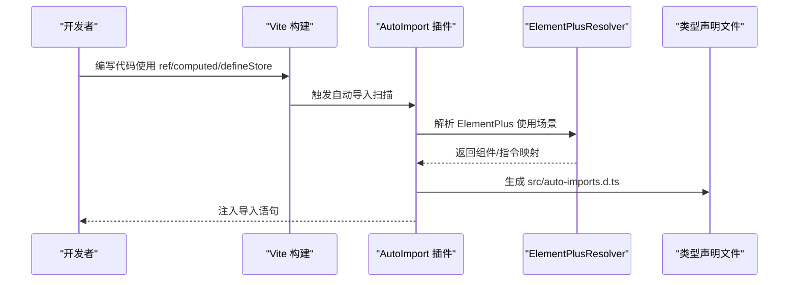

**图表来源**
- [vite.config.ts:11-18](file://vite.config.ts#L11-L18)
- [src/auto-imports.d.ts:1-89](file://src/auto-imports.d.ts#L1-L89)

**章节来源**
- [vite.config.ts:11-18](file://vite.config.ts#L11-L18)
- [src/auto-imports.d.ts:1-89](file://src/auto-imports.d.ts#L1-L89)

### Components组件自动注册机制
Components插件负责自动注册ElementPlus组件与指令，结合ElementPlusResolver实现按需解析。插件会生成类型声明文件，使TS能够识别全局组件，避免重复导入并提升开发效率。

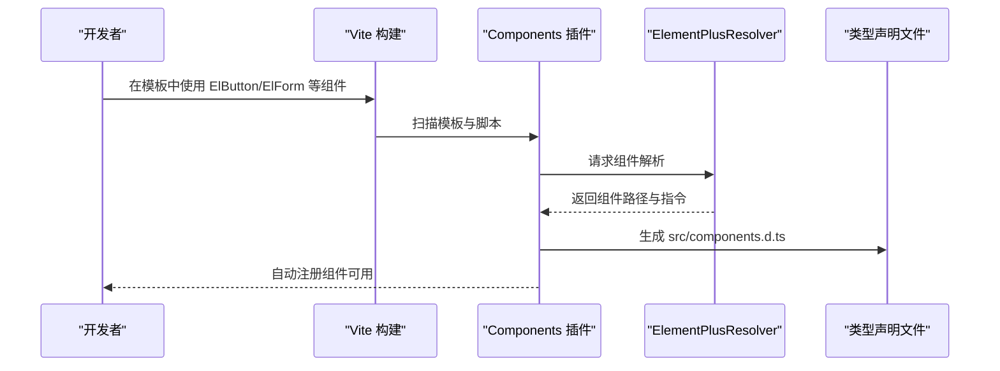

**图表来源**
- [vite.config.ts:19-22](file://vite.config.ts#L19-L22)
- [src/components.d.ts:1-45](file://src/components.d.ts#L1-L45)

**章节来源**
- [vite.config.ts:19-22](file://vite.config.ts#L19-L22)
- [src/components.d.ts:1-45](file://src/components.d.ts#L1-L45)

### ElementPlus解析器作用与配置
ElementPlusResolver作为AutoImport与Components的解析器，提供以下能力：
- 自动解析ElementPlus组件与指令，减少手工注册。
- 生成全局组件类型声明，增强TS支持。
- 与插件链协同工作，实现按需引入与Tree Shaking。

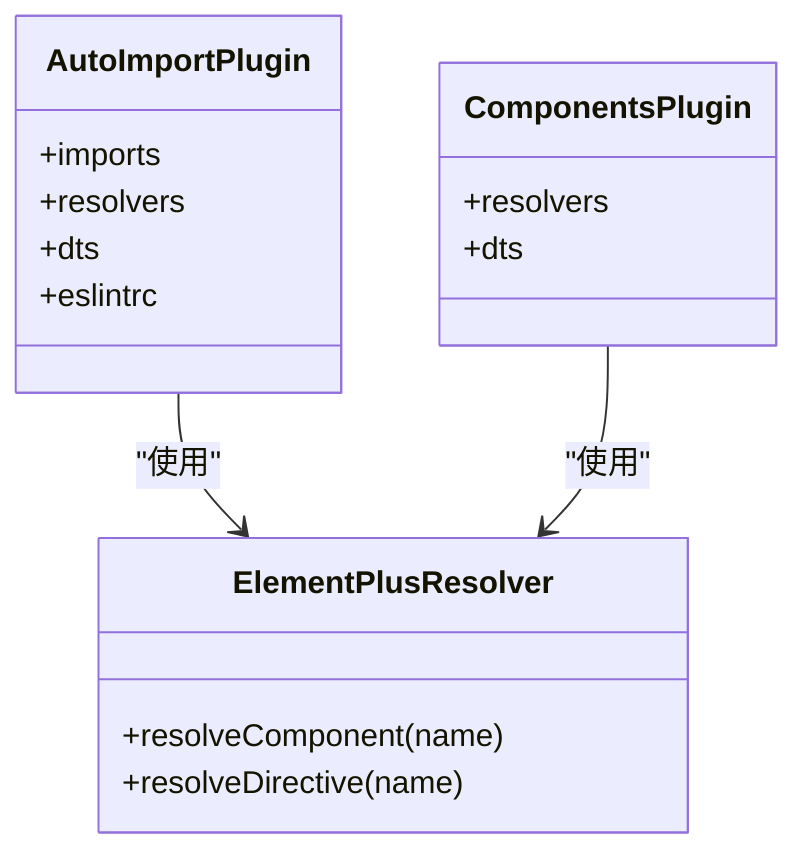

**图表来源**
- [vite.config.ts:11-22](file://vite.config.ts#L11-L22)

**章节来源**
- [vite.config.ts:11-22](file://vite.config.ts#L11-L22)

### 路径别名配置与TypeScript集成
项目通过Vite与TypeScript双重配置实现路径别名：
- Vite层面：在配置中将@指向src目录，便于模板与脚本中统一使用相对路径。
- TypeScript层面：在tsconfig.json中配置paths映射，确保编译期与IDE的路径解析一致。

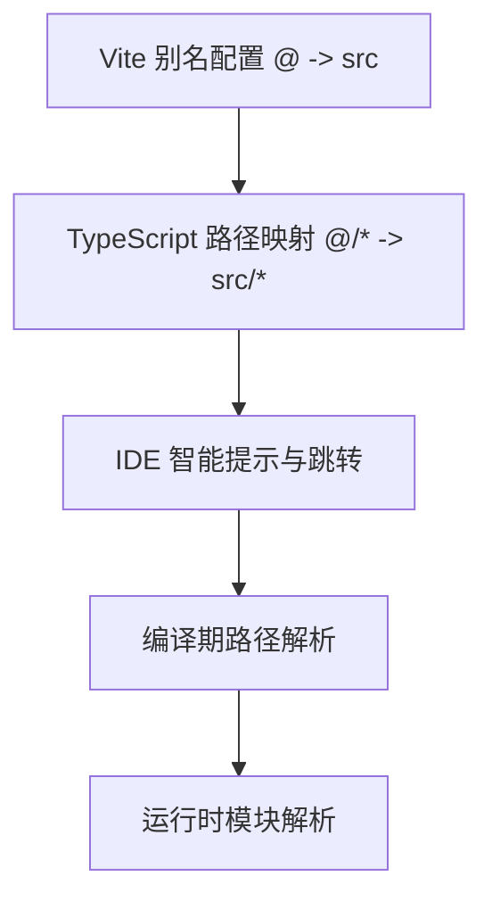

**图表来源**
- [vite.config.ts:24-28](file://vite.config.ts#L24-L28)
- [tsconfig.json:18-20](file://tsconfig.json#L18-L20)

**章节来源**
- [vite.config.ts:24-28](file://vite.config.ts#L24-L28)
- [tsconfig.json:18-20](file://tsconfig.json#L18-L20)

### 开发服务器设置与代理
开发服务器默认监听3000端口，允许外部访问并自动打开浏览器。通过代理将/api前缀的请求转发至后端服务地址，解决跨域问题并统一接口域名。

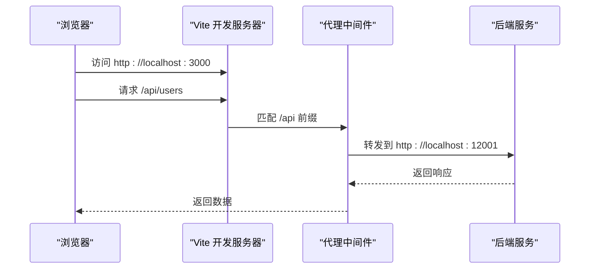

**图表来源**
- [vite.config.ts:29-39](file://vite.config.ts#L29-L39)

**章节来源**
- [vite.config.ts:29-39](file://vite.config.ts#L29-L39)

### 代码分割与路由懒加载
项目采用路由级懒加载策略，通过动态导入实现按需加载页面组件，有效降低首屏包体与初次渲染时间。该策略与Vite的代码分割能力配合，形成良好的分块效果。

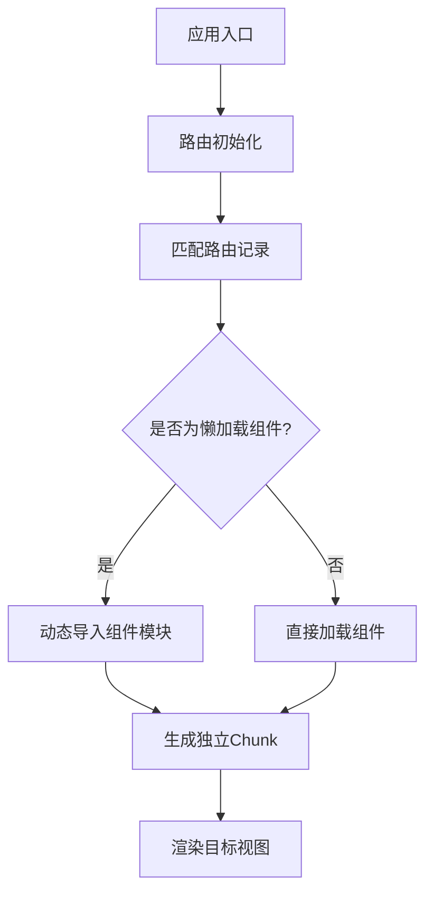

**图表来源**
- [src/router/index.ts:12-75](file://src/router/index.ts#L12-L75)

**章节来源**
- [src/router/index.ts:12-75](file://src/router/index.ts#L12-L75)

### 构建产物与性能参数
- 输出目录：dist，符合Vite默认约定。
- SourceMap：生产环境关闭，提升安全性与构建速度。
- Chunk大小警告阈值：提升至2000KB，适配大型项目的模块体量。

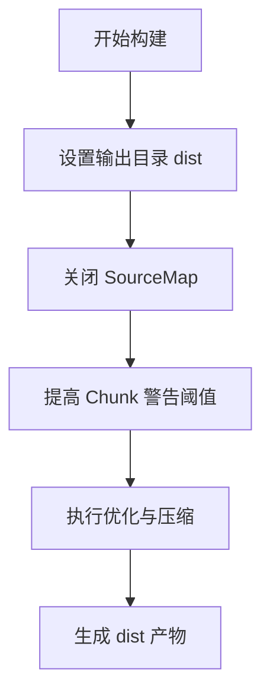

**图表来源**
- [vite.config.ts:40-44](file://vite.config.ts#L40-L44)

**章节来源**
- [vite.config.ts:40-44](file://vite.config.ts#L40-L44)

## 依赖分析
项目依赖与构建脚本关系如下：开发与生产构建均依赖Vite与TypeScript，ElementPlus作为UI基础库，AutoImport与Components提升开发效率。路由与状态管理通过Vue Router与Pinia实现，axios用于HTTP请求。

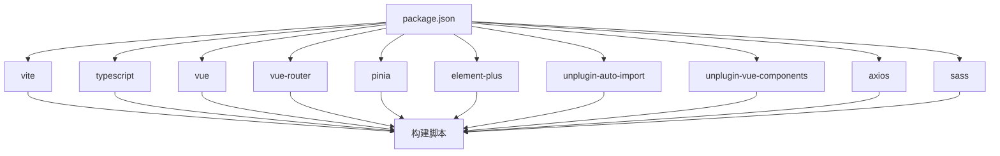

**图表来源**
- [package.json:13-33](file://package.json#L13-L33)

**章节来源**
- [package.json:13-33](file://package.json#L13-L33)

## 性能考虑
- 生产环境构建参数调优
  - 关闭SourceMap：减少构建时间与产物体积，提升安全性。
  - 提升Chunk警告阈值：避免因模块体量较大导致的频繁警告干扰。
  - 启用Tree Shaking：结合ES模块与按需引入，移除未使用代码。
  - 代码分割策略：优先对路由级组件进行懒加载，减少首屏负载。
- 开发体验优化
  - 启用HMR：提升热更新速度与开发流畅度。
  - 合理的代理配置：统一接口域名，减少跨域问题。
  - 类型声明文件：AutoImport与Components生成的类型文件有助于IDE快速定位与补全。
- 最佳实践
  - 将第三方库纳入外部依赖清单（如ElementPlus），避免重复打包。
  - 对于大体积依赖，考虑CDN或外部加载策略。
  - 定期分析Chunk大小，识别超大模块并进行拆分或优化。

[本节为通用性能指导，无需特定文件引用]

## 故障排除指南
- 构建失败或类型错误
  - 确认TypeScript配置与Vite配置一致，特别是路径别名与模块解析选项。
  - 检查类型声明文件是否正确生成（auto-imports.d.ts、components.d.ts）。
- 插件冲突或导入异常
  - 确保AutoImport与Components的解析器顺序正确，且ElementPlusResolver已启用。
  - 检查ESLint集成配置，确保enabled为true以自动生成规则文件。
- 开发服务器无法访问或代理失效
  - 核对host设置与防火墙配置，确认端口未被占用。
  - 检查代理规则是否覆盖所有需要的API前缀。
- 生产构建体积过大
  - 分析Chunk大小，识别超大模块并进行拆分或懒加载。
  - 确认未引入不必要的依赖，必要时使用CDN或外部加载。

**章节来源**
- [vite.config.ts:11-22](file://vite.config.ts#L11-L22)
- [vite.config.ts:29-39](file://vite.config.ts#L29-L39)
- [vite.config.ts:40-44](file://vite.config.ts#L40-L44)
- [src/auto-imports.d.ts:1-89](file://src/auto-imports.d.ts#L1-L89)
- [src/components.d.ts:1-45](file://src/components.d.ts#L1-L45)

## 结论
HC管理系统的Vite构建配置在开发与生产两端实现了高效平衡：通过AutoImport与Components插件显著降低样板代码，借助ElementPlus解析器实现按需引入与类型支持；通过路由懒加载与合理的代码分割策略控制首屏体积；通过关闭SourceMap与提升Chunk警告阈值优化生产构建性能。结合本文提供的最佳实践与故障排除建议，团队可在保证开发体验的同时获得稳定、高效的构建流程。