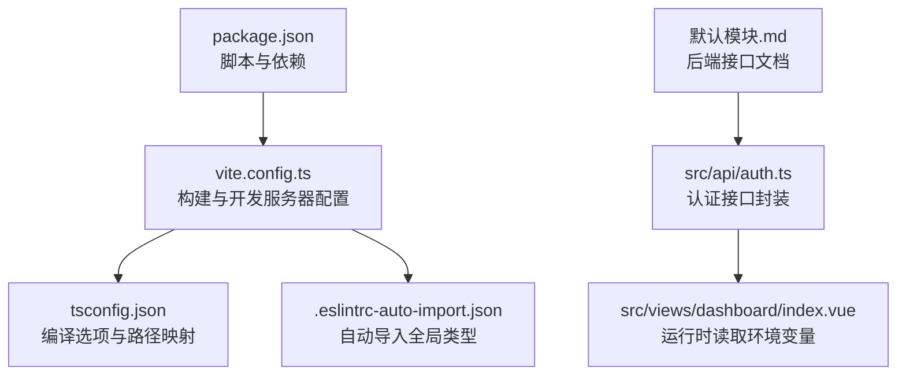
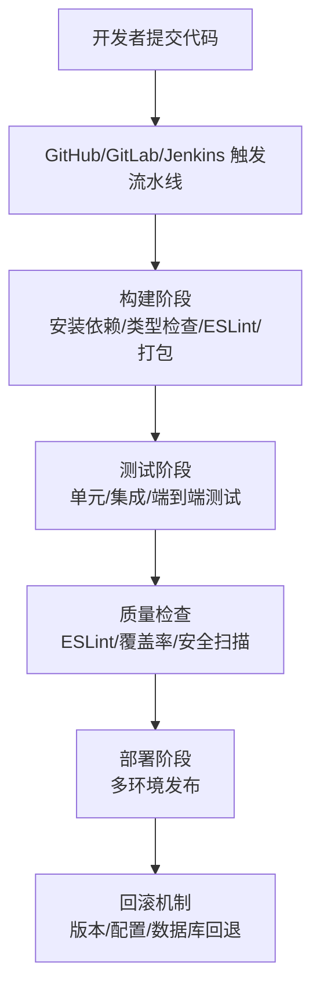
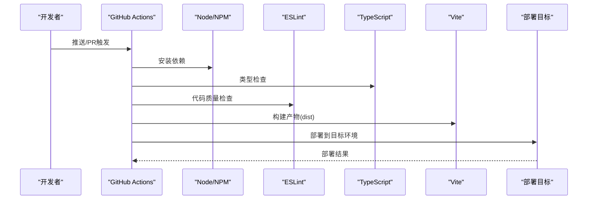
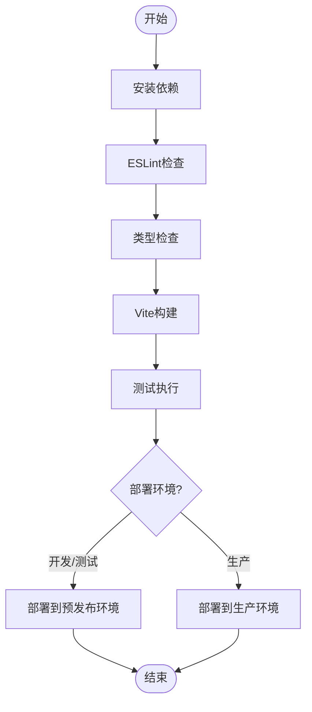
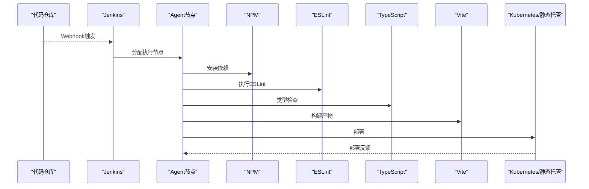
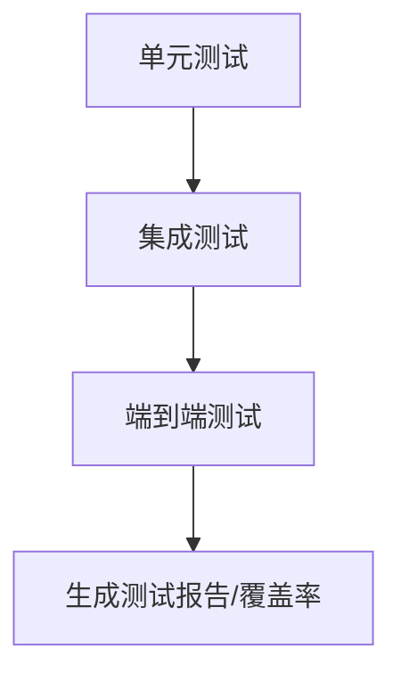
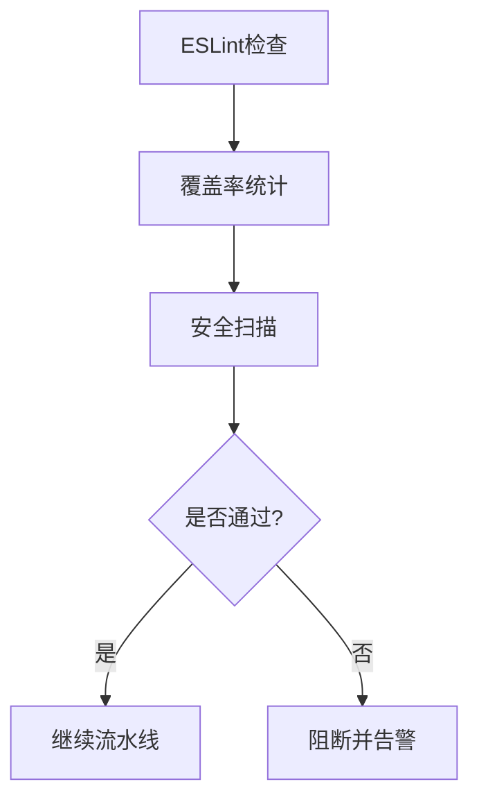
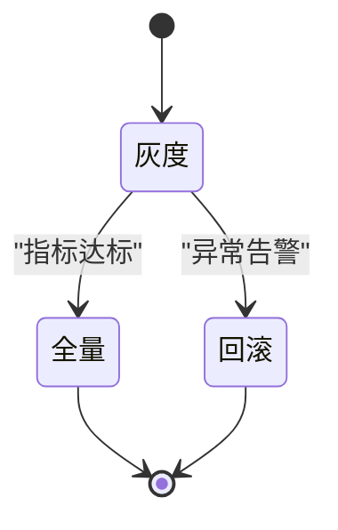
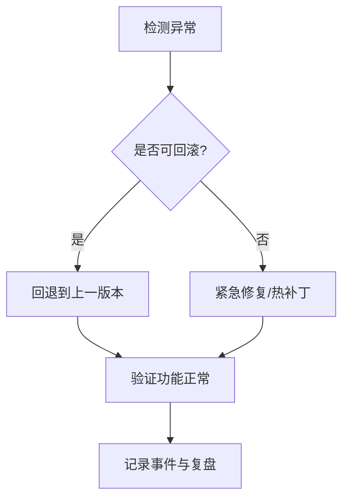
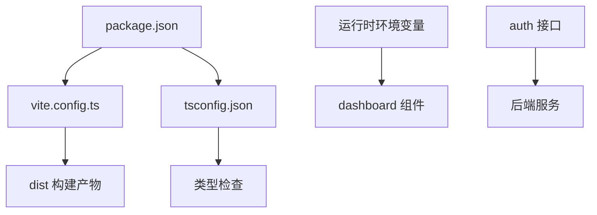

# CI/CD流水线集成

<cite>
**本文引用的文件**
- [package.json](file://package.json)
- [vite.config.ts](file://vite.config.ts)
- [tsconfig.json](file://tsconfig.json)
- [.eslintrc-auto-import.json](file://.eslintrc-auto-import.json)
- [默认模块.md](file://默认模块.md)
- [src/api/auth.ts](file://src/api/auth.ts)
- [src/views/dashboard/index.vue](file://src/views/dashboard/index.vue)
</cite>

## 目录
1. [简介](#简介)
2. [项目结构](#项目结构)
3. [核心组件](#核心组件)
4. [架构总览](#架构总览)
5. [详细组件分析](#详细组件分析)
6. [依赖关系分析](#依赖关系分析)
7. [性能考量](#性能考量)
8. [故障排查指南](#故障排查指南)
9. [结论](#结论)
10. [附录](#附录)

## 简介
本指南面向HC管理系统前端Vue应用的CI/CD流水线集成，结合仓库现有配置与脚本，系统化说明如何在GitHub Actions、GitLab CI、Jenkins中落地“构建-测试-质量检查-部署”的自动化流水线；并提供多环境部署策略（开发/测试/生产）、发布策略（蓝绿/滚动/金丝雀）与回滚机制建议。由于当前仓库未包含测试框架与ESLint配置文件，本指南同时给出可直接落地的配置模板与最佳实践。

## 项目结构
该Vue前端项目采用Vite作为构建工具，TypeScript进行类型检查，通过插件实现自动导入与组件解析，并以别名@指向src目录。项目包含基础路由、状态管理、API封装与视图层，整体结构清晰，便于在CI环境中进行标准化构建与部署。

图表来源
- [package.json:1-35](file://package.json#L1-L35)
- [vite.config.ts:1-46](file://vite.config.ts#L1-L46)
- [tsconfig.json:1-28](file://tsconfig.json#L1-L28)
- [.eslintrc-auto-import.json:1-94](file://.eslintrc-auto-import.json#L1-L94)
- [src/api/auth.ts:46-68](file://src/api/auth.ts#L46-L68)
- [src/views/dashboard/index.vue:1-38](file://src/views/dashboard/index.vue#L1-L38)
- [默认模块.md:1-800](file://默认模块.md#L1-L800)

章节来源
- [package.json:1-35](file://package.json#L1-L35)
- [vite.config.ts:1-46](file://vite.config.ts#L1-L46)
- [tsconfig.json:1-28](file://tsconfig.json#L1-L28)
- [.eslintrc-auto-import.json:1-94](file://.eslintrc-auto-import.json#L1-L94)
- [默认模块.md:1-800](file://默认模块.md#L1-L800)
- [src/api/auth.ts:46-68](file://src/api/auth.ts#L46-L68)
- [src/views/dashboard/index.vue:1-38](file://src/views/dashboard/index.vue#L1-L38)

## 核心组件
- 构建与打包
  - 使用Vite进行开发与生产构建，输出目录为dist，支持Source Map与分包体积警告阈值控制。
- 类型检查
  - 使用vue-tsc进行类型检查，配合tsconfig.json严格模式与路径别名配置。
- 质量检查
  - 提供ESLint脚本入口，结合自动导入ESLint配置文件，便于在CI中统一执行。
- 运行时环境
  - 通过import.meta.env.MODE在运行时读取环境模式，便于区分不同环境配置。

章节来源
- [vite.config.ts:40-44](file://vite.config.ts#L40-L44)
- [package.json:6-12](file://package.json#L6-L12)
- [tsconfig.json:2-22](file://tsconfig.json#L2-L22)
- [src/views/dashboard/index.vue:9](file://src/views/dashboard/index.vue#L9)

## 架构总览
下图展示从代码提交到多环境部署的典型流水线路径，涵盖构建、测试、质量检查与部署阶段。

## 详细组件分析

### GitHub Actions 集成
- 工作流定义
  - 建议在.github/workflows目录下创建工作流文件，触发条件包括push到主分支、PR合并等。
- 构建步骤
  - 使用Node.js矩阵（如18/20/22）确保跨平台兼容性。
  - 步骤顺序：检出代码、设置Node.js、安装依赖、类型检查、ESLint、构建产物。
- 测试执行
  - 在构建成功后执行测试命令（如jest/vitest等），并将测试报告上传Artifacts或发布到CI平台。
- 部署策略
  - 生产环境部署至静态托管（如GitHub Pages、Vercel、Netlify）或自建CDN。
  - 开发/测试环境可部署至对应子域名或独立空间。
- 安全与缓存
  - 使用npm ci与npm cache以提升速度与一致性。
  - 对敏感信息使用Secrets管理，避免硬编码。

### GitLab CI 集成
- .gitlab-ci.yml编写
  - 定义 stages：install、lint、build、test、deploy。
  - 使用cache加速依赖安装，配置artifacts传递构建产物。
- 管道配置
  - 使用Node.js官方镜像，按需启用Docker或Kubernetes Runner。
  - 将环境变量注入到CI环境，区分开发/测试/生产。
- 环境变量管理
  - 在GitLab项目Settings > CI/CD中配置变量，如API_BASE_URL、VITE_MODE等。
  - 使用masked与protected保护敏感信息。

### Jenkins 集成
- 流水线脚本编写
  - 使用Jenkinsfile声明式流水线，定义stages与agent（如Docker容器）。
  - 引入Node.js Toolchain与NPM Registry配置。
- 构建触发器
  - 支持Webhook触发、定时构建与手动触发。
- 部署策略
  - 通过Publish Over SSH或Kubernetes Plugin部署到目标集群或静态站点。
  - 结合Blue Ocean可视化流水线执行过程。

### 自动化测试集成
- 单元测试
  - 建议引入vitest/jest，对组件与工具函数进行单元测试，生成覆盖率报告。
- 集成测试
  - 使用cypress/playwright对页面交互进行端到端验证，结合Mock服务。
- 端到端测试
  - 在CI中使用无头浏览器执行，失败时截图与日志归档。

### 代码质量检查
- ESLint配置
  - 在根目录新增.eslintrc.*或在package.json中配置eslintConfig，继承推荐规则集。
  - 结合pre-commit钩子与CI共同保障提交质量。
- 代码覆盖率
  - 在测试阶段生成覆盖率报告（如HTML/Cobertura），在CI中进行阈值检查。
- 安全扫描
  - 使用npm audit或Snyk等工具定期扫描依赖漏洞，修复高危问题。

### 多环境部署
- 开发环境
  - 通过本地代理或内网域名访问，便于联调后端接口。
- 测试环境
  - 预发布空间，模拟真实流量与配置，进行回归测试。
- 生产环境
  - 静态资源托管或容器化部署，启用HTTPS与缓存策略。

### 发布策略
- 蓝绿部署
  - 新版本部署至备用实例，切换流量后清理旧实例。
- 滚动更新
  - 分批替换实例，降低单次变更影响。
- 金丝雀发布
  - 少量流量引导至新版本，持续监控后逐步扩大。

### 回滚机制
- 版本回退
  - 保留上一版本构建产物，一键回切。
- 数据库迁移回滚
  - 通过迁移脚本逆向执行，确保数据一致性。
- 配置恢复
  - 使用版本化的配置文件与密钥管理，快速恢复到上一稳定配置。

## 依赖关系分析
- 构建链路
  - package.json中的脚本驱动类型检查、ESLint与Vite构建。
  - vite.config.ts定义插件、别名与开发服务器代理，影响CI中代理配置。
  - tsconfig.json提供严格类型检查与路径映射，保证CI一致行为。
- 运行时依赖
  - src/views/dashboard/index.vue通过import.meta.env.MODE读取环境模式，便于在CI中注入环境变量。
  - src/api/auth.ts封装认证接口，CI中可通过环境变量配置后端地址。

图表来源
- [package.json:6-12](file://package.json#L6-L12)
- [vite.config.ts:1-46](file://vite.config.ts#L1-L46)
- [tsconfig.json:2-22](file://tsconfig.json#L2-L22)
- [src/views/dashboard/index.vue:9](file://src/views/dashboard/index.vue#L9)
- [src/api/auth.ts:46-68](file://src/api/auth.ts#L46-L68)

章节来源
- [package.json:6-12](file://package.json#L6-L12)
- [vite.config.ts:1-46](file://vite.config.ts#L1-L46)
- [tsconfig.json:2-22](file://tsconfig.json#L2-L22)
- [src/views/dashboard/index.vue:9](file://src/views/dashboard/index.vue#L9)
- [src/api/auth.ts:46-68](file://src/api/auth.ts#L46-L68)

## 性能考量
- 构建优化
  - 启用Source Map仅在调试环境，生产关闭以减少体积。
  - 合理设置chunkSizeWarningLimit，避免大包导致构建失败。
- 缓存与并发
  - CI中使用依赖缓存与并行任务，缩短流水线时间。
- 部署优化
  - 启用Gzip/Brotli压缩与CDN缓存，提升首屏加载速度。

## 故障排查指南
- 构建失败
  - 检查Node版本与依赖锁文件，确认tsconfig与vite配置一致。
- 类型错误
  - 在CI中开启严格模式，定位未声明或类型不匹配问题。
- ESLint报错
  - 在本地先执行ESLint修复，再提交；CI中保持失败阻断。
- 端到端测试失败
  - 查看截图与日志，确认网络代理与后端接口可达性。
- 部署异常
  - 校验环境变量与证书，核对目标路径与权限。

## 结论
本指南基于现有仓库配置，给出了在GitHub Actions、GitLab CI、Jenkins中落地CI/CD流水线的完整方案，并配套多环境部署、发布策略与回滚机制建议。建议尽快补齐ESLint与测试配置文件，以实现更稳健的质量门禁与自动化交付。

## 附录
- 参考文档与接口
  - 默认模块.md中包含后端接口规范，可用于联调与测试用例设计。

章节来源
- [默认模块.md:1-800](file://默认模块.md#L1-L800)