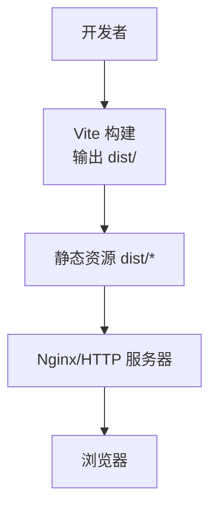
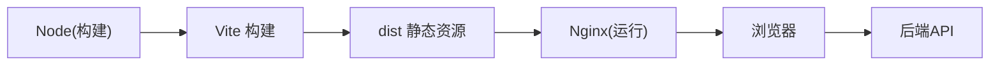

# Docker容器化部署

<cite>
**本文引用的文件**
- [package.json](file://package.json)
- [vite.config.ts](file://vite.config.ts)
- [index.html](file://index.html)
- [dist/index.html](file://dist/index.html)
- [src/main.ts](file://src/main.ts)
- [src/router/index.ts](file://src/router/index.ts)
- [src/api/index.ts](file://src/api/index.ts)
- [src/api/auth.ts](file://src/api/auth.ts)
- [src/utils/request.ts](file://src/utils/request.ts)
- [src/stores/user.ts](file://src/stores/user.ts)
- [默认模块.md](file://默认模块.md)
</cite>

## 目录
1. [简介](#简介)
2. [项目结构](#项目结构)
3. [核心组件](#核心组件)
4. [架构总览](#架构总览)
5. [详细组件分析](#详细组件分析)
6. [依赖关系分析](#依赖关系分析)
7. [性能考虑](#性能考虑)
8. [故障排查指南](#故障排查指南)
9. [结论](#结论)
10. [附录](#附录)

## 简介
本方案面向HC管理系统前端应用，提供从源码到容器运行、从单机到编排的完整Docker化落地指南。内容涵盖：
- Dockerfile编写：基础镜像选择、多阶段构建、依赖安装与资源复制
- 镜像构建流程：构建参数、标签管理、版本控制策略
- 容器运行配置：端口映射、环境变量、数据卷挂载
- 容器编排：Docker Compose与Kubernetes部署清单、服务发现
- 安全配置：非root运行、最小权限、安全扫描
- 监控与日志：日志收集、健康检查、性能监控
- 网络配置：网络模式、端口映射、服务间通信

## 项目结构
前端为Vue 3 + Vite工程，构建产物输出至dist目录，开发服务器默认监听3000端口，并通过代理将/api前缀转发至后端服务。



图表来源
- [vite.config.ts:29-44](file://vite.config.ts#L29-L44)
- [dist/index.html:1-15](file://dist/index.html#L1-L15)

章节来源
- [package.json:6-12](file://package.json#L6-L12)
- [vite.config.ts:8-45](file://vite.config.ts#L8-L45)

## 核心组件
- 构建工具链：Vite负责开发与生产构建，生成静态资源
- 前端应用：Vue 3 + 路由 + 状态管理 + API封装
- 运行时：Nginx或任意静态HTTP服务器提供dist目录
- 代理与后端通信：开发时通过Vite代理转发至后端；生产环境通常由反向代理统一处理

章节来源
- [src/main.ts:1-27](file://src/main.ts#L1-L27)
- [src/router/index.ts:1-127](file://src/router/index.ts#L1-L127)
- [src/utils/request.ts:6-15](file://src/utils/request.ts#L6-L15)

## 架构总览
前端容器化采用“构建产物静态化 + 反向代理/静态服务器”的典型架构。开发与生产的关键差异在于：
- 开发：Vite Dev Server + 本地代理
- 生产：Nginx提供静态资源 + 统一反向代理到后端

```mermaid
graph TB
subgraph "开发环境"
ViteDev["Vite Dev Server<br/>端口 3000"] --> Proxy["Vite 代理 /api -> 后端"]
end
subgraph "生产环境"
Nginx["Nginx/静态服务器"] --> Static["静态资源 dist/*"]
Nginx --> ReverseProxy["反向代理 /api -> 后端"]
end
Browser["浏览器"] --> |HTTP(S)| ViteDev
Browser --> |HTTP(S)| Nginx
```

图表来源
- [vite.config.ts:29-39](file://vite.config.ts#L29-L39)
- [src/utils/request.ts:6](file://src/utils/request.ts#L6)

## 详细组件分析

### Dockerfile 编写
- 基础镜像选择
  - 多阶段构建：第一阶段使用Node官方镜像进行构建，第二阶段使用Nginx官方镜像提供静态服务
  - 选择Nginx作为运行时镜像，具备成熟稳定、体积小、性能好的优势
- 多阶段构建
  - 第一阶段：安装依赖、执行构建脚本、产出dist目录
  - 第二阶段：仅拷贝dist目录到Nginx默认站点目录，不携带构建工具
- 依赖安装
  - 使用package.json中的脚本进行构建，确保依赖与构建命令一致
- 资源复制
  - 将dist目录全部复制到Nginx站点根目录，保证静态资源可被正确访问

章节来源
- [package.json:6-12](file://package.json#L6-L12)
- [vite.config.ts:40-44](file://vite.config.ts#L40-L44)

### 镜像构建流程
- 构建参数配置
  - NODE_ENV设置为production，确保构建产物优化
  - 可通过构建参数传入VITE_API_BASE_URL，实现不同环境的后端地址注入
- 镜像标签管理
  - 建议采用语义化版本号命名，如：hc-vue-demo:1.0.0
  - 对多环境可追加环境后缀，如：hc-vue-demo:1.0.0-prod
- 版本控制策略
  - 以Git Tag或分支作为镜像版本依据
  - 每次构建更新版本号并推送镜像仓库

章节来源
- [vite.config.ts:40-44](file://vite.config.ts#L40-L44)

### 容器运行配置
- 端口映射
  - 将容器内80端口映射到宿主机随机端口或固定端口
- 环境变量传递
  - 通过环境变量VITE_API_BASE_URL注入后端地址
  - 如需HTTPS或特定域名，可在运行时调整
- 数据卷挂载
  - 生产环境通常无需挂载静态资源卷，因为dist已复制进镜像
  - 如需热更新或调试，可挂载Nginx配置文件进行覆盖

章节来源
- [src/utils/request.ts:6](file://src/utils/request.ts#L6)

### 容器编排方案
- Docker Compose
  - 定义web服务：映射端口、挂载Nginx配置、设置环境变量
  - 定义后端服务：暴露API端口、挂载配置与日志
  - 使用networks实现服务互通
- Kubernetes部署清单
  - Deployment：定义副本数、容器镜像、环境变量、资源限制
  - Service：ClusterIP或LoadBalancer暴露服务
  - ConfigMap：注入VITE_API_BASE_URL等配置
  - Secret：敏感配置（如证书、密钥）通过Secret管理
  - Ingress：统一入口与TLS终止
- 服务发现配置
  - 在Kubernetes中通过Service名称进行服务间通信
  - 在Docker Compose中通过服务名进行通信

章节来源
- [src/utils/request.ts:6](file://src/utils/request.ts#L6)

### 容器安全配置
- 非root用户运行
  - 在Dockerfile中切换到非root用户或使用runAsUser在K8s中设置
- 最小权限原则
  - 仅授予Nginx读取静态资源所需的最小权限
  - 不在容器内安装未必要的软件包
- 安全扫描
  - 使用镜像扫描工具对最终运行镜像进行漏洞扫描
  - 定期更新基础镜像与依赖

章节来源
- [vite.config.ts:40-44](file://vite.config.ts#L40-L44)

### 容器监控与日志管理
- 日志收集配置
  - Nginx访问/错误日志输出到标准输出/标准错误，便于容器平台采集
- 健康检查
  - 提供简单的HTTP健康检查端点（如/health），轮询检测Nginx可用性
- 性能监控
  - 结合Prometheus/Grafana对Nginx指标进行采集与可视化
  - 关注静态资源命中率、响应时间、并发连接数

章节来源
- [dist/index.html:1-15](file://dist/index.html#L1-L15)

### 容器网络配置
- 网络模式选择
  - 使用桥接网络，便于跨服务通信
- 端口映射
  - 前端容器对外暴露80端口，后端容器暴露API端口
- 服务间通信
  - 在Docker Compose中通过服务名通信
  - 在Kubernetes中通过Service DNS或ClusterIP通信

章节来源
- [vite.config.ts:29-39](file://vite.config.ts#L29-L39)

## 依赖关系分析
前端应用的运行时依赖主要来自构建与运行两个阶段：
- 构建阶段：Vite、Node、依赖安装
- 运行阶段：Nginx、浏览器渲染、后端API



图表来源
- [package.json:6-12](file://package.json#L6-L12)
- [vite.config.ts:40-44](file://vite.config.ts#L40-L44)

## 性能考虑
- 构建优化
  - 启用生产构建与代码分割，减少首屏加载时间
  - 合理设置chunkSizeWarningLimit，避免大块资源导致性能问题
- 运行优化
  - 启用Gzip/Brotli压缩与缓存头
  - 使用CDN分发静态资源
  - 合理设置Nginx worker进程与连接数

章节来源
- [vite.config.ts:40-44](file://vite.config.ts#L40-L44)

## 故障排查指南
- 构建失败
  - 检查Node版本与依赖安装是否成功
  - 确认构建脚本与package.json一致
- 访问异常
  - 检查Nginx配置与静态资源路径
  - 确认环境变量VITE_API_BASE_URL指向正确的后端地址
- 代理不通
  - 开发环境确认Vite代理配置
  - 生产环境确认反向代理规则与后端可达性

章节来源
- [src/utils/request.ts:6](file://src/utils/request.ts#L6)
- [vite.config.ts:29-39](file://vite.config.ts#L29-L39)

## 结论
通过多阶段构建与Nginx运行时的组合，HC管理系统前端可实现轻量、安全、可运维的容器化部署。结合Docker Compose与Kubernetes，可在单机与集群环境中快速落地。建议在生产中配合安全扫描、健康检查与监控告警体系，确保系统稳定与可观测。

## 附录
- 开发服务器端口与代理配置参考
  - [vite.config.ts:29-39](file://vite.config.ts#L29-L39)
- 构建产物与入口HTML
  - [dist/index.html:1-15](file://dist/index.html#L1-L15)
  - [index.html:1-14](file://index.html#L1-L14)
- 前端应用入口与路由
  - [src/main.ts:1-27](file://src/main.ts#L1-L27)
  - [src/router/index.ts:1-127](file://src/router/index.ts#L1-L127)
- API调用与后端接口
  - [src/utils/request.ts:6-15](file://src/utils/request.ts#L6-L15)
  - [src/api/auth.ts:1-69](file://src/api/auth.ts#L1-L69)
  - [默认模块.md:24-795](file://默认模块.md#L24-L795)