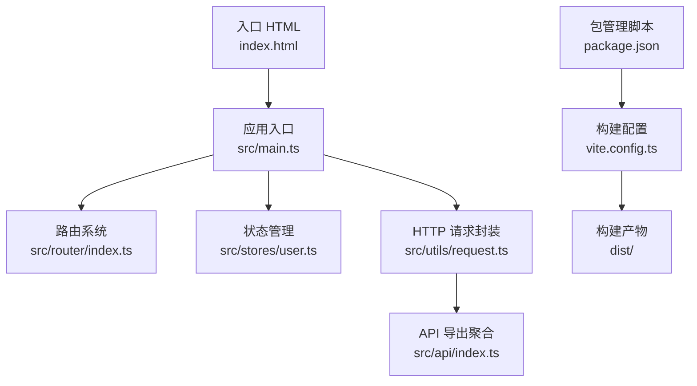
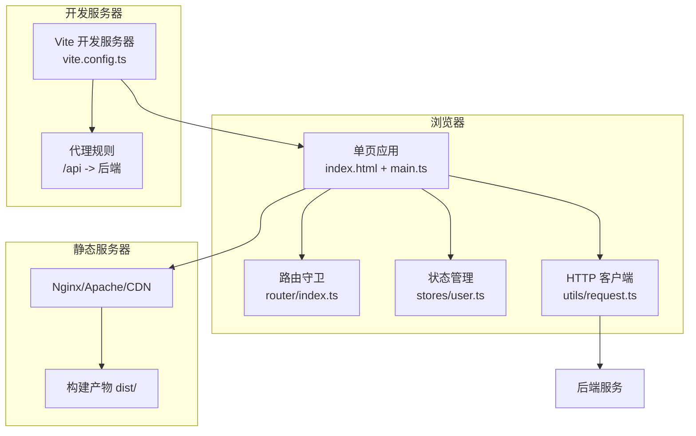
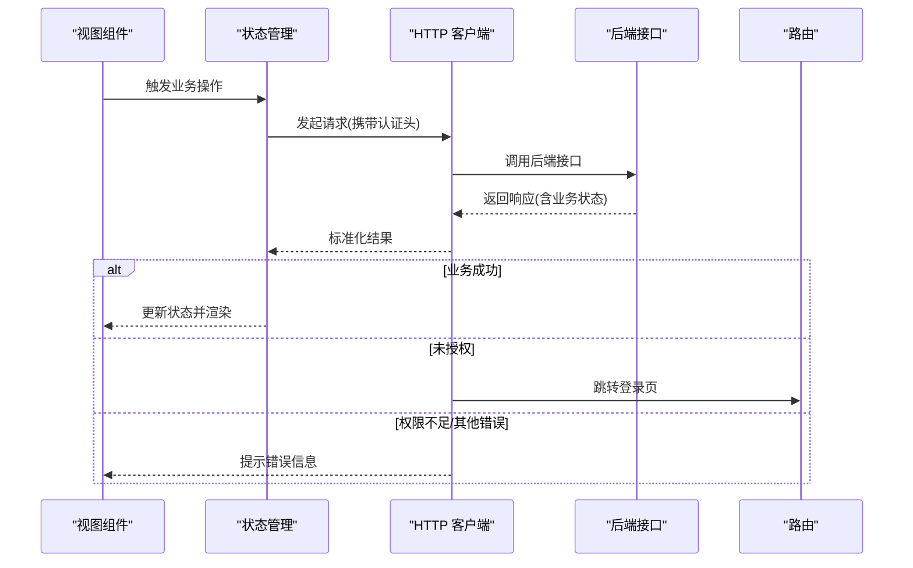
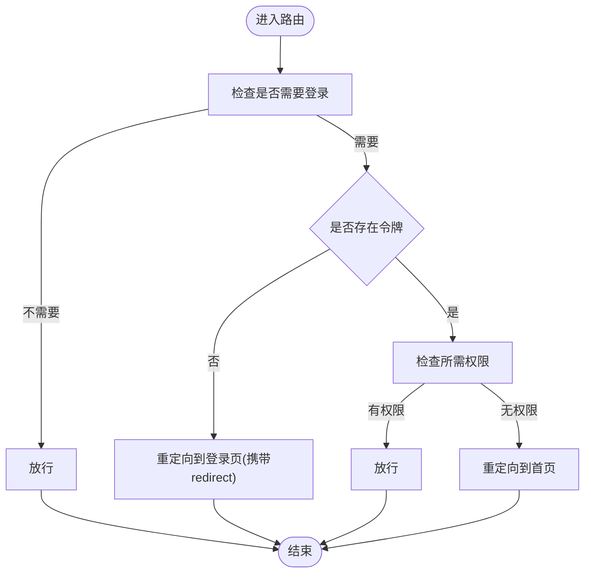
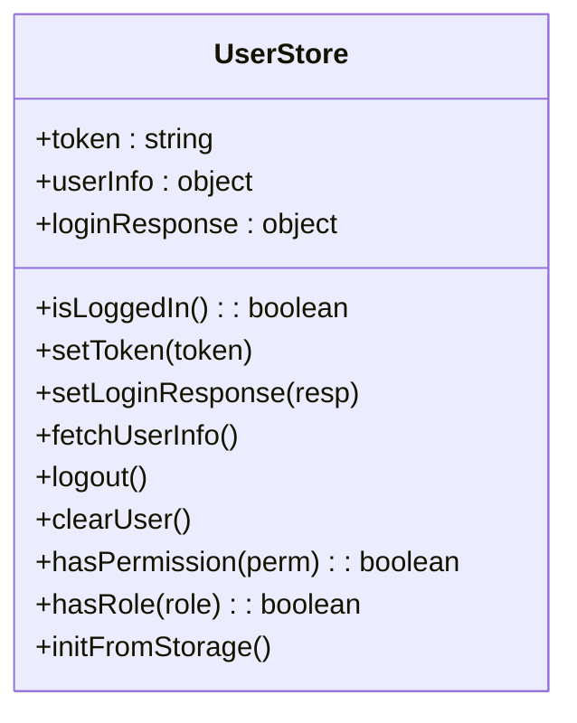
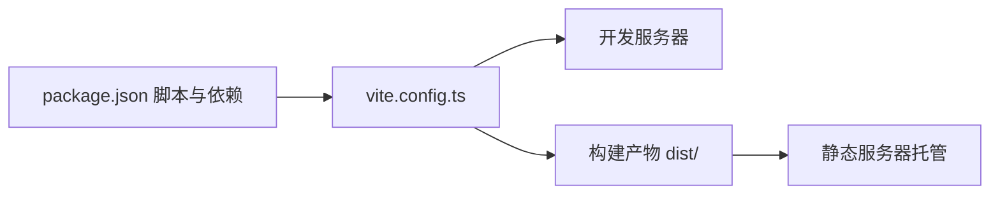

# 环境部署实施

<cite>
**本文引用的文件**
- [package.json](file://package.json)
- [vite.config.ts](file://vite.config.ts)
- [index.html](file://index.html)
- [src/main.ts](file://src/main.ts)
- [src/utils/request.ts](file://src/utils/request.ts)
- [src/router/index.ts](file://src/router/index.ts)
- [src/stores/user.ts](file://src/stores/user.ts)
- [src/api/index.ts](file://src/api/index.ts)
</cite>

## 目录
1. [简介](#简介)
2. [项目结构](#项目结构)
3. [核心组件](#核心组件)
4. [架构总览](#架构总览)
5. [详细组件分析](#详细组件分析)
6. [依赖分析](#依赖分析)
7. [性能考虑](#性能考虑)
8. [故障排查指南](#故障排查指南)
9. [结论](#结论)
10. [附录](#附录)

## 简介
本指南面向HC管理系统的前端工程，提供从开发到生产的部署与运维实践，覆盖以下主题：
- 不同环境的部署流程与配置差异
- 静态服务器部署方案（Nginx、Apache、CDN）
- Docker容器化部署（镜像构建与容器编排思路）
- CI/CD流水线集成（GitHub Actions、GitLab CI、Jenkins）
- 环境变量管理与敏感信息处理的安全策略

## 项目结构
该前端项目基于Vite+Vue3+TypeScript，采用模块化组织API、路由、状态管理与工具层。构建产物输出至dist目录，开发服务器默认监听本地端口并配置了代理以对接后端服务。

**图表来源**
- [index.html:1-14](file://index.html#L1-L14)
- [src/main.ts:1-27](file://src/main.ts#L1-L27)
- [src/router/index.ts:1-127](file://src/router/index.ts#L1-L127)
- [src/stores/user.ts:1-152](file://src/stores/user.ts#L1-L152)
- [src/utils/request.ts:1-148](file://src/utils/request.ts#L1-L148)
- [src/api/index.ts:1-7](file://src/api/index.ts#L1-L7)
- [vite.config.ts:1-46](file://vite.config.ts#L1-L46)
- [package.json:1-35](file://package.json#L1-L35)

**章节来源**
- [package.json:1-35](file://package.json#L1-L35)
- [vite.config.ts:1-46](file://vite.config.ts#L1-L46)
- [index.html:1-14](file://index.html#L1-L14)
- [src/main.ts:1-27](file://src/main.ts#L1-L27)

## 核心组件
- 构建与开发服务器：通过Vite配置定义开发端口、主机绑定、代理规则以及构建输出目录与源码映射策略。
- 应用启动与插件：在入口中注册路由、状态管理、UI组件库及全局样式，初始化用户状态。
- 路由与鉴权：基于路由元信息实现登录态校验与权限拦截；支持动态标题与重定向。
- 请求层：统一的HTTP客户端封装，支持基础URL注入、认证头、响应拦截与错误处理。
- 状态管理：使用Pinia集中管理用户令牌、用户信息与权限集合，并持久化到本地存储。

**章节来源**
- [vite.config.ts:29-44](file://vite.config.ts#L29-L44)
- [src/main.ts:12-26](file://src/main.ts#L12-L26)
- [src/router/index.ts:82-124](file://src/router/index.ts#L82-L124)
- [src/utils/request.ts:6-15](file://src/utils/request.ts#L6-L15)
- [src/stores/user.ts:90-127](file://src/stores/user.ts#L90-L127)

## 架构总览
前端采用单页应用（SPA）架构，运行时通过路由切换视图；与后端交互通过统一的HTTP客户端，后端接口前缀由环境变量注入。开发阶段通过Vite代理转发到后端服务，生产阶段由静态服务器托管dist目录。

**图表来源**
- [vite.config.ts:29-39](file://vite.config.ts#L29-L39)
- [src/utils/request.ts:6-15](file://src/utils/request.ts#L6-L15)
- [src/router/index.ts:82-124](file://src/router/index.ts#L82-L124)
- [src/stores/user.ts:90-127](file://src/stores/user.ts#L90-L127)
- [index.html:1-14](file://index.html#L1-L14)

## 详细组件分析

### 组件A：HTTP客户端与后端通信
- 基础URL来源：优先读取环境变量中的基础地址，否则回退为相对路径前缀，便于代理或同源部署。
- 认证机制：自动在请求头添加认证信息；对401进行统一处理并触发登录态失效流程。
- 错误处理：根据响应状态码与业务字段进行消息提示与错误分支处理。
- 方法封装：提供通用请求与常用HTTP动词方法，便于API调用。

**图表来源**
- [src/utils/request.ts:37-101](file://src/utils/request.ts#L37-L101)
- [src/router/index.ts:82-124](file://src/router/index.ts#L82-L124)

**章节来源**
- [src/utils/request.ts:6-15](file://src/utils/request.ts#L6-L15)
- [src/utils/request.ts:37-101](file://src/utils/request.ts#L37-L101)

### 组件B：路由守卫与权限控制
- 登录态校验：未登录访问受保护路由时重定向至登录页并保留目标地址。
- 权限校验：根据路由元信息与用户权限集合判断是否放行。
- 动态标题：根据路由元信息设置页面标题。
- 双向保护：登录页在已登录时重定向至首页。

**图表来源**
- [src/router/index.ts:82-124](file://src/router/index.ts#L82-L124)

**章节来源**
- [src/router/index.ts:82-124](file://src/router/index.ts#L82-L124)

### 组件C：用户状态与本地存储
- 初始化：从本地存储恢复令牌与用户信息，兼容不同字段命名。
- 持久化：登录成功后写入令牌与用户信息；登出时清理。
- 权限判定：提供便捷方法判断用户是否具备某项权限或角色。

**图表来源**
- [src/stores/user.ts:7-151](file://src/stores/user.ts#L7-L151)

**章节来源**
- [src/stores/user.ts:90-127](file://src/stores/user.ts#L90-L127)

## 依赖分析
- 构建与开发：Vite负责开发服务器、热更新与打包；插件自动导入与组件解析提升开发效率。
- 运行时依赖：Vue生态、路由、状态管理、UI库、HTTP客户端与日期工具等。
- 生产构建：输出dist目录，建议配合静态服务器启用缓存与压缩策略。

**图表来源**
- [package.json:6-12](file://package.json#L6-L12)
- [vite.config.ts:1-46](file://vite.config.ts#L1-L46)

**章节来源**
- [package.json:1-35](file://package.json#L1-L35)
- [vite.config.ts:1-46](file://vite.config.ts#L1-L46)

## 性能考虑
- 构建体积：合理拆分代码块，避免一次性加载过多功能模块。
- 缓存策略：静态资源开启长期缓存，HTML与JS按需短缓存或不缓存。
- 压缩与合并：启用Gzip/Brotli压缩，减少传输体积。
- 预加载与懒加载：对首屏关键资源预加载，非关键路由组件懒加载。
- 源码映射：生产关闭源码映射，降低泄露风险并减小体积。

## 故障排查指南
- 代理不通：确认开发代理目标地址与端口正确，跨域头已开启。
- 登录态异常：检查本地存储中的令牌与用户信息是否一致，必要时清理后重试。
- 权限跳转：核对路由元信息与用户权限集合，确保权限字符串一致。
- 网络错误：查看HTTP客户端错误分支提示，结合后端日志定位问题。

**章节来源**
- [vite.config.ts:33-38](file://vite.config.ts#L33-L38)
- [src/utils/request.ts:71-101](file://src/utils/request.ts#L71-L101)
- [src/router/index.ts:82-124](file://src/router/index.ts#L82-L124)
- [src/stores/user.ts:73-80](file://src/stores/user.ts#L73-L80)

## 结论
本指南提供了HC管理系统前端的部署与运维实践要点。通过明确的环境配置、静态服务器与容器化策略、CI/CD流水线集成以及安全的环境变量管理，可确保系统在开发、测试与生产环境中稳定交付与高效运维。

## 附录

### 环境部署流程与配置差异
- 开发环境
  - 启动命令：使用开发服务器，自动代理后端接口。
  - 代理规则：将/api前缀转发至后端服务地址。
  - 端口与主机：开放本地访问，便于联调。
- 测试环境
  - 构建产物：执行构建生成dist目录。
  - 静态服务器：Nginx/Apache托管dist，配置反向代理与缓存。
  - 环境变量：注入测试后端地址，启用必要的调试日志。
- 生产环境
  - 构建优化：关闭源码映射，启用压缩与缓存。
  - 静态服务器：CDN加速静态资源，配置HTTPS与安全头。
  - 环境变量：仅注入生产后端地址，严格限制可见范围。

### 静态服务器部署方案
- Nginx
  - 配置要点：root指向dist目录，location /api代理至后端；开启gzip与缓存；配置安全头与HTTPS。
- Apache
  - 配置要点：DocumentRoot指向dist，mod_rewrite与mod_proxy启用；设置Expires与ETag；启用SSL。
- CDN
  - 配置要点：上传dist内容至CDN，配置边缘缓存与回源策略；开启HTTPS与WAF防护。

### Docker容器化部署
- Dockerfile编写
  - 基础镜像：选择轻量级Nginx或Node作为运行时。
  - 构建步骤：在容器内执行构建，复制dist至Nginx工作目录。
  - 运行参数：暴露静态服务器端口，挂载配置卷（如需）。
- 镜像构建
  - 多阶段构建：分离构建与运行时镜像，减小体积。
  - 缓存策略：合理利用Docker层缓存，提升重复构建速度。
- 容器编排
  - 单实例：直接运行容器，绑定端口。
  - 多实例：使用负载均衡与健康检查，结合反向代理统一入口。

### CI/CD流水线集成
- GitHub Actions
  - 工作流：触发条件（push/tag）、安装依赖、构建、测试、构建镜像、推送仓库镜像、部署到目标环境。
  - 安全：使用加密的密钥与变量，限制权限范围。
- GitLab CI
  - 管道：定义 stages（安装、构建、测试、打包、发布），使用缓存与并发作业。
  - 部署：通过Kubernetes或Docker Registry集成部署。
- Jenkins
  - 流水线：声明式或脚本式流水线，串联安装、构建、测试、打包与部署步骤。
  - 插件：结合Docker、Kubernetes、Nexus等插件完成制品管理与部署。

### 环境变量管理与敏感信息处理
- 环境变量
  - 命名规范：区分开发/测试/生产，避免硬编码。
  - 注入方式：通过构建工具或容器运行时注入，避免提交到版本库。
- 敏感信息
  - 令牌与密钥：使用加密存储与密钥管理服务，最小权限原则。
  - 日志与错误：避免在日志中输出敏感字段，统一错误提示。
  - 传输安全：强制HTTPS，禁用不安全协议与降级策略。