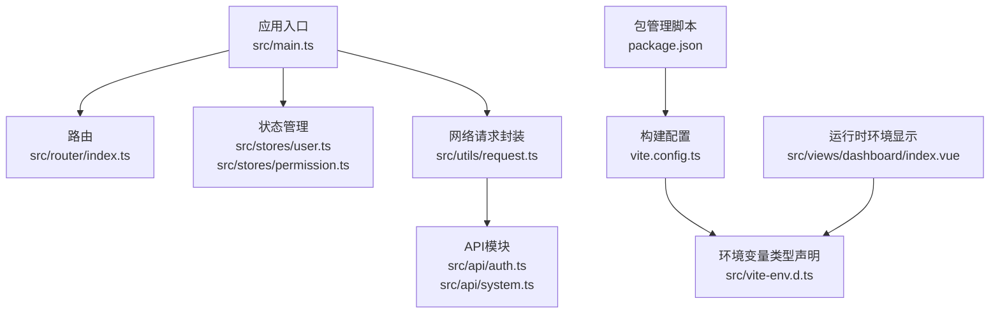
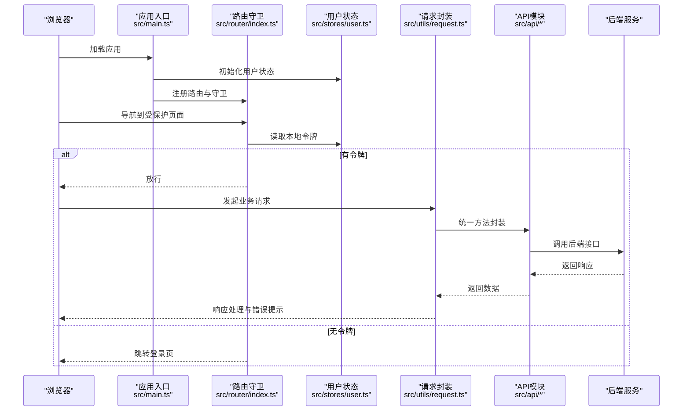
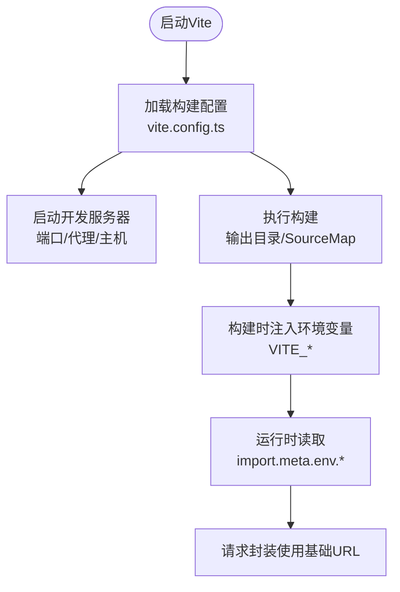
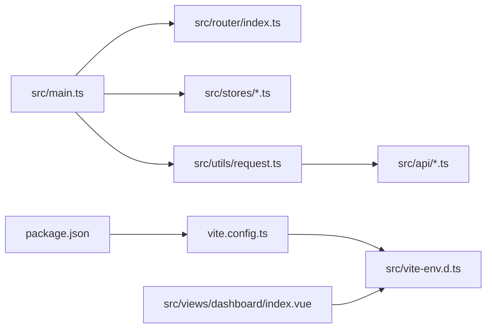

# 环境配置管理

<cite>
**本文引用的文件**
- [vite.config.ts](file://vite.config.ts)
- [package.json](file://package.json)
- [src/main.ts](file://src/main.ts)
- [src/utils/request.ts](file://src/utils/request.ts)
- [src/router/index.ts](file://src/router/index.ts)
- [src/stores/user.ts](file://src/stores/user.ts)
- [src/stores/permission.ts](file://src/stores/permission.ts)
- [src/types/index.ts](file://src/types/index.ts)
- [src/api/auth.ts](file://src/api/auth.ts)
- [src/api/system.ts](file://src/api/system.ts)
- [src/vite-env.d.ts](file://src/vite-env.d.ts)
- [src/views/dashboard/index.vue](file://src/views/dashboard/index.vue)
- [默认模块.md](file://默认模块.md)
</cite>

## 目录
1. [简介](#简介)
2. [项目结构](#项目结构)
3. [核心组件](#核心组件)
4. [架构总览](#架构总览)
5. [详细组件分析](#详细组件分析)
6. [依赖分析](#依赖分析)
7. [性能考虑](#性能考虑)
8. [故障排查指南](#故障排查指南)
9. [结论](#结论)
10. [附录](#附录)

## 简介
本指南围绕HC管理系统前端的环境配置管理展开，目标是帮助开发者与运维人员理解并正确配置开发、测试与生产环境；规范配置文件管理与敏感信息保护；提供Vite环境配置、构建时注入与运行时读取的实践；建立配置验证、默认值与错误处理机制；明确安全配置要点（密钥、证书、访问控制）；给出配置热更新、缓存与持久化的建议；以及配置备份、迁移与回滚的思路。由于当前仓库未包含实际的环境变量文件（如 .env），本指南以现有代码为依据，结合最佳实践进行系统性说明。

## 项目结构
前端采用Vite + Vue 3 + TypeScript + Pinia + Element Plus 技术栈，核心配置集中在构建工具与运行时环境变量声明中。关键目录与文件如下：
- 构建与开发服务器：vite.config.ts
- 包管理与脚本：package.json
- 应用入口与插件注册：src/main.ts
- 网络请求与环境变量使用：src/utils/request.ts
- 路由与鉴权：src/router/index.ts
- 状态管理（用户与权限）：src/stores/user.ts、src/stores/permission.ts
- 类型定义：src/types/index.ts
- API封装：src/api/auth.ts、src/api/system.ts
- 环境变量类型声明：src/vite-env.d.ts
- 运行时环境展示：src/views/dashboard/index.vue
- 接口文档（含认证接口）：默认模块.md

图表来源
- [src/main.ts:1-27](file://src/main.ts#L1-L27)
- [src/router/index.ts:1-127](file://src/router/index.ts#L1-L127)
- [src/stores/user.ts:1-152](file://src/stores/user.ts#L1-L152)
- [src/stores/permission.ts:1-56](file://src/stores/permission.ts#L1-L56)
- [src/utils/request.ts:1-148](file://src/utils/request.ts#L1-L148)
- [src/api/auth.ts:1-69](file://src/api/auth.ts#L1-L69)
- [src/api/system.ts:1-56](file://src/api/system.ts#L1-L56)
- [vite.config.ts:1-46](file://vite.config.ts#L1-L46)
- [src/vite-env.d.ts:18-26](file://src/vite-env.d.ts#L18-L26)
- [package.json:6-12](file://package.json#L6-L12)
- [src/views/dashboard/index.vue:9](file://src/views/dashboard/index.vue#L9)

章节来源
- [vite.config.ts:1-46](file://vite.config.ts#L1-L46)
- [package.json:1-35](file://package.json#L1-L35)
- [src/main.ts:1-27](file://src/main.ts#L1-L27)
- [src/utils/request.ts:6-15](file://src/utils/request.ts#L6-L15)
- [src/vite-env.d.ts:18-26](file://src/vite-env.d.ts#L18-L26)

## 核心组件
- 构建与开发服务器配置：通过Vite配置文件集中管理代理、端口、输出目录与构建优化。
- 环境变量声明与使用：在类型声明文件中显式声明可用的Vite环境变量，并在运行时通过 import.meta.env 读取。
- 网络请求层：统一基于Axios封装，支持超时、凭证携带、拦截器与错误处理，并从环境变量读取基础URL。
- 路由与鉴权：路由守卫基于本地存储令牌进行鉴权，配合后端接口完成登录态维护。
- 状态管理：用户信息与权限信息通过Pinia Store持久化到本地存储，实现跨页面会话保持。
- API封装：按功能模块拆分，统一使用封装的请求方法，便于集中治理与扩展。

章节来源
- [vite.config.ts:29-44](file://vite.config.ts#L29-L44)
- [src/vite-env.d.ts:18-26](file://src/vite-env.d.ts#L18-L26)
- [src/utils/request.ts:6-15](file://src/utils/request.ts#L6-L15)
- [src/router/index.ts:82-124](file://src/router/index.ts#L82-L124)
- [src/stores/user.ts:8-127](file://src/stores/user.ts#L8-L127)
- [src/stores/permission.ts:12-34](file://src/stores/permission.ts#L12-L34)
- [src/api/auth.ts:1-69](file://src/api/auth.ts#L1-L69)
- [src/api/system.ts:1-56](file://src/api/system.ts#L1-L56)

## 架构总览
下图展示了从浏览器到后端服务的典型请求链路，以及环境变量在其中的作用点。

图表来源
- [src/main.ts:12-27](file://src/main.ts#L12-L27)
- [src/router/index.ts:82-124](file://src/router/index.ts#L82-L124)
- [src/stores/user.ts:90-127](file://src/stores/user.ts#L90-L127)
- [src/utils/request.ts:37-101](file://src/utils/request.ts#L37-L101)
- [src/api/auth.ts:22-68](file://src/api/auth.ts#L22-L68)
- [src/api/system.ts:9-55](file://src/api/system.ts#L9-L55)

## 详细组件分析

### Vite环境配置与构建注入
- 开发服务器：端口、主机、自动打开、代理配置集中于 server 字段，便于联调后端。
- 构建输出：输出目录、SourceMap与体积警告阈值在 build 字段中配置。
- 环境变量类型声明：在类型声明文件中显式声明 VITE_* 变量，确保IDE与TS编译器识别。
- 运行时读取：在请求封装中通过 import.meta.env 读取基础URL，若未设置则回落到默认路径。

图表来源
- [vite.config.ts:29-44](file://vite.config.ts#L29-L44)
- [src/vite-env.d.ts:18-26](file://src/vite-env.d.ts#L18-L26)
- [src/utils/request.ts:6](file://src/utils/request.ts#L6)

章节来源
- [vite.config.ts:1-46](file://vite.config.ts#L1-L46)
- [src/vite-env.d.ts:18-26](file://src/vite-env.d.ts#L18-L26)
- [src/utils/request.ts:6-15](file://src/utils/request.ts#L6-L15)

### 配置文件管理与敏感信息保护
- 当前仓库未包含 .env 文件，建议按环境分别准备 .env.development、.env.test、.env.production，并仅存放非敏感或经加密的配置项。
- 敏感信息（如密钥、数据库凭据）不应直接写入仓库，可通过CI/CD注入或外部密管系统挂载。
- 使用类型声明文件约束可用的Vite环境变量，避免拼写错误与未定义访问。

章节来源
- [src/vite-env.d.ts:18-26](file://src/vite-env.d.ts#L18-L26)

### 环境切换方案
- Vite模式：通过 MODE 环境变量区分开发/测试/生产，可在视图中读取 import.meta.env.MODE 展示当前环境。
- 构建时注入：Vite在打包阶段将 VITE_* 变量注入到客户端代码，运行时可直接读取。
- 运行时读取：在请求封装与业务逻辑中统一通过 import.meta.env 访问，保证一致性。

章节来源
- [src/views/dashboard/index.vue:9](file://src/views/dashboard/index.vue#L9)
- [src/utils/request.ts:6](file://src/utils/request.ts#L6)

### 配置验证机制
- 类型约束：通过类型声明文件对 import.meta.env 的键进行约束，减少运行时错误。
- 默认值：在使用处提供默认值（如基础URL），避免未配置导致的异常。
- 错误处理：请求拦截器对不同状态码进行统一提示与处理，路由守卫对未授权场景进行引导。

章节来源
- [src/vite-env.d.ts:18-26](file://src/vite-env.d.ts#L18-L26)
- [src/utils/request.ts:6-15](file://src/utils/request.ts#L6-L15)
- [src/utils/request.ts:50-101](file://src/utils/request.ts#L50-L101)
- [src/router/index.ts:82-124](file://src/router/index.ts#L82-L124)

### 安全配置
- 密钥管理：登录密码通过后端提供的RSA公钥进行前端加密后再传输，避免明文泄露。
- 证书与HTTPS：开发阶段可使用自签名证书，生产环境必须启用HTTPS并正确配置证书链。
- 访问控制：路由守卫基于本地令牌进行鉴权，后端接口返回401时触发重新登录流程。

章节来源
- [默认模块.md:30-46](file://默认模块.md#L30-L46)
- [src/api/auth.ts:22](file://src/api/auth.ts#L22)
- [src/utils/request.ts:58-60](file://src/utils/request.ts#L58-L60)
- [src/router/index.ts:82-124](file://src/router/index.ts#L82-L124)

### 配置热更新与动态加载
- 配置文件监听：建议在开发环境使用文件监控工具，变更后触发Vite热更新。
- 动态配置加载：对于运行时可变的业务开关，可通过独立接口拉取并在Pinia中缓存。
- 配置缓存策略：将关键配置（如权限列表）缓存至本地存储或内存，减少重复请求。

章节来源
- [src/stores/permission.ts:12-34](file://src/stores/permission.ts#L12-L34)
- [src/stores/user.ts:90-127](file://src/stores/user.ts#L90-L127)

### 配置备份与恢复
- 配置版本管理：将 .env 文件纳入版本控制但不包含敏感内容，或使用模板文件与CI变量分离。
- 配置迁移：当新增环境变量时，提供迁移脚本或升级指引，确保各环境一致。
- 配置回滚：通过版本控制系统快速回退到上一个稳定配置；对生产变更采用灰度发布与快速回滚策略。

## 依赖分析
- 应用入口依赖路由、状态管理与UI库；路由依赖本地存储进行鉴权；请求封装依赖环境变量与Axios；API模块依赖请求封装。
- 构建工具与脚本驱动开发与生产构建，类型声明贯穿运行时读取环节。

图表来源
- [src/main.ts:12-27](file://src/main.ts#L12-L27)
- [src/router/index.ts:1-127](file://src/router/index.ts#L1-L127)
- [src/stores/user.ts:1-152](file://src/stores/user.ts#L1-L152)
- [src/stores/permission.ts:1-56](file://src/stores/permission.ts#L1-L56)
- [src/utils/request.ts:1-148](file://src/utils/request.ts#L1-L148)
- [src/api/auth.ts:1-69](file://src/api/auth.ts#L1-L69)
- [src/api/system.ts:1-56](file://src/api/system.ts#L1-L56)
- [vite.config.ts:1-46](file://vite.config.ts#L1-L46)
- [src/vite-env.d.ts:18-26](file://src/vite-env.d.ts#L18-L26)
- [package.json:6-12](file://package.json#L6-L12)
- [src/views/dashboard/index.vue:9](file://src/views/dashboard/index.vue#L9)

章节来源
- [src/main.ts:1-27](file://src/main.ts#L1-L27)
- [src/router/index.ts:1-127](file://src/router/index.ts#L1-L127)
- [src/stores/user.ts:1-152](file://src/stores/user.ts#L1-L152)
- [src/stores/permission.ts:1-56](file://src/stores/permission.ts#L1-L56)
- [src/utils/request.ts:1-148](file://src/utils/request.ts#L1-L148)
- [src/api/auth.ts:1-69](file://src/api/auth.ts#L1-L69)
- [src/api/system.ts:1-56](file://src/api/system.ts#L1-L56)
- [vite.config.ts:1-46](file://vite.config.ts#L1-L46)
- [src/vite-env.d.ts:18-26](file://src/vite-env.d.ts#L18-L26)
- [package.json:6-12](file://package.json#L6-L12)
- [src/views/dashboard/index.vue:9](file://src/views/dashboard/index.vue#L9)

## 性能考虑
- 构建体积：合理设置 chunkSizeWarningLimit，避免大体积包导致警告；按需引入组件与图标，减少首屏体积。
- 请求性能：统一超时时间与凭证携带，避免不必要的重复请求；对高频接口采用缓存策略。
- 开发体验：代理配置指向后端服务，减少跨域问题；端口与自动打开提升开发效率。

章节来源
- [vite.config.ts:40-44](file://vite.config.ts#L40-L44)
- [src/utils/request.ts:8-15](file://src/utils/request.ts#L8-L15)

## 故障排查指南
- 网络请求失败：检查基础URL是否正确、代理是否生效、后端接口是否可达；关注拦截器中的状态码分支与错误提示。
- 登录态异常：确认本地存储中是否存在有效令牌；路由守卫是否正确读取令牌；后端返回401时是否触发重新登录。
- 权限不足：检查权限列表是否初始化成功；用户权限是否正确下发；页面级权限校验逻辑是否生效。
- 环境变量未生效：确认Vite是否正确注入环境变量；类型声明文件是否与实际使用一致；构建产物中是否包含对应值。

章节来源
- [src/utils/request.ts:50-101](file://src/utils/request.ts#L50-L101)
- [src/router/index.ts:82-124](file://src/router/index.ts#L82-L124)
- [src/stores/permission.ts:12-34](file://src/stores/permission.ts#L12-L34)
- [src/stores/user.ts:90-127](file://src/stores/user.ts#L90-L127)
- [src/vite-env.d.ts:18-26](file://src/vite-env.d.ts#L18-L26)

## 结论
本指南基于现有代码梳理了HC管理系统前端的环境配置现状与最佳实践建议。当前项目已具备清晰的构建配置、统一的请求封装与完善的鉴权流程。建议尽快补齐 .env 文件与敏感信息保护策略，完善配置验证与错误处理，并在开发与生产环境中实施严格的配置管理与审计机制。

## 附录
- 环境变量清单（建议）
  - VITE_APP_TITLE：应用标题
  - VITE_API_BASE_URL：后端接口基础URL
  - VITE_APP_PORT：开发服务器端口
- 配置模板建议
  - .env.development：本地开发，代理指向后端服务
  - .env.test：测试环境，使用测试域名与测试账号
  - .env.production：生产环境，严格限制可读取的VITE_*变量
- 安全基线
  - 所有敏感信息不得提交到仓库
  - 生产环境强制HTTPS与证书校验
  - 登录密码前端加密传输，后端严格校验