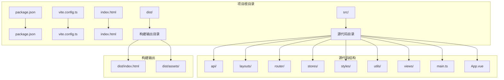
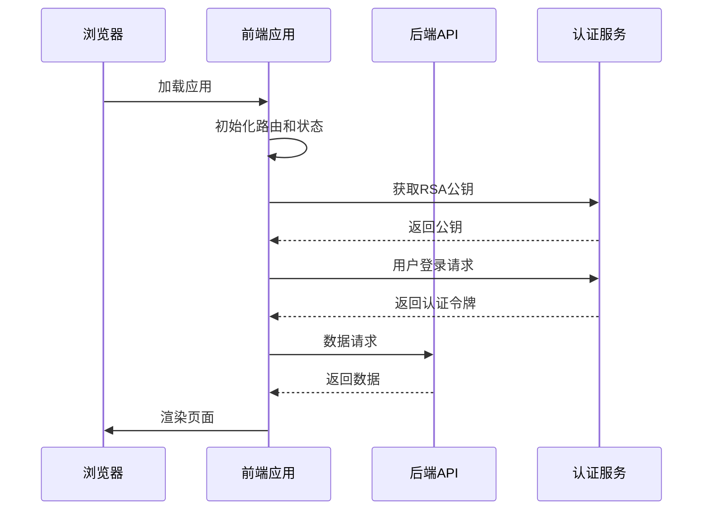
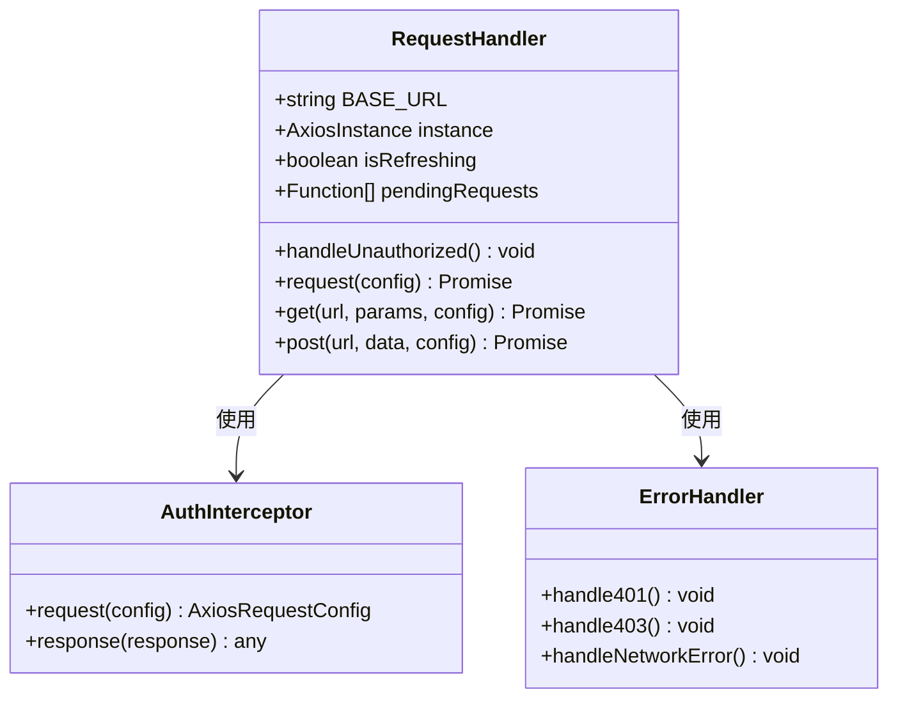
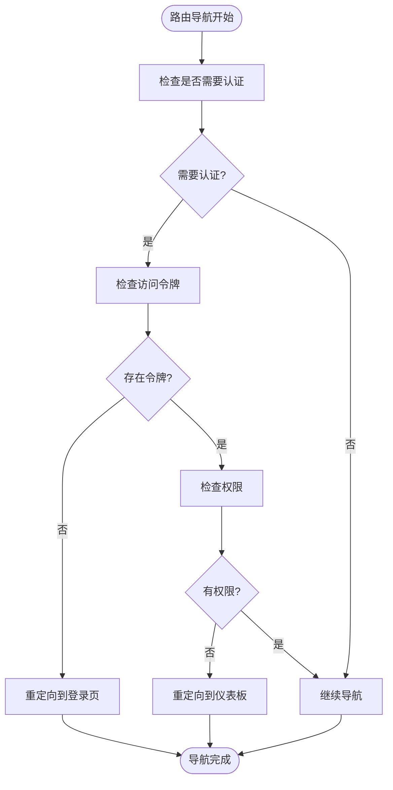
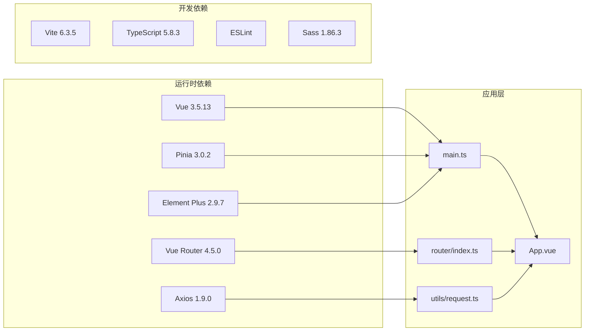

# 静态服务器部署

<cite>
**本文档引用的文件**
- [package.json](file://package.json)
- [vite.config.ts](file://vite.config.ts)
- [index.html](file://index.html)
- [dist/index.html](file://dist/index.html)
- [src/main.ts](file://src/main.ts)
- [src/App.vue](file://src/App.vue)
- [src/router/index.ts](file://src/router/index.ts)
- [src/utils/request.ts](file://src/utils/request.ts)
- [默认模块.md](file://默认模块.md)
</cite>

## 目录
1. [简介](#简介)
2. [项目结构](#项目结构)
3. [核心组件](#核心组件)
4. [架构概览](#架构概览)
5. [详细组件分析](#详细组件分析)
6. [依赖关系分析](#依赖关系分析)
7. [性能考虑](#性能考虑)
8. [故障排除指南](#故障排除指南)
9. [结论](#结论)

## 简介

HC管理系统是一个基于Vue 3和Vite的现代化前端应用，采用单页应用(SPA)架构设计。该项目提供了完整的用户管理系统功能，包括用户管理、企业管理和权限控制等模块。本文档将详细介绍如何为该静态前端应用配置和部署静态服务器，涵盖Nginx、Apache和CDN等多种部署方案。

## 项目结构

HC管理系统采用标准的Vue 3项目结构，主要包含以下关键目录和文件：

**图表来源**
- [package.json:1-35](file://package.json#L1-L35)
- [vite.config.ts:1-46](file://vite.config.ts#L1-L46)
- [src/main.ts:1-27](file://src/main.ts#L1-L27)

**章节来源**
- [package.json:1-35](file://package.json#L1-L35)
- [vite.config.ts:1-46](file://vite.config.ts#L1-L46)
- [src/main.ts:1-27](file://src/main.ts#L1-L27)

## 核心组件

### 构建配置分析

项目使用Vite作为构建工具，配置了开发服务器、代理和构建输出路径：

- **开发服务器**: 端口3000，启用本地代理到后端服务
- **构建输出**: 输出到dist目录，禁用source map
- **代理配置**: 将/api前缀的请求转发到本地后端服务

### 应用入口配置

应用入口文件负责初始化Vue应用、路由系统和状态管理：

- 创建Vue应用实例
- 注册Element Plus UI组件库
- 初始化Pinia状态管理
- 配置路由导航守卫

### 路由系统

应用采用Vue Router实现客户端路由，支持：
- 嵌套路由结构
- 导航守卫验证
- 权限控制
- 动态导入组件

**章节来源**
- [vite.config.ts:29-44](file://vite.config.ts#L29-L44)
- [src/main.ts:12-27](file://src/main.ts#L12-L27)
- [src/router/index.ts:12-75](file://src/router/index.ts#L12-L75)

## 架构概览

HC管理系统采用前后端分离架构，前端通过HTTP API与后端通信：

**图表来源**
- [src/utils/request.ts:6](file://src/utils/request.ts#L6)
- [默认模块.md:30-46](file://默认模块.md#L30-L46)

## 详细组件分析

### API请求处理组件

应用使用Axios封装HTTP请求，实现了统一的请求拦截器和响应处理：

**图表来源**
- [src/utils/request.ts:8-15](file://src/utils/request.ts#L8-L15)
- [src/utils/request.ts:37-101](file://src/utils/request.ts#L37-L101)

### 路由导航组件

路由系统实现了完整的权限控制和导航逻辑：

**图表来源**
- [src/router/index.ts:82-124](file://src/router/index.ts#L82-L124)

**章节来源**
- [src/utils/request.ts:1-148](file://src/utils/request.ts#L1-L148)
- [src/router/index.ts:1-127](file://src/router/index.ts#L1-L127)

### 构建输出分析

构建后的静态资源包含HTML文件和打包的JavaScript/CSS文件：

- **入口HTML**: 自动注入构建后的资源链接
- **静态资源**: 包含JavaScript模块和CSS样式表
- **跨域处理**: 使用crossorigin属性确保正确的CORS行为

**章节来源**
- [dist/index.html:8-9](file://dist/index.html#L8-L9)

## 依赖关系分析

项目的主要依赖关系如下：

**图表来源**
- [package.json:13-33](file://package.json#L13-L33)
- [src/main.ts:1-27](file://src/main.ts#L1-L27)

**章节来源**
- [package.json:13-33](file://package.json#L13-L33)
- [src/main.ts:1-27](file://src/main.ts#L1-L27)

## 性能考虑

### 静态资源优化

1. **代码分割**: Vite自动进行代码分割，按需加载路由组件
2. **资源压缩**: 生产环境自动压缩JavaScript和CSS文件
3. **缓存策略**: 构建产物包含内容哈希，便于长期缓存

### 运行时性能

1. **懒加载**: 路由组件使用动态导入实现懒加载
2. **状态管理**: Pinia提供高效的响应式状态管理
3. **UI组件**: Element Plus按需引入，减少包体积

## 故障排除指南

### 常见问题及解决方案

1. **API请求失败**
   - 检查VITE_API_BASE_URL环境变量配置
   - 确认后端服务正常运行
   - 验证CORS配置

2. **路由跳转异常**
   - 检查localStorage中的token状态
   - 验证路由守卫逻辑
   - 确认权限数据完整性

3. **构建失败**
   - 检查Node.js版本兼容性
   - 清理node_modules和重新安装依赖
   - 验证TypeScript配置

**章节来源**
- [src/utils/request.ts:20-35](file://src/utils/request.ts#L20-L35)
- [src/router/index.ts:82-124](file://src/router/index.ts#L82-L124)

## 结论

HC管理系统是一个结构清晰、功能完整的Vue 3前端应用。通过合理的静态服务器配置，可以实现高效、可靠的生产部署。建议在生产环境中采用CDN加速、适当的缓存策略和HTTPS配置，以确保最佳的用户体验和安全性。