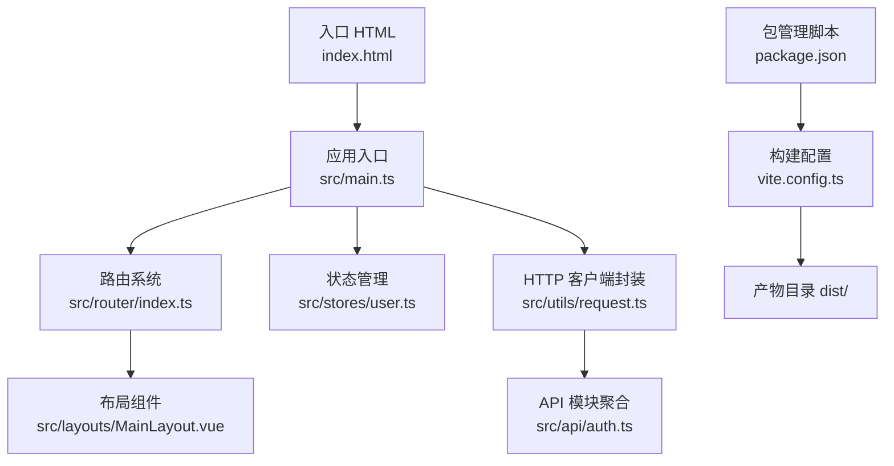
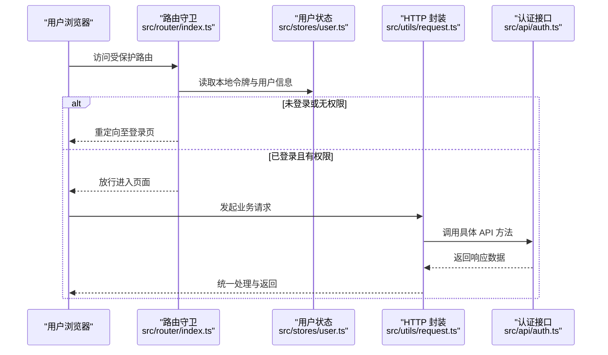
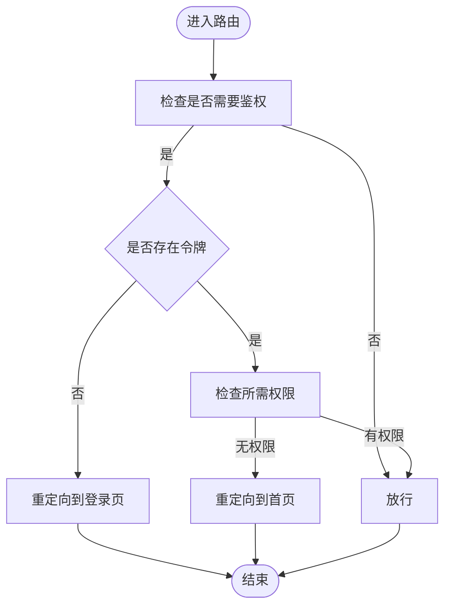
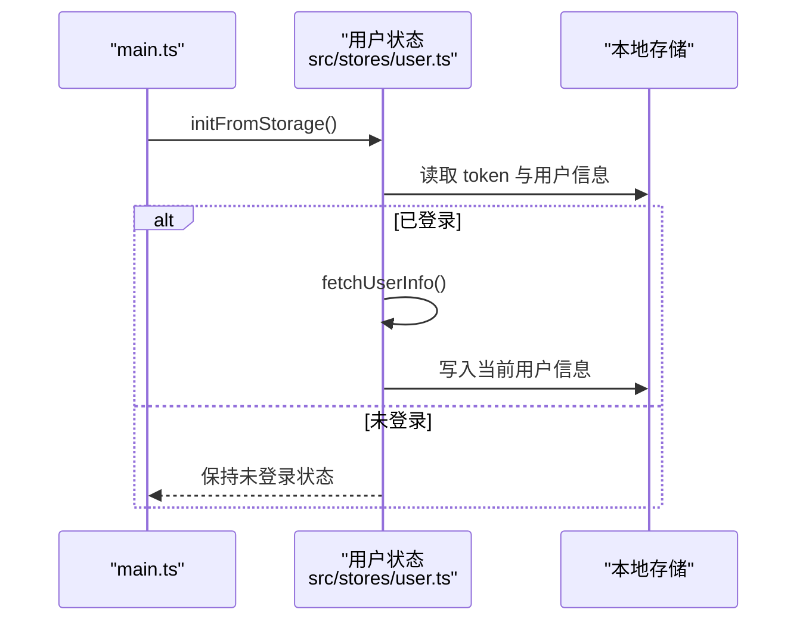
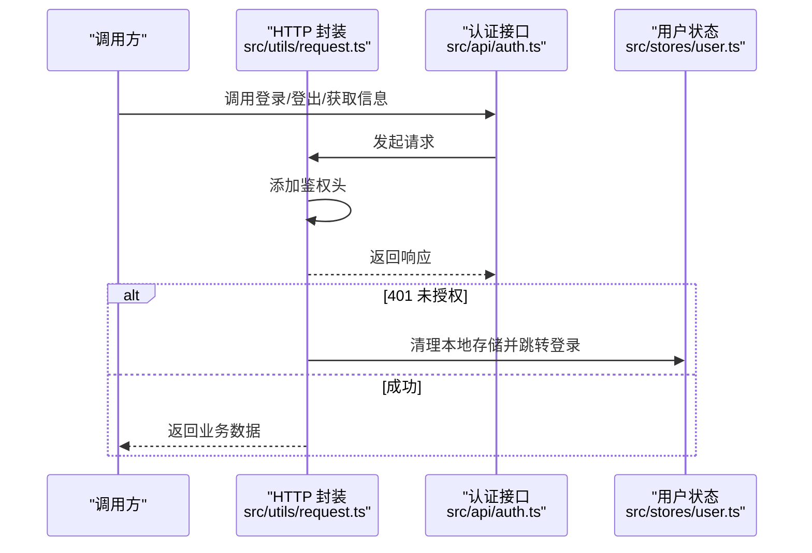
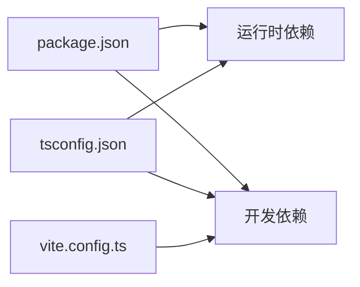

# 部署指南

<cite>
**本文引用的文件**
- [package.json](file://package.json)
- [vite.config.ts](file://vite.config.ts)
- [index.html](file://index.html)
- [src/main.ts](file://src/main.ts)
- [src/router/index.ts](file://src/router/index.ts)
- [src/stores/user.ts](file://src/stores/user.ts)
- [src/utils/request.ts](file://src/utils/request.ts)
- [src/vite-env.d.ts](file://src/vite-env.d.ts)
- [tsconfig.json](file://tsconfig.json)
- [src/api/auth.ts](file://src/api/auth.ts)
- [src/layouts/MainLayout.vue](file://src/layouts/MainLayout.vue)
</cite>

## 目录
1. [简介](#简介)
2. [项目结构](#项目结构)
3. [核心组件](#核心组件)
4. [架构总览](#架构总览)
5. [详细组件分析](#详细组件分析)
6. [依赖分析](#依赖分析)
7. [性能考虑](#性能考虑)
8. [故障排查指南](#故障排查指南)
9. [结论](#结论)
10. [附录](#附录)

## 简介
本指南面向HC管理系统的生产部署，覆盖从构建到上线的完整流程与最佳实践。内容包括：
- 生产环境构建流程与配置优化
- Vite 构建配置最佳实践（代码分割、资源优化、缓存策略）
- 环境变量与敏感信息管理
- 多种部署场景实施方案（静态服务器、Docker 容器化、CI/CD 流水线）
- 性能优化建议（资源压缩、懒加载、CDN）
- 监控与日志收集的部署配置
- 故障排查与回滚策略

## 项目结构
前端采用 Vue 3 + TypeScript + Vite 技术栈，路由基于 Vue Router 的异步组件实现懒加载，状态管理使用 Pinia，UI 组件库为 Element Plus。

图表来源
- [index.html:1-14](file://index.html#L1-L14)
- [src/main.ts:1-27](file://src/main.ts#L1-L27)
- [src/router/index.ts:1-127](file://src/router/index.ts#L1-L127)
- [src/stores/user.ts:1-152](file://src/stores/user.ts#L1-L152)
- [src/utils/request.ts:1-148](file://src/utils/request.ts#L1-L148)
- [src/api/auth.ts:1-69](file://src/api/auth.ts#L1-L69)
- [src/layouts/MainLayout.vue:1-281](file://src/layouts/MainLayout.vue#L1-L281)
- [vite.config.ts:1-46](file://vite.config.ts#L1-L46)
- [package.json:1-35](file://package.json#L1-L35)

章节来源
- [package.json:1-35](file://package.json#L1-L35)
- [vite.config.ts:1-46](file://vite.config.ts#L1-L46)
- [index.html:1-14](file://index.html#L1-L14)
- [src/main.ts:1-27](file://src/main.ts#L1-L27)
- [src/router/index.ts:1-127](file://src/router/index.ts#L1-L127)
- [src/stores/user.ts:1-152](file://src/stores/user.ts#L1-L152)
- [src/utils/request.ts:1-148](file://src/utils/request.ts#L1-L148)
- [src/api/auth.ts:1-69](file://src/api/auth.ts#L1-L69)
- [src/layouts/MainLayout.vue:1-281](file://src/layouts/MainLayout.vue#L1-L281)

## 核心组件
- 应用入口与初始化：创建 Vue 应用实例、挂载 Pinia、注册路由与 Element Plus，并从本地存储恢复用户状态。
- 路由系统：基于历史模式与异步组件实现按需加载；全局前置守卫处理鉴权与权限校验。
- 状态管理：用户令牌、当前用户信息、权限与角色的集中管理，支持从本地存储初始化。
- HTTP 客户端：统一拦截器处理鉴权头、错误提示与登录态失效处理；支持动态 base URL。
- 构建配置：插件链、别名、开发服务器代理、构建输出与源码映射策略。

章节来源
- [src/main.ts:1-27](file://src/main.ts#L1-L27)
- [src/router/index.ts:1-127](file://src/router/index.ts#L1-L127)
- [src/stores/user.ts:1-152](file://src/stores/user.ts#L1-L152)
- [src/utils/request.ts:1-148](file://src/utils/request.ts#L1-L148)
- [vite.config.ts:1-46](file://vite.config.ts#L1-L46)

## 架构总览
下图展示从前端到后端的典型交互路径，以及鉴权与权限控制的关键节点。

图表来源
- [src/router/index.ts:82-124](file://src/router/index.ts#L82-L124)
- [src/stores/user.ts:90-127](file://src/stores/user.ts#L90-L127)
- [src/utils/request.ts:37-101](file://src/utils/request.ts#L37-L101)
- [src/api/auth.ts:22-68](file://src/api/auth.ts#L22-L68)

## 详细组件分析

### 构建配置与生产优化
- 插件链：Vue 单文件组件、自动导入与组件解析、Element Plus 解析器。
- 别名与路径：@ 指向 src，便于统一导入。
- 开发服务器：端口、主机、自动打开与 /api 前缀代理至后端服务。
- 构建输出：输出目录 dist、关闭源码映射、增大体积警告阈值以适配大体量项目。
- 最佳实践建议：
  - 代码分割：利用路由级异步组件与按需引入第三方库，减少首屏体积。
  - 资源优化：启用压缩与预加载策略；对静态资源进行版本化命名。
  - 缓存策略：静态资源配置强缓存，HTML 动态不缓存；通过 CDN 提升分发效率。
  - 源码映射：生产环境保持关闭，保障安全性与体积。

章节来源
- [vite.config.ts:1-46](file://vite.config.ts#L1-L46)

### 路由与鉴权流程
- 路由定义：登录页、仪表盘、用户/企业/角色/权限/日志/个人中心等，均采用异步组件懒加载。
- 权限控制：requiresAuth 与 permissions 元信息配合本地存储令牌与用户权限进行校验。
- 登录态维护：路由守卫在进入受保护路由前检查令牌与权限，必要时重定向至登录页。

图表来源
- [src/router/index.ts:82-124](file://src/router/index.ts#L82-L124)

章节来源
- [src/router/index.ts:1-127](file://src/router/index.ts#L1-L127)

### 用户状态与本地存储
- 初始化：从 localStorage 恢复 token 与用户信息，兼容不同字段大小写。
- 登录：设置 token 并持久化登录响应与当前用户信息。
- 获取用户信息：调用后端接口并更新本地存储。
- 登出：调用登出接口并清理本地存储与路由跳转。

图表来源
- [src/main.ts:23-24](file://src/main.ts#L23-L24)
- [src/stores/user.ts:90-127](file://src/stores/user.ts#L90-L127)

章节来源
- [src/main.ts:1-27](file://src/main.ts#L1-L27)
- [src/stores/user.ts:1-152](file://src/stores/user.ts#L1-L152)

### HTTP 客户端与错误处理
- 基础配置：baseURL 取自环境变量，超时、凭证与 Content-Type 设置。
- 请求拦截：自动附加 Authorization 头。
- 响应拦截：统一处理业务状态码与 HTTP 状态码，401 触发登出流程。
- 工具函数：get/post/put/del 包装 axios，简化调用。

图表来源
- [src/utils/request.ts:37-101](file://src/utils/request.ts#L37-L101)
- [src/api/auth.ts:22-68](file://src/api/auth.ts#L22-L68)
- [src/stores/user.ts:62-71](file://src/stores/user.ts#L62-L71)

章节来源
- [src/utils/request.ts:1-148](file://src/utils/request.ts#L1-L148)
- [src/api/auth.ts:1-69](file://src/api/auth.ts#L1-L69)
- [src/stores/user.ts:62-71](file://src/stores/user.ts#L62-L71)

### 布局与菜单渲染
- 主布局：侧边栏折叠、面包屑导航、用户信息下拉菜单。
- 菜单可见性：根据用户类型与权限动态计算，平台管理员默认可见所有菜单项。
- 个人中心与退出登录：通过下拉菜单触发用户状态的登出流程。

章节来源
- [src/layouts/MainLayout.vue:1-281](file://src/layouts/MainLayout.vue#L1-L281)
- [src/stores/user.ts:1-152](file://src/stores/user.ts#L1-L152)

## 依赖分析
- 运行时依赖：Vue 3、Vue Router、Pinia、Element Plus、Axios、Day.js、JSencrypt、Lodash-es。
- 开发依赖：Vite、Vue 单文件组件插件、自动导入与组件解析插件、TypeScript 类型检查、Sass 等。
- TypeScript 配置：ESNext 模块解析、路径别名、严格模式与类型声明。

图表来源
- [package.json:13-33](file://package.json#L13-L33)
- [tsconfig.json:1-28](file://tsconfig.json#L1-L28)
- [vite.config.ts:1-46](file://vite.config.ts#L1-L46)

章节来源
- [package.json:1-35](file://package.json#L1-L35)
- [tsconfig.json:1-28](file://tsconfig.json#L1-L28)

## 性能考虑
- 代码分割
  - 路由级异步组件已实现按需加载，建议进一步拆分大型页面与第三方库，减少首屏 JS 体积。
  - 对 Element Plus 组件按需引入，避免整包引入导致体积膨胀。
- 资源优化
  - 启用压缩与预加载策略，合理配置 HTML/CSS/JS 的缓存与压缩。
  - 对图片与图标使用矢量格式或 WebP，结合懒加载与占位符提升体验。
- 缓存策略
  - 静态资源使用强缓存（带内容指纹），HTML 动态不缓存或短缓存。
  - 通过 CDN 加速静态资源分发，降低源站压力。
- 构建配置建议
  - 在生产构建中开启压缩与最小化，禁用源码映射。
  - 使用 Rollup 或 Vite 的拆包策略，确保关键路径资源优先加载。

## 故障排查指南
- 登录态异常
  - 现象：频繁被重定向到登录页或权限不足。
  - 排查：检查本地存储中的 token 与用户信息是否正确；确认后端接口返回的用户权限是否完整。
- 接口 401/403
  - 现象：接口返回未授权或无权限。
  - 排查：确认请求拦截器是否正确附加 Authorization 头；查看响应拦截器对 401 的处理逻辑是否触发登出。
- 路由跳转问题
  - 现象：受保护路由无法访问或权限判定异常。
  - 排查：检查路由元信息中的 requiresAuth 与 permissions；确认用户权限数组是否正确更新。
- 构建产物异常
  - 现象：生产构建后页面空白或资源加载失败。
  - 排查：确认构建输出目录与静态服务器根目录一致；检查 base URL 与 CDN 配置；验证 HTML 中的入口脚本路径。

章节来源
- [src/router/index.ts:82-124](file://src/router/index.ts#L82-L124)
- [src/utils/request.ts:50-101](file://src/utils/request.ts#L50-L101)
- [src/stores/user.ts:90-127](file://src/stores/user.ts#L90-L127)
- [vite.config.ts:40-44](file://vite.config.ts#L40-L44)

## 结论
本指南提供了 HC 管理系统从构建到部署的全流程实践建议。通过合理的代码分割、资源优化与缓存策略，结合严格的环境变量与敏感信息管理，可显著提升生产环境的稳定性与性能。针对不同部署场景，建议优先选择静态服务器部署作为基线方案，随后逐步引入 Docker 容器化与 CI/CD 自动化，最终实现可观测与可回滚的持续交付体系。

## 附录

### 环境变量与敏感信息管理
- 环境变量定义：应用标题、API 基础地址、开发端口等。
- 使用方式：在运行时通过 import.meta.env 读取，构建时注入。
- 敏感信息：令牌、密钥等严禁硬编码在客户端；建议通过后端接口签发短期令牌或使用安全的同源策略。

章节来源
- [src/vite-env.d.ts:18-26](file://src/vite-env.d.ts#L18-L26)
- [src/utils/request.ts:6](file://src/utils/request.ts#L6)

### 部署场景实施方案

- 静态服务器部署
  - 步骤：执行构建生成 dist 目录，将 dist 部署至 Nginx/Apache 等静态服务器，配置根目录与缓存策略。
  - 关键点：确保 HTML 不缓存，静态资源强缓存；配置正确的 MIME 类型与安全头。
- Docker 容器化部署
  - 步骤：构建多阶段镜像，先在构建阶段生成 dist，再将 dist 复制到 Nginx 镜像中运行。
  - 关键点：镜像层优化、最小化运行时镜像、暴露端口与健康检查。
- CI/CD 流水线集成
  - 步骤：在流水线中执行安装依赖、类型检查、构建与预览，通过测试后自动部署到目标环境。
  - 关键点：缓存 npm/yarn 缓存、并行任务加速、制品归档与回滚策略。

章节来源
- [package.json:6-11](file://package.json#L6-L11)
- [vite.config.ts:40-44](file://vite.config.ts#L40-L44)