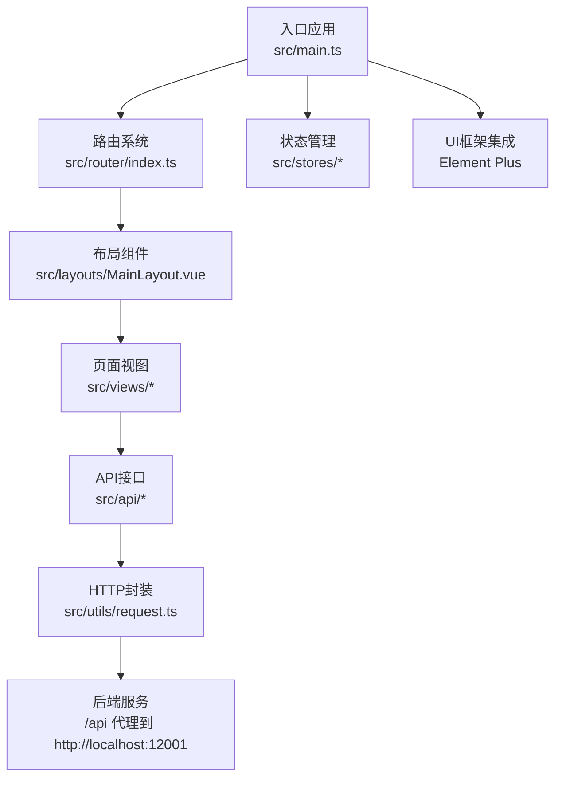
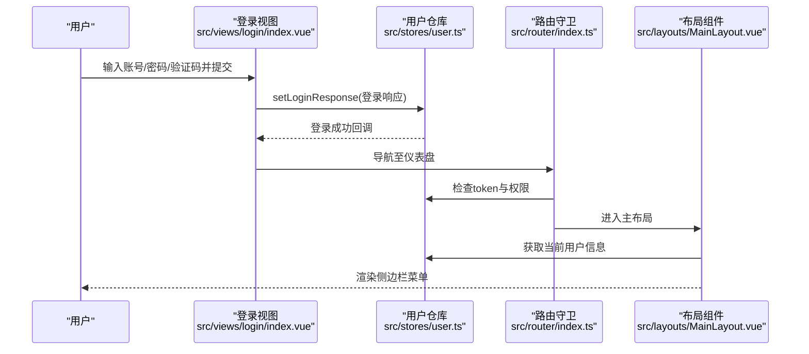
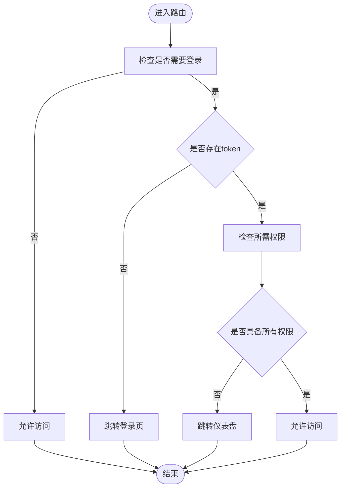
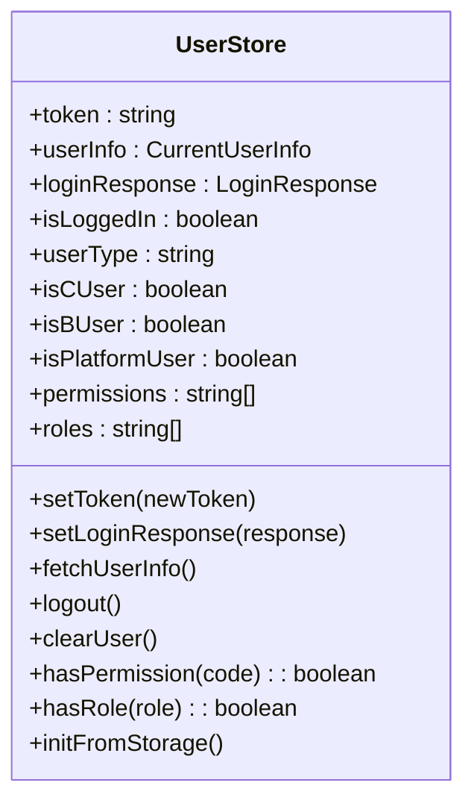
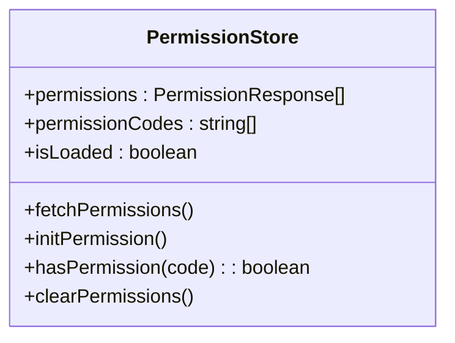
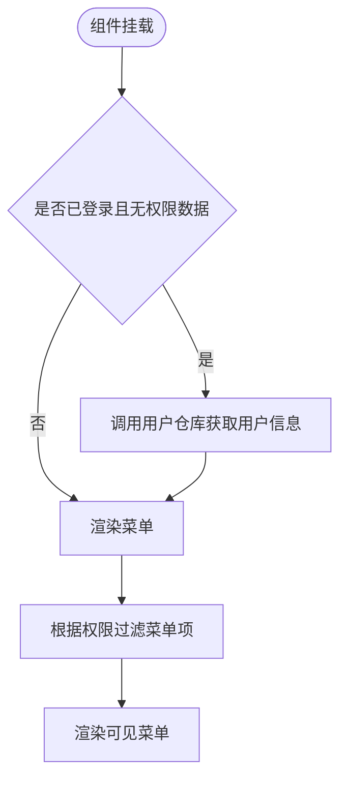
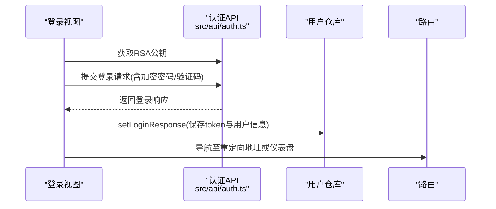
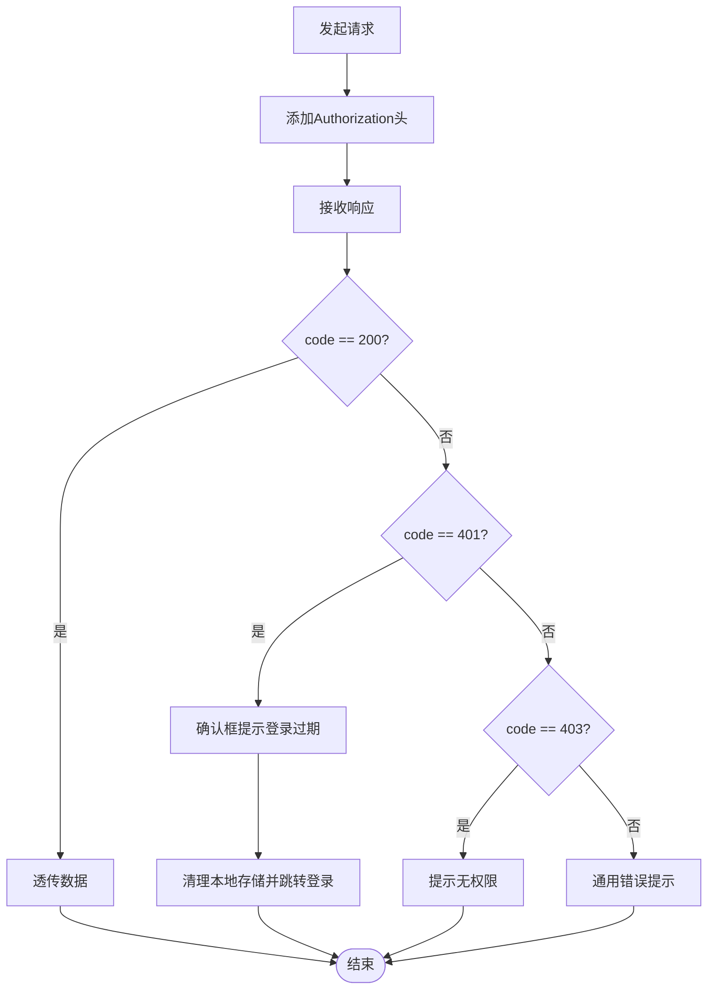
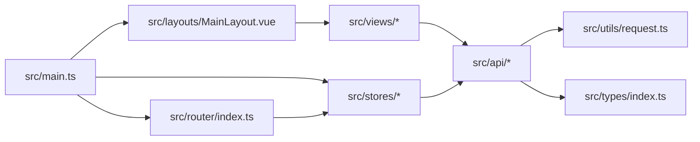

# 项目概述

<cite>
**本文档引用的文件**
- [package.json](file://package.json)
- [vite.config.ts](file://vite.config.ts)
- [src/main.ts](file://src/main.ts)
- [src/App.vue](file://src/App.vue)
- [src/router/index.ts](file://src/router/index.ts)
- [src/stores/index.ts](file://src/stores/index.ts)
- [src/stores/user.ts](file://src/stores/user.ts)
- [src/stores/permission.ts](file://src/stores/permission.ts)
- [src/layouts/MainLayout.vue](file://src/layouts/MainLayout.vue)
- [src/views/login/index.vue](file://src/views/login/index.vue)
- [src/utils/request.ts](file://src/utils/request.ts)
- [src/types/index.ts](file://src/types/index.ts)
- [src/api/auth.ts](file://src/api/auth.ts)
- [src/styles/global.scss](file://src/styles/global.scss)
</cite>

## 目录
1. [简介](#简介)
2. [项目结构](#项目结构)
3. [核心组件](#核心组件)
4. [架构总览](#架构总览)
5. [详细组件分析](#详细组件分析)
6. [依赖关系分析](#依赖关系分析)
7. [性能考虑](#性能考虑)
8. [故障排除指南](#故障排除指南)
9. [结论](#结论)
10. [附录](#附录)

## 简介
HC管理系统是一个基于Vue 3的企业级权限管理后台系统，支持多身份认证（C端用户、B端用户、平台管理员）。项目采用现代化前端技术栈：Vue 3.5.13 + TypeScript + Element Plus + Vite + Pinia + Axios，结合路由守卫与状态管理实现完整的登录态、权限控制与菜单渲染能力。系统通过统一的HTTP拦截器处理鉴权、错误提示与刷新流程，提供可扩展的权限模型与灵活的菜单展示策略。

本项目既适合初学者理解企业级后台系统的通用模式，也为有经验的开发者提供了清晰的分层架构与可维护的代码组织方式。

## 项目结构
项目采用“按功能域+分层”的组织方式，核心目录与职责如下：
- src/api：封装各业务模块的HTTP接口调用，统一暴露方法供视图层使用
- src/router：集中定义路由表与全局前置守卫，实现登录态校验与权限拦截
- src/stores：使用Pinia进行状态管理，拆分用户态与权限态两个核心仓库
- src/layouts：布局组件，包含侧边栏、面包屑、头部下拉等通用UI
- src/views：页面视图，按模块划分（仪表盘、用户、企业、角色、权限、日志、个人中心）
- src/utils：工具函数与HTTP请求封装
- src/types：TypeScript类型定义，覆盖响应体、分页、用户信息、权限等
- src/styles：全局样式与变量定义
- public：静态资源与入口HTML

图表来源
- [src/main.ts:1-27](file://src/main.ts#L1-L27)
- [src/router/index.ts:1-127](file://src/router/index.ts#L1-L127)
- [src/layouts/MainLayout.vue:1-281](file://src/layouts/MainLayout.vue#L1-L281)
- [src/utils/request.ts:1-148](file://src/utils/request.ts#L1-L148)

章节来源
- [package.json:1-35](file://package.json#L1-L35)
- [vite.config.ts:1-46](file://vite.config.ts#L1-L46)
- [src/main.ts:1-27](file://src/main.ts#L1-L27)

## 核心组件
- 应用入口与插件注册：创建Vue实例、安装Pinia、路由与Element Plus，注入图标组件，挂载应用并从本地存储恢复用户状态
- 路由与权限守卫：定义路由表与元信息（标题、是否需要登录、所需权限），在导航前执行登录态与权限校验
- 用户状态仓库：管理token、登录响应、当前用户信息、身份类型、角色与权限集合，提供登录、登出、持久化与权限查询能力
- 权限状态仓库：拉取权限列表、初始化权限缓存、提供权限码集合与查询能力
- 布局组件：根据用户身份与权限动态渲染菜单项，提供折叠切换、面包屑与用户下拉操作
- 登录视图：支持C/B/平台三类身份、密码/验证码两种登录模式，RSA公钥加密与验证码倒计时
- HTTP封装：统一设置Authorization头、处理401自动跳转登录、错误消息提示与不同HTTP状态码的分支处理

章节来源
- [src/main.ts:1-27](file://src/main.ts#L1-L27)
- [src/router/index.ts:1-127](file://src/router/index.ts#L1-L127)
- [src/stores/user.ts:1-152](file://src/stores/user.ts#L1-L152)
- [src/stores/permission.ts:1-56](file://src/stores/permission.ts#L1-L56)
- [src/layouts/MainLayout.vue:1-281](file://src/layouts/MainLayout.vue#L1-L281)
- [src/views/login/index.vue:1-323](file://src/views/login/index.vue#L1-L323)
- [src/utils/request.ts:1-148](file://src/utils/request.ts#L1-L148)

## 架构总览
系统采用“视图层-状态层-路由层-接口层-HTTP层”的分层架构，配合Element Plus提供丰富的UI组件，Vite提供开发与构建能力。核心交互流程围绕登录、权限拉取与菜单渲染展开。

图表来源
- [src/views/login/index.vue:98-145](file://src/views/login/index.vue#L98-L145)
- [src/stores/user.ts:27-39](file://src/stores/user.ts#L27-L39)
- [src/router/index.ts:82-124](file://src/router/index.ts#L82-L124)
- [src/layouts/MainLayout.vue:82-90](file://src/layouts/MainLayout.vue#L82-L90)

## 详细组件分析

### 路由与权限守卫
- 路由元信息：每个路由可声明标题、是否需要登录、所需权限数组
- 守卫逻辑：未登录则跳转登录；存在所需权限时，读取本地用户权限集合进行匹配；登录页已登录则跳转仪表盘
- 动态标题：根据路由meta.title动态设置浏览器标题

图表来源
- [src/router/index.ts:82-124](file://src/router/index.ts#L82-L124)

章节来源
- [src/router/index.ts:1-127](file://src/router/index.ts#L1-L127)

### 用户状态管理（Pinia）
- 数据模型：token、登录响应、当前用户信息（含身份类型、企业ID、角色与权限）、计算属性（身份判定、权限集合）
- 关键方法：setToken、setLoginResponse、fetchUserInfo、logout、clearUser、hasPermission、hasRole、initFromStorage
- 初始化策略：从localStorage恢复token与用户信息，兼容后端字段命名差异

图表来源
- [src/stores/user.ts:7-151](file://src/stores/user.ts#L7-L151)

章节来源
- [src/stores/user.ts:1-152](file://src/stores/user.ts#L1-L152)

### 权限状态管理（Pinia）
- 数据模型：权限列表、权限码集合、是否已加载
- 关键方法：fetchPermissions、initPermission、hasPermission、clearPermissions
- 与后端交互：通过系统模块API获取权限列表并初始化权限缓存

图表来源
- [src/stores/permission.ts:7-55](file://src/stores/permission.ts#L7-L55)

章节来源
- [src/stores/permission.ts:1-56](file://src/stores/permission.ts#L1-L56)

### 布局组件与菜单渲染
- 菜单可见性：根据用户身份与权限集合动态过滤；无权限数据时平台管理员可见全部，其他用户仅显示基础菜单
- 头部信息：显示用户昵称/姓名、头像、身份标签与下拉操作（个人中心、退出登录）
- 侧边栏折叠：支持折叠与展开，保持菜单图标与文字的适配

图表来源
- [src/layouts/MainLayout.vue:45-64](file://src/layouts/MainLayout.vue#L45-L64)
- [src/layouts/MainLayout.vue:82-90](file://src/layouts/MainLayout.vue#L82-L90)

章节来源
- [src/layouts/MainLayout.vue:1-281](file://src/layouts/MainLayout.vue#L1-L281)

### 登录视图与多身份登录
- 支持身份：C端用户、B端用户、平台管理员
- 支持模式：密码登录、验证码登录（需目标手机号/邮箱与验证码）
- RSA加密：登录前获取后端RSA公钥并对密码进行加密传输
- 企业校验：B端登录时输入企业编码触发企业信息校验
- 验证码倒计时：发送验证码后启动60秒倒计时

图表来源
- [src/views/login/index.vue:147-158](file://src/views/login/index.vue#L147-L158)
- [src/views/login/index.vue:98-145](file://src/views/login/index.vue#L98-L145)
- [src/api/auth.ts:22-68](file://src/api/auth.ts#L22-L68)

章节来源
- [src/views/login/index.vue:1-323](file://src/views/login/index.vue#L1-L323)
- [src/api/auth.ts:1-69](file://src/api/auth.ts#L1-L69)

### HTTP封装与错误处理
- 基础配置：baseURL、超时、跨域凭证、JSON头
- 请求拦截：自动附加Authorization头
- 响应拦截：统一状态码处理（200通过、401弹窗并清空本地存储、403提示无权限、其他错误提示）
- 方法封装：request/get/post/put/del统一封装

图表来源
- [src/utils/request.ts:37-101](file://src/utils/request.ts#L37-L101)

章节来源
- [src/utils/request.ts:1-148](file://src/utils/request.ts#L1-L148)

## 依赖关系分析
- 应用入口依赖：Vue、Pinia、Element Plus、路由、样式
- 路由依赖：路由表与守卫逻辑
- 状态依赖：用户与权限仓库相互独立，均依赖API与路由
- 视图依赖：页面视图依赖布局、仓库与API
- 工具依赖：HTTP封装被API层复用

图表来源
- [src/main.ts:1-27](file://src/main.ts#L1-L27)
- [src/router/index.ts:1-127](file://src/router/index.ts#L1-L127)
- [src/stores/index.ts:1-3](file://src/stores/index.ts#L1-L3)
- [src/layouts/MainLayout.vue:1-281](file://src/layouts/MainLayout.vue#L1-L281)
- [src/views/login/index.vue:1-323](file://src/views/login/index.vue#L1-L323)
- [src/utils/request.ts:1-148](file://src/utils/request.ts#L1-L148)
- [src/types/index.ts:1-188](file://src/types/index.ts#L1-L188)

章节来源
- [package.json:13-33](file://package.json#L13-L33)
- [vite.config.ts:8-23](file://vite.config.ts#L8-L23)

## 性能考虑
- 构建优化：启用Vite默认打包与按需导入，避免大体积依赖
- 资源体积：合理拆分页面组件，利用路由懒加载减少首屏负载
- 缓存策略：本地存储token与用户信息，减少重复登录与信息拉取
- 网络优化：统一超时与错误提示，避免频繁重试造成资源浪费
- UI渲染：菜单按权限动态渲染，减少无效DOM节点

## 故障排除指南
- 登录过期：响应拦截器检测401，弹窗提示并清空本地存储后跳转登录
- 无权限访问：响应拦截器检测403，提示无权限并阻止继续访问
- 参数错误/网络异常：根据状态码给出明确提示，便于定位问题
- 路由跳转异常：检查路由元信息中的requiresAuth与permissions配置
- 本地存储异常：用户仓库提供initFromStorage与clearUser，用于恢复或清理状态

章节来源
- [src/utils/request.ts:50-101](file://src/utils/request.ts#L50-L101)
- [src/router/index.ts:82-124](file://src/router/index.ts#L82-L124)
- [src/stores/user.ts:90-127](file://src/stores/user.ts#L90-L127)

## 结论
HC管理系统以Vue 3为核心，结合Pinia、Element Plus与Vite，构建了面向企业级权限管理的后台系统。通过清晰的分层架构、完善的路由守卫与状态管理、以及统一的HTTP封装，系统实现了多身份登录、权限控制与动态菜单渲染。项目具备良好的可扩展性与可维护性，适合在中大型后台系统中作为样板工程使用。

## 附录
- 技术栈概览
  - 前端框架：Vue 3.5.13
  - 状态管理：Pinia
  - 路由：Vue Router 4
  - UI组件：Element Plus
  - 网络请求：Axios
  - 构建工具：Vite
  - 类型系统：TypeScript
- 开发与构建
  - 开发服务器：Vite，默认端口3000，开启本地代理至后端服务
  - 构建输出：dist目录，禁用source map，限制chunk体积告警阈值
- 项目特点
  - 多身份登录：C端用户、B端用户、平台管理员
  - 双登录模式：密码登录与验证码登录
  - 权限模型：基于权限码的细粒度控制
  - 动态菜单：依据用户身份与权限动态渲染
  - 统一错误处理：HTTP拦截器集中处理各类错误场景